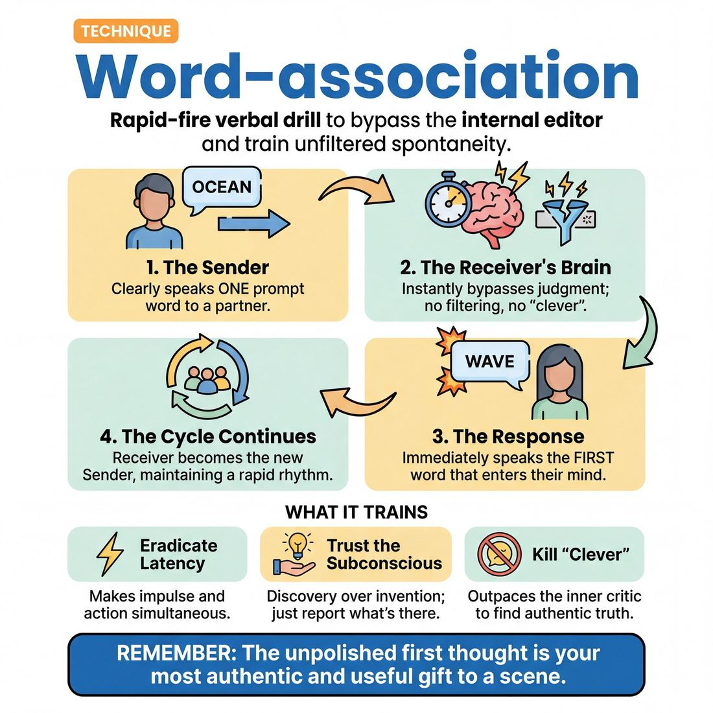

# 🎯 Word-association

> *A drillable muscle that trains **Unfiltered Spontaneity**.*

{ .infographic }

## 🎯 The essence

**Word-association** is a rapid-fire verbal drill where players respond to a spoken prompt with the very first word that enters their mind. At its core, it is a targeted workout for bypassing the **internal editor**—the anxious voice that tells an improviser their idea isn't funny, smart, or logical enough. By forcing players to speak before they have time to judge, filter, or invent, the exercise isolates and trains a single, vital muscle: **unfiltered spontaneity**.

## 🎓 What it trains

If improvisation were a physical sport, word-association would be the standard push-up: a simple, isolated movement designed to build a highly specific foundation. 

The primary obstacle this technique dismantles is the dominance of the internal editor. Most adults navigate the world with an active cognitive filter that evaluates thoughts for social acceptability, logic, or humor before allowing them to be spoken. On the improv stage, this editor is a liability. It manifests as hesitation, fear of judgment, and the desperate, scene-killing desire to be "clever."

By demanding immediate, rhythmic replies, word-association forces the improviser to outpace their own judgment. It trains the brain to bypass the filter entirely, serving the broader goal of achieving complete freedom from hesitation.

Specifically, this technique isolates and trains three micro-skills:

* **Eradicating latency:** It closes the gap between hearing an offer and generating a response, training the nervous system to make impulse and action simultaneous.
* **Trusting the subconscious:** It proves to the improviser, through repetition, that their brain will always provide an answer if they simply get out of their own way. 
* **Killing "clever":** It breaks the habit of scanning the brain for the funniest, most impressive, or most logical word, training the improviser to accept the *first* and *truest* word instead.

!!! abstract "The Internal Editor"
    The internal editor is the voice that whispers, *"That doesn't make sense,"* or *"Think of something funnier before you speak."* Word-association is designed to move at a velocity that the editor simply cannot match. When you strip away the time required to judge an idea, only raw spontaneity remains.

Ultimately, this drill trains the courage to be truthful. It teaches the improviser that their unpolished first thought is not only "good enough," but is actually the most authentic and useful gift they can bring to a scene.

## 💡 Why it works

Word-association works because it pits the lightning speed of your subconscious against the sluggishness of your conscious mind. It is a cognitive trap designed to make overthinking impossible. 

Here is the engine under the hood:

* **Short-circuiting the critic:** The brain's executive function—the part that judges, filters, and worries about being clever—takes milliseconds longer to engage than your raw associative memory. By forcing a rapid, rhythmic pace, this technique starves the editor of the time it needs to veto an idea. You speak before you have the chance to doubt.
* **Discovery over invention:** Improvisers often freeze because they feel the pressure to create something out of thin air. Word-association proves that you never have to invent; you only have to report. Your brain already possesses a massive, pre-existing web of neural connections. "Apple" is already wired to "Tree," which is wired to "Bark," which is wired to "Dog." The exercise shifts the burden from making things up to simply noticing what is already there.
* **Decoupling from logic:** It breaks the paralyzing need to "make sense." By stripping away narrative, character, and environment, the exercise isolates the raw muscle of impulse. It trains the body to accept that an illogical leap (like going from "Ocean" to "Microwave") is not a mistake, but a valid, highly personal subconscious connection.

!!! abstract "The Cognitive Mechanism"
    Think of your brain as a vast, dark room filled with interconnected tripwires. When you hear a word, a specific wire is tripped, instantly lighting up a pathway to the next word. Word-association works by forcing you to simply read the illuminated path, rather than trying to build a new one in the dark.

!!! tip "On stage"
    The mechanism trained here is exactly what saves you when a scene partner throws a massive curveball. Instead of freezing to calculate the "right" narrative response, your associative brain will instantly hand you a reaction. Word-association trains you to actually open your hand and use it.

## 🧩 The setup

To set your players up for success, the physical and mental environment must be primed for speed and focus. Here is exactly what you need to arrange before the first word is spoken:

*   **Players & Group Size:** 6 to 12 players is the sweet spot. Fewer than six, and the turns come too quickly for the brain to reset; more than twelve, and players lose focus waiting for their turn. For high-intensity drilling, this can also be done in isolated pairs.
*   **Arrangement:** A tight, standing circle. Every player must be able to make clear, unobstructed eye contact with everyone else. 
*   **Space & Materials:** An open room, free of physical obstacles. No materials are required, though a soft object (like a foam ball or rolled-up sock) can be used to physically pass focus if the group struggles with eye contact.
*   **Time:** 
    *   *Per round:* 2–3 minutes of continuous, rapid-fire flow. 
    *   *Total duration:* 10–15 minutes, allowing for multiple rounds, brief resets, and speed adjustments.
*   **Roles:**
    *   **The Sender:** Delivers a single word clearly and loudly, locking eyes with another player.
    *   **The Receiver:** Accepts the word and instantly speaks the very first word that pops into their head, immediately becoming the new Sender.
    *   **The Facilitator:** Stands outside the circle to monitor the rhythm, gently call out hesitations, and relentlessly push the group to prioritize speed over cleverness.
*   **Prerequisites:** Familiarity with basic focus-passing (such as *Zip Zap Zop*). Players must already understand how to send and receive energy across a circle without dropping the connection.

!!! tip "On stage: The physical stance"
    Require players to stand with their feet shoulder-width apart, hands out of their pockets, and weight slightly forward. Unfiltered spontaneity is a full-body mechanic; a relaxed, slouching body leads to a relaxed, sluggish brain. 

!!! quote "How to introduce it"
    "We are going to pass a single word around the circle. When someone locks eyes with you and gives you a word, I want you to say the very first word that flashes into your brain, and send it to someone else. Do not judge it, do not try to be funny, and do not try to make sense. If they say 'Tree', and your brain says 'Carburetor', say 'Carburetor'. We are training our brains to bypass the internal editor. Speed is our only goal. I will start. *[Locks eyes with a player]* 'Apple'."

## ⚙️ The mechanics

The objective is to maintain a continuous, unbroken chain of **stimulus and response**. The exercise functions as a high-speed conveyor belt: you cannot control what comes down the line, and you must process it the exact millisecond it arrives.

!!! abstract "The Core Loop"
    Hear the word $\rightarrow$ Trust the flash $\rightarrow$ Speak the word. 
    There is no intermediate step for evaluation, translation, or judgment.

### The Flow of Play

Once the group is in formation, the exercise follows a strict, repeating sequence:

1. **The Seed:** Player A establishes focus and delivers a single, clear word (usually a noun, verb, or adjective). 
2. **The Catch:** Player B actively listens, allowing the word to land. They must not anticipate what the word will be or prepare a response in advance.
3. **The Release:** Player B instantly speaks the very first word that flashes into their mind upon hearing the seed. 
4. **The Chain:** Player C now treats Player B's word as their new seed. They react *only* to Player B, ignoring Player A's original word entirely.
5. **The Reset:** The loop continues indefinitely. If the rhythm breaks, a player hesitates, or someone speaks a phrase instead of a single word, the chain is broken. The group immediately acknowledges the drop (often with a collective clap or a cheerful "Whoops!"), and the next player instantly launches a brand-new seed word to restart the engine.

### Rules & Constraints

To effectively isolate and drill the muscle, players must adhere to a strict set of mechanical constraints:

* **Strict A-to-B Association:** You are only ever reacting to the word immediately preceding yours. You are building a chain, not a cluster. 
* **Zero Latency:** Speed is the primary metric of success. The gap between the end of the previous player's word and the beginning of yours should be practically nonexistent. If you are pausing to find a "good" word, you are editing.
* **No Pre-loading:** Players waiting their turn must keep their minds entirely blank. If you think of a word before the person next to you speaks, you must throw it away. 
* **Single Words Only:** Responses must be exactly one word. Hyphenated concepts (e.g., "ice-cream") are generally accepted, but phrases ("a cold day") break the rhythm.
* **Radical Acceptance:** Whatever word comes out of your mouth is the correct word. Even if it is gibberish, a repetition of the previous word, or something slightly embarrassing, you must say it with full vocal confidence.

!!! warning "Watch out: The 'Category' Trap"
    The most common mechanical failure is **categorizing** rather than **associating**. If Player A says "Apple" and Player B says "Banana," Player C should react to "Banana" (perhaps saying "Peel" or "Slip"). If Player C says "Orange," they have stopped listening to the immediate stimulus and are instead playing a category game called "Fruit." The mechanics demand you abandon the overarching theme and follow the immediate spark.

## 🎬 Sample round

!!! example "Sample round: The Circle in Motion"
    Here is how a rapid-fire round of basic word-association sounds and looks in practice. Notice how the connections naturally shift between logic, alternate meanings, and pure sound, and how the players react to the immediate offer rather than the whole chain.

    *   **Alex** *(turns to Ben, claps)*: "Apple."
    *   **Ben** *(turns to Chloe, claps)*: "Tree."
        * *The classic A-to-B connection. Ben doesn't try to be clever or original; he just accepts the first image that arrives.*
    *   **Chloe** *(turns to Dana, claps)*: "Bark."
        * *Another logical step, but "bark" introduces a homonym (tree bark vs. dog bark). The brain naturally pivots.*
    *   **Dana** *(turns to Eli, claps)*: "Dog."
        * *Dana's unfiltered brain grabs the animal meaning of "bark" rather than the tree meaning. This is perfect—it proves she is reacting only to the immediate word, not trying to maintain a "nature" theme.*
    *   **Eli** *(turns to Alex, claps)*: "Cat."
        * *A standard categorical pair. Highly common, instantaneous, and perfectly acceptable.*
    *   **Alex** *(turns to Ben, claps)*: "Catapult."
        * *A phonetic association. Alex's brain latched onto the "Cat-" sound rather than the animal meaning. This is a great sign of bypassing the logical editor for pure impulse.*
    *   **Ben** *(hesitates, blinks, claps)*: "Castle!"
        * *The editor momentarily froze Ben (a common novice reaction to a surprising or aggressive word like "catapult"), but he recovered by blurting out the very next image that arrived rather than stopping the exercise to apologize.*

## 🎚️ Variations & progressions

Word-association is a highly adaptable chassis. By tweaking the rules, you can isolate different mental muscles, ramping up the cognitive load to push improvisers from hesitant novices to lightning-fast masters.

Here are the most common variations, ordered from foundational to advanced:

### 1. Rhythmic Association (The Metronome)
**Best for:** **Novices (Stage 1)** whose internal editor still wins under pressure.
Add a strict, continuous physical beat—like a collective thigh-slap or a snap—that does not stop. Players must deliver their word exactly on the beat. The relentless rhythm acts as an external pacemaker, forcing the brain to bypass the editor because there simply isn't time to judge the idea.

### 2. Disassociation (A-to-C)
**Best for:** **Advanced Beginners (Stage 2)** who are reliable in basic drills but tend to stay too literal.
Instead of saying a word related to the previous one, the player must say a word completely *unrelated*. 
*   *Player A:* "Apple."
*   *Player B:* "Tractor."
This is notoriously difficult because the human brain is a pattern-matching machine. It trains the improviser to recognize when they are clinging to the safety of logic and forces a lateral leap.

!!! example "In a drill"
    If Player A says "Ocean," Player B's brain will immediately scream "Water!" or "Boat!" To succeed in Disassociation, Player B must acknowledge that impulse, discard it, and grab something entirely disconnected, like "Stapler."

### 3. Mind Meld (Convergence)
**Best for:** Building group mind and trusting shared impulses.
Instead of a circle, two players face each other. A third player gives a suggestion (e.g., "Tree"). The two players lock eyes, count "1, 2, 3," and simultaneously say a word inspired by "Tree." 
*   If they say different words (e.g., "Leaves" and "Wood"), they immediately count "1, 2, 3" again and try to find the association between *those* two new words. 
*   They repeat until they shout the exact same word at the same time.

### 4. Emotional Association
**Best for:** **Competent (Stage 3)** players learning to transition emotion when scene logic calls for it.
Players associate the word normally, but must instantly adopt a strong, distinct emotion with their delivery. The next player takes the word, associates it, and switches to a *completely different* emotion. This layers **Emotional Fluidity** on top of unfiltered spontaneity, training the actor to decouple the literal meaning of a word from how it is felt.

### 5. Word & Gesture (Physical Association)
**Best for:** **Proficient (Stage 4)** players aiming for simultaneous physical and vocal impulses.
The player passes an associated word *and* a distinct physical gesture. The receiving player must associate off the word, but their new gesture must be inspired by the *previous gesture*. This splits the brain, forcing the body and voice to improvise on parallel tracks.

!!! tip "Progression Ramp"
    Use this table to scale the difficulty of your warm-ups based on the room's maturity:

    | Goal | Variation | The Challenge |
    |---|---|---|
    | **Break hesitation** | Rhythmic Association | Can you speak before you think? |
    | **Break obvious patterns** | Disassociation | Can you abandon the first logical connection? |
    | **Sync with a partner** | Mind Meld | Can you anticipate a shared cultural leap? |
    | **Layer emotional craft** | Emotional Association | Can you feel an emotion instantly, regardless of the word? |
    | **Full-body spontaneity** | Word & Gesture | Can your body and voice associate simultaneously? |

!!! warning "Watch out"
    When introducing harder variations, players will naturally slow down. Remind them that **speed and flow are more important than accuracy**. If someone fails at Disassociation and accidentally says a related word, celebrate the failure and keep the rhythm moving. Stopping to apologize re-engages the editor.

## 🧑‍🏫 Coaching notes

The coach’s primary role during word-association is to act as a human metronome and a pressure-release valve. You are training a reflex, which means your coaching must actively discourage players from thinking, judging, or trying to be clever. 

!!! tip "Coaching: Prioritize rhythm over logic"
    The single most important side-coaching cue is: **"Keep the beat."** 
    
    If players focus entirely on maintaining a steady, unbroken rhythm, the brain is forced to bypass the internal editor. The rhythm is the vehicle that outruns hesitation. If they stumble, tell them: *"Just repeat the word you just heard to keep the beat alive."*

When players are in the circle, keep your side-coaching continuous, rhythmic, and encouraging. Use short phrases that slip into the spaces between their words without disrupting the flow:

* **"First thought."** (Reminds them not to dig for a second, "better" word).
* **"Breathe."** (Physical tension causes mental hesitation; remind them to exhale).
* **"Let it be weird."** (Gives explicit permission for non-sequiturs and removes the pressure to make sense).
* **"Faster."** (Pushing the tempo forces players out of their heads and into pure reaction).

### What 'Good' Looks and Sounds Like
How do you know the technique is actually working? Look for these observable signs of success:

* **Hypnotic pacing:** The group establishes a shared heartbeat. The gap between one player's word and the next player's word is identical every time.
* **Neutral delivery:** Players aren't "acting out," inflecting, or selling the words. They are simply passing the data along.
* **Physical stillness:** The body is relaxed. You won't see the classic physical tells of the internal editor—eyes darting to the ceiling to search for a word, shoulders tensing, or apologetic grimacing.
* **Acceptance of garbage:** When a player says a made-up word, stutters, or makes a bizarre leap in logic, the next player accepts it instantly without laughing, questioning, or breaking the rhythm.

!!! note "Intervening on a crash"
    When the rhythm inevitably breaks and a player freezes, **do not stop the exercise**. Do not let them apologize. Simply snap your fingers to re-establish the beat and say, *"Keep going, start with [Random Word]."* Train the group to recover instantly rather than wallowing in the mistake.

## 🧭 Debrief & reflection

After the rapid-fire pace of the drill, the debrief is where the actual cognitive rewiring happens. The goal is to shift the players' focus away from *what* words were said and toward *how* it felt to say them. By articulating their internal experience, players begin to recognize the physical and mental signatures of their own hesitation.

Use these questions to guide the conversation:

*   **"Where did you feel the hesitation in your body?"** 
    Prompt players to identify the physical sensation of the internal editor. They might notice holding their breath, tensing their shoulders, or breaking eye contact right before they get stuck.
*   **"Did anyone catch themselves throwing away a word?"** 
    Ask if anyone had a word pop into their head, judged it as "weird," "wrong," or "unrelated," and scrambled to find a better one. 
*   **"What did it feel like when the circle was moving at top speed?"** 
    Contrast the feeling of being "stuck" with the feeling of flow. Players often describe the fast moments as a kind of out-of-body surrender, where the words simply fall out of their mouths.
*   **"Did anyone say a word that surprised them?"** 
    Celebrate the bizarre, subconscious leaps. This reinforces that the goal is unfiltered truth, not logical progression.

### What a good debrief surfaces

A successful reflection period normalizes the struggle of the **Novice** (whose editor wins under pressure) and points them toward the **Competent** stage (choosing to bypass the editor). 

Players will inevitably confess to trying to be clever, attempting to steer the pattern, or feeling embarrassed by a nonsensical association. The coach's role here is to validate these feelings as universal symptoms of the brain's defense mechanisms. The debrief should lead the group to a shared realization: the delay between hearing a word and saying a word is never a lack of ideas; it is entirely the friction of judgment.

!!! abstract "The Myth of the Blank Mind"
    Players will often say, "My mind just went completely blank!" Use the debrief to gently challenge this. The brain is an association machine; it is *never* truly blank. What they experienced as "blankness" was actually their internal filter rejecting the first thought so quickly and violently that they didn't even consciously register it. The drill trains them to catch that rejected thought before it hits the trash can.

## ⚠️ Common pitfalls

Word-association is a stress test for the brain. Under the cognitive load of maintaining rhythm and being watched, novices instinctively deploy defense mechanisms to protect themselves from looking foolish. Recognizing these traps is the first step to dismantling them.

!!! warning "Watch out: The 'Cleverness' Trap"
    The single most common mistake in word-association is trying to be funny, original, or interesting. When a player tries to invent a "good" word, their internal editor intercepts the raw impulse. This causes a visible delay, breaks the rhythm, and kills the spontaneity. 
    
    **The Fix:** Give yourself permission to be entirely boring. The most obvious, mundane word that arrives in your brain is the correct word. 

**Pre-loading (The Anticipation Trap)**
* **The Trap:** A player panics about the impending silence and thinks of a word *before* their partner even speaks. When the partner says "Ocean," the player blurts out "Toaster" because they had it chambered.
* **Why it breaks:** It completely severs listening. The exercise stops being an association and becomes a random word generator.
* **The Fix:** Focus entirely on the partner's mouth. Keep the mind aggressively blank until their word lands. Breathe in their word; exhale your response.

**The Rhyming Crutch**
* **The Trap:** Responding to "Cat" with "Bat," or "Blue" with "Shoe." 
* **Why it breaks:** Under pressure, the brain shifts from semantic or emotional association (connecting meanings) to phonetic matching (connecting sounds). It is a cognitive shortcut that avoids the vulnerability of a true, unfiltered thought.
* **The Fix:** Visualize the *object* or *concept* of the prompt word, rather than looking at the word as letters on a page. See the "Cat," don't spell it.

**The Post-Word Apology**
* **The Trap:** A player blurts out a word, then immediately grimaces, laughs nervously, or says, "Wait, why did I say that?"
* **Why it breaks:** Judging the output reinforces the internal editor's power. It trains the brain that raw impulses are dangerous, embarrassing, or wrong, which guarantees hesitation on the next turn.
* **The Fix:** Commit to the blurt. Treat every word that leaves your mouth as a brilliant gift, no matter how bizarre the connection seems. 

!!! tip "On stage: The 'Right Answer' Hesitation"
    If you find yourself pausing because you are searching for the most logical connection (e.g., hearing "Salt" and freezing until you find "Pepper"), you are prioritizing logic over speed. **Speed is the priority.** If "Shoelace" pops into your head first, say "Shoelace." The logic of the subconscious is often far more interesting than the logic of the conscious mind.

## 🌟 What mastery looks like

When an improviser reaches mastery in word-association, the exercise ceases to be a mental puzzle and becomes a purely physical reflex. The master improviser operates with **zero latency** between impulse and offer. They are no longer searching their brain for a word; they are simply opening their mouth and letting the incoming word knock the next one out.

Here is what mastery looks like in the room:

*   **Zero latency:** The rhythm of the exercise is unbroken. The master's word lands on the exact beat following the cue, creating a seamless, hypnotic cadence. 
*   **Physical stillness:** The "thinking face" is gone. There is no looking up at the ceiling, no squinting, no snapping of fingers, and no shifting of weight. The body remains relaxed, breathing, and grounded.
*   **Radical acceptance:** The internal editor is completely bypassed. Whether the word is profoundly poetic, completely nonsensical, a direct rhyme, or just a repetition of the previous word, the master delivers it with equal neutrality. They do not laugh at, apologize for, or judge their own output after it leaves their mouth.
*   **Absolute presence:** Because they are not pre-planning, their eyes remain locked on their partner. They are listening with their whole body, allowing the *sound*, *tone*, and *meaning* of the incoming word to trigger their response simultaneously.

!!! abstract "The Conduit State"
    A master treats their brain like a pane of glass, not a filter. The incoming word hits them, and the outgoing word passes straight through without being inspected, polished, or judged for "cleverness" along the way.

!!! example "In the room"
    Watch a circle of highly proficient improvisers do this drill. It sounds less like a conversation and more like a drum circle. The words blur together—*Tree, Bark, Dog, Bite, Apple, Red, Blood, Vampire*—at a speed that proves conscious thought has been entirely removed from the equation. There are no gaps, no hesitations, and no apologies.

## 🔗 Why it matters

Word-association is the fundamental isolation exercise for unfiltered spontaneity. Just as a musician practices scales to build muscle memory so their fingers can fly across the keys during a performance, an improviser drills word-association to train their brain to generate and release ideas without friction. 

In the domain of **The Self**, the ultimate goal is absolute freedom from hesitation and the courage to be truthful. The greatest enemy to this freedom is that anxious, hyper-vigilant voice that intercepts an impulse and asks, *"Is this funny? Is this clever? Does this make sense?"* 

Word-association systematically starves the editor of the time it needs to judge. By forcing a rapid, rhythmic response, the improviser learns a profound physical and psychological lesson: the first thought is not only "good enough," it is usually the most authentic and useful thing they could possibly offer. 

!!! abstract "The Scene is an Association"
    At its core, every two-person scene is a complex, high-stakes game of word-association. Your partner says, *"I'm leaving you, Harold,"* and your brain must instantly associate off their words, their emotional tone, and the established reality. If you hesitate to judge your impulse, the reality of the moment fractures. If you trust the association, the scene breathes.

As this muscle strengthens, its impact ripples outward across the wider craft:

*   **It transforms listening:** When you no longer fear what you are going to say next, you stop pre-planning. You can finally afford to give 100% of your attention to your scene partner, trusting that their offer will automatically trigger your response.
*   **It grounds character work:** True character reactions are instantaneous. If you have to think about how a character would react, you are playing an idea of a character, not living in them. 
*   **It builds ensemble trust:** An improviser who associates freely is highly predictable in the best way—they are present, responsive, and undefended. Scene partners feel safe playing with someone who reacts honestly in the micro-second, rather than someone who pauses to invent a "better" joke. 

Ultimately, word-association proves to the improviser that they are already full of ideas. It shifts the artist's mindset from *inventing* to *discovering*, proving that the subconscious mind is vastly faster, weirder, and more brilliant than the conscious, calculating ego.

## 📚 References & Further Reading

### Foundational sources
* **Viola Spolin, *Improvisation for the Theater* (1963)** — The foundational text of modern improvisational theater. Spolin introduces word association and focus-passing games as primary tools for bypassing self-consciousness. She argues that the pressure to invent or be "clever" creates a barrier to true play, and that rapid-fire games force the improviser out of their intellect and into a state of intuitive, physical response. Her exercises are the direct ancestors of the modern word-association drill. [Read via Northwestern University Press](https://nupress.northwestern.edu/9780810140080/improvisation-for-the-theater/)
* **Keith Johnstone, *Impro: Improvisation and the Theatre* (1979)** — A seminal exploration of spontaneity and the psychological blocks that prevent it. Johnstone explicitly identifies the "censor" (the internal editor) that stifles adult creativity, arguing that traditional education trains us to suppress our most obvious, truthful ideas in favor of "original" ones. He details how free association exercises can bypass this filter, proving to the improviser that their unpolished first thoughts are not only sufficient, but inherently more valuable than calculated inventions. [Read via Routledge](https://www.routledge.com/Impro-Improvisation-and-the-Theatre/Johnstone/p/book/9780878305251)

### Practitioner guides & manuals
* **Mick Napier, *Improvise: Scene from the Inside Out* (2004)** — A direct assault on the paralyzing effect of the internal editor. Napier addresses the exact moment of hesitation that word-association seeks to eradicate: the fraction of a second where an improviser judges their own idea and decides not to say it. He offers practical, no-nonsense techniques for trusting your subconscious instincts and taking immediate action, arguing that doing *something*—anything—is always better than letting the brain filter, judge, or stall. 
* **Charna Halpern, Del Close, and Kim "Howard" Johnson, *Truth in Comedy: The Manual of Improvisation* (1994)** — The definitive guide to long-form improvisation and the Harold. This book details the "Pattern Game," a group word-association exercise used to generate themes and discover subconscious connections. The authors emphasize that the goal is not to invent witty statements, but to find the truth in the immediate, organic connections the brain makes, effectively bypassing the improviser's desperate need to be "funny."
* **Patricia Ryan Madson, *Improv Wisdom: Don't Prepare, Just Show Up* (2005)** — A philosophical and practical guide to trusting the subconscious mind. Madson, a Stanford professor, explores how relaxing the "clever" muscles and accepting the first thing that comes to mind leads to unfiltered spontaneity. Her maxims—particularly "Say Yes" and "Aim for Average"—perfectly encapsulate the mindset required to succeed at word-association, teaching players that their ordinary, unfiltered thoughts are more than enough.

### Research & theory
* **Carl Jung, *The Association Method* (1910)** — The foundational psychological basis for word association. Jung's early clinical work with the Word Association Test demonstrated that rapid, unfiltered verbal responses bypass conscious control, revealing the underlying neural connections and emotional realities of the subconscious mind. Jung proved that when forced to respond immediately to a stimulus word, the brain relies on pre-existing associative pathways rather than conscious invention—the exact cognitive mechanism that improv drills exploit. [Read the archive](https://psychclassics.yorku.ca/Jung/Association/)
* **Charles J. Limb and Allen R. Braun, "Neural Substrates of Spontaneous Musical Performance: An fMRI Study of Jazz Improvisation" (*PLoS One*, 2008)** — A landmark neuroimaging study proving the biological reality of the "internal editor." By putting jazz musicians in an fMRI machine, the researchers found that during spontaneous improvisation, the dorsolateral prefrontal cortex (the brain's conscious self-monitoring and filtering center) actively deactivates. Simultaneously, the medial prefrontal cortex (associated with self-expression) activates. This study provides the hard scientific proof for why rapid-fire improv drills work: they literally shut down the brain's judgment center. [Read the study](https://journals.plos.org/plosone/article?id=10.1371/journal.pone.0001679)

### Talks, videos & courses
* **Charles Limb, *Your Brain on Improv* (TED, 2010)** — A highly accessible, engaging breakdown of Limb's fMRI research on improvisers and freestyle rappers. He explains the neurological mechanism of "letting go" and how starving the internal critic of time allows raw, unfiltered creativity to emerge. This talk is an excellent resource for improvisers who want to understand the literal brain chemistry behind the feeling of "flow" and the eradication of latency. [Watch the talk](https://www.ted.com/talks/charles_limb_your_brain_on_improv)

### Communities & adjacent reading
* **Mihaly Csikszentmihalyi, *Flow: The Psychology of Optimal Experience* (1990)** — The foundational text on "flow," the state of deep absorption where self-consciousness and the internal editor vanish. Word-association drills are micro-exercises in achieving this exact psychological state, training the brain to operate purely on impulse and immediate feedback without the latency of self-doubt.

## 💬 Quotes & Anecdotes

!!! quote "— Mick Napier, *Improvise: Scene from the Inside Out* (2004)"
    Look around and find an object. Say the name of the object out loud, and immediately start talking about the object. [...] After about ten seconds, without pausing, interrupt yourself with the name of a new object. [...] The whole point here is to practice talking and catching up with yourself.

!!! quote "— Charna Halpern, Del Close, and Kim \"Howard\" Johnson, *Truth in Comedy* (1994)"
    The Pattern Game is basically a word association game. The players take turns calling out words and short phrases inspired by previous words and phrases, in order to connect as many pieces of information as possible. Connections made during the game moves will allow players to discover different levels of meaning to their ideas.

!!! quote "— Keith Johnstone, *Impro: Improvisation and the Theatre* (1979)"
    We struggle against our imaginations, especially when we try to be imaginative... we are not responsible for the content of our imaginations.

### Where it comes from
Word association as a theatrical training tool traces its roots back to Viola Spolin's *Theater Games*, developed in the 1940s and 50s. Spolin used rapid-fire association exercises to help actors bypass their intellect, break down inhibitions, and tap into intuitive, spontaneous responses. The concept was later adapted by Del Close and Charna Halpern into the "Pattern Game," which serves as the foundational opening exercise for the famous long-form improv structure known as the Harold.

### A telling example
In *Truth in Comedy*, the authors provide a classic example of how rapid word association bypasses the literal mind to uncover deeper themes. When a group is given the seed word "Camera," their rapid-fire associations might flow like this: 

*"High school. High speed. Dope. Indy 500. Crash and burn. In memoriam. Viet Nam. Don't write on the wall. Smokin'. I caught you. Smile! I think I got it."*

Because the players are moving too fast to judge or filter their ideas, they organically move away from the literal concept of photography. Instead, the unfiltered associations hand them rich, unexpected themes—speed, tragedy, memory, and surveillance—which they can then use to inspire fully fleshed-out scenes. 

To train this muscle individually, director Mick Napier uses a solo word-association drill designed to forcefully break the internal editor. He instructs improvisers to look at an object, say its name, and immediately start talking about an experience it inspires without pausing. After ten seconds, they must abruptly interrupt themselves with the name of a new object and instantly pivot. The goal is to eliminate the "buffer"—the moment where an improviser repeats a word or pauses to give their brain time to catch up—training them to speak instantly and trust that their subconscious will provide the context.

## 🧭 Explore the framework

- ⬆️ **Skill it trains:** [Unfiltered Spontaneity](01_S1__unfiltered-spontaneity.md)
- 🎭 **Domain:** [The Self](01_D__the-self.md)
- 🔁 **Sibling techniques:** [First Thought drills](01_S1_T2__first-thought-drills.md), [Bring a Brick](01_S1_T3__bring-a-brick.md)
