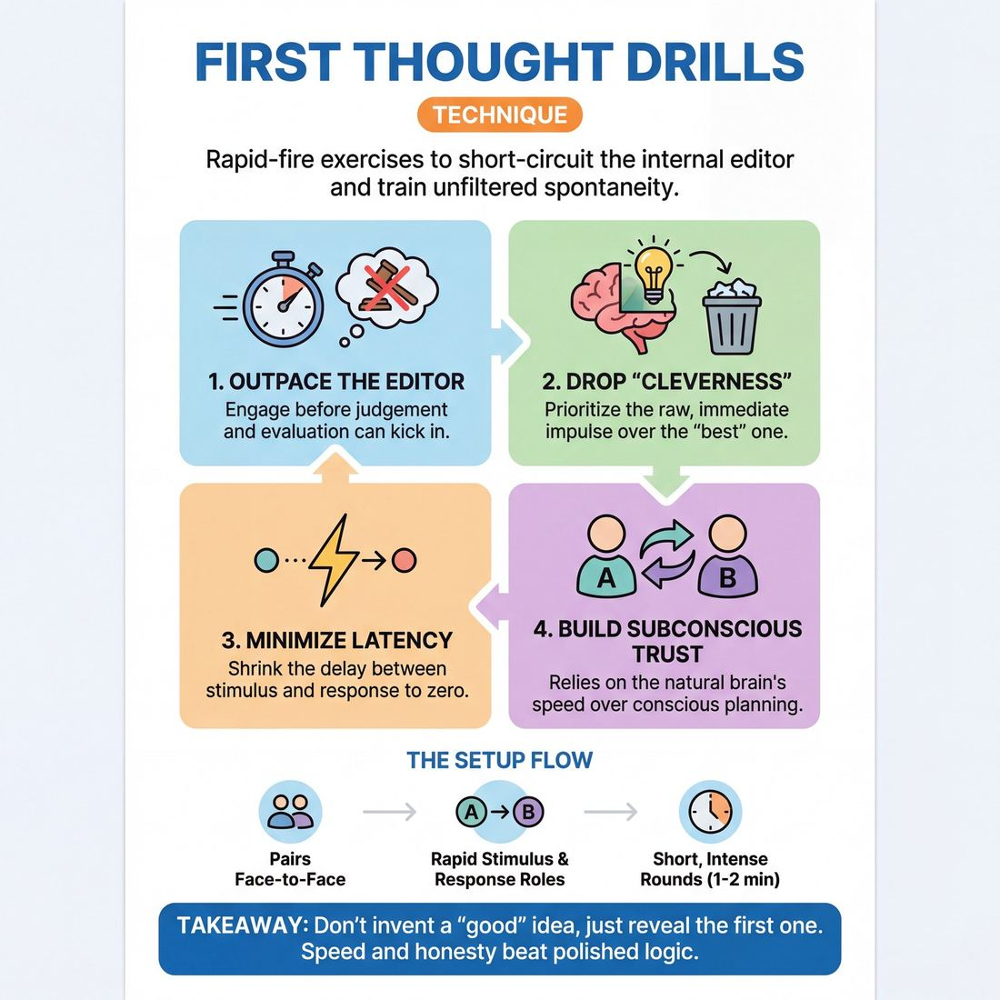

# 🎯 First Thought drills

> *A drillable muscle that trains **Unfiltered Spontaneity**.*

{ .infographic }

## 🎯 The essence

**First Thought drills** are a family of rapid-fire exercises—such as word association, rapid categorization, or physical impulse passing—designed to short-circuit the brain's **internal editor**. By stripping away the time required to judge, filter, or "improve" an idea, they force the improviser to rely entirely on instinct. Ultimately, these drills isolate and train a single, vital muscle: **unfiltered spontaneity**, the act of trusting and expressing the very first impulse that arises before fear, logic, or the desire to be clever can get in the way.

## 🎓 What it trains

First Thought drills are the primary gym equipment for building unfiltered spontaneity. They exist to solve one of the most pervasive and paralyzing problems in improvisation: the hesitation caused by self-judgment.

When an improviser receives a stimulus—a word, a physical gesture, or a line of dialogue—their brain instantly supplies a reaction. But almost immediately, a secondary cognitive process kicks in to evaluate it: *Is it funny? Is it too weird? Does it make sense? Will my scene partner like it?* 

This judgment creates **latency**—a split-second delay that kills momentum, flattens energy, and pulls the performer out of the present moment. First Thought drills attack this hesitation directly. By forcing a response at a speed that outpaces conscious thought, the improviser learns to trust their raw, unpolished impulses.

Specifically, these drills isolate and train three sub-skills:

* **Latency reduction:** Shrinking the gap between receiving a stimulus and offering a response, moving toward the ultimate goal where impulse and action are simultaneous.
* **Silencing the critic:** Starving the internal editor of the time it needs to sanitize or reject an idea.
* **Dropping "cleverness":** Breaking the habit of trying to invent the "best" or "funniest" response, replacing it with the courage to offer the *truest* or most immediate one.

!!! abstract "Key idea: Trusting the Subconscious"
    Your brain is a highly efficient, deeply associative pattern-recognition machine. It is already faster, more surprising, and more creative than your conscious, anxious mind. First Thought drills teach you a profound lesson in self-trust: you do not need to *invent* a good idea; you only need to *reveal* the one that is already there.

## 💡 Why it works

These drills work by exploiting a simple cognitive loophole: your brain can generate an impulse faster than it can judge it. 

The engine under the hood relies on three distinct mechanisms to break down hesitation and build trust in the subconscious:

* **Outrunning the internal editor:** Engaging your cognitive filter takes a fraction of a second. By forcing a relentless, rapid-fire pace, these drills physically deny the brain the time required to evaluate the thought. The editor is bypassed, leaving only raw instinct.
* **Absolution from quality:** When the strict rule of the exercise is to say the *very first* thing that comes to mind, players are entirely relieved of the pressure to be original or "good." If a player blurts out something bizarre, mundane, or nonsensical, it isn't a failure—it is a successful execution of the drill. This dramatically lowers emotional stakes and cures performance anxiety.
* **Rewiring the reward system:** In daily life, we are rewarded for polished, logical communication. In a First Thought drill, the group celebrates unpolished impulses. Experiencing this shared vulnerability and acceptance rewires the improviser to trust their subconscious, proving that their natural, unedited brain is already enough.

!!! abstract "Key idea: The Core Metric is Latency"
    The true target of these drills is minimizing latency. The longer the delay, the more time the ego has to hijack the impulse and invent something "better." By systematically shrinking that gap to zero, the improviser learns to merge impulse and action into a single, simultaneous event.

## 🧩 The setup

Before a single word is spoken, the physical and mental environment must be primed for speed and trust. Because bypassing the internal editor is vulnerable work, the setup must feel safe, focused, and highly structured.

* **Players & arrangement:** Divide the room into pairs. Players stand face-to-face, about an arm's length apart. This proximity forces focus and prevents the eyes from darting around the room to "look for" an answer. 
* **Space & materials:** An open floor. No chairs, no props, and no physical obstructions between the partners. 
* **Time:** 1 to 2 minutes per round. Total exercise time: 5 to 10 minutes. Keep rounds deliberately short; sustaining unfiltered spontaneity is mentally exhausting, and players will naturally start to hesitate if the drill drags on.
* **Roles:** 
    * **The Prompter (Player A):** Delivers a rapid, continuous stream of simple stimuli (words, questions, or physical gestures, depending on the variation).
    * **The Responder (Player B):** Reacts instantly to the stimulus with their absolute first thought, word, or sound. 
    * *Note: Roles are strictly divided and swap only when the facilitator calls time.*
* **Prerequisites:** A baseline level of group trust. Players should already understand the concept of the internal editor and agree to the goal of prioritizing speed over cleverness.

!!! quote "Facilitator Script"
    "Find a partner and stand facing them, close enough to hold unbroken eye contact. We are going to practice outrunning the internal editor. 
    
    Player A, you are the Prompter. You will give Player B a simple, random word. Player B, you are the Responder. Your only job is to say the absolute first thing that flashes into your brain the millisecond you hear the prompt. 
    
    Do not try to be funny. Do not try to make sense. If your first thought is a grunt, grunt. If your first thought is the exact same word they just said, say it back. We are training speed, not quality. If you feel yourself pause to pick a 'better' word, you've lost the race. Player A, as soon as B answers, hit them with the next word. Fast, relentless, and completely unfiltered. Let's go."

!!! tip "On stage"
    Encourage players to keep their hands out of their pockets and their bodies relaxed but alert. Physical tension often mirrors mental hesitation. A loose body yields a faster first thought.

## ⚙️ The mechanics

The core objective of any First Thought drill is to reduce latency to absolute zero. Here is the baseline flow of play for a standard two-person rapid-fire drill:

1. **The Stimulus:** Player A (the Prompter) delivers a single, clear prompt to Player B (the Responder). This is usually a random noun, but can be a question or a physical gesture.
2. **The Reception:** Player B maintains unbroken eye contact, taking in the prompt without looking away, shifting their weight, or breaking physical presence.
3. **The Output:** Player B instantly says the very first word, phrase, or sound that enters their mind. They do not evaluate it; they simply expel it.
4. **The Loop:** The moment Player B finishes speaking, Player A fires the next prompt. There is no pause for laughter, apology, or explanation.

!!! abstract "Key idea: Speed Over Sense"
    In this drill, speed is the *only* metric of success. If the response makes no logical sense, that is perfectly fine. If the response is a repetition of the prompt, that is fine. The only failure state is hesitation.

**Rules of Engagement**

* **No filtering:** You must say the actual first thought, even if it feels boring, weird, or completely unrelated. 
* **No "buying time":** Fillers like "Umm," "Well," or repeating the prompt as a question ("Apple? Uh...") are signs the editor is working. Strip them away.
* **Maintain the rhythm:** The Prompter is responsible for the tempo. They must feed the next stimulus like a pitching machine, forcing the Responder to stay out of their head.
* **No apologies:** If a Responder says something nonsensical, they must not break the flow, laugh at themselves, or apologize. Accept the output and prepare for the next pitch.

!!! tip "On stage"
    While you won't do rapid-fire word association in a real scene, this mechanic trains the muscle of unfiltered spontaneity. When your scene partner says, "I'm leaving you, Harold," the mechanic kicks in: you trust the immediate flush of emotion or the very first line of dialogue that hits your brain, rather than pausing for three seconds to invent a "clever" retort.

**Ending and Resetting**

A standard round runs for a strict time limit—usually 30 to 60 seconds. Because the cognitive load of actively bypassing the editor is surprisingly high, longer rounds lead to fatigue, which invites hesitation back in. At the end of the time limit, the players take a collective deep breath to reset their nervous systems, shake out the tension, and then swap roles.

## 🎬 Sample round

Here is how a standard First Thought drill (in this case, a rapid-fire Word Association circle) looks and sounds when the internal editor is caught in the act, and how a coach resets the mechanic.

!!! example "In a scene: Word Association"
    **Alex:** "Apple." 
    *(A clean, neutral starting offer. The mechanic is in motion.)*
    
    **Ben:** "Tree." 
    *(Instantaneous response. Zero latency between hearing the prompt and speaking.)*
    
    **Chloe:** "Bark." 
    *(Riding the momentum, trusting the immediate, obvious connection to 'Tree'.)*
    
    **David:** *(Pauses for a half-second, eyes dart up, chuckles nervously)* "Dog." 
    *(The rhythm breaks. The physical tells—darting eyes, a slight pause, a nervous laugh—indicate the editor has stepped in.)*
    
    **Coach:** "Hold there. David, what was the very first word that flashed in your head when Chloe said 'Bark'?"
    
    **David:** "I thought of 'Wood', but it felt too boring, so I changed it to 'Dog' to be clever."
    
    **Coach:** "That half-second pause was your brain judging the idea. In this drill, 'Wood' is the perfect answer because it was your *first* answer. We want the boring and the obvious. Let's rewind and bypass the filter. Chloe, give him 'Bark' again."
    
    **Chloe:** "Bark."
    
    **David:** "Wood." 
    *(Instantaneous, no judgment. The latency is gone.)*
    
    **Alex:** "Cabin." 
    *(The rhythm is restored, and the group speed increases.)*

## 🎚️ Variations & progressions

To move improvisers from a **Novice** state—where the internal editor still wins under pressure—to a **Proficient** state where impulse and action are simultaneous, you must systematically increase the speed, cognitive load, or physical demands of the drill. 

Here is how to ramp the difficulty, moving from basic circle games to high-pressure scene applications.

### Phase 1: Loosening the Editor (Advanced Beginner)
At this stage, players can offer their first thought reliably in isolated drills, provided the stakes remain low.

* **Five Things:** A player is given a prompt (e.g., "Five things you find in a billionaire's pocket"). They must list five items as rapidly as possible while the group counts them out loudly ("One! Two!"). 
    * *The progression:* The speed forces the player to abandon logic. By item four, they are usually saying nonsense (e.g., "A smaller pocket!"), which successfully bypasses the editor.
* **A-to-C Word Association:** Instead of obvious, linear connections (A-to-B, like "Dog" ➔ "Cat"), players practice lateral leaps. If the word is "Dog," the player silently thinks of "Bark" (B) but says "Tree" (C). This trains the brain to trust the associative leap rather than the most obvious logical step.

### Phase 2: Adding Pressure & Body (Competent)
To reach the Competent stage, players must learn to bypass the editor under mild scene pressure and integrate their physical instrument.

* **The Hot Seat (Rapid Interrogation):** One player stands in the center of the circle. The group fires a relentless barrage of random, unrelated questions at them. The player must answer every question instantly, without hesitation or contradiction.
* **Physical First Thought (Sound & Motion):** Moving the impulse out of the verbal brain entirely. Player A makes a loud, abstract sound and a large physical movement. Player B instantly mirrors it, then immediately transforms it into a completely new sound and movement to pass to Player C. 

!!! example "In a scene: The Hot Seat"
    **Circle:** "Where are my keys?"  
    **Player:** "In the fridge!"  
    **Circle:** "Why did you leave the circus?"  
    **Player:** "The clowns were unionizing!"  
    **Circle:** "What's your favorite color?"  
    **Player:** "Tuesday!"  
    *(The goal is zero latency, not logical accuracy. "Tuesday" is a perfect first-thought answer if it arrives instantly.)*

### Phase 3: Scene Integration (Proficient to Master)
At the highest levels, there should be no measurable latency between an impulse and an offer. The drill moves from a standalone exercise into actual scene work.

* **Blind Scene Starts:** Two players stand back-to-back. The coach calls out a single suggestion (e.g., "Porcupine"). The players instantly spin around to face each other and initiate a scene using their very first physical and verbal impulse. They are not allowed to plan a clever opening line while turning; they must speak and move the moment they see their partner.
* **First Thought Monologues:** A player steps forward and begins speaking on a suggested word. They must speak continuously for 60 seconds without pausing, stuttering, or planning the next sentence. They must let the end of one sentence dictate the beginning of the next, trusting that the thought will complete itself.

!!! tip "On stage"
    When coaching any of these progressions, prioritize **rhythm over content**. If a player hesitates to find a "good" answer, stop the drill and restart. The only way to kill the editor is to outrun it.

## 🧑‍🏫 Coaching notes

As a coach, your primary job during First Thought drills is to act as a human metronome and a relentless cheerleader for speed. You are trying to help students outrun that split-second hesitation where the brain judges an idea before letting the mouth say it. 

To do this, you must create an environment where hesitation is the only "mistake," and making zero sense is a victory.

!!! tip "On stage: Reward the Nonsense"
    The single most important cue you can give is to actively celebrate when a student blurts out something completely illogical. If the category is "Things in a kitchen" and a student panics and yells "Shoe!", stop the drill and praise them loudly. That nonsensical answer proves they successfully bypassed their editor and prioritized pace over perfection. 

### 👀 What to watch for
You can physically see when a student is thinking versus when they are reacting. Watch their bodies closely and coach the physical tells:

* **The Eyes:** Are they locked on their partner, or do they dart up to the ceiling? Looking up is the universal physical tell for "searching the brain." Coach them to keep their eyes anchored on their partner.
* **The Breath:** Are they holding their breath in anticipation? Tension breeds hesitation. A relaxed, breathing improviser is a spontaneous one.
* **The Preamble:** Listen for the micro-hesitations—the "um," the "uh," or the nervous half-laugh that precedes their word. Coach them to drop the preamble and let the word strike cleanly.

### 🗣️ Active side-coaching
Keep your side-coaching rhythmic, supportive, and continuous. Speak over the exercise to keep the energy high and the pace driving forward. Use short, punchy directives:

* *"Faster. Don't give yourself time to think."*
* *"Breathe and blurt!"*
* *"Whatever is on your tongue right now, let it out."*
* *"Stay in the room. Look at your partner."*
* *"If you drop the rhythm, just pick it right back up. Keep moving."*
* *"First thought, best thought. Don't fix it!"*

!!! note "Adjusting the pressure"
    If the group is freezing up, lower the cognitive load. Switch to a simpler variation (like simple word association) but demand a faster rhythm. If they are cruising easily, increase the speed until the wheels start to wobble. The drill only works if they are operating right at the edge of their processing speed.

## 🧭 Debrief & reflection

The goal of the debrief is to move players from the adrenaline of the exercise into a conscious awareness of their own internal editor. Because this drill moves so quickly, players often don't realize what they are doing until they are asked to stop and reflect on the physical and mental sensations of the work.

Gather the group in a circle and use these questions to unpack the experience:

* **"Where did you physically feel your editor step in?"** 
    * *What it surfaces:* Hesitation isn't just mental; it is somatic. Players will often report a tightening in the chest, a held breath, or a physical stutter right before they self-censor. Identifying this physical tell is the first step to bypassing it.
* **"Did anyone say something that completely surprised them?"**
    * *What it surfaces:* The joy of unfiltered spontaneity. When players move faster than their conscious brain, they often blurt out words or associations they didn't know they had in them. This highlights that the subconscious is a richer, more interesting writer than the conscious mind.
* **"What happened when you tried to be clever or funny?"**
    * *What it surfaces:* The realization that invention causes latency. Players will readily admit that the moment they tried to think of a "good" word, they froze, broke the rhythm, or panicked. 
* **"Did anyone feel embarrassed by a word they said?"**
    * *What it surfaces:* The fear of judgment. First thoughts are often mundane, nonsensical, or slightly inappropriate. Acknowledging this normalizes the vulnerability required to truly drop the filter.

!!! abstract "Key idea: The Core Realization"
    A successful debrief should lead the room to a shared epiphany: **your brain is always providing an answer.** The blankness or "freezing" players experience on stage is never a lack of ideas; it is the friction of the editor rejecting the first idea, the second idea, and the third idea in search of a "better" one. 

!!! tip "On stage: Normalizing the mundane"
    If players express frustration that their first thoughts were "boring" (e.g., responding to "Apple" with "Red"), remind them that in scene work, obvious, grounded truths are exactly what build a believable reality. The goal is speed and truth, not comedic genius.

## ⚠️ Common pitfalls

!!! warning "Watch out: The Comedy Filter"
    The single most common trap in First Thought drills is trying to be *funny* or *clever* rather than honest. When improvisers feel the pressure of being watched, the brain’s internal editor intercepts the true first thought, judges it as "too boring" or "too weird," and scrambles to invent a joke. This creates a visible micro-hesitation, breaks the rhythm of the drill, and entirely defeats the purpose of training unfiltered spontaneity. 

When cognitive load increases—usually through speed or added physical tasks—the brain’s defense mechanisms kick in. Here is how the drill typically breaks down for novices, and how to fix each trap:

* **Pre-planning (The "Waiting Room")**
    * *The Trap:* Instead of staying present, the improviser looks at the floor and thinks of their word or action *before* the prompt even reaches them. 
    * *The Symptom:* Their response has zero connection to the prompt given to them, or they panic if the pattern suddenly changes.
    * *The Fix:* Force eye contact. Instruct players to keep their eyes locked on the person passing to them. You cannot pre-plan if you are actively absorbing what is happening right now.
* **The Apologetic Wince (Post-Thought Judgment)**
    * *The Trap:* The player successfully blurts out their first thought, but immediately pulls a face, laughs nervously, or says, "Wait, that makes no sense."
    * *The Symptom:* The rhythm of the circle dies as the player tries to socially distance themselves from their own subconscious.
    * *The Fix:* Coach **commitment to the blurt**. Instruct players to maintain a neutral or confident physical posture after speaking. The drill is about the *speed* of the connection, not the *quality* of the word.
* **The Panic Freeze (Deer in Headlights)**
    * *The Trap:* The speed of the drill overwhelms the player's processing power. The mind goes completely blank, and the body physically freezes.
    * *The Symptom:* A long, agonizing silence where the player stares blankly, trying to force a thought into existence.
    * *The Fix:* Lower the stakes instantly. Tell the frozen player to name a physical object they can see in the room, or simply repeat the prompt word back. Getting *any* words out of the mouth restarts the engine.
* **Parroting (Echolalia)**
    * *The Trap:* The brain panics under the pressure of speed and simply repeats the exact word or sound the previous player just offered.
    * *The Symptom:* The drill gets stuck in a loop of the same two words.
    * *The Fix:* Recognize this as a natural neurological glitch, not a failure. Slow the overall pace of the circle down by 10%, establish a steady, grounding physical rhythm (like a collective thigh-slap), and gradually build the speed back up.

!!! tip "On stage"
    If a player is chronically stuck in their head during these drills, have them walk around the room or toss a physical object (like a ball or a shoe) while doing it. Occupying the body's motor-control centers often distracts the internal editor just enough to let the first thought slip through.

## 🌟 What mastery looks like

When an improviser reaches mastery in First Thought drills, the exercise transforms from a frantic mental scramble into a state of effortless, rhythmic flow. The internal editor isn't just quieted; it is entirely bypassed. 

Here is what that level of execution looks like in the room:

* **Zero measurable latency:** The response begins the exact millisecond the stimulus ends. The master improviser does not "think of" an answer; they simply open their mouth and let the reflex out. It looks less like a cognitive choice and more like a knee-jerk physical reaction.
* **Physical and facial ease:** Novices often broadcast their internal struggle—eyes darting to the ceiling to "search" for a word, shoulders tensing, or breath holding. A master remains physically relaxed, breathing normally and maintaining soft, steady eye contact with their partner. 
* **Radical non-judgment:** Whether the first thought is brilliantly poetic, completely nonsensical, or utterly mundane, it is delivered with the exact same weight. There are no micro-expressions of apology, no self-deprecating chuckles, and no wincing after the word is spoken. 

!!! abstract "Key idea: The Hallmark of Mastery"
    At the highest level of the maturity progression, the improviser achieves **no measurable latency between impulse and offer**. The gap between receiving a stimulus and reacting to it vanishes. They are no longer *inventing*; they are simply *reporting* what their brain just did.

!!! example "In a scene: The Room at Mastery"
    If the prompt in a rapid-fire drill is "Name a vehicle," a beginner might pause for half a second, discard "car" as too boring, and say "Hovercraft!" with a proud smile. 
    
    A master hears the prompt and instantly says "Car"—or "Shoe," or "My dad"—with total neutrality. They do not care if the answer makes logical sense or impresses the room; they only care that it was genuinely the very first image that flashed in their mind, and they trust it implicitly.

## 🔗 Why it matters

First Thought drills are the foundational weight room for unfiltered spontaneity. In everyday life, we are heavily socialized to filter our thoughts—to assess them for politeness, logic, and cleverness before speaking. On stage, that filtering process manifests as a micro-second of hesitation, a glazed look in the eyes, or a safe, generic response. By isolating the exact moment between impulse and expression, these drills train the brain to bypass the internal editor entirely.

This directly serves the ultimate goal of **The Self** domain: achieving total freedom from hesitation. The internal editor is fundamentally driven by fear—fear of being unoriginal, fear of making a mistake, or fear of judgment. When an improviser repeatedly throws out their raw, unvarnished first thoughts and realizes the scene doesn't crash, they build profound self-trust. They discover that their subconscious is already faster, weirder, and more interesting than their conscious, planning mind. 

!!! abstract "Key idea: The Paradox of Originality"
    Improvisers often filter their first thoughts because they assume those thoughts are too "obvious." But your obvious is shaped by your unique life experience. When you stop trying to invent something clever and simply say the first thing that arrives, you actually become highly unpredictable and deeply original to everyone else in the room.

Zooming out to the wider craft, mastering the first thought is what makes genuine listening possible. If you are busy evaluating your own ideas, you cannot fully hear your scene partner. When impulse and action become simultaneous, you are freed to stay entirely present. You stop writing the script in your head and start reacting truthfully to the reality unfolding in front of you. 

!!! tip "On stage"
    A delayed reaction kills momentum. If your partner accuses you of stealing their car, a perfectly polished denial delivered three seconds late feels like acting. A messy, immediate, first-thought yelp of *"I needed the radio!"* feels like life. 

Ultimately, this muscle is the bedrock of every great scene: two people, unburdened by hesitation, surprising themselves and each other in real time.

## 📚 References & Further Reading

### Foundational sources
* **Keith Johnstone, *Impro: Improvisation and the Theatre* (1979)** — The definitive text on outrunning the internal editor. Johnstone’s chapters on "Spontaneity" and "Narrative" introduce the foundational philosophy of trusting the obvious, avoiding the paralyzing desire to be original, and utilizing rapid word-association games to break down the brain's filtering mechanisms. He explicitly identifies the "censor" as the enemy of creativity, noting that the imagination is naturally associative and fast until the intellect steps in to sanitize it.
* **Viola Spolin, *Improvisation for the Theater* (1963)** — Spolin’s exercises rely on a "Point of Concentration" (POC) designed specifically to occupy the conscious, judging intellect. By giving the active mind a mechanical or physical task, the subconscious (which she refers to as intuition) is freed to react instantly and without hesitation. Her work forms the basis of treating spontaneity as a physical reflex rather than a mental invention.

### Practitioner guides & manuals
* **Patricia Ryan Madson, *Improv Wisdom: Don't Prepare, Just Show Up* (2005)** — Explicitly outlines the "first-thought method." Madson argues that the initial impulse is always a "reasonable starting place" and that improvisers must speak immediately to discover what they want to say, rather than waiting for a "good" idea to form. https://www.penguinrandomhouse.com/books/105527/improv-wisdom-by-patricia-ryan-madson/
* **Mick Napier, *Improvise: Scene from the Inside Out* (2004)** — Focuses heavily on the necessity of making an immediate, unedited choice to bypass the paralyzing effect of the internal editor at the top of a scene. Napier argues that doing *something*—anything—instantly is the only way to short-circuit the brain's latency, establish a confident reality, and prevent the improviser from standing on stage evaluating their options while the scene dies.
* **Charna Halpern, Del Close, and Kim "Howard" Johnson, *Truth in Comedy: The Manual of Improvisation* (1994)** — While Del Close famously had a nuanced relationship with the "first thought" (sometimes arguing the second or third thought was more intelligent for slow-burn scenes), this manual remains the foundational text on trusting the subconscious and the "group mind" over individual cleverness. It emphasizes that honest, immediate reactions are always funnier and more compelling than contrived invention.

### Research & theory
* **Charles J. Limb & Allen R. Braun, *Neural Substrates of Spontaneous Musical Performance: An fMRI Study of Jazz Improvisation* (2008)** — This landmark neuroscientific study proved the biological reality of the "internal editor." By scanning the brains of jazz musicians during improvisation, Limb and Braun found that the brain actively deactivates the dorsolateral prefrontal cortex (the area responsible for self-monitoring and conscious filtering) while activating areas linked to self-expression. https://journals.plos.org/plosone/article?id=10.1371/journal.pone.0001679
* **Daniel Kahneman, *Thinking, Fast and Slow* (2011)** — While not strictly about improvisation, Kahneman’s Nobel-winning breakdown of "System 1" (fast, automatic, instinctive, associative) versus "System 2" (slow, analytical, judging, effortful) perfectly explains the cognitive loophole that First Thought drills exploit. The drills are essentially a gym for System 1 thinking, forcing the improviser to rely on automatic associative networks before System 2 has time to boot up and evaluate the output.

### Talks, videos & courses
* **Charles Limb, *Your Brain on Improv* (TED Talk, 2010)** — A highly accessible, engaging breakdown of Limb's fMRI research on jazz musicians and rappers. Limb visually demonstrates how the brain shuts down its self-censoring mechanisms to achieve unfiltered spontaneity and flow, providing the scientific backing for why rapid-fire improv drills actually work. https://www.ted.com/talks/charles_limb_your_brain_on_improv

### Communities & adjacent reading
* **Chögyam Trungpa, *First Thought Best Thought: 108 Poems* (1983)** — The origin of the famous improv mantra. Originally a Shambhala Buddhist concept adapted by Trungpa and Beat poet Allen Ginsberg for spontaneous writing, "First thought, best thought" was widely adopted by the improv community as a philosophical shorthand for bypassing the ego, dropping judgment, and trusting raw impulse. It reinforces the idea that the unedited mind is inherently creative and sufficient. https://www.shambhala.com/first-thought-best-thought-1393.html
* **Stephen Nachmanovitch, *Free Play: Improvisation in Life and Art* (1990)** — A cross-disciplinary exploration of the creative process that deeply examines the "inner editor" and the psychological blocks that cause hesitation. Nachmanovitch draws on music, theater, and Zen Buddhism to explain how to cultivate a state of unhindered, spontaneous play by trusting the immediate impulse. https://www.penguinrandomhouse.com/books/333887/free-play-by-stephen-nachmanovitch/

## 💬 Quotes & Anecdotes

!!! quote "— Patricia Ryan Madson, *Improv Wisdom* (2005)"
    Your first thought is a reasonable starting place; it is good enough. Don't hesitate. Once you begin speaking, you have something to work with and build on. With the first-thought method it is as if the idea selects you rather than the other way around.

!!! quote "— Keith Johnstone, *Impro: Improvisation and the Theatre* (1979)"
    We struggle against our imaginations, especially when we try to be imaginative… [but]… we are not responsible for the content of our imaginations.

!!! quote "— Allen Ginsberg, *Spiritual Poetics* lectures at Naropa University (1974)"
    If you stick with the first flashes, then you're all right. But the problem is, how do you get to that first thought – that's always the problem... So it's a question of catching yourself at your first open thought.

### Where it comes from
The mantra "First thought, best thought" is widely used in improv, but it actually originated in the 1970s with Tibetan Buddhist meditation master Chögyam Trungpa Rinpoche. It was subsequently popularised by Beat poet Allen Ginsberg to describe a spontaneous, unfiltered approach to writing and art. In the improv world, the concept was heavily championed by teachers like Patricia Ryan Madson and Mick Napier, who built exercises specifically to outrun the "internal editor" (a term frequently used by Keith Johnstone to describe the anxious, censoring part of the brain).

### A telling example
**The "First Thought" Contradiction**  
While First Thought drills are universally used to train spontaneity and kill hesitation, there is a famous philosophical split on how to use them in actual performance. 

In *Improvise: Scene from the Inside Out*, Mick Napier advocates for immediate, unfiltered action to bypass fear, famously advising improvisers to simply "Do something" the moment a scene starts, trusting the subconscious to justify it later. 

However, in *Art by Committee* (2006), Charna Halpern reveals that improv guru Del Close often gave the exact opposite note for advanced scenic play: *"Del always told us to throw out our first thought when we are about to respond in a scene. The first thought is usually a knee-jerk reaction to what was just said to us. The second thought would be better, and the third would probably be the best and the most intelligent."*

This highlights the true purpose of First Thought drills: they are **gym equipment, not stage direction**. The drills exist to cure the improviser's fear and latency. Once the improviser is no longer paralyzed by their internal editor, they gain the freedom to choose whether to blurt out their raw instinct or take a breath and deliver their third, most intelligent thought.

## 🧭 Explore the framework

- ⬆️ **Skill it trains:** [Unfiltered Spontaneity](01_S1__unfiltered-spontaneity.md)
- 🎭 **Domain:** [The Self](01_D__the-self.md)
- 🔁 **Sibling techniques:** [Word-association](01_S1_T1__word-association.md), [Bring a Brick](01_S1_T3__bring-a-brick.md)
