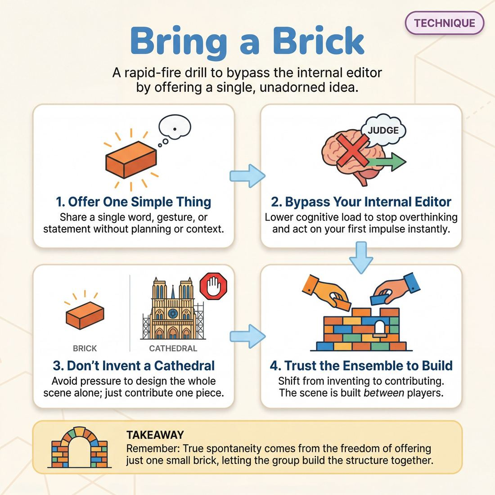

# 🎯 Bring a Brick

> *A drillable muscle that trains **Unfiltered Spontaneity**.*

{ .infographic }

## 🎯 The essence

!!! abstract "In a nutshell"
    **Bring a Brick** is a rapid-fire spontaneity drill where players practice offering a single, unadorned idea—a word, a physical gesture, or a simple statement—without hesitation, context, or explanation. Named for the foundational improv adage "bring a brick, not a cathedral," the exercise strips away the pressure to invent a whole scene, be clever, or plan ahead. Instead, it isolates and drills one vital muscle: bypassing the **internal editor** to trust and deliver your very first impulse the exact moment you are called upon.

## 🎓 What it trains

At its core, "Bring a Brick" isolates and trains the skill of **Unfiltered Spontaneity**. It is designed to dismantle one of the most common and paralyzing habits in improvisation: the belief that you must invent a brilliant, fully-formed scene all by yourself.

When improvisers step on stage, they often suffer from the "Cathedral" mindset. They feel the crushing pressure to instantly generate a plot, a hilarious premise, or a perfect character arc. This massive cognitive load triggers the internal editor—the voice that judges an idea as "not good enough" or "too boring" before it ever leaves the mouth. The result is hesitation, deer-in-the-headlights panic, or steamrolling a partner with a convoluted, over-planned opening line.

This technique solves that problem by radically lowering the stakes of creation. It trains the muscle of offering just *one* small, specific thing—a single brick—and trusting the ensemble to help build the rest of the structure. 

!!! abstract "The Brick vs. The Cathedral"
    You do not need to build a cathedral on your own. If you bring a brick, and your partner brings a brick, and you keep stacking them together, you will eventually build a cathedral without either of you having to design the blueprints in advance.

By practicing this technique, improvisers develop:

*   **Freedom from hesitation:** When the requirement is just "one small thing" (a posture, a sigh, a single line of dialogue), the brain stops stalling. The improviser learns to bypass the editor and offer their first thought reliably.
*   **Trust in the aggregate:** It builds the experiential knowledge that a scene is created *between* players, not *by* one player. 
*   **Micro-focus:** It trains the improviser to focus entirely on the immediate moment and the single offer at hand, rather than worrying about where the scene is going three minutes from now.

Ultimately, "Bring a Brick" shifts the improviser's goal from *inventing* to *contributing*. It is the foundational drill for achieving true spontaneity, allowing impulse and action to become simultaneous.

## 💡 Why it works

The engine driving this technique is the deliberate manipulation of **cognitive load**. When an improviser steps on stage and tries to invent a complete premise, character, and plot all at once, their working memory becomes overwhelmed. This pressure wakes up the critical faculty that evaluates ideas for quality, logic, and safety before allowing them to be spoken. 

By radically shrinking the job description down to a single, isolated offer, this technique bypasses the editor entirely. Here is exactly how the underlying mechanisms work:

*   **Slashing the cognitive burden:** The brain freezes when asked to "be funny" or "invent a story." It thrives when given a simple, concrete task. By focusing only on providing one small piece of information—a physical gesture, a single line of dialogue, or an emotional reaction—the improviser removes the pressure to invent the future. The task becomes so small that the editor has no time or reason to intervene.
*   **Enforcing mutual dependence:** If you walk on stage with a fully formed scene in your head, you are subtly demanding that your partner live in your world. When you only bring a brick, you are structurally forced to rely on your partner. You literally cannot know what you are building until they place their brick next to yours. This exploits a group dynamic that shifts the burden of creation from the individual to the partnership.
*   **Freeing bandwidth for truth:** Because the improviser is no longer burning mental energy trying to steer the plot, their awareness opens up. That reclaimed bandwidth can be redirected into the physical and emotional reality of the moment—allowing them to focus on their breathing, their partner's eye contact, and the genuine emotion in the room.

!!! abstract "The Cathedral vs. The Brick"
    *   **The Cathedral:** "We are two astronauts on Mars and the oxygen is failing, so hand me that wrench!" *(High cognitive load, dictates the scene, triggers the editor, leaves the partner with nothing to build).*
    *   **The Brick:** *Wiping sweat from the forehead while staring intensely at a blinking red light.* *(Low cognitive load, invites collaboration, bypasses the editor, demands a response).*

Ultimately, the technique works because it tricks the brain into surrendering control. It replaces the paralyzing fear of *getting it right* with the simple, achievable physical action of *doing one thing*.

## 🧩 The setup

To set this drill up for success, the physical arrangement must promote rapid, high-energy repetition. You want players moving quickly so their inner editor doesn't have time to engage.

*   **Players & Arrangement:** Full group (ideally 8–16 players). Divide the room into two parallel lines facing each other across a small, open playing space. Alternatively, form a single large circle with a clear "stage" in the center. 
*   **Space & Materials:** A completely open floor. No chairs, blocks, or props are needed.
*   **Time:** 10–15 minutes total. The pace should be relentless, with each pair spending no more than 10 to 15 seconds in the center before the next pair rotates in.
*   **Roles:**
    *   **The Initiator:** Steps into the center and delivers a single, simple, unfiltered offer—a line of dialogue, an action, or a strong emotion. This is the first "brick."
    *   **The Responder:** Steps in simultaneously, accepts the reality of the first brick, and adds exactly *one* piece of new information or reaction. 
    *   **The Coach:** Acts as the metronome. The coach claps or calls "Next!" after two or three lines of dialogue, forcing the players to clear the space immediately for the next pair.
*   **Prerequisites:** Players should already understand the basic mechanics of agreement (**"Yes, And"**) and be comfortable stepping into the center of the group.

!!! example "Facilitator Script"
    "We are going to practice starting scenes by bringing a single brick, rather than trying to build the entire cathedral by yourself. 
    
    Two players will step into the center. Player A, give us one simple, unfiltered offer. It doesn't need to be clever. It can be 'It's hot in here,' a heavy sigh, or scrubbing a dish. Player B, you will accept that reality and add exactly one more brick. 
    
    Do not invent the plot, the backstory, and the conflict. Just lay two bricks together. As soon as you do, I will clap, you will clear, and the next two players will immediately step in. Don't plan your brick in line—just step out and see what's in your hand."

## ⚙️ The mechanics

The core objective of the drill is to strip away the pressure of inventing a brilliant premise. Instead of trying to construct an entire scene by themselves, players practice building a shared reality one tiny, unburdened offer at a time. 

Here is the step-by-step flow of the exercise:

1. **Take the stage:** Two players step up, starting in a neutral physical or emotional state.
2. **Lay the first brick:** Player A initiates with a single, simple offer. This must be a micro-offer: a short line of dialogue, a clear physical action, or an emotional reaction. 
3. **Lay the second brick:** Player B observes Player A's offer, accepts it as true, and adds *exactly one* new piece of information that rests naturally on the first.
4. **Build the wall:** Players alternate back and forth. They strictly limit themselves to one new "brick" per turn, discovering the scene together rather than driving a plot.
5. **Call and reset:** The coach calls "Scene" after 6 to 8 lines—usually right when the **Who, What, and Where** have naturally crystallized from the accumulated details. The players step back, and a new pair steps up.

### Rules & Constraints

To force the muscle of Unfiltered Spontaneity to do the work, players must adhere to strict boundaries during the drill:

* **The One-Sentence Limit:** Dialogue must be kept to a single, simple sentence. No compound clauses, no monologues, and no "loading up" the partner with multiple facts at once.
* **No Exposition:** Players may not explicitly explain who they are, where they are, or what their relationship is. They must trust that the context will emerge from the small details.
* **Physical Bricks Count:** A heavy sigh, a sudden change in posture, or picking up an invisible object is a perfectly valid brick. A turn does not require words.

!!! warning "Watch out for the 'Trojan Brick'"
    Novice improvisers often let their internal editor panic, resulting in a cathedral disguised as a brick. 
    *Cathedral:* "I'm so glad we're finally robbing this bank, brother!" 
    *Brick:* "This ski mask is itchy." 
    If a player drops a Trojan Brick, the coach should stop them and ask them to shrink the offer down to a single, simple truth.

!!! tip "On stage"
    If you feel your brain freezing and the editor taking over, stop trying to invent. Look at your partner's face, posture, or the last thing they did, and state one simple thing you observe or feel about it. An observation is always a perfect brick.

## 🎬 Sample round

!!! example "Sample round: Building the Cathedral"
    **The Setup:** A group of players stands in a line. The coach instructs them to step forward one at a time and immediately drop a single "brick"—one unfiltered offer of character, environment, or emotion—to build a shared scene.

    **Player 1** *(steps forward instantly, shivering)*: "The heating is broken again."
    
    * **The Brick:** A physical reality and a recurring problem. Player 1 bypasses their internal editor. They don't invent a whole plot or explain *why* it's broken; they just lay the first stone.

    **Player 2** *(steps forward without hesitation, wiping hands)*: "I've got grease all over my good shirt, but I can't find the leak."
    
    * **The Brick:** Adds an action and a personal stake. Player 2 accepts the broken heating and adds their own specific detail, resisting the urge to fix the problem or explain the relationship.

    **Player 3** *(steps forward, holding an imaginary clipboard)*: "Corporate says we still have to hit our quota by 5:00 PM."
    
    * **The Brick:** Introduces external pressure and status. They don't monologue about the company's history; they just drop one piece of immediate context.

    **Player 1** *(stepping back in, rubbing hands together)*: "My fingers are too numb to type."
    
    * **The Brick:** Reacts to the new information (the quota) using the established physical reality (the cold). The impulse and action are simultaneous.

    **Coach:** "Freeze. Look at the cathedral you just built. We have a freezing office, a stressed mechanic, a ruthless corporate quota, and a desperate worker. Because no one paused to invent the whole story, the scene built itself effortlessly."

## 🎚️ Variations & progressions

To build the muscle of Unfiltered Spontaneity, this drill can be dialed up or down in intensity. By constraining the *type* of brick or accelerating the speed, you can guide players from hesitant, over-thought offers to simultaneous impulse and action.

Here are the most effective ways to scale the exercise:

*   **The Silent Brick (Novice to Advanced Beginner)**
    Remove words entirely. Players step forward to offer only a physical gesture, a facial expression, or a distinct piece of object work. 
    *   *Why it works:* At the novice stage, the internal editor usually wins because players are searching for the "right" or "funny" words. Stripping away dialogue forces them to rely on pure physical impulses, helping them reliably offer their first thought.

*   **The "Yes, And" Brick (Competent)**
    Instead of disconnected, random offers, each player must add a brick that directly justifies, heightens, or physically connects to the *immediate previous* player's brick. If Player A mimes painting a wall, Player B must step in and hand them a new bucket, or complain about the fumes.
    *   *Why it works:* This introduces mild scene pressure. It trains the competent improviser to bypass their editor while still serving the logic of the emerging scene, rather than retreating into isolated randomness.

*   **The Emotional Brick (Competent to Proficient)**
    Players step forward and deliver a single line of dialogue, a sound, or a physical posture driven entirely by a strong, unbidden emotion. The content of the words matters less than the emotional velocity.
    *   *Why it works:* This bridges spontaneity with emotional fluidity. It pushes players past consciously naming an emotion and trains them to let layered, genuine emotion arrive instantly alongside their impulse.

*   **The Zero-Latency Speed Round (Proficient to Master)**
    Cut the transition time to absolute zero. The next player must be physically moving into the space *before* the previous player has finished their offer. If a player pauses to think for even a half-second, the coach claps, and they must immediately step back and try again.
    *   *Why it works:* This forces the highest stages of spontaneity, where impulse and action become completely simultaneous without any measurable latency.

!!! tip "On stage: The 'Cathedral' Warning"
    When running these variations, watch out for players trying to "Bring a Cathedral." A brick is a single, manageable offer (e.g., "It's cold in here"). A cathedral is a pre-planned, controlling offer (e.g., "It's cold in here because the ghost of the Victorian orphan broke the thermostat, which means we have to solve the mystery!"). Reward the simple, immediate bricks.

!!! example "In a scene: The Gibberish Variant"
    To completely short-circuit a highly verbal team's internal editor, run the drill in full gibberish. 
    *   **Player 1:** Steps forward, points aggressively. *"Flarmig blig!"*
    *   **Player 2:** Instantly steps in, cowering. *"Snoot..."*
    Because the logical brain cannot parse the language, the improviser is forced to react purely to tone, physicality, and immediate impulse.

## 🧑‍🏫 Coaching notes

As a coach, your primary job during this exercise is to act as a pressure-release valve. Players will naturally try to construct entire narratives, premises, or jokes because they fear leaving their partner with nothing. You must actively give them permission to do less, intervening the moment you see the gears turning in their heads.

!!! tip "Coaching: 'Drop the blueprint'"
    The single most important cue you can give in the moment is: **"You don't need to know what it means yet."** Remind players that a brick is just raw material. The significance of the offer is discovered *after* it is placed, not before. 

### Active Side-Coaching
Keep your side-coaching brief, rhythmic, and continuous. You want to bypass their logical brain and speak directly to their instincts. Use these cues to steer the energy:

*   **"Smaller."** Use this when a player offers a dense backstory or tries to define the entire relationship in one line.
*   **"First thought, go."** Use this to kill latency. If you see a player take a breath and pause to evaluate their idea, push them to speak immediately.
*   **"Just a fact."** Use this when players are trying too hard to be funny or clever. Ground them back in simple, observable reality.
*   **"Give me the boring one."** Novices often reject their initial impulse because the inner editor deems it too mundane. If you see them discard a thought, demand the discarded thought.

### Recognizing 'Good'
You will know the technique is working not by how "good" the resulting scenes are, but by observing the players' physical and vocal state. Look for:

| Observable Metric | What 'Good' Looks Like |
| :--- | :--- |
| **Latency** | Near-zero hesitation. The offer is made the moment the impulse strikes, without a buffer beat. |
| **Physicality** | Relaxed shoulders, steady eye contact, and open posture. The player isn't physically "bracing" for the impact of their offer. |
| **Vocal Tone** | Natural and unforced. They aren't "selling" the line as a joke or dropping their volume out of uncertainty. |
| **Simplicity** | The offers are often highly mundane ("I brought a shovel," "It's raining," or simply sitting down with a sigh). |

!!! warning "Watch out for the 'Clever Brick'"
    Sometimes a player will deliver a single, small offer, but it is highly loaded, witty, or designed to force the scene in a specific direction. This is still a cathedral, just disguised as a brick. Call it out: *"That was a trap, not a brick. Try again, simpler."*

## 🧭 Debrief & reflection

After the kinetic energy of the drill subsides, the debrief shifts the focus inward. The goal is to help players identify the mental friction of their internal editor and recognize the physical relief that comes from lowering the stakes of an offer. 

Use these targeted questions to guide the conversation:

*   **"Did you catch yourself holding a brick back because it didn't feel 'good enough'?"** 
    This prompts players to confront their internal editor. It helps them recognize the exact moment they judged an impulse instead of trusting it.
*   **"What was the physical difference between dropping a simple brick and trying to build a cathedral?"** 
    Spontaneity has a physical signature. Players will often note that trying to invent a whole scene causes tension in the shoulders or a holding of the breath, while simply offering one detail feels loose, grounded, and easy.
*   **"Which offers surprised you the most, and where did they come from?"** 
    This highlights the value of Unfiltered Spontaneity. The most delightful moments in the drill usually come from a player blurting out an obvious, unpolished truth rather than a clever invention.
*   **"How did it feel to let your partner do half the work?"**
    This reinforces the collaborative nature of the technique, reminding players that they are not solely responsible for the scene's survival.

!!! tip "Listen for the 'Editor'"
    When a player says, *"I just went blank"* or *"I didn't know what to say,"* gently challenge them. A blank mind is rarely truly empty; it is usually a mind that has instantly rejected its first three thoughts for being too boring, too weird, or too simple. Ask them: *"What was the very first image or word that flashed in your head before you decided it was wrong?"* 

A successful debrief surfaces a collective sigh of relief. Players should walk away articulating that the pressure to be brilliant is a trap, and that bringing a single, unjudged "brick" is not only easier, but vastly more useful to their scene partner. They begin to realize that moving from a novice to a competent improviser requires trusting that their most mundane first thought is exactly what the scene needs.

## ⚠️ Common pitfalls

!!! warning "Watch out: Bringing a Cathedral"
    The most common and destructive trap is panicking under pressure and trying to build the entire scene in one line. Instead of offering a single, sturdy fact or emotion, the player dumps a blueprint: *"Hello, brother, I see you are still angry about the inheritance we fought over at the lawyer's office yesterday!"* 
    
    **The Fix:** Enforce a strict one-sentence or one-action limit. Coach players to trust their partner to provide the mortar and the next brick.

When cognitive load spikes—usually because a player feels the pressure to be funny, clever, or to "save" a scene—the Unfiltered Spontaneity muscle often fails. Here is how that breakdown manifests and how to correct it:

*   **The Empty Hand (Vague Offers)**
    *   *The Trap:* In an effort to not over-control the scene, a player offers nothing of substance. They say, *"Wow, look at that,"* or *"What are we doing here?"* They have brought air, not a brick.
    *   *The Fix:* Require a specific noun, a clear emotion, or a definitive physical action. A brick must have weight and texture to be built upon.
*   **The Pre-Planned Brick (Ignoring the Structure)**
    *   *The Trap:* A player gets an idea, holds onto it tightly, and stops listening. When it is their turn, they slam down their pre-planned brick, completely ignoring the wall their partner just started building. 
    *   *The Fix:* Drill active listening. Remind players that they cannot know what brick is needed until they see what their partner has just laid down. The impulse must be generated *in response*, not in advance.
*   **Judging the Brick (The Editor Wins)**
    *   *The Trap:* This is the classic novice hurdle. The player has a first thought, but their internal editor deems it "too boring," "not funny," or "weird." They hesitate, the moment passes, and the scene stalls.
    *   *The Fix:* Lower the stakes of the exercise. Remind the improviser that a plain, boring, standard red brick is exactly what is needed to build a stable house. Celebrate mundane, obvious offers to bypass the editor.

!!! tip "On stage"
    If you feel your brain spinning with backstory, future plot points, and character names, you are experiencing cognitive overload. Take a breath, look at your partner, and just say the simplest true thing about the moment right now. Drop the cathedral; just hand them a brick.

## 🌟 What mastery looks like

When an improviser reaches the master level of Unfiltered Spontaneity, their performance in the **Bring a Brick** drill transforms from a conscious mental effort into a pure, observable reflex. You will no longer see the gears turning; the internal editor has been completely bypassed.

Here is what you will observe when this technique is executed brilliantly:

*   **Zero latency:** There is absolutely no measurable gap between the impulse and the offer. The player steps forward and speaks or acts simultaneously. They do not take the stage, pause to "find" an idea, and then deliver it. The movement *is* the idea.
*   **Radical simplicity:** The master player truly brings *only* a brick. They have completely abandoned the need to be clever, funny, or narrative-driving. Their offers are grounded, unadorned, and highly specific. 
*   **Physical integration:** The impulse is instantly distributed through the entire body. If the "brick" is an action or a point of view, their posture, facial expression, and breathing reflect it before the first word is spoken. The body leads the brain.
*   **Complete detachment:** Once the offer is made, the master player drops it and resets. There is no lingering glance to see if the offer "landed," no wincing at a perceived mistake, and no attempt to justify or explain what they just did. They give the gift and walk away.

!!! example "The Master's Turn"
    An advanced beginner might step into the space, pause for a half-second, and say, "I brought the blueprints for the bank heist!" (They are trying to build the whole cathedral in one line).
    
    A master steps up in one fluid motion, immediately miming the weight of a heavy object, and says, "I'll put the toaster here." They have provided a single, solid foundation piece, leaving infinite room for their partner to build.

!!! abstract "The Ultimate Goal"
    At the highest level, the player trusts that *any* unfiltered impulse is a valid brick. Mastery of this technique is the absolute, embodied confidence that you do not need to know what the building is in order to lay the first stone.

## 🔗 Why it matters

The fundamental shift in an improviser's journey is moving from *inventing* to *discovering*. **Bring a Brick** is the physical and mental muscle that makes this shift possible. 

By deliberately offering just one small, specific thing—a single line of dialogue, a distinct posture, or a simple physical action—you bypass the brain's natural desire to plan the entire scene before stepping out.

* **Serving Unfiltered Spontaneity:** The internal editor thrives on complexity. When you try to invent a whole premise, the editor has time to judge it, tweak it, or reject it, causing measurable latency. A single "brick" is too small to judge. Lowering the cognitive load allows impulse and action to become simultaneous, starving the editor of the time it needs to interfere.
* **Serving The Self:** This domain seeks freedom from hesitation and the courage to be truthful. The pressure to be brilliant, funny, or highly original is paralyzing. Bringing a brick relieves you of the burden of solo genius. It builds the profound, quiet confidence that your first, simplest impulse is entirely sufficient.

!!! abstract "The Cathedral Metaphor"
    If you walk on stage carrying an entire cathedral (a fully planned scene with characters, conflict, and a predetermined ending), your partner has nothing to do but admire it or paint the walls. If you bring a single brick, and your partner brings a single brick, together you build a cathedral neither of you could have planned.

In the wider craft of improvisation, this technique is the bedrock of true collaboration. It transforms scene-work from a stressful negotiation of competing ideas into a shared act of co-creation. When every player trusts that their single brick is enough, the ensemble stops fighting for control and begins moving with effortless, collective momentum.

## 📚 References & Further Reading

### Foundational sources
*   **Keith Johnstone, *Impro: Improvisation and the Theatre* (1979)** — The seminal text on spontaneity, bypassing the internal editor, and lowering the stakes of creation. Johnstone is widely credited with the foundational philosophy behind "bring a brick, not a cathedral," arguing that improvisers freeze because they are trying to be original rather than obvious. He champions the idea that the most mundane, simple offer is exactly what a scene needs to move forward.
*   **Del Close, Charna Halpern, and Kim "Howard" Johnson, *Truth in Comedy: The Manual for Improvisation* (1994)** — The foundational text on long-form improv and the concept of "group mind." Close frequently taught the "bring a brick" concept to emphasize that players should build together rather than inventing alone. The book details how bringing a fully formed premise (a "cathedral") forces your partner into a passive role, whereas bringing a single "brick" demands true collaboration.
*   **Viola Spolin, *Improvisation for the Theater* (1963)** — The original source on using theater games to bypass the intellect and tap into pure, unedited spontaneity. Spolin’s exercises are explicitly designed to occupy the conscious mind (the editor) with a physical focus, allowing the intuitive, spontaneous self to emerge without hesitation.

### Practitioner guides & manuals
*   **Mick Napier, *Improvise: Scene from the Inside Out* (2004)** — Focuses heavily on the "internal editor" and the paralyzing effect of over-planning. Napier offers practical ways to trust your first impulse and do *something*—anything—rather than waiting for the perfect idea. His approach to initiating scenes aligns perfectly with the "bring a brick" mentality: make a strong, simple choice and let the scene build from there.
*   **Max Dickins, *Improvise! Use the Secrets of Improv to Achieve Extraordinary Results at Work* (2020)** — Explicitly discusses the "bring a brick, not a cathedral" concept as a tool for lowering cognitive load, reducing anxiety, and fostering collaboration in professional environments. Dickins explains how shifting the burden of creation from the individual to the group allows for greater psychological safety and innovation. [Link]{.ref}

### Research & theory
*   **Michele Biasutti, "Teaching Improvisation through Processes" (*Frontiers in Psychology*, 2015)** — Examines the cognitive mechanisms behind improvisation. Biasutti highlights how relying on procedural knowledge and simple, pre-formed structures (the "bricks") diminishes the cognitive load of a task. This reduction in working memory demands allows for real-time fluency and bypasses the critical editor. [Link]{.ref}
*   **Brian Magerko et al., "An Empirical Study of Cognition and Theatrical Improvisation" (*Creativity and Cognition*, 2009)** — Research from Georgia Tech exploring the specific cognitive processes employed by theatrical improvisers. The study details how improvisers use "referents" (small, pre-existing structures or simple offers) to ease cognitive load, generate schemas, and reduce the need for complex communication cues during a scene.
*   **Cristian Chelariu, Wesley J. Johnston, and Louise Young, "Learning to Improvise, Improvising to Learn" (*Journal of Business Research*, 2002)** — Explores how setting parameters and lowering cognitive burden allows for successful improvisation and organizational learning. The paper discusses how the improv tenet of "bringing a brick" allows a project to progress further by having everyone contribute small portions rather than one person trying to do it all.

### Lineage & teachers
*   **The Second City & iO Theater (Chicago)** — The training centers where the "bring a brick" philosophy was codified into long-form scene work. Both institutions shifted the focus of comedic performance from individual invention and joke-writing to ensemble-built discovery, where the aggregate of small, truthful offers creates the comedy. [Second City]{.ref} | [iO Theater]{.ref}
*   **Loose Moose Theatre Company (Calgary)** — Founded by Keith Johnstone, this theater is the birthplace of many of the rapid-fire spontaneity drills designed to bypass the internal editor. Their training heavily emphasizes the "obvious over original" mindset that makes "Bring a Brick" effective. [Link]{.ref}

### Communities & adjacent reading
*   **Applied Improvisation Network (AIN)** — A global community of practitioners who use improv concepts like "bring a brick" to teach collaboration, adaptability, and psychological safety in corporate and educational settings. Their resources frequently cite this specific technique as a way to dismantle the "smartest person in the room" syndrome. [Link]{.ref}
*   **Patricia Ryan Madson, *Improv Wisdom: Don't Prepare, Just Show Up* (2005)** — A cross-disciplinary book that applies the improv mindset to everyday life. Madson, a Stanford professor, emphasizes the value of showing up with a single, simple offer rather than a grand plan, teaching readers how to trust their aggregate experiences rather than over-preparing. [Link]{.ref}

## 💬 Quotes & Anecdotes

!!! quote "— Del Close"
    Don't bring a cathedral into a scene. Bring a brick; let's build together.

!!! quote "— Keith Johnstone"
    If you have a good idea, open your mouth and say something else.

!!! quote "— Keith Johnstone, *Impro: Improvisation and the Theatre* (1979)"
    An artist who is inspired is being obvious. He's not making any decisions, he's not weighing one idea against another. He's accepting his first thoughts.

### Where it comes from
The central adage of this technique—"Bring a brick, not a cathedral"—is widely attributed to Del Close, the legendary improv director and co-creator of the long-form structure known as the Harold. Close used the metaphor to train actors out of the habit of pre-writing entire scenes in their heads before stepping on stage. By demanding only a "brick," he forced players to rely on mutual discovery and active listening rather than steamrolling their partners with a rigid, preconceived plot. 

### A telling example
To see the internal editor at work, look at how improvisers initiate scenes when they feel the pressure to be funny or inventive. 

When a player tries to bring a **cathedral**, they often deliver a convoluted, premise-heavy opening line that leaves their partner with nothing to do but nod along. An illustrative example of a cathedral initiation is: 

> *"Hey Bryon, the soccer team is waiting for us to drop off the stuff, so pick me up at 8, and don't forget to bring the orange cones and some biscuits, because the puppies will be there too!"* 

The improviser has pre-planned the who, what, where, and why, effectively demanding that their partner read their mind and play out a script that has already been written. 

When a player brings a **brick**, they offer just one piece of the puzzle and trust their partner to help build the rest. A brick initiation might simply be: 

> *"I forgot the orange cones."* 

This single, unadorned statement bypasses the pressure to invent the whole story. It gives the scene partner a clear emotional reality to react to, leaving the door wide open for true, spontaneous collaboration.

## 🧭 Explore the framework

- ⬆️ **Skill it trains:** [Unfiltered Spontaneity](01_S1__unfiltered-spontaneity.md)
- 🎭 **Domain:** [The Self](01_D__the-self.md)
- 🔁 **Sibling techniques:** [Word-association](01_S1_T1__word-association.md), [First Thought drills](01_S1_T2__first-thought-drills.md)
