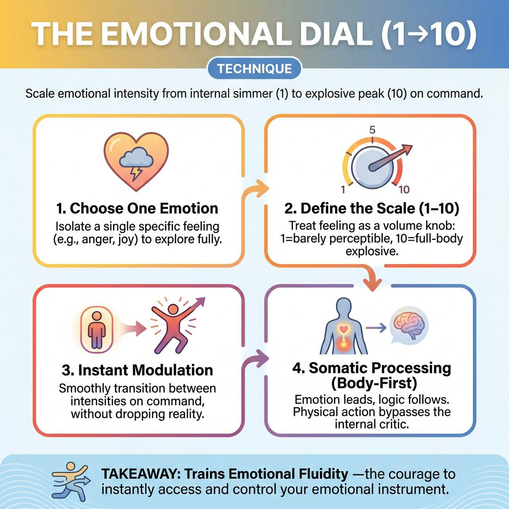

# 🎯 The Emotional Dial (1→10)

> *A drillable muscle that trains **Emotional Fluidity**.*

{ .infographic }

## 🎯 The essence

!!! abstract "In a nutshell"
    The **Emotional Dial (1→10)** is a focused, high-repetition drill where a player scales the intensity of a single emotion up and down on command—from a barely perceptible, internal simmer (1) to an explosive, full-body peak (10). Rather than treating feelings as simple "on/off" switches, this technique forces improvisers to practice **emotional modulation**. By isolating the volume knob of a feeling while maintaining a scene, physical action, or monologue, players train the physical and vocal muscle required to transition smoothly through the entire spectrum of an emotion without dropping their reality or retreating into their heads.

## 🎓 What it trains

At its core, the Emotional Dial is a targeted workout for **Emotional Fluidity**—the ability to access, scale, and transition between emotional states on command. 

!!! abstract "Core Skill: Emotional Fluidity"
    Emotional fluidity is the capacity to let genuine feeling arrive unbidden, and the discipline to modulate that feeling to serve the scene. It moves an improviser from *thinking* about an emotion to *embodying* it.

When improvisers are under the pressure of inventing a scene, authentic emotion is often the first casualty. This hesitation usually manifests in two common traps:

1. **The Safe Middle:** Playing every scene at a polite, detached "3" out of self-consciousness, or conversely, jumping straight to a chaotic, unearned "10" just to manufacture energy.
2. **Indicating:** Consciously naming an emotion ("I am so furious right now!") or pantomiming it, instead of physically and vocally experiencing it. 

By stripping away the burden of inventing plot and focusing entirely on the intensity of a feeling, the Emotional Dial forces the improviser out of their head and into their body. It trains several specific muscles within the domain of the performer's self:

* **Emotional Granularity:** Learning the physical and vocal difference between a "2" (mild annoyance) and a "6" (simmering resentment), rather than treating "angry" as a single, monolithic state.
* **Instant Access:** Bypassing the internal editor to summon an emotional state immediately, without needing a logical "reason" or backstory first.
* **Modulation:** Developing the control to smoothly ramp an emotion up or down, rather than jarringly snapping between a 0 and a 10.

Ultimately, this technique builds the courage to be truthful. It teaches the improviser that their own emotional instrument is a reliable, controllable tool. When a player masters this dial, they no longer have to invent clever dialogue to make a scene work; the emotional truth does the heavy lifting for them.

## 💡 Why it works

The Emotional Dial works because it fundamentally alters how an improviser accesses feelings: it treats emotion as a physical action rather than a psychological state. 

Instead of waiting for a scene's narrative to *justify* an emotion, the improviser generates the emotion first, trusting that the justification will follow. This reverse-engineering exploits several key cognitive and physical mechanisms:

*   **Decoupling emotion from invention:** When a player is simply told to "be angry," they often freeze, immediately trying to invent a reason *why* they are angry. By adding a numerical dial ("Give me a 3, now a 7"), the brain's focus shifts from narrative invention to technical execution. This distracts **the editor**—the internal critic that filters and judges ideas—allowing raw expression to slip past the intellect.
*   **Shattering the "Improv 5":** Left to their own devices, most improvisers default to a safe, conversational emotional intensity—a solid 4, 5, or 6 on the dial. The 1→10 constraint forces players out of this middle ground. It proves to their nervous system that they can survive a level 10 (unhinged, fully embodied) and still hold the room at a level 1 (micro-expressions, intense stillness).
*   **Somatic (body-first) processing:** The dial forces the realization that emotion is not just a thought. To jump from a 2 to an 8, a player cannot just *think* harder; they must change their breathing, posture, muscle tension, and vocal resonance. 

!!! abstract "The Engine Under the Hood: Emotion Leads, Logic Follows"
    In real life, an event happens, we process it, and then we feel an emotion. On stage, this sequence often causes hesitation. The Emotional Dial trains the improviser to flip the script: **choose the emotion and intensity first**, and let the brain automatically invent the context to match the physical state. 

!!! note "The Illusion of the 'Right' Reaction"
    Novice improvisers often wait to feel the "correct" emotion for a scene's given circumstances. The dial teaches that *any* emotion, played with commitment at a specific intensity, will make the scene work. It replaces the anxiety of "getting it right" with the freedom of "playing it fully."

## 🧩 The setup

Here is everything you need to arrange before running the exercise. Because this technique requires players to be highly vulnerable and physically expressive, a clear, structured setup is essential to create a safe container.

*   **Players & Arrangement:** Whole group (typically 8–16 players). Have the ensemble spread out evenly across the floor, facing the facilitator. Everyone needs enough personal space to flail, collapse, or jump without striking another player. 
*   **Space & Materials:** A completely open room. Clear away all chairs, bags, and props. 
*   **Time:** 10–15 minutes total. Spend about 2–3 minutes exploring the dial on a single emotion before switching to a new one.
*   **Roles:**
    *   **The Caller (Facilitator):** Acts as the emotional "DJ." You will provide the baseline emotion and call out numbers from 1 to 10 to adjust the intensity.
    *   **The Ensemble (Players):** Instantly manifest the emotion at the called intensity using their face, breath, posture, and voice (often using gibberish or a single neutral phrase like "I bought a new car").
*   **Prerequisites:** A vigorous physical and vocal warm-up (such as a Shakeout or Eight-Count). Players must already be physically loose and comfortable making noise in the space before attempting extreme emotional states.

!!! quote "How to introduce it"
    "We are going to practice treating emotion as a physical dial we can turn up and down at will. I will give you a base emotion—like joy, grief, or rage. Then, I’ll call out a number from 1 to 10. 

    A '1' is a micro-expression: a tiny, barely perceptible flicker of that feeling in your eyes or breath. A '10' is an absolute, full-body, operatic explosion of that emotion. When I call a number, instantly snap your body, face, and voice to that exact level of intensity. Don't worry about *why* you are feeling it, and don't wait for the feeling to arrive. Just let your body execute the setting."

## ⚙️ The mechanics

The core objective of the Emotional Dial is to map a single emotion onto a numerical scale and train the improviser to instantly snap to the requested intensity without dropping their scene context or physical action. 

To run this drill effectively, the room must first share a common understanding of the scale.

!!! abstract "Defining the Scale"
    * **1 (Suppressed):** The emotion is fully present but entirely internalized. It leaks out only through micro-expressions, breathing, and eye contact. 
    * **5 (Expressed):** The emotion is obvious and vocalized. It is the typical "everyday" expression of the feeling—socially acceptable but undeniable.
    * **10 (Explosive):** Maximum human capacity. Unhinged, entirely consuming the body and voice, breaking all social norms. 

### The Flow of Play

This drill requires two roles: **The Player** (who performs) and **The Caller** (usually the coach or a side-line improviser, who dictates the numbers).

1. **Establish the Baseline:** The Player is given a mundane, continuous physical activity (e.g., folding laundry, chopping vegetables, or organizing a desk) and a simple monologue topic (e.g., "Tell us about your morning commute").
2. **Assign the Emotion:** The Caller assigns a specific, strong emotion (e.g., "Jealousy," "Rage," "Joy," or "Grief").
3. **Initiate Play:** The Caller gives a starting number—usually right in the middle. *"Start at a 5. Go."* The Player begins their monologue and physical action at that intensity.
4. **Turn the Dial:** Every 10 to 15 seconds, the Caller shouts out a new number between 1 and 10. They may move sequentially to build tension (5, 6, 7, 8) or jump erratically to test reflexes (8, 2, 10, 1).
5. **Instant Modulation:** The Player must shift their emotional intensity *immediately* upon hearing the number. They do not pause their monologue or stop their physical action to "think" about the transition.
6. **Reset and Rotate:** After 60 to 90 seconds, the Caller calls *"And scene."* The Player drops the emotion, takes a breath, and a new Player steps up.

### Rules & Constraints

To keep the exercise rigorous and prevent it from devolving into mere clowning, enforce the following constraints:

* **Do not change the emotion:** If the emotion is "Anger," a 1 is not "mild annoyance"—it is still pure anger, just completely suppressed. A 10 is not "crazy"—it is pure, unadulterated rage.
* **Keep the physical action alive:** Players will instinctively stop folding the laundry when they hit a 9 or a 10. The physical task must continue, though the *way* it is performed will naturally change (e.g., aggressively slamming the socks together).
* **No latency:** The shift must happen mid-sentence, or even mid-word. The goal is to bypass the conscious editor and train the body to react on an external cue.

!!! tip "On stage"
    While you won't have a Caller shouting numbers during a real show, you can use an **internal dial**. If a scene feels stagnant, mentally tell yourself, *"I am at a 4. I'm going to turn my dial to an 8 on my next line."* It is a highly effective way to instantly alter the stakes and energy of a scene without needing to invent new plot information.

## 🎬 Sample round

!!! example "Sample round: The Breakroom Fridge"
    **The Setup:** Two players are in a scene. Sarah is confronting Mark about a stolen lunch. Sarah’s base emotion is **Anger**. The coach is actively calling out numbers to adjust Sarah's emotional dial.
    
    **Coach:** "Sarah, start at a **3**. Simmering, polite but annoyed."
    
    **Sarah (Level 3):** *(Arms crossed, tight smile, voice controlled but clipped)* "Mark, did you happen to see a turkey club in the fridge? It had my name on it."
    
    **Mark:** "Oh, the one in the blue Tupperware? Yeah, I thought that was up for grabs."
    
    **Coach:** "Jump to a **7**. Hot, active anger."
    
    **Sarah (Level 7):** *(Uncrosses arms, steps firmly into Mark's space, voice raised and sharp)* "Up for grabs? It had 'SARAH' written in thick black Sharpie on the lid, Mark! Who thinks Sharpie means 'free to a good home'?"
    
    **Mark:** "Hey, relax, I can buy you another one..."
    
    **Coach:** "Drop to a **1**. Barely registering, completely deflated."
    
    **Sarah (Level 1):** *(Shoulders slump instantly, breaks eye contact, voice drops to a breathy whisper)* "Don't... don't even worry about it. It's just a sandwich. It's fine. Everything is just fine."
    
    **Coach:** "Crank it to a **10**. Absolute volcanic, world-ending rage."
    
    **Sarah (Level 10):** *(Face flushes, whole body goes rigid, voice booming but grounded in the diaphragm)* "IT IS NOT JUST A SANDWICH! IT WAS THE ONLY GOOD THING ABOUT THIS TUESDAY! YOU STOLE MY JOY, MARK!"
    
    **Mechanics in action:** Notice how Sarah doesn't just change her volume; she changes her **posture, eye contact, and breath** with every number. The jump from 7 down to 1 forces her to instantly abandon her momentum, demonstrating true emotional fluidity rather than just a gradual build-up.

## 🎚️ Variations & progressions

The Emotional Dial is highly adaptable. By tweaking the constraints, you can scale the cognitive load from a basic physical warmup to a masterclass in scene dynamics, guiding players smoothly through the stages of skill acquisition.

Here is how to ramp the difficulty as your players mature:

**1. The Solo Task (Novice to Advanced Beginner)**
For players who still consciously name an emotion rather than feeling it, remove the pressure of scene-building. Have one player perform a mundane, repetitive physical task (e.g., folding laundry, sweeping) while reciting a known text (the alphabet, a recipe). The coach calls out the numbers. 
* **The goal:** Train the body to switch emotion purely on an external cue without worrying about making narrative sense.

**2. The Asymmetric Scene (Competent)**
Two players begin a standard scene. The coach calls out numbers, but *only for Player A*. Player B must react naturally and truthfully to Player A’s bizarre, shifting intensity. 
* **The goal:** Pushes players to transition their emotion while justifying it within the scene's logic. Player B learns to ground the scene, while Player A learns that even a "Level 9" emotion must be directed *at* their partner.

**3. Opposing Dials (Proficient)**
Both players are on the dial, but moving in opposite directions. The coach calls out two numbers: "Player A, you are at a 2. Player B, you are at an 8." As the scene progresses, the coach crosses them over.
* **The goal:** Explores how contrasting emotional intensities create instant status dynamics and dramatic tension. 

!!! example "In a scene"
    **Coach:** "A is at 8 (Furious), B is at 2 (Furious)."
    **Player A:** *(Pacing, gesturing wildly)* "I cannot believe you left the garage door open again! The raccoons got into the camping gear!"
    **Player B:** *(Sitting perfectly still, voice dangerously quiet)* "I left it open so they would take the tent. I hate camping, Greg."

**4. The Silent Dial (Physicality Focus)**
Run the exercise entirely in gibberish, or in complete silence. Players must communicate the shift from a 3 to a 7 using only breath, posture, eye contact, and facial tension. This prevents players from relying on shouting to convey a Level 10, forcing them to find the physical truth of the emotion.

**5. The Self-Guided Dial (Mastery)**
Remove the coach entirely. Players initiate a scene and must internally track their own dial, choosing when to spike to an 8 or drop to a 2 based on the scene's natural discoveries. 
* **The goal:** This is the pinnacle of the technique. The player feels genuine, unbidden emotion, but retains the technical mastery to modulate it—dialing it up to serve the climax of a scene, or dialing it down to draw the audience in.

!!! tip "On stage"
    When practicing the Self-Guided Dial, challenge players to make their transitions gradual. Jumping from a 1 to a 10 is a jump scare; smoothly escalating from a 4, to a 6, to an 8 is a compelling character arc.

## 🧑‍🏫 Coaching notes

As a coach, your primary role during the Emotional Dial is to act as the external driver, pushing improvisers past their habitual emotional ceilings and floors. You are watching for the physical markers of genuine feeling, steering them away from simply "acting" the emotion.

!!! tip "Coaching: The Golden Cue"
    **"Intensity is not volume."**  
    The most common trap improvisers fall into is equating a "10" with screaming and a "1" with whispering. Challenge them to play a Level 10 rage at a dead whisper, or a Level 10 joy in complete, vibrating silence. True emotional intensity is measured in physical tension, breath, and focus—not decibels.

### High-Impact Side-Coaching
Keep your side-coaching continuous, rhythmic, and focused on the physical body. When an improviser gets stuck in their head, use these prompts to drop them back into their physical instrument:

*   **"Change your breathing."** (Emotion lives in the breath; a panic breath is shallow and high, a confident breath is deep and slow.)
*   **"Where does a 7 live in your body?"** (Forces them to locate the emotion physically—clenched fists, a tight jaw, heavy shoulders.)
*   **"Don't name it, feel it."** (Interrupts the habit of saying "I am so angry!" instead of simply behaving angrily.)
*   **"Hold that 8. Live in it. Don't drop it until I say."** (Builds stamina for sustaining high-stakes emotions without bailing out into a joke.)

### What 'Good' Looks and Sounds Like
You will know the exercise is working when you see observable, involuntary physical shifts rather than calculated theatrical choices. 

| The Marker | What to look for |
| :--- | :--- |
| **The Eyes** | Focus shifts entirely. A Level 2 might have wandering, casual eye contact; a Level 9 often features a locked, piercing gaze or a complete inability to look at the scene partner. |
| **The Skin** | Genuine emotional shifts cause physiological reactions. You will literally see faces flush red with anger or pale with fear. |
| **Vocal Resonance** | The pitch and timbre of the voice change. Sadness might drop the voice into a gravelly chest register; anxiety might push it into a tight, nasal head voice. |

!!! warning "Watch out for 'Indicating'"
    **Indicating** is when an improviser performs the *idea* of an emotion (e.g., rubbing their eyes and making fake crying noises) rather than experiencing it. If you see pantomime, immediately call out: *"Stop acting. Drop your hands. Just breathe as a sad person."* Force them to rely on internal state rather than external symbols.

## 🧭 Debrief & reflection

After the intensity of running the dial, players often feel a mix of vulnerability and adrenaline. The debrief is where the mechanical drill translates into true emotional fluidity. The goal of this conversation is to move players away from judging their performance and toward observing their own physical and vocal instruments.

To lock in the learning, guide the cast through a reflection using these targeted questions:

*   **"Where in your body did the emotion live at a 3 versus an 8?"** 
    *Promotes physical awareness. Players should notice that lower numbers often live in the breath or eyes, while higher numbers recruit the chest, limbs, and posture.*
*   **"Which numbers felt like your default stage setting?"** 
    *Encourages self-diagnosis. Many improvisers realize they comfortably coast at a "4" or "5" and rarely push into the extremes.*
*   **"Did a 10 feel truthful, or did you feel yourself pushing into caricature?"** 
    *Explores the boundary between grounded reality and cartoonishness. It helps players recognize when they stop feeling the emotion and start indicating it.*
*   **"At a 1 or 2, how did your partner know what you were feeling?"** 
    *Highlights the power of micro-expressions, stillness, and internal life over loud declarations.*

### What a good debrief surfaces

A successful reflection will naturally draw out several key insights about the craft of acting in improv. Listen for—and gently guide players toward—these realizations:

*   **Volume is not intensity:** Players will discover firsthand that a whispered, seething anger at a 10 can be far more terrifying than a loud, shouting anger at a 6.
*   **The power of the micro-dial:** The realization that a "2" is often entirely sufficient to sustain a compelling, grounded scene. The audience is highly perceptive; they don't always need a "7" to understand the dynamic.
*   **The physical shortcut:** Players will note that when they struggled to "feel" the emotion at a higher number, physically adopting the posture (e.g., clenching fists, breathing heavily) tricked their brain into genuinely feeling it.

!!! tip "Coach's Note: Normalizing the 'Fake' Feeling"
    In the debrief, a player might confess, *"I felt like I was just faking it at an 8."* Validate this immediately. Remind them that consciously manufacturing the emotion is part of the process early on. The goal of the drill is to build the muscle memory so that, eventually, the genuine emotion arrives unbidden.

## ⚠️ Common pitfalls

!!! warning "Watch out: Naming the Emotion"
    When cognitive load spikes—because a player is trying to listen, invent dialogue, *and* track a number from 1 to 10—the brain looks for a shortcut. The most common verbal trap is **telegraphing** or naming the emotion rather than embodying it. Instead of letting a level 6 anger tighten their jaw and clip their consonants, the player simply says, "I am getting so mad at you right now." 
    
    **The Fix:** Temporarily ban all emotion words from the scene. Force the player to communicate the dial shift entirely through breath, posture, and object work.

When players first drill the Emotional Dial, the sheer mechanics of scaling a feeling can cause their natural acting instincts to break down. Watch for these common traps and use the suggested fixes to get them back on track:

*   **The Binary Switch (1 or 10, nothing in between)**
    *   *The Trap:* Players struggle to find the nuance of a 4, 5, or 6. They hover at a low-energy 2, and when asked to dial up, they instantly explode into a screaming, flailing 10. 
    *   *The Fix:* Isolate the middle of the dial. Run a drill where players are only allowed to move between levels 4 and 6. Ask them: *What is the difference between being slightly annoyed (4) and genuinely frustrated (6)?* 

*   **Morphing the Emotion**
    *   *The Trap:* As the intensity increases, the specific emotion gets lost and turns into generic "loudness." A player dialing up *jealousy* might accidentally shift into generic *anger* by level 7, losing the specific flavor of the original choice.
    *   *The Fix:* Anchor the emotion to a specific physical sensation or point of view before dialing up. If the emotion is jealousy, remind them of the core physical action (e.g., side-eyeing, protecting their own space) so that a level 8 is just an extreme version of *that specific behavior*, not just yelling.

*   **The "Talking Head" (Physical Disconnect)**
    *   *The Trap:* The player puts all the emotional work into their facial expressions and vocal tone, but from the neck down, their body is entirely neutral and dead. This happens when the brain is working too hard to "perform" the emotion.
    *   *The Fix:* Coach the whole body. Call out specific body parts during the exercise: *"You're at a level 5—where does that live in your hands? Now dial to a 7—what happens to your feet?"*

!!! tip "On stage"
    If you feel yourself losing the emotion under the pressure of a scene, **stop talking**. Hold a beat of silence, take a breath that matches your current number on the dial, and let your body catch up to your brain. Emotion lives in the breath first.

## 🌟 What mastery looks like

When improvisers master the Emotional Dial, the exercise stops looking like a mechanical drill and transforms into a masterclass in acting. The numbers called by the coach no longer dictate *volume* or *caricature*; they dictate the **internal pressure** of a deeply felt truth. 

At the highest level of execution, you will observe several distinct hallmarks:

*   **Volume is decoupled from intensity:** As emphasized throughout this drill, a master knows that a "10" in anger can be a terrifyingly tense whisper that makes the audience hold its breath. Conversely, a "1" in joy isn't a blank face; it is a subtle, undeniable twinkle in the eye. The dial controls the *stakes*, not the decibels.
*   **Instant, justified transitions:** When a coach calls a jarring jump from a 2 to an 8, the master doesn't just suddenly act bigger. They instantly invent the *reason* for the spike—a sudden realization, a perceived slight, a memory—making the shift look entirely organic to the character's internal logic.
*   **Full-body saturation:** The emotion isn't just painted on the face. At a "7," sadness lives in the slump of the shoulders, the shallowness of the breath, and the heavy stillness of the hands. 
*   **Relational focus:** The emotion is never played in a vacuum. A master at a "9" pours that energy directly into their partner, altering the scene's dynamic rather than just showing off their own emotional state.

!!! example "In a scene"
    Two improvisers are playing a quiet breakup scene at a "3" (Sadness). The coach calls out, "Jump to 9!"
    
    A novice might suddenly start wailing, dropping the reality of the scene to simply "play crying." 
    
    A master takes a sharp intake of breath. Their hands begin to tremble, they refuse to break eye contact, and their voice cracks as they whisper, "I just... I don't know how to pack my books." The intensity is devastating, but the grounded reality of the scene remains perfectly intact.

Ultimately, mastery of this technique achieves the highest stage of emotional fluidity: the improviser **feels real emotion *and* modulates it to serve the scene**. The dial is no longer an external constraint; it is a finely tuned instrument for revealing the human condition on demand.

## 🔗 Why it matters

The Emotional Dial is the foundational muscle for emotional fluidity. By isolating intensity as a single, controllable variable, it transforms emotion from a vague, unpredictable feeling into a precise, calibrated tool. 

In the domain of the performer's self, the ultimate goal is complete physical and vocal control, paired with the courage to be truthful. The dial serves this directly by proving to the improviser that they are the master of their own instrument:

* **It builds courage through range:** Improvisers often default to a safe, conversational "4" or "5" on stage. By forcing players to inhabit a "1" (barely perceptible, simmering internal life) and a "10" (unhinged, full-body commitment), the dial shatters their habitual comfort zones. Once an improviser has survived playing a 10, a 7 feels entirely manageable.
* **It proves emotion is an action:** It teaches the improviser that they do not have to wait to "feel it" organically. They can lead with the physical and vocal mechanics of an emotion at a specific number, and the internal truth will follow.
* **It creates dynamic contrast:** A scene where both players remain at a steady 5 is a theatrical flatline. The wider craft of improvisation relies on contrast and escalation. Watching a character slowly dial up from a 2 to an 8 over a minor inconvenience—like a misplaced set of keys—is inherently compelling and establishes immediate stakes.

!!! abstract "Key idea: Range equals freedom"
    When you know exactly what your "2" and your "9" look, sound, and feel like, you are no longer a victim of your own hesitation. You can make deliberate, powerful choices that instantly define relationships, raise the stakes, and breathe life into otherwise ordinary dialogue. 

Ultimately, mastering the dial connects the improviser to the core engine of scene work. Audiences do not come to the theater to watch people exchange information; they come to watch people be affected by one another. The dial ensures you always have the capacity to be affected, at exactly the volume the scene requires.

## 📚 References & Further Reading

### Foundational sources
*   **Mick Napier, *Improvise: Scene from the Inside Out* (2004)** — Napier’s core philosophy of "doing something" (choosing an emotion or physical state first) to bypass the internal editor is the direct precursor to this drill, explicitly calling out the "safe middle" that improvisers default to. [Publisher link]{.ref}
*   **Viola Spolin, *Improvisation for the Theater* (1963)** — The foundational text on using physicalization and games to get actors out of their heads and into their bodies, providing the bedrock for exercises that combat the trap of "indicating" an emotion rather than feeling it. [Spolin Estate]{.ref}
*   **Michael Chekhov, *To the Actor: On the Technique of Acting* (1953)** — Introduces the "Psychological Gesture," a technique for radiating emotion outward from a physical movement rather than waiting for psychological justification, mirroring the dial's approach of letting the body lead. [Michael Chekhov Association]{.ref}

### Practitioner guides & manuals
*   **Matt Besser, Ian Roberts, and Matt Walsh, *The UCB Comedy Improvisation Manual* (2013)** — Discusses playing the "Base Reality" and committing to emotional reactions as the engine of a scene, teaching improvisers to react emotionally before they know why, trusting that the justification will follow. [UCB Store]{.ref}
*   **Keith Johnstone, *Impro: Improvisation and the Theatre* (1979)** — Explores bypassing the intellect and playing "states" (like status or emotion) to generate spontaneous, unedited reactions; his concept of "Fast Food Stanislavski" aligns perfectly with the dial's rapid-fire emotional shifts. [Keith Johnstone Official]{.ref}

### Lineage & teachers
*   **The Annoyance Theatre (Chicago)** — Founded by Mick Napier, this theater's training center is the primary lineage for the "take care of yourself first" approach, utilizing high-repetition drills to build the emotional muscle memory required to initiate scenes with strong personal feeling. [The Annoyance]{.ref}
*   **Sanford Meisner (The Neighborhood Playhouse)** — While a traditional acting teacher, Meisner’s "Emotional Preparation" and repetition exercises heavily influence improv's approach to instant emotional access, stripping away the burden of inventing dialogue so the actor can focus entirely on emotional truth. [Neighborhood Playhouse]{.ref}

### Research & theory
*   **Lisa Feldman Barrett, *How Emotions Are Made: The Secret Life of the Brain* (2017)** — Coined and popularized the concept of "Emotional Granularity," explaining how the brain constructs emotions and why differentiating between intensities (like a 2 vs. an 8) is a trainable, physical skill rather than a monolithic state. [Author's Website]{.ref}
*   **Susana Bloch, *Alba Emoting: A Scientific Method for Emotional Induction* (1993)** — A groundbreaking somatic approach demonstrating that changing breathing, posture, and facial expressions can physically trigger genuine emotional states, proving the "body-first" mechanics of the dial. [Alba Method Association]{.ref}
*   **Paul Ekman, *Emotions Revealed: Recognizing Faces and Feelings to Improve Communication and Emotional Life* (2003)** — The definitive research on "micro-expressions" (the level 1 on the emotional dial) and how physical facial feedback influences internal feeling, validating the drill's core premise. [Paul Ekman Group]{.ref}
*   **William James, *What is an Emotion?* (1884)** — The foundational psychology paper establishing the James-Lange theory, which argues that physical action precedes emotional feeling (we feel sorry because we cry, angry because we strike)—the theoretical engine behind "Emotion Leads, Logic Follows." [Classics in the History of Psychology]{.ref}

### Communities & adjacent reading
*   **Constantin Stanislavski, *An Actor Prepares* (1936) & *Building a Character* (1949)** — Specifically relevant for his later transition to the "Method of Physical Action," which aligns with the dial's body-first approach to emotion and moves away from the hesitation caused by purely psychological memory. [Internet Archive]{.ref}

## 💬 Quotes & Anecdotes

!!! quote "— Del Close"
    "Lack of emotion is lethal. It will kill every scene."

!!! quote "— Viola Spolin"
    "I'll tell you this: you cannot escape the impact of emotion, whether it's in a big theater or a tiny one. If you have it, it inflates you — correction, 'inflates' is not a good word. If you have it, it infects you and the audience. If you don't have it — don't bother; just say the lines as truthfully as you are capable of doing. You can't fake emotion. It immediately exposes the fact that you ain't got it."

!!! quote "— Mick Napier, *Improvise: Scene from the Inside Out* (2004)"
    "Scene with Emotional Shift... Practice both extremes of these emotions (ex. anger = shouty) and subdued expressions (ex. anger = clenched teeth)."

### Where it comes from

The concept of scaling emotion numerically (1 to 10) is a modern staple of improv and acting classes, but its roots trace directly back to **Viola Spolin's** foundational Theater Games. Spolin frequently used an exercise called "Intensify Emotion" (or "Heighten Emotion"), where she would sidecoach players mid-scene to turn up the physical volume of what they were feeling ("More! Even more happiness! Put it in your chest!"). Over time, improv teachers formalized this into the "1 to 10" or "Emotional Dial" drill to give students a concrete, numerical way to bypass their intellect and instantly access physical emotional states without needing to invent a narrative justification first.

### A telling example

Gary Schwartz, a director and longtime student of Viola Spolin, documented a profound experience playing her "Intensify Emotion" game in class. During a scene where his character was feeling sorry for himself, Spolin began sidecoaching him to turn the dial up: *"Heighten the self-pity! Poor me! Say it in your feet! Put it in your spine! C'mon, even more! Heighten it!"* 

Schwartz pushed the emotion so far that it entirely consumed his body. He became so overwhelmed by the physical reality of the self-pity that he felt literally sick and deeply ashamed, eventually breaking character and walking out of the theater in despair. Looking back, he realized the exercise had completely cured him of using self-pity as a safe, detached acting crutch. By forcing him to crank the dial to an absolute 10, the drill proved that treating emotion as a fully embodied, scalable action has a profound, undeniable impact on the performer's instrument.

## 🧭 Explore the framework

- ⬆️ **Skill it trains:** [Emotional Fluidity](01_S2__emotional-fluidity.md)
- 🎭 **Domain:** [The Self](01_D__the-self.md)
- 🔁 **Sibling techniques:** [Emotional substitution](01_S2_T2__emotional-substitution.md)
