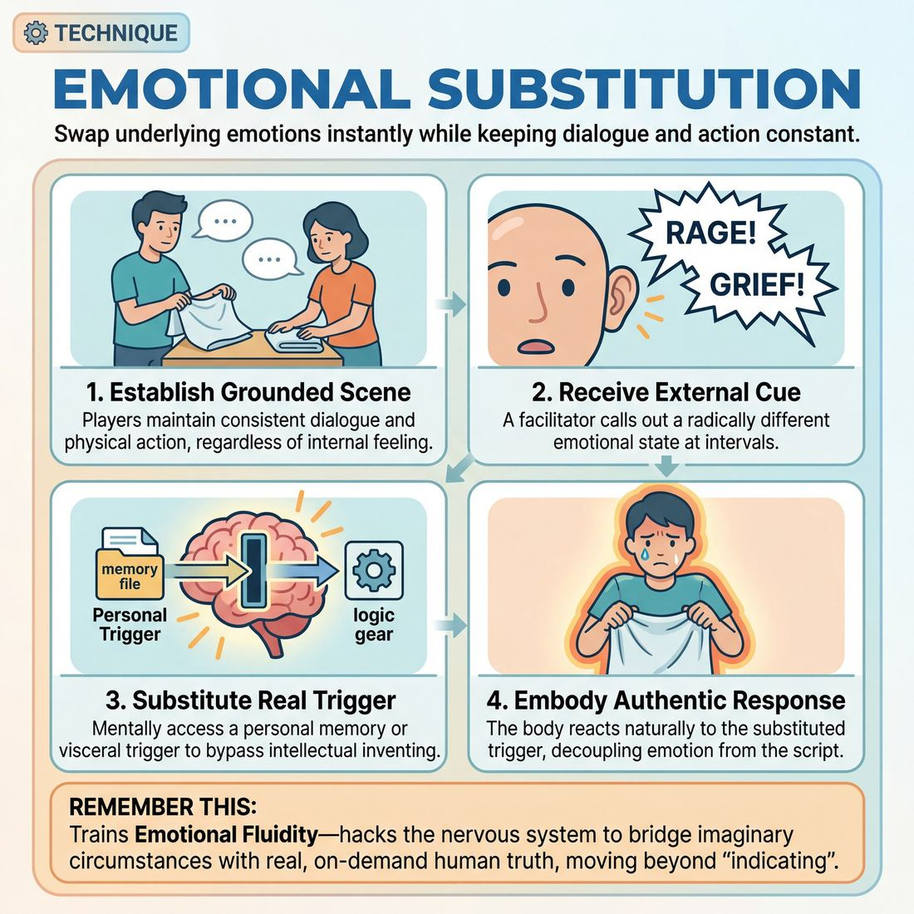

# 🎯 Emotional substitution

> *A drillable muscle that trains **Emotional Fluidity**.*

{ .infographic }

## 🎯 The essence

**Emotional substitution** is a focused drill where improvisers take an existing scene, physical action, or line of dialogue and deliberately swap out the underlying emotional state—often on a coach's immediate cue. By forcing players to keep their words and actions exactly the same while radically shifting their internal feeling (for example, pivoting instantly from seething rage to profound grief), the exercise isolates and trains a single, vital muscle: the ability to decouple text from emotion. It proves that *how* a line is delivered dictates the reality of the scene, training the improviser to instantly access, embody, and commit to a new emotional reality on demand.

## 🎓 What it trains

At its core, emotional substitution is a direct workout for **Emotional Fluidity**. It trains an improviser’s ability to access, inhabit, and transition between genuine emotional states on demand, rather than merely pantomiming them. 

In the early stages of their development, improvisers often suffer from **emotional indicating**. When the scene calls for anger, a novice will consciously name the emotion ("I am so mad at you!") or rely on cartoonish physical shorthand—crossing their arms, furrowing their brow, and raising their volume—without actually feeling anything. This keeps the performance trapped in the intellect. The improviser is playing the *idea* of an emotion, which leaves the scene feeling hollow and disconnected.

Emotional substitution solves this problem by bypassing the intellectual editor entirely. It trains the performer to use their own lived experiences, memories, and sensory triggers to fuel fictional circumstances. By mentally substituting a real, personal trigger in place of the scene's imaginary one, the improviser tricks their nervous system into a genuine physiological response. 

!!! abstract "The Deeper Principle: Truth in Fictional Circumstances"
    The audience does not connect with clever ideas; they connect with authentic human experience. This technique bridges the gap between the imaginary world of the scene and the real nervous system of the performer. It teaches the improviser that they do not need to invent a reaction—they already possess a vast reservoir of real human emotion waiting to be repurposed.

Ultimately, this technique builds the muscle memory required to move up the maturity scale. It pushes a performer past the beginner habit of switching emotions only on external cues, guiding them toward a competent state where they can transition naturally as scene logic dictates. With enough repetition, the need for conscious substitution falls away, and layered, genuine emotion begins to arrive unbidden.

## 💡 Why it works

This technique works by hijacking the brain’s associative memory to bypass the intellectual "inventor" brain. When an improviser tries to conjure an emotion out of thin air based purely on the plot, they usually end up relying on shallow physical clichés. Substitution provides a concrete, lived anchor that forces a genuine physiological response instead.

Here is the engine under the hood:

* **It hacks the nervous system:** The human brain struggles to differentiate between a vividly recalled emotional trigger and a present-moment reality. By substituting a real, personal emotional memory (or a highly specific, evocative image) into the fictional circumstance, the improviser triggers actual somatic changes—altered breathing, flushed skin, micro-expressions, and muscle tension. The body does the acting before the conscious mind can interfere.
* **It lowers cognitive load:** In a scene, trying to invent a complex, justified backstory for *why* your character is furious takes massive mental bandwidth. Substitution removes the pressure to invent. You don't need to logically construct why the character is mad; you just substitute the visceral feeling of a time you were deeply wronged, and let that raw feeling justify the scene's details as they naturally emerge.
* **It severs the dependency on text:** Novice improvisers often rely on the literal words they are saying to dictate how they should feel. By forcing an underlying emotional reality that may have nothing to do with the dialogue (e.g., discussing a grocery list while substituting the feeling of profound betrayal), it proves to the improviser's brain that emotion drives the scene, not the script.

!!! abstract "The Cognitive Hack"
    Emotional substitution shifts the improviser's focus from **output** ("How do I show the audience and my partner that I am sad?") to **input** ("What does this specific memory actually feel like in my chest right now?"). By focusing entirely on the internal input, the external output takes care of itself, resulting in a performance that is grounded, nuanced, and entirely free of hesitation.

## 🧩 The setup

Here is everything you need to arrange before putting this technique into practice. 

*   **Players & Arrangement:** Pairs on stage. The rest of the ensemble sits in the audience to observe the physical and vocal shifts. 
*   **Space & Materials:** An open stage, optionally with two chairs. The facilitator must have a prepared list of 15–20 distinct, high-contrast emotions (e.g., *paranoia, ecstatic joy, quiet devastation, bubbling rage, profound reverence*).
*   **Time:** 15–20 minutes total. Allocate roughly 2 to 3 minutes per pair.
*   **Roles:**
    *   **The Players:** Two improvisers who establish and maintain a simple, grounded scene (often centered around a mundane physical task).
    *   **The Caller (Facilitator):** Stands offstage and acts as the external cue, calling out new emotional states every 15 to 30 seconds.
*   **Prerequisites:** Players should be comfortable establishing a basic base reality (the *who, what, where*) and performing continuous object work. They should understand the difference between *naming* an emotion and physically *embodying* it.

!!! tip "Facilitator prep"
    Do not rely on your brain to invent emotions on the fly while you are also watching the scene. Write a list beforehand. If you hesitate while calling the next emotion, the players will drop their energy waiting for you.

!!! quote "How to introduce it"
    "We are going to practice decoupling *what* we are doing from *how* we feel about it. Two players will get on stage and start a completely mundane scene—like folding laundry, fixing a tire, or organizing a bookshelf. Keep the dialogue simple and focused on the task. 
    
    Every twenty seconds or so, I am going to call out an emotion. Without changing the activity, the topic of conversation, or your relationship, I want you to instantly substitute your current emotional state with the new one. Let the new emotion completely infect your voice, your posture, and how you handle your imaginary objects. Don't talk *about* the emotion; just let it drive the scene until I call the next one."

## ⚙️ The mechanics

The core objective of the drill is to force players to instantly swap the emotional engine of a scene without altering its established reality.

### The Flow of Play

A standard round requires two players and a coach (or a designated caller). 

1. **Establish the Baseline:** Two players begin a mundane, low-stakes scene centered around a shared physical activity (e.g., folding laundry, assembling furniture, or waiting in line). They play it naturally and neutrally for about 30 seconds to establish the base reality.
2. **The Call:** The coach calls out a clear, specific emotion (e.g., "Furious," "Devastated," "Overjoyed," "Paranoid"). 
3. **The Instant Switch:** The players must *immediately* drop their current emotional state and adopt the called emotion. There is no fade-in; the transition must be instantaneous, like flipping a switch.
4. **The Continuation:** Players continue the exact same scene. They keep doing the physical task and continue the mundane conversation, but now every word and movement is filtered through the new emotional state.
5. **The Cycle:** Every 15 to 30 seconds, the coach calls a new emotion. The players instantly pivot again, layering the new emotion onto whatever is happening in that exact second.

!!! tip "On stage: Body first, words second"
    When the new emotion is called, let it hit your physical body before you open your mouth. Change your posture, your breathing, and your facial expression. If you try to find the emotion through dialogue first, you will end up in your head.

### Rules & Constraints

To isolate the emotional muscle, players must adhere to strict boundaries during the drill:

* **No exposition or "time travel":** You may not invent a plot reason to explain *why* you are suddenly feeling this way. If "Devastated" is called while you are folding a towel, do not say, "I can't believe my dog died." You must simply be devastated *about folding the towel*. 
* **Maintain the physical activity:** Do not drop the object work. The friction between a mundane task and a heightened emotion is exactly what builds Emotional Fluidity.
* **Do not change the subject:** Keep talking about whatever you were just talking about. If the topic was the weather, the weather is now the most infuriating, devastating, or joyous topic in the world.
* **Show it, don't say it:** Never name the emotion out loud. Let the audience deduce how you feel by observing your behavior.

### Ending and Resetting

A single round typically lasts 2 to 3 minutes, allowing the players to cycle through 4 to 6 distinct emotional substitutions. The coach calls "Scene" to end the round. The players drop the scene, shake out the physical tension, and step back. Two new players step up, establish a completely new mundane baseline activity, and the next round begins.

## 🎬 Sample round

!!! example "Sample round: The Chipped Mug"
    **Context:** Two improvisers are in a mundane kitchen scene. Player B (Sam) is practicing emotional substitution, choosing to overlay a feeling of profound, real-life betrayal onto a low-stakes fictional offer.

    **Player A (Alex):** *(Holding up a coffee mug)* "Hey, I accidentally chipped your 'World's Okayest Boss' mug while washing it. Sorry about that."

    **Player B (Sam):** 
    * **Step 1: Receive the offer.** Sam hears the words and registers the fictional reality (a broken mug).
    * **Step 2: The Substitution (Internal).** Sam doesn't try to "act sad" about a piece of ceramic. Instead, Sam instantly recalls a visceral, real-life memory of a close friend lying to them. Sam focuses entirely on the *physical sensation* of that real betrayal—the sudden drop in the stomach, the heat in the chest.
    * **Step 3: The Reaction.** Sam lets that genuine, substituted emotion wash over the fictional trigger, responding from the feeling rather than the intellect.

    **Player B (Sam):** *(Voice tight, breaking eye contact, staring at the mug)* "You... you washed it? I told you I always wash that one myself."

    **Player A (Alex):** *(Sensing the genuine weight, instantly dropping their casual posture)* "I was just trying to help. It's just a chip."

    **Player B (Sam):** *(Tears welling up, driven by the real memory but fully applied to the scene)* "It's not about the chip, Alex. It's about you deciding my boundaries don't matter."

    **The Breakdown:** 
    Notice how Sam didn't change the facts of the scene—they are still arguing about a mug. However, by substituting a real emotional trigger, Sam bypassed the intellectual "editor" that plagues a novice and instead delivered layered, genuine emotion. The substitution provided the emotional fuel; the scene provided the vehicle.

## 🎚️ Variations & progressions

To build true Emotional Fluidity, this technique must evolve from a mechanical exercise into a seamless, internal habit. As players move from consciously "acting" an emotion to genuinely feeling it, you can adjust the constraints of the drill to match their maturity.

Here are the primary ways to scale the difficulty:

*   **The Gibberish Strip-Down (Easier):** To bypass the verbal editor entirely, have players perform the substitution drill using only gibberish or by counting from one to ten. Stripped of vocabulary, they are forced to rely entirely on vocal tone, facial expression, and body language to convey the shift.
*   **The Bell Switch (Standard):** The classic drill. Two players begin a grounded scene. Every 30 to 60 seconds, the coach rings a bell and calls out a new emotion. The players must instantly substitute their current emotional state for the new one, while keeping the existing scene context and relationship intact. 
*   **The Secret Shift (Harder):** Before the scene begins, each player secretly draws an emotion from a hat. They start the scene in a neutral or baseline state. Their goal is to transition into their secret emotion naturally, waiting for a moment where the **scene logic calls for it**. This trains improvisers to justify emotional shifts rather than just snapping into them on an external cue.
*   **The Personal Trigger (Advanced):** Borrowed from classical acting, this variation pushes players toward mastery. Instead of playing a generic "sadness" called by the coach, the improviser internally substitutes a highly specific, real personal memory (e.g., the feeling of losing a childhood pet) to fuel the fictional stakes of the scene (e.g., dropping a scoop of ice cream). 

!!! example "In a scene: The Personal Trigger"
    **The Scene:** Two roommates are arguing over who forgot to pay the electric bill. 
    **The Substitution:** Instead of playing "generic sitcom annoyance," Player A internally substitutes the genuine feeling of being deeply misunderstood by a parent. 
    **The Result:** The dialogue remains about the electric bill, but the emotional weight becomes instantly grounded, vulnerable, and compelling. 

!!! tip "On stage: Modulating the intensity"
    Once players can reliably access genuine emotion, challenge them with a **Volume Dial** variation. The coach calls out an emotion and a number from 1 to 10. ("Jealousy, level 3!" followed a minute later by "Jealousy, level 9!"). This trains the master-level ability to not just feel real emotion, but to precisely modulate it to serve the scene.

## 🧑‍🏫 Coaching notes

When coaching emotional substitution, your primary goal is to move the improviser out of their head and into their body. Novices will instinctively try to "act" the emotion by relying on clichés. Your side-coaching must relentlessly push them past indicating and into genuine physiological shifts.

!!! tip "Coaching: The single most important cue"
    **"Breathe it in before you speak."**  
    When an improviser is prompted to switch emotions, their first instinct is to immediately talk to *prove* they are doing it. Force them to take one full, silent breath in the new emotional state before delivering their next line. The breath changes the posture; the posture changes the voice; the voice changes the scene.

### High-Impact Side-Coaching
Keep your side-coaching brief, active, and targeted at the physical reality of the player. Call these out while the scene is in motion:

*   **"Let it hit your body first."** (Interrupts the urge to immediately generate clever dialogue).
*   **"Keep the activity, change the weather."** (Reminds them not to drop their object work or scene premise just because their feelings changed).
*   **"Don't tell us you're sad; show us how you fold laundry when you're sad."** (Grounds the emotion in observable behavior).
*   **"Dial it up to a 10... now internalize it to a 3."** (Helps players who are stuck in cartoonish, over-the-top reactions find grounded nuance).
*   **"Look at your partner through the lens of [Emotion]."** (Shifts the focus outward, making the emotion relational rather than isolated).

### What 'Good' Looks and Sounds Like
You are watching for the transition from a novice (who consciously names or pantomimes an emotion) to a competent player (whose emotions arrive unbidden and alter their physical state). Watch for these observable markers of success:

*   **Respiration changes:** You can visibly see their breathing become shallow (fear/anxiety), heavy (anger/passion), or slow and deep (contentment/arrogance).
*   **Vocal alignment:** They stop relying on volume alone to convey intensity. A proficient player knows that a whisper can carry more fury than a scream. The vocal energy naturally matches the emotional content.
*   **Micro-expressions:** The tension in their jaw, the focus of their eyes, and the resting state of their hands shift organically. 
*   **Seamless dialogue:** The actual words they are saying might be entirely mundane, but the emotional substitution provides a rich, compelling subtext that makes the mundane fascinating.

## 🧭 Debrief & reflection

After the exercise concludes, the goal is to shift players out of the active, vulnerable state of performance and into a space of mindful observation. A strong debrief helps improvisers recognize the difference between indicating an emotion and genuinely experiencing it.

To lock in the learning, gather the group and ask open-ended questions that focus on the physical and psychological experience of the drill:

*   **"Where did you feel the emotional shift first?"** Did it start in your breath, your posture, your face, or your thoughts? 
*   **"Which transition felt the most jarring, and which felt seamless?"** (Often, moving between high-energy emotions like rage and joy is easier than dropping from high-energy to low-energy, like rage to apathy).
*   **"Did you feel the need to change your dialogue to match the new emotion?"** 
*   **"When your partner's emotion changed, how did it physically affect you?"**

### What a good debrief surfaces

A successful reflection period will naturally guide players to a few crucial "aha!" moments about the craft:

*   **The words are secondary:** Players will realize that they didn't need to invent new, clever dialogue to justify the new emotion. The exact same line ("I bought you a coffee") means entirely different things when delivered with seething resentment versus profound grief. 
*   **The body leads the mind:** Improvisers often notice that if they changed their physical posture or breathing pattern first, the emotion naturally followed. Trying to "think" their way into an emotion caused a noticeable delay (what we call **emotional latency**).
*   **The editor was bypassed:** Because the emotional shifts were dictated by the exercise, players didn't have time to judge whether an emotion "made sense" for the scene. They simply had to play it, proving to themselves that they can survive—and thrive—without their internal editor.

!!! abstract "The Core Realization"
    The ultimate takeaway you want players to articulate is that **emotion is an engine, not a reaction**. They do not need to wait for the perfect line of dialogue or the perfect plot point to feel something. They can simply choose to feel it, and the scene will instantly organize itself around that truth.

## ⚠️ Common pitfalls

!!! warning "Watch out: Naming instead of feeling"
    The most common novice trap is indicating the emotion rather than embodying it. Under pressure, a beginner will often say, "I am so furious with you right now!" while their body remains perfectly relaxed and their voice stays conversational. This happens because the brain is processing the *idea* of the emotion, not the physical reality of it. 
    
    **The fix:** Temporarily ban emotion words. Force the improviser to show the emotion entirely through breath, posture, and tone before they are allowed to speak.

When cognitive load increases—such as when an improviser is trying to remember the scene's plot while simultaneously executing an emotional substitution—several other mechanical traps emerge:

*   **The "Volume Knob" Trap**
    *   *The trap:* Improvisers often equate emotional intensity with vocal volume. Anger becomes shouting; sadness becomes whispering. This flattens the nuance of the emotion, makes the scene one-dimensional, and quickly strains the voice.
    *   *The fix:* Coach the physical extremes of the emotion *without* volume. Ask for "quiet, simmering rage" or "loud, desperate sadness." Shift the focus to physical tension, facial expression, and breath rate rather than projection.

*   **Dropping the Given Circumstances**
    *   *The trap:* When the cue to switch emotions hits, the improviser completely abandons the scene's reality. If they were fixing a car and get the cue for "Joy," they drop the imaginary wrench, forget the car, and just start laughing at the wall. The emotion becomes disconnected from the scene.
    *   *The fix:* Anchor the new emotion to the immediate environment. If the cue is "Joy," they must find a reason to be joyful *about the car engine* or *about their scene partner*. The emotion must filter through the existing reality, not erase it.

*   **The "Loading Screen" Pause**
    *   *The trap:* The improviser receives the emotional cue, freezes for three seconds to mentally "load" the new feeling, and *then* reacts. This telegraphs the move, breaks the reality of the scene, and highlights the mechanics of the exercise.
    *   *The fix:* Train improvisers to breathe in the new emotion immediately. The transition doesn't have to instantly hit a level 10, but the physical shift (a change in posture, a sharp inhale, a softening of the eyes) must begin the millisecond the impulse arrives. Let the emotion build in motion.

## 🌟 What mastery looks like

At the highest level of execution, emotional substitution ceases to look like an acting exercise and instead appears as breathtaking, unpredictable human truth. A master improviser performing this technique does not merely "play" an emotion; they allow a genuine feeling to wash over them, instantly altering their physiology while maintaining complete narrative control.

When observing a master execute this technique, look for these distinct hallmarks:

*   **Zero-latency transitions:** There is no visible "gearing up" or processing time. The shift in emotional state happens in the space between words, or even mid-syllable. The impulse and the physical reaction are simultaneous.
*   **Cellular embodiment:** The emotion is not just painted on the face or indicated through a change in volume. It alters the improviser's breathing rate, muscular tension, center of gravity, and vocal resonance. 
*   **Instant justification:** A master doesn't just abruptly switch feelings; they instantly frame the *new* emotion as the logical, inevitable reaction to whatever was just said or done. They retroactively make the pivot make perfect sense.
*   **Modulated truth:** They feel *real* emotion, but they retain the architectural awareness to modulate it. They do not lose control of the scene, their scene partner, or the audience to their own tears or rage.

!!! example "In a scene: The Master's Pivot"
    Two players are cheerfully folding laundry. The coach calls out: *"Betrayal."*
    
    A novice might suddenly scowl and yell, "You cheated on me!" breaking the established reality. 
    
    A **master** stops folding mid-motion. Their breathing becomes shallow. They stare at the shirt in their hands, their voice dropping to a tight, quiet whisper: "This isn't your shirt. You don't wear this brand." The joy hasn't just vanished; it has been weaponized to make the sudden devastation feel earned and grounded.

!!! abstract "The Paradox of Mastery"
    The ultimate expression of emotional substitution is the balance of **surrender and discipline**. The master improviser is completely surrendered to the visceral reality of the feeling, yet entirely in control of how that feeling serves the scene's composition. They are driving the car, even while letting the emotion fuel the engine.

## 🔗 Why it matters

Emotional substitution is the primary mechanical lever for developing Emotional Fluidity. In early stages of improv, players often feel trapped by the emotional weather of a scene—if an argument starts, they stay angry until the lights go down. This technique breaks that lock. It trains the brain and body to understand that emotions on stage are active choices, not inevitable reactions. By forcing a sudden, complete pivot from one state to another, improvisers build the muscle memory required to transition emotions smoothly and authentically when the scene's logic demands it.

At the level of the self, this practice is fundamentally about agency. The domain's ultimate goal is freedom from hesitation and the courage to be truthful. When you know you can safely drop into profound sadness, instantly substitute it for bubbling joy, and then settle into quiet suspicion, you lose the fear of "getting it wrong." You stop hesitating. Furthermore, because true substitution requires a full-body commitment, it demands complete physical and vocal control, ensuring your voice, breath, and posture instantly match your internal state.

!!! abstract "Emotions as tools, not weather"
    In real life, emotions are weather—they happen *to* us. On stage, emotions are tools we wield. Emotional substitution teaches the improviser how to deliberately put down one tool and pick up another, without ever dropping the reality of the scene.

In the wider craft of scene work, this muscle is the ultimate antidote to the "one-note scene." Scenes stall when characters refuse to be affected by each other or get stuck in a single emotional gear (like the polite agreement scene, or the endless bickering scene). The ability to substitute an emotion allows a character to have a genuine arc. It transforms a static interaction into a dynamic relationship where players can surprise themselves, their partners, and the audience by reacting with a completely unexpected—yet entirely justified—feeling.

!!! example "Saving the scene from a rut"
    Two improvisers are stuck in a repetitive, nagging argument about doing the dishes (a common trap). One player realizes the scene is flatlining and uses emotional substitution, dropping their "annoyance" and replacing it with "profound, overwhelming relief." 
    
    Suddenly, the line *"You never wash the pans!"* is delivered with tears of joy and a tight hug. The scene instantly pivots from a mundane bicker into a fascinating mystery: *Why is this character so relieved about dirty dishes?* The substitution breathes life and discovery back into the work.

## 📚 References & Further Reading

### Foundational sources
*   **Uta Hagen, *Respect for Acting* (1973)** — The definitive acting text on the concept of "Substitution." Hagen details how actors can replace fictional circumstances with personal experiences to trigger a genuine, physiological emotional response. Crucially, she warns against using traumatic "emotion memory," instead advocating for substituting manageable, lived experiences that trick the nervous system into a truthful present-moment reaction. [Wiley](https://www.wiley.com/en-us/Respect+for+Acting%2C+2nd+Edition-p-9780470228487)
*   **Viola Spolin, *Improvisation for the Theater* (1963)** — The foundational "bible" of improv. Spolin's exercises on gibberish and mirror speech isolate the *how* of communication from the *what*. By removing the crutch of logical dialogue, she forces improvisers to rely entirely on emotional and physical connection, proving that the text is secondary to the underlying feeling. [Northwestern University Press](https://nupress.northwestern.edu/9780810140080/improvisation-for-the-theater/)
*   **Keith Johnstone, *Impro for Storytellers* (1999)** — Introduces "Fast Food Stanislavski," a technique for improvisers to instantly adopt new emotional states, behaviors, and status levels on the fly. Johnstone developed this to help performers bypass the intellectual "inventor" brain and instantly embody a state without needing deep psychological preparation. [Faber & Faber](https://www.faber.co.uk/product/9780571190997-impro-for-storytellers/)

### Practitioner guides & manuals
*   **Mick Napier, *Improvise: Scene from the Inside Out* (2004)** — Napier explicitly argues that the literal words of a scene have little impact unless filtered through the "how" (the emotion or state of being). He advocates for making strong, instant emotional choices and holding onto them, directly addressing the novice habit of "emotional indicating" by demanding full physical and vocal commitment. [Heinemann](https://www.heinemann.com/products/e00630.aspx)
*   **Matt Besser, Ian Roberts, Matt Walsh, *The Upright Citizens Brigade Comedy Improvisation Manual* (2013)** — Emphasizes that in a black-box theater with no props, the only real thing an improviser can show the audience is a genuine emotional reaction. It details how to ground the "base reality" in truthful emotion, ensuring that even absurd comedic premises are played with absolute emotional sincerity. [UCB Store](https://ucbstore.com/)
*   **Charna Halpern, Del Close, Kim "Howard" Johnson, *Truth in Comedy: The Manual for Improvisation* (1994)** — The core text on long-form improv, arguing that genuine emotional reactions and "truth" are always funnier and more compelling than contrived jokes or pantomimed feelings. It reinforces the principle that the audience connects with authentic human experience over clever ideas. [Penguin Random House](https://www.penguinrandomhouse.com/books/352125/truth-in-comedy-by-charna-halpern-del-close-and-kim-howard-johnson/)

### Lineage & teachers
*   **The Meisner Technique (Sanford Meisner)** — Meisner's famous "Repetition Exercise" is essentially pure improvisation designed to build "emotional fluidity." By forcing actors to repeat the exact same text back and forth, the technique completely decouples the words from the underlying emotional shifts happening in the moment, training the actor to respond truthfully to their partner's behavior rather than the script. [Meisner Center](https://www.themeisnercenter.com/)
*   **HB Studio (Uta Hagen)** — The New York acting studio where Hagen developed and taught her specific approach to Substitution. The studio's lineage emphasizes present-moment authenticity and the use of sensory triggers over the potentially dangerous "emotion memory" techniques of early Method acting. [HB Studio](https://hbstudio.org/)

### Research & theory
*   **Steven H. Knoblauch, *Bodies and Social Rhythms: Navigating Unconscious Vulnerability and Emotional Fluidity* (2020)** — Explores the concept of "emotional fluidity" in a clinical and performative context. Knoblauch discusses how improvisational techniques help individuals shift between emotional states, navigate vulnerability, and break free from rigid, intellectualized responses. [Routledge](https://www.routledge.com/Bodies-and-Social-Rhythms-Navigating-Unconscious-Vulnerability-and-Emotional-Fluidity/Knoblauch/p/book/9780367439507)
*   **Philip Ringstrom, *Cultivating the Improvisational in Psychoanalytic Treatment* (2001)** — An academic paper connecting theatrical improvisation to psychological emotional flexibility. Ringstrom notes how improvisational play bypasses the intellectual "editor" to access genuine affect, mirroring the cognitive hack used in emotional substitution drills. [ResearchGate](https://www.researchgate.net/publication/232536836_Cultivating_the_Improvisational_in_Psychoanalytic_Treatment)

### Talks, videos & courses
*   **"Emotion Switch" / "Emotional Endowment" Drills** — A ubiquitous improv exercise taught globally (from elementary drama classes to advanced UCB/iO workshops) where a facilitator calls out emotions mid-scene. This forces players to instantly justify the new feeling without changing the scene's context, serving as the direct practical application of the concepts discussed in this node. *(Widely documented in open-source improv encyclopedias).*

### Communities & adjacent reading
*   **Constantin Stanislavski, *An Actor Prepares* (1936)** — The origin point for modern discussions of emotional truth on stage. While his early "Emotion Memory" techniques were later modified by teachers like Hagen and Meisner, his foundational premise—that actors must experience genuine feeling rather than mechanically indicating it—is the bedrock of this improv technique. [Bloomsbury](https://www.bloomsbury.com/us/actor-prepares-9781780937419/)
*   **Improv Encyclopedia** — A comprehensive, community-maintained database of improv games. It catalogs various iterations of the "Emotion Switch" and "Emotional Halves" drills, providing alternative setups and coaching notes for facilitators looking to train emotional fluidity. [Improv Encyclopedia](http://improvencyclopedia.org/)

## 💬 Quotes & Anecdotes

!!! quote "— Uta Hagen, *Respect for Acting* (1973)"
    "I use substitution in order to 'make believe' in its literal sense... in order to send me into the moment-to-moment spontaneous action of my newly selected self on stage."

!!! quote "— Uta Hagen, *Respect for Acting* (1973)"
    "Substitution is not an end in itself, not an end to involve you for self-involvement's sake without consequent action... It is a way of bringing about justified, personal character actions."

!!! quote "— Mick Napier, *Improvise: Scene from the Inside Out* (2004)"
    "How people do something in improvisation is most of the reason people laugh at improvisation."

!!! quote "— Del Close & Charna Halpern, *Truth in Comedy* (1994)"
    "Real humor does not come from sacrificing the reality of a moment in order to crack a cheap joke, but in finding the joke in the reality of the moment. Simply put, in comedy, honesty is the best policy."

### Where it comes from

The term **substitution** was famously codified by legendary acting teacher Uta Hagen in her 1973 book *Respect for Acting*. She defined it as the act of mentally superimposing a person, place, or thing from your own life onto the fictional circumstances of the play to trigger a genuine physiological and emotional response, bridging the gap between the actor's reality and the character's world.

In the improv world, the specific drill of calling out shifting emotions during a scene was pioneered by Viola Spolin. She created the exercise "Intensify Emotions" (where a third player shouts out new emotions for the improvisers to instantly incorporate) specifically to address the problem of actors failing to portray their character's emotions truthfully. As Spolin noted of her process in a *Los Angeles Times* interview: "The games emerged out of necessity, I didn't sit at home and dream them up. When I had a problem directing, I made up a game."

### A telling example

**Illustrative Scene: The Laundry**

To see how emotional substitution decouples text from feeling, imagine two improvisers folding laundry. The dialogue is entirely mundane: 
"Did you separate the whites?" 
"Yes, I put them in the basket."

The coach suddenly calls out: **"Paranoia!"**
The improvisers do not change the subject or invent a reason to be scared. Instead, Player A suddenly checks the window blinds, whispering, *"Did you separate the whites?"* Player B handles a pair of socks as if they might be bugged, replying with a terrified nod, *"Yes, I put them in the basket."*

The coach calls out: **"Profound reverence!"**
Instantly, Player A drops to their knees, holding up a folded t-shirt as if it were a holy relic, weeping with awe: *"Did you separate the whites?"* Player B bows their head, voice trembling with spiritual grace: *"Yes... I put them in the basket."*

The text remains identical, but the substituted emotion completely alters the reality, stakes, and comedy of the scene.

## 🧭 Explore the framework

- ⬆️ **Skill it trains:** [Emotional Fluidity](01_S2__emotional-fluidity.md)
- 🎭 **Domain:** [The Self](01_D__the-self.md)
- 🔁 **Sibling techniques:** [The Emotional Dial (1→10)](01_S2_T1__the-emotional-dial-1-to-10.md)
