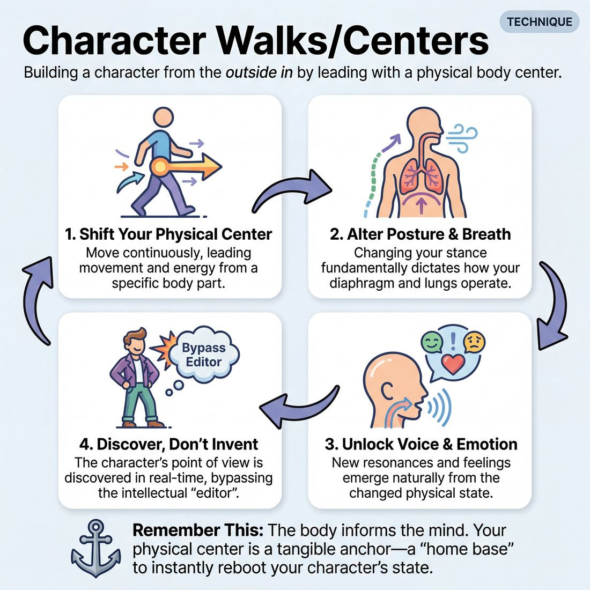

# 🎯 Character Walks/Centers

> *A drillable muscle that trains **Physicality & Space Work**.*

{ .infographic }

## 🎯 The essence

**Character Walks** (often called **Leading Centers**) is a foundational physical exercise where improvisers move continuously through the space, shifting their posture, tempo, and weight to lead from specific body parts—like a jutting chin, a sunken chest, or a heavy pelvis. It forces players to practice a single, vital skill: building a character from the *outside in*. By bypassing the intellect and letting physical gravity and momentum dictate the persona, improvisers discover that a simple shift in how they walk instantly unlocks new emotions, voices, and points of view without having to "think" them up.

## 🎓 What it trains

This technique directly targets the improviser's physical baseline, forcing them out of their default posture and into a state of complete physical and vocal control. Instead of intellectually inventing a backstory, an attitude, or a clever premise, the improviser alters their physical carriage and lets the body dictate the character's personality, status, and voice. 

!!! abstract "The Core Principle: The Body Informs the Mind"
    When you change how you move, you change how you breathe. When you change how you breathe, you change how you feel. This technique leverages physical shifts to bypass the intellectual brain, unlocking spontaneous emotional and vocal choices.

Specifically, Character Walks build three critical muscles:

*   **Physicality & Space Work:** It breaks the habit of the "neutral improviser stance" (hands in pockets, weight evenly distributed). By isolating a specific body part to lead with—such as the nose, the pelvis, or the collarbone—the improviser learns to sustain a distinct physical choice that completely alters their interaction with the environment.
*   **Spontaneity (Bypassing the Editor):** When an improviser is intensely focused on maintaining a heavy, leaden walk or a frantic, toe-driven scurry, the intellectual "editor" is too occupied to censor ideas. The impulse and the action become simultaneous, allowing the improviser to discover the character's point of view in real-time rather than pre-planning it.
*   **Vocal Craft:** A collapsed, concave chest naturally produces a different vocal resonance than a puffed-out, rigid torso. This exercise trains the improviser to let their voice instantly convey age, status, or emotional state simply by surrendering to the physical container they have built.

**The problem it solves:** Improvisers frequently suffer from "talking head" syndrome—standing in a comfortable, everyday posture while trying to write a clever script on the spot. This usually results in characters that are just the improviser with a slight accent or a quirky catchphrase. Character Walks provide an immediate, tangible anchor. They give the improviser something concrete to *do* before a single word is spoken, ensuring the character is rooted in the body rather than trapped in the head.

## 💡 Why it works

Character Walks operate on the foundational acting principle of **outside-in discovery**. The engine under the hood relies on a predictable physiological chain reaction. When you shift your physical **center**—the specific point in the body from which your movement and energy originate—you fundamentally alter your anatomy in real-time:

*   **Posture dictates breath:** Leading with your chest forces your shoulders back and opens your lungs. Leading with your nose pulls your neck forward and compresses your diaphragm.
*   **Breath dictates voice:** An open chest naturally deepens your breath, lowering your vocal register and increasing resonance. A compressed diaphragm creates shallow breathing, raising your pitch and thinning your voice.
*   **Voice and posture dictate emotion:** The brain takes cues from the body (a concept known as *embodied cognition*). If you are breathing deeply and taking up space, your brain registers confidence, arrogance, or power. If you are hunched and breathing shallowly, your brain registers anxiety, curiosity, or submission.

!!! abstract "Bypassing the Editor"
    Improvisers often freeze when asked to "play a character" because the intellectual pressure to invent is too high. This technique removes that pressure entirely. You don't have to think of a personality; you only have to follow the physical rule of the walk. The character emerges automatically as a byproduct of the movement.

By anchoring a character in a physical center, the improviser also creates a tangible "home base." If they ever feel lost or get stuck in their head during a scene, they don't need to remember *what* their character thinks—they only need to remember *how* their character stands. Returning to the physical center instantly reboots the emotional state.

!!! example "In a scene"
    An improviser steps out to initiate, deliberately choosing to lead with their **pelvis**. This forces a slight lean back, a wider stance, and a slower, heavier gait. Before they even speak, the physical swagger makes them feel relaxed and dominant. When their scene partner asks, "Did you bring the files?", the improviser naturally responds with a slow, unbothered drawl: "I brought something better." The character was born entirely from the hips.

## 🧩 The setup

*   **Players & Group Size:** The entire ensemble plays simultaneously. Ideal for groups of 6 to 16 players. Moving as a collective lowers the stakes and prevents the self-consciousness that comes from being watched individually.
*   **Arrangement:** Scattered. Players should walk in random, intersecting patterns, utilizing the entire floor space without forming circles, lines, or clusters. 
*   **Space & Materials:** A fully cleared room. Push all chairs, bags, and obstacles to the walls. Physical safety is paramount, as players will be altering their posture, balance, and sightlines. No props are needed.
*   **Time:** 10–15 minutes total. Spend about 45–60 seconds on each specific "center" or physical prompt before shifting to the next. 
*   **Roles:** 
    *   The **Facilitator** acts as the external guide, calling out new centers of gravity, tempos, or physical adjustments, and side-coaching to encourage deeper commitment.
    *   The **Players** act as the canvas, continuously moving and allowing the physical prompts to dictate their internal emotional state and character perspective.
*   **Prerequisites:** Basic spatial awareness (e.g., having done a simple "walk the grid" exercise) and a baseline level of ensemble trust, as players will be exploring exaggerated, sometimes vulnerable physicalities.

!!! tip "Setting the room"
    Playing instrumental music underneath this exercise can work wonders. A steady, driving rhythm gives players a baseline tempo to walk to, and the ambient noise helps mask the awkwardness of early vocalizations, encouraging players to bypass their internal editor.

!!! quote "How to introduce it"
    "Start walking the room at a normal, neutral pace. Keep your eyes up and fill the empty spaces. In a moment, I’m going to ask you to shift your center of gravity or lead with a specific body part. Don't plan a character in your head. Just let the physical change happen first. Notice how that new posture changes your breathing, your weight, and your mood. If an attitude, a facial expression, or a voice bubbles up, don't fight it—let it out. Let your body do the driving."

## ⚙️ The mechanics

The core objective is to practice outside-in character generation. Here is the systematic flow of the exercise:

1. **Establish Neutral:** Players walk randomly around the room in **neutral**—a relaxed, natural gait with their own everyday posture, making soft eye contact with others but not interacting. 
2. **The Prompt:** The coach calls out a specific body part to "lead" with, or a specific center of gravity (e.g., *"Lead with your chin,"* *"Put your center in your knees,"* or *"Imagine a string pulling your chest forward"*).
3. **The Physical Shift:** Without stopping their walk, players immediately shift their posture to let that body part drive their momentum. They must allow this shift to naturally alter their stride length, tempo, arm swing, and balance.
4. **The Psychological Discovery:** As they walk, players observe how the new physical center makes them *feel*. Does leading with the pelvis make them feel confident? Sleazy? Lazy? Does leading with the forehead make them feel anxious or intellectual? 
5. **Vocalization:** Once the physical rhythm is established, the coach instructs players to add a sound—a sigh, a grunt, or a breath—that matches the body. This sound is then expanded into a single word or a short catchphrase.
6. **Brief Interaction:** Players begin greeting each other as they pass (*"Good morning,"* *"Out of my way"*). The goal is to let the voice instantly convey the age, status, and emotional state discovered in the walk.
7. **The Reset:** The coach calls *"Neutral!"* Players immediately drop the physical affectation and return to their baseline walk, shaking off the character entirely before the next prompt.

### Rules & Constraints

* **Keep moving:** Players must not stop walking to "think" about who they are. The friction of movement is what generates the character.
* **Body first, mind second:** Players must strictly avoid pre-planning. If the prompt is "lead with your lower back," they must not decide *"I'll be an old man"* and then adjust their back. They must adjust their back first, and let the old man arrive unbidden.
* **Exaggerate, then calibrate:** Players should initially push the physical shift to an absurd, cartoonish extreme (a 10 out of 10), and then, on the coach's cue, dial it back to a grounded, believable human level (a 4 out of 10) while retaining the core essence.

!!! abstract "Key idea: The 'Center'"
    In physical theater, a **center** is the imagined point from which a character's energy and movement originate. A person whose center is in their head moves and processes the world very differently than a person whose center is in their groin or their toes.

!!! tip "On stage"
    You don't need to do a lap around the stage to use this technique in a show. When stepping off the back wall to initiate or enter a scene, simply choose a body part to lead with for your first three steps. By the time you reach the center of the stage, you will have a fully formed character and point of view.

## 🎬 Sample round

!!! example "Sample round: From Center to Scene"
    **The Setup:** The ensemble is walking the room in a neutral, everyday gait. The facilitator begins calling out physical prompts, guiding the players from a physical shift to a fully realized character.

    **1. Shifting the Center**  
    **Facilitator:** "Keep your pace, but now imagine a heavy iron hook pulling you forward by your sternum. Lead entirely with your chest."  
    * **Player A (Sarah):** Puffs her chest out. Her shoulders naturally roll back, and her chin lifts to balance the weight. Her stride becomes longer, heavier, and more planted.  
    * **Player B (David):** Also leads with the chest, but leans back slightly, creating a relaxed, arrogant strut. His arms swing wider to compensate for the shifted center of gravity.

    **2. Adding Vocalization**  
    **Facilitator:** "Notice how this posture changes your breathing and your status. On your next exhale, let out a non-verbal sound that belongs to this body."  
    * **Sarah:** Lets out a sharp, dismissive *"Hmph."*  
    * **David:** Exhales a booming, relaxed *"Haaaah."*

    **3. Changing the Center**  
    **Facilitator:** "Drop that character. Return to neutral. Now, let the center of gravity drop down to your knees. Lead with your knees."  
    * **Sarah:** Her proud posture collapses instantly. Her steps become short, shuffling, and slightly bouncy. Her gaze naturally drops to the floor.  
    * **David:** Bends his knees deeply, walking with a wide, cautious, almost crab-like gait. 

    **4. Finding the Point of View**  
    **Facilitator:** "Find a sound for this new body. Now, make eye contact with someone you pass, and give them a one-line greeting based entirely on how this body feels."  
    * **Sarah (passing David, looking up nervously from her shuffling gait):** "S-sorry, I didn't mean to take up so much of the hallway."  
    * **David (wiping imaginary sweat, still in a deep, cautious squat):** "Terrible day for the joints, isn't it?"

    **The Takeaway:** Notice the mechanics in action. Neither player *invented* a character in their head first. Sarah didn't plan to be an apologetic mouse, and David didn't plan to be an exhausted laborer. The physical center dictated the posture, which altered the breath, which effortlessly provided the character's voice and point of view.

## 🎚️ Variations & progressions

This technique scales beautifully from a chaotic, high-energy warm-up to a sophisticated tool for generating nuanced, theatrical characters. As improvisers move through the maturity stages, the focus shifts from gross physical exaggeration to subtle, internalized psychology.

Here is how to ramp the difficulty of the exercise:

### The Progression Path

1. **Pure Isolation (Novice):** Players simply walk around the room leading with different body parts (nose, chin, chest, pelvis, knees). The goal is purely physical compliance. At this stage, players are learning to bypass the editor and trust their first physical impulse without worrying about "who" the character is yet.
2. **Adding Tempo and Weight (Advanced Beginner):** Once players can isolate a center, introduce variables of speed and gravity. Ask them to move their chest-center through molasses, or their nose-center across hot coals. This builds reliable physical offers and introduces the beginnings of distinct character rhythms.
3. **Vocalization and Catchphrases (Competent):** The physical center must now dictate the vocal craft. Ask players to let a sound escape that matches their body. A heavy, pelvis-led walk might produce a slow, resonant drawl; a quick, forehead-led walk might produce a clipped, nasal stutter. Players learn to match their vocal energy directly to their physical state.
4. **The Cocktail Party (Proficient):** Players maintain their physical center and vocal choice while interacting with others. The facilitator calls out a setting (e.g., "You are all at a high-society art gallery"). Players must now hold their physical choices while engaging in spontaneous dialogue, allowing layered, genuine emotions to arise from the physical constraints.
5. **The Dial-Down (Master):** The ultimate progression. Players take an extreme, cartoonish physical center (a "10 out of 10") and are instructed to dial the external physicality down to a "2", while keeping the *internal* psychological tension at a "10". The character now looks like a normal human being, but carries a profound, specific point of view. 

!!! tip "On stage: The 10-to-2 Dial"
    The "Dial-Down" is the secret to bringing big character choices into grounded, realistic scenes. If your center is your chin pointing straight up to the ceiling (a 10), dialing it to a 2 means your chin is only tilted a fraction of an inch higher than normal. The audience just sees a slightly arrogant, aloof person, but *you* feel the full, commanding status of the original physical choice.

### Common Variations

* **Animal Centers:** Instead of body parts, players adopt the physical center of an animal (the heavy, rolling shoulders of a bear; the darting, erratic head movements of a pigeon). They then slowly morph that animal physicality into a human walking down the street.
* **Laban Efforts:** Based on the work of movement theorist Rudolf Laban, players combine three variables—**Weight** (Heavy/Light), **Space** (Direct/Indirect), and **Time** (Sudden/Sustained). For example, walking with Heavy, Direct, and Sudden energy creates a "Punch" character; Light, Indirect, and Sustained creates a "Float" character.
* **The Invisible String:** A visualization variant. Tell players to imagine an invisible string attached to a specific body part, being pulled by a puppet master. This helps players who struggle with the abstract idea of a "center" to physically commit to the leading movement.

!!! example "In a scene"
    Two players step out for a scene. Player A initiates with a "knees-in, toes-pointed-together" center, dialed down to a 3. This physical constraint naturally shortens their breath and raises their vocal pitch. Without thinking, they offer, "I... I brought the spreadsheets you asked for." The physical center did 90% of the character work before the scene even began.

## 🧑‍🏫 Coaching notes

When coaching Character Walks and Centers, your primary job is to bypass the improviser's analytical brain. Students will naturally want to *decide* on a character and then figure out how that person walks. You must relentlessly coach the reverse: move the body first, and let the body dictate the character.

!!! tip "Coaching"
    **"Don't invent a character; let the body tell you who you are."**  
    This is the single most important cue you can give. If you see a student furrowing their brow, trying to *think* of a persona before they move, interrupt them. Tell them to simply lead with their chin, or drop their shoulders, and wait to see who shows up. The psychology must follow the physiology.

Use continuous, rhythmic side-coaching while the group is moving. Keep your prompts open-ended to trigger physical impulses rather than intellectual choices:

*   **To deepen the physical commitment:** "Exaggerate that center 20% more." / "How does this walk change your spine?" / "Where does this person hold their tension?"
*   **To connect body to breath and voice:** "Notice how this person breathes. Is it shallow? Deep?" / "Let out a sigh, a grunt, or a greeting that matches this body." *(This pushes them toward competent vocal craft, where they learn to match vocal energy directly to their physical state).*
*   **To connect to the environment:** "Look around the room through this person's eyes." / "Make eye contact with someone else—how does this character feel about them?" / "Change your pace. How does this person hurry?"

**What 'Good' Looks Like**  
You are watching for the moment the "actor" disappears. A novice will often change their gait but keep their own neutral, everyday facial expression. When the exercise is working, the physical center infects the *entire* instrument. 

You will see their resting facial tension shift, their breathing pattern change, and their gaze alter. They will stop looking at you for approval and start existing fully in the space. At this point, they are demonstrating the spontaneity of a proficient improviser: impulse and action become simultaneous, without the latency of conscious thought.

## 🧭 Debrief & reflection

After the physical exertion of exploring different gaits and centers of gravity, the debrief is where players consciously connect their physical choices to character psychology. The goal is to help them recognize how altering their physical container automatically generates a point of view, bypassing the need to "invent" one.

Use these questions to guide the post-exercise discussion:

*   **"Which physical center gave you the strongest emotional reaction?"** 
*   **"Did a voice, an age, or a specific attitude arrive without you having to think about it?"**
*   **"How did your relationship to the room—or the other people in it—change when you led with your pelvis versus your nose?"**
*   **"Which walk felt the most unnatural to you, and what kind of character did it force you to become?"**

!!! abstract "The Core Realization: Outside-In"
    Improvisers often try to think their way into a character's mind first, hoping the body will follow (Inside-Out). A successful debrief locks in the realization that changing the physical body first (**Outside-In**) automatically dictates the psychology, requiring zero mental heavy lifting. 

A productive debrief will naturally surface several key insights from the players:

*   **The death of the editor:** Players will often express surprise at how quickly a character appeared. Because their brain was occupied with the physical task of "walking from the knees," their internal editor was distracted, allowing a fully formed persona to slip through.
*   **Inherent status:** The group will notice that certain centers inherently carry **status** (a character's relative power or importance). Leading with a puffed chest or a lifted chin naturally feels high-status and authoritative, while leading with rounded shoulders or heavy feet feels low-status or submissive.
*   **Vocal alignment:** Players should articulate that they didn't have to *choose* a voice. They will note that their pitch, tempo, and resonance shifted organically to match the physical center—proving that vocal craft is deeply tied to physical state. 
*   **Breaking defaults:** Many improvisers will realize they have a "default" neutral walk on stage that limits their character range. Recognizing this default is the first step toward making deliberate, transformative physical choices in future scenes.

## ⚠️ Common pitfalls

Physical character work is notoriously fragile. When an improviser is walking silently, they can easily maintain a brilliant, distinct physical center. But the moment the brain is forced to process scene logic, generate dialogue, or listen to a scene partner—a spike in **cognitive load**—the body often abandons the character and snaps back to its default state. 

Here are the most common traps improvisers fall into when working with physical centers, and how to fix them.

!!! warning "Watch out: The 'Talking Head' Reversion"
    **The Trap:** The improviser leads beautifully with their nose or pelvis while walking the grid. The moment the coach says "freeze and speak," their posture instantly deflates back to their everyday, neutral self. The brain prioritizes the words and drops the body.
    
    **The Fix:** Lower the cognitive load. Before asking for dialogue, have the improviser make a single, sustained sound that matches the body. Then, move to gibberish. When they finally use English, instruct them to keep 90% of their focus on maintaining the physical center, letting the words be an afterthought.

!!! warning "Watch out: The Uninhabitable Cartoon"
    **The Trap:** The improviser pushes the physical center to an extreme—thrusting their chest out so far they are practically falling over, or hunching so deeply they can't look up. It becomes a visual gag rather than a sustainable human being, completely blocking emotional fluidity.
    
    **The Fix:** Dial it back. Ask the improviser to take the physicality to a "10 out of 10," then reduce it to a "7," and finally settle at a "3." A center should inform a character's point of view and status, not cripple their ability to navigate the stage or hold a grounded scene.

!!! warning "Watch out: Wearing the Body Like a Suit"
    **The Trap:** The physical craft and the vocal craft are completely disconnected. An improviser might lead with a heavy, grounded, low-pelvis center, but speak in their default high-pitched, fast-paced, apologetic voice. 
    
    **The Fix:** Connect the breath to the center. Ask the improviser, *"If this specific body had a voice, where does it resonate?"* Force the vocal pitch, tempo, and volume to originate directly from the physical center. A chest-led character might speak with booming resonance; a nose-led character might speak with a nasal, rapid-fire clip.

!!! warning "Watch out: Locking the Joints"
    **The Trap:** To maintain a new center of gravity, the improviser tenses their muscles—locking their knees, stiffening their neck, or holding their breath. This physical tension breeds mental hesitation, killing spontaneity.
    
    **The Fix:** Remind them that a center is an *energy lead* or a shift in gravity, not a muscular contraction. Have them shake out their limbs while keeping the center intact. If they cannot breathe deeply, they are holding the character with tension rather than inhabiting it.

## 🌟 What mastery looks like

When an improviser masters Character Walks and Centers, the technique itself disappears. You no longer see an actor "leading with their chin" or "walking with heavy knees"; you simply see a fully realized, breathing human being who has just entered the room. The physical choice is no longer an overlay—it is the absolute engine of the character's psychology.

At the highest level of proficiency, this mastery is observable in four distinct ways:

*   **Zero latency:** Transformation is instantaneous. There is no "warm-up" pacing required to find the character's groove. The moment a center is assigned or chosen, the physical impulse and the character's manifestation happen simultaneously. 
*   **The holistic ripple:** A master understands that a physical center dictates everything else. If the center is the collarbone, it doesn't just change their posture—it alters their vocal resonance, their breathing rate, and their emotional baseline. The voice becomes a fully controlled instrument serving that specific physical state.
*   **Scalability:** They can play the center at a theatrical "10" (broad, clownish, highly physical) or dial it down to a cinematic "2" (subtle, naturalistic) without losing the specific physical truth of the character.
*   **Active stillness:** The character remains vividly alive even when the walk stops. A master can hold the room with complete stillness, because the tension, weight, and emotional point of view of the chosen center are still entirely present in their resting posture.

!!! example "In the room"
    Watch a master improviser shift from a **forehead center** to a **pelvis center**. 
    
    The forehead character might have darting eyes, shallow chest breathing, and a clipped, nasal voice. On the command to switch, the drop is immediate: the breath sinks to the belly, the gaze becomes heavy and grounded, the vocal pitch drops, and the emotional state shifts from anxious to deeply relaxed—all in a fraction of a second, before a single word is spoken.

## 🔗 Why it matters

The body is the improviser's most immediate, yet often most underutilized, tool. **Character Walks/Centers** matter because they flip the traditional script of character creation: instead of thinking up a persona and hoping the body follows, you change the body and let the persona arrive automatically.

This technique directly serves its parent skill—**Physicality & Space Work**—by expanding your physical vocabulary beyond your default posture. It forces you to occupy space differently, which in turn changes how you interact with the environment, handle object work, and relate to your scene partners.

Within the domain of **The Self**, this muscle is a shortcut to achieving freedom from hesitation and complete physical control:

*   **Bypassing the Editor:** When you lead with a physical center, you don't have time to overthink. The physical constraint dictates the character's point of view, moving you toward simultaneous impulse and action without intellectual latency.
*   **Unlocking Emotional Fluidity:** Emotion lives in the body. A sunken, heavy-pelvis walk naturally invites lethargy, stubbornness, or grief. A light, toe-driven walk invites anxiety, eagerness, or joy. The physical center acts as a reliable trigger for genuine, layered emotion to arrive unbidden.
*   **Sustaining the Choice:** A strong physical center gives you an anchor. When you feel lost in the dialogue of a scene, returning to that specific physical tension instantly grounds you back in the character's reality.

!!! abstract "The Outside-In Approach"
    Improvisers often get trapped in their heads trying to invent a "clever" character. Leading from a physical center is the ultimate **outside-in** technique. By altering your physical silhouette first, you give your brain a tangible puzzle to solve: *"Who walks like this? How does this person feel?"* The psychology follows the physiology.

In the wider craft of improvisation, mastering physical centers allows an ensemble to paint a visually dynamic stage. It ensures that a scene featuring three actors doesn't just look like three improvisers standing in a semi-circle, but rather a distinct clash of statuses, energies, and lived-in bodies. It transforms the stage from a talking-head radio play into a fully realized, three-dimensional world.

## 📚 References & Further Reading

### Foundational sources
*   **Michael Chekhov, *To the Actor: On the Technique of Acting* (1953)** — The definitive origin of the "Imaginary Centers" technique. Chekhov, a student of Stanislavski who broke away to develop a more physical approach, details how leading from specific body parts (the chest, the head, the pelvis) generates character from the outside in. He argues that the actor must discover their character through physical gestures and momentum rather than purely psychological examination. [Routledge](https://www.routledge.com/To-the-Actor-On-the-Technique-of-Acting/Chekhov/p/book/9780415258753)
*   **Jacques Lecoq, *The Moving Body (Le Corps Poétique)* (1997, English trans. 2000)** — A foundational text on physical theater that explores centers of gravity, the neutral mask, and how physical movement dictates psychological states. Lecoq's pedagogy heavily involves isolating body parts and using physical momentum to bypass the intellect, making it essential reading for improvisers looking to build characters physically. [Bloomsbury](https://www.bloomsbury.com/us/moving-body-le-corps-poetique-9781474244770/)
*   **Rudolf Laban, *The Mastery of Movement* (1950)** — Laban's movement analysis is a foundational system for observing and describing human movement. His concepts of "Efforts" (e.g., wring, press, glide, float) are frequently used alongside character walks to give players specific physical parameters that bypass the intellect and generate distinct emotional states.
*   **Viola Spolin, *Improvisation for the Theater* (1963)** — The creator of the "Space Walk," Spolin's exercises are the direct ancestor of moving through the room to discover physical and spatial awareness before scene work begins. Her side-coaching techniques during these walks are designed to remove intellectual distractions and help players enter the moment with their physical selves, treating the space itself as a tangible substance. [Northwestern University Press](https://nupress.northwestern.edu/9780810140080/improvisation-for-the-theater/)

### Practitioner guides & manuals
*   **Keith Johnstone, *Impro: Improvisation and the Theatre* (1979)** — The "Status" chapter explicitly breaks down how physical adjustments instantly alter a character's dominance and internal state. Johnstone explains how moving smoothly versus jerkily, keeping the head still, or pointing toes inward or outward fundamentally changes how a player feels and how they are perceived in the space. [Routledge](https://www.routledge.com/Impro-Improvisation-and-the-Theatre/Johnstone/p/book/9780878305251)
*   **Mick Napier, *Improvise: Scene from the Inside Out* (2004)** — Napier challenges the "rules" of improv and strongly advocates for making a physical or spatial choice at the top of a scene. He argues that "doing something, anything" physically—and committing to that posture or action—provides an immediate, tangible anchor that dictates the character's point of view without having to invent a clever premise. 

### Lineage & teachers
*   **The Michael Chekhov Association (MICHA)** — An international community and training organization dedicated to preserving and advancing Chekhov's psycho-physical acting techniques. Their workshops and resources focus heavily on "Imaginary Centers" as a tool to unlock new qualities of movement and presence without forcing intellectual choices. [michaelchekhov.org](https://www.michaelchekhov.org/)
*   **École Internationale de Théâtre Jacques Lecoq** — Founded in Paris in 1956, this school remains the global center for physical theater training. Its curriculum, which heavily influences modern physical improv, focuses on the "moving body" and how physical centers of gravity inform character and theatrical space. Many of the world's top physical comedians and improvisers trace their lineage back to Lecoq's pedagogy. [ecole-jacqueslecoq.com](https://www.ecole-jacqueslecoq.com/)

### Research & theory
*   **Rhonda Blair, *The Actor, Image, and Action: Acting and Cognitive Neuroscience* (2008)** — Examines the physiological relationship between bodily action and emotional experience. Blair provides the cognitive science framework (embodied cognition) behind why outside-in acting works, explaining how posture, breath, and movement are inseparable from emotion and memory in the brain's structure. [Routledge](https://www.routledge.com/The-Actor-Image-and-Action-Acting-and-Cognitive-Neuroscience/Blair/p/book/9780415772242)
*   **Ana Hedberg Olenina, Eric L. Amazeen, Bonnie Eckard, & Jason Papenfuss, *"Embodied Cognition in Performance: The Impact of Michael Chekhov's Acting Exercises on Affect and Height Perception"* (Frontiers in Psychology, 2019)** — An empirical study demonstrating how Chekhov's physical movement exercises systematically change an actor's mood, arousal, and perceived physical state. The research provides scientific backing for the improv principle that changing your physical container changes your emotional reality. [Frontiers in Psychology](https://www.frontiersin.org/articles/10.3389/fpsyg.2019.02277/full)

### Communities & adjacent reading
*   **Viola Spolin's Theater Games Online** — An archive and community resource detailing Spolin's original side-coaching prompts for Space Walks and physical awareness exercises. It provides invaluable context on how to facilitate these walks to ensure players are actually discovering their bodies rather than just pantomiming. [spolingamesonline.org](https://www.spolingamesonline.org/)

## 💬 Quotes & Anecdotes

!!! quote "— Michael Chekhov, *To the Actor* (1953)"
    Imagine a center in your chest from which living impulses are sent out into your arms, hands, legs, and head. [...] The actor, who must consider his body as an instrument for expressing creative ideas on the stage, must strive for the attainment of complete harmony between the two, body and psychology.

!!! quote "— Keith Johnstone, *Impro: Improvisation and the Theatre* (1979)"
    I change my behaviour and become authoritative. I ask them what I've done to create this change in my relation with them, and whatever they guess to be the reason—'You're holding eye contact', 'You're sitting straighter'—I stop doing, yet the effect continues. Finally I explain that I'm keeping my head still whenever I speak, and that this produces great changes in the way I perceive myself and am perceived by others.

### Where it comes from
The concept of "Leading Centers" in modern improv is a direct descendant of the **Michael Chekhov technique**. Chekhov, a brilliant actor and student of Konstantin Stanislavski, developed the "Imaginary Center" exercise in the mid-20th century. He taught that by imagining a center of energy in a specific part of the body (like the chin, the chest, or the knees) and letting all movement originate from that point, an actor could bypass their own intellect and instantly unlock a character's psychology. 

In the improv world, this outside-in approach was further championed by **Viola Spolin**, who emphasized "physicalization" as the primary tool to get players out of their heads (teaching that the body stimulates the mind, not the other way around), and **Keith Johnstone**, who used physical adjustments—like the angle of the head or the weight of a walk—to teach his famous concepts of high and low status.

### A telling example
In *Impro*, Keith Johnstone shares a classic anecdote about teaching status through physical carriage. He would sit in front of a class and subtly change his physical behavior to become highly authoritative. When he asked the students what he had done to create this shift, they would guess he was holding eye contact or sitting straighter. He would stop doing those things, yet the authoritative effect continued. 

Finally, he revealed the secret: he was simply keeping his head perfectly still whenever he spoke. This tiny physical shift—anchoring his center in a still head—completely altered how he perceived himself and how the room perceived him, proving that internal emotion and status are dictated by external physicality. 

Another common illustrative scenario in improv classes involves the "Nose Walk." A facilitator asks improvisers to walk around the room leading entirely with their noses. Without any intellectual prompting, players naturally begin to crane their necks, quicken their pace, and adopt a snoopy, inquisitive, or anxious demeanor. The physical center automatically writes the character's personality before the improviser has to invent a single idea.

## 🧭 Explore the framework

- ⬆️ **Skill it trains:** [Physicality & Space Work](01_S3__physicality-and-space-work.md)
- 🎭 **Domain:** [The Self](01_D__the-self.md)
- 🔁 **Sibling techniques:** [Object work](01_S3_T2__object-work.md), [Weight & resistance mime](01_S3_T3__weight-and-resistance-mime.md)
