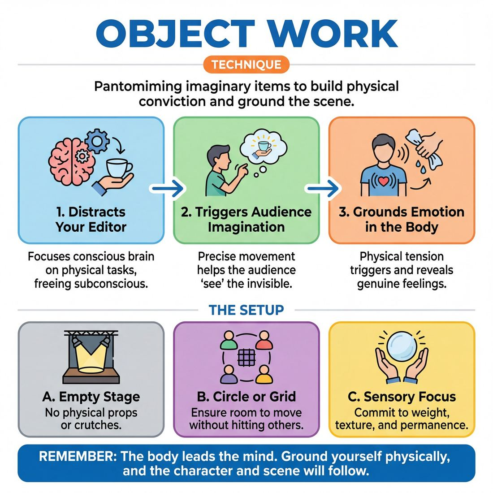

# 🎯 Object work

> *A drillable muscle that trains **Physicality & Space Work**.*

{ .infographic }

## 🎯 The essence

**Object work** is the technique of creating and manipulating imaginary items, tools, and environments on an empty stage using only pantomime. At its core, it forces a player to practice a single, vital skill: **physical conviction**. By treating the invisible as tangible—giving an imaginary coffee cup specific weight, temperature, and dimension—the improviser bypasses their intellectual editor, anchors themselves in their body, and conjures a concrete reality out of thin air.

## 🎓 What it trains

At its core, object work trains **Physicality & Space Work**—the ability to conjure a three-dimensional world and interact with it consistently. But beneath the surface, it is a profound tool for mastering the domain of **The Self**, building physical control, emotional grounding, and the courage to be still.

It exists to solve one of the most common afflictions in improv: the "talking heads" syndrome. When improvisers feel the pressure to invent a scene, they often freeze physically, drop their hands to their sides, and rely entirely on dialogue to generate plot. Object work short-circuits this panic by giving the body a concrete reality to inhabit. 

Specifically, practicing this technique builds several vital muscles:

*   **Physical consistency and control:** You train the body to remember where the invisible coffee cup was placed, how heavy the sledgehammer is, and the exact resistance of a stuck door. This builds spatial awareness and physical discipline.
*   **The discipline of stillness:** Object work provides a physical justification for silence. Instead of rushing to fill a beat with words out of discomfort (a common novice trap), a player engaged in a physical task can comfortably hold the room's focus, letting the moment breathe automatically.
*   **Emotional grounding:** Emotion is housed in the body. The physical tension of wringing out a heavy, wet towel can organically trigger feelings of frustration or exhaustion, moving a player from consciously naming an emotion to genuinely feeling it.

!!! abstract "The body leads the mind"
    Improvisers often think they must decide *who* they are and *how* they feel before they move. Object work flips this script. By committing to the physical reality of an object first—feeling its weight, temperature, and texture—the character, the relationship, and the emotion will naturally follow.

## 💡 Why it works

Object work functions as a psychological anchor for the improviser and a visual anchor for the audience. While it looks like a purely physical skill, its true power lies in how it manipulates cognitive load, emotional expression, and group pacing. 

The engine under the hood relies on three core mechanisms:

*   **Occupying the "Editor":** The conscious brain—the part that panics about what to say next or judges your ideas—is easily distracted. By giving it a demanding physical task (unscrewing a tight jar, threading a needle, folding a fitted sheet), your internal editor is kept busy. This frees your subconscious to listen deeply and react organically, helping you bypass hesitation and respond with true spontaneity.
*   **Triggering Mirror Neurons:** For the audience, watching precise, consistent physical movement triggers the brain to "see" the invisible object. When you respect the weight, temperature, and dimensions of a coffee mug, the audience's imagination automatically fills in the ceramic. You establish the "Where" and the "What" instantly, without needing a single word of clunky exposition.
*   **Externalizing Internal States:** Objects act as a physical barometer for a character's emotions. How you handle an object reveals how you feel about your scene partner or your situation. This bridges the gap between consciously *stating* an emotion and letting layered, genuine feeling arrive unbidden through physical action.

!!! example "In a scene"
    Instead of saying, "I am furious with you," an improviser aggressively chops invisible carrots, the knife hitting the invisible cutting board with sharp, rhythmic intensity. The object work does the emotional heavy lifting, allowing the spoken dialogue to carry rich subtext (e.g., "Did you call your mother?").

!!! abstract "Key idea"
    Object work shifts the improviser's focus from the **auditory** (what am I going to say?) to the **tactile and spatial** (what am I doing?). By grounding the body in physical reality, the mind is freed from the pressure to invent.

## 🧩 The setup

To effectively drill object work, the environment must be entirely stripped of physical crutches so players are forced to rely solely on their physical and vocal control. 

Here is how to set up the room for foundational exercises (such as the "Object Pass" or "Solo Morning Routine"):

*   **👥 Players & Arrangement:** 
    *   *For passing drills:* 6 to 12 players standing in a wide, unobstructed circle.
    *   *For solo environment drills:* Players stand in a staggered grid (checkerboard pattern) facing the facilitator, ensuring everyone has enough wingspan to move without hitting a neighbor.
*   **🏛️ Space & Materials:** A completely empty stage or rehearsal room. **No physical props, cups, or phones.** If chairs are used, they must be integrated into the mime (e.g., sitting on a real chair while pantomiming a steering wheel), but ideally, the space is entirely bare.
*   **⏱️ Time:** 10–15 minutes total. If doing solo spotlight rounds, allocate 1–2 minutes per player. If doing a continuous group drill, run it for 5–7 minutes before pausing to debrief.
*   **🎭 Roles:**
    *   **The Active Player:** Focuses entirely on the sensory reality of the invisible object—its weight, texture, temperature, and dimensions.
    *   **The Observers (The Group):** Watch the active player's hands and body. Their job is to mentally "see" the object based purely on the active player's physical commitment.
    *   **The Facilitator:** Stays active on the sidelines, side-coaching for **object permanence** (keeping the object in the same place) and physical resistance (gravity and mass).
*   **🤸 Prerequisites:** A physical warm-up that activates the hands, arms, and core. Players should already be out of their heads and physically loose; tension destroys the illusion of mime.

!!! tip "The 'One Real Object' trick"
    Before starting the drill, it can be highly effective to hand a player a *real* object (like a heavy water bottle or a set of keys). Ask them to feel its weight, toss it, and observe how their muscles react. Then, take the real object away and ask them to immediately recreate that exact muscle memory with an invisible version.

!!! quote "How to introduce it"
    "Today, we are going to make the invisible visible. The audience can only see what you truly see and feel. We aren't just 'pretending' to hold a coffee mug—we are going to feel the heat radiating through the ceramic, the weight of the liquid, and the exact thickness of the handle. If your hand passes through a solid object, the audience's belief shatters. Take your time, breathe, and let your muscles do the remembering. Let's start by passing a heavy, invisible bowling ball around the circle."

## ⚙️ The mechanics

!!! abstract "Core Objective"
    To create a shared physical reality out of thin air. Players must define, manipulate, and transfer an invisible object using only physical cues, forcing them to rely entirely on muscle memory, tension, and spatial awareness rather than words.

The most effective way to drill this technique is the **Object Transformation Circle**. This exercise isolates the physical mechanics of object work by removing dialogue and scene logic, leaving only the pure physical reality of the item.

### The Flow of Play

1. **Establishment (The Grasp):** Player A reaches into the neutral space and "takes hold" of an invisible object. They must immediately define its **shape** (how their fingers and palms mold around it) and **weight** (how their arms, shoulders, and core tense to support it). 
2. **Manipulation (The Use):** Player A interacts with the object for 5–10 seconds. They demonstrate its **texture**, **temperature**, or **function** through deliberate action (e.g., sipping from a scalding, heavy ceramic mug; bouncing a light, rubbery ball).
3. **The Pass (The Handoff):** Player A makes eye contact with Player B and physically transfers the object. The handoff must strictly respect the object's established physics. A heavy bowling ball must be handed over with visible effort; a delicate, fluttering bird must be transferred with gentle caution.
4. **The Reception (The Catch):** Player B receives the object, exactly matching the weight, shape, and spatial positioning established by Player A. Player B must "feel" the object before doing anything else.
5. **The Transformation (The Shift):** Once Player B has fully accepted and demonstrated the original object, they seamlessly mold it into a *new* object with entirely different physical properties. The loop then begins again as they prepare to pass this new object to Player C.

### Rules & Constraints

* **Silence is mandatory:** No speaking or vocalized sound effects. The communication must be entirely physical.
* **The Physics Checklist:** Every object must clearly demonstrate at least three of the five physical properties: *Weight, Shape, Texture, Temperature,* and *Resistance* (how the object pushes back).
* **Object Permanence:** Objects cannot teleport or phase through matter. If you set a heavy box on an invisible table, your hands cannot later pass through the space that box occupies. 
* **No "Ghosting":** Fingers must not collapse through the center of a solid object. If holding a baseball, the hand must remain cupped at the exact diameter of the ball.

!!! tip "On stage: The 'Click'"
    When manipulating an object, look for the physical "click"—the moment your muscles genuinely engage with the resistance of the invisible item. If you are opening a jar, your forearm muscles should actually flex. Your body cannot lie; if you don't physically exert the effort, the audience won't see the jar.

### How a Round Ends and Resets

A standard round concludes when the object has successfully traveled around the entire circle and returned to Player A. 

To reset or escalate the drill, the coach introduces a new global constraint for the next rotation. For example, the coach might call out, *"Reset. This round, every object must weigh more than 50 pounds,"* or *"Reset. This round, every object must be fragile and sharp."* This forces players out of their default physical habits and builds a wider vocabulary of muscle tension.

## 🎬 Sample round

!!! example "Sample round: The Morning Pour-Over"
    **Context:** Two improvisers step out for an open scene. Player A initiates with silent object work to ground the environment before any dialogue begins.

    **Player A (Sam):** *(Stands with feet planted. Holds left hand in a fixed 'C' shape, resting at waist height on an invisible counter. With the right hand, pinches an invisible kettle handle. Lifts the right hand—showing slight tension in the forearm and shoulder to indicate weight. Slowly moves the right hand in a tight, deliberate circle.)*  
    **Mechanic in action:** Sam establishes **dimension** (the 'C' shape of the mug), **permanence** (the mug stays anchored to the counter), and **weight** (the heavy kettle). 

    **Player B (Alex):** *(Walks in, stops, and tracks Sam's right hand with their eyes.)* "You're doing the blooming thing again. It's just coffee, Sam."  
    **Mechanic in action:** Alex observes and endows the object work. Because Sam's mime was precise and unhurried, Alex easily identifies the action and uses it to establish their dynamic.

    **Player A (Sam):** *(Stops pouring. Sets the kettle down with a subtle downward 'clunk' motion, flattening the right hand on the counter. Brings the right hand up to wipe a bead of sweat from their forehead, while the left hand remains perfectly locked in the 'C' shape on the counter.)* "It's not just coffee, it's a ritual."  
    **Mechanic in action:** Sam demonstrates **independence of limbs**. The left hand maintains the object's permanence and shape, while the right hand breaks away to perform a secondary action.

    **Player B (Alex):** *(Reaches across the counter, sliding their hand over Sam's left hand to 'take' the invisible mug. Sam immediately drops the 'C' shape, letting their hand fall naturally. Alex brings the mug to their lips, suddenly jerks their head back, and exhales sharply.)* "Ow! Boiling!"  
    **Mechanic in action:** The players successfully navigate **shared space**. Sam relinquishes the object exactly as Alex takes it, preventing the illusion of two mugs. Alex then adds a **sensory reaction** (temperature), making the invisible object feel dangerous and real to the audience.

## 🎚️ Variations & progressions

To build the muscle of object work, you must progressively increase the cognitive load. Start with simple physical accuracy, then layer in collaboration, emotion, and finally, profound silence. 

Here is how to ramp the difficulty of object work drills, tied to a player's development in **The Self**:

### 1. The Single Object Study (Novice)
At the novice stage, players often rush to fill silence with dialogue because they feel exposed. This drill removes words entirely to build comfort with stillness.
*   **The exercise:** A player stands in silence and interacts with a single **space object** (an invisible item created entirely through physical mime) for one full minute. 
*   **The focus:** Establishing weight, texture, temperature, and dimensions. If it’s a coffee mug, how thick is the handle? How hot is the ceramic? 
*   **The goal:** Holding a beat without panicking. The physical task gives the brain a concrete focus, preventing the editor from demanding immediate dialogue.

### 2. The Shared Object (Advanced Beginner)
Once a player can reliably create an object, they must learn to maintain its reality when another player interacts with it.
*   **The exercise:** Player A creates an object, uses it, and hands it to Player B. Player B must receive it, respecting the exact dimensions, weight, and fragility established by Player A, before transforming it into a *new* object and passing it to Player C.
*   **The focus:** Observation and physical consistency. 
*   **The goal:** Moving from isolated mime to collaborative reality.

!!! example "In a scene"
    If Player A struggles to lift a massive, heavy invisible box and shoves it toward Player B, Player B cannot simply catch it effortlessly with one hand. They must let the established weight of the box impact their own body.

### 3. Emotional Tasking (Competent to Proficient)
As players progress, they no longer need to consciously think about the dimensions of a space object. Now, the object work becomes a vehicle for emotional fluidity.
*   **The exercise:** Players are assigned a repetitive physical task (e.g., folding laundry, washing dishes, chopping wood). As they perform the task, the coach calls out different emotional states or triggers.
*   **The focus:** Letting the emotion alter *how* the object is handled, without breaking the physical reality of the object itself. 
*   **The goal:** Bypassing the editor. When the body is occupied with a familiar physical task, layered, genuine emotion often arrives unbidden because the conscious mind is distracted.

!!! tip "On stage"
    Angry folding looks very different from joyful folding, but the shirt remains the same size. Let your emotional state bleed into your physical tension, your breathing, and your pace—not the dimensions of the object.

### 4. The Silent Anchor (Master)
At the highest level of mastery, object work is no longer just about creating an environment; it is a tool for pacing and tension.
*   **The exercise:** Two players execute a scene with high emotional stakes, but they are only allowed to speak one line of dialogue every 30 seconds. The rest of the scene must be driven entirely by their interaction with their environment and each other.
*   **The focus:** Using the physical world to communicate subtext.
*   **The goal:** **Weaponizing silence.** A master uses the deliberate, focused handling of an object—like slowly and meticulously pouring a cup of tea while staring down an opponent—to hold the room with stillness, creating an audible collective focus in the audience.

## 🧑‍🏫 Coaching notes

When coaching object work, your primary job is to act as the improviser’s physical mirror. Because they cannot actually see or feel the invisible items they are handling, they rely on your real-time side-coaching to build muscle memory, spatial awareness, and physical consistency.

!!! tip "Coaching: The Golden Cue"
    **"See it, then touch it."**  
    The most common error in object work is the hands moving before the brain has defined the object. Side-coach improvisers to lock their eyes on the invisible object *first*, establish its exact location in space, and *then* reach for it. 

Keep your side-coaching active, specific, and focused on the physical body. Use these targeted prompts to address different elements of the craft:

*   **For Weight and Resistance:** "Show me how heavy that is." "Engage your shoulders." "Let the object push back." Remind them that a full coffee pot requires different muscle tension than an empty one.
*   **For Dimension and Shape:** "Lock your grip." "Don't let the steering wheel shrink." "Feel the texture of the cloth." Encourage them to freeze their hands for a micro-second to check if the object has magically changed size.
*   **For Object Permanence:** "Where did you set the mug down?" "You just walked through the kitchen island—step around it." "Respect the architecture."
*   **For Emotional Connection:** "How do you feel about doing this specific chore?" "Let the object affect your mood." This pushes the improviser to move from mechanically executing a task to letting the physical action inform their character's internal state.

**What 'Good' Looks Like**  
As a coach, you are watching for three observable metrics of success:

1.  **Eye tracking:** The improviser’s eyes follow the object while they are manipulating it. If they are chopping an onion while making unbroken eye contact with their scene partner, the illusion breaks.
2.  **Muscle tension:** You can visibly see forearms, biceps, and core muscles engage. The physical effort matches the implied mass of the object.
3.  **Environmental integrity:** The improviser remembers where the table, the door, and the props are, and interacts with them consistently without needing to be reminded.

## 🧭 Debrief & reflection

After a round of focused object work, the debrief should shift the players' attention from *what* they mimed to *how* the physical effort affected their mental state and scene work. The goal is to help improvisers recognize the link between physical discipline and emotional grounding.

Use these questions to guide the post-round discussion:

*   **"When did the object feel the most real to you, and what specific physical detail made that happen?"** Prompts players to identify the exact mechanics—like feeling the resistance of a heavy door or the delicate grip on a teacup—that triggered sensory recall.
*   **"How did focusing on the object change your pacing or dialogue?"** Helps players notice that physical focus naturally slows them down, preventing the habit of rushing to fill silence.
*   **"Did anyone discover their character's emotion or point of view *through* the way they handled the object?"** Highlights how physical actions (e.g., aggressively scrubbing a plate versus gently polishing it) can generate spontaneous emotional fluidity.
*   **"At what point did you lose track of the object, and what caused it?"** Encourages self-awareness around when the editor takes over—usually when a player panics about what to say next and drops their physical environment to focus entirely on talking.

!!! abstract "What a good debrief surfaces"
    A successful reflection period often reveals a counterintuitive truth: focusing intensely on a fake object actually **reduces the pressure to invent**. Players will frequently report that the object gave them a reason to pause, breathe, and simply exist in the space. 

Listen for players realizing that the object work provided a safe anchor. When an improviser notes, *"I didn't know what to say, so I just kept chopping the onions until I felt something,"* they are articulating the exact transition from a panicked novice to a competent player who uses physical action to bypass the mental editor.

## ⚠️ Common pitfalls

Object work is notoriously fragile under cognitive load. When an improviser is suddenly tasked with processing a complex line of dialogue, feeling an emotion, or inventing a response, the brain reallocates resources away from the body. The result? The physical reality of the scene instantly evaporates. 

Here are the most common ways object work breaks down under pressure, and how to rebuild it.

!!! warning "Watch out: The Dialogue Drop"
    **The Trap:** You are sweeping the floor beautifully. Your partner enters and speaks. You immediately freeze, broom hovering in mid-air, to listen and deliver your line. 
    
    **The Fix:** This happens because novices instinctively prioritize verbal processing over physical continuity. To fix it, consciously practice decoupling speech from movement. Let the rhythm of the sweeping continue, and allow the physical exertion to inform *how* you deliver the line. If you must stop sweeping, make it a deliberate character choice (e.g., leaning on the broom to listen), not an accidental freeze.

!!! warning "Watch out: Hologram Hands"
    **The Trap:** You pick up a bowling ball, but your arm moves with the effortless speed of picking up a feather. Or, you lean on a counter, but your hand slowly slides down through the "solid" surface.
    
    **The Fix:** You are missing **weight** and **resistance**. Engage your muscles to simulate gravity. If an object is heavy, let it pull your shoulder down and slow your movements. If you are touching a flat surface, lock your wrist and do not let your hand clip through the imaginary geometry. 

!!! warning "Watch out: Object Amnesia"
    **The Trap:** You carefully place a hot cup of coffee on a table center-stage. Two minutes later, you walk directly through the table, kicking the invisible coffee into the audience.
    
    **The Fix:** Anchor your environment. When you establish a piece of architecture, mentally map it to a real-world reference point on the stage (e.g., "The table is exactly over that scuff mark on the floor"). Respect its physical boundaries for the entire scene. 

!!! warning "Watch out: The Morphing Prop"
    **The Trap:** You are holding a wide steering wheel. As the scene progresses, your hands drift closer together. Without ever letting go, your steering wheel has shrunk to the size of a teacup.
    
    **The Fix:** Define and maintain the **volume** and **dimensions** of the object. Lock the distance between your hands. If you need to interact with something else, consciously put the first object down, pocket it, or hand it off. Never let an object simply melt away in your hands.

!!! tip "On stage: The 'Look, Reach, Touch' Rule"
    A quick way to cure sloppy object work is to break interactions into three distinct beats:
    
    1. **Look** at the object (establishes where it is).
    2. **Reach** for the object (establishes its distance).
    3. **Touch** the object (establishes its weight and texture).
    
    Rushing these three steps into one blurry motion is the root cause of most novice object work mistakes.

## 🌟 What mastery looks like

Mastery in object work is paradoxical: it becomes so precise that the audience stops noticing the pantomime and simply sees the object. The technique disappears entirely into the reality of the scene, leaving behind a fully grounded, lived-in environment. 

When an improviser reaches the highest level of physical control, their object work is defined by several observable traits:

*   **Unconscious competence (Split attention):** The improviser can execute complex physical tasks—chopping an onion, threading a needle, rolling a cigarette—without looking at their hands. They maintain unbroken eye contact and emotional connection with their scene partner while the physical task runs on automatic pilot.
*   **True physical consequence:** Invisible objects exert real forces on the improviser’s body. A heavy suitcase visibly pulls their shoulder down and alters their gait; a hot mug forces a sudden, sharp shift of the fingers; a tight jar lid engages the core and reddens the face.
*   **Flawless object permanence:** The physical environment remains locked in space. If a master sets a wrench on a workbench, they remember exactly where it is three minutes later, pick it up from the exact same height, and never accidentally walk through the bench.
*   **Emotional articulation:** The object becomes an extension of the character's internal state. The way a master folds a towel—sharp and rigid, or slow and defeated—tells the audience everything about their emotional reality before a single word is spoken.

!!! example "In a scene"
    Two improvisers are having a tense, whispered argument in a kitchen. One is making a sandwich. The master improviser doesn't just wave their hands vaguely; they twist the lid off the mayonnaise jar, scrape the knife against the inside glass, spread it edge-to-edge, and wipe the blade on the crust—all while delivering a heartbreaking line. The mundane reality of the sandwich grounds the high stakes of the argument.

!!! abstract "The Stage 5 Master"
    At the highest level of **The Self** domain, there is no measurable latency between the impulse to interact with the environment and the physical execution. The improviser uses their body as a fully controlled instrument, where even the stillness of holding a delicate, invisible object—like a trembling teacup or a fragile photograph—commands the room's collective focus.

## 🔗 Why it matters

Object work is the anchor that keeps a scene from floating away into a void of talking heads. By manifesting physical reality out of thin air, you give both yourself and your scene partner a tangible world to inhabit, grounding abstract dialogue in concrete action.

As the foundational muscle of **Physicality & Space Work**, object work is the micro-level execution of a macro-level environment. You cannot establish a believable, immersive kitchen (the space) if you cannot convincingly chop an onion (the object). Mastering the weight, texture, and permanence of individual items trains the body to respect the physical boundaries of the imagined world. 

Within the domain of **The Self**, object work is a masterclass in physical control and discipline. It demands the focus to remember exactly where you set your coffee mug down, and the bodily awareness to maintain the muscular tension of holding a heavy steering wheel while delivering an emotional monologue. It cures the improviser's unconscious urge to fidget by giving their hands purposeful, truthful action.

Beyond the individual actor, precise object work ripples outward to elevate the wider craft:

*   **Character revelation:** *How* a character handles an object—gently polishing a heavy wrench versus aggressively scrubbing a delicate teacup—speaks volumes about their emotional state, status, and point of view before they ever say a word.
*   **Gifts for your partner:** A clearly defined object gives your scene partner something to react to, steal, or ask about. If you are struggling to open a jar, you have instantly provided your partner with an opportunity to help, mock, or ignore you.
*   **Establishing the "Where":** A few well-executed objects (a steering wheel and a radio dial; a clipboard and a stethoscope) instantly communicate the location to the audience and the ensemble, bypassing the need for clunky exposition.

!!! abstract "The physical beat"
    Object work is a secret weapon for mastering **Silence & Stillness**. When you need to hold a beat or let an emotional moment breathe, a physical action—taking a slow sip of water, carefully folding a letter, or wiping grease off your hands—allows you to stay active and present in the silence. It justifies the pause, preventing the novice instinct to rush in and fill the quiet with unnecessary words.

## 📚 References & Further Reading

### Foundational sources
*   **Viola Spolin, *Improvisation for the Theater* (1963)** — Spolin is the absolute foundation of this technique in modern improv. She coined the terms "Space Objects" and "Space Walks," establishing the philosophy that invisible objects are made of "space substance." She taught that players must physically mold this substance, which prevents pantomime from looking like empty charades and instead makes the invisible visible to the audience. [Northwestern University Press](https://nupress.northwestern.edu/9780810140080/improvisation-for-the-theater/)
*   **Jacques Lecoq, *The Moving Body (Le Corps Poétique)* (2000)** — A foundational text on physical theater and mime. While not strictly "improv comedy," Lecoq's teachings on physical conviction, the weight of movement, and how the body interacts with space heavily influenced modern physical improv. His exercises train the exact physical consistency and muscle memory required for believable object work. [Bloomsbury](https://www.bloomsbury.com/us/moving-body-le-corps-poetique-9781474244398/)

### Practitioner guides & manuals
*   **Matt Besser, Ian Roberts, and Matt Walsh, *The Upright Citizens Brigade Comedy Improvisation Manual* (2013)** — Contains a dedicated section on "Object Work," detailing how treating invisible objects with realistic weight, volume, and permanence grounds a scene. The manual emphasizes that the only real objects on an improv stage are chairs, and everything else must be endowed with physical reality to establish the "Where" and prevent the dreaded "talking heads" syndrome. [UCB Store](https://ucbstore.com/books/the-upright-citizens-brigade-comedy-improvisation-manual)
*   **Mick Napier, *Improvise: Scene from the Inside Out* (2004)** — Napier explicitly advocates for initiating scenes by doing something physical or grabbing an imaginary object *before* deciding what it is. He argues that using physical action bypasses the conscious, judgmental brain, forcing the improviser to react organically and discover the scene's context through their body rather than inventing it intellectually. [Heinemann](https://www.heinemann.com/products/e00630.aspx)

### Lineage & teachers
*   **Viola Spolin & Paul Sills (The Compass Players / The Second City)** — The lineage of object work traces directly from Spolin's theater games in Chicago to the founding of modern improv. Because early improv stages were bare, "space work" became the necessary replacement for physical props and sets, a tradition carried on by The Second City and eventually codified by long-form schools like iO and UCB. [Viola Spolin Estate](https://violaspolin.org/)
*   **Martin de Maat** — The late, legendary Second City teacher who famously emphasized that object work suppresses the judgmental part of the brain because the physical task occupies the conscious mind. *(unverified exact quote, but widely cited as a core teaching by his students and veteran improvisers like Todd Stashwick)*. [The Second City](https://www.secondcity.com/)

### Research & theory
*   **Rhonda Blair, *The Actor, Image, and Action: Acting and Cognitive Neuroscience* (2008)** — Explores the physiological relationship between bodily action and emotional experience. This provides a neuroscientific backing for how physical movement (like wringing a heavy towel or aggressively chopping carrots) triggers genuine emotional states, proving the improv maxim that "the body leads the mind." [Routledge](https://www.routledge.com/The-Actor-Image-and-Action-Acting-and-Cognitive-Neuroscience/Blair/p/book/9780415774246)
*   **Giacomo Rizzolatti & Corrado Sinigaglia, *Mirrors in the Brain: How Our Minds Share Actions and Emotions* (2008)** — The foundational text on mirror neurons (discovered by Rizzolatti's team at the University of Parma). This explains the audience-side mechanism of object work: when an improviser physically commits to the weight and shape of an invisible object, the audience's mirror neurons fire as if they are interacting with the object themselves, making the illusion cognitively "real." [Oxford University Press](https://global.oup.com/academic/product/mirrors-in-the-brain-9780199217984)
*   **Brad M. Krumholz, *Being in Performance: A Philosophical Account of the Embodied Actor* (2018)** — An academic exploration of Embodied Cognition (EC) in actor training, explaining how human understanding is a fully embodied interaction with the environment. This directly supports the improv theory that physical space work anchors cognitive focus and reduces the mental load of inventing dialogue. [CUNY Academic Works](https://academicworks.cuny.edu/gc_etds/2650/)

### Talks, videos & courses
*   **Jimmy Carrane, *Improv Nerd* (Podcast & Blog)** — Carrane frequently discusses the mechanics of object work, specifically how it occupies the "editor" and frees the subconscious. His writings on the subject synthesize decades of Chicago improv wisdom on why physical tasks make improvisers more creative, less judgmental, and more interesting to watch. [Jimmy Carrane](https://jimmycarrane.com/5-reasons-to-do-object-work-in-an-improv-scene/)
*   **Spolin Games Online: "Begin/End" Exercise** — A digital archive of Spolin's teachings, featuring specific breakdowns of exercises like "Begin/End," which trains improvisers to truly *see* the space object rather than just drawing an empty picture of it in the air. [Spolin Games Online](https://spolingamesonline.org/)

## 💬 Quotes & Anecdotes

!!! quote "— Viola Spolin, *Theater Game File* (1989)"
    Objects made of space substance should be looked upon as thrusts/projects of this (invisible) inner self into the visible world.

!!! quote "— Matt Besser, Ian Roberts, and Matt Walsh, *The Upright Citizens Brigade Comedy Improvisation Manual* (2013)"
    Handling and interacting with the objects in your scene's fictional physical environment helps the improviser commit to their reality, and helps the audience buy into that same reality.

!!! quote "— Joe Bill, Co-Founder of The Annoyance Theatre"
    How you do what you do is who you are.

!!! quote "— Mick Napier, *Improvise: Scene from the Inside Out* (2004)"
    This is the difference between when object-work and environment become a crutch to go to when you're in your head and when they become powerful tools for bringing more to a scene or a character.

### Where it comes from
The concept of "space work" (and the creation of "space objects") was coined by Viola Spolin, widely considered the "Mother of Improv," in her foundational 1963 book *Improvisation for the Theater*. Drawing on her background as a drama supervisor, Spolin created "space walks" and object exercises to help actors physically connect to their environment rather than relying solely on their intellect. She famously described her work as an effort to "make the invisible visible." Later, pioneers like Del Close and the founders of the Upright Citizens Brigade adapted these exercises to cure the "talking heads" syndrome in long-form improv, cementing object work as a mandatory foundational skill.

### A telling example

**The difference between mime and object work**
Gary Schwartz, a professional mime who studied under Viola Spolin in the 1970s, once performed an intricate, technically perfect pantomime of an object for her class. When he finished, Spolin asked him a simple question: "Did you really see that object? Or were you drawing us a picture?" 

Schwartz admitted he was just drawing a picture for the audience. Spolin replied, "And it was a very nice picture, honey. We saw it. But *you* didn't." This interaction perfectly captures the essence of improv object work: it is not about performing a clever theatrical illusion for the crowd, but about the improviser genuinely seeing and feeling the weight of the object themselves, which organically grounds their performance.

**Using objects to reveal character**
When Keegan-Michael Key was performing at The Second City, he developed a furious coach character. Rather than just yelling to show his anger, he relied on specific object work: an invisible clipboard and a whistle. When the character reached his boiling point, Key would violently snap the invisible clipboard over his knee and blow the invisible whistle at his players. The physical commitment to the invisible objects communicated the character's rage and status far more effectively than dialogue alone.

## 🧭 Explore the framework

- ⬆️ **Skill it trains:** [Physicality & Space Work](01_S3__physicality-and-space-work.md)
- 🎭 **Domain:** [The Self](01_D__the-self.md)
- 🔁 **Sibling techniques:** [Character Walks/Centers](01_S3_T1__character-walks-centers.md), [Weight & resistance mime](01_S3_T3__weight-and-resistance-mime.md)
