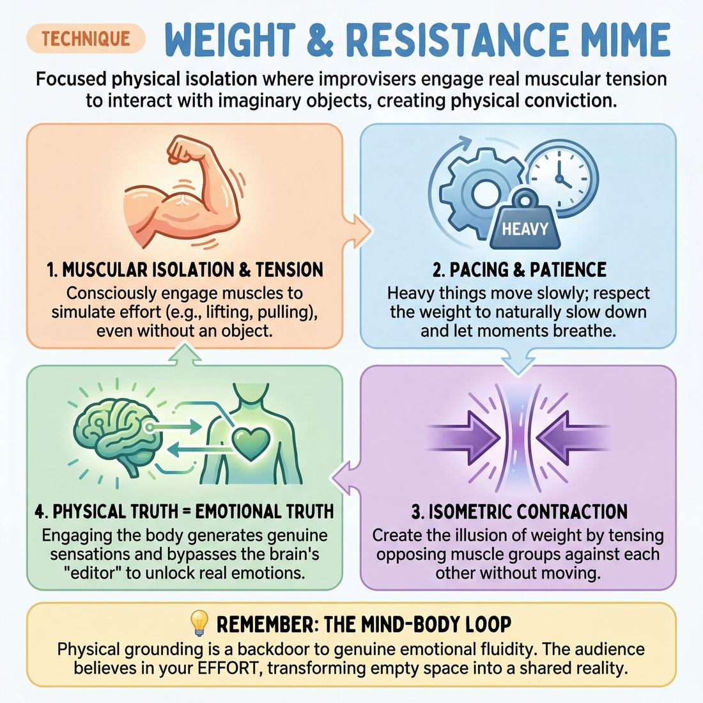

# 🎯 Weight & resistance mime

> *A drillable muscle that trains **Physicality & Space Work**.*

{ .infographic }

## 🎯 The essence

**Weight & resistance mime** is a focused physical isolation exercise where improvisers interact with imaginary objects—lifting heavy boxes, pulling stubborn ropes, or pushing against solid walls—by engaging real muscular tension. Rather than merely pantomiming the shape or outline of an invisible item, this technique forces a player to practice a single, vital skill: **physical conviction**. It trains the improviser to make the imagined world real by demonstrating exactly how that world acts upon, and resists, their own body.

## 🎓 What it trains

At its core, weight and resistance mime trains **Physicality & Space Work**. It isolates the specific muscle of giving invisible objects mass, gravity, and physical consequence, transforming empty air into a tangible environment.

This technique exists to solve one of the most pervasive problems in improvisation: **"ghost mime."** Because improvisers are often entirely focused on what they are going to say next, their physical actions become hollow. They open heavy oak doors with the flick of a wrist, drag massive trunks as if they were made of styrofoam, or chop wood without engaging a single muscle in their back. This weightlessness subtly signals to the audience—and to the improvisers themselves—that the world they inhabit is cheap, temporary, and ultimately doesn't matter.

By drilling weight and resistance, improvisers build several critical muscles:

*   **Muscular isolation and tension:** The ability to consciously engage the biceps, core, or legs to simulate effort, even when holding absolutely nothing.
*   **Pacing and patience:** Heavy things move slowly; resistance takes time to overcome. Respecting physical weight forces improvisers to slow down and let moments breathe, naturally countering the urge to rush.
*   **Environmental permanence:** When an object requires effort to move, the improviser is forced to remember exactly where they put it down, anchoring the object in space.

!!! abstract "Key idea: Physical truth breeds emotional truth"
    When you treat the invisible physical world as real, you pull yourself out of your head and into your body. Engaging your muscles to push a stalled car or pull a stubborn cork from a bottle triggers genuine physical sensations. That physical grounding bypasses the intellectual "editor," making it far easier to access genuine emotional fluidity and spontaneous reactions. 

!!! example "In a scene"
    If you are playing a mechanic, simply waving your hand in a circle to indicate "turning a wrench" is a weak offer. But if you plant your feet, tense your forearm, grit your teeth, and physically struggle against a rusted bolt until it finally gives way, you haven't just established the environment—you've given yourself an immediate emotional state (frustration, followed by relief) to play with.

## 💡 Why it works

Weight and resistance mime works because it bypasses the improviser’s verbal editor and directly engages the body’s somatic feedback loop. When you stop trying to *invent* a scene and instead focus on the physical reality of a heavy or stubborn object, you shift the cognitive load from the language centers of the brain to the motor cortex. 

The engine under the hood relies on three core mechanisms:

*   **Isometric contraction:** The illusion of weight is created by tensing opposing muscle groups without actually moving against a physical force. When you flex your biceps and triceps simultaneously to "lift" an invisible anvil, your body experiences genuine physical strain. Your brain registers this effort as real, which instantly grounds you in the present moment and shuts down the panic of "what do I say next?"
*   **Mirror neurons and audience empathy:** Audiences do not believe in the invisible object; they believe in your *effort*. When an improviser’s face flushes, their breath catches, and their posture shifts under an imagined load, the audience's mirror neurons fire. They viscerally feel the strain with you, transforming empty space into a shared, tangible reality.
*   **Enforced pacing:** Heavy things move slowly. Stubborn things require pauses. Applying resistance naturally regulates a performer's timing. While a novice might rush to fill silence with chatter, a performer wrestling with a rusted, heavy vault door is forced to hold a beat. The physical task demands the exact kind of **Silence & Stillness** that allows a scene to breathe.

!!! note "The Mind-Body Loop"
    Emotion and physicality are a two-way street. Just as feeling angry makes you clench your fists, clenching your fists and straining against an invisible force can actually *generate* feelings of frustration, determination, or exhaustion. Resistance mime gives you a physical backdoor into genuine emotional fluidity.

!!! example "In a scene"
    Two improvisers are stuck in a vague, talking-head scene about a relationship. One decides to open a mimed jar of pickles. If they mime it with zero resistance, it's just a fleeting gesture. But if they apply **weight and resistance**—straining their forearms, gritting their teeth, and failing to open it—the physical struggle instantly injects stakes, frustration, and a clear status dynamic into the scene, all without a single word being spoken.

## 🧩 The setup

Here is everything you need to prepare the room and the players before beginning the exercise.

*   **Group size & arrangement:** Full ensemble (typically 8–16 players). Players should be spread out evenly across the room, facing the facilitator. Everyone needs a "bubble" of space—enough room to swing their arms fully, lunge, and take a few steps in any direction without colliding with a scene partner.
*   **Space & materials:** A completely clear floor. No chairs, blocks, or actual props. Players should be in comfortable clothing that allows for deep squats, full extensions, and visible muscle engagement. 
*   **Time required:** 10–15 minutes total. The exercise is broken into mini-rounds of 2–3 minutes, with each round focusing on a different type of object or physical resistance.
*   **Roles:**
    *   **The Facilitator:** Acts as the guide and side-coach. You will call out specific objects, weights, and environmental conditions (e.g., "You are pulling a thick rope," "The rope is now wet and slipping"). You will actively prompt players to check their breath, posture, and muscle tension.
    *   **The Players:** Execute the mime simultaneously. In this setup, players are entirely focused on their own physical sensations and mechanics, rather than interacting with one another.
*   **Prerequisites:** Basic **space work** (the ability to define the size, shape, and placement of an invisible object). This technique builds on that foundation by adding the illusion of mass, gravity, and friction.

!!! quote "How to introduce it"
    "Find a spot in the room where you have plenty of space. We all know how to hold a mimed coffee cup, but today we are going to focus on what happens when the invisible world pushes back. We are going to explore weight and resistance. 
    
    When I call out an action or an object, I don't just want you to show me its shape—I want you to show me its mass. I want to see the tension in your forearms, the shift in your center of gravity, and the change in your breathing. Don't rush. Let your muscles do the talking, and let the invisible object affect your actual body."

## ⚙️ The mechanics

The core objective of weight and resistance mime is to create the illusion of mass, gravity, and friction using isolated muscle tension. The illusion of a heavy object lives in the body's reaction to it, not just in the shape of the hands. 

To execute this technique reliably, improvisers break down their interaction with an imaginary object into a precise, five-step mechanical loop.

### The Anatomy of an Interaction

1. **The Approach (Sight before touch):** The improviser establishes the object's location and size with their eyes before their hands reach it. This grounds the object in the physical space.
2. **The Contact (Defining the boundary):** The hands meet the imaginary surface. The fingers stop moving exactly where the object begins. This establishes **dimensional permanence**—the rule that the object's size and shape cannot morph once touched.
3. **The Engagement (Taking the weight):** Before moving the object, the improviser engages their muscles. If the object is heavy, the improviser drops their center of gravity, tenses their core, and recruits the necessary muscle groups (e.g., bracing the legs to lift a boulder). 
4. **The Manipulation (Managing momentum):** The improviser moves the object through space. Because heavy objects have inertia, they are hard to start moving and hard to stop. The improviser must simulate this by moving slightly slower than normal and showing physical strain.
5. **The Release (Restoring neutral):** The improviser sets the object down or lets it go. The muscle tension instantly drops, and the body physically rebounds or exhales, signaling to the audience that the weight has been transferred off the improviser.

!!! tip "On stage: The Principle of Opposition"
    To make resistance read clearly to an audience, focus on the *opposite* side of the action. If you are pushing a heavy stalled car, don't just tense your arms—tense your back and drive through your heels. If you are pulling a stubborn dog on a leash, lean back and tense your core. 

### Rules & Constraints

When drilling this technique, enforce the following constraints to build muscle memory:

* **The 75% Speed Limit:** Move at three-quarters of your normal speed. Imaginary objects lack actual mass, so improvisers naturally move them too fast. Slowing down gives your brain time to consciously recruit the correct muscles and allows the audience to process the physical story.
* **Full-Body Complicity:** An object's weight must affect the entire body, not just the hands. A heavy suitcase carried in the right hand will pull the right shoulder down, cause the spine to curve slightly, and change the rhythm of the improviser's gait.
* **No Vocal Crutches:** In pure mechanics drills, players must remain silent. You cannot rely on grunting or saying "Wow, this is heavy!" to do the work that your muscles should be doing.

### Ending and Resetting
A single repetition of the technique ends when the object is fully released and the improviser returns to a neutral, relaxed physical baseline. To reset for the next repetition, the improviser should physically shake out their arms and legs to clear the residual tension before approaching a new object with entirely different physical properties (e.g., switching from a bowling ball to a delicate teacup).

## 🎬 Sample round

!!! example "Sample round: The Iron Safe"
    **The Setup:** Alex and Sam are center stage, establishing a scene where two amateur thieves are trying to steal a massive, antique iron safe.

    **Alex:** *(Approaches the imaginary safe. Instead of casually grabbing empty air, Alex stops, plants their feet wide, and hovers their hands for a split second to establish the exact dimensions of the cold metal.)*  
    *• Mechanic mapped:* **Defining the boundary.** The object exists in space before the player touches it; the hands mold to the object, not the other way around.

    **Sam:** "On three. One, two, three!"  
    *(Sam grips the bottom edge. Before the safe moves, Sam's shoulders drop, their jaw clenches, and they inhale sharply, visibly engaging their core. Their hands remain locked in place for a full beat.)*  
    *• Mechanic mapped:* **The Prep (Muscular Tension).** Showing the object's resting mass by letting it defeat the initial pull. The body reacts to the weight before the object yields.

    **Alex & Sam:** *(They lift. Their hands move upward at a painfully slow, synchronized pace. Alex's arms shake slightly. When Sam takes a step backward, their foot lands heavily, absorbing the combined weight of their body and the safe.)*  
    *• Mechanic mapped:* **Sustaining resistance.** The object dictates the speed of movement. Momentum is sluggish, and gravity visibly affects their footfalls and posture.

    **Alex:** "Put it down, put it down!"  
    *(They lower the safe. As it "hits" the floor, both players simultaneously drop their shoulders, exhale loudly, and shake out their hands, breaking their rigid posture.)*  
    *• Mechanic mapped:* **The Release.** The sudden, visible absence of tension proves to the audience that the weight was real all along.

## 🎚️ Variations & progressions

To build muscle memory for weight and resistance, start with isolated, individual objects and scale up to shared, emotionally charged environments. The goal is to move from conscious, effortful mime to automatic, full-body physical truth.

Here is how to ramp the difficulty of this technique, mapped to the improviser's maturity journey:

| Difficulty | Drill Variant | Maturity Focus |
| :--- | :--- | :--- |
| **Level 1** | **The Passing Circle** | **Stage 2 (Adv. Beginner):** Offers the first physical thought reliably on a coach's cue, without overthinking. |
| **Level 2** | **The Stuck Object** | **Stage 3 (Competent):** Decides when a moment needs silence; holds a beat while struggling with physical resistance instead of talking through it. |
| **Level 3** | **The Shared Burden** | **Stage 4 (Proficient):** Impulse and action are simultaneous; reacting instantly to a partner's physical shifts in a shared reality. |
| **Level 4** | **Emotional Gravity** | **Stage 5 (Master):** Weaponizes silence; physical weight mirrors or contrasts with deep, layered emotional reality. |

### 1. The Passing Circle (Novice to Advanced Beginner)
Players stand in a circle and pass an invisible object. The coach calls out changes in mass, temperature, or resistance: *"It's a bowling ball," "It's a helium balloon," "It's a hot potato," "It's a giant block of ice."* 
* **The goal:** Train the body to instantly change its muscular tension based on an external cue. 

### 2. The Stuck Object (Competent)
Players work solo to interact with an object that refuses to cooperate. This introduces **opposing force**. Examples include pulling a sword from a stone, opening a rusted vault door, or walking against hurricane-force winds.
* **The goal:** Sustained muscle tension. The player must respect the resistance and allow the physical struggle to dictate their breathing and pacing, bypassing the urge to rush.

!!! tip "On stage: Breathe through the effort"
    When improvisers mime heavy exertion, they often hold their actual breath, which leads to rushing and panic. Consciously exhale on the exertion (e.g., grunting as you push the heavy door). This grounds the mime and naturally slows down your scene work.

### 3. The Shared Burden (Proficient)
Two or more players must move a massive object together—like carrying a grand piano up a flight of stairs or pushing a broken-down car. This requires a **shared reality**.
* **The goal:** If Player A drops their end of the piano, Player B's mime must react instantly to the sudden, violent shift in weight. Impulse and action must become simultaneous without thought.

!!! example "In a scene"
    Player A and Player B are carrying a heavy, invisible sofa. Player A suddenly stops to argue about where to put it, relaxing their arms. If Player B is truly playing the weight, the sofa will immediately crash to the floor on A's side, yanking B forward. The physical truth creates the next scene beat.

### 4. Emotional Gravity (Master)
The physical weight of the object is tied directly to the emotional weight of the scene. The mime becomes a vehicle for the character's internal state.
* **The goal:** Feeling real emotion while modulating it to serve the scene. A master improviser can hold the room in complete, gripping silence simply by the way they slowly, heavily pack a cardboard box after a breakup, letting the physical resistance of the packing tape tell the entire emotional story.

## 🧑‍🏫 Coaching notes

When side-coaching weight and resistance, your goal is to move the improviser out of their head and into their musculature. You are watching for the shift from *indicating* effort (making a strained face) to *experiencing* effort (engaging the body).

Call these cues out actively while the improvisers are in motion:

*   **"Engage the opposing muscles."** To show resistance without an actual object, the improviser must flex their antagonist muscles. If they are pulling a heavy rope, they must tense their triceps to resist their own biceps. 
*   **"Breathe through the exertion."** Improvisers tend to hold their breath when concentrating on mime. Remind them to exhale audibly on the "push" or "lift," just as they would in a gym.
*   **"Where is your center of gravity?"** A heavy object alters balance. If they are holding a massive invisible box, their upper body should lean back to counterbalance it. 
*   **"Keep your eyes on the object."** If they look away casually, the object loses its mass. Sustained eye contact grants the invisible object importance and physical reality.
*   **"Slow down the momentum."** Heavy things take time to get moving and time to stop. Call out any sudden, jerky movements that betray a lack of mass.

!!! tip "Coaching: The Golden Cue"
    **"Show me the weight in your feet."**  
    Improvisers almost always default to miming weight using only their hands, arms, and face. But true weight transfers through the entire body and down into the floor. If their feet are shuffling lightly or their knees are locked while they "push a stalled car," the illusion shatters. Prompt them to plant their base and drive from the ground up.

**What 'good' looks like**  
You will know the technique is working when you feel it in your own body. A **Novice** will simply shake their hands and grimace, leaving their torso entirely relaxed. A **Competent** improviser will engage their core, slow their movement, and maintain the exact dimensions of the object. 

When a **Master** performs this technique, they trigger the audience's mirror neurons. You will feel a sympathetic tension in your own shoulders watching them heave an invisible anvil, because their breathing, micro-adjustments, and full-body tension are entirely truthful.

## 🧭 Debrief & reflection

After the exercise concludes, the goal of the debrief is to shift the players’ focus away from whether their mime "looked right" and toward how the physical exertion actually *felt*. A strong debrief helps improvisers realize that treating imaginary objects with real physical respect unlocks deeper character and emotional truths.

Use these questions to guide the discussion and lock in the muscle memory:

*   **"Where in your body did you feel the effort?"** 
    *   *What it surfaces:* Players should realize that lifting a heavy box doesn't just happen in the hands and biceps—it requires bracing the core, planting the feet, and engaging the back. If they only felt it in their wrists, they were **indicating** (pantomiming the *idea* of weight) rather than embodying it.
*   **"What happened to your breathing when the resistance increased?"**
    *   *What it surfaces:* True physical exertion changes our respiratory rate. Players will note that they naturally held their breath on the initial heave, or grunted on the release. This connects the physical technique directly to vocal craft.
*   **"How did the physical struggle change your emotional state?"**
    *   *What it surfaces:* This is the crucial "aha" moment. Struggling to open a stuck jar or dragging a heavy tarp naturally breeds frustration, determination, or exhaustion. Players discover that they don't have to invent an emotion; the physical resistance creates it for them.
*   **"When you dropped the heavy object, what did the release feel like?"**
    *   *What it surfaces:* The contrast between tension and relaxation. A sudden release of weight should cause a physical rebound—shoulders dropping, a deep exhale, a shift in posture. 

!!! abstract "The 'Aha' Moment"
    A successful debrief moves players from a mindset of *puppeteering* to *experiencing*. You will know the lesson has landed when a player says, "I actually felt my heart rate go up," or "I got genuinely annoyed when the imaginary door wouldn't open." They have discovered that physical truth is a backdoor to emotional truth.

!!! tip "On stage"
    Remind players that they can use this technique as a life raft. If they ever step on stage feeling entirely blank, they can simply endow an object with immense weight or stubborn resistance. The physical effort will instantly ground them, silence their inner critic, and give them a playable point of view.

## ⚠️ Common pitfalls

!!! warning "Watch out: The 'Hollow Object'"
    The single most common mistake in **space work** is moving a heavy item at the speed of empty air. When an improviser lifts a "heavy" anvil but swings it up to their shoulder in half a second, the audience instantly registers it as a balloon. Weight requires time. If you do not slow down your movement to account for gravity and momentum, the illusion shatters.

Mime requires significant brainpower. When you add the pressure of listening, reacting, and speaking, the brain sheds secondary tasks to survive. This **cognitive load** is why a perfectly mimed, heavy oak table suddenly slides across the floor with a casual one-handed push the moment an improviser starts delivering a monologue. 

Here is how weight and resistance break down under pressure, and how to fix each trap:

* **Talking drops the tension:** The moment the improviser speaks, their muscles relax. The brain prioritizes the dialogue, and the physical object vanishes.
    * *The Fix:* Separate the actions. Lift, *then* speak. This naturally trains you to use **Silence & Stillness**, allowing the physical exertion to hold the beat and ground the scene before the dialogue continues.
* **Face tension instead of core tension:** Novices often try to *act* heavy by grimacing, holding their breath, or straining their neck, while their arms and core remain completely loose. This chokes off the voice and looks like a cartoon.
    * *The Fix:* Shift the tension to the correct muscle groups. Engage the forearms, lock the wrists, and tighten the core. Keep the breath flowing so your vocal projection doesn't drop under uncertainty.
* **Ghosting through matter:** The improviser's hands slowly slide closer together while holding a "solid" crate, or they step directly through the space the heavy object occupies.
    * *The Fix:* Focus on **isometric holds** (contracting muscles without moving the joints). Lock the distance between your hands. If the crate is two feet wide, your hands must remain exactly two feet apart, no matter how your torso twists. 

!!! tip "On stage"
    If you realize you have accidentally sped up or dropped the weight of an object mid-scene, don't panic or ignore it. Justify it! If that heavy piano suddenly moved easily, maybe it's on wheels, or maybe your character just experienced an adrenaline rush. Use the mistake as an offer.

## 🌟 What mastery looks like

At the highest level of execution, weight and resistance mime ceases to look like a technique and becomes a physical fact of the scene. The audience’s mirror neurons fire so strongly that they instinctively brace themselves when a heavy imaginary object is dropped. The improviser demonstrates complete physical control, creating a flawless illusion of mass without ever letting the mechanics distract from the emotional truth of the moment.

When observing a master at work, look for these hallmarks:

*   **Total muscular integration:** The illusion does not live only in the hands and arms. A master engages their entire kinetic chain. If they are pushing a stalled car, their calves flex, their core braces, their breath becomes shallow, and their jaw tightens. 
*   **Unconscious object permanence:** The mass of an object never fluctuates. If a master sets down a 50-pound bag of soil, they do not accidentally kick it away like a feather two minutes later. The physical space remains permanently altered by the object's weight.
*   **Zero-latency physicality:** There is no measurable delay between the impulse to interact with an object and the body adopting the correct tension. The improviser does not have to "prepare" their muscles; the physical reality arrives simultaneously with the thought.
*   **Seamless multitasking:** The improviser can maintain intense physical resistance while delivering nuanced, emotionally grounded dialogue. The mime serves the scene rather than pausing it, and their vocal craft naturally reflects the physical strain (e.g., a compressed diaphragm altering their vocal resonance).

!!! example "In a scene"
    Two improvisers are moving a grand piano up a flight of stairs. The master improviser's face flushes, their voice strains naturally as their core compresses, and their feet slip slightly under the imaginary weight. When their partner suddenly lets go of the other end, the master's body genuinely lurches forward, perfectly obeying the laws of physics for a massive object that isn't actually there. The audience audibly gasps.

Ultimately, mastery in this technique reflects the highest goal of **The Self** domain: the discipline to fully inhabit the physical space, and the freedom to let the body speak as loudly and truthfully as the voice.

## 🔗 Why it matters

Mastering **weight and resistance mime** is the difference between vaguely indicating an object and actually inhabiting a physical environment. For the parent skill of **Physicality & Space Work**, this technique is the absolute bedrock. An audience will forgive a slightly inaccurate mime of a complex machine, but they will instantly disconnect if a "heavy" anvil is tossed across the stage like a beach ball. 

Within the domain of **The Self**, practicing weight and resistance builds complete physical control. Creating the illusion of a heavy object requires you to isolate muscle groups—tensing the biceps, core, and forearms to show strain, while perhaps keeping your vocal cords relaxed enough to deliver a casual line of dialogue. It forces you out of the cerebral, overthinking mind and drops you squarely into your physical body.

Beyond just making invisible objects look cool, this muscle serves the wider craft of improvisation in three vital ways:

*   **It anchors the scene's reality:** When improvisers treat the physical world with respect and consistency, the audience subconsciously trusts that the emotional and relational world is real, too. 
*   **It buys you time:** Struggling with a stuck jar lid or dragging a heavy rug gives you a justified reason to exist in silence. It prevents the panicked rush to fill dead air with chatter, allowing you to discover the scene rather than invent it.
*   **It generates emotional reactions:** Physical strain naturally bleeds into emotional state. The frustration of a heavy, unyielding object can instantly give a neutral character a point of view.

!!! abstract "The Reality Anchor"
    Improv is a medium of infinite possibilities, which can be terrifying. By committing to the strict physical laws of weight and resistance, you give yourself a boundary. That physical limitation grounds you, making the scene feel less like a floating void and more like a real place where real things happen.

!!! tip "On stage"
    If you ever feel lost in a scene or disconnected from your scene partner, return to your object. Re-establish its weight, feel its texture, and let the physical effort of handling it inform your next line of dialogue. Physical truth is the easiest truth to access under pressure.

## 📚 References & Further Reading

### Foundational sources
*   **Viola Spolin, *Improvisation for the Theater* (1963)** — Spolin’s exercises, particularly "Space Walks" and her writings on "space substance," are the bedrock of modern improv space work. She teaches improvisers to treat the invisible environment not as empty air, but as a tangible, physical reality that pushes back, which is the core mechanism of resistance mime.
*   **Étienne Decroux, *Words on Mime* (1985)** — Decroux is the father of Corporeal Mime, a discipline that rejected the facial mugging of traditional pantomime in favor of full-body muscular engagement. He explicitly codified the use of "pause, hesitation, weight, resistance, and surprise" to place drama inside the moving human body, providing the exact mechanical foundation for this technique.
*   **Jacques Lecoq, *The Moving Body (Le Corps Poétique)* (2001)** — A foundational text on physical theater from one of the 20th century's greatest movement teachers. Lecoq emphasizes how every gesture has weight, how to use isometric contraction (counterweight) to create the illusion of mass, and how movement expresses thought and emotion before words do.

### Practitioner guides & manuals
*   **Matt Besser, Ian Roberts, Matt Walsh, *The Upright Citizens Brigade Comedy Improvisation Manual* (2013)** — The definitive modern guide to long-form comedy improv contains specific, detailed chapters on "object work." It details how interacting with the fictional physical environment—giving objects real weight and permanence—grounds a scene, prevents "talking head" syndrome, and forces the audience to buy into the reality.
*   **Mick Napier, *Improvise: Scene from the Inside Out* (2004)** — Napier famously advocates for doing something physical immediately at the top of a scene. His philosophy aligns perfectly with resistance mime: engaging the body in a physical task bypasses the verbal editor, gets the improviser out of their head, and anchors them in the present moment to generate spontaneous emotional reactions.

### Research & theory
*   **Giacomo Rizzolatti & Corrado Sinigaglia, *Mirrors in the Brain: How Our Minds Share Actions, Emotions, and Experience* (2008)** — Rizzolatti's team discovered mirror neurons, the neurological mechanism that explains why resistance mime works on an audience. This book explains how watching an improviser physically strain against an invisible weight causes the observer's brain to simulate that exact same physical effort, creating visceral empathy.
*   **Francisco Varela, Evan Thompson, & Eleanor Rosch, *The Embodied Mind: Cognitive Science and Human Experience* (1991)** — A foundational text on embodied cognition. It supports the core premise of this technique: that physical action (like tensing muscles to push an invisible wall) does not just *reflect* an internal state, but actively *shapes and generates* cognitive and emotional states.
*   **A. Coste, B.G. Bardy, & L. Marin, "Towards an Embodied Signature of Improvisation Skills" (*Frontiers in Psychology*, 2019)** — Academic research exploring how improvisation is fundamentally an embodied, motor-driven process. The study argues that the physical, motor components of improvisation (like space work and resistance) are central to the creative process, rather than secondary to verbal wit. [frontiersin.org]{.ref}

### Talks, videos & courses
*   **Jean-Noël Roy (Director), *The Two Journeys of Jacques Lecoq* (1999)** — A two-part documentary chronicling Lecoq's teaching methods at his Paris school. It provides invaluable visual demonstrations of his exercises on the role of the body, movement, and how to physically manifest resistance and weight in empty space.
*   **Upright Citizens Brigade, *Inside the Master Class: Object Work* (2012)** — A recorded masterclass session demonstrating how UCB instructors drill the physical weight and permanence of mimed objects, showing the real-time correction of "ghost mime" into grounded physical action. [youtube.com/ucbcomedy]{.ref}
*   *(unverified)* **Marcel Marceau, Masterclasses on Corporeal Mime** — While specific official URLs vary and many recordings are fragmented across archives, Marceau's filmed demonstrations of walking against the wind, pulling a rope, or being trapped in a glass box remain the most famous visual examples of isometric contraction and resistance mime in practice.

## 💬 Quotes & Anecdotes

!!! quote "— Viola Spolin, Improv Pioneer & Teacher"
    "Out of your head and into the space!"

!!! quote "— Matt Besser, Ian Roberts, and Matt Walsh, *The Upright Citizens Brigade Comedy Improvisation Manual* (2013)"
    "Handling and interacting with the objects in your scene's fictional physical environment helps the improviser commit to their reality, and helps the audience buy into that same reality."

!!! quote "— Susan Messing, Chicago Improv Instructor"
    "Pick up objects and feel them—their weight, the pressure in your hand—then put them down and pretend to pick them up again. Do this fifteen times with every object, everyday."

### Where it comes from

The foundational concept of treating empty air as a tangible, heavy medium comes directly from **Viola Spolin**, the "Mother of Improv." She coined the term **"Space Substance"** to describe the invisible but palpable material that actors must manipulate to make a scene real. Spolin insisted that traditional pantomime was merely "drawing a picture" of an object, whereas engaging with Space Substance required the actor to genuinely feel the object's mass, gravity, and resistance. 

This philosophy was later carried forward by Del Close and codified by theaters like the Upright Citizens Brigade as "object work" or "space work"—a mandatory tool for grounding scenes, establishing the environment, and getting improvisers out of their verbal, thinking brains.

### A telling example

Gary Schwartz, a trained mime and student of Viola Spolin, once performed a solo exercise in her class where he flawlessly and cleverly mimed handling an object. He was incredibly proud of his precise, rehearsed technique. 

Spolin stopped him and asked, "Were you actually handling that object or were you drawing us a picture?" 

Schwartz admitted he was drawing a picture. Spolin replied, "And it was a very nice picture. We all saw it. But did you really see it? No. You saw an outline of it. You made us see what you wanted us to see without seeing it yourself. You were playwriting!" 

She forced him to do the exercise again—this time breathing, slowing down, and genuinely feeling the physical resistance and weight of the object in the space, rather than just tracing its shape. The difference, Schwartz noted, was the shift from a hollow, intellectual performance to creating a shared, tangible reality that the whole room could viscerally feel.

## 🧭 Explore the framework

- ⬆️ **Skill it trains:** [Physicality & Space Work](01_S3__physicality-and-space-work.md)
- 🎭 **Domain:** [The Self](01_D__the-self.md)
- 🔁 **Sibling techniques:** [Character Walks/Centers](01_S3_T1__character-walks-centers.md), [Object work](01_S3_T2__object-work.md)
