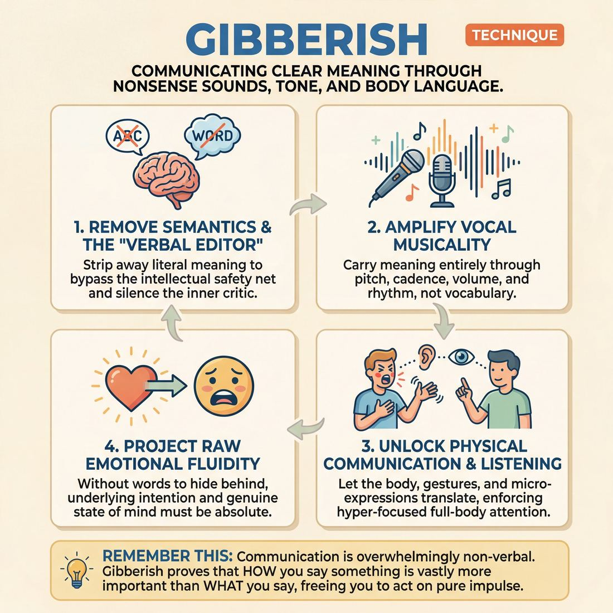

# 🎯 Gibberish

> *A drillable muscle that trains **Vocal Craft**.*

{ .infographic }

## 🎯 The essence

**Gibberish** is a foundational technique where players communicate using entirely made-up, nonsensical sounds rather than a recognized language. By stripping away the intellectual safety net of literal words, this exercise forces a player to practice one vital muscle: conveying clear meaning, emotion, and intent purely through vocal tone, inflection, and physical expression.

## 🎓 What it trains

Gibberish is fundamentally a workout for **Vocal Craft**, but its impact ripples outward to transform an improviser's entire physical and emotional presence. It exists to solve one of the most common traps in improvisation: the "talking head" syndrome, where performers stand frozen on stage, relying entirely on clever vocabulary and intellectual wit to carry a scene. 

When you remove a shared language, you remove the intellect from the equation. The improviser can no longer "write" the scene in their head; they must *act* it. 

Specifically, practicing Gibberish isolates and drills the following muscles:

* **Vocal Musicality:** Without words, meaning must be carried by pitch, cadence, volume, and rhythm. You learn to use your voice as a dynamic instrument rather than just a delivery mechanism for data.
* **Emotional Fluidity:** You cannot fake an emotion in Gibberish. Because the syllables mean nothing, the underlying emotional intention must be absolute. It forces the improviser to genuinely feel and project their state of mind.
* **Physical Communication:** Stripped of vocabulary, the body naturally steps up to help translate. Gestures become more defined, facial expressions more vivid, and spatial relationships more deliberate.
* **Spontaneity:** The internal critic that worries about saying the "wrong" or "unfunny" thing is silenced. Because there are no real words to mess up, the improviser builds the courage to act on pure, unfiltered impulse.

!!! abstract "The Deeper Principle"
    Human communication is overwhelmingly non-verbal. Gibberish teaches us that *how* we say something is vastly more important than *what* we say. It proves to the improviser that an audience can perfectly understand a complex relationship, a high-stakes conflict, or a tender confession without comprehending a single syllable.

## 💡 Why it works

Gibberish works by performing a radical amputation: it removes **semantics**—the literal meaning of words—from the scene. By eliminating vocabulary, it exposes the raw, underlying engine of human communication and forces improvisers to rely entirely on the tools they usually take for granted. 

Under the hood, this technique exploits several powerful cognitive and behavioral mechanisms:

*   **Bypassing the verbal editor:** The improviser’s greatest enemy is the "inner critic"—the voice that constantly evaluates whether an idea is clever, funny, or makes narrative sense. Gibberish occupies the brain's language centers with the task of generating nonsense sounds, effectively short-circuiting the editor. Without the pressure to invent witty dialogue, the **cognitive load** drops, freeing the player to act purely on impulse.
*   **Amplifying paralinguistics:** When you cannot rely on text to convey information, you must lean entirely on **paralinguistics**—the vocal elements of speech such as pitch, volume, cadence, resonance, and breath. A player who normally speaks in a flat, conversational monotone is suddenly forced to explore guttural growls, breathy whispers, or sharp, staccato rhythms to make their intent understood. 
*   **Enforcing full-body listening:** In a standard scene, improvisers often fall into the trap of "listening to respond"—waiting for a gap in the dialogue to deliver their next line. Gibberish makes this impossible. Because the words mean nothing, players must hyper-focus on their partner's eye contact, micro-expressions, and physical posture to decode the offer.

!!! abstract "The Communication Iceberg"
    Linguists often note that the actual words we speak carry only a fraction of our intended meaning; the vast majority is communicated through tone and body language. Gibberish forces improvisers to play the massive, underwater portion of the iceberg. 

!!! example "In a scene"
    If an improviser says, "I am very angry with you," the words do the heavy lifting, allowing the actor to lazily deliver the line with a neutral face and flat voice. But if the improviser must convey that same anger using only the sounds *"Flappa-dappa keet!"*, they have no choice but to narrow their eyes, drop their vocal register into a harsh growl, and aggressively point a finger. The constraint forces the truth.

## 🧩 The setup

To set up Gibberish effectively, the facilitator must create an environment that lowers self-consciousness. Because operating without language can feel incredibly vulnerable, the physical arrangement of the room should prioritize safety and simultaneous play over performance.

*   **Players & arrangement:** Pairs, standing face-to-face, scattered evenly across the room. Having everyone play at the same time creates a "wall of sound"—a loud, chaotic environment where no single pair feels like they are being listened to or judged by the rest of the room.
*   **Space & materials:** A fully cleared floor. No chairs, props, or notebooks. Players need unrestricted physical space to gesture, point, and use their whole bodies to communicate.
*   **Time:** 10–15 minutes total. Keep individual rounds short (60–90 seconds). Short bursts prevent players from overthinking or retreating into their heads when they run out of "words."
*   **Roles:** For the foundational drill, both players are **Gibberish Speakers**. They are equal participants in a two-way conversation. (If setting up the classic *Gibberish Translator* exercise, designate one player as the **Expert** speaking Gibberish, and the other as the **Translator** speaking the audience's native language).
*   **Prerequisites:** Players must have already completed a high-energy physical and vocal warm-up (such as *Sound and Motion* or *Crazy Eights*). Do not start a workshop cold with Gibberish; the vocal cords and the body must already be awake.

!!! tip "The 'No Real Languages' Rule"
    Before starting, explicitly state that players cannot use a real language they happen to know (e.g., high school Spanish or fluent French) to simulate Gibberish. The brain must be forced to invent sounds in the moment, bypassing the language center entirely. 

!!! quote "How to introduce it"
    "Find a partner and stand face-to-face. For the next ninety seconds, you are going to have a passionate, detailed conversation about a shared memory—but you cannot use a single real word in any language you actually speak. You are going to speak entirely in Gibberish. 
    
    Don't just make random noises; use your tone, your face, your hands, and your volume to make your partner understand exactly what you mean. When they speak, listen to *how* they sound, not what they say, and respond to that emotion. Let go of making sense, and focus on making a connection. Ready? Go."

## ⚙️ The mechanics

The core objective of Gibberish is to make the "music" of the scene the sole vehicle for meaning. 

!!! abstract "The Core Loop"
    Two players perform a grounded, emotionally connected scene using entirely invented, non-sense language. They must establish a relationship, navigate a dynamic, and reach a resolution without ever speaking a recognizable word.

### The Flow of Play

1. **The Prompt:** Two players take the stage. The coach provides a simple, relatable suggestion (e.g., a relationship, a shared mundane task, or a specific location).
2. **The Initiation:** Player A makes the first offer using entirely invented sounds. They must endow these sounds with clear emotional weight, status, and physical action. The *way* they speak must tell the audience exactly what they mean.
3. **Active Reception:** Player B listens to the musicality of the offer—the volume, the sharpness of the consonants, the breath, the rhythm—and allows it to affect them physically and emotionally, trusting the intent over the literal non-words.
4. **The Response:** Player B replies in their own gibberish. They use vocal dynamics to establish the relationship, perhaps matching the energy (a rapid-fire argument) or contrasting it (meeting a loud, aggressive burst with a quiet, placating whisper).
5. **The Escalation:** The players continue the scene. They use vocal variety—interruptions, sighs, staccato commands, elongated soothing vowels—to build the narrative arc and drive the scene forward.
6. **The Resolution:** The round concludes when a clear emotional peak, shift, or resolution is reached, or when the coach calls "Scene." Players reset, shake off their physical and vocal choices, and a new pair steps up.

### Rules & Constraints

* **Zero recognizable words:** This is a strict boundary. It includes filler words ("um," "like"), universal agreements ("okay," "yeah," "uh-huh"), and proper nouns. If a real word slips out, the player must immediately justify it within the flow of their gibberish.
* **Linguistic complexity:** The gibberish must mimic the phrasing, pauses, and phonetic variety of a real language. 
* **Vocal-physical congruence:** The voice and the body must tell the same story. A harsh, guttural vocal placement should be accompanied by sharp, tense physicality; a breathy, melodic voice should pair with fluid movement.

!!! tip "On stage: Speak with absolute conviction"
    Do not "play" at speaking gibberish; speak it as if it is your native tongue and you are absolutely certain the other person understands exactly what you are saying. Confidence in your vocal delivery bridges the gap between nonsense and profound meaning.

## 🎬 Sample round

!!! example "In a scene: The Broken Object"
    **The Setup:** Two improvisers, Player A and Player B, are building a scene using only gibberish. The goal is to communicate relationship, status, and objective entirely through vocal tone, tempo, and physicality.

    *   **Player A:** *(Gasps, drops to their knees, cradling an invisible object. High-pitched, trembling voice.)* "Ohhh, meeka! Meeka shlooo..."
        *   *The Mechanic:* **Establishing the reality.** The physical mime (cradling) and the vocal craft (trembling, high pitch) instantly communicate grief or shock over something fragile. The elongated vowels convey sorrow.
    *   **Player B:** *(Enters with heavy, stomping steps. Deep, resonant, staccato voice.)* "Barg? Krukka bargen!"
        *   *The Mechanic:* **Contrasting energy.** Player B uses a lower register and sharp, hard consonants to establish authority and demand an explanation. The upward inflection on "Barg?" clearly signals a question.
    *   **Player A:** *(Looks up, shrinks back, speaking rapidly and breathlessly.)* "Piti-piti-piti! Shloo krukka, nono piti!"
        *   *The Mechanic:* **Emotional reaction.** Player A increases their vocal tempo and uses repetitive, soft syllables to convey panic and defensiveness, reacting directly to Player B's high-status entrance.
    *   **Player B:** *(Sighs heavily, pinches the bridge of their nose, voice drops to a soft, disappointed rumble.)* "Faaaaargh. Meeka shloo."
        *   *The Mechanic:* **Shifting the dynamic.** Player B transitions their emotion. The vocal shift from sharp and loud to soft and drawn-out, paired with the physical sigh, changes the scene from an angry interrogation to shared disappointment. They repeat Player A's phrase ("Meeka shloo") to show agreement and connection.

Notice how the audience understands exactly what is happening—a parent catching a child who broke something valuable, or a boss discovering an employee's mistake—without a single real word being spoken. The Vocal Craft does all the heavy lifting.

## 🎚️ Variations & progressions

Gibberish is highly adaptable. You can scale the technique from a simple ice-breaker to a high-pressure cognitive drill that tests the absolute limits of a player's vocal and emotional control.

Here is how to ramp the difficulty, moving from basic vocalization to advanced performance.

### 1. Emotional Gibberish Circle (Novice to Adv. Beginner)
Players stand in a circle and pass a single, short gibberish phrase (e.g., *"Gleeb nart"*) to the person next to them. The coach calls out different emotions or states (e.g., furious, heartbroken, suspicious, joyful). 
* **The Focus:** Bypassing the internal editor and projecting volume. 
* **Maturity Tie-in:** This helps **Stage 1** and **Stage 2** players practice switching emotions on an external cue and projecting on command, without the cognitive load of inventing dialogue.

### 2. Gibberish Translation (Competent)
The classic performance game. Player A speaks entirely in gibberish, using distinct cadence, tone, and physical gestures. Player B acts as their interpreter, translating the gibberish into English for the audience (or an interviewer).
* **The Focus:** Active listening and vocal matching. 
* **Maturity Tie-in:** Pushes players toward **Stage 3** competency. The translator must perfectly match the vocal energy to the emotional content provided by the gibberish speaker, while the speaker must use their voice to give clear, undeniable emotional "gifts."

### 3. Pure Gibberish Scenes (Proficient)
Two players perform a full scene entirely in gibberish—no translator, no English. The audience must be able to understand the relationship, the status dynamic, and the emotional arc purely through sound and movement.
* **The Focus:** Total reliance on vocal craft and physicality.
* **Maturity Tie-in:** This demands **Stage 4** proficiency. The voice must instantly convey age, status, and state. Players learn that a sharp, staccato gibberish bark carries high status, while a breathy, trailing gibberish whisper conveys vulnerability.

### 4. The "Switch" or "Dubbing" (Master)
Players begin a scene in English. At random intervals, the coach claps or calls out "Gibberish!" The players must instantly switch to gibberish mid-sentence. When the coach calls "English!", they snap back to their native language.
* **The Focus:** Seamless cognitive switching while maintaining emotional truth.
* **Maturity Tie-in:** A test of **Stage 5** mastery. There should be no measurable latency between the impulse and the offer. The player must maintain the exact same emotional reality, volume, and character voice across the language barrier, using their voice as a fully controlled instrument.

!!! example "In a scene: The Switch"
    **Player A (English):** "I just don't understand why you always leave the car empty!"  
    **Player B (English):** "Because I'm busy, alright? I'm—"  
    **Coach:** "Gibberish!"  
    **Player B (Gibberish, maintaining the exact defensive, high-pitched tone):** "—flarmigut! Shaba ding ding flarmigut!"  
    **Player A (Gibberish, matching the rising anger):** "Klaatu barada! Klaatu!"  
    **Coach:** "English!"  
    **Player A (English, seamlessly continuing the anger):** "—and it's incredibly selfish!"

!!! tip "On stage"
    While pure gibberish scenes are rare in long-form, the *skills* trained here are vital for playing non-human characters (aliens, animals, droids) or stylized moments (a chaotic argument heard through a wall). If you can hold an audience's attention using only the musicality of your voice, your English scenes will feel effortless.

## 🧑‍🏫 Coaching notes

When coaching Gibberish, your primary goal is to force players to rely entirely on their physical and vocal instruments. Because they can no longer hide behind clever dialogue, they will often feel exposed. Your side-coaching must be active, encouraging, and relentlessly focused on **intention** and **vocal variety**.

!!! tip "Coaching: Communicate, don't just vocalize"
    The single most important cue is to remind players that they are still trying to be understood. If a player is just making random noises into the void, call out: *"Make them understand you!"* This instantly forces them to re-engage eye contact, heighten their vocal inflection, and use their body to bridge the communication gap.

### Active Side-Coaching Cues

Use these prompts mid-scene to shape the exercise and push players toward greater Vocal Craft:

*   **"Change your pitch!"** or **"Change your tempo!"** 
    Players often fall into a repetitive, monotone rhythm when speaking gibberish. Calling out a shift in pitch or speed forces them to discover a new emotional gear.
*   **"Project! Fill the room!"** 
    Novice improvisers instinctively drop their volume when they feel uncertain. Do not let them mumble their gibberish. Demand full vocal support.
*   **"What are you trying to *do* to them?"** 
    Remind them that every line of dialogue has an action (e.g., to soothe, to attack, to plead). If the gibberish sounds aimless, ask for the underlying action.
*   **"Use your whole body!"** 
    Gibberish requires the physical body to do the heavy lifting of context. If they are standing stiffly, push them to let the vocal impulse travel into their hands, spine, and face.

!!! example "In a scene"
    Two players are arguing in gibberish, but they are just loudly repeating the same harsh consonant sounds ("Garg blarg flarg!"). 
    **Coach:** *"Now win the argument by being incredibly sweet."* 
    The players instantly shift their vocal resonators, softening their tone, raising their pitch, and using melodic vowel sounds to passive-aggressively attack each other.

### What "Good" Looks and Sounds Like

When the technique is clicking, you will observe specific shifts in the players' behavior:

*   **Emotional Clarity:** You, as the coach, should know exactly how the character feels and what the relationship is, even without a single English word being spoken.
*   **Vocal Fluidity:** The sounds flow naturally without the stuttering or hesitation of the internal editor. The player is breathing easily and speaking on impulse.
*   **Sustained Eye Contact:** Because they lack shared vocabulary, successful players will lock eyes, intensely reading their partner's micro-expressions to gauge if their "message" was received.
*   **Dynamic Range:** The players are utilizing their full vocal instrument—moving effortlessly between whispers, shouts, staccato bursts, and drawn-out, melodic phrasing as the scene's emotional logic dictates.

## 🧭 Debrief & reflection

After the laughter of a Gibberish exercise subsides, the debrief is where the underlying muscle memory is locked in. Players are forced to confront how much they rely on *how* they sound versus *what* they say. 

Use these questions to guide the reflection and surface the mechanics of Vocal Craft:

* **"How did you know what your partner was saying?"**
    * *What it surfaces:* Players will realize they were reading pitch, tempo, volume, and physical cues. This highlights that the musicality of the voice is the primary vehicle for intention.
* **"Did you feel more or less 'in your head' than in a normal scene?"**
    * *What it surfaces:* Many improvisers find Gibberish incredibly freeing. Without the burden of inventing clever dialogue, impulse and vocal action happen simultaneously.
* **"When did the scene feel the most grounded or real?"**
    * *What it surfaces:* The most compelling moments usually occur when the emotional stakes are highest. It proves that genuine emotional fluidity transcends language, and that matching vocal energy to emotional content is what makes a scene believable.
* **"Did your voice change when you switched to Gibberish?"**
    * *What it surfaces:* Often, players will unconsciously access different registers, resonances, or volumes when freed from their native language. This reveals untapped vocal range that they can bring back into their regular scene work.

!!! abstract "The Core Takeaway"
    A successful debrief should lead players to a single, empowering realization: the vast majority of human communication—status, emotion, relationship, and urgency—is carried by the musicality of the voice and the truth of the body. When players return to speaking their native language, the goal is to bring this newfound vocal richness with them.

## ⚠️ Common pitfalls

When the safety net of a shared vocabulary is removed, the brain often panics. The cognitive load of inventing sounds while simultaneously trying to communicate an idea can cause improvisers to retreat into defensive habits. 

Here are the most common ways Gibberish breaks down under pressure, and how to course-correct.

!!! warning "Watch out: The 'Bork Bork' Loop (The Swedish Chef Trap)"
    **The Trap:** The improviser repeats the same two or three syllables endlessly (e.g., "Gabba gabba gabba" or "Bork bork bork") with a flat, unvarying pitch.  
    **The Cause:** Cognitive overload. When the brain panics, it clings to a single phonetic life raft. This completely flattens Vocal Craft and makes emotional nuance impossible.  
    **The Fix:** Force a mechanical change in the mouth. Coach the player to switch between hard consonants (K, T, P) and wide vowels (Ah, Oh). Prompt them to "change the music" or "sing a different song" to break the loop.

!!! warning "Watch out: Real-Time Translating"
    **The Trap:** The improviser pauses, their eyes dart up, and they deliver a string of gibberish with the exact cadence and length of an English sentence.  
    **The Cause:** The internal editor is still winning. The player is thinking, *"I am going to the store,"* and then translating it word-for-word into nonsense. This creates measurable latency between impulse and offer.  
    **The Fix:** Instruct the player to speak faster than they can think. Shift their focus entirely to the emotion of the scene—if they are angry, tell them to just make "angry sounds" rather than translating an angry sentence.

!!! warning "Watch out: The Accidental Stereotype"
    **The Trap:** The gibberish drifts into a caricature of a real-world language (e.g., fake Italian, fake Swedish, or fake Japanese).  
    **The Cause:** The brain naturally seeks familiar rhythmic patterns. While sometimes used intentionally in advanced genre play, in a training context, this relies on cheap tropes rather than genuine vocal discovery.  
    **The Fix:** Break the rhythm. If the player is leaning on a staccato, consonant-heavy rhythm that sounds like a specific language, coach them to immediately switch to long, flowing, vowel-heavy sounds. 

!!! warning "Watch out: Dead Body, Busy Mouth"
    **The Trap:** The improviser stands completely still, hands glued to their sides, while their mouth works overtime producing gibberish.  
    **The Cause:** All cognitive bandwidth is being routed to the vocal cords, leaving the body behind. Because there are no real words to carry the context, the scene becomes entirely incomprehensible to the audience and the scene partner.  
    **The Fix:** Demand physical action. Have the improviser engage in a complex piece of object work while speaking, or instruct them to use their hands to physically "conduct" the volume and pitch of their gibberish.

## 🌟 What mastery looks like

When an improviser reaches mastery in Gibberish, the exercise ceases to sound like a frantic scramble of random syllables and transforms into a fluent, expressive, and entirely believable foreign language. The master improviser uses their voice as a fully controlled instrument, proving that true communication relies far more on intent, tone, and physicality than on vocabulary.

Here is what mastery looks and sounds like in practice:

*   **Linguistic Consistency:** The improviser develops a distinct phonetic palette on the fly. Instead of defaulting to a generic "blah blah," they invent a consistent rhythm, specific vowel sounds, and recurring consonant clusters. It sounds like a real, undiscovered language with its own syntax and cadence.
*   **Emotional Transparency:** The audience and scene partners know *exactly* what is being said. The improviser feels real emotion and modulates it perfectly to serve the scene, conveying complex subtext—like passive aggression, deep longing, or bureaucratic boredom—entirely through tone, pitch, and volume.
*   **Zero Latency:** There is no measurable latency between impulse and offer. The gibberish flows as effortlessly as their native tongue, completely bypassing the internal editor.
*   **Physical Integration:** The voice and body are entirely unified. Gestures, posture, and facial expressions punctuate the gibberish naturally, rather than looking like a frantic game of charades tacked onto vocal noise.

!!! example "In a scene"
    Revisiting the "broken object" dynamic, two master improvisers elevate the scene through linguistic consistency. Player A delivers a rapid, staccato string of hard consonants while pointing sharply at the shattered vase, their voice tight and high in their chest. Player B responds with a slow, drawn-out, breathy sequence of soft vowels, lowering their head and dropping their vocal resonance into a deep, apologetic register. Because they maintain a consistent phonetic "syntax" throughout the exchange, it doesn't just look like an angry parent and an ashamed child—it sounds like a genuine, fluent argument in a foreign film.

At this level, the improviser isn't just surviving the loss of their native language; they are leveraging their vocal craft and emotional fluidity to hold the room's complete focus, proving that the *how* of communication is always more powerful than the *what*.

## 🔗 Why it matters

Gibberish is the ultimate isolation drill for **Vocal Craft**. By temporarily removing the safety net of vocabulary and syntax, it forces the improviser to rely entirely on the raw mechanics of their voice—pitch, volume, tempo, and resonance—to convey meaning. 

This directly serves the domain of **The Self** by short-circuiting the brain's internal editor. When you cannot search for the "right" or "clever" word, you achieve true freedom from hesitation. You are left with pure impulse and the physical act of vocalization, building the courage to be emotionally truthful and the discipline to commit fully to a vocal choice.

Beyond tuning the individual instrument, mastering Gibberish ripples outward into the wider craft of improvisation:

* **Unlocking Subtext:** Improvisers often fall into the trap of "writing dialogue" on stage rather than playing a scene. Gibberish proves that *how* a line is delivered carries the actual emotional truth, teaching players to trust their tone over their wit.
* **Deepening Character & Status:** A character is often defined by their vocal rhythm. Gibberish trains players to adopt distinct cadences—staccato, languid, breathy, or booming—which instantly communicate age, status, and state of mind without a single line of exposition.
* **Listening for Intent:** When scene partners speak in Gibberish, you cannot simply wait to parse their syntax and formulate a reply. You must listen globally to their emotional state, urgency, and breath, fostering a deeper, more empathetic connection on stage.

!!! abstract "The Illusion of Words"
    Improvisers often believe the scene is about the words they say. Gibberish reveals that words are merely the vessel; the actual scene lives in the breath, the tone, and the emotional intent driving the sound. Once an improviser learns to communicate fully without words, the words they eventually choose become infinitely more powerful.

## 📚 References & Further Reading

### Foundational sources
*   **Viola Spolin, *Improvisation for the Theater* (1963)** — The definitive text that introduced Gibberish to modern American improv. Spolin initially developed her theater games in the 1930s while working with immigrant children in Chicago; Gibberish was born as a way to bridge language barriers and prove that human connection supersedes literal vocabulary. The book features foundational exercises like "Gibberish #1" and "Gibberish Interpreter" designed to break the dependency on words and force full-body communication. [Available via Northwestern University Press]{.ref}
*   **Keith Johnstone, *Impro: Improvisation and the Theatre* (1979) & *Impro for Storytellers* (1999)** — Johnstone heavily utilizes gibberish (sometimes referred to as "gobbledygook") to help improvisers bypass the intellect and lower the pressure of being "clever." He specifically uses it as a tool to train *status*—demonstrating that dominance and submission are conveyed almost entirely through physical space, eye contact, and vocal tone, regardless of the words being spoken. [Available via Routledge]{.ref}

### Practitioner guides & manuals
*   **Mick Napier, *Improvise: Scene from the Inside Out* (2004)** — Napier's irreverent guide to improvisation features practical gibberish exercises (both solo and paired) aimed at stopping improvisers from "playwriting" in their heads. He advocates for practicing solo gibberish monologues at home to train the brain to stop worrying about *what* is being said, forcing the performer to focus entirely on the energy, emotional point of view, and *how* they are speaking. [Available via Macmillan]{.ref}

### Lineage & teachers
*   **Jacques Lecoq, *The Moving Body (Le Corps Poétique)* (2001)** — Lecoq's foundational text on physical theater details the teaching of *Grammelot* (or Grommelot), the European and Commedia dell'arte equivalent of Gibberish. Lecoq trains actors to convey precise meaning through vocal musicality, rhythm, and physical expression, proving that a performer can hold an audience's attention entirely through non-sensical, emotionally charged vocalizations. [Available via Bloomsbury]{.ref}
*   **Dario Fo, *The Tricks of the Trade* (1991)** — The Nobel laureate famously utilized and popularized *Grammelot* as a theatrical and political tool. Fo's work demonstrates how an actor can weave complex, high-stakes narratives and satirical commentary using a pastiche of dialects and sounds that mimic the cadence of a language without using actual words. [Available via Routledge]{.ref}

### Research & theory
*   **Albert Mehrabian, *Silent Messages: Implicit Communication of Emotions and Attitudes* (1971)** — The origin of the famous "7-38-55 rule" regarding paralinguistics and nonverbal communication. While often oversimplified in pop psychology, Mehrabian's rigorous research underpins the "Communication Iceberg" principle: when communicating feelings and attitudes, vocal tone (38%) and body language (55%) carry the vast majority of the emotional meaning, while the literal words (7%) matter least. [Archived via HathiTrust]{.ref}
*   **Charles J. Limb & Allen R. Braun, *Neural Substrates of Spontaneous Musical Performance: An fMRI Study of Jazz Improvisation* (PLoS ONE, 2008)** — This landmark neuroscientific study demonstrates that during improvisation, the brain deactivates the dorsolateral prefrontal cortex (the "inner critic" responsible for self-monitoring) and activates the medial prefrontal cortex (associated with language and creativity). This provides the biological basis for how techniques like Gibberish successfully short-circuit the verbal editor. [Read the study on PLoS ONE]{.ref}

### Talks, videos & courses
*   **Charles Limb, *Your Brain on Improv* (TED Talk, 2010)** — A highly accessible breakdown of Limb's fMRI research. Limb explains how the brain's self-monitoring centers shut down during spontaneous creation, allowing for unfiltered impulse and flow—the exact cognitive state that Gibberish exercises attempt to induce in theatrical improvisers. [Watch on TED.com]{.ref}
*   **The Second City / WTTW, *Demonstrating Viola Spolin's Theater Games* (2016)** — A video demonstration featuring experienced Chicago improvisers and Second City's Director of Comedy Studies, Anne Libera. The group plays Spolin's classic "Gibberish Interpreter," clearly showcasing the technique's focus on mirroring tone, physical movement, and emotional intent. [Watch via WTTW Chicago]{.ref}

## 💬 Quotes & Anecdotes

!!! quote "— Viola Spolin, *Improvisation for the Theater* (1963)"
    Gibberish develops the expressive physical language vital to stage life by removing the dependency on words alone to express meaning.

!!! quote "— Viola Spolin, *Improvisation for the Theater* (1963)"
    "Gibberish" is a "no-symbol" speech game and with it as point of concentration, their whole bodies were engaged in communicating a language they knew the other did not understand.

!!! quote "— Keith Johnstone, *Interview with Hugh Tebby* (2018)"
    If they're good at gibberish you can play your scene in gibberish. We used to do all our kids plays like that, just to pump up the physicality.

### Where it comes from

The formal use of Gibberish as an improvisational training tool was pioneered by **Viola Spolin** in the 1930s. While working as a drama supervisor in Chicago (heavily influenced by her time at Hull House under sociologist Neva Boyd), Spolin taught theater to immigrant children and adults at a local settlement house. 

Because her students came from diverse backgrounds and spoke various native languages, traditional script-based theater was a struggle. Spolin invented "Theater Games"—including Gibberish—to bridge these cultural and linguistic gaps. By removing English from the equation, the students could play, connect, and understand each other purely through shared human emotion and physical expression, proving that language was not a prerequisite for compelling theater.

### A telling example

The most famous application of this concept is Spolin’s classic **Gibberish Interpreter** (or Translator) exercise, which remains a staple in improv theaters like The Second City today. 

In this setup, two improvisers conduct a scene entirely in nonsense sounds, while a third player stands to the side and "translates" the conversation into the audience's native language. Because the translator has no actual vocabulary to decode, they must hyper-focus on the speakers' tone, volume, posture, and micro-expressions. 

If a Gibberish speaker aggressively points a finger, steps forward, and barks a harsh *"Kratta-flack!"*, the translator doesn't need a dictionary; the physical and vocal intent makes the translation obvious (e.g., "Get out of my house!"). The exercise proves to the performers that the true "meaning" of the scene was never in the words to begin with—it was entirely in the delivery.

## 🧭 Explore the framework

- ⬆️ **Skill it trains:** [Vocal Craft](01_S4__vocal-craft.md)
- 🎭 **Domain:** [The Self](01_D__the-self.md)
- 🔁 **Sibling techniques:** [Projection & breath support](01_S4_T1__projection-and-breath-support.md), [Vocal characterization](01_S4_T2__vocal-characterization.md)
