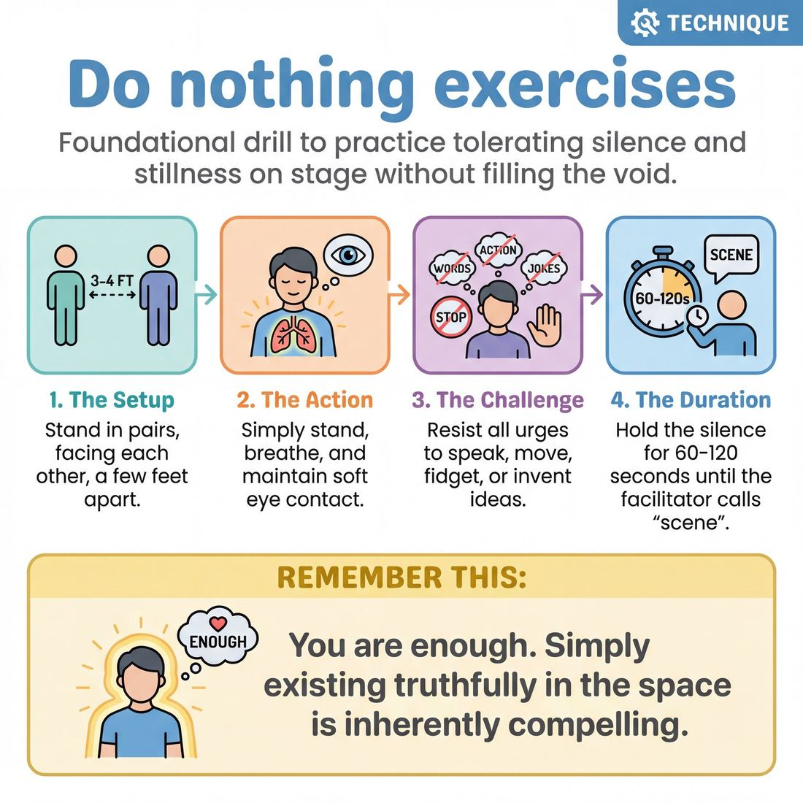

# 🎯 Do nothing exercises

> *A drillable muscle that trains **Silence & Stillness**.*

{ .infographic }

## 🎯 The essence

**Do nothing exercises** are a family of foundational drills where improvisers stand on stage and intentionally take no action, make no sound, and initiate no ideas for a set duration. Stripped of the usual tools of talking, moving, or inventing, the player is forced to practice a single, vital muscle: tolerating the profound discomfort of silence and stillness without rushing to "save" the moment by filling the void.

## 🎓 What it trains

When a performer steps under the lights, adrenaline spikes. For most, the brain immediately equates silence with failure. This panic manifests physically and vocally—improvisers pace, shift their weight, laugh nervously, talk over their partners, or frantically invent chaotic plot points just to feel like they are "doing improv." 

This technique isolates and trains the specific skill of **Silence & Stillness** within the domain of **The Self**. By forcing the improviser to abandon their usual defense mechanisms, the exercise solves the problem of frantic over-activity and trains three distinct sub-skills:

*   **Physical grounding:** Breaking the unconscious habit of fidgeting, swaying, or pacing. It teaches the body to hold its ground and exist comfortably in space.
*   **Vocal restraint:** Severing the compulsion to fill every second of stage time with words. It trains the improviser to let moments breathe and to realize that a pause is not a mistake.
*   **Active observation:** When you are no longer busy inventing your next line, your bandwidth frees up. You are forced to actually look at your partner, read their micro-expressions, and let their presence affect you.

!!! abstract "The Deeper Principle: You Are Enough"
    Beneath the mechanics, this exercise teaches the profound principle of presence. It proves to the improviser that they do not need to constantly *earn* their right to be on stage through clever jokes, wacky characters, or frantic motion. Simply existing truthfully in the space, breathing, and being available to your partner is inherently compelling. 

By practicing the extreme of doing absolutely nothing, improvisers develop the courage to do *just enough* when they return to regular scene work. They learn that tension, emotion, and meaning often live in the space between the words.

## 💡 Why it works

At its core, this drill operates as a form of theatrical exposure therapy. Because improvisers are naturally conditioned to panic when a scene goes quiet, this exercise directly confronts that fear by making the void the entire point.

By removing the usual tools of the craft, the exercise exploits several underlying mechanisms:

*   **Disarming defense mechanisms:** Words, plot, and physical comedy are often used as armor. When you are talking, you feel in control. When you are forced to do nothing, you cannot hide behind a clever premise or a fast-paced bit. You are left with only yourself and your partner, forcing genuine vulnerability.
*   **Recalibrating the nervous system:** Standing in silence in front of an audience triggers a mild fight-or-flight response. By enduring this without "doing" anything to fix it, the improviser's nervous system slowly learns that silence is safe. The panic subsides, replaced by a grounded, breathable presence.
*   **Amplifying micro-expressions:** When macro-actions (talking, walking, miming) are banned, the audience's and the partner's focus narrows. Suddenly, a swallowed breath, a darting eye, a flushed cheek, or a slight shift in posture becomes a massive, undeniable offer. It proves to the improviser that they are *always* communicating.

!!! note "The Engine Under the Hood"
    This technique shifts the improviser's brain out of the frantic, script-writing mode (the conscious mind trying to invent a scene) and into a state of sensory awareness. It proves that you do not need to *generate* material; you only need to *notice* what is already happening.

Ultimately, it works because it redefines what an "offer" is. It teaches the body that simply existing in a space, breathing, and making eye contact is enough to captivate a room.

## 🧩 The setup

Here is everything you need to arrange before the exercise begins. Because "doing nothing" triggers intense vulnerability, a calm, structured setup is essential.

*   👥 **Players & Arrangement:** Played in pairs. The two active players stand center stage, about three to four feet apart, facing each other (or angled slightly out so the audience can see their faces). The rest of the ensemble sits in the audience as active observers. 
*   🏛️ **Space & Materials:** A bare stage or clear room. No chairs or props for the active players. The facilitator needs a stopwatch or timer.
*   ⏱️ **Time:** 
    *   **Per round:** 60 to 120 seconds. (To a beginner, one minute of silence feels like an eternity; do not rush it).
    *   **Total duration:** 15–20 minutes, ensuring every student gets at least one turn on stage.
*   🎭 **Roles:** 
    *   **The Pair:** Stand, breathe, maintain eye contact, and resist the urge to invent, act, or relieve tension.
    *   **The Audience:** Observe in absolute silence. Their job is to witness the micro-expressions and the natural energy that builds between the pair.
    *   **The Facilitator:** Holds the space, keeps time, and calls "scene" to release the tension. The facilitator must remain grounded and completely unbothered by the silence.
*   🚧 **Prerequisites:** A baseline level of ensemble trust. This exercise exposes the **editor** (the internal voice that judges and filters) and strips away the armor of being "funny." It is best placed after a high-energy, physical warm-up so players have already burned off their initial nervous jitters.

!!! quote "How to introduce it"
    "We are going to practice the hardest thing in improv: doing absolutely nothing. Two of you will step on stage, stand about three feet apart, and look at each other. 
    
    You will not speak. You will not mime making a coffee. You will not shift your weight to invent a character, and you will not try to be funny. You are not starting a scene. Your only job is to breathe, hold eye contact, and let yourselves be seen by us and by each other. 
    
    You will feel a massive, screaming urge to *do something* to break the tension. Notice that urge, and let it pass. I will hold the time, and I will tell you when you are done."

## ⚙️ The mechanics

The core objective is to strip away primary defense mechanisms, forcing players to tolerate the vulnerability of simply existing on stage. Here is the precise flow of play for the baseline version of the drill:

1. **Take the stage:** Two players step into the playing space, standing roughly an arm's length apart, directly facing one another.
2. **Find neutral:** Both players adopt a physical **neutral position**. Feet are planted shoulder-width apart, arms hang loosely at their sides, and posture is relaxed but upright.
3. **Establish connection:** The players make direct eye contact.
4. **The Hold:** The coach initiates the exercise (often simply by saying "Begin"). For a set duration—typically anywhere from 60 seconds to 3 minutes—the players do absolutely nothing. They breathe, they maintain eye contact, and they exist in the space.
5. **The Release:** The coach calls "Scene" or "Thank you." The players break eye contact, physically shake off the tension, and step back, allowing the next pair to take the stage.

### Rules & Constraints
To isolate the muscle of stillness, the constraints must be absolute. During "The Hold," players must adhere strictly to the following:

* **No vocalization:** No speaking, whispering, sighing, or audible laughing. Normal, unforced breathing is the only sound permitted.
* **No physical adjustments:** No shifting weight from foot to foot, crossing arms, putting hands in pockets, scratching, or fixing hair and clothing. 
* **No "acting":** Players must not try to communicate a character, an emotion, or a scenario through facial expressions. No raised eyebrows, no intentional pouting, and no "mugging" for the audience.
* **No breaking eye contact:** The gaze remains fixed on the partner. Looking at the floor, the ceiling, or the audience is a physical escape from the tension of the moment.

!!! warning "Watch out: The 'Improv Smirk'"
    The most common mechanical failure in this drill is the involuntary smirk or giggle. This is a physiological release valve for the sudden, heavy tension of silence. If a player smiles or laughs, they should not apologize, break posture, or panic—they must simply let the smile fade and immediately return to neutral stillness.

!!! tip "On stage: Internal Focus"
    While the body is doing nothing, the mind needs an anchor. Focus entirely on your partner. Notice the exact color of their eyes, the rhythm of their breathing, or the micro-movements in their face. Making the exercise about *receiving* your partner rather than *performing* for the room makes the stillness sustainable.

## 🎬 Sample round

!!! example "Sample round: The Two-Person 'Do Nothing' Drill"
    **The Setup:** Sam and Jordan step center stage. The coach instructs them to stand, make eye contact, and do absolutely nothing until they are physically or emotionally compelled to act. 

    **[0:00 – 0:15] The Void**
    
    * **Action:** Sam and Jordan stand three feet apart, arms at their sides. They lock eyes. The room is dead silent. 
    * **The Mechanic in action:** Sam feels a sudden, nervous urge to smile or make a joke to break the awkwardness. Recognizing this as the editor trying to fix the silence, Sam resists the urge, breathes, and maintains stillness.

    **[0:15 – 0:25] The Involuntary Shift**
    
    * **Action:** Under the prolonged scrutiny, Jordan’s breathing naturally becomes slightly shallower. Without planning to, Jordan shifts their weight to their back foot, breaks eye contact for a microsecond, and swallows hard.
    * **The Mechanic in action:** This is the **involuntary impulse**. Jordan didn't *decide* to swallow or shift; the body reacted organically to the tension of the moment.

    **[0:25 – 0:35] The Truthful Reaction**
    
    * **Action:** Sam notices the swallow, the weight shift, and the darting eyes. Sam’s brow furrows slightly in genuine curiosity.
    * **Sam:** "You look terrified."
    * **The Mechanic in action:** Sam speaks not to invent a premise about a haunted house or a bank robbery, but to name the literal, observable truth happening in the room right now. The silence has provided the offer.

    **[0:35 – 0:45] The Escalation of Truth**
    
    * **Action:** Jordan exhales heavily, dropping their shoulders, visibly relieved that the silence is broken.
    * **Jordan:** "I am. I hate being looked at."
    * **The Mechanic in action:** Jordan responds honestly to Sam's observation. A grounded, emotionally truthful scene has now begun, built entirely on what naturally emerged from doing nothing.

## 🎚️ Variations & progressions

The core exercise is highly adaptable. By tweaking the constraints, you can scale the difficulty from simply surviving the discomfort of silence to actively weaponizing it in high-stakes scene work. 

Here is how to progress the drill as players move through the maturity stages of Silence & Stillness:

*   **The 60-Second Stand (For Novices):** Two players stand center stage, make eye contact, and hold it for one full minute. No scene follows; the exercise ends when the time is up. This isolates the sheer discomfort of being perceived without the armor of dialogue. It helps players who rush to fill silence realize that the audience will not turn on them just because no one is speaking.
*   **The One-Word Release (For Advanced Beginners):** Players stand in silence. When the internal pressure or the shared energy between them peaks, one player is allowed to speak exactly *one word*. The other player receives it in silence, and the scene ends. This trains players to hold a beat on instruction and demonstrates how much weight a single word carries when it is earned rather than thrown away.
*   **Wait for the Physical Shift (For the Competent Player):** Players do nothing until an involuntary physical impulse occurs—a heavy sigh, a shift in weight, a sudden break in eye contact, or a clenched jaw. That micro-movement becomes the **initiation** (the first offer of the scene). This helps players transition from forced silence to recognizing when a moment naturally demands action.
*   **The Three-Second Rule (For Proficient Players):** This variation applies the drill to regular scene work. Every time players enter the stage to begin a scene, they must establish eye contact and hold a mandatory three-second silence before speaking or beginning **object work** (pantomime). This builds the muscle of letting moments breathe automatically, ensuring the relationship precedes the plot.
*   **The Silent Scene (Mastery Level):** For players who can hold the room with stillness, remove dialogue entirely. Challenge them to play a full three-minute scene using only sustained eye contact, proximity, and micro-expressions. When players can communicate a clear shift in status or emotion without making a sound, they have fully internalized the power of doing nothing.

!!! tip "On stage"
    When progressing from a pure drill to an actual scene, do not let the "doing nothing" phase feel like a waiting room. The silence *is* the scene. You are actively observing your partner and letting them affect you, not just waiting for an invisible timer to run out so you can start acting.

!!! example "In a scene"
    **Player A** and **Player B** walk to center stage and stop. They look at each other. 
    *(Two seconds pass. Player A's eyes dart to the floor, then back up. Player B notices this and softens their posture.)*
    **Player A:** "I didn't think you'd actually come."
    
    Because they waited, the line lands with immense gravity. If Player A had said the exact same line while walking briskly on stage, it would have felt like casual exposition.

## 🧑‍🏫 Coaching notes

In these exercises, the coach’s primary job is to hold the space and act as a gentle, real-time mirror. Because improvisers are stripped of their usual armor, their physical tells of discomfort will become incredibly loud. Your side-coaching should be calm, sparse, and delivered with a steady voice so you don't startle players out of their focus.

!!! tip "Coaching: The Golden Cue"
    **"Drop the performer."**  
    Improvisers are conditioned to believe they must *earn* their time on stage by being interesting, funny, or active. When you see a player puffing up their chest, adopting an artificially intense stare, or "acting" like they are doing nothing, use this cue. Remind them they are enough just standing there.

Watch the players' bodies closely. You are looking for the tiny, unconscious ways they try to leak tension or escape the vulnerability of the moment. 

**What to watch for and how to side-coach it:**

| When you observe... | Side-coach... |
| :--- | :--- |
| **The Tension Smile:** Smirking, giggling, or smiling to signal to the room, *"I know this is awkward."* | *"Let your face rest. You don't need to rescue the moment. Let it be awkward."* |
| **The Fidget:** Swaying, shifting weight from foot to foot, adjusting clothes, or picking at fingernails. | *"Plant your feet. Still your hands. Ground yourself into the floor."* |
| **The Escape Act:** Darting eyes, staring at the floor, or breaking eye contact with their partner. | *"Stay with them. See your partner. Don't look away."* |
| **The Breath Hold:** Shallow chest breathing, or freezing the torso entirely in a state of mild panic. | *"Take a deep breath in. Let your shoulders drop on the exhale."* |

**What 'good' looks and sounds like:**  
When the exercise is clicking, the room will feel entirely different. The frantic, buzzing energy of a typical improv class settles into a grounded, heavy focus. 

You will see neutral but energized posture—players aren't slumped, but their shoulders are down and their hands hang loosely at their sides. Their gaze is soft but connected, taking in their partner without glaring intensely. Most importantly, the silence in the room stops feeling like a void waiting to be filled, and starts feeling like a shared, comfortable environment. You will literally hear the breathing in the room slow down.

## 🧭 Debrief & reflection

The debrief is often where the actual learning happens. Left alone with their own internal monologue and physical habits, players need the post-round conversation to unpack that vulnerability.

Use these questions to guide the reflection, moving players from the initial shock of the silence to a deeper understanding of their own presence.

**Questions to ask the players:**
*   **"What did your body want to do in the first five seconds?"** (Prompt them to identify their physical 'tells'—shifting weight, breaking eye contact, reaching for a prop.)
*   **"At what point did you feel the urge to 'save' the scene?"** (Help them recognize the exact moment their internal editor panicked at the silence.)
*   **"What did you notice about your partner that you normally wouldn't?"** (Highlight how stillness heightens observation—noticing a micro-expression, a breathing pattern, or a slight tension in the jaw.)
*   **"How long did that feel?"** (Time distortion is a hallmark of this exercise; 30 seconds of silence often feels like five minutes to a novice.)

**What a good debrief surfaces:**

A successful reflection period will draw out the stark contrast between **internal panic** and **external power**. Players will frequently confess that they felt terrified, awkward, or boring. This is the coach's opportunity to ask the *audience* (the rest of the workshop) what they saw. 

Almost universally, the audience will report seeing intense focus, high status, deep emotion, or a compelling relationship. The breakthrough occurs when the player realizes that their internal feeling of "doing nothing" translates externally into captivating stage presence.

!!! abstract "The Core Realization"
    The ultimate goal of the debrief is to reframe silence. Players should walk away understanding that doing nothing is not a void waiting to be filled; it is an **active, powerful choice** that creates gravity and pulls the audience in.

!!! tip "For the Coach: Validate the discomfort"
    Do not rush to tell them "it was great!" if they are squirming. Acknowledge the discomfort. Say, *"Yes, it feels agonizing at first because you are naked without your words. That agony is just the feeling of your panic response rewiring itself."*

## ⚠️ Common pitfalls

!!! warning "Watch out: Performing 'Neutral'"
    The single most common trap is *acting* like you are doing nothing. When the cognitive load of being watched hits, the novice brain panics. To protect itself, it adopts a rigid, artificial posture—crossing arms, locking knees, or putting on a deliberately "blank" face. This isn't doing nothing; it is a highly active, defensive performance of neutrality. The fix is to cue physical release: "Unlock your knees, drop your shoulders, let your face rest."

Under the pressure of the spotlight, the nervous system reacts in predictable ways. Here is how the exercise typically breaks down under that load, and how to fix it:

*   **Energy Leaks (Micro-fidgeting):** 
    *   *The Trap:* The body tries to bleed off the uncomfortable nervous energy of silence. 
    *   *The Symptom:* Shifting weight from foot to foot, adjusting a sleeve, scratching a nose, picking at fingernails, or rapidly darting eyes. 
    *   *The Fix:* Bring conscious awareness to the physical anchor points. Coach the improviser to feel the floor beneath their feet and the rhythm of their breath. Tell them to "swallow the energy" and let it sit in their center, rather than letting it leak out through their extremities.

*   **Mental Checkout (The Glaze):**
    *   *The Trap:* Confusing physical stillness with mental absence. 
    *   *The Symptom:* The improviser's eyes glaze over. They stop taking in their partner or the room, effectively retreating into their own head to wait out the clock. 
    *   *The Fix:* Remind them that "doing nothing" only applies to *output*, not *input*. They must remain hyper-observant. Give them a silent, internal task to force presence: "Notice how your partner's breathing changes," or "Find three shades of color in their eyes."

*   **The Aggressive Stare:**
    *   *The Trap:* Overcompensating for the vulnerability of stillness by turning the exercise into a dominance game.
    *   *The Symptom:* Locking eyes unblinkingly, tightening the jaw, and projecting a confrontational, intense energy.
    *   *The Fix:* Encourage a soft focus. Instruct them to part their lips slightly (which instantly relaxes the jaw) and allow natural blinking. Remind them that the goal is shared vulnerability, not a staring contest.

## 🌟 What mastery looks like

When a novice performs a "do nothing" exercise, they are usually just *waiting*. They are holding their breath, suppressing the urge to fidget, and silently counting the seconds until the instructor releases them. They are enduring the silence.

At the master level, the improviser is no longer suppressing action; they are actively inhabiting the stillness. They have achieved complete physical and vocal control, and their lack of movement is a deliberate, powerful state of being. 

Here is what mastery of this technique looks like in the room:

*   **Absolute physical grounding:** There are no micro-adjustments. No weight shifting, no finger twitching, no subtle clearing of the throat, and no nervous smiling. The body is relaxed but entirely present, completely free from the physical leakage of anxiety.
*   **Soft, unbroken connection:** Eye contact is maintained without becoming a rigid, aggressive stare. The improviser is genuinely taking in their partner, reading their micro-expressions, and allowing themselves to be seen in return without throwing up a defensive wall.
*   **Unhurried breath:** Breathing is deep, rhythmic, and natural. The improviser is not holding their breath in a state of frozen "deer-in-the-headlights" panic; they are breathing comfortably through the silence.
*   **Charged potential:** The stillness does not feel dead, flat, or empty. It feels full of imminent possibility. The improviser looks as though they *could* do anything, but are simply choosing to do nothing right now.

!!! abstract "Weaponizing Silence"
    At the highest level of the maturity progression, an improviser **weaponizes silence**. When two masters perform this exercise, the energy in the room fundamentally shifts. They hold the space with such profound stillness that it creates an audible collective focus among the observers. The rest of the class stops shuffling and leans in, captivated not by what is happening, but by the sheer, magnetic weight of two people simply existing together in total comfort.

## 🔗 Why it matters

The impulse to "do something" is the improviser’s most persistent defense mechanism. Under the pressure of the spotlight, we fill dead air with chatter, pace the stage to simulate energy, and invent frantic plot points to avoid the vulnerability of simply existing. **Do nothing exercises** matter because they systematically dismantle this defense.

By isolating the muscle of Silence & Stillness, these drills train the body and mind to tolerate—and eventually weaponize—the void. They serve the broader domain of The Self by cultivating the discipline to be still and the courage to be truthful. 

In the wider craft of improvisation, mastering the ability to do nothing transforms your scene work in three critical ways:

* **Presence becomes an offer:** You learn that you do not need to invent a clever premise to justify your time on stage. Your posture, your breathing, and your sustained eye contact are already rich, compelling offers.
* **Words gain weight:** When you are no longer babbling to fill space, the dialogue you *do* choose to speak lands with immense gravity, intention, and emotional resonance. 
* **The audience leans in:** Frantic energy pushes an audience back in their seats; stillness draws them forward. Doing nothing creates a vacuum of meaning that the audience eagerly fills with their own imagination and empathy.

!!! abstract "The Paradox of Nothing"
    To "do nothing" on stage is never truly to do nothing. It is the act of doing *everything except* inventing. It is breathing, feeling, seeing, and being seen. When an improviser realizes that their mere existence on stage is enough, the desperation to "make something happen" vanishes, replaced by quiet, magnetic confidence.

## 📚 References & Further Reading

### Foundational sources
*   **Viola Spolin, *Improvisation for the Theater* (1963)** — Spolin’s very first exercise in this seminal text is called "Exposure." She requires a group of players to stand on stage in front of the audience and literally "do nothing." The coach urges them to "watch while you do nothing." The drill directly confronts the physical discomfort, giggling, and freezing panic of being observed. Spolin uses this to prove that focus and stillness must be trained before any complex scene work can begin, as the brain's natural response to exposure is to hide behind frantic activity.
*   **Keith Johnstone, *Impro: Improvisation and the Theatre* (1979)** — Johnstone’s famous directives to "be boring" and "be obvious" serve as the philosophical backbone for doing nothing on stage. He argues that improvisers panic and invent chaotic, unnatural ideas because they fear being uninteresting to the audience. By daring to be "boring" (i.e., doing nothing but existing truthfully and reacting naturally), the improviser actually becomes captivating. This text is essential for understanding why stripping away invention leads to better scene work.

### Practitioner guides & manuals
*   **Sanford Meisner & Dennis Longwell, *Sanford Meisner on Acting* (1987)** — The foundational text on the Meisner technique. While not strictly comedy improv, Meisner's famous repetition exercises begin with silent, active observation of a partner. It trains the exact muscle that "do nothing" exercises target: stripping away the actor's need to "do," perform, or invent, relying entirely on what is actually happening in the other person's micro-expressions and posture.
*   **Steve Roe / Hoopla Impro, *Flatmates Just Do Nothing* (2019)** — A widely taught modern improv drill developed by the founder of London's Hoopla Impro. Players are instructed to simply exist in a shared space (like flatmates hanging out after work or watching TV) without the pressure to be clever, funny, or drive a plot. It teaches improvisers to discover the scene moment-by-moment and proves that simply existing truthfully in a space is enough to hold an audience's attention. [Read the exercise description](https://www.hooplaimpro.com/improv-exercises-games-formats).

### Lineage & teachers
*   **The "Pinter Pause" (Theatrical Tradition)** — Derived from the plays of Harold Pinter (e.g., *The Dumb Waiter*, *The Caretaker*), this acting technique is taught globally in drama schools to train performers that silence is never empty. It teaches improvisers that a pause is an active state filled with subtext, calculation, and tension, rather than a mistake to be fixed. Mastering the Pinter Pause is the ultimate lesson in vocal restraint and holding ground. [Read about teaching the Pinter Pause](https://www.actingcoachscotland.co.uk/blog/art-pinters-pause-tips-actors/).
*   **Steve Paxton & Contact Improvisation, *The Small Dance* (1977)** — A foundational movement exercise developed by Paxton focusing on the micro-movements of standing still. It is frequently adapted by physical improvisers and Playback Theatre practitioners to develop deep somatic resonance, physical groundedness, and the ability to tune into a partner before taking any macro-action. It proves that even in "stillness," the body is constantly communicating. [Read about its use in Playback Theatre](https://rivercrossingplayback.org/2025/06/23/small-dance/).

### Research & theory
*   **Dr. Amy Saltzman, *A Still Quiet Place: A Mindfulness Program* (2014)** — Explores the psychological and physiological benefits of stillness exercises. Saltzman demonstrates how pausing in a state of physical neutrality allows the nervous system to process emotions (like the panic of being on stage) rather than reactively acting out. This directly supports the "exposure therapy" mechanism of the drill, showing how stillness recalibrates the brain's fight-or-flight response. [Read an adaptation of the exercise](https://www.mindfulteachers.org/2014/11/emotion-improv.html).

### Talks, videos & courses
*   **Douglas Nyback, *The Power of Stillness on Camera* (2024)** — An acting coach's excellent video breakdown of why performers unintentionally fight stillness with physical "defaults" (fidgeting, shifting weight, facial tics) when they feel vulnerable. He provides practical drills for training the body to hold neutral control without becoming rigid, emphasizing that stillness is an active choice of control, not a passive state. (Available on YouTube).
*   **Improv Update Podcast, *The Power of Silence: 3 Exercises to Improve Your Acting* (2023)** — An episode dedicated to stripping away dialogue in improv. The host discusses how banning words forces players to slow down, live in the scene, and build a story through micro-expressions, breathing, and physical presence rather than frantic talking. It provides practical variations on the "do nothing" constraint. [Listen to the episode](https://improvupdate.com/the-power-of-silence-3-exercises-to-improve-your-acting/).

### Communities & adjacent reading
*   **Richard Thaler & Cass Sunstein, *Nudge* (2008)** — A cross-disciplinary behavioral economics text frequently discussed by applied improv facilitators (such as those at Second City) to explain human behavioral defaults. Under pressure, humans default to panic or the status quo; structured improv exercises that force a pause or a break in the "frantic" default help rewire the nervous system's response to uncertainty, making silence feel safe rather than threatening. [Read Second City's application](https://www.secondcity.com/network/the-power-of-yes-and-in-a-world-of-no).

## 💬 Quotes & Anecdotes

!!! quote "— Sanford Meisner, *Sanford Meisner on Acting* (1987)"
    "Don't do anything unless something happens to make you do it."

!!! quote "— Keith Johnstone"
    "If you think of an idea that seems clever, say or do something else."

!!! quote "— T.J. Jagodowski and Dave Pasquesi"
    "Behave honestly and act honestly. That's all."

### Where it comes from

The literal "do nothing" drill originates with **Viola Spolin**, the "Mother of Improv." In her foundational 1963 book *Improvisation for the Theater*, her very first exercise is called "Exposure." She splits the class into two groups: an audience and a stage group. The stage group is instructed to stand in front of the audience and simply "do nothing." Spolin noted that players would immediately become uncomfortable, giggle, or freeze, proving that simply existing on stage without a task triggers intense self-consciousness. 

The philosophical root of the technique also ties heavily to legendary acting teacher **Sanford Meisner**. His foundational repetition exercises were designed to strip away an actor's tendency to invent, write scripts in their head, or "act," forcing them instead to simply exist, observe, and wait until their partner's behavior genuinely compelled them to react.

### A telling example

The legendary Chicago improv duo **TJ Jagodowski and Dave Pasquesi (TJ & Dave)** are famous for improvising entire one-hour plays that often begin with extended periods of complete silence. 

When they step on stage, they do not rush to invent a premise, establish a wacky character, or deliver a funny opening line to break the tension. Instead, they simply exist in the space. They make eye contact, breathe, and physically react to their environment and each other. They allow their natural micro-expressions and the weight of the silence to inform who they are and how they feel about each other before a single word is spoken. By having the courage to "do nothing" at the top of the show, they prove to the audience—and to themselves—that the relationship is already happening, and they only need to discover it, not invent it.

## 🧭 Explore the framework

- ⬆️ **Skill it trains:** [Silence & Stillness](01_S5__silence-and-stillness.md)
- 🎭 **Domain:** [The Self](01_D__the-self.md)
- 🔁 **Sibling techniques:** [Hold-the-beat reps](01_S5_T2__hold-the-beat-reps.md), [Status-through-stillness](01_S5_T3__status-through-stillness.md)
