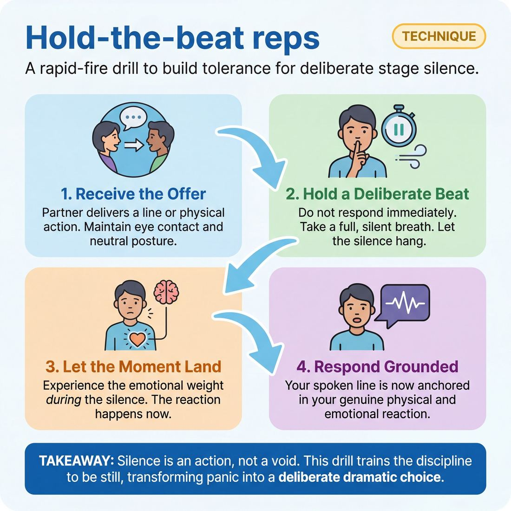

# 🎯 Hold-the-beat reps

> *A drillable muscle that trains **Silence & Stillness**.*

{ .infographic }

## 🎯 The essence

**Hold-the-beat reps** is a focused, rapid-fire drill designed to build a player's tolerance for stage silence. In this exercise, players receive a stimulus—such as a line of dialogue or a sudden physical offer—and must hold a deliberate, unhurried pause (a "beat") before reacting. Its single, defining purpose is to train the muscle of **Silence & Stillness**: forcing improvisers to short-circuit the panic-driven urge to immediately fill dead air with words, and teaching them to let the weight of a moment fully land before they respond.

## 🎓 What it trains

For most improvisers, silence feels like a threat. When a scene partner delivers a line or makes a bold physical choice, the untrained instinct is to immediately fill the resulting void. This panic-driven response leads to "talking heads," steamrolled emotional moments, and scenes that move too fast to matter. The improviser is so busy formulating their next line that they fail to actually experience the scene.

Hold-the-beat reps exist to short-circuit this panic. By artificially enforcing a pause before every response, the exercise solves several fundamental problems:

* **Eradicating the "Panic Void":** It teaches the nervous system that a moment of silence is not a mistake to be fixed, but a dramatic space to be used. 
* **Prioritizing Reaction over Invention:** When you are temporarily forbidden from speaking, you are forced to actually *receive* what was just said. The physical and emotional reaction happens *during* the beat, making the eventual spoken line much more grounded.
* **Physical and Vocal Control:** It builds the discipline to stop the mouth from moving before the brain and heart have caught up, anchoring the improviser in complete control of their own instrument.

!!! abstract "The Deeper Principle: Silence is an Action"
    In improv, a pause is never empty. Holding a beat transforms a simple delay into a deliberate, observable choice. It gives the audience time to process the weight of the previous offer, and it gives the improviser the courage to be truthful rather than just clever. You are training the discipline to be still.

## 💡 Why it works

The engine under the hood of this technique is the deliberate disruption of the improviser’s panic-response loop. In everyday conversation—and especially under the hot lights of a stage—we are conditioned to view silence as a failure, a dropped ball, or a sign that we don't know what we are doing. This drill artificially removes the option to speak, which paradoxically removes the pressure to invent.

By enforcing a mandatory pause, the technique exploits three underlying mechanisms:

* **Decoupling listening from formulating:** When you know you are forbidden from replying immediately, your brain stops racing to script your next line while your partner is still talking. You are forced out of the future and into active, present listening.
* **Enforcing the "Land":** A beat of silence allows the emotional weight of an offer to actually hit you. Instead of a cognitive response, the pause gives your body and face time to process the information. The physical reaction *becomes* the foundation of your verbal response.
* **Desensitization to tension:** Silence on stage creates immediate dramatic tension. For a **Novice**, this tension is terrifying. By drilling the pause, players build a neurological tolerance for this discomfort, learning experientially that their partner will not abandon them in the quiet.

!!! abstract "Key idea: Active vs. Dead Silence"
    This drill teaches the nervous system the difference between **dead air** (the deer-in-the-headlights panic of not knowing what to say) and **active silence** (the charged, deliberate space where two characters are processing a moment). The former drains a scene's energy; the latter builds it.

!!! tip "On stage"
    Time dilates under the lights. What feels like an agonizing five-second pause to a performer usually reads as a natural, thoughtful one-second breath to the audience. This drill recalibrates your internal metronome so you can trust the silence.

## 🧩 The setup

To set up Hold-the-beat reps effectively, you need to strip away all physical and environmental distractions so the players can focus entirely on the space between lines. 

* **Players & arrangement:** Pairs, standing face-to-face about an arm's length apart. The rest of the group sits in the audience or forms a wide horseshoe. Having an audience is highly recommended; feeling the "pressure" of watching eyes helps players train their tolerance for silence.
* **Space & materials:** A bare stage or open floor. No chairs, no props, and no physical activities to hide behind. Players should stand in a grounded, neutral posture.
* **Time:** 2–3 minutes per pair. Total exercise time: 15–20 minutes, depending on class size. Keep rounds short, as the emotional weight of deliberate silence can be exhausting.
* **Roles:** 
    * **Player A & Player B:** The active improvisers exchanging lines.
    * **The Facilitator:** Acts as the "silence enforcer," often physically conducting the length of the beat early in the drill.
* **Prerequisites:** Players should already be comfortable with sustained eye contact and basic statement/response mechanics (such as simple Meisner repetition or basic two-line scene starts). 

!!! quote "Introducing the drill"
    "Today we are going to practice the discipline of doing absolutely nothing. In a moment, you and your partner will exchange simple lines of dialogue. But here is the catch: when your partner finishes speaking, you may not respond immediately. 
    
    You must maintain eye contact, take a full, silent breath, and hold a deliberate 'beat' before you speak. During that beat, do not nod. Do not shift your weight. Do not prep your face to show you are thinking. Just let their words land, let the silence hang in the air, and wait. It will feel uncomfortably long. Let it. I will guide you on when to finally speak."

!!! tip "On stage"
    If you have a large class and limited time, you can have all pairs work simultaneously spread across the room. However, you sacrifice the valuable experience of players feeling the *audience's* tension during the silence. If time permits, run this one pair at a time center stage.

## ⚙️ The mechanics

The core objective of this technique is to actively process the partner's offer in silence, allowing a genuine **impulse** (an unfiltered, instinctual reaction) to form before speaking. 

### The Flow of Play

1. **The Stance:** Two players stand facing each other, roughly an arm's length apart, with arms relaxed at their sides. They establish and maintain unbroken eye contact.
2. **The Initiation:** Player A makes a simple, truthful, and literal observation about Player B's physical state or behavior (e.g., *"You are blinking rapidly"*).
3. **The Mandatory Beat:** Player B remains completely silent and physically still. For a full one to two seconds, they do nothing but let Player A's statement land, maintaining eye contact and observing how the statement makes them feel.
4. **The Response:** Player B speaks. Depending on the specific drill parameters, they either repeat the observation from their perspective (*"I am blinking rapidly"*) or state a new observation based on what they see in Player A (*"You are smiling"*).
5. **The Return Beat:** Player A now takes their mandatory one-to-two-second pause, absorbing Player B's response in stillness.
6. **The Loop:** The cycle continues back and forth, strictly enforcing the silence between every single line of dialogue.

!!! tip "On stage: Measuring the beat"
    A "beat" in this exercise isn't a rushed mental checkmark. It should be long enough to silently inhale and exhale, or to mentally say, *"I hear you, and..."* before opening your mouth. If it feels slightly too long, it is probably exactly right.

### Rules & Constraints

To keep the exercise focused on training Silence & Stillness, players must adhere to strict boundaries:

* **No "loading the gun":** Players must not use the silence to invent clever responses. The beat is for *listening and feeling*, not writing. The response must be discovered at the end of the beat, not pre-planned at the beginning.
* **Unbroken eye contact:** Looking away during the beat is a physical manifestation of the internal editor trying to escape the tension of silence. Eyes must stay locked.
* **No physical filler:** The beat must be held in stillness. Shifting weight, nodding, sighing, or gesturing to fill the void violates the constraint.

!!! example "In a scene"
    **Player A:** "Your jaw is tight."  
    *(Player B holds a full, two-second beat of unbroken eye contact. They do not nod. They do not look away. They simply let the words hit them.)*  
    **Player B:** "My jaw is tight."  
    *(Player A holds a full, two-second beat, observing Player B's face...)*  
    **Player A:** "You are angry."

### Ending and Resetting

A round typically lasts for one to two minutes. The coach should call "Reset" or "Stop" when:
* A player repeatedly rushes the beat, blending their partner's line into their own.
* The players break eye contact to search the ceiling or floor for an answer.
* The repetition reaches a natural, grounded emotional peak.

When resetting, players shake out their physical tension, take a deep breath, re-establish eye contact, and the other player initiates the next round.

## 🎬 Sample round

!!! example "Sample round: The Kitchen Scene"
    Here is how a standard two-person repetition of this drill looks in practice. Notice how the forced silence changes the weight of the response, preventing the actors from rushing past the emotional reality of the moment.

    **Sarah:** "I don't think we should see each other anymore."  
    *— The Trigger: Sarah delivers a high-stakes initiation and immediately stops talking, holding her physical position and eye contact.*

    **Mark:** *(Maintains unbroken eye contact. Takes a slow, visible breath in, and lets it out. A full three-second silence passes.)*  
    *— The Hold: Mark resists the Novice urge to immediately fill the silence or make a joke to break the tension. He lets the weight of the statement land on him, processing the emotion.*

    **Mark:** "I'll leave your keys on the counter."  
    *— The Response: Mark delivers his line calmly. Because he waited, the line is grounded and reactive, rather than a panicked deflection.*

    **Sarah:** *(Maintains eye contact. Takes a slow breath in, and lets it out. A full three-second silence passes.)*  
    *— The Hold: Sarah now takes her mandatory beat, absorbing Mark's cold acceptance before formulating her next move.*

    **Sarah:** "Keep them. I'm changing the locks."  
    *— The Response: The scene continues, paced entirely by deliberate, tension-filled pauses.*

## 🎚️ Variations & progressions

To move improvisers from rushing to fill empty space to weaponizing silence to hold a room, this drill must scale. You can adjust the difficulty by shifting the focus from *mechanical waiting* to *active emotional processing*.

### Level 1: Mechanical Anchors (Novice to Adv. Beginner)
At these early stages, improvisers often panic in silence. They need a physical anchor to help them hold the beat on instruction without freezing up.

* **The Breath Beat:** Instead of counting seconds in their head, the improviser must take one full, visible inhale and exhale before responding. This prevents the common mistake of holding one's breath during the silence and naturally relaxes the nervous system.
* **The Prop Tell:** The improviser is assigned a specific, repetitive physical action to execute during the beat—like taking a sip from a mimed coffee mug, wiping the counter, or adjusting their glasses. This gives the brain a task, making the silence feel justified rather than exposed.

### Level 2: Active Processing (Competent)
Once an improviser can comfortably hold a beat, the goal shifts to using that silence to transition emotion based on scene logic. The silence is no longer empty; it is full of reaction.

* **Face First:** The rule is simple: your face must react before your voice does. The beat of silence is used exclusively to let the partner's statement land, process the emotional impact, and show it physically before a single word is spoken. 
* **The Activity Beat:** Improvisers are given a complex, continuous mime task (e.g., folding laundry, repairing a watch). When a line is delivered, they must continue the physical task in silence for three seconds before speaking. This trains the improviser to separate vocal response from physical action.

!!! tip "On stage"
    A beat of silence does not mean hitting the pause button on your body. The scene is still happening. Keep breathing, keep making eye contact, and let the silence do the heavy lifting. Stillness is a choice; freezing is a reaction.

### Level 3: Weaponized Silence (Proficient to Master)
At the highest levels, improvisers let moments breathe automatically and use silence to build immense theatrical tension. These variations test their ability to sustain emotional fullness under pressure.

* **The Elastic Beat:** The coach calls out the length of the beat *after* the initiating line is delivered (e.g., "Three," "Seven," "Ten"). The improviser must sustain eye contact and emotional reality for the entire duration without fidgeting, breaking character, or dropping the tension.
* **The Pinter Scene:** A full scene where *every* line must be separated by a mandatory, uncounted, but significant pause. The improvisers must rely entirely on their internal metronome and emotional connection to dictate when the silence has peaked and the next line is earned.

!!! example "In a scene: The Elastic Beat"
    **Player A:** "I found the letters you hid in the floorboards."  
    **Coach:** "Ten seconds."  
    *(Player B stops chopping vegetables. They do not look away from Player A. For ten agonizing seconds, Player B's breathing gets shallower, their jaw tightens, and their eyes well up. The audience leans in, completely captivated by the silence.)*  
    **Player B:** "I was going to tell you."

## 🧑‍🏫 Coaching notes

When running this drill, your own presence sets the baseline. Keep your side-coaching rhythmic, calm, and grounded. Your voice should model the exact comfort with silence that you are asking the players to find. 

!!! tip "Coaching: The Golden Cue"
    **"Breathe and see them."**  
    The most crucial adjustment you can make is shifting a player from *waiting* to *experiencing*. If they are silently counting "one-Mississippi" in their head, they are in their intellect, not the scene. Remind them that the silence is active: they must use the beat to inhale, make unbroken eye contact, and let their partner's offer physically affect them.

Use short, targeted side-coaching phrases while the reps are in motion. Do not stop the exercise to give notes; just drop these cues into the silence:

* **"Let it land."** — Use this when a player is physically bracing to speak the moment their partner finishes. It cues them to actually absorb the meaning of the previous line.
* **"Stay with them."** — Use this when a player breaks eye contact to look at the floor or the ceiling while searching for their next line. 
* **"Don't load your gun."** — A reminder not to use the silence to script a clever response. The response must be born *from* the silence, not prepared *during* it.
* **"Drop your shoulders."** — A direct physical cue when you see the tension of the silence manifesting in their body.

**What 'good' looks and sounds like**  
You will know the technique is taking root when you observe specific, measurable shifts in the players' behavior. 

| Observable Element | What to look for |
| :--- | :--- |
| **The Eyes** | Unbroken, soft eye contact. The player is reading their partner's micro-expressions during the beat, rather than staring blankly. |
| **The Body** | Tension leaves the frame. You will literally see chests expand as they take a breath, and their posture will settle into the floor. |
| **The Voice** | The line delivered *after* the beat almost always drops in pitch and volume. It sounds like a genuine, intimate reaction rather than a projected "stage" performance. |
| **The Offer** | The response feels entirely dependent on the silence. It is often simpler, more emotional, and less "jokey" than what they would have said if they had spoken immediately. |

If a player is struggling, reduce the pressure. Have them do a round where they are only allowed to reply with "I know" or "Okay" after the beat. Stripping away the burden of inventing dialogue forces them to focus entirely on the mechanics of the silence itself.

## 🧭 Debrief & reflection

The goal of the debrief is to help players process the intense, often uncomfortable physical sensation of deliberate silence. Because holding the beat forces improvisers to confront their own internal editor and performance anxiety, the post-drill conversation is where the actual rewiring happens.

Use these targeted questions to guide the discussion:

* **"How long did that beat feel in your body?"** 
    * *Why ask it:* To address the subjective experience of time. Players will almost universally report that a three-second pause felt like ten seconds.
* **"Did your initial impulse change, fade, or deepen during the silence?"**
    * *Why ask it:* To highlight the difference between a panicked, knee-jerk reaction and a grounded response. Often, the first thought remains, but the *emotional weight* behind it drops in during the beat.
* **"What did you notice about your partner while you were holding the beat?"**
    * *Why ask it:* To shift focus outward. Silence allows players to actually read their partner’s micro-expressions, breathing, and posture, rather than just waiting for their turn to speak.
* **"Where did you feel the urge to break the silence?"**
    * *Why ask it:* To locate the physical manifestation of the "editor." Did their chest tighten? Did they shift their weight? Identifying the physical tell helps players catch themselves rushing in future scenes.

### What a successful debrief surfaces

A strong reflection period moves players from the Novice stage (where they rush to fill the void out of fear) toward Competence (where they recognize the utility of the pause). Listen for and validate these key "aha" moments:

| The Insight | What it sounds like | Why it matters |
| :--- | :--- | :--- |
| **The Power of Stillness** | *"I felt like I was in charge of the room just by not speaking."* | Players realize that silence reads as high status and confidence, not failure. |
| **Emotional Arrival** | *"I didn't know how I felt until the second second of the pause."* | The beat provides the necessary runway for genuine emotion to arrive unbidden, rather than being intellectually forced. |
| **The Gift to the Partner** | *"When they held the beat, I felt like my line actually mattered."* | Players discover that holding a beat honors the previous offer, making their partner look brilliant. |

!!! abstract "The Core Realization: Time Dilation"
    The most critical takeaway from this debrief is understanding **time dilation** on stage. To an improviser under pressure, a three-second pause feels like a dead, failing scene. To the audience, it looks like masterful, dramatic tension. The debrief must bridge this gap, teaching the player to trust the audience's perception of time over their own panicked internal clock.

## ⚠️ Common pitfalls

!!! warning "Watch out: The 'Panic Fill'"
    The most common novice trap is treating the silence as a terrifying void that must be plugged immediately. Under the pressure of being watched, the improviser’s internal clock speeds up. They either rush the response before the beat has actually landed, or they bridge the gap with a meaningless sound—a nervous laugh, a sigh, an "Umm," or a throat-clear. 
    
    **The fix:** Give them a mechanical anchor. Have them take one deliberate, audible breath in through the nose, or silently count "one-Mississippi" before opening their mouth. 

When improvisers first practice Hold-the-beat reps, the sudden introduction of intentional silence spikes their cognitive load. Stripped of their usual defense mechanism (talking), they often fall into a few predictable traps:

* **Physical Leaking:** The mouth is silent, but the body is screaming. The improviser shifts their weight, adjusts their shirt, scratches their face, or breaks eye contact. The tension of the silence has to go somewhere, so it bleeds into involuntary fidgeting. 
    * *How to fix it:* Coach total grounding. Instruct them to feel the floor beneath their feet and lock their eyes onto their partner. Remind them that true stillness is both vocal *and* physical.
* **The "Loading Screen" (Pre-planning):** Instead of letting the silence affect them, the improviser uses the beat as a buffer to write their next line. Their eyes glaze over or dart upward as they go into their head to invent a clever response, completely missing the emotional impact of their partner's offer.
    * *How to fix it:* Shift their focus entirely outward. The beat is for *receiving*, not *inventing*. Tell them: "Don't think about what you will say; just let what they said hit you like a physical weight."
* **"Acting" the Silence:** Feeling naked and vulnerable in the quiet, the improviser compensates by over-animating. They furrow their brow, nod exaggeratedly, or pantomime deep thought to *show* the audience they are taking a beat. 
    * *How to fix it:* Strip away the performance. Remind them to trust a neutral, connected face. The audience will automatically project profound meaning onto two people simply looking at each other in stillness—there is no need to "act" it.

!!! tip "On stage"
    If you catch yourself breaking eye contact during a beat, you are likely trying to escape the tension. Lean into it. Hold the gaze. The tension you feel is exactly what makes the scene compelling to watch.

## 🌟 What mastery looks like

When improvisers reach mastery in Hold-the-beat reps, the exercise transforms from a mechanical timing drill into a masterclass in tension and presence. The silence is no longer an empty space they are forced to endure; it becomes a powerful tool they actively wield. 

At the highest level of execution, you will observe:

* **Weaponized silence:** A **Master** improviser does not merely pause; they hold the room with stillness. The beat creates an audible collective focus where the audience (or class) leans in, captivated by the unspoken, kinetic energy between the players.
* **Active absorption, not planning:** During the beat, you can physically see the partner’s words landing. The master’s eyes remain locked, their breathing adapts to the emotional shift, and they use the silence to *feel* the impact rather than to *invent* their next line.
* **Absolute physical economy:** There is zero "leakage." No shifting of weight, no nervous blinking, no throat-clearing, and no breaking of eye contact. The stillness is absolute, grounded, and entirely devoid of hesitation.
* **Inevitable responses:** When the beat concludes, the verbal or physical response flows out effortlessly. Because they bypassed the internal editor during the silence, the reaction feels entirely organic—as if it were the only possible thing they could have said or done.

!!! abstract "Waiting vs. Breathing"
    A novice holds a beat like they are holding their breath underwater—tense, counting the seconds, and desperate to speak so they can finally exhale. A master holds a beat like they are taking a deep breath of fresh air—filling their lungs with the reality of the scene, letting it change them, and then exhaling their response.

In short, mastery looks like complete comfort in the void. The improviser proves they do not need immediate words to justify their existence on stage, demonstrating the courage to be entirely truthful and the discipline to be entirely still.

## 🔗 Why it matters

At its core, Hold-the-beat reps are the foundational conditioning for Silence & Stillness. Just as a musician must practice resting on the off-beat, an improviser must train their nervous system to tolerate—and eventually command—the empty space between lines of dialogue. 

Within the domain of the improviser's own instrument, their greatest enemy is often their own discomfort. When we feel exposed on stage, our instinct is to hide behind a wall of words. This technique directly attacks that instinct, building the discipline to be still and the courage to be truthful without relying on verbal armor. 

By isolating and drilling the deliberate pause, this muscle serves the wider craft in three vital ways:

* **It transforms panic into power:** For a beginner, silence feels like dead air that must be rushed and filled. By drilling the beat, improvisers learn that silence is actually a container for tension. They move from fearing the pause to actively using it to hold the room.
* **It creates space for subtext:** Words convey the text of a scene, but the silent beat conveys the *subtext*—the realization, the heartbreak, the suppressed anger, or the dawning joy. Without the beat, scenes remain superficial talking-head exercises.
* **It trains the audience to care:** When improvisers rush, the audience leans back, treating the show like a rapid-fire comedy sketch. When improvisers confidently hold a beat, the audience leans in. It signals to the crowd that what is happening matters, elevating the work from a disposable joke to compelling theater.

!!! abstract "The ultimate shift"
    Mastery of this technique marks the transition from an improviser who is *driven by* the scene's momentum to one who *drives* it. When you no longer need to speak to feel safe, you achieve complete physical and vocal control. You stop reacting out of panic, and start responding with purpose.

## 📚 References & Further Reading

### Foundational sources
* **Sanford Meisner & Dennis Longwell, *Sanford Meisner on Acting* (1987)** — The direct ancestor of this drill is the Meisner Repetition Exercise. Meisner famously taught that "silence has a myriad of meanings... never an absence of meaning." By forcing students to repeat a single phrase back and forth, the exercise strips away the cognitive load of inventing dialogue. This trains actors to observe their partner, wait for a genuine impulse, and let the emotional weight of a moment fully land before speaking—the exact mechanics at the heart of Hold-the-beat reps. [Penguin Random House]{.ref}
* **Viola Spolin, *Improvisation for the Theater* (1963)** — Spolin’s foundational text includes exercises specifically focused on "Refining Awareness" (such as "Silence" and "Listening to the Environment"). These games train improvisers to decouple their physical reactions from the immediate urge to speak. Spolin's philosophy emphasizes that true spontaneity comes from experiencing the environment and the partner intuitively, rather than intellectually rushing to script the next line. [Northwestern University Press]{.ref}

### Practitioner guides & manuals
* **William Esper & Damon DiMarco, *The Actor's Art and Craft: William Esper Teaches the Meisner Technique* (2008)** — A detailed, practical breakdown of how to apply repetition exercises in a classroom setting. Esper emphasizes how removing the pressure to invent dialogue forces the actor to react from genuine impulse, active listening, and physical observation. For improvisers struggling with the "talking heads" problem, Esper's breakdown of how to use silence to prevent intellectual choices is an invaluable guide to anchoring a scene in physical truth. [Penguin Random House]{.ref}
* **Mick Napier, *Improvise: Scene from the Inside Out* (2004)** — Napier directly challenges the panic-driven urge to immediately fill dead air on the improv stage. He advocates for the power of silence, taking a beat, and letting the tension of a moment process before responding. Napier notes that overtalking is often just a symptom of fear, and that learning to be comfortable with moments of silence creates powerful dramatic tension and gives both performers and the audience time to process what is actually happening in the scene. [Heinemann]{.ref}
* **TJ Jagodowski, David Pasquesi, and Pam Victor, *Improvisation at the Speed of Life: The TJ and Dave Book* (2015)** — TJ and Dave are renowned for their patient, silent scene starts and their ability to let moments breathe. This book explores the philosophy of trusting the silence, reacting to the space, and not rushing to invent. It provides a mindset shift for improvisers, teaching them to treat a pause as an active, charged choice rather than a mistake or a "dropped ball." [Solo Publishing]{.ref}

### Research & theory
* **Stephen W. Porges, *The Polyvagal Theory: Neurophysiological Foundations of Emotions, Attachment, Communication, and Self-regulation* (2011)** — This clinical text explains the neurological "panic void" improvisers experience when faced with silence. Porges's work on the autonomic nervous system details how the body shifts into a "fight-or-flight" sympathetic state under the stress of stage tension. Understanding this biological response explains why Hold-the-beat reps work: deliberate pacing, sustained eye contact, and co-regulation help shift the nervous system back to a "safe and social" ventral vagal state, desensitizing the player to the discomfort of silence. [W. W. Norton & Company]{.ref}

### Talks, videos & courses
* **Alex Karpovsky (Director), *Trust Us, This Is All Made Up* (2009)** — A documentary capturing the legendary long-form improv duo TJ Jagodowski and David Pasquesi performing a fully improvised one-hour play. The film provides a masterclass in using active silence, sustained eye contact, and deliberate pacing. Watching their performance is the best visual proof of the Hold-the-beat philosophy: they build grounded, theatrical scenes without ever giving in to the panic of dead air, allowing every emotional offer to fully land. [Apple TV]{.ref}

## 💬 Quotes & Anecdotes

!!! quote "— Sanford Meisner, *Sanford Meisner on Acting* (1987)"
    Silence has a myriad of meanings. In the theater, silence is an absence of words, but never an absence of meaning.

!!! quote "— Sanford Meisner, *Sanford Meisner on Acting* (1987)"
    An ounce of behavior is worth a pound of words.

!!! quote "— Mick Napier, *Improvise: Scene from the Inside Out* (2004)"
    Unfortunately, most silence before a response is not a choice in improvisation. It's someone that has no game and they are silent out of fear and not power. So if you find yourself in that space, I suggest responding quickly with something just to snap you out of your head a bit.

!!! quote "— David Razowsky, *Interview with People & Chairs* (2013)"
    All scenes have dialogue, even – and especially – scenes without 'spoken' dialogue. When you consider that scenes aren't about what we say, rather they're about how we say it, then the world opens up for you. The first line of dialogue isn't spoken – it's noticed.

### Where it comes from

The mechanics of "Hold-the-beat reps" are directly descended from the foundational repetition exercises developed by legendary acting teacher Sanford Meisner in the mid-20th century. Meisner designed repetition to force actors out of their heads, stripping away the pressure to invent dialogue so they could focus entirely on observing and reacting to their partner's behavior. In the improv world, this concept was adapted to cure "talking heads" and panic-driven scene work. Instructors use the mandatory beat to train improvisers to find the power in stillness, shifting the focus from *what* is being said to *how* it is being received.

### A telling example

The legendary Chicago improv duo TJ & Dave (TJ Jagodowski and Dave Pasquesi)—whom Stephen Colbert once described by saying, "One of these guys is the best improviser in the world. And the other one is better"—are famous for their masterful use of active silence. 

They frequently begin their hour-long improvised plays by simply standing or sitting on stage in complete silence, sometimes for a minute or more. During this beat, they do not panic or rush to invent a premise to fill the void. Instead, they physically react to the space, establish eye contact, and let the tension settle. By holding the beat and living in the silence, they establish the relationship, the environment, and the emotional stakes, proving to the audience that the scene is already fully alive long before the first word is ever spoken.

## 🧭 Explore the framework

- ⬆️ **Skill it trains:** [Silence & Stillness](01_S5__silence-and-stillness.md)
- 🎭 **Domain:** [The Self](01_D__the-self.md)
- 🔁 **Sibling techniques:** [Do nothing exercises](01_S5_T1__do-nothing-exercises.md), [Status-through-stillness](01_S5_T3__status-through-stillness.md)
