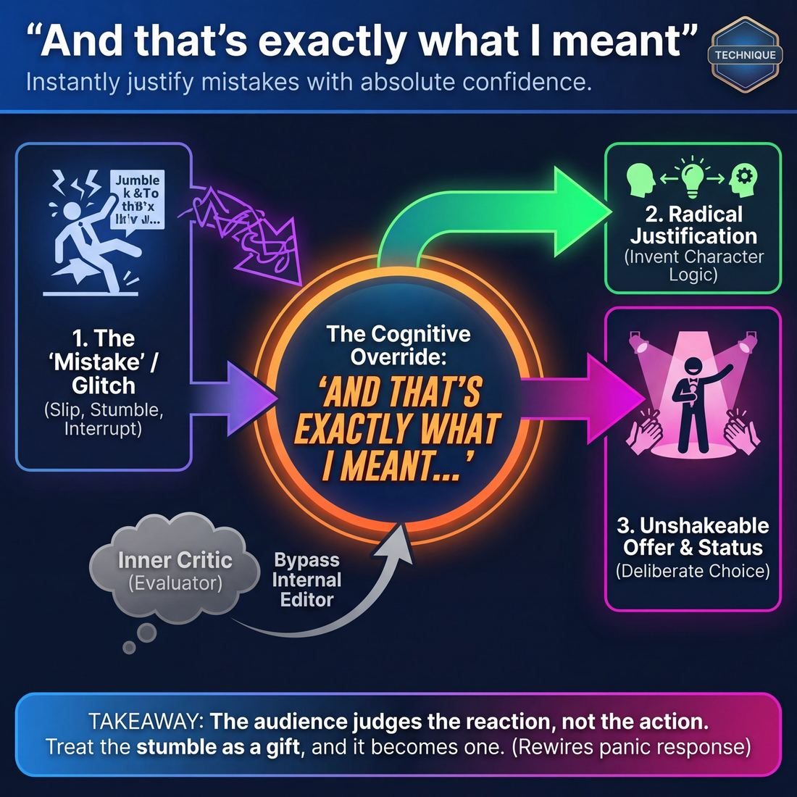

# 🎯 And that's exactly what I meant

> *A drillable muscle that trains **Self-Recovery**.*

{ .infographic }

## 🎯 The essence

**"And that's exactly what I meant"** is a fast-paced justification drill where improvisers make deliberate verbal or physical "mistakes"—a slip of the tongue, a stumble, or a nonsensical statement—and instantly defend them with absolute, unflinching confidence. Instead of apologizing, freezing, or breaking character when an error occurs, the player leans in, treating the slip-up as a brilliant, intentional choice. It forces the improviser to practice a single, vital muscle: **self-recovery**, the ability to instantly bypass the inner critic and transform a moment of accidental failure into a deliberate, unshakeable offer.

## 🎓 What it trains

At its core, this technique isolates and drills the ability to instantly metabolize an error. When an improviser trips over a chair or accidentally calls their scene partner by the wrong name, the natural human instinct is to wince, apologize, or break character. This exercise exists to rewire that exact panic response. 

By forcing the improviser to claim the "mistake" as intentional, it builds several critical muscles:

* **Bypassing the internal editor:** It trains the brain to stop evaluating whether an offer was "good" or "right," focusing entirely on dealing with what actually just happened.
* **Radical justification:** It forces the improviser to rapidly invent a reality where a bizarre or accidental action makes perfect sense for their character.
* **Unbreakable commitment:** It teaches the performer to maintain their physical and vocal poise—holding their ground and their volume—even when their mind is scrambling.

!!! warning "The problem it solves"
    The "oops" instinct. Novice improvisers often let their internal editor win under pressure. When they misspeak, they drop their volume, break eye contact, or nervously giggle—shattering the reality of the scene and signaling to the audience that something went wrong. This technique eliminates the "oops" and replaces it with "ah, yes."

!!! abstract "The deeper principle"
    This drill is the mechanical application of the famous improv adage: *"There are no mistakes, only gifts."* It proves that the audience doesn't actually care *what* you did; they only care about *how you react* to what you did. If you treat a stumble as a tragedy, it is. If you treat it as a deliberate, genius character choice, it becomes the best part of the scene.

## 💡 Why it works

!!! abstract "The Circuit Breaker"
    At its core, this technique acts as a cognitive override. It interrupts the brain's natural panic response to a mistake and replaces it with a pre-programmed assertion of control, forcing the improviser to instantly re-categorize an "error" as a deliberate "offer."

The engine under the hood of this technique relies on three distinct psychological and group dynamics:

* **Silencing the Inner Critic:** The exact moment an improviser trips or stutters is when their internal editor screams the loudest. By mandating a specific, confident phrase immediately after the flub, the technique leaves no cognitive bandwidth for self-judgment. 
* **Forced Justification:** In improv, a mistake is simply an offer that hasn't been justified yet. By declaring that a mangled word was intentional, the improviser's brain is forced to rapidly invent the *reason* it was intentional, turning a dead-end failure into a springboard for new scene logic.
* **Preserving Character Status:** When a performer breaks character to apologize, their status plummets. Owning the mistake with absolute conviction maintains the character's status and keeps the reality of the scene intact.

!!! note "Managing Audience Tension"
    Audiences are highly empathetic; if you tense up over a flubbed line, they tense up with you. By boldly declaring your mistake was intentional, you signal that you are safe and in control. This instantly releases the tension in the room, transforming potential cringe into shared delight.

## 🧩 The setup

**Players & Arrangement:** 6 to 15 players. Stand in a single, unified circle so everyone has a clear view of the active player. For larger classes, split into two smaller circles of 5–8 players to increase repetitions.

**Space & Materials:** An open floor. No chairs, props, or set pieces are required. 

**Time:** 
* **Per round:** 15 to 30 seconds per player. 
* **Total duration:** 5 to 10 minutes. The pace should be brisk to prevent pre-planning.

**Roles:**
* **The Speaker:** The active player who begins a mundane story or physical action, and must ultimately justify the disruption.
* **The Instigator:** Usually the facilitator (though it can be passed to the player on the Speaker's left). They interrupt the Speaker by shouting a completely unrelated noun, or calling out a physical "mistake" (e.g., "You just tripped!").
* **The Chorus:** The rest of the circle. Their job is to provide warm, undivided attention and to celebrate the Speaker's recovery.

**Prerequisites:** A basic understanding of **justification** (providing a logical, in-world reason for why something exists or happens). Players should also have a baseline comfort with being the center of attention.

!!! note "Setting the room's temperature"
    Because this drill directly targets the fear of failure, the physical setup must feel supportive. Ensure the circle is tight enough that players feel held by the group, rather than isolated on an island. 

!!! quote "How to introduce it"
    "In improv, the audience doesn't judge you for making a mistake; they judge you on how you handle it. Today, we are going to practice the art of the flawless recovery. 
    
    One at a time, you will step into the center and start telling a completely mundane story. After a few seconds, I am going to interrupt you by shouting a random word. Your job is to instantly accept that word, look confidently at us, say the phrase, *'And that's exactly what I meant...'* and then seamlessly weave my random word into your story as if it was your brilliant plan all along."

## ⚙️ The mechanics

The core objective is to rewire the brain’s panic response. Instead of freezing, the player is forced to instantly claim ownership of the error and weave it into the reality of the scene. 

!!! abstract "The Core Loop"
    **Action** ➔ **Error** ➔ **Claim Ownership** ➔ **Justify** ➔ **Continue**

### The Flow of Play

In a standard circle or line-up drill, the exercise follows a strict, five-step sequence:

1. **The Baseline:** A player steps center stage and begins a mundane solo activity (e.g., folding laundry, painting a fence) while delivering a simple, grounded monologue.
2. **The Trigger (The "Mistake"):** The player introduces a sudden, jarring error. This can be physical (tripping, dropping an imaginary object) or verbal (stuttering, a wild non-sequitur). *Note: The coach can also trigger this by clapping or shouting "Mistake!"*
3. **The Declaration:** Without dropping character or breaking eye contact, the player immediately states the anchor phrase: **"And that's exactly what I meant to do..."** (or "...say").
4. **The Justification:** The player instantly provides a contextual reason for the error, treating it as a deliberate, logical choice within the scene's reality. 
5. **The Continuation:** The player resumes their monologue or action, now permanently altered by the newly established fact. 

Once the player successfully integrates the mistake and continues for a few beats, the coach calls "Next," and the round resets with a new player.

!!! example "In a scene"
    **Player:** (Miming chopping vegetables) "I just think if we’re going to host Thanksgiving, we need to—" *(Player intentionally throws the imaginary knife across the room).* 
    **Player:** "And that is exactly what I meant to do. Because every time I bring up your mother, I need to disarm myself before I say something I regret."

### Rules & Constraints

To effectively bypass the inner editor, players must adhere to strict constraints:

* **Zero latency:** The Declaration must follow the Trigger instantly. There is no time allowed to pause, think, or search the ceiling for a clever idea. 
* **No breaking:** The player must maintain complete physical and vocal control. No giggling, no apologizing, and no looking at the coach for validation. 
* **Commitment over cleverness:** The justification does not need to be brilliant or perfectly logical. It only needs to be delivered with absolute, unwavering confidence. 

!!! tip "On stage"
    While you use the literal phrase *"And that's exactly what I meant..."* in the training room, on stage you rarely say the actual words. Instead, you deploy the **energy** of the phrase. If you accidentally call your scene partner "Mom" instead of "Mary," you don't correct yourself; you instantly justify why you just called your wife "Mom," treating the slip of the tongue as a profound character choice.

## 🎬 Sample round

!!! example "Sample round: The Center-Circle Drill"
    In this standard drill format, players stand in a circle. One by one, they step into the center, commit a "mistake" (either organic or manufactured), and immediately recover using the framework. 

    **Example 1: The Verbal Flub**
    * **The Flub:** Player A steps forward confidently. "Welcome to the annual meeting of the... *Space*... *Spaghetti*... Board." *(Player A clearly loses their train of thought and freezes for a microsecond).*
    * **The Anchor:** *(Takes a breath, squares their shoulders, and makes direct eye contact with the group).* "And that's exactly what I meant."
    * **The Justification:** "For too long, our aerospace division has been throwing ideas at the wall just to see what sticks. Today, we dine on the carbs of innovation."

    **Example 2: The Physical Stumble**
    * **The Flub:** Player B walks to the center, catches their toe on the floor, and stumbles awkwardly, arms flailing.
    * **The Anchor:** *(Freezes in the awkward lunge, then slowly stands up with immense, unbothered dignity).* "And that's exactly what I meant."
    * **The Justification:** "I wanted you all to feel the precise lack of balance our accounting department has been operating under since Q3."

    **Example 3: The Logical Contradiction**
    * **The Flub:** Player C points aggressively. "I have never, ever loved you! Which is why I bought you this diamond ring."
    * **The Anchor:** *(Drops their vocal volume, leaning in with intense, grounded sincerity).* "And that's exactly what I meant."
    * **The Justification:** "Because love is a weak, fleeting emotion for poets. What I offer you is an unbreakable, crystalline partnership of power."

## 🎚️ Variations & progressions

To build the muscle of self-recovery, this technique must evolve from a rigid, vocalized drill into an invisible, internalized habit. As players move from hesitating novices to masters of spontaneity, the exercise scales by removing the "training wheels" of the catchphrase and increasing the complexity of the mistake.

* **The Circle Drill (Novice)**
    Players stand in a circle. One player steps into the center, makes a completely random, exaggerated physical gesture and sound, freezes, and then verbally justifies it starting with the exact phrase: *"And that's exactly what I meant to do, because..."* 
    * **The Goal:** Train the player to offer their first thought reliably, bypassing the inner critic that judges ideas before they are spoken.

* **The Monologue Trip-Up (Advanced Beginner)**
    A player delivers a grounded monologue. The coach occasionally claps or rings a bell. On the cue, the player must instantly blurt out a random, disconnected noun (e.g., "Tractor!"), followed immediately by *"And that's exactly what I meant..."* to weave the nonsense word back into the narrative flow.
    * **The Goal:** Recovering under mild pressure while maintaining vocal projection and narrative logic.

* **Drop the Catchphrase (Competent to Proficient)**
    The training wheels come off. Players perform a standard two-person scene. When a genuine verbal stumble, physical trip, or accidental collision occurs, they must instantly justify it *without* saying the phrase. The mistake simply becomes a deliberate, simultaneous character choice.
    * **The Goal:** Impulse and action become simultaneous. The player decides when a moment needs silence to breathe, rather than rushing to verbally explain the mistake.

!!! example "In a scene: Dropping the Catchphrase"
    **Player A:** *(Accidentally knocks over a water glass while reaching for a prop)* "Oh—"
    **Player B:** "Rough morning?"
    **Player A:** *(Instantly justifying the action as a character choice, without breaking reality)* "I told you, Susan, I cannot be trusted around fragile things until I've had my coffee. Now look what you've made me do."

* **The Emotional Misfire (Master)**
    Instead of a physical or verbal mistake, the player is assigned (or accidentally exhibits) a completely incongruous emotional reaction—like bursting into joyous laughter while delivering tragic news. They must instantly justify the emotion, layering it genuinely into the scene's reality.
    * **The Goal:** True emotional fluidity. The master improviser feels the real, unbidden emotion *and* modulates it to serve the scene, leaving no measurable latency between the "mistake" and the brilliant justification.

!!! tip "On stage"
    When progressing to the higher levels, encourage players to use **silence and stillness**. A novice rushes to fill the silence after a mistake with words. A master will hold a beat, let the audience see the character process the "mistake," and weaponize that silence to draw the room's focus before justifying it.

## 🧑‍🏫 Coaching notes

As a coach, your primary job during this drill is to watch for the **micro-expressions of failure**. When a player trips over their words or makes a physical error, their socialization screams at them to apologize, break eye contact, or laugh nervously. You are coaching them to override that deeply ingrained reflex.

!!! tip "Coaching: The single most important cue"
    **"Watch the eyes and the shoulders."** 
    The moment a player misspeaks, their instinct is to drop their gaze, break character, or shrink their posture. If you see the physical collapse beginning, immediately side-coach: *"Eyes up! Own it!"* The physical recovery must happen before the verbal one. If the body apologizes, the words won't matter.

**What to call out in the moment:**
* **"No wincing!"** — Call this out the second you see a facial grimace or a nervous smile.
* **"Match the volume."** — Novices will instinctively drop their volume when they realize they've made a mistake. Remind them to deliver the justification with the exact same vocal energy and projection as the original line.
* **"Don't rush the fix."** — Players will often speed up their speech to get past the awkwardness. Side-coach them to take a breath, hold the beat, and deliver the justification at a normal, confident pace.
* **"Make it true."** — Push them past weak, throwaway justifications. The explanation for *why* they meant to say the wrong word should add specific, interesting details to the scene.

**What 'good' looks and sounds like:**
* **Zero latency:** The transition from the mistake to the anchor phrase happens without a measurable pause.
* **Unbroken physical poise:** The player remains physically rooted. There is no nervous shifting of weight, no covering of the mouth, and no looking to the coach for permission.
* **Character consistency:** The justification sounds like something the *character* would say, rather than the *actor* desperately trying to save the scene. 

## 🧭 Debrief & reflection

After the laughter and adrenaline of the exercise subside, the debrief is where the cognitive shift happens. The goal of this conversation is to help players recognize the physical sensation of a "mistake" and rewire their habitual response from panic to opportunity. 

Use these questions to guide the post-round reflection:

* **"Where did you feel the 'mistake' in your body before you justified it?"**
    * *What it surfaces:* Players will often describe a dropped stomach, a tightening in the chest, or an instinct to break eye contact. Identifying this physical trigger helps them recognize the inner critic in real-time, making it easier to bypass hesitation in future scenes.
* **"How did your internal energy shift the moment you committed to the justification?"**
    * *What it surfaces:* The realization that the justification brings immediate relief. The burden of "being perfect" vanishes, replaced by the playful, spontaneous challenge of making the new reality work. 
* **"For those watching, which was more interesting: the player's original plan, or the justified mistake?"**
    * *What it surfaces:* Observers will almost always prefer the justified mistake. It proves to the improviser that the audience isn't judging the error; they are actively rooting for the recovery.

!!! abstract "The Core Realization"
    A successful debrief leads the room to one universal improv truth: **the mistake is never the problem; the apology is.** When players realize that total, unwavering confidence can seamlessly integrate any error into the fabric of the scene, they achieve true freedom from hesitation. They learn that they are never truly trapped on stage.

## ⚠️ Common pitfalls

!!! warning "Watch out: The Apologetic Body"
    The single most common failure in this exercise is saying the words "And that's exactly what I meant" while your body screams, "I am so sorry I messed up." Players will grimace, shrink their posture, or let out a nervous giggle. If the physical action doesn't match the verbal confidence, the recovery fails. 
    
    **The fix:** Coach the physical recovery first. Before they even speak the phrase, require the player to plant their feet, lift their chin, and make direct eye contact. The body must lead the brain into confidence.

When players are put under the cognitive load of making a mistake and instantly recovering, their inner editor usually panics. Watch for these specific traps where the technique breaks down:

* **The "Because" Trap (Over-justifying):** Under pressure, the brain desperately wants to invent a logical reason for the mistake. A player will say, "And that's exactly what I meant... *because* my character has a twitch." This kills the momentum and shows they are still in their head.
    * *The fix:* Cut the tail. The phrase is a complete sentence. Enforce a hard stop (a period) after the word "meant." The justification comes entirely from the player's unwavering confidence, not from invented logic.
* **The Latency Gap:** The player realizes they made a mistake, their inner editor freezes them for two seconds, and *then* they remember the exercise and deploy the phrase. You will see a visible gear-shift in their eyes. 
    * *The fix:* Drill for speed. If there is a gap, stop the scene, have them recreate the exact physical mistake, and trigger the phrase instantly.
* **The Sarcastic Shield:** Fear of looking foolish makes the player deliver the line with a wink, an eye-roll, or a sarcastic tone. They are trying to distance themselves from the mistake by showing the audience they are "in on the joke."
    * *The fix:* Demand absolute sincerity. The phrase must be delivered as a genuine, high-status declaration of intent. Remind them that irony is just another form of hesitation. 

!!! tip "On stage"
    If a player drops a prop or stumbles over a word and immediately breaks character to laugh at themselves, do not let them off the hook. Make them pick the prop back up, drop it again on purpose, and deliver the line with total, unblinking sincerity. Reprogram the muscle memory.

## 🌟 What mastery looks like

At the highest level of execution, a player performing **"And that's exactly what I meant"** completely erases the line between an accidental flub and a deliberate character choice. The audience—and often their scene partners—cannot tell that a mistake ever occurred. 

Mastery of this technique is highly observable. When a master improviser trips over a chair, stutters a word, or contradicts a previously established fact, you will see:

* **Zero latency:** There is no measurable gap between the accident and the justification. The recovery is instantaneous.
* **Absolute physical composure:** The player exhibits no "tells." There is no nervous laughter, no breaking of eye contact, and no apologetic shrinking of the shoulders. 
* **Emotional integration:** The justification isn't just a clever, logical band-aid; it is delivered with genuine emotional weight that fits the scene. The mistake is used to deepen the character's current state or point of view.
* **Weaponized stillness:** If the mistake creates a sudden, awkward silence, the master player does not rush to fill it. They hold the beat, letting the tension build, before delivering their justification with total, grounded authority.

!!! example "In a scene: The Masterful Recovery"
    **The Flub:** A player confidently strides on stage to play a tough, intimidating mob boss, but accidentally trips hard over a painted block, stumbling to their knees.
    
    **Novice Recovery:** The player breaks character slightly, chuckles, stands up quickly, and says, "Whoops, clumsy me. Anyway, where's the money?" *(The mistake is brushed aside, breaking the reality).*
    
    **Master Recovery:** The player stays on their knees, breathes, looks slowly up at their scene partner with cold, dead eyes, and says, "I kneel to show you exactly how tall you're gonna feel when I cut off your legs. Now, where's the money?" *(The mistake is owned, justified, and heightens the scene's stakes).*

Ultimately, mastery of this drill means the improviser no longer views the technique as a safety net for failure, but as a springboard for discovery. The "mistake" is transformed into the most interesting and vital gift the scene could have received.

## 🔗 Why it matters

The instinct to apologize or shrink when we make a mistake is deeply ingrained. In daily life, a flubbed word, a tripped foot, or a dropped prop is an error to be quickly corrected. On stage, however, that same flub is a gift—but only if the improviser has the composure to accept it. 

This technique is the foundational muscle for self-recovery. By forcing the improviser to audibly and physically claim an accident as an intentional choice, it short-circuits the **apology reflex**—that micro-second of hesitation where a performer drops character, breaks eye contact, or physically deflates. 

Zooming out to the broader domain of **The Self**, this drill directly cultivates **freedom from hesitation**. When an improviser knows they have the tools to instantly recover from *any* misstep, the fear of failure evaporates. They no longer pre-plan their words or police their physical choices to stay "safe." Instead, they play with a looser, more courageous energy, trusting that a stumble is just a new, unexpected step in the scene.

Finally, this muscle connects to the wider craft by serving as a masterclass in justification. Improv is not about being perfect; it is about making the unexpected make sense. When you confidently declare that a bizarre slip of the tongue was *exactly* what you meant, you are immediately forced to invent the reality where that statement is true. You transform a moment of panic into the inciting incident for brilliant, spontaneous character work.

!!! abstract "The Paradigm Shift"
    The audience rarely notices a mistake, but they *always* notice an improviser's panic. This technique trains you to protect the audience's trust by maintaining absolute poise, proving that no matter what happens on stage, you are entirely in control of the ride.

## 📚 References & Further Reading

### Foundational sources
* **Keith Johnstone, [*Impro: Improvisation and the Theatre*]{.ref} (1979)** — The seminal text on bypassing the inner critic, overcoming the fear of failure, and the psychology of spontaneity. Johnstone argues that the improviser must accept what their imagination gives them without judgment, noting that the fear of making a mistake or being "unoriginal" is what paralyzes performers. 
* **Viola Spolin, [*Improvisation for the Theater*]{.ref} (1963)** — The foundational manual that introduced theater games designed to bypass the "approval/disapproval syndrome" (the inner editor). Spolin's philosophy centers on keeping players present in the moment and focused on the physical reality of the game, which naturally prevents the brain from freezing up when an error occurs.
* **Patricia Ryan Madson, [*Improv Wisdom: Don't Prepare, Just Show Up*]{.ref} (2005)** — Specifically Chapter 4, "Make Mistakes, Please," which frames errors as inevitable gifts and outlines the philosophy of radical acceptance. Madson, a Stanford professor, translates the theatrical concept of self-recovery into a practical mindset for metabolizing failure without panic.

### Practitioner guides & manuals
* **Matt Besser, Ian Roberts, and Matt Walsh, [*The Upright Citizens Brigade Comedy Improvisation Manual*]{.ref} (2013)** — Provides the definitive mechanical breakdown of "Justification"—the process of providing a logical, in-world reason for an unusual action or mistake. The UCB approach treats every slip-up not as an error to be hidden, but as the "first unusual thing" that can be justified to build the entire comedic game of the scene.
* **Mick Napier, [*Improvise: Scene from the Inside Out*]{.ref} (2004)** — Focuses heavily on the power of committing to an initial choice (even an accidental one) and trusting your brain to justify it after the fact, rather than freezing. Napier argues that the audience doesn't care what you do, only that you do it with absolute confidence.
* **Tina Fey, [*Bossypants*]{.ref} (2011)** — Her famous chapter "The Rules of Improv" popularized the specific phrasing: "There are no mistakes, only opportunities" (and "beautiful happy accidents"). Fey articulates how the Second City philosophy of treating errors as gifts applies equally to writing, performing, and leadership.
* **Will Hines, [*How to Be the Greatest Improviser on Earth*]{.ref} (2016)** — Hines dedicates significant portions of his book to the mechanics of justification and maintaining your composure when a scene goes off the rails. He emphasizes that the improviser's job is to make sense of the nonsense, treating every stumble as a deliberate offer that simply hasn't been explained yet.
* **Jill Bernard, [*Jill Bernard's Small Cute Book of Improv*]{.ref} (2007)** — A widely used, highly practical indie manual that includes specific exercises on dealing with mistakes and keeping scenes alive when things go wrong. Bernard emphasizes that you cannot "break" improv, and drills the muscle of continuing the scene no matter how hard a player tries to derail it.

### Research & theory
* **Stephen Nachmanovitch, [*Free Play: Improvisation in Life and Art*]{.ref} (1990)** — Explores the psychology of the creative process, specifically how the concept of "mistakes as gifts" unlocks flow states and bypasses the internal editor. Nachmanovitch explains that in improvisation, an error is simply a new piece of information that the system must now incorporate.
* **Michael Frese & Nina Keith, [*Action Errors, Error Management, and Learning in Organizations*]{.ref} (Annual Review of Psychology, 2015)** — Academic research on "Error Management Training," which proves that actively making and recovering from errors builds greater cognitive resilience than avoiding them. The study shows that environments that accept human error and focus on damage control and learning yield higher innovation.
* **Amy Edmondson, [*Psychological Safety and Learning Behavior in Work Teams*]{.ref} (Administrative Science Quarterly, 1999)** — Foundational research demonstrating that environments where mistakes are openly claimed and metabolized (rather than hidden) lead to higher performance and learning. This mirrors the exact group dynamic required in an improv circle to make self-recovery drills effective.
* **Mihaly Csikszentmihalyi, [*Flow: The Psychology of Optimal Experience*]{.ref} (1990)** — While not strictly about improv, this foundational text on the "flow state" explains the cognitive mechanics of what happens when the inner critic is silenced. The self-recovery drill is designed to prevent the disruption of flow by instantly re-categorizing an error as part of the ongoing task.

### Communities & adjacent reading
* **Kelly Leonard & Tom Yorton, [*Yes, And: How Improvisation Reverses "No, But" Thinking and Improves Creativity and Collaboration*]{.ref} (2015)** — A guide from Second City executives on how the improv mindset of embracing failure and justifying mistakes translates to psychological safety in teams. They detail how the "Yes, And" philosophy rewires the brain's panic response to the unexpected.

## 💬 Quotes & Anecdotes

!!! quote "— Tina Fey, *Bossypants* (2011)"
    THERE ARE NO MISTAKES, only opportunities. [...] In improv there are no mistakes, only beautiful happy accidents. And many of the world's greatest discoveries have been by accident. I mean, look at the Reese's Peanut Butter Cup, or Botox.

!!! quote "— Charna Halpern, Del Close, and Kim 'Howard' Johnson, *Truth in Comedy* (1994)"
    Nothing is ignored. Nothing is forgotten. And nothing is a 'mistake.' [...] There are no mistakes. Everything is justified. Treat others as if they are poets, geniuses and artists, and they will be.

!!! quote "— Keith Johnstone, Improv pioneer"
    Try; make mistakes; fail big and fail happily. If the audience sees you unbothered by your mistakes then they can enjoy them too, but if they see you feel humiliated and ashamed, they will be uncomfortable.

### Where it comes from
The philosophy of treating errors as gifts is foundational to modern improvisation, tracing back to Viola Spolin's theater games and later codified by pioneers like Del Close and Keith Johnstone. The specific drill "And that's exactly what I meant" (sometimes called "I Meant to Do That" or the "Justification Drill") emerged in training centers like The Second City and iO (ImprovOlympic) as a mechanical way to force players to embody this philosophy. It directly trains the "justification" muscle—a concept heavily emphasized by Del Close and Elaine May, which dictates that whatever happens on stage, no matter how accidental, must be treated as an intentional, logical reality of the scene.

### A telling example
In his teachings, Keith Johnstone often emphasized that audiences actually *enjoy* seeing things go wrong, provided the performer doesn't panic. He famously told his students, "You're supposed to make at least one big mistake in each half [of the show]. Otherwise it's show-business!" 

To illustrate how this drill rewires a performer's instincts, consider a classic illustrative scenario:
An improviser enters a scene intending to confidently pour a glass of water, but accidentally knocks the imaginary pitcher off the table. 

* **The "Oops" Response:** The improviser breaks character, nervously chuckles, says "Whoops, sorry," and mimes cleaning it up. The audience feels the performer's tension, the character's status drops, and the reality of the scene shatters.
* **The "Exactly What I Meant" Response:** The improviser doesn't flinch. They stare at the shattered imaginary pitcher, look at their scene partner with cold intensity, and say, "And that is exactly what I meant to do. Now, are you going to tell me the truth about the bank robbery, or do I need to break the glasses too?" 

By claiming the physical stumble as a deliberate action, the mistake is instantly transformed from a performer's failure into a high-status character choice, releasing the tension in the room and thrilling the audience.

## 🧭 Explore the framework

- ⬆️ **Skill it trains:** [Self-Recovery](01_S6__self-recovery.md)
- 🎭 **Domain:** [The Self](01_D__the-self.md)
- 🔁 **Sibling techniques:** [Reframe-the-flub reps](01_S6_T2__reframe-the-flub-reps.md)
