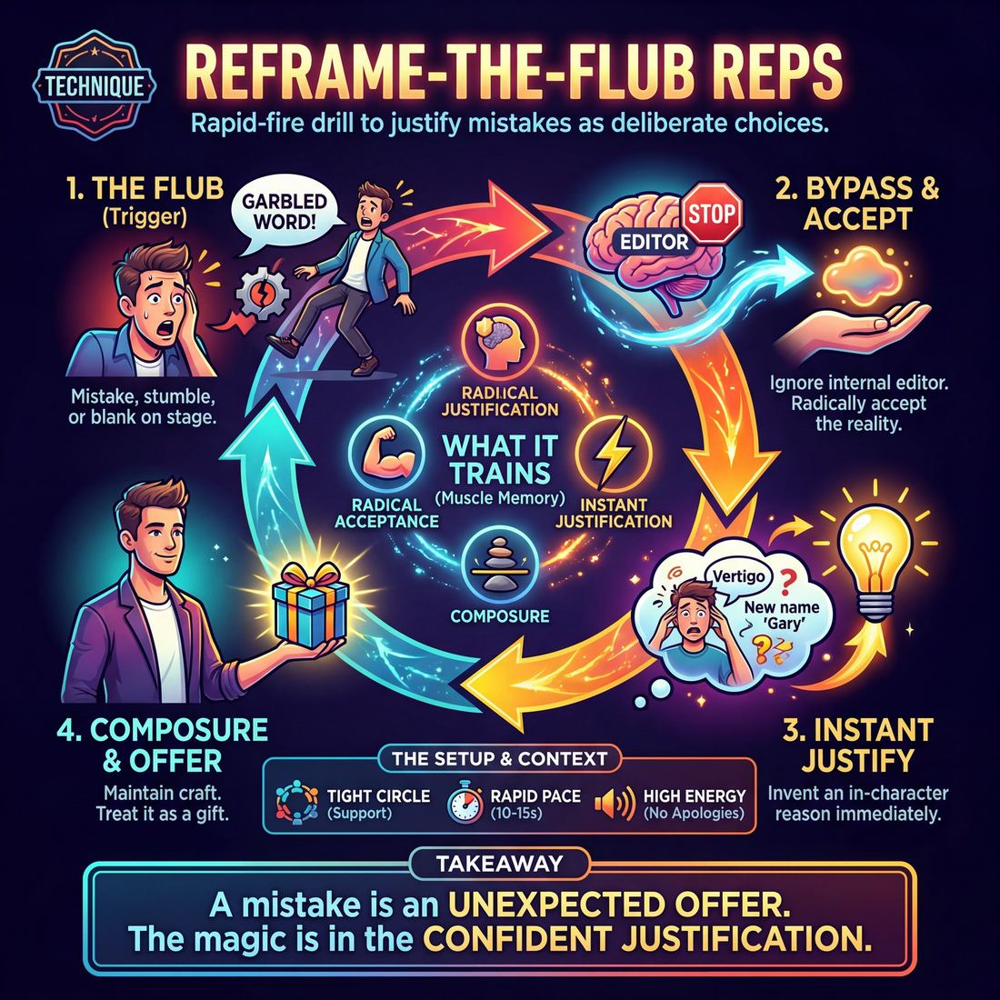

# 🎯 Reframe-the-flub reps

> *A drillable muscle that trains **Self-Recovery**.*

{ .infographic }

## 🎯 The essence

**Reframe-the-flub reps** is a rapid-fire drill where improvisers intentionally commit—or capitalize on—an on-stage mistake (such as a physical stumble, a mispronounced word, or a logical contradiction) and instantly justify it as a deliberate, brilliant choice. It isolates the exact moment of an error and forces the player to bypass their **internal editor**, training the vital muscle of **self-recovery**. By repeating this action under mild pressure, the exercise hones a single, crucial reflex: treating a moment of panic not as a failure to apologize for, but as a sudden, undeniable gift to be explored.

## 🎓 What it trains

This technique isolates and strengthens self-recovery—the ability to instantly absorb an on-stage mistake and weave it seamlessly into the reality of the scene without breaking character.

When an improviser stumbles over a word, calls a scene partner by the wrong name, or accidentally knocks over a chair, the natural human instinct is to panic. The internal editor flags the error, causing the improviser to freeze, laugh nervously, apologize out of character, or awkwardly pretend the mistake didn't happen. All of these reactions shatter the audience's suspension of disbelief and signal that the performer is no longer in control. 

By deliberately drilling the act of making and fixing mistakes, this exercise rewires the brain's panic response. It trains the improviser to bypass the editor and treat the "flub" as a deliberate, inevitable offer. Specifically, it builds three micro-muscles:

*   **Radical acceptance:** Acknowledging what *actually* happened in the physical space, rather than clinging to what was *supposed* to happen.
*   **Instant justification:** Immediately inventing a contextual reason *why* the character did or said the awkward thing, turning a glitch into a character trait or a plot point.
*   **Composure:** Maintaining physical stillness and vocal craft under pressure. Instead of dropping volume on uncertainty or rushing to fill the silence, the improviser learns to hold their ground.

!!! abstract "The Deeper Principle: Everything is an offer"
    This drill operationalizes the classic improv philosophy that "there are no mistakes." A flub is simply an unexpected offer generated by your own body or subconscious. When you train yourself to justify your own accidents, you stop fearing them—unlocking true freedom, spontaneity, and fearlessness on stage.

## 💡 Why it works

At its core, this technique acts as cognitive exposure therapy for improvisers. Human beings are socially conditioned to fear mistakes; when we stumble over a word, drop a prop, or blank on a name, our autonomic nervous system triggers a micro-panic. The natural instinct is to break eye contact, wince, or apologize—what improvisers call the **apology reflex**. 

Reframe-the-flub reps work by intercepting this threat response and rewiring it. By forcing the improviser to immediately claim the error as a deliberate character choice, the drill transforms a moment of vulnerability into an engine for discovery. 

The underlying mechanics rely on three psychological shifts:

* **Retroactive justification:** The human brain is highly adept at pattern-matching. When forced to explain *why* a character just called their wife "Gary" or tripped over a nonexistent rug, the mind instantly generates creative context to make the nonsense make sense.
* **Bypassing the editor:** In the early stages of learning, the internal editor wins under pressure, causing the improviser to freeze. By drilling the recovery, the improviser builds the muscle memory to bypass the editor entirely, moving toward a state where impulse and action are simultaneous.
* **Maintaining the base reality:** A flub only shatters the reality of the scene if the actor acknowledges it *as an actor*. By staying in character and absorbing the mistake into the scene's truth, the improviser signals to the audience and their scene partner that the reality remains unbroken.

!!! abstract "Key idea: The Alchemy of a Flub"
    A mistake on stage is simply an offer you didn't know you were making. The magic doesn't lie in the error itself, but in the speed, confidence, and commitment of the justification that follows it.

Ultimately, this drill exploits a fundamental truth of improvisation: the audience does not have a script. If an improviser treats a physical stumble as a character's sudden bout of vertigo, the audience assumes it was a brilliant, spontaneous acting choice. The drill proves to the improviser's nervous system that they are entirely safe, no matter what goes wrong.

## 🧩 The setup

To effectively build the muscle of self-recovery, the room must be physically and psychologically primed to treat mistakes as gifts rather than crises. 

*   👥 **Players & Arrangement:** 6–12 players. Form a tight, standing circle. Physical proximity is important—it creates a container of high energy and immediate support, preventing players from physically retreating or shrinking when they feel they've "failed."
*   🏟️ **Space & Materials:** An open floor with no chairs, scripts, or obstacles. No props are required. 
*   ⏱️ **Time:** 5–10 minutes total. This drill relies on a rapid, breathless pace to bypass the inner editor. Aim for about 10–15 seconds per rep.
*   🎭 **Roles:**
    *   **The Active Player:** Takes focus, speaks a line of dialogue, experiences the flub (whether organic or manufactured), and executes the reframe.
    *   **The Ensemble:** Acts as a hyper-supportive chorus. Their job is to maintain high energy, stay physically engaged, and actively celebrate the recovery.
    *   **The Coach:** Drives the tempo, provides the starting prompts (if used), and enforces a strict "no apologizing, no wincing" rule.
*   🧗 **Prerequisites:** Players should be warmed up vocally and physically. It is highly recommended to run a fast-paced word-association or gibberish warm-up right before this to loosen their tongues and lower their inhibitions.

!!! tip "Setting the room's energy"
    Because this drill directly attacks the fear of failure, the coach must establish absolute psychological safety before the first rep. If the ensemble's energy is low or judgmental, players will revert to Stage 1 habits (dropping their volume, rushing, or letting the inner editor win). Demand enthusiastic support from the sidelines.

!!! quote "How to introduce it"
    "In improv, your mistakes are your best inventions. But in the real world, our bodies are trained to freeze, apologize, or wince when we stumble. Today, we are going to rewire that reflex. 
    
    In this drill, you are going to step forward, start a sentence, and deliberately stumble over a word. Instead of correcting yourself or breaking character, you are going to instantly justify that stumble as a brilliant, intentional choice. You will reframe the flub so confidently that the audience thinks you planned it all along. 
    
    For the rest of us in the circle: when someone flubs, we don't look away. We lean in and celebrate the recovery. We are building the muscle of absolute self-trust. Let's go."

## ⚙️ The mechanics

The core objective of Reframe-the-flub reps is to eliminate the micro-second of panic that follows a mistake. By artificially injecting errors into a scene and forcing immediate justification, improvisers build the muscle memory to treat every stumble as a deliberate character choice.

Here is the step-by-step flow of the drill:

1. **Establish the Base:** Two players begin a standard, grounded scene. They should focus on clear relationship and emotional stakes, ignoring the impending drill mechanics.
2. **The Injection (The Trigger):** The coach calls out "Flub!" (or blows a whistle). 
3. **The Execution:** The player who is currently speaking or moving must immediately manufacture a mistake. This could be a verbal stumble (stuttering, using the wrong word, forgetting a name) or a physical error (tripping, dropping a prop, knocking something over). 
4. **The Reframe (The Pivot):** Without breaking eye contact or dropping character, the player who flubbed instantly justifies the error. The mistake must be framed as a symptom of their current emotional state, their relationship with their partner, or the physical environment.
5. **The Acceptance:** The scene partner accepts the new reality established by the reframe. They do not ignore the flub, nor do they mock the actor; they react to the *character's* behavior.
6. **The Continuation:** The scene proceeds for three to four more lines, integrating the new emotional or factual information generated by the reframe. 
7. **The Reset:** The coach calls "Reset," and the players either start a new scene or rotate out for the next pair.

### Rules & Constraints

To ensure the drill builds the correct muscle memory, enforce these strict boundaries:

* **No breaking the reality:** There can be no wincing, no breaking eye contact, no looking at the coach, and absolutely no laughing at the mistake. The actor must remain entirely inside the scene.
* **No "actor apologies":** The improviser cannot apologize for messing up. If the *character* apologizes, it must be deeply tied to the justification (e.g., "I'm sorry I dropped the glass, my hands haven't stopped shaking since you asked for a divorce").
* **The partner must not rescue:** The scene partner should not jump in to explain away the mistake. The player who made the flub must do the heavy lifting of the reframe.

!!! tip "On stage"
    When you hear "Flub!", don't overthink it. Just physically commit to an error. Drop your invisible coffee cup. Stumble over the word "refrigerator." The magic isn't in inventing a clever mistake; the magic is in the absolute, unwavering confidence of the justification that follows.

!!! warning "Watch out"
    A common evasion tactic is the **Deflection Reframe**, where the player blames the environment in a low-stakes way ("Whoops, slippery floor!"). Force players to make the reframe *internal* and *relational*. A dropped prop shouldn't be a slippery floor; it should be a manifestation of the character's internal anxiety or their intimidation by their scene partner.

## 🎬 Sample round

!!! example "Sample round: Verbal and Physical Reframes"
    Here is how a typical cycle of the drill sounds in practice. Notice how the improviser experiences the mistake, catches the impulse to apologize or wince, and instantly weaves the error into the fabric of the scene. 

    **Rep 1: The Verbal Mash-up**  
    *Context: Two roommates packing for a beach trip.*
    
    * **Player A:** "Did you remember to pack the *sun-brella*?"  
      *(**The Flub:** Player A accidentally combines 'sunscreen' and 'umbrella'.)*
    * **Player A:** *(Maintains eye contact and vocal projection, bypassing the inner editor)* "...Because if I get a sunburn while it's raining again, my dermatologist is going to drop me as a client."  
      *(**The Reframe:** Player A justifies the made-up word as a highly specific, real object in their world.)*
    * **Player B:** "I packed the sun-brella, yes. SPF 50 nylon."  
      *(**The Continuation:** The partner accepts the newly invented reality and the scene moves forward.)*

    **Rep 2: The Physical Stumble**  
    *Context: A dramatic entrance into a boss's office.*
    
    * **Player C:** *(Strides forward, accidentally catches their toe on the stage floor and stumbles heavily.)*  
      *(**The Flub:** A genuine physical loss of balance.)*
    * **Player C:** *(Rides the physical momentum instead of catching themselves awkwardly, dropping smoothly to one knee.)* "...And that is exactly how low I am willing to beg for this promotion, sir."  
      *(**The Reframe:** Player C uses the physical reality of the stumble to establish their character's desperation and status.)*
    * **Player D:** "Stand up, Jenkins. Your groveling is ruining the carpet."  
      *(**The Continuation:** The mistake is now a foundational piece of scene history.)*

    **Rep 3: The Contradiction**  
    *Context: A couple on a date.*
    
    * **Player E:** "Happy anniversary, *Susan*."  
      *(**The Flub:** Player E uses the wrong name; Player F established her name as 'Sarah' two lines ago.)*
    * **Player E:** *(Does not break character or drop volume on the realization)* "...I call you Susan when I'm feeling guilty. I bought the cheap champagne."  
      *(**The Reframe:** Player E turns a memory error into a character quirk and an emotional confession.)*

## 🎚️ Variations & progressions

To build the muscle of self-recovery, this drill must evolve from a mechanical, coach-driven exercise into a seamless theatrical reflex. As improvisers move through the maturity stages of spontaneity and vocal craft, the training wheels come off and the stakes get higher.

Here is how to scale the difficulty of the reps:

**1. The Prompted Flub (For Novices & Advanced Beginners)**  
At this stage, the inner editor usually wins under pressure, and improvisers tend to drop their vocal volume when uncertain. To counter this, the coach dictates the mistake. 
*   **How it works:** Two improvisers begin a mundane scene. The coach calls out specific errors: *"Call them the wrong name,"* *"Contradict your last sentence,"* or *"Drop your invisible prop."* 
*   **The focus:** The improviser must execute the flub loudly and proudly, maintaining their **vocal craft** (projecting on command) rather than shrinking, and immediately justify it.

**2. The Flub Monologue (For Competent Improvisers)**  
Once improvisers can bypass the editor under mild pressure, remove the safety net of a scene partner.
*   **How it works:** One improviser delivers a one-minute monologue. They must intentionally insert a glaring verbal stumble, mispronunciation, or logical contradiction every three sentences, weaving each one instantly into the narrative.
*   **The focus:** Continuous, rapid-fire justification. It trains the brain to treat mistakes as stepping stones rather than roadblocks.

!!! tip "When to level up"
    Move from the Monologue to Emotional Stakes when you no longer hear a "tell" in the improviser's voice. If they still pause, chuckle, or drop their volume right before or after the flub, they are still apologizing for it. Wait until their vocal energy matches the scene's content perfectly.

**3. High-Stakes Emotional Flubs (For Proficient Improvisers)**  
When impulse and action become simultaneous, the challenge shifts to **emotional fluidity**. A flub usually shocks an improviser out of their emotional state; this variation trains them to stay in it.
*   **How it works:** Assign a scene with intense emotional stakes (e.g., a bitter breakup, a tearful confession). The improvisers must organically insert flubs, but the recovery *must be driven by the emotion*, not by logic.

!!! example "In a scene"
    **The Flub:** A weeping character accidentally calls their dying father "Steve" instead of "Dad."  
    **The Novice Recovery (Drops emotion):** *(Stops crying, laughs nervously)* "I mean Dad, sorry, I have a coworker named Steve."  
    **The Proficient Recovery (Maintains emotion):** *(Cries harder)* "I'm calling you Steve because if I call you Dad right now, it makes this too real!"

**4. The Silent Recovery (For Masters)**  
At the highest level, improvisers weaponize **silence and stillness**. They do not need to immediately babble to cover up a mistake.
*   **How it works:** The improviser makes a significant physical flub (e.g., knocking over a chair, tripping over a word so badly the sentence derails). Instead of speaking, they must hold a beat of complete silence. 
*   **The focus:** Letting the character's internal, physical reaction justify the moment before any words are spoken. They hold the room with stillness, turning an accident into a masterclass in tension.

## 🧑‍🏫 Coaching notes

Your primary role during these reps is to act as the external "anti-editor." When an improviser makes a mistake, their internal editor immediately screams at them to stop, apologize, or wince. You must be louder than that internal voice, demanding that they instantly absorb the error into the reality of the scene.

!!! tip "Coaching: The Golden Cue"
    **"Make it a choice!"**  
    When a flub happens, the improviser's instinct is to treat it as an accident. Calling out "Make it a choice!" or "Why did you just do that?" forces them to instantly shift from *actor-making-a-mistake* to *character-acting-with-intent*. 

### Active Side-Coaching Cues
Keep your side-coaching sharp, immediate, and encouraging. Deliver these cues the millisecond you see the flub occur:

*   **"Stay in the body!"** — Use this when you see the physical "wince" or a drop in posture. Demand that they maintain their physical characterization even as their brain scrambles for a justification.
*   **"Keep the volume up!"** — Novices frequently drop their volume when uncertainty hits. If they mumble their recovery, prompt them to project. The justification must be delivered with the same vocal confidence as a planned line.
*   **"Feature it, don't hide it!"** — Use this when an improviser tries to quickly sweep a stutter or dropped prop under the rug. Force them to shine a spotlight on the error and make it the most important thing in the room.
*   **"Use the feeling!"** — If the actor looks genuinely startled or embarrassed by their mistake, tell them to give that exact emotion to the character. 

### What 'Good' Looks and Sounds Like
As players progress through the reps, watch for these observable markers of developing skill:

*   **Shrinking latency:** The gap between the mistake and the justification noticeably shortens. A competent improviser will bypass their editor under mild pressure.
*   **Steady eye contact:** The improviser stops looking down at the floor or glancing at you for help. They stay locked in with their scene partner.
*   **Emotional resilience:** The real-life shock, frustration, or amusement of the mistake is quickly transmuted into the character's emotional reality, serving the scene rather than breaking it.

!!! note "Pacing the Reps"
    Keep the energy in the room high and the pace relentless. If a player completely freezes, don't let them suffer in silence for too long. Call "Scene!", give them a quick, cheerful note ("Next time, tell us why your character *wanted* to drop that cup!"), and immediately throw them into the next rep. Repetition builds the muscle; dwelling on the failure kills the momentum.

## 🧭 Debrief & reflection

The debrief is where the adrenaline of the drill settles into conscious muscle memory. Because Reframe-the-flub reps intentionally trigger a player's internal editor (the part of the brain that panics at a mistake), the reflection must focus on the *feeling* of bypassing that panic and regaining control.

Use these questions to guide the post-drill discussion:

*   **"Where in your body did you feel the 'flub' happen?"**
    *   *What it surfaces:* Physical awareness. Novice players often tense their shoulders, drop their eye contact, or hold their breath when they make a mistake. Recognizing this physical "tell" is the first step to overriding it.
*   **"How did the energy of the room change the moment you justified the mistake?"**
    *   *What it surfaces:* The realization that confidence is contagious. Players usually note that the tension in the room evaporated the second they owned the error, proving that the audience (and their scene partner) cares more about the recovery than the perfection.
*   **"Which reframe felt like a chore, and which felt like a gift?"**
    *   *What it surfaces:* The difference between a panicked, logical excuse and a joyful, character-driven justification. It highlights how leaning into the reality of the scene makes recovery effortless, rather than feeling like you are "fixing" something broken.
*   **"Did anyone notice their internal editor trying to apologize?"**
    *   *What it surfaces:* The habit of breaking character to say "sorry" or grimace. Acknowledging the urge to apologize helps players consciously choose to stay in the reality of the scene instead.

!!! tip "Coach's focus"
    Listen for players expressing relief. A successful debrief often features a collective "aha" moment where improvisers realize that mistakes are not dead ends, but unexpected offers. If players are still fixating on *why* they messed up the initial prompt, gently steer them back to *how* they recovered. The flub is irrelevant; the reframe is everything.

## ⚠️ Common pitfalls

When training Reframe-the-flub reps, the brain is forced to do two things at once: generate spontaneous dialogue and instantly problem-solve an error. This spike in cognitive load frequently triggers the improviser’s internal editor, leading to a few predictable breakdowns. 

Here are the most common traps and how to coach your way out of them.

!!! warning "Watch out: The Actor's Apology"
    The improviser stumbles over a word, breaks eye contact, chuckles, and says, "Wait, I mean..." or "Sorry, let me try that again." The actor has stepped out of the scene to apologize for the mistake, shattering the reality of the moment.

    * **Why it happens:** The novice improviser wants the audience and their scene partner to know *they* are smart and just made a silly error. The ego takes over to protect the actor.
    * **The Fix:** Anchor into the character's physical reality. Remind the improviser that the *character* made the mistake, not the actor. If you stumble over a word, let the character be flustered, tired, or distracted. Train the reflex to stay in the character's eyes.

!!! warning "Watch out: The Justification Monologue"
    The improviser successfully catches the flub, but stops the scene dead to over-explain it. They deliver a paragraph of clunky backstory just to make the mistake make sense.

    * **Why it happens:** Cognitive overload. The brain is working so hard to solve the "puzzle" of the mistake that it forgets to actually play the scene. 
    * **The Fix:** Demand economy of words. A successful reframe usually requires only a single line of dialogue or a simple emotional shift. If you accidentally call your stage-wife "Gary," you don't need a monologue about your childhood friend; you just need to say, "Gary is my work-husband, Brenda, you know this." 

!!! warning "Watch out: Steamrolling"
    The improviser says something contradictory or nonsensical, realizes it, and immediately speeds up their talking to rush past the error, hoping nobody noticed.

    * **Why it happens:** Fear of failure. The improviser views the flub as a defect to be hidden rather than a gift to be opened. 
    * **The Fix:** Force the pause. When a flub happens and the improviser tries to flee the scene of the crime, the coach should ring a bell or call out, "Catch it!" Make them stop, take a breath, repeat the flubbed line with absolute confidence, and *then* justify it. 

!!! warning "Watch out: The Cognitive Freeze"
    The improviser makes a mistake, realizes it, and completely locks up. The eyes go wide, the body goes rigid, and the scene suffers a painful, empty silence while the brain reboots.

    * **Why it happens:** The gap between impulse and action is too wide. The improviser's internal editor has hit the emergency brake.
    * **The Fix:** Use the freeze. If the actor is frozen in panic, make the *character* frozen in panic. Coach them to say, "I... I shouldn't have said that out loud," or "I can't believe that just came out of my mouth." Turn the actor's genuine latency into the character's genuine realization.

## 🌟 What mastery looks like

When an improviser reaches mastery in Reframe-the-flub reps, the line between "mistake" and "deliberate offer" completely vanishes. To an observer, it appears as though the improviser is a genius who planned the error all along. The flub is no longer a hurdle to clear; it becomes the most interesting gift in the scene.

Here is what that looks like in the room:

*   **Zero latency:** There is absolutely no measurable hesitation between the flub and the reframe. The improviser does not blink, break eye contact, or take a sharp, panicked inhale. The impulse to justify happens simultaneously with the error.
*   **Total physical and vocal continuity:** The improviser maintains complete control of their instrument. They do not drop their volume, break posture, or let a micro-expression of apology cross their face. The voice remains a fully controlled instrument serving the piece.
*   **Emotional integration:** Rather than offering a clever, intellectual excuse for the mistake, the master improviser uses the flub to deepen the character's emotional reality. The mistake fuels the scene's emotional truth rather than distracting from it.
*   **Weaponized silence:** If the flub creates a jarring moment, the master does not rush to fill the void with nervous babble. They hold the room with stillness, letting the weight of the "mistake" hang in the air, forcing the audience to lean in before delivering a grounded, devastating reframe.

!!! example "In a scene"
    **The Flub:** An improviser playing a hardened detective accidentally drops their prop gun, and it visibly shatters into plastic pieces.
    
    **The Master Reframe:** They do not break character, laugh, or scramble to hide the pieces. They stare at the broken plastic in dead silence for three seconds, slowly look up at the suspect, and say with chilling, quiet intensity: *"That's right. I brought a toy. Because a punk like you isn't worth a real bullet."*

!!! abstract "The Ultimate Indicator"
    You know an improviser has mastered this technique when their scene partners *hope* they make a mistake, knowing the resulting reframe will be better than whatever was originally planned. The internal editor is entirely bypassed, and self-recovery is as natural as breathing.

## 🔗 Why it matters

At its core, improv is an art form built on the inevitability of error. Reframe-the-flub reps are the direct antidote to the improviser's most paralyzing enemy: the internal editor. By isolating and drilling the exact moment a mistake occurs, this technique builds the vital muscle of self-recovery. It trains the brain to stop viewing a mispronounced word, a dropped physical object, or a contradictory statement as a failure, and instead process it instantly as a new, highly specific offer.

This technique serves the ultimate goal of **The Self** domain: *freedom from hesitation*. Hesitation is almost always born from the fear of doing something wrong. When you have drilled your recovery reflex so thoroughly that you know you can justify any stumble, that fear evaporates. 

* **For the novice:** It provides a mechanical lifeline when the editor threatens to win under pressure, keeping the improviser in the scene rather than retreating into their own head.
* **For the master:** It eliminates the latency between impulse and offer entirely. Because there is no fear of a flub, there is no need to pre-screen ideas.

!!! abstract "The philosophical shift"
    This drill moves an improviser from *apologizing* for reality to *capitalizing* on it. A flub is simply an unplanned reality. Reframing it without breaking character is the ultimate act of agreement with the present moment.

Zooming out to the wider craft, this muscle fundamentally changes your relationship with the audience and your ensemble. Audiences do not come to improv for polished perfection; they come for the thrill of the tightrope walk. When they see an improviser confidently catch a mistake and weave it into the fabric of the scene, it creates an electric, shared joy—the audience feels like they are in on the magic trick. 

Furthermore, it builds immense trust with your scene partners. When your ensemble knows you will not shatter, freeze, or drop character when things go off the rails, they feel safe to take bigger, wilder risks alongside you.

## 📚 References & Further Reading

### Foundational sources
*   **Patricia Ryan Madson, *Improv Wisdom: Don't Prepare, Just Show Up* (2005)** — The tenth maxim of this book, "Make Mistakes, Please," directly articulates the philosophy of treating errors as gifts, bypassing the apology reflex, and taking a "circus bow" when you fail. [https://www.penguinrandomhouse.com/books/105515/improv-wisdom-by-patricia-ryan-madson/]{.ref}
*   **Keith Johnstone, *Impro: Improvisation and the Theatre* (1979)** — Johnstone's foundational text explores how the fear of failure paralyzes adults, introducing the concept of the "internal editor" and exercises designed to bypass the intellect to celebrate the "obvious" over the "clever."

### Practitioner guides & manuals
*   **Matt Besser, Ian Roberts, Matt Walsh, *The Upright Citizens Brigade Comedy Improvisation Manual* (2013)** — The definitive guide on the mechanics of "justification," detailing how improvisers must instantly provide context to make unusual or accidental actions make sense within the base reality of a scene.
*   **Mick Napier, *Improvise: Scene from the Inside Out* (2004)** — Napier extensively breaks down the paralyzing nature of the internal editor and the necessity of committing fully to whatever choice (or physical mistake) happens in the first three seconds of a scene.

### Research & theory
*   **Charles J. Limb and Allen R. Braun, "Neural Substrates of Spontaneous Musical Performance: An fMRI Study of Jazz Improvisation" (*PLoS ONE*, 2008)** — This landmark neuroscience study demonstrates that during improvisation, the brain's dorsolateral prefrontal cortex (the area responsible for conscious self-monitoring and inhibition) deactivates, while the medial prefrontal cortex (associated with self-expression) activates. [https://journals.plos.org/plosone/article?id=10.1371/journal.pone.0001679]{.ref}
*   **Peter Felsman, Colleen Seifert, Brandy R. Sinco, Joseph A. Himle, "Reducing Social Anxiety and Intolerance of Uncertainty in Adolescents with Improvisational Theater" (*The Arts in Psychotherapy*, 2022)** — Empirical research demonstrating how improv acts as a form of cognitive exposure therapy, significantly reducing participants' intolerance of uncertainty and social anxiety by forcing them to navigate unscripted, unpredictable moments. [https://doi.org/10.1016/j.aip.2022.101985]{.ref}

### Talks, videos & courses
*   **Charles Limb, "Your Brain on Improv" (*TED*, 2010)** — A highly accessible presentation of Limb's fMRI research, explaining how the brain must physically shut down its self-censoring mechanisms to generate spontaneous, uninhibited choices and recover from errors. [https://www.ted.com/talks/charles_limb_your_brain_on_improv]{.ref}

### Communities & adjacent reading
*   **John Wright, *Why Is That So Funny? A Practical Exploration of Physical Comedy* (2006)** — Explores the theatrical clowning concept of "the flop"—the moment a performer fails, and how embracing and celebrating that failure (rather than hiding it) creates a profound, comedic connection with the audience.
*   **Jacques Lecoq, *The Moving Body (Le Corps Poétique)* (1997)** — Lecoq's teachings on physical theatre and clowning emphasize how exposing the ridiculous side of human behavior—and leaning into physical vulnerability and failure—is the root of true theatrical play.

## 💬 Quotes & Anecdotes

!!! quote "— Tina Fey, *Bossypants* (2011)"
    THERE ARE NO MISTAKES, only opportunities.

!!! quote "— Patricia Ryan Madson, *Improv Wisdom* (2005)"
    Make mistakes, please. If you are not making mistakes, you are not improvising.

!!! quote "— Keith Johnstone, Improv teacher and author of *Impro*"
    Try; make mistakes; fail big and fail happily. If the audience sees you unbothered by your mistakes then they can enjoy them too, but if they see you feel humiliated and ashamed, they will be uncomfortable.

### Where it comes from
The philosophy that "there are no mistakes" is foundational to modern improvisation. It traces back to Viola Spolin, the "mother of improv," who identified what she called the "Approval/Disapproval Syndrome." Spolin observed that humans are conditioned from childhood to fear failure and seek authority's approval, causing performers to freeze, self-edit, or apologize when they stumble. 

Later, Keith Johnstone built on this by actively training improvisers to "fail happily," arguing that an audience only feels tense if the performer signals shame. The concept reached mainstream consciousness when Tina Fey codified it as a core life lesson in her 2011 memoir *Bossypants*, cementing the idea that a flub is simply an unexpected offer.

### A telling example
While Reframe-the-flub reps are a theatrical drill, the ultimate historical example of this reflex in action comes from jazz. 

In 1963, a 21-year-old Herbie Hancock was playing piano in the Miles Davis Quintet. During a live performance of the classic tune "So What," right as Davis was building up to his solo, Hancock accidentally played a completely wrong chord. 

Horrified by his own mistake, Hancock gasped, took his hands off the keys, and covered his ears. He thought he had ruined the entire performance. 

Miles Davis didn't glare at him, and he didn't stop the song. Instead, Davis paused for a second, absorbed the dissonant chord hanging in the air, and then played a masterful sequence of notes on his trumpet that resolved the tension—making Hancock's "wrong" chord sound like a brilliant, intentional choice. 

Decades later, Hancock reflected on the profound lesson of that moment: "I judged what I played; Miles didn't. Miles accepted it as something new... he felt it was his responsibility to find something that fit. You have to be able to experience situations as they are, and turn poison into medicine."

## 🧭 Explore the framework

- ⬆️ **Skill it trains:** [Self-Recovery](01_S6__self-recovery.md)
- 🎭 **Domain:** [The Self](01_D__the-self.md)
- 🔁 **Sibling techniques:** [And that's exactly what I meant](01_S6_T1__and-that-s-exactly-what-i-meant.md)
