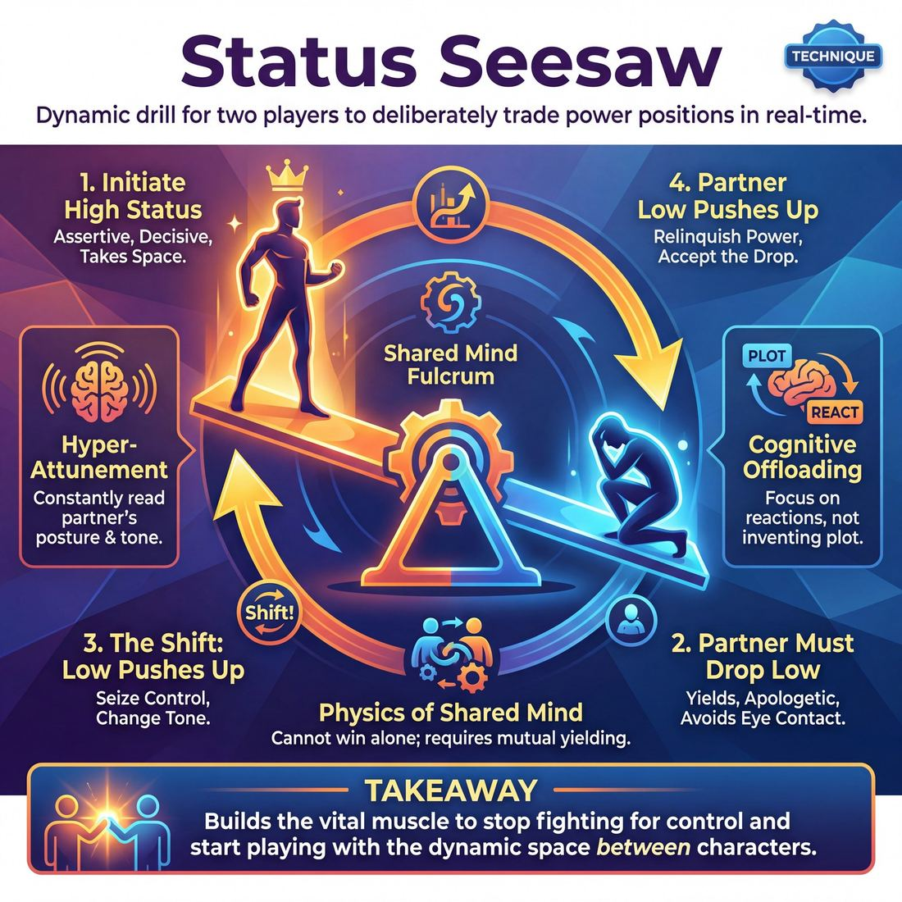

# 🎯 Status Seesaw

> *A drillable muscle that trains **Status Modulation**.*

{ .infographic }

## 🎯 The essence

The **Status Seesaw** is a dynamic two-person drill where players deliberately trade the power position back and forth throughout a scene. When one player's status rises, the other's must fall. It isolates and trains a single, vital muscle: the ability to fluidly and intentionally modulate your status in real time. By forcing improvisers to repeatedly yield and seize control, the exercise breaks the habit of getting locked into a default power dynamic and teaches players how to use shifting status to drive a relationship forward.

## 🎓 What it trains

The Status Seesaw isolates and drills the skill of **Status Modulation**—the ability to consciously raise or lower your perceived social power and importance relative to your partner. 

Left to their own devices, improvisers at the Novice stage usually play status accidentally. Under the pressure of a scene, they default to whatever feels safest. Often, this manifests as a defensive high status (arguing, blocking, or being "too cool" to care) or a collapsing low status (apologizing, avoiding eye contact, or refusing to make decisions). When two improvisers are stuck in their defaults, scenes flatline into endless bickering or polite stagnation.

This technique exists to break those defaults. It solves the problem of static characters by forcing players to experience status as a *verb* rather than a fixed noun. 

!!! abstract "The Deeper Principle: Status is Relative"
    Status does not exist in a vacuum. You cannot be "high status" on an empty stage; you can only be higher status *than your partner*. Like a physical seesaw, the movement requires two people. When your partner pushes off the ground, you must allow yourself to be lifted.

By drilling this constant push-and-pull, the Status Seesaw trains improvisers to:

*   **Decouple status from emotion:** You learn that you can be high-status and furious, or high-status and joyfully generous. Low status can be terrified, but it can also be deeply admiring.
*   **Read the partner:** You must constantly assess where your partner is on the seesaw to know where you need to be. You cannot plan your next move without looking at them.
*   **Yield control:** It builds the overarching goal of a "shared mind." You cannot play the seesaw alone; you must allow your partner's choices to physically and vocally affect your own behavior. 

Ultimately, it builds the muscle memory required to stop fighting for control and start playing with the dynamic space *between* two characters.

## 💡 Why it works

The Status Seesaw works by replacing the heavy cognitive load of inventing a plot with a simple, binary relational rule: *if they go up, I must go down.* 

By stripping away the pressure to be clever or drive a narrative, this technique exploits several powerful psychological and theatrical mechanisms:

*   **Hyper-attunement to the partner:** You cannot balance on a physical seesaw without feeling the exact weight and movement of the person on the other end. Similarly, to execute a status shift, you must acutely observe your partner in real time. You are forced to read their posture, tone, eye contact, and breath to determine exactly where they are on the status ladder so you can position yourself accordingly.
*   **Exploiting innate social wiring:** Human beings are evolutionarily hardwired to track social hierarchies. We instinctively recognize who is dominant and who is submissive in a room. By making these shifts explicit and exaggerated, the technique taps into a primal source of dramatic tension and comedy that audiences instantly understand, without needing any backstory.
*   **Shattering habitual defaults:** Every improviser has a "resting status"—a default social posture they unconsciously adopt on stage. The seesaw forces players out of their comfort zones, demanding they physically and vocally inhabit ends of the spectrum they usually avoid.
*   **Creating instant stakes:** A static relationship is stable, but a shifting relationship is inherently dramatic. The moment status begins to fluctuate, the scene gains immediate momentum. The "game" becomes the relationship itself.

!!! abstract "The Engine Under the Hood"
    The true engine of the Status Seesaw is **cognitive offloading**. When improvisers stop asking, *"What should happen next?"* and start asking, *"Who is currently on top?"*, they stop acting *at* each other and begin reacting *to* each other. The plot becomes a byproduct of the shifting power dynamic, rather than a chore the players have to invent.

!!! note "The Physics of the Shared Mind"
    Because a seesaw requires a shared fulcrum, this technique physically enforces the domain goal of a **shared mind**. You cannot "win" the seesaw alone; if one player drops their weight and the other refuses to rise, the mechanism breaks. It trains improvisers to view their partner's choices and their own reactions as a single, connected system.

## 🧩 The setup

Here is everything you need to arrange before putting the Status Seesaw into motion. Because status is highly visual and relational, the physical setup of the room matters just as much as the instructions.

*   👥 **Players & Arrangement:** Pairs. For deep learning, have one pair perform center stage while the rest of the group forms an audience to observe the micro-shifts. For a high-energy warm-up, all pairs can play simultaneously scattered around the room.
*   🛋️ **Space & Materials:** An open stage area. Have **two chairs** readily available. Sitting versus standing is a powerful, immediate tool for physical status modulation, and having chairs gives players an easy way to physically manifest a status shift.
*   ⏱️ **Time:** 2–3 minutes per round. Allocate 15–20 minutes total to allow multiple pairs to play, observe, and debrief.
*   🎭 **Roles:** 
    *   **Player A & Player B:** Two improvisers engaged in a grounded, everyday scene (e.g., two coworkers in a breakroom, two siblings cleaning a garage).
    *   **The Facilitator:** Provides a neutral starting location or relationship. During the scene, the facilitator observes the status dynamics and may occasionally call "Freeze" to ask the audience who is currently "up" on the seesaw.
*   پ **Prerequisites:** Players should already understand the basic definition of status in improv (the difference between playing high/dominant and low/submissive) and be familiar with basic physical cues like posture, eye contact, and use of space.

!!! quote "How to introduce it"
    "We are going to play a scene where your relative status is tied together on a playground seesaw. You can never be at the exact same level. If your partner raises their status—maybe they stand up, take up more space, or speak with absolute certainty—you must immediately lower yours to balance the board. If they drop their status by apologizing, hesitating, or shrinking, you must rise. Don't force it all at once; let the scene breathe, but keep that seesaw constantly, gently moving."

!!! tip "On stage"
    When setting up the scene, give the players a **shared physical activity** (like folding laundry or fixing a tire). A shared task gives them something to focus on other than each other, which makes the eye contact—and the resulting status shifts—much more potent when it actually happens.

## ⚙️ The mechanics

The core objective of the Status Seesaw is to practice fluid, intentional shifts in power dynamics. Rather than locking into a single status for an entire scene, players actively trade the "high" and "low" positions back and forth, ensuring that when one player's status rises, the other's falls. 

### The Core Loop
The engine of this technique is the **Status Gap**—the relative distance in power, confidence, or importance between two characters. The loop requires one player to initiate a shift that alters this gap, and the partner to immediately, physically, and vocally accommodate that shift. 

### Flow of Play
1.  **Establish the Baseline:** Two players begin a scene with a clearly defined status gap. One player adopts a high-status posture and attitude; the other adopts a low-status position. They play this baseline for three to four lines to ground the scene.
2.  **The Trigger:** One player makes a deliberate move to invert the dynamic. The low-status player might suddenly assert dominance (a **Status Grab**), or the high-status player might reveal a vulnerability or make a mistake that drops their status (a **Status Drop**).
3.  **The Yield:** This is the crucial mechanical step. The partner *must* accept the new reality. If Player A raises their status, Player B must immediately lower theirs to maintain the seesaw effect. 
4.  **The Reversal:** Once the new dynamic is established and played for a few lines, the newly low-status player finds a justification to claw back the high-status position, triggering the seesaw to tip back the other way.
5.  **Repeat:** The cycle continues, with the status flipping back and forth.

!!! warning "Watch out: Arguing vs. Seesawing"
    A common mechanical error is confusing a status shift with an argument. If both players try to play high status simultaneously, the seesaw breaks—you just have two people yelling. The technique only works if the **Yield** happens. When your partner goes up, you *must* go down.

### Rules & Constraints
*   **Physicality leads:** Status is a full-body mechanic. Shifts must be visible in posture, eye contact, breathing, and use of space *before* or *as* they are spoken.
*   **No blocking the shift:** If your partner plays a move that lowers your status (e.g., pointing out a stain on your shirt, or catching you in a lie), you must let it affect you. You cannot brush it off to protect your ego.
*   **Justify the movement:** The shift must make sense within the reality of the scene. A sudden burst of confidence needs a trigger, just as a sudden loss of nerve does.

!!! tip "On stage: The Physical 'Tell'"
    Give your character a physical "tell" for when their status drops—breaking eye contact, touching their neck, or shrinking their shoulders. This makes the **Yield** instantly readable to your partner, saving you from having to explain the shift through dialogue.

### Ending and Resetting
A round typically runs for 2 to 3 complete cycles (4 to 6 total shifts). The coach calls "Scene" or "Reset" once the players have successfully demonstrated the ability to fluidly trade the high and low positions without dropping the reality of the scene. To reset, clear the stage and bring up two new players with a completely different baseline relationship.

## 🎬 Sample round

Here is how a typical round of Status Seesaw plays out in practice. In this example, the players are shifting their status organically to keep the scene moving, demonstrating how physical and verbal offers work together to tilt the balance of power.

!!! example "Sample round: The Presentation"
    **The Setup:** Alex and Blair are coworkers preparing for a big meeting. They have been instructed to let the status "seesaw" back and forth every few lines.

    | Beat | Dialogue & Physicality | The Seesaw Shift |
    | :--- | :--- | :--- |
    | **1** | **Alex:** *(Standing tall, pointing)* "I need those slides formatted by noon, Blair. No excuses this time."  **Blair:** *(Hunching slightly, looking at shoes)* "Right away. I'm so sorry about yesterday, I'll get right on it." | **Alex is High / Blair is Low.** Alex establishes dominance through taking up space and making demands. Blair accepts the low status by shrinking, breaking eye contact, and apologizing. |
    | **2** | **Blair:** *(Notices the screen, stands up straighter)* "Wait... you used the old Q3 data? If I format this, the board will laugh you out of the room."  **Alex:** *(Deflating, touching neck)* "Oh god, did I? Please tell me you have the updated spreadsheet." | **Blair goes High / Alex goes Low.** Blair uses a discovery to seize the high ground, elevating their posture and holding a steady gaze. Alex yields immediately, displaying physical vulnerability (touching the neck) and pleading. |
    | **3** | **Alex:** *(Recovering posture, stepping into Blair's space)* "Actually, that was a test. To see if you were paying attention. Good catch. Now fix it."  **Blair:** *(Dropping shoulders, sighing)* "Oh. Right. Yes, sir. Fixing it now." | **Alex goes High / Blair goes Low.** Alex reclaims the high status by reframing the mistake as a deliberate test, moving into Blair's space. Blair accepts the new reality, dropping their physical status back down and yielding. |

!!! note "Notice the mechanics"
    The shifts in this scene don't happen by magic; they are driven by **observable actions**. The players use posture (standing tall vs. hunching), eye contact, spatial dominance, and vocal tone to clearly signal to their partner—and the audience—exactly where the seesaw is currently resting.

## 🎚️ Variations & progressions

To build the muscle of Status Modulation, the Status Seesaw can be scaled from broad, cartoonish physical exercises to highly nuanced, subtextual scene work. By adjusting the constraints, you can guide players from blunt, assigned roles to fluid, invisible power dynamics.

Here is how to ramp the difficulty, aligned with the improviser's maturity:

*   **The Physical Seesaw (Novice to Adv. Beginner)** 
    Strip away the pressure of dialogue. Players use only posture, height, and use of space. If Player A puffs out their chest and steps forward, Player B must physically shrink, avert their eyes, or retreat. 
    *Goal:* Moves players from accidental status to deliberately playing assigned high or low physical states.

*   **The Numbered Seesaw (Adv. Beginner)** 
    Players call out a number from 1 (lowest) to 10 (highest) before they speak their line. The rule: the two numbers must always add up to 11. If Player A says, *"Status 8: Get me my coffee,"* Player B must immediately adopt the complement: *"Status 3: Right away, sir."* 
    *Goal:* Forces explicit awareness of the gap between partners.

*   **The Title Trap / Master-Servant Inversion (Competent)** 
    Assign rigid societal roles (e.g., a Queen and a Peasant). The challenge is to completely invert the *behavioral* status by the end of the scene while keeping the societal titles intact. The Peasant must become the high-status driver, and the Queen the low-status follower.
    *Goal:* Trains players to pick status behaviors that fit—and eventually subvert—the established relationship.

!!! example "In a scene: The Title Trap"
    **Queen (High societal, shifting to Low behavioral):** "Peasant, polish my boots."
    **Peasant (Low societal, shifting to High behavioral):** *(Sighs, doesn't look up)* "Put them on the floor, Your Majesty. I'll get to them when I finish my tea."
    **Queen:** *(Hesitates, places them gently)* "Oh. Right. Sorry to interrupt."

*   **The Silent Seesaw (Proficient)** 
    A scene played entirely in silence or gibberish. The seesaw must be communicated purely through eye contact, proximity, breath, and the speed of movement. 
    *Goal:* Teaches players to shift status fluidly to drive the story without relying on clever dialogue.

*   **The Micro-Shift (Master)** 
    Play a completely grounded, realistic scene (e.g., two friends folding laundry). The seesaw still operates, but the shifts are microscopic: a slight sigh, a glance away, a pause before answering, or taking up just an inch more space. 
    *Goal:* Status play becomes purposeful and unnoticed by the audience, feeling entirely like natural human behavior.

!!! tip "On stage: The 'Sticky' Seesaw"
    A common variation to build tension is the **Sticky Seesaw**. Instead of immediately dropping when your partner raises their status, you resist. You hold your high status for two or three lines, creating a brief, high-stakes clash before finally yielding and dropping down. This teaches improvisers that the seesaw doesn't have to be instantaneous to be effective.

## 🧑‍🏫 Coaching notes

As the coach, your role in this exercise is to act as the fulcrum. You are watching for the clarity of the power dynamic and the exact moment the weight shifts. Early on, players will likely rely on arguing or volume to change status; your side-coaching should push them toward physical, spatial, and psychological adjustments.

!!! tip "Coaching: The Golden Cue"
    **"Let them change you."**  
    The most common mistake in the Status Seesaw is players shifting their status internally, for no reason, just because it's "time to switch." Side-coach them to find the **trigger** in their partner's offer. The seesaw doesn't move on its own; one person's weight (a compliment, a threat, a sudden vulnerability) must push the other person up or down. 

### What to side-coach

Use short, active prompts to adjust players while they are in the scene. Target specific behaviors rather than abstract concepts:

**To clarify the current dynamic:**
*   *"Show me high status in your spine."*
*   *"Lower your status using only your eyes."*
*   *"Who owns the room right now? Make it obvious."*
*   *"High status, still your hands. Low status, touch your face or neck."*

**To guide the transition (the seesaw):**
*   *"Find the pivot."* (Use when a scene is stuck in a static high/low dynamic).
*   *"Let that line land, now drop your status."*
*   *"Give away your power on this next line."*
*   *"Don't rush the flip. Live in this dynamic for three more lines."*

### What 'good' looks and sounds like

When the Status Seesaw is working well, you will observe a highly responsive, almost choreographed physical and vocal dance between the two players. Look for these markers of success:

*   **Physical contrast:** The players' bodies are doing opposite things. When one player expands their chest and takes up space, the other instinctively contracts, rounds their shoulders, or steps back. 
*   **Vocal contrast:** One player speaks in smooth, uninterrupted statements with a steady pitch; the other uses filler words, hesitates, or allows their pitch to rise at the end of sentences.
*   **Justified transitions:** The shifts make narrative sense. A high-status boss drops to low status because they spill coffee on their shirt; the low-status employee rises to high status by calmly handing them a napkin and taking control of the meeting.
*   **Shared breathing room:** The players don't frantically flip back and forth every single line. They establish a clear high/low dynamic, let the audience recognize it, and *then* execute the shift.

!!! warning "Watch out for the 'Status Battle'"
    If both players try to play high status at the same time, the scene will immediately devolve into a shouting match. If you see this happening, intervene directly: **"Someone lose the fight!"** Remind them that the exercise is a seesaw, not a tug-of-war.

## 🧭 Debrief & reflection

A strong debrief for the Status Seesaw moves players away from judging whether a scene was "funny" and focuses their attention entirely on the physical and emotional mechanics of Status Modulation. The goal is to make the invisible dynamics of power and submission conscious and observable.

Use these targeted questions to guide the post-round discussion:

*   **"Which direction on the seesaw felt more comfortable for you?"** 
    *   *What to listen for:* Most improvisers have a default status they rely on when nervous. Surfacing this helps players realize when they are playing a habitual status rather than making a deliberate choice.
*   **"Where did you feel the status shift in your body?"**
    *   *What to listen for:* Players should recognize that status is deeply physical. Look for answers about eye contact breaking, shoulders dropping, taking up more space, or changes in breathing and vocal pitch.
*   **"Did the seesaw ever get 'stuck'?"**
    *   *What to listen for:* The seesaw stalls when both players fight for the exact same status (e.g., both aggressively competing for high status, or both aggressively apologizing for low status). This highlights that status is a *relationship*, not an isolated trait.
*   **"How did it feel when your partner deliberately lowered their status to raise yours?"**
    *   *What to listen for:* Players often realize that having their status raised by a partner feels like a massive gift. It builds trust and makes the scene feel effortless.

### What a good debrief surfaces

When the debrief is effective, players will arrive at a few core realizations. First, they will notice that **lowering your own status is often the fastest way to raise your partner's**. You don't always have to praise them; you can simply yield space, break eye contact, or defer to their judgment. 

Second, they will recognize the difference between *playing an emotion* and *playing a status*. A character can be furiously angry (high emotion) but still be entirely submissive to their boss (low status). 

!!! abstract "Key idea: The Pivot Point"
    A successful debrief should illuminate the "pivot"—the exact moment the power dynamic flips. Players will realize that the most compelling moments in a scene aren't when someone *is* high or low status, but the precise second the status *changes*. The seesaw is about the movement, not the destination.

!!! tip "On stage"
    Remind players to "shake off" the exercise physically after the debrief. Status play, especially extreme high or low status, can leave an emotional residue. A quick physical shake-out ensures the dynamic stays in the exercise and doesn't bleed into the ensemble's real-world interactions.

## ⚠️ Common pitfalls

Because the Status Seesaw requires players to consciously manipulate their behavior while simultaneously listening and reacting, it places a heavy cognitive load on the improviser. When that load becomes too much, the technique tends to break down in a few predictable ways. 

Here are the most common behavioral traps novices fall into, and how to course-correct.

!!! warning "Watch out: The Tug-of-War (or The Race to the Bottom)"
    **The Trap:** Instead of a seesaw, the scene becomes a fight. When Player A raises their status, Player B feels defensive and raises theirs to match. Conversely, both players might aggressively try to out-lower each other, resulting in two people groveling on the floor fighting to be the most pathetic. 
    
    **The Fix:** Remind players of the physics of a seesaw: it only works if one side yields to the other. The goal is not to "win" the status interaction, but to **modulate** in direct response to the partner. If your partner goes up, you *must* go down to keep the game alive.

!!! warning "Watch out: Equating Status with Volume or Anger"
    **The Trap:** Novices frequently conflate high status with being loud, mean, or bullying, and low status with being fearful, sad, or whispering. This leads to one-note, emotionally exhausting scenes that feel abusive rather than playful.
    
    **The Fix:** Separate status from emotion. Challenge the improvisers to play high status while being incredibly kind and quiet (think of a serene, benevolent monarch). Challenge them to play low status while being ecstatic and loud (think of a wildly enthusiastic fan meeting their idol). 

!!! warning "Watch out: Shifting in a Vacuum"
    **The Trap:** An improviser decides it is "their turn" to take high status, so they deliver a high-status line that completely ignores what their partner just said or did. They are playing the mechanic, not the scene, breaking the illusion of a shared reality.
    
    **The Fix:** The status shift must be a *reaction*. Coach players to let their partner's move physically impact them. If the partner puffs up their chest, the improviser should let that visual cue physically push their own shoulders down before they even speak.

!!! warning "Watch out: Verbal Paralysis"
    **The Trap:** Under pressure to execute the drill, a novice gets pulled into their own head, desperately trying to script the "perfect" high-status or low-status line. They freeze, drop eye contact, and the scene stalls.
    
    **The Fix:** Lead with the body, not the brain. If a player is stuck, tell them to change their posture first. Have them take up more space, lift their chin, or break eye contact. The physical shift will naturally trigger the right words without the need for conscious scripting.

## 🌟 What mastery looks like

When improvisers reach the highest level of this technique, the mechanical nature of the "seesaw" vanishes. You no longer see two actors playing a transparent game of "high and low"; instead, you witness a dynamic, breathing relationship where power and vulnerability flow naturally between them. At the master level, status play is purposeful and unnoticed.

Here is what you will observe when the Status Seesaw is executed brilliantly:

*   **Micro-calibrations:** Instead of broad, cartoonish choices (like standing on a chair to be "high" or cowering on the floor to be "low"), masters use microscopic adjustments. A slight drop in vocal pitch, a prolonged blink, a stillness in the hands, or a subtle shift in weight is enough to tip the seesaw.
*   **Frictionless response:** The connection between the partners is absolute. The moment Player A yields a fraction of an inch of status, Player B instinctively fills that space. There is no lag, no conscious calculation, and no fighting the premise; they share a single, connected rhythm.
*   **Emotional justification:** The shifts in status are deeply rooted in the reality of the scene. A player doesn't drop status simply because it's "their turn" in the drill; they drop status because they allowed their partner's line to genuinely affect their character.
*   **Fluidity across vectors:** Masters don't just play social or situational status (e.g., boss vs. employee); they seamlessly weave in physical, intellectual, and emotional status. They might play high in one vector while simultaneously playing low in another, creating rich, three-dimensional characters.

!!! example "In a scene"
    **Player A (High social, dropping emotional):** *(Standing tall, adjusting a cufflink)* "I told you the merger is finalized. There's nothing more to discuss." *(Voice catches slightly, breaks eye contact)* "Unless... you're actually leaving?"
    
    **Player B (Low social, rising emotional):** *(Slouched, holding a cardboard box)* "I packed my desk an hour ago." *(Slowly straightens up, meets A's eyes with a soft, steady gaze)* "You don't need me anymore, David. But you're going to miss me."
    
    *The seesaw tips flawlessly. Player A's armor cracks, lowering their emotional status, while Player B steps into the power vacuum with quiet, grounded confidence.*

Ultimately, mastery of the Status Seesaw looks like compelling, effortless human interaction. The drill has been fully absorbed into the improviser's muscle memory, allowing them to modulate status instinctively to drive the story and elevate their partner.

## 🔗 Why it matters

The Status Seesaw is the foundational gym for developing Status Modulation. By isolating the act of raising and lowering status, it transforms an abstract theatrical concept into a tangible, observable muscle. Novice improvisers often project status accidentally, or get locked into a single comfortable mode (always the victim, always the boss). This technique breaks that rigidity, training the body and voice to shift fluidly and purposefully.

In the domain of partnership, our ultimate goal is to move from merely "acting with someone" to achieving a shared mind. The seesaw is the perfect vehicle for this because status is inherently relational. 

!!! abstract "Key idea: Status is a tether"
    You cannot play high or low status in a vacuum; your status only exists in proportion to your partner's. The seesaw forces players to constantly calibrate against each other. If they go up, you must go down. This creates an invisible tether between players, demanding hyper-listening and deep mutual awareness.

Zooming out to the wider craft, mastering this seesaw dynamic unlocks the underlying physics of scene work. Status shifts are the engine of narrative and relationship:

*   **Comedy** thrives on status gaps and sudden reversals. The arrogant expert (high status) who confidently gives the wrong answer (low status) is a classic comedic seesaw.
*   **Drama** is fueled by status battles. Two characters fighting for the upper hand, or a character desperately trying to maintain their dignity while being lowered, creates instant theatrical tension.
*   **Connection** is built on status matching. When characters deliberately lower their own status to match a vulnerable partner, it creates profound moments of intimacy and empathy.

Ultimately, the Status Seesaw teaches improvisers that they are never just delivering lines. Every interaction is a negotiation of space, power, and relationship. When this muscle becomes instinctive, improvisers stop worrying about *what to say* and start focusing on *what they are doing to their partner*—which is where the best scenes live.

## 📚 References & Further Reading

### Foundational sources
*   **Keith Johnstone, *Impro: Improvisation and the Theatre* (1979)** — The undisputed foundational text for this concept; Johnstone explicitly coined the "seesaw principle" of status ("I go up and you go down") and decoupled it from social class. 

### Practitioner guides & manuals
*   **Tom Salinsky & Deborah Frances-White, *The Improv Handbook: The Ultimate Guide to Improvising in Comedy, Theatre, and Beyond* (2008)** — Contains extensive practical breakdowns of Johnstone's status work, including master-servant games and the mechanics of the status seesaw. [Bloomsbury](https://www.bloomsbury.com/us/improv-handbook-9781350026148/)
*   **Patti Stiles, *Improvise Freely: Throw away the rulebook and unleash your creativity* (2021)** — Written by a Johnstone student and Loose Moose Theatre veteran, this guide expands on playing status dynamically and breaking the rigid "rules" of improv. [Goodreads](https://www.goodreads.com/book/show/58784822-improvise-freely)
*   **Theresa Robbins Dudeck, *Keith Johnstone: A Critical Biography* (2013)** — The definitive scholarly look at Johnstone's lineage, detailing the exact origins and development of his theories on status and human interaction. [Bloomsbury](https://www.bloomsbury.com/us/keith-johnstone-9781408183274/)

### Lineage & teachers
*   **Keith Johnstone & Mel Tonken, *Loose Moose Theatre Company* (1977)** — The Calgary-based theatre that served as the primary laboratory where the Status Seesaw and other foundational status exercises were developed, tested, and refined. [loosemoose.com](https://www.loosemoose.com/)
*   **Keith Johnstone, *International Theatresports Institute* (1998)** — The global network established to oversee Johnstone's formats and connect teachers who continue to study and teach his ground-breaking work on status. [impro.global](https://www.impro.global/)

### Research & theory
*   **Desmond Morris, *The Naked Ape* (1967)** — The ethological foundation for Johnstone's status work; Johnstone explicitly credits Morris's observations of animal dominance and submission hierarchies as the inspiration for his theatrical status theories.
*   **Timothy Leary & Jerry Wiggins, *The Interpersonal Circumplex* (1957/1979)** — A foundational psychological model mapping human interaction on two orthogonal axes: Agency (Dominance/Submission) and Communion (Warmth/Hostility), where the vertical axis perfectly maps to the mechanics of the Status Seesaw. [Wikipedia](https://en.wikipedia.org/wiki/Interpersonal_circumplex)
*   **Judith A. Hall, Erik J. Coats, & Lavonia Smith LeBeau, *Nonverbal behavior and the vertical dimension of social relations: a meta-analysis* (2005)** — A massive meta-analysis published in the *Psychological Bulletin* on how dominance, power, and status are communicated nonverbally through posture, gaze, space, and touch—the exact physical cues trained by the Status Seesaw. [APA PsycNet](https://doi.org/10.1037/0033-2909.131.6.898)

### Talks, videos & courses
*   **Keith Johnstone, *Don't Do Your Best* (2016)** — Johnstone's TEDxYYC talk where he discusses his overarching philosophy on improvisation, including how the "seesaw" dynamic of human interaction drives compelling scenes. [TEDxYYC](http://tedxyyc.ca/talks/keith-johnstone/)
*   **Theresa Robbins Dudeck & Alicia Robbins, *On Keith: Artists Speak on Johnstone & Impro* (2020)** — A YouTube docuseries featuring interviews with international artists and original Theatre Machine members discussing how Johnstone's methods, including status, support their creative processes. [onkeith.com](https://www.onkeith.com/)

## 💬 Quotes & Anecdotes

!!! quote "— Keith Johnstone, *Impro: Improvisation and the Theatre* (1979)"
    We soon discovered the 'see-saw' principle: 'I go up and you go down.'

!!! quote "— Keith Johnstone, *Impro: Improvisation and the Theatre* (1979)"
    Status is a confusing term unless it's understood as something one does. You may be low in social status, but play high, and vice versa.

!!! quote "— Keith Johnstone, *Impro: Improvisation and the Theatre* (1979)"
    Suddenly we understood that every inflection and movement implies a status, and that no action is due to chance, or really 'motiveless'.

!!! quote "— Keith Johnstone, *Impro: Improvisation and the Theatre* (1979)"
    Normally we are 'forbidden' to see status transactions except when there's a conflict. In reality status transactions continue all the time.

### Where it comes from

The concept of the "Status Seesaw" (originally the "see-saw principle") was coined by legendary British theatre director and improv pioneer Keith Johnstone. He introduced it in his seminal 1979 book, *Impro: Improvisation and the Theatre*. 

While teaching at the Royal Court Theatre Studio in the 1960s, Johnstone noticed that his actors' improvised scenes felt dull and lifeless compared to real human interaction. He realized that in real life, people are constantly negotiating their relative social power. He instructed his students to try playing their status just a fraction above or below their partner's. The scenes instantly became authentic. Johnstone observed that status in a scene functions like a physical seesaw: it is a zero-sum transaction where raising your own status inherently lowers your partner's, and lowering your own status raises theirs.

### A telling example

In *Impro*, Johnstone provides a classic, simple example of how the seesaw tips based on a single line of dialogue. 

Imagine Person A enters a room and asks, "What are you reading?" 
Person B replies, "War and Peace." 

Merely stating they are reading such a famously difficult book gives Person B a slight status boost. The seesaw tips in their favor. 

If Person A responds, "Ah! That's my favorite book!", Person A immediately seizes the high status. They imply they have read the massive book multiple times, cutting Person B back down to size. 

However, if Person A instead responds, "I've always wanted to read that," they deliberately lower their own status. By admitting their own lack of follow-through, Person A pushes their end of the seesaw down, which inherently lifts Person B up, validating B's cultural achievement. 

Johnstone also illustrates the innate human wiring of the seesaw with a real-world theatre anecdote: "Walk into a dressing-room and say 'I got the part' and everyone will congratulate you, but will feel lowered. Say 'They said I was too old' and people commiserate, but cheer up perceptibly."

## 🧭 Explore the framework

- ⬆️ **Skill it trains:** [Status Modulation](02_S2__status-modulation.md)
- 🎭 **Domain:** [The Partner](02_D__the-partner.md)
- 🔁 **Sibling techniques:** [High/low-status walks](02_S2_T2__high-low-status-walks.md)
