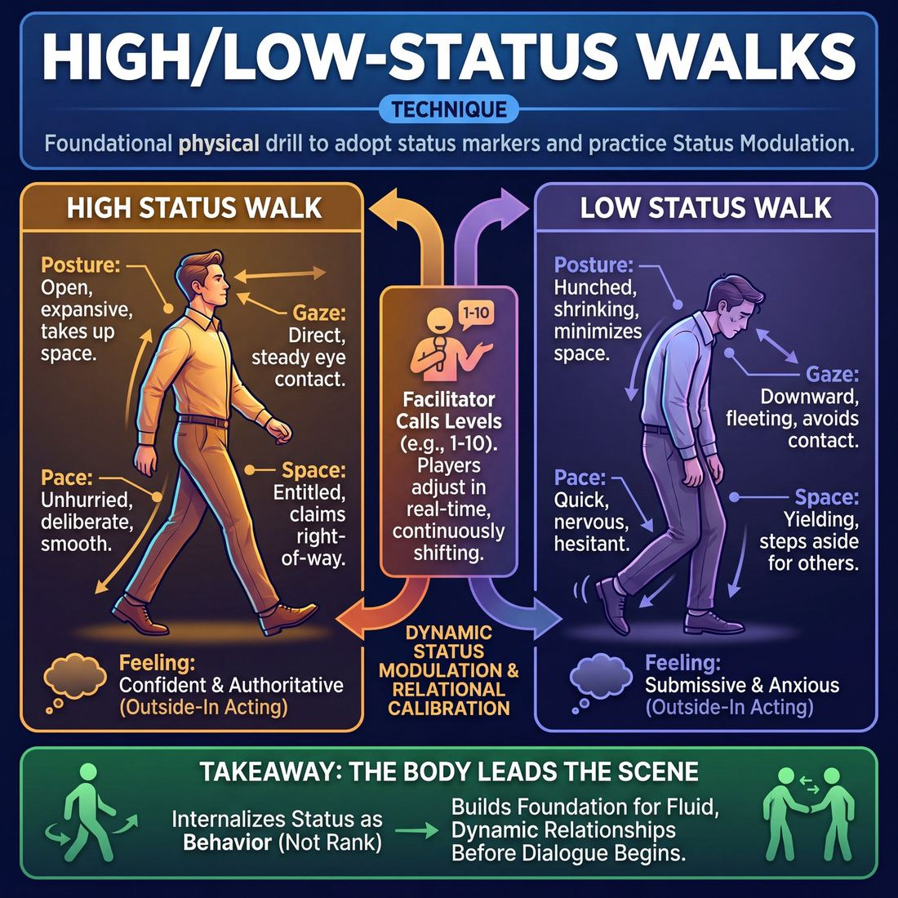

# 🎯 High/low-status walks

> *A drillable muscle that trains **Status Modulation**.*

{ .infographic }

## 🎯 The essence

**High/low-status walks** are a foundational physical drill where improvisers move through a shared space while deliberately adopting the physical markers of either high or low social status. By adjusting elements like posture, eye contact, pace, and spatial entitlement, players isolate and practice a single, crucial skill: **Status Modulation**. The exercise strips away dialogue and narrative, forcing the improviser to consciously control the physical weight and importance they project—turning an unconscious, everyday habit into a deliberate, playable tool.

## 🎓 What it trains

This technique isolates and drills the ability to deliberately adjust your relative power, confidence, and vulnerability in a scene. 

For many improvisers, especially at the **Novice** stage, status is entirely accidental. They default to their everyday, polite "middle status," or they try to play status purely from the neck up—using clever dialogue or aggressive volume while their bodies remain stiff, neutral, and disconnected. 

This drill solves the "talking head" problem by forcing the body to lead. By isolating the simple act of walking, improvisers learn that status is a physical reality before it is a spoken one. Specifically, it trains:

*   **Embodied character:** Building the muscle to let posture, gait, and eye contact dictate a character's internal state. When you change how you walk, your brain automatically changes how you feel.
*   **Breaking the default:** Forcing improvisers out of their comfortable, habitual ways of moving through space, expanding their physical range.
*   **Relational awareness:** Teaching the body that status only exists in relation to **The Partner**. How much space do you take up? Do you yield the right-of-way, or do you force others to step aside? 

!!! abstract "The Deeper Principle: Status is behavior, not rank"
    A common trap in improv is confusing status with social hierarchy (e.g., assuming a boss is always high status and an employee is always low). This drill teaches that status is something you *do*, not something you *are*. A janitor can walk through a room with absolute, unbothered high status, while a CEO can scurry with nervous, low-status energy. The walk trains the physical behavior, divorcing it from the societal label.

Ultimately, this drill builds the foundation for fluid, dynamic scenes. Once an improviser can consciously control their physical status, they can begin to shift it purposefully to drive the story, rather than being trapped in the physical habits they walked in with.

## 💡 Why it works

This technique is highly effective because it bypasses the improviser’s intellect and taps directly into our primal, pre-verbal understanding of social hierarchy. Status is not fundamentally about what a character *says*; it is about how much space they take up, how they hold their tension, and where they direct their gaze. 

By isolating the physical act of walking, this exercise exploits three powerful mechanisms:

*   **Embodied Cognition (Outside-In Acting):** The brain takes cues from the body. When an improviser physically shrinks, lowers their gaze, and quickens their pace, their internal emotional state naturally shifts toward submissiveness or anxiety. Conversely, expanding the chest and moving with smooth, unhurried purpose triggers internal feelings of confidence and authority. The walk proves that you do not need to "feel" high or low status to play it—you just need to move like it.
*   **Cognitive Offloading:** Novice improvisers often suffer from accidental status because their mental bandwidth is entirely consumed by planning their next line of dialogue. By stripping away the pressure to invent a narrative or speak cleverly, the brain is freed to focus entirely on physical presence and spatial awareness.
*   **Relational Calibration:** Status does not exist in a vacuum; it is a seesaw. You can only be high status if someone else is lower. A crowded room of improvisers walking together creates a dynamic, shifting ecosystem. To maintain a specific status level, a player must constantly observe and react to the changing physical offers of everyone else in the space.

!!! tip "On stage"
    When improvisers internalize this mechanism, they stop trying to "write" their character's status through witty dialogue. Instead, they learn to enter a scene with a distinct physical walk, letting their body dictate the relationship before a single word is spoken.

## 🧩 The setup

Here is everything you need to arrange before putting the ensemble on their feet. This exercise requires no props, but it does require a clear physical environment and a shared understanding of the terms.

*   **Players & Group Size:** The full ensemble (ideally 6 to 16 players). Everyone works simultaneously. 
*   **Arrangement:** Players begin scattered around the room, standing neutrally. 
*   **Space & Materials:** A completely cleared floor. Push all chairs, bags, and obstacles to the edges of the room. Because players will be altering their eye contact—sometimes staring at the floor—a safe, unobstructed walking space is critical. 
*   **Time:** 5 to 10 minutes total. The exercise flows continuously without distinct "rounds," driven by the facilitator's real-time prompts.
*   **Roles:** 
    *   **The Facilitator:** Acts as the caller, dictating status levels (usually on a scale of 1 to 10) and offering side-coaching on physicality.
    *   **The Players:** Walk the room, continuously adjusting their posture, pace, gaze, and breath to embody the called status.
*   **Prerequisites:** Players must understand the distinction between behavioral status and societal rank, as outlined above.

!!! example "How to introduce it"
    "We are going to explore how status lives in the body. In a moment, I’ll ask you to start walking around the room at a neutral, everyday pace. As you walk, I am going to call out numbers from 1 to 10. 
    
    10 is the highest status imaginable—you own this room, you are completely unbothered, and you take up space effortlessly. 1 is the lowest status—you are practically apologizing for breathing the air, trying to be invisible. 
    
    When I call a number, don't stop walking. Just let your spine, your eye contact, your breathing, and the rhythm of your walk shift to match that number. Don't 'act' a character; just let the status change your body."

!!! warning "Watch out"
    Before starting, explicitly remind players to maintain peripheral awareness. When playing low status (levels 1–3), improvisers tend to drop their heads and look at their shoes, which can lead to collisions.

## ⚙️ The mechanics

The core loop of the exercise moves players from a neutral baseline into extreme physical embodiments of status, layering in spatial and verbal interaction step-by-step. 

### The Flow of Play

1. **The Baseline (Neutral Walk):** Players begin walking randomly around the room. The goal is **neutrality**—a state of physical readiness without applied character, emotion, or status. Players fill the empty space, keeping a steady, natural pace with relaxed eye contact.
2. **The Physical Shift:** The coach calls out a specific status direction (e.g., "Shift into high status" or "Play a 2 on a scale of 1 to 10"). Players immediately alter their physicality while continuing to walk. 
3. **Spatial Negotiation:** As players cross paths, they must let their physical status dictate how they share space. They do not stop walking, but they must negotiate who yields the right-of-way based entirely on their current status level.
4. **The Verbal Layer:** The coach instructs players to add a simple, single-word greeting ("Hello" or "Morning") as they pass one another. Players must allow their physical status to alter the pitch, volume, and cadence of their voice.
5. **The Reset:** The coach calls "Shake it out" or "Return to neutral." Players drop the physical affectations, shake off the tension, and resume a neutral walk before the next prompt.

!!! tip "On stage: The physical levers of status"
    To make the mechanics runnable, players must manipulate specific physical levers:
    
    *   👑 **High Status:** Keep the head perfectly still when speaking or looking. Sustain eye contact slightly longer than is comfortable. Move smoothly and unhurriedly. Take up maximum space. Expect others to move out of your path.
    *   🙇 **Low Status:** Keep the head moving (nodding, darting). Break eye contact quickly, looking down or away. Move with jerky, hurried, or hesitant steps. Protect the body (touching the face/neck, crossing arms). Yield space immediately.

### Rules & Constraints

* **Play the behavior, not the character:** Players should not invent a backstory (e.g., "I am a king" or "I am a beggar"). They must focus purely on the mechanical, observable behaviors of status.
* **Keep moving:** The exercise dies if players stop to have a conversation. The walk forces continuous spatial negotiation.
* **No pantomime:** Players should not mime holding props (like a scepter or a broom) to convey their status. The status must live entirely in the body.

### How a Round Ends
A full round typically cycles through extreme high, extreme low, and a few nuanced middle numbers. The exercise concludes with a final return to a neutral walk, followed by a group circle to debrief how the physical changes affected their internal emotional state and their perception of their partners.

## 🎬 Sample round

!!! example "In a scene: The 1-to-10 Status Walk"
    Here is how a typical round unfolds, moving from physical isolation to brief, observable interactions. 

    **The Setup:** Eight players are walking randomly around the room, filling the empty space (often called "walking the grid").

    **Facilitator:** "Let’s start at a neutral status—a solid 5. You are comfortable, breathing easily, just walking to the shops."
    
    * **Action:** Players walk at a moderate pace. Arms swing naturally. Eye contact is casual and fleeting.
    * **Mechanic in play:** *Establishing a baseline.* Without a neutral 5, players have nothing to contrast their high and low status against.

    **Facilitator:** "Now, dial it up to an 8. You own this building. You have all the time in the world."
    
    * **Action:** Sarah lifts her chin, slows her pace, and lets her chest lead. When she passes David, she holds eye contact steadily until he looks away.
    * **Mechanic in play:** *Taking space and slowing down.* High status is unhurried. Sarah’s sustained eye contact forces a status dynamic without a single word spoken.

    **Facilitator:** "Drop it down to a 3. You are a guest here, and you’re worried you’re in the way. The ceiling feels a bit lower."
    
    * **Action:** David rounds his shoulders, quickens his steps, and touches the back of his neck. He immediately yields the right-of-way to everyone he passes, darting around them.
    * **Mechanic in play:** *Yielding space and self-touch.* Low status physically shrinks and protects the body. The quickened pace shows a desire not to inconvenience others.

    **Facilitator:** "Keep playing a 3, but when you pass someone, give them a simple 'Good morning'."
    
    * **Action:** David (playing a 3) passes Sarah (who the facilitator just tapped to play a 9). 
    * **David:** *(Stepping out of her path, voice slightly pitched up)* "Oh, good morning!"
    * **Sarah:** *(Barely breaking stride, voice relaxed, downward inflection)* "Morning."
    * **Mechanic in play:** *Vocal modulation.* David’s upward inflection seeks approval (low status), while Sarah’s downward inflection and minimal effort assert dominance (high status).

## 🎚️ Variations & progressions

To move players from accidental, unintentional physicality to fluid, purposeful scene work, this exercise must evolve. Once the room has mastered the basic extremes, use these progressions to add nuance, relationship, and narrative.

### 1. The 1-to-10 Scale (Advanced Beginner)
Instead of a binary "high" or "low," the coach calls out numbers from 1 to 10 while the ensemble walks the grid. 
*   **Level 1** is the lowest possible status: apologizing for taking up space, eyes glued to the floor, physically compressed. 
*   **Level 10** is the highest: moving with absolute entitlement, taking up maximum space, unhurried and untouchable. 
*   **Level 5** is perfectly neutral. 

This variation forces players to find the gradients of status, moving them past cartoonish extremes into playable, human choices.

### 2. The Passing Glance (Competent)
In this variant, players walk the room in a neutral state. When they cross paths with another player, they must instantly establish a clear high/low dynamic using only a single word (like "Hello" or "Morning") and their physicality. 

They must read their partner's micro-offers and instantly adapt—if their partner drops their gaze, they must lift their chest and take the high status, or vice versa. This trains the ensemble to pick a status that fits the immediate relationship.

!!! tip "On stage"
    In a real scene, status is often negotiated in the first three seconds of eye contact. Drilling "The Passing Glance" builds the muscle memory to make that negotiation instant and wordless.

### 3. The Status Seesaw (Proficient)
Two players start at opposite ends of the room. Player A is assigned high status; Player B is assigned low status. As they walk toward each other, cross in the center, and continue to the opposite walls, they must **fluidly swap statuses** without speaking. 

By the time they pass each other, they should be at equal status (Level 5). By the time they reach the opposite walls, Player A must be entirely low status, and Player B entirely high. This trains the physical mechanics of the **status transfer**—the engine of most compelling theatrical scenes.

### 4. Rank vs. Status (Master)
To achieve truly purposeful and unnoticed status play, players must separate rank (societal role) from status (behavioral dominance) in action. Assign players a specific rank (e.g., CEO, Intern, Monarch, Servant) but ask them to walk with the *opposite* physical status. 

!!! example "In a scene"
    A player endowed as the "Queen" (high rank) walks with a Level 2 physical status—shoulders hunched, avoiding eye contact, scurrying. Her "Guard" (low rank) walks with a Level 9 physical status—chest out, relaxed, taking his time. 
    
    This instantly creates a compelling, layered narrative: *Why is the Queen terrified of her own guard?*

### 5. The "Follow the Leader" Walk
One player walks around the room making subtle, natural status choices. A second player follows a few steps behind, attempting to perfectly mirror their exact physical status. This forces the trailing player to read breath, gait, and micro-expressions, pushing them toward hyper-attuned partner awareness.

## 🧑‍🏫 Coaching notes

The coach’s primary job during this exercise is to keep improvisers out of their heads and in their bodies. Because status can feel abstract or psychological, your side-coaching should be a steady, rhythmic stream of **physical adjustments**. 

!!! tip "Coaching: The Single Most Important Cue"
    **"Play the space, not the emotion."**  
    Improvisers frequently confuse status with emotion. Remind them that status is simply about how much physical space they claim, how they manage their time, and how they react to others. 

### Essential Side-Coaching Prompts

Deliver these cues while the improvisers are in motion. Keep your voice calm and steady for high-status prompts, and perhaps slightly quicker for low-status prompts to mirror the energy you want them to find.

*   **To dial up high status:** 
    *   *"Slow your pace by ten percent."*
    *   *"Breathe deeply into your belly."*
    *   *"Let your arms swing freely; take up the space you deserve."*
    *   *"Hold eye contact until the other person looks away."*
*   **To dial down low status:** 
    *   *"Quicken your step; you are in a hurry to get out of the way."*
    *   *"Protect your center; bring your shoulders in slightly."*
    *   *"Break eye contact first."*
    *   *"Apologize with your body as you pass."*
*   **To build relational awareness:** 
    *   *"Notice who yields the right of way."*
    *   *"Let the person walking toward you change your posture."*
    *   *"Don't just play a number—play it *against* the person in front of you."*

### What 'Good' Looks and Sounds Like

When observing the room, look for these markers of success:

*   **Physical, not psychological:** The status changes are visible in the spine, the stride, and the gaze—not in facial mugging or pantomimed crying/scowling. 
*   **Relational calibration:** A successful round means improvisers are constantly adjusting their status *in reaction* to the specific people passing them. You will see micro-adjustments as two high-status players negotiate who will finally step aside.
*   **Dropping the caricature:** As players move from Novice to Competent, the cartoonish extremes drop away. A high-status walk stops looking like a king on a throne and becomes a calm, grounded, unhurried presence. A low-status walk stops looking like a cowering servant and becomes a subtle, polite deference. 

!!! note "The 'Neutral' Baseline"
    Always begin and end the exercise by asking players to walk in their "neutral, everyday walk." This provides a vital baseline. It allows them to feel exactly how much they had to alter their natural posture to achieve high or low status, giving them a personalized physical map to return to in scenes.

## 🧭 Debrief & reflection

The debrief is where the physical mechanics of the exercise translate into scene-ready awareness. Because status is deeply tied to our real-world social conditioning, players often experience surprising emotional shifts just by changing how they walk. 

Use the post-round circle to bridge the gap between the physical drill and the psychological experience.

### Questions to ask the room

Group your questions to help players unpack the exercise layer by layer:

*   **The Physical Experience:** 
    *   "Where did your center of gravity shift when you played a 10 versus a 2?"
    *   "What happened to your breathing and your neck tension when you dropped your status?"
    *   "Where were your eyes naturally looking?"
*   **The Internal Monologue:** 
    *   "What kind of thoughts popped into your head when you were walking as a high-status character?"
    *   "Did you feel defensive, arrogant, relaxed, or invisible?"
*   **The Relational Dynamic:** 
    *   "When a 2 crossed paths with an 8, who yielded the space first?"
    *   "How did it feel to try and hold eye contact when you were playing low status?"
    *   "What happened when two 10s walked directly toward each other?"

### What a good debrief surfaces

A successful reflection will naturally guide players toward a few core "aha" moments about how status functions on stage:

1.  **The body leads the mind:** Players will realize that they didn't have to *think* of a character first. Simply lifting their chest and slowing their pace automatically generated feelings of confidence and authority. 
2.  **Status is a transaction:** Players will notice that their status only truly existed in relation to others. A "7" walk feels high-status until an "11" enters the room. Status is negotiated in the space between people, often through micro-moments of yielding space or breaking eye contact.
3.  **Power doesn't require force:** Novices often assume high status requires aggression. A good debrief reveals that the highest status players in the room were often the most relaxed, still, and benevolent—they didn't *need* to prove their power.

!!! tip "Coach's Ear"
    Listen for players describing *emotions* rather than *mechanics*. When a player says, "I felt like I owned the room," validate the feeling, but immediately connect it back to the technique: *"Yes! And you felt that way because you kept your chin parallel to the floor and stopped rushing your steps."* This locks in the repeatable tool.

## ⚠️ Common pitfalls

!!! warning "Watch out: Confusing status with emotion"
    The most common novice trap is equating **high status** with being angry, mean, or arrogant, and **low status** with being sad, afraid, or shy. When cognitive load spikes, improvisers fall back on these emotional clichés rather than isolating the physical mechanics of status.
    
    **The Fix:** Explicitly decouple status from mood. Coach the room to walk as a "joyful high status" (a beloved, confident party host) or a "happy low status" (an eager, devoted fan). Remind them that status is about how much space you claim and how you hold your tension, not how you feel about your day.

!!! warning "Watch out: Playing a caricature instead of a physical truth"
    Instead of modulating their own body, a player might put on a cartoonish physical mask—limping like a stereotypical peasant for low status, or marching like a cartoon dictator for high status. 
    
    **The Fix:** Strip away the "character." Ask them to walk as *themselves*, but simply with their chin raised half an inch and their breathing slowed down. Ground the technique in subtle, observable physical adjustments rather than theatrical pantomime.

!!! warning "Watch out: The 'Solo Bubble' walk"
    When focusing hard on their own posture and breathing, improvisers often stare at the floor or the ceiling, walking right past each other without connecting. Their status becomes theoretical rather than relational.
    
    **The Fix:** Force interaction. Instruct players to make eye contact as they pass one another. A high-status walk might hold the gaze steadily until the other person looks away; a low-status walk might offer a quick, deferential glance before dropping their eyes. The status must be tested against a partner.

!!! warning "Watch out: Dropping the posture when the feet stop"
    Players will often execute a perfect, chest-led, high-status strut, but the moment the instructor says "freeze" or asks them to speak a line of dialogue, their spine collapses back into their everyday, neutral posture. The cognitive shift from "walking" to "talking" breaks the physical hold.
    
    **The Fix:** Drill the transitions. Have players practice coming to a complete stop, turning, or sitting down while maintaining the exact same physical endowment. Status is a continuous state, not just a style of locomotion. 

## 🌟 What mastery looks like

When an improviser reaches mastery in this drill, the cartoonish caricatures of "arrogant king" or "cowering peasant" vanish. Instead, the exercise looks like a room full of complex, grounded human beings. Their status play becomes **purposeful and unnoticed**—you feel the power dynamic viscerally, but you cannot catch them "doing the technique."

In a masterfully executed round of high/low-status walks, you will observe:

*   **Micro-physicality over macro-posturing:** Rather than puffing out their chest, a master playing high status might simply slow their blink rate, drop their shoulders a millimeter, and breathe deeply into their belly. A low-status master might hold their breath slightly, let their gaze dart, or carry tension in their jaw, rather than physically hunching over.
*   **Relational spatial awareness:** A master high-status walker dictates the rhythm of the room, moving with an assumption that the space belongs to them. A master low-status walker accommodates the room, subtly altering their trajectory to avoid others without making a show of yielding.
*   **Fluid, organic transitions:** When the facilitator calls for a status switch, the master does not snap mechanically into a new pose. The new status washes over them organically, shifting their center of gravity and pacing in a single, continuous flow.
*   **Neutrality of emotion:** A master can walk with supreme high status while radiating warmth and joy, or walk with extreme low status while appearing perfectly content.

!!! example "In the room"
    Watch two master improvisers cross paths during the drill. The high-status player doesn't shove the other aside; they simply maintain their trajectory, their steady gaze, and their relaxed breathing. The low-status player doesn't cower; they smoothly adjust their path, perhaps dropping their eye contact a fraction of a second earlier to yield the right-of-way. The status gap is massive, yet entirely unspoken and looks exactly like a real interaction on a busy city sidewalk.

!!! abstract "The Ultimate Goal"
    Mastery of this technique means the physical mechanics of status have become pure muscle memory. The improviser no longer has to think about *how* to hold their body; they simply decide *where they stand* in relation to their partner, and their body automatically does the rest.

## 🔗 Why it matters

High/low-status walks are the foundational muscle for **Status Modulation**. In the early stages of improvisation, status is often accidental or entirely verbal—players try to *sound* authoritative or submissive while their bodies remain neutral or contradictory. This technique forces the improviser to locate status in their bones. By isolating the physical mechanics of how we take up space, hold our gaze, and carry our weight, the abstract concept of "status" becomes a tangible, repeatable tool.

Within **The Partner** domain, the ultimate goal is moving from simply acting alongside someone to operating with a "shared mind." Status is inherently relational; it is a seesaw that requires two people to balance. When you have drilled the physical extremes of high and low status, you can instantly read your partner's physical offers the moment they step on stage. If they enter with a collapsed chest and darting eyes (low status), your muscle memory allows you to instinctively adopt a broad, still posture (high status) to complete the dynamic, without a single word of negotiation.

!!! abstract "The physical seesaw"
    By mastering your own physical status cues, you become highly sensitive to your partner's. This non-verbal calibration is the essence of playing with a shared mind—you are reacting to the reality of their body, not just the idea in your head.

Zooming out to the wider craft, mastering the status walk pays dividends across every scene you play:

*   **Instant character generation:** A specific walk immediately suggests a specific character. A high-status, slow-moving walk might instinctively birth a weary monarch or a confident CEO, bypassing the need to intellectually "invent" a persona.
*   **Curing "talking heads":** It grounds the scene in the body, ensuring that the relationship is visible to the audience before the dialogue even begins. 
*   **Driving the narrative:** Shifts in physical status are the engine of scene progression. A character who walks in high status and leaves low status has undergone a visible, compelling transformation. Drilling the walk ensures you have the physical vocabulary to make that shift clear.

## 📚 References & Further Reading

### Foundational sources
* **Keith Johnstone, *Impro: Improvisation and the Theatre* (1979)** — Chapter 2 ("Status") is the undisputed origin of behavioral status in improv. Johnstone introduces the foundational concept that status is something you *do*, not something you *are*, and details the exact physical markers used in the walk drill: eye contact, jerky versus smooth movement, and spatial entitlement. It is essential reading for understanding the principle that status is a behavior, divorced from societal rank. [Routledge](https://www.routledge.com/Impro-Improvisation-and-the-Theatre/Johnstone/p/book/9780878301171)
* **Keith Johnstone, *Impro for Storytellers* (1999)** — Expands on his original theories with concrete exercises for the classroom. This book details how to coach improvisers out of their default physical habits and includes variations on the status walk, such as assigning numerical status levels (1 through 10) to players moving through a shared space. [Routledge](https://www.routledge.com/Impro-for-Storytellers/Johnstone/p/book/9780878301058)

### Practitioner guides & manuals
* **Tom Salinsky & Deborah Frances-White, *The Improv Handbook: The Ultimate Guide to Improvising in Comedy, Theatre, and Beyond* (2008)** — Features an extensive, practical breakdown of Johnstone's status work. The text covers "What is status?", "Status Off-Stage," and "Status Ladders," providing clear instructions on how to facilitate physical status exercises for an ensemble without them devolving into caricatures. The authors emphasize the importance of neutral baseline walks and how to layer in verbal interactions once the physical status is established. [Bloomsbury](https://www.bloomsbury.com/us/improv-handbook-9781350026148/)
* **Patti Stiles, *Improvise Freely: Throw away the rulebook and unleash your creativity* (2021)** — Written by one of Johnstone's most prominent direct students and a former artistic director of Loose Moose Theatre. This guide offers modern, practical applications of his core concepts, specifically addressing how to play status dynamically and physically rather than relying on clever dialogue. [Patti Stiles](https://www.pattistiles.com/improvise-freely)

### Lineage & teachers
* **Loose Moose Theatre Company** — The Calgary-based theatre founded by Keith Johnstone in 1977. It served as the original laboratory where behavioral status drills, the 1–10 status scale, and Theatresports were developed, tested, and codified before spreading globally. [Loose Moose Theatre](https://www.loosemoose.com/)
* **International Theatresports Institute (ITI)** — The global network that preserves, licenses, and teaches Johnstone's formats. Their curriculum and affiliated schools ensure his specific, embodied approach to status and narrative is passed down to new generations of improvisers. [ITI](https://www.theatresports.org/)

### Research & theory
* **Larissa Z. Tiedens & Alison R. Fragale, *Power moves: complementarity in dominant and submissive nonverbal behavior* (2003)** — A landmark psychological study published in the *Journal of Personality and Social Psychology*. It empirically proves the "seesaw" effect central to status walks: when one person adopts an expansive (high-status) posture, their partner naturally and unconsciously adopts a constrictive (low-status) posture. This validates the "Outside-In" and "Relational Calibration" mechanics of the drill, demonstrating that status is negotiated physically before a single word is spoken. [PubMed](https://pubmed.ncbi.nlm.nih.gov/12635916/)

### Talks, videos & courses
* **Keith Johnstone, *Don't Do Your Best* (TEDxYYC, 2016)** — A rare recorded talk by Johnstone discussing his philosophies on performance, breaking default behaviors, and the fear of judgment that traps improvisers in "neutral." It provides essential context for why drills like the status walk are necessary to bypass the intellect. [YouTube](https://www.youtube.com/results?search_query=Keith+Johnstone+TEDxYYC)
* **National Theatre, *Movement Direction: Pace and Space* (2014)** — While not explicitly an improv video, movement director Aline David demonstrates a 1–10 physical pace and space exercise with actors that perfectly mirrors the mechanics of the status walk drill. It is an excellent visual reference for how a facilitator calls out numbers to alter an ensemble's physical dynamics in real-time. [National Theatre YouTube](https://www.youtube.com/@NationalTheatre)

## 💬 Quotes & Anecdotes

!!! quote "— Keith Johnstone, *Impro: Improvisation and the Theatre* (1979)"
    We're all giving status signals, and exchanging subliminal status challenges all the time.

!!! quote "— Keith Johnstone, *Impro: Improvisation and the Theatre* (1979)"
    A person who plays high status is saying 'Don't come near me, I bite.' Someone who plays low status is saying 'Don't bite me, I'm not worth the trouble.'

!!! quote "— Keith Johnstone, *Impro: Improvisation and the Theatre* (1979)"
    In my view, breaking eye contact can be high status so long as you don't immediately glance back for a fraction of a second. If you ignore someone your status rises, if you feel impelled to look back then it falls.

!!! quote "— Keith Johnstone, *Impro: Improvisation and the Theatre* (1979)"
    I teach that a master-servant scene is one in which both parties act as if all the space belonged to the master. (Johnstone's law!)

### Where it comes from
The concept of "status" in improv was pioneered by Keith Johnstone, who introduced it in his seminal 1979 book *Impro: Improvisation and the Theatre*. Inspired by ethologist Konrad Lorenz’s observations of dominance behaviors in animals (specifically jackdaws), Johnstone realized that humans are constantly negotiating pecking orders through subtle physical cues. He noticed that when actors struggled to make a scene feel real or dynamic, giving them a clear status gap instantly solved the problem. The "Status Walk" (often played on a scale of 1 to 10) became his signature exercise to train this physical awareness, proving that status is a behavior you play, not an emotion you feel.

### A telling example
In *Impro*, Johnstone shares a classic anecdote about how he demonstrates the physical reality of status to his students. He sits in front of the class and subtly changes his behavior without telling them what he is doing. First, he inserts a tentative "er" at the beginning of his sentences. The students immediately report that he looks "helpless" and "weak," though they cannot pinpoint why. Then, he changes his behavior to become authoritative—specifically by keeping his head perfectly still whenever he speaks. The students instantly perceive him as powerful and high-status. The demonstration proves that status is entirely behavioral; by simply holding your head still or breaking eye contact, you dictate how the room treats you. 

A common manifestation of this during the Status Walk exercise is the "parting the sea" effect. When a facilitator instructs half the room to walk as a 10 (maximum high status) and the other half as a 2 (very low status), a physical phenomenon occurs: the 10s never have to alter their path. The 2s will unconsciously shrink, turn their toes inward, and yield the right-of-way, physically demonstrating Johnstone's observation that high-status players push space around them, while low-status players shut off their own space.

## 🧭 Explore the framework

- ⬆️ **Skill it trains:** [Status Modulation](02_S2__status-modulation.md)
- 🎭 **Domain:** [The Partner](02_D__the-partner.md)
- 🔁 **Sibling techniques:** [Status Seesaw](02_S2_T1__status-seesaw.md)
