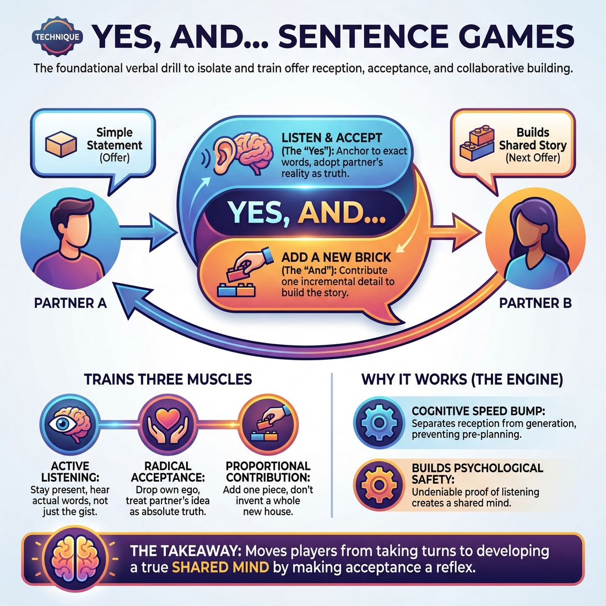

# 🎯 Yes, And… sentence games

> *A drillable muscle that trains **Offer Reception**.*

{ .infographic }

## 🎯 The essence

The **"Yes, And..." sentence game** is the most recognizable verbal drill in improvisation. Played in pairs or a circle, improvisers build a shared story or dialogue one line at a time, with every single response explicitly beginning with the words, *"Yes, and..."* 

It strips away the complexities of character, staging, and plot to isolate one critical muscle: **Offer Reception**. By forcing players to verbally affirm the previous statement before adding their own new information, the exercise short-circuits the human instinct to pre-plan. It trains the brain to listen fully, accept unconditionally, and build directly on the exact gift just given.

!!! abstract "The Core Mechanism"
    This drill forces the improviser to stop inventing in a vacuum and start reacting to their partner. The *"Yes"* accepts the reality; the *"And"* contributes the next brick.

## 🎓 What it trains

At its core, this technique isolates and drills the foundational muscle of taking a partner's idea, treating it as absolute truth, and allowing it to alter your own behavior. 

To understand why this drill exists, we have to look at the primary problem it solves: the improviser's panic. When a performer steps on stage, their **cognitive load**—the amount of mental effort required to process the moment—spikes dramatically. A Stage 1 **Novice** genuinely *tries* to listen, but the pressure of the unknown pulls them inward. They begin planning their next line while their partner is still speaking. 

This inward focus leads to two scene-killing habits:
1. **Missing the offer:** Hearing only the "gist" of what was said, rather than the specific, usable details.
2. **Blocking:** Accidentally (or intentionally) denying the partner's reality because it doesn't match the script the improviser was writing in their head.

By temporarily removing the burden of total invention, this game forces you to structurally acknowledge your partner's statement before adding your own. You *cannot* plan ahead; you must stay present.

!!! abstract "The Three-Part Muscle"
    While it sounds simple, this technique simultaneously trains three distinct sub-skills:
    
    * **Active Listening:** You must hear the *actual* words spoken to repeat or validate them, anchoring you in the present moment.
    * **Radical Acceptance (The "Yes"):** You train your ego to drop its own "brilliant" idea and fully adopt your partner's reality as the ground truth.
    * **Proportional Contribution (The "And"):** You practice the rhythm of adding just *one* new brick to the foundation, rather than trying to build an entirely new house.

Ultimately, this technique serves the domain of **The Partner**. It is the first mechanical step in moving away from two people simply "acting with someone" (taking turns reciting invented lines) toward developing a true **shared mind**. By forcing the verbalization of acceptance, it builds a container of mutual safety where both players know their ideas will be caught, valued, and expanded.

## 💡 Why it works

The game works by artificially separating the two halves of an improviser's brain: **reception** (hearing what was just said) and **generation** (inventing what comes next). You cannot formulate your "And" until you have successfully caught and processed your partner's exact words.

!!! abstract "The Engine Under the Hood"
    This technique acts as a cognitive speed bump. It physically prevents a player from rushing past their partner's idea to get to their own, ensuring that Offer Reception happens before any new invention begins.

Beyond managing cognitive load, the game exploits three powerful dynamics:

* **Undeniable proof of listening:** When a partner looks you in the eye and accurately validates your premise out loud, it builds immediate psychological safety. It proves to the speaker that they are not alone, moving the pair toward a shared mind.
* **Lowering the pressure to invent:** Because the player is forced to anchor to the previous statement, they do not need to conjure a brilliant, original idea out of thin air. They only need to provide a single, incremental brick.
* **Eradicating the "Yes, But":** In normal conversation, humans frequently use "Yes" as a polite transition into a disagreement (e.g., *"Yes, I hear you, but..."*). This game rewires that conversational habit, training the muscle to accept the reality completely before adding to it. 

!!! note "The Power of the Micro-Agreement"
    By breaking scene-work down to the sentence level, the game removes the pressure of character, plot, and staging. It isolates the pure mechanics of agreement, allowing improvisers to drill the fundamental rhythm of collaboration until it becomes muscle memory.

## 🧩 The setup

To set up this exercise effectively, the facilitator must create an environment where players can focus entirely on their partner without the pressure of "performing" a scene. 

*   **Players, Group Size & Arrangement:** 
    *   **Pairs** are ideal for maximizing repetitions (reps). 
    *   **Small circles** (4–6 players) can be used to practice passing the focus around a group. 
    *   Players should stand facing each other, close enough to maintain unbroken eye contact and hear each other easily without straining.
*   **Space & Materials:** An open room. If running multiple pairs simultaneously, space them out so the room's noise level doesn't force players to shout. No chairs, props, or materials are required.
*   **Time:** 
    *   *Per round:* 2–3 minutes. Keep rounds brisk to prevent players from overthinking or bogging down in complex narratives.
    *   *Total duration:* 10–15 minutes, allowing time to layer in variations and briefly debrief between rounds.
*   **Roles:**
    *   **Initiator:** Makes a simple, clear statement of fact, action, or observation to start the chain.
    *   **Responder:** Explicitly accepts the statement by starting their reply with the exact words *"Yes, and..."*, then adds a new, related piece of information. (Once the chain begins, players continuously swap these roles back and forth).
    *   **Facilitator:** Keeps time, calls out side-coaching prompts, and watches for players whose cognitive load is pulling them into planning their next line.
*   **Prerequisites:** None. This is often the very first exercise taught to a Novice, though advanced players return to it constantly to recalibrate their listening and strip away bad habits.

!!! tip "Facilitator Script: How to introduce it"
    "Find a partner and stand facing them. We are going to isolate the most fundamental muscle in improvisation: agreeing and adding. 
    
    Player A will make a simple statement—something like, 'We are standing in a beautiful garden.' Player B, you will look them in the eye, accept their reality by saying the exact words *'Yes, and...'*, and then add one new detail. For example: *'Yes, and the roses are in full bloom.'* Player A, you will then reply, also starting with *'Yes, and...'* 
    
    We are going to pass this back and forth rapidly. Don't plan your next line. Just listen to exactly what your partner gives you right now, and build the very next brick."

## ⚙️ The mechanics

The core objective is to build a shared reality one brick at a time. Here is the precise flow of play.

### The Core Loop
Whether played in pairs back-and-forth or passed around a circle, the engine of the game relies on a strict, four-step sequence:

1. **The Initiation:** Player A makes a single, declarative statement to establish a base reality. (e.g., *"This soup is incredibly spicy."*)
2. **The Explicit Agreement ("Yes"):** Player B begins their reply with the literal word "Yes." This is not just a verbal tic; it is a structural mandate to fully accept the premise, emotion, and reality of Player A's statement.
3. **The Contribution ("And"):** Player B immediately follows with the word "and," contributing a new, specific detail that builds directly upon the established reality. (e.g., *"Yes, and I think my tongue is actually melting."*)
4. **The Chain Continues:** The next player (either Player A returning, or Player C in a circle) treats Player B's *entire* statement as the new foundation. They must accept the melting tongue, starting their turn with *"Yes, and..."*

!!! tip "On stage: Drop your planned idea"
    Novice improvisers often try to listen while simultaneously planning their next line. Because you must build on the *very last thing said*, any pre-planned idea will inevitably clash with your partner's offer. You must drop your invention and rely entirely on what was just handed to you.

### Rules & Constraints
To keep the exercise focused on the muscle of reception, enforce these strict boundaries:

* **Literal compliance:** Players must say the actual words *"Yes, and..."* out loud at the start of every single sentence. These are the training wheels that force the brain into a posture of acceptance.
* **No questions:** Questions force the partner to do the work of invention. Every turn must be a declarative statement.
* **Add, don't just agree:** The "And" must provide *new* information. Saying *"Yes, and it is very hot soup"* is merely agreeing harder. It does not advance the reality. 
* **Stay in the present:** Build on the immediate reality rather than jumping wildly in time or space. 

!!! warning "Watch out: The disguised 'Yes, But...'"
    The most common mechanical failure is saying the words "Yes, and" while actually delivering a "But." 
    *Offer:* "We are flying so high today!"
    *Response:* "Yes, and we are out of gas and crashing."
    This technically uses the required words, but it destroys the partner's reality rather than building upon it. 

### Ending and Resetting
Because the game generates a rapid, compounding chain of details, the narrative will eventually become absurd, convoluted, or naturally exhaust itself. 

A round ends when the coach calls "Scene" or "Reset." To restart, the next player simply drops the previous reality entirely and delivers a brand new, unrelated initiation statement, beginning the loop again from step one.

## 🎬 Sample round

!!! example "Sample round: The Pink Town Hall"
    Here is how a standard round flows in a circle of three players (A, B, and C). Notice how each player explicitly accepts the previous reality before adding their new, specific detail.

    **Player A:** "We need to paint the town hall bright pink."
    *(The initial offer establishes a clear, actionable base reality.)*

    **Player B:** "Yes, and we should use that neon glow-in-the-dark paint so it's visible from space."
    *(**The "Yes":** Fully accepts the premise of painting the town hall pink. **The "And":** Adds a specific type of paint and an extreme consequence.)*

    **Player C:** "Yes, and the astronauts on the ISS can use it to navigate their landing."
    *(**The "Yes":** Accepts the space visibility. **The "And":** Introduces the astronauts and gives them a reason to interact with the town hall.)*

    **Player A:** "Yes, and when they land, we'll greet them with giant pink margaritas."
    *(**The "Yes":** Accepts the astronaut landing. **The "And":** Brings the focus back to the town and the color pink, escalating the celebration.)*

    **Mechanics in action:**
    
    *   **Active Listening:** Player C had to hear Player B's specific addition ("visible from space") rather than just planning their own joke about paint brushes. They built on the *immediate* last offer.
    *   **Active Gifting:** Player A's return offer ("pink margaritas") ties the new information (astronauts) back to the original premise (pink). This makes the partner's previous move look brilliant and keeps the chain cohesive rather than spiraling into random chaos.

## 🎚️ Variations & progressions

The base game is highly adaptable. By tweaking the rules, you can isolate specific hurdles in Offer Reception and guide players from basic listening to advanced, subtextual play. 

Here is how to ramp the difficulty to match the ensemble's maturity stage:

| Target Stage | Variant Name | The Mechanic | Why it works |
| :--- | :--- | :--- | :--- |
| **Adv. Beginner** | **The Echo** | Start with: *"Yes, [repeat partner's exact words], and..."* | Novices often panic and plan their lines. Forcing an exact repetition proves they were actively listening, short-circuiting the urge to invent ahead of time. |
| **Competent** | **The Specific Build** | Start with: *"Yes, and..."* but the addition must heighten a *specific detail* from the partner's offer, not just add a random new fact. | Moves players from simply tolerating an offer to actively building on it. It prevents "Yes, and I have a gun!" syndrome. |
| **Proficient** | **The Subtextual 'Yes'** | Drop the literal words "Yes, and." Instead, reply with dialogue that agrees with the partner's *emotion, status, or worldview*. | Trains players to hear the subtext, not just the text. It shifts the focus from building a plot to building a relationship. |

### Lateral variants

Beyond the core progression, try these common variations to stress-test different aspects of agreement and reception:

*   **The Friction Test ("Yes, But..." / "No, Because..."):** Have the circle play a round where every response must start with *"Yes, but..."* followed by a round of *"No, because..."*. This is an anti-game. By intentionally playing with blocks and hedges, players physically feel the exhausting friction of poor offer reception, making the return to *"Yes, and..."* feel like a profound relief.
*   **Physical "Yes, And...":** Remove words entirely. Player A makes a distinct physical movement and sound. Player B steps in, mirrors the exact movement and sound ("Yes"), and then evolves it into something bigger or different ("And"). Player C then mirrors Player B's new movement, and so on.
*   **Character "Yes, And...":** Players adopt strong, distinct character voices or postures before the game starts. They must play the standard verbal game, but filter their "And" through their character's specific point of view. 

!!! example "In a scene: The Subtextual 'Yes'"
    When a **Proficient** player internalizes this drill, they no longer need the literal words to accept an offer. 
    
    **Player A (pacing, anxious):** "The boss wants to see us at 4:00 PM. He never calls meetings at 4:00 PM."
    **Player B (also anxious, biting nails):** "I'll start shredding the offshore accounts."
    
    *Player B didn't say "Yes, and," but they completely accepted the reality, the anxiety, and the stakes of Player A's offer.*

!!! tip "On stage"
    Use the **Echo** variant as a diagnostic tool. If a scene is struggling because players are talking past each other, a coach can call out "Echo!" from the sidelines. For the next three lines, players must repeat the last sentence their partner said before delivering their own. It instantly forces connection.

## 🧑‍🏫 Coaching notes

When coaching "Yes, And..." sentence games, your primary enemy is the improviser's internal monologue. Your side-coaching must relentlessly pull them back into the present moment and force them to focus on their partner.

!!! tip "Coaching: The Golden Cue"
    **"Let the 'Yes' land before you find the 'And'."**  
    Remind players that they do not need to know what they are going to add until they have fully received what was just said. A micro-pause between hearing the offer and speaking the response is a sign of active listening, not a failure of speed. 

Keep your side-coaching brief and direct so you don't interrupt the flow of the exercise. Use these targeted cues to correct mechanics in real-time:

*   **"Stay in their eyes."** Use this when players look up at the ceiling or down at the floor to "search" for an idea. Force the connection back to the partner.
*   **"Use their exact words."** Use this if players are paraphrasing, summarizing, or rushing past the "Yes" to get to their own idea. 
*   **"Make the 'And' specific."** Use this when players give vague additions (e.g., *"Yes, and it is good"*). Push them toward concrete details (e.g., *"Yes, and it tastes like cinnamon"*).
*   **"Drop your script."** Say this when you see the "glazed over" look of a player who has stopped listening and is just waiting for their turn to speak a pre-planned line.
*   **"Match their energy."** Remind them that they are receiving an emotional offer, not just a textual one. If the partner whispers a secret, the response should reflect that conspiracy.

**What 'Good' Looks and Sounds Like**

As players move from Novice to **Competent**, you will observe a distinct shift in the room's energy. 

*   **It looks like:** Unbroken eye contact and relaxed, open body language. You will see genuine micro-expressions of discovery (a sudden smile, a furrowed brow) *while* the partner is speaking, proving the player is receiving the offer in real-time.
*   **It sounds like:** A natural, conversational rhythm. The "And" adds a concrete, actionable detail rather than a philosophical abstraction. The shared reality builds logically, one brick at a time, without the jarring leaps that happen when players force pre-planned ideas together.

## 🧭 Debrief & reflection

After the circle finishes, the debrief shifts the focus from the mechanics of the game to the internal experience of the players. The goal is to make the invisible friction of Offer Reception visible and to help players recognize the difference between merely waiting for their turn and truly listening.

Use these questions to guide the conversation, focusing on the specific insights they are designed to surface:

*   **"At what point did you catch yourself planning your next line?"**
    *   *What it surfaces:* This normalizes the common panic of pre-inventing. It helps players identify the exact moment their cognitive load pulled them out of the present moment, proving that you cannot simultaneously plan your own brilliant idea and actively listen to your partner.
*   **"How did it feel when the person before you gave a highly specific detail versus a vague one?"**
    *   *What it surfaces:* The direct link between the quality of the "Yes" and the ease of the "And." Players quickly realize that concrete, specific offers reduce the pressure on the next person, reinforcing the value of **Active Gifting**. 
*   **"Did the story end up anywhere near where you thought it would?"**
    *   *What it surfaces:* The joy and necessity of surrendering control. It proves that letting go of individual agendas creates a narrative that no single player could have written alone.
*   **"When you blanked or stumbled, what was happening in your head right before?"**
    *   *What it surfaces:* Often, a stumble means the player was genuinely listening so hard they forgot to prepare a safety net. This reframes a perceived "failure" as a structural success in offer reception.

!!! tip "Celebrate the blank"
    If a player admits, *"I have no idea what I said, I just panicked and blurted out the first word that came to mind,"* celebrate it. That blurting is the sound of the improviser's filter dropping. A good debrief reminds the room that raw, unfiltered reactions are far more valuable to a scene than perfectly polished, pre-planned dialogue.

By the end of the reflection, players should understand that the game isn't really about building a coherent story—it is a diagnostic tool for their own listening habits.

## ⚠️ Common pitfalls

!!! warning "Watch out: The 'Waiting to Speak' Trap"
    The single biggest failure point in this technique happens when a player stops listening because they are busy inventing their own brilliant addition. The result? A disjointed sequence where the "Yes" is a lie, and the "And" is completely unrelated to the partner's offer. 

When players are first learning to isolate and drill this muscle, their brains often rebel against the vulnerability of not knowing what they will say next. This manifests in several predictable traps:

**The Disguised "But" (or "Yes, And… Anyway")**
* **The Trap:** A player says the words *"Yes, and…"* but immediately pivots to their own preconceived idea, effectively ignoring or negating the partner's reality. 
* **The Fix:** Regress the drill to force active listening. Require the player to repeat the last three words of their partner's sentence before they are allowed to say *"Yes, and…"*. (e.g., *"...stole the diamonds." -> "Stole the diamonds. Yes, and..."*).

!!! example "In a scene: The Disguised But"
    **Player A:** "Look at this beautiful painting of a horse."
    **Player B:** "Yes, and I brought my bowling ball, let's play a game!" 
    *(Player B accepted the syntax, but entirely rejected the reality of the painting.)*

**The Overstuffed "And" (Information Dumping)**
* **The Trap:** Feeling the pressure to be funny or interesting, a player adds three new ideas, two new characters, and a plot twist in a single sentence. This overwhelms the next player and breaks the chain of shared discovery.
* **The Fix:** Constrain the addition. Coach players to add exactly *one* small brick to the foundation, not an entire new wing of the house. Remind them that "boring" and obvious additions are gifts to the ensemble.

**The Empty "Yes" (Lack of Consequence)**
* **The Trap:** The player hears the offer and accepts it factually, but doesn't let it affect the emotional reality or the logic of the scene. 
* **The Fix:** Shift the focus from mere addition to *consequence*. Prompt the player with: *"If what they just said is true, what else must be true?"* This forces the "And" to be a direct reaction to the "Yes," rather than a random tangent.

**Rushing the Gap**
* **The Trap:** Players fire off their sentence the millisecond the previous player stops speaking, usually because they pre-planned it. This creates a frantic, breathless rhythm that kills genuine connection.
* **The Fix:** Mandate a physical breath or a two-second pause between the end of one player's sentence and the start of the next. Teach them that the silence is where the actual processing of the offer happens.

## 🌟 What mastery looks like

At the highest level of practice, the "Yes, And…" sentence game sheds its rigid, mechanical feel and transforms into a seamless, hyper-connected flow. The players are no longer just waiting for their turn to speak; they have achieved a shared mind, where the boundary between one person's idea and the next dissolves entirely.

When observing master improvisers run this drill, look for these distinct, observable behaviors:

*   **Zero hesitation:** The improviser breathes in exactly as their partner finishes speaking. The *"Yes, and..."* drops immediately, proving they were engaged in pure reception rather than planning their response.
*   **Emotional continuity:** They do not just accept the literal text; they accept the *subtext*. If a partner delivers a line with a subtle tremor of anxiety, the master player catches that micro-expression and matches or heightens that exact emotional frequency in their addition.
*   **Invisible gifting:** The "And" is never a random pivot. Instead, it retroactively makes the partner's initial offer look like a brilliant setup. Every move is designed to make the ensemble look like geniuses.
*   **Physical synchronization:** Mastery is visible in the body. Even standing in a circle, players will naturally mirror their partner's posture, eye contact, and breath rhythm as the offer is passed to them.

!!! example "In the circle: Competent vs. Master"
    **Competent (Focusing on text):**
    *Player A:* "The king is arriving at the castle."
    *Player B:* "Yes, and we need to prepare the feast."
    *(A logical, solid addition that moves the narrative forward.)*

    **Master (Focusing on subtext and gifting):**
    *Player A (said with a slight, panicked breathless tone):* "The king is arriving at the castle."
    *Player B (matching the panic, widening their eyes):* "Yes, and we haven't even washed the blood off the throne!"
    *(B hears the panic, validates it, and gifts A with a massive, high-stakes reason for that panic.)*

!!! abstract "The ultimate goal"
    When mastery is reached, the words "Yes, and" almost disappear into the rhythm of the sentence. The drill stops sounding like a list of disconnected facts and starts sounding like a single, highly articulate person telling a thrilling story at lightning speed.

## 🔗 Why it matters

At its core, the "Yes, And…" sentence game is the most direct way to isolate and strengthen Offer Reception. In the early stages of improvisation, a player's cognitive load is heavy; they are often so busy planning their next brilliant line that they only half-hear what is actually being said. By requiring a literal, verbal acknowledgment of the partner's contribution before any new information can be added, this technique forces the brain to stop inventing and start listening.

This muscle is the engine of **The Partner** domain. The ultimate goal of this domain is to move from simply "acting near someone" to achieving a shared mind—a state where two improvisers build a single, unified reality within a container of mutual safety. When you drill "Yes, And," you are systematically dismantling the ego. You are training yourself to treat your partner's idea as an undeniable fact, and your own idea as a mere extension of that fact. 

!!! abstract "The Algorithm of Improv"
    Think of "Yes, And" not just as a dialogue rule, but as the foundational algorithm of the entire craft. 
    
    *   **Yes:** I receive your reality, I validate it, and I let it affect me.
    *   **And:** I contribute a new detail that makes your reality even more specific, grounded, and important.

As you move into the wider craft, this verbal muscle translates into physical, emotional, and narrative scene work. The improviser who has mastered the "Yes, And" sentence game doesn't just agree with their partner's words; they learn to "Yes, And" their partner's posture, their emotional tone, and the unspoken subtext of the scene. It is the fundamental building block that allows an ensemble to step onto a bare stage and trust that, together, they can build a cohesive world out of thin air.

## 📚 References & Further Reading

### Foundational sources
* **Viola Spolin, *Improvisation for the Theater* (1963)** — The foundational text on theater games that established the mechanics of agreement, active listening, and group mind. Spolin's exercises were the first to systematically train actors to drop their pre-planned ideas and react purely to their partner's immediate physical and verbal offers. https://nupress.northwestern.edu/9780810140080/improvisation-for-the-theater/
* **Keith Johnstone, *Impro: Improvisation and the Theatre* (1979)** — The seminal text that explicitly defined the concepts of "blocking" (denying reality) versus "accepting" (saying yes to offers). Johnstone's exploration of how humans naturally block out of fear of the unknown is the exact psychological hurdle the "Yes, And" sentence game is designed to overcome. https://www.routledge.com/Impro-Improvisation-and-the-Theatre/Johnstone/p/book/9780878301171
* **Charna Halpern, Del Close, and Kim "Howard" Johnson, *Truth in Comedy: The Manual of Improvisation* (1994)** — The definitive guide to Chicago-style long-form improv. It establishes agreement as the absolute bedrock of scene work, explaining how "Yes, And" allows an ensemble to build the complex, interconnected structure of the Harold without a script.

### Practitioner guides & manuals
* **Matt Besser, Ian Roberts, and Matt Walsh, *The Upright Citizens Brigade Comedy Improvisation Manual* (2013)** — Codifies how "Yes, And" is used mechanically to establish a "base reality" (the who, what, and where) before players can move on to finding the "game" of the scene. It treats agreement as the structural prerequisite for comedic invention.
* **Patricia Ryan Madson, *Improv Wisdom: Don't Prepare, Just Show Up* (2005)** — A practical guide by a Stanford professor applying the rules of "Say Yes" and "Say Yes, And" to manage cognitive load and everyday life. Madson explicitly breaks down how the mandate to agree forces us to stay present and stop writing scripts in our heads. https://www.penguinrandomhouse.com/books/105527/improv-wisdom-by-patricia-ryan-madson/
* **Kelly Leonard and Tom Yorton, *Yes, And: How Improvisation Reverses "No, But" Thinking and Improves Creativity and Collaboration* (2015)** — Lessons from executives at The Second City on using the "Yes, And" technique to build collaborative ensembles rather than competitive teams. It explores how the micro-agreements of improv foster a culture of co-creation. https://www.harpercollins.com/products/yes-and-kelly-leonardtom-yorton
* **Bob Kulhan, *Getting to "Yes And": The Art of Business Improv* (2017)** — Focuses on the "Yes, And" technique as a cognitive speed bump to overcome "No, But" thinking during ideation and brainstorming. Kulhan details how the drill separates the generation of ideas from the judgment of ideas. https://www.sup.org/books/title/?id=26151

### Research & theory
* **Peter Felsman, Colleen M. Seifert, and Joseph A. Himle, *"The use of improvisational theater training to reduce social anxiety in adolescents"* (2019)** — Empirical research published in *The Arts in Psychotherapy* demonstrating how improv training (specifically the "Yes, And" mechanic) increases tolerance for uncertainty and reduces social anxiety by forcing participants to navigate unscripted interactions safely. https://doi.org/10.1016/j.aip.2018.12.001
* **Amy Edmondson, *The Fearless Organization: Creating Psychological Safety in the Workplace for Learning, Innovation, and Growth* (2018)** — While not strictly an improv book, Edmondson's foundational research on psychological safety provides the academic underpinning for why the micro-agreements of "Yes, And" work. The verbal affirmation proves to the speaker that they will not be punished for their contribution, fostering a shared mind. https://fearlessorganization.com/

### Communities & adjacent reading
* **Tina Fey, *Bossypants* (2011)** — The chapter "The Rules of Improvisation" is arguably the most famous mainstream articulation of "Yes, And." Fey breaks down how agreeing and adding to a partner's reality is not just a stage technique, but a fundamental rule for respectful collaboration and problem-solving. https://www.hachettebookgroup.com/titles/tina-fey/bossypants/9780316056892/
* **Applied Improvisation Network (AIN)** — A global community of practitioners and academics who use "Yes, And" and other improv techniques in non-theatrical settings (business, therapy, education) to train active listening and psychological safety. https://www.appliedimprovisationnetwork.org/

## 💬 Quotes & Anecdotes

!!! quote "— Tina Fey, *Bossypants* (2011)"
    The second rule of improvisation is not only to say yes, but YES, AND. You are supposed to agree and then add something of your own.

!!! quote "— Keith Johnstone, *Impro: Improvisation and the Theatre* (1981)"
    Good improvisers seem telepathic; everything looks pre-arranged. This is because they accept all offers made—which is something no 'normal' person would do.

!!! quote "— Tina Fey, *Bossypants* (2011)"
    To me YES, AND means don't be afraid to contribute. It's your responsibility to contribute. Always make sure you're adding something to the discussion. Your initiations are worthwhile.

!!! quote "— Keith Johnstone, *Impro: Improvisation and the Theatre* (1981)"
    There are people who prefer to say 'Yes', and there are people who prefer to say 'No'. Those who say 'Yes' are rewarded by the adventures they have, and those who say 'No' are rewarded by the safety they attain.

### Where it comes from

The underlying philosophy of "Yes, And" traces back to the 1920s and 30s with sociologist Neva Boyd and her student, Viola Spolin (widely known as the "Mother of Improv"). Spolin developed theater games to help immigrant children in Chicago assimilate and socialize, focusing heavily on "yielding" to others and accepting a shared reality. 

While Spolin laid the mechanical groundwork in her seminal 1963 book *Improvisation for the Theater*, the exact phrase "Yes, And" was codified later. It is widely attributed to the early days of The Compass Players and The Second City in the late 1950s. Pioneers like Elaine May, Paul Sills, and Del Close established the foundational "Kitchen Rules" of improv, which explicitly included the mandate: "Don't deny a reality which is established." 

The specific "Yes, And" terminology was further cemented into the theatrical lexicon by Del Close and Charna Halpern's 1994 manual *Truth in Comedy*, and ultimately brought to the mainstream public by Tina Fey's 2011 memoir *Bossypants*.

### A telling example

In *Bossypants*, Tina Fey provides the definitive illustrative scenario of what happens when the "Yes, And" muscle fails, versus when it succeeds:

> "If we're improvising and I say, 'Freeze, I have a gun,' and you say, 'That's not a gun. It's your finger. You're pointing your finger at me,' our improvised scene has ground to a halt. But if I say, 'Freeze, I have a gun!' and you say, 'The gun I gave you for Christmas! You bastard!' then we have started a scene because we have AGREED that my finger is in fact a Christmas gun."

By explicitly practicing the "Yes, And" sentence game, improvisers train their brains to bypass the logical, defensive instinct (pointing out the finger) and automatically choose the collaborative, additive response (the Christmas gun).

## 🧭 Explore the framework

- ⬆️ **Skill it trains:** [Offer Reception](02_S4__offer-reception.md)
- 🎭 **Domain:** [The Partner](02_D__the-partner.md)
- 🔁 **Sibling techniques:** [Endowment-acceptance](02_S4_T2__endowment-acceptance.md)
