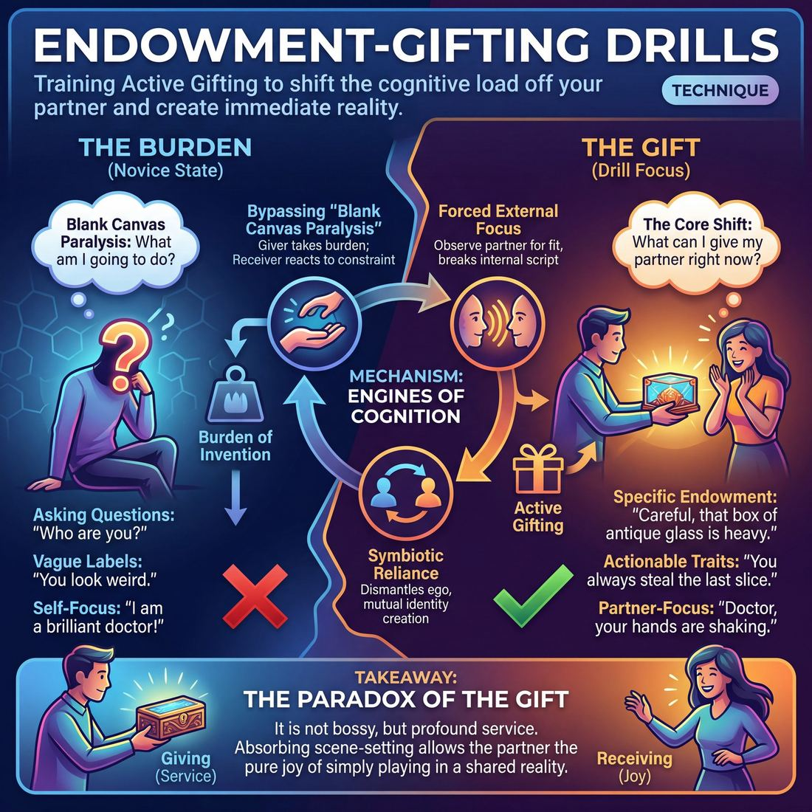

# 🎯 Endowment-gifting drills

> *A drillable muscle that trains **Active Gifting**.*

{ .infographic }

## 🎯 The essence

Endowment-gifting drills are focused exercises where improvisers practice explicitly assigning their scene partners specific traits, histories, physicalities, or emotional states. Instead of leaving a partner stranded to invent their own character from scratch, this technique isolates the single muscle of **Active Gifting**—the act of making a concrete, usable choice *for* someone else. It trains players to look outward, shifting the cognitive load off their partner and handing them an immediate, undeniable reality to play with.

## 🎓 What it trains

At its core, this drill strengthens the ability to give your scene partner specific, actionable details about who they are, what they are doing, or how they feel. In improv, an **endowment** is the act of assigning an attribute to another player. You are "gifting" them a reality they didn't have to invent themselves. 

**The problem it solves**  
Under the pressure of stepping on stage, a **Novice** improviser (Stage 1) will often freeze or default to asking questions ("Who are you?", "What are we doing here?"). Even when they try to endow, the offers are often vague or unusable ("You look weird"). This places the "burden of invention" entirely on the partner, forcing them to do the heavy lifting of establishing the scene's reality. 

Endowment-gifting drills directly attack this hesitation. They force players to stop planning their own character and instead look outward, building the reflex to immediately hand their partner a concrete identity, physical object, or emotional state.

!!! abstract "The Core Shift"
    Instead of stepping on stage thinking, *"What am I going to do?"*, this drill trains the brain to instinctively ask, *"What can I give my partner right now to make their job easier?"*

**The deeper principle**  
This technique is the practical application of the classic improv adage: *Make your partner look good.* It sits squarely within **The Partner** domain, pushing players away from merely acting *near* someone and toward developing a true **shared mind**. 

By drilling this in isolation, improvisers learn to modulate their offers. As they move toward the **Competent** stage (Stage 3), they stop throwing random, chaotic traits at their partner and begin deliberately choosing gifts that fit the emerging relationship, easing their partner's cognitive load and setting them up to shine.

| The Burden (What we want to unlearn) | The Gift (What this drill trains) |
| :--- | :--- |
| **Asking questions:** "What's in that box?" | **Specific endowment:** "Careful, that box of antique glass is heavy." |
| **Vague labels:** "You're a bad person." | **Actionable traits:** "You always steal the last slice of pizza, Dave." |
| **Self-focus:** "I am a brilliant doctor!" | **Partner-focus:** "Doctor, your hands are shaking again." |

## 💡 Why it works

This drill works by forcibly relocating an improviser’s attention from their own internal monologue to their partner. It exploits a simple psychological hack: it is vastly easier to react to a limitation than it is to invent from scratch. 

When we isolate the act of giving an endowment, we engage three powerful engines of group cognition:

*   **Bypassing "Blank Canvas Paralysis":** Novices often freeze under the weight of infinite possibilities. By drilling endowments, the giver takes on the burden of invention, handing the receiver a highly specific constraint (e.g., *"Your hands are freezing"* or *"You're the worst priest in the parish"*). The receiver's brain immediately shifts from the exhausting task of *creating* a character to the much easier, more playful task of *reacting* as that character.
*   **Forced External Focus:** You cannot effectively endow someone without looking at them. The drill demands that the giver observe their partner's posture, micro-expressions, and tone to offer a gift that fits—or delightfully contrasts with—what is already there. This breaks the habit of "writing the script in your head."
*   **Symbiotic Reliance:** By making players responsible for building *each other's* identities rather than their own, the drill dismantles ego. I cannot exist in this scene until you tell me who I am; you cannot exist until I do the same for you.

!!! abstract "The Paradox of the Gift"
    It can initially feel bossy or demanding to tell another improviser who they are or how they feel. In reality, it is an act of profound service. You are absorbing the heavy lifting of scene-setting, allowing your partner the pure joy of simply stepping into a reality and playing. 

Ultimately, the drill works because it trains Active Gifting in a vacuum. By removing the pressure to sustain a narrative, find the "game" of the scene, or be funny, players can focus entirely on the mechanics of making their partner look brilliant. 

## 🧩 The setup

Here is everything you need to arrange before putting this drill on its feet. 

*   **Players & Arrangement:** Pairs spread out across the room (ideal for high repetition and low pressure), or a single circle of 6–8 players (best for public coaching and group observation). 
*   **Space & Materials:** An open floor. No chairs, props, or set pieces are required. 
*   **Time:** 10–15 minutes total. If working in pairs, allow 2–3 minutes of rapid-fire exchanges before swapping roles or rotating partners.
*   **Roles:** 
    *   **The Gifter:** Initiates the exchange by delivering a single line of dialogue that contains a clear, specific endowment.
    *   **The Receiver:** Accepts the gift instantly, reacting physically and verbally to prove they have taken on the endowed trait, before dropping it to reset.
*   **Prerequisites:** Players should understand basic agreement ("Yes, And") and know what an endowment is. They should be ready to move past the habit of giving vague, unusable offers.

!!! tip "Setting the room's energy"
    Because this is a technique drill and not a scene-work exercise, encourage a "gymnasium" mindset. Players should feel comfortable stopping, resetting, and trying a line again if their gift was too vague. The goal is reps, not narrative.

!!! quote "How to introduce it"
    "Improv is infinitely easier when we make choices for each other. Today, we are going to isolate the muscle of Active Gifting. An endowment is simply giving your partner a specific trait, role, or emotional state. Instead of asking 'What are you doing?', you tell them: 'Doctor, your hands are shaking!' 

    In this drill, you will take turns giving your partner an undeniable gift. The Gifter's job is to be specific and clear, making the partner's job as easy as possible. The Receiver's job is to accept that gift instantly with your body and your voice. Don't worry about starting a whole scene—just give the gift, receive the gift, and reset."

## ⚙️ The mechanics

The core objective is to isolate two complementary muscles: **giving** specific, actionable information to a partner, and **embodying** that information instantly without hesitation. 

In its most fundamental form, this drill is run in pairs (Player A and Player B) executing a rapid-fire, three-line micro-scene.

### The Flow of Play

1. **The Endowment (Player A):** Player A initiates the interaction with a single line of dialogue. This line must explicitly assign an identity, physical trait, emotional state, or object to Player B. 
2. **The Embodiment (Player B):** Player B takes a micro-second to internalize the gift. They must immediately accept the reality of the endowment, physically and vocally shifting to match it, and reply with a line that justifies or heightens the gift.
3. **The Reinforcement (Player A):** Player A responds by validating Player B’s reaction, treating them exactly as the endowed character, and adding one more piece of complementary information.
4. **The Reset:** The micro-scene ends immediately after this third line. The players drop the characters, swap roles (Player B now initiates), and begin the loop again.

!!! abstract "The Core Loop"
    **A:** Endows B with a specific trait.  
    **B:** Accepts, embodies, and justifies the trait.  
    **A:** Validates B's reaction and adds a complementary detail.  
    *(Reset and swap)*

### Rules & Constraints

To keep the drill focused, players must adhere to strict constraints. If a constraint is broken, the coach should gently stop the scene and have the player re-deliver the line.

* **Statements, never questions:** Player A must state the reality. Asking a question forces Player B to invent the reality, which is the opposite of a gift. 
* **Specificity over vagueness:** "You are covered in green slime" is a strong, specific gift. "You look weird" is weak because it requires Player B to decide *how* they are weird.
* **No "pimping":** A gift should make the partner's job easier, not harder. Endowing a partner with an impossible task or a highly obscure reference breaks the container of mutual safety. 

!!! tip "On stage: The 'I/You' structure"
    If players struggle to formulate a clean endowment, have them use the "I/You" sentence structure for their initiation. 
    * *"**I** am so glad **you** brought your famous potato salad."*
    * *"**I** can't believe **you** are wearing a tuxedo to a beach party."*
    This forces the initiator to establish a relationship while simultaneously delivering a clear gift.

### How a Round Ends

Because this is a muscle-isolation drill, speed and repetition are more important than narrative resolution. A standard round consists of a pair completing 6 to 10 rapid-fire exchanges (swapping A and B roles each time) before stepping out to let the next pair jump in. The coach dictates the pace, calling "Next!" the moment the third line is delivered, preventing the players from drifting into a meandering scene.

## 🎬 Sample round

!!! example "In a scene: The Direct Endowment Exchange"
    In this two-person drill, Player A's goal is to give a specific, playable gift, and Player B's goal is to accept it fully before heightening the scene. Here is how a successful exchange maps to the core mechanics.

    **Player A:** *(Steps forward, making direct eye contact)* "You always bring your metal detector to the worst places, Gary."
    
    * **The Mechanic (The Gift):** Player A delivers a clear, specific endowment. They provide a name (Gary), an object (metal detector), and a behavioral trait (bringing it to inappropriate places). This is a high-value gift.

    **Player B:** *(Immediately mimes sweeping a heavy rod over the floor, hunching their shoulders)* "I'm telling you, there are Spanish doubloons under this hospital linoleum."
    
    * **The Mechanic (The Receipt & Justification):** Player B accepts the gift physically and verbally. They justify the behavior with a specific, absurd reason, fully stepping into the endowed reality.

    **Player A:** *(Pinching the bridge of their nose)* "The MRI machine is in the next room, Gary. You're going to wipe the hospital's hard drives."
    
    * **The Mechanic (The Reinforcement):** Player A builds on the established reality, heightening the stakes of the endowment rather than dropping it to invent a new idea. 

    **Player B:** *(Stops sweeping, looks panicked, grabs their jaw)* "Wait... is that why my fillings are vibrating?"
    
    * **The Mechanic (The Payoff):** Player B takes the heightened stakes and reacts emotionally and physically. The initial gift has successfully blossomed into a shared, playable reality.

## 🎚️ Variations & progressions

To build the muscle of Active Gifting, this drill can be scaled from blunt, mechanical exercises to highly nuanced scene work. Use these progressions to match your ensemble’s current maturity stage.

**Level 1: Explicit Labels (Novice to Advanced Beginner)**  
At this stage, players are moving from vague, unusable offers to delivering clear, unambiguous endowments. The focus is purely on the mechanics of giving and receiving.
*   **The "You Are" Drill:** Player A must start every initiation with "You are [Identity] and you are [Emotion/State]." (e.g., *"You are the ship's captain, and you are terrified."*) Player B accepts and justifies.
*   **Physical Endowment Only:** Player A endows Player B purely by handing them an invisible object with specific weight, temperature, or texture. Player B must receive it and reveal what it is through their reaction.

**Level 2: Behavioral & Historical Gifts (Competent)**  
Once players can give clear labels, shift the focus to giving gifts that actively ease the partner's job. Instead of just naming *who* the partner is, endow *how* they behave.
*   **"I love/hate it when you..."** Player A endows Player B with a specific past action or quirky habit. (e.g., *"I hate it when you chew your soup, Dave."*) Player B must immediately demonstrate the behavior.
*   **The Status Gift:** Tie the endowment directly to **Status Modulation**. Player A must endow Player B with a specific status (high or low) relative to themselves, using only their tone and posture. 

!!! example "In a scene: Behavioral Gifting"
    **Player A:** "You always pace when you're hiding something from me."
    *(Player B immediately begins pacing, instantly gifted both a physical action and an emotional secret to play.)*

**Level 3: The "Golden Platter" (Proficient)**  
At this stage, players learn to gift instinctively to set their partner up to shine (Stage 4). The drill shifts from random endowments to highly tailored ones.
*   **The Tailored Gift:** Player A must give an endowment they know the *actor* playing Player B will love. If Player B excels at physical comedy, endow them with a broken leg; if they love playing high-status villains, endow them as a corrupt mayor. 
*   **Subtextual Endowments:** Player A endows Player B with a secret or an underlying emotion that contradicts their spoken words. (e.g., *"You keep saying you're fine, but your hands are shaking."*)

**Level 4: Invisible & Reactionary Gifting (Master)**  
For advanced improvisers, the goal is to make the gifting entirely invisible (Stage 5). The endowment is no longer spoken; it is implied entirely through Player A's behavior.
*   **The Mirror's Gift:** Player A defines Player B entirely through their own reactions. If Player A cowers, flinches, and stammers, they have invisibly endowed Player B as a terrifying, high-status monster—without ever saying "You are scary."

!!! tip "On stage: Ramping the difficulty"
    If a pair struggles at a higher level, drop them back down one tier immediately. If they freeze on "Invisible Gifting," pause the drill and ask them to explicitly state the label they are trying to imply, then resume.

## 🧑‍🏫 Coaching notes

As a coach, your primary job during endowment-gifting drills is to shift the players' focus outward. You are actively moving them from the cognitive load of inventing an offer to deliberately choosing gifts that make their partner's job easier. Watch the **receiver** just as closely as the giver. The success of an endowment is measured entirely by how easily the partner can use it.

!!! tip "Coaching: The Golden Cue"
    **"Give them a behavior, not a biography."**  
    Novices often endow complex, historical backstories ("You're my ex-wife who stole my dog in 1998"). This is a trap that forces the partner into their head to do math. Instead, coach them to endow immediate, playable states: "You're so jittery today," or "Why are you whispering?" Playable behaviors are true gifts.

### Live Side-Coaching
Keep your interventions short, punchy, and actionable while the drill is in motion. When the energy dips or players get stuck in their heads, use these cues:

*   **"Make it specific!"** – If a player says, "You're a nerd," prompt them to sharpen it: "What kind? Give them a specific obsession!" (*"You really love those spreadsheets, don't you?"*)
*   **"Endow an emotion!"** – Push players beyond occupations and physical traits. Emotions are the easiest gifts to play.
*   **"Let it land!"** – Stop players who rapid-fire multiple endowments in one sentence. Force them to give *one* gift, pause, and watch their partner react.
*   **"Use what's already there!"** – If the receiver happens to be slouching or blinking rapidly, coach the giver to endow that accidental physical reality rather than inventing something from scratch.

### What 'Good' Looks Like
You will know the drill is working when you see the following observable shifts in the room:

1.  **The "Aha!" Posture:** The moment the endowment is spoken, the receiver's body instantly changes. They don't pause to think; they immediately adopt the posture, voice, or attitude of the gift.
2.  **Eye Contact:** The giver maintains unbroken eye contact after delivering the line, eagerly waiting to see how their partner will play with the toy they just handed them.
3.  **Relief, not Panic:** The atmosphere feels light. Players realize that Active Gifting means they don't have to invent a whole scene themselves—they just have to hand their partner a single, sturdy brick.

## 🧭 Debrief & reflection

The debrief is where the mechanical repetition of the drill translates into the mindset of Active Gifting. By reflecting on how the endowments landed, players learn to distinguish between an offer that burdens their partner and a true gift that makes their job effortless.

To lock in the learning, direct your questions to both sides of the exchange:

**For the Receiver (The Endowed):**
*   *“Which endowment made you instantly know who you were or what to do next?”* 
*   *“Did any gift feel like a chore, a trap, or a blank canvas?”*
*   *“How did your body react when you were handed a highly specific physical trait or emotion?”*

**For the Giver (The Endower):**
*   *“Did you find yourself planning a 'clever' line, or did you look at your partner's resting posture for inspiration?”*
*   *“When you gave a specific gift, did you feel the pressure to drive the scene lift off your shoulders?”*

!!! tip "Coach's Focus"
    Keep the debrief centered on the *feeling* of receiving. The most valuable feedback in this drill doesn't come from the coach; it comes from the partner who can honestly say, "When you called me a 'grumpy old man,' I still had to invent a reason why. But when you said, 'Grandpa, stop glaring at the toaster,' I knew exactly what to do."

A successful debrief will naturally surface a few core realizations:

1.  **Specificity is kindness.** Players will realize that vague endowments force the receiver to do the heavy lifting. Specific, usable gifts provide an immediate springboard.
2.  **Gifting vs. Pimping.** The group will discover the fine line between giving a partner a rich reality to react to ("You're trembling, are you afraid of heights?") and forcing them to perform a trick ("Do your funny dance!"). 
3.  **Shared ownership.** Players will articulate that when they focus entirely on making their partner look brilliant, their own anxiety about "what to say next" vanishes.

## ⚠️ Common pitfalls

!!! warning "Watch out: The Guessing Game"
    The most common novice trap is giving a **vague offer** disguised as a gift. When a player says, "Why are you dressed like that?" or "What's wrong with your face?", they aren't gifting—they are demanding their partner invent the details. A true gift provides the answer: "That clown suit is entirely inappropriate for a funeral, Dave."

When improvisers are first learning to actively endow their partners, the cognitive load of listening, inventing, and speaking simultaneously can cause the technique to break down. Watch for these common failure points:

**The Kitchen Sink (Over-endowing)**
*   **The Trap:** Under pressure, a player panics and dumps three or four endowments into a single line ("Hey, angry Dr. Jenkins, why are you limping and holding that ticking bomb?"). The receiver's brain freezes under the sheer volume of information.
*   **The Fix:** One gift at a time. Give the partner a single, solid trait, name, or relationship, then stop talking and let them react. 

**Pimping (The Burden Gift)**
*   **The Trap:** **Pimping** occurs when a player endows their partner with a difficult, on-the-spot task rather than a playable trait. Saying, "Sing us that improvised opera you wrote!" forces the partner to do all the heavy lifting while the gifter sits back.
*   **The Fix:** Endow *perspective*, *history*, or *status*, not chores. "You always have such a calming presence" is a gift; "Calm down this angry mob" is a chore.

**The Teflon Receiver**
*   **The Trap:** The receiver is so pulled into planning their own line that the gift bounces right off them. They might acknowledge it verbally, but they don't let it change their behavior.
*   **The Fix:** Train receivers to take a physical breath after hearing the gift. Let the endowment alter their posture, expression, or voice *before* they speak.

!!! example "In a scene: The Teflon Receiver"
    **Player A:** "You're shivering, take my coat." *(Gift: You are freezing).*  
    **Player B:** "Thanks. Anyway, about these quarterly reports..." *(Gift dropped; no physical change, no emotional reaction).*  
    
    **The Fix:** Player B should physically wrap their arms around themselves, let their teeth chatter, and *then* reply.

## 🌟 What mastery looks like

When improvisers reach the highest level of this drill, the mechanics of the exercise completely vanish. You no longer see two actors taking turns handing each other character traits; you see a fully realized relationship instantly snapping into existence. 

At the master level, **gifting is invisible**. The endowments are woven so naturally into the dialogue and action that they don't sound like exercise prompts at all. Every move is designed to make the partner look brilliant, requiring zero heavy lifting on their part to justify or explain the offer.

Here is what you will observe when this drill is executed with mastery:

*   **Behavioral, not just categorical gifts:** Instead of endowing a partner with a static noun ("You are a cop"), master improvisers endow specific, playable behaviors and emotional states ("You're polishing that badge so hard you're going to rub the gold off").
*   **Zero hesitation on the uptake:** The receiving partner does not pause to process or evaluate the gift. They instantly adopt the posture, voice, or emotional state required, treating the endowment as an undeniable fact of their shared reality.
*   **Exploiting physical offers:** The giver actively observes the receiver's accidental micro-movements—a shifted weight, a scratch of the nose, a sigh—and endows *that* specific action, making the receiver feel like they were already doing exactly what the scene needed.
*   **Embedded history:** The gifts carry the weight of a long-term relationship. They don't just establish *what* the partner is doing, but *how* it affects the dynamic between them.

!!! example "In a scene: The Invisible Gift"
    **Novice (Categorical):** "You are a very angry chef." 
    *The receiver now has to do the hard work of inventing why they are angry and what to do about it.*
    
    **Master (Behavioral & Invisible):** "I know the soufflé fell, Chef, but gripping the meat cleaver like that is scaring the busboys." 
    *The receiver is instantly gifted an emotion (frustration), a history (the ruined dish), a status (authority), and a physical action to play (gripping the cleaver).*

!!! abstract "Key idea: The Shared Mind"
    Mastery in endowment drills proves that the improvisers have moved beyond merely "acting with someone." They have entered a state of **shared mind**, where the giver instinctively knows exactly what kind of offer will unlock the receiver's best performance, and the receiver trusts the giver enough to leap into the unknown without looking.

## 🔗 Why it matters

Endowment-gifting drills are the weight room for Active Gifting. When improvisers step on stage, the sheer cognitive load of inventing a scene often pulls them inward. They worry about their own character, their own lines, and what to do with their hands. This technique forcibly redirects that focus outward. By isolating the act of giving a gift, players build the reflex to look at their partner and immediately offer them a concrete identity, emotion, or physical reality.

This outward focus is the engine of The Partner domain. The ultimate goal is to move from simply acting near someone to operating with a shared mind. Endowment is the bridge between those two states. When you consistently endow your partner, you relieve them of the burden of having to invent themselves from scratch. In return, you must surrender your own preconceived ideas and accept the gifts they give you. You are literally constructing your partner's persona while they construct yours. 

!!! abstract "The Selfish Gift"
    The secret of Active Gifting is that it is ultimately self-serving. By endowing your partner with a strong choice ("You're shaking, Doctor"), you instantly give *yourself* a clear reality to react to. You no longer have to invent the scene; you just have to deal with the nervous doctor in front of you.

Zooming out to the wider craft, a cast that has mastered endowment-gifting rarely suffers from slow, vague, or "talking head" scene starts. Instead of two strangers cautiously negotiating who they are ("Hello, nice day." "Yes, it is."), scenes launch with immediate clarity and relationship ("Happy anniversary, you old fool." "You remembered the diamonds!"). 

The muscle memory built in these drills ensures that whenever an improviser feels lost, their default instinct isn't to panic or invent a wacky plot, but to simply look at their partner and give them a gift.

## 📚 References & Further Reading

### Foundational sources
*   **Keith Johnstone, *Impro for Storytellers* (1999)** — Johnstone formalized the term "endowment" in the improv lexicon. In his work, he details how to assign physical, emotional, and status traits to scene partners to drive narrative. He explicitly discusses how endowing a partner eases the burden of invention, which is the exact mechanism trained in endowment-gifting drills.
*   **Viola Spolin, *Improvisation for the Theater* (1963)** — The creator of Theater Games and the "grandmother of improv." Her foundational exercises, such as "Who Am I?" and "Art Gallery," laid the groundwork for modern endowment drills by forcing players to define each other through action, relationship, and external focus rather than internal exposition.
*   **Charna Halpern, Del Close, and Kim Johnson, *Truth in Comedy: The Manual of Improvisation* (1994)** — The definitive text on the "make your partner look good" philosophy. This book explains the psychological engine behind active gifting: that by shifting focus away from the self and absorbing the heavy lifting of scene-setting for your partner, the entire ensemble elevates.

### Practitioner guides & manuals
*   **Matt Besser, Ian Roberts, and Matt Walsh, *The Upright Citizens Brigade Comedy Improvisation Manual* (2013)** — Explicitly defines "Endowment" as an offer that lays information onto another player (e.g., "Good morning, Doctor"). The manual provides practical mechanics for how to endow partners with actionable traits without manipulating the scene or "pimping" them into impossible situations. [UCB Store]{.ref}
*   **Mick Napier, *Improvise: Scene from the Inside Out* (2004)** — Napier discusses the mechanics of making strong, immediate choices to bypass "blank canvas paralysis." He offers specific exercises like the "Endowment Walk" to help improvisers build characters through external prompts and emotional decisions, reinforcing the muscle of active gifting.
*   **Tom Salinsky and Deborah Frances-White, *The Improv Handbook: The Ultimate Guide to Improvising in Comedy, Theatre, and Beyond* (2008)** — Breaks down the mechanics of "Endowment games" and the importance of giving and receiving gifts to establish a shared reality. It highlights how these drills began as workshop exercises to train partner awareness. [Bloomsbury]{.ref}

### Lineage & teachers
*   **Loose Moose Theatre Company** — Founded by Keith Johnstone in Calgary, this theater is the birthplace of Theatresports and the incubator for many of the foundational "endowment" games (like "Occupation Endowment" and "Famous Person Endowment") that isolate the specific skill of assigning traits to a partner. [Loose Moose Theatre]{.ref}
*   **iO Theater** — Founded by Del Close and Charna Halpern in Chicago, iO is the epicenter of the "make your partner look good" philosophy, where active gifting became a core tenet of long-form scene work and the Harold. [iO Improv]{.ref}

### Research & theory
*   **Brian Magerko et al., *An Empirical Study of Cognition and Theatrical Improvisation* (2009)** — This cognitive study on computational creativity discusses how establishing a "referent" (like an endowed trait or shared reality) significantly reduces the cognitive load on performers. It provides academic backing for why gifting works: it allows players to focus on variation and reaction rather than invention. [Read the paper]{.ref}
*   **Jordan Zlatev et al. (eds.), *The Shared Mind: Perspectives on Intersubjectivity* (2008)** — While not strictly an improv manual, this cognitive science text explores the psychological foundation of "shared mind" and intersubjectivity. It explains why externalizing focus to a partner—as trained in these drills—creates a more cohesive group cognition and dismantles ego. [John Benjamins Publishing]{.ref}

### Talks, videos & courses
*   **Paul Vaillancourt & Lauren Pritchard, *Improv Tips #107 - Make Your Partner Look Good* (2019)** — A concise, practical video breakdown of the golden rule of improv. Pritchard discusses how endowing partners with usable gifts removes the fear of invention and ensures that no one is left stranded on stage. [Watch on YouTube]{.ref}

## 💬 Quotes & Anecdotes

!!! quote "— Del Close"
    If we treat our partners as geniuses, they will be.

!!! quote "— Craig Cackowski, *The Maydays Masterclass* (2016)"
    Endow your scene partner with adjectives. To give your partner even more information, it's a gift to tell them what their character is like. 'Uh, here's whiney Terrence again' is a great endowment.

!!! quote "— Paul Vaillancourt, *Practical Pivots* (2021)"
    The number one way to get out of your head is get into your partner. Focus on them. Really listen to what they're saying.

!!! quote "— Bill Arnett"
    Once the pieces are set up, we can play.

### Where it comes from
The concept of **endowment** in modern improvisational theatre was heavily popularised by Keith Johnstone in his seminal 1979 book, *Impro: Improvisation and the Theatre*. Johnstone focused on how players could assign status, physical traits, or emotional states to one another to instantly generate dynamic relationships and bypass the anxiety of inventing a character from scratch. 

Around the same time, Viola Spolin (creator of *Theater Games* and author of *Improvisation for the Theater*, 1963) was teaching "Endowment" exercises, though her drills often focused on endowing *objects* with physical realities (e.g., treating a rolled-up towel as a heavy, fragile baby or an empty cup as being filled with boiling water). 

The modern phrasing of relieving the **"burden of invention"** is a staple of long-form schools like iO and UCB. It highlights the difference between being a "thief" (asking questions that force your partner to invent the scene's reality) and a "gift-giver" (making concrete choices that your partner can simply react to).

### A telling example
The difference between burdening a partner and gifting them an endowment is best seen in an illustrative scenario of how a scene is initiated. 

**The Burden (Asking questions):**  
Player A walks on stage, looks at Player B, and asks, *"What are we doing down here in the dark?"*  
Player B is instantly hit with the burden of invention. They must mentally scramble to invent the location, the reason they are there, and their relationship, all while standing under the stage lights.

**The Gift (Active Endowment):**  
Player A walks on stage, looks at Player B's posture, and says, *"Careful with that flashlight, rookie, this cave is full of bats."*  
Player B is handed a complete reality. They instantly know their status (a rookie), their environment (a bat-filled cave), and what object they are holding (a flashlight). The cognitive load vanishes. Instead of inventing, Player B can simply react: *"I'm trying, boss, but my hands won't stop shaking!"*

## 🧭 Explore the framework

- ⬆️ **Skill it trains:** [Active Gifting](02_S5__active-gifting.md)
- 🎭 **Domain:** [The Partner](02_D__the-partner.md)
- 🔁 **Sibling techniques:** [Give them the answer](02_S5_T2__give-them-the-answer.md)
