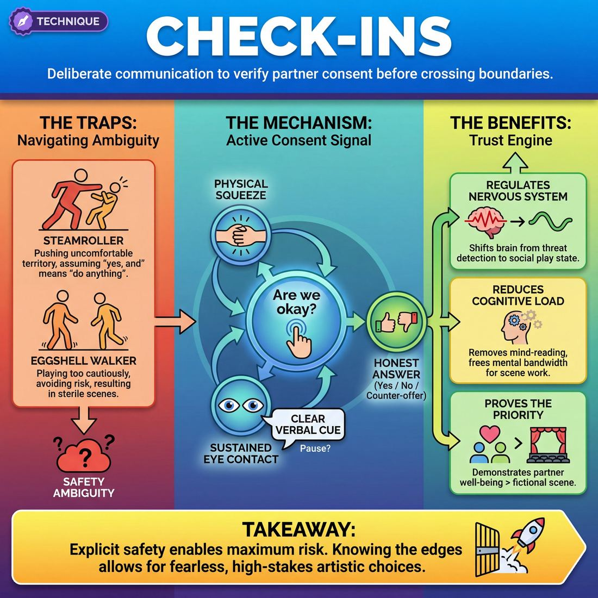

# 🎯 Check-ins

> *A drillable muscle that trains **Boundary Navigation**.*

{ .infographic }

## 🎯 The essence

**Check-ins** are a foundational safety technique where improvisers deliberately communicate—via a physical squeeze, sustained eye contact, or a clear verbal cue—to verify their partner's consent before crossing a physical, emotional, or thematic boundary. As a focused exercise, it isolates the critical muscle of **Boundary Navigation**, training players to momentarily prioritize their partner's real-world well-being over the fictional scene. By explicitly practicing how to ask *"Are we okay to go here?"* and how to honestly answer, improvisers build a resilient container of mutual trust that makes truly fearless, high-stakes play possible.

## 🎓 What it trains

At its core, the Check-in technique isolates and drills **Boundary Navigation**—the ability to actively read, respect, and communicate personal limits while co-creating a scene. 

Improv requires vulnerability, physical proximity, and emotional risk. Without a clear system for navigating boundaries, improvisers face two common traps:

*   **The Steamroller:** Pushing a partner into uncomfortable physical or emotional territory for the sake of a laugh or a dramatic beat, falsely assuming that "yes, and" means "you must accept everything I do to you."
*   **The Eggshell Walker:** Playing so cautiously out of fear of crossing an invisible line that the scene becomes sterile, polite, and devoid of stakes.

Novice improvisers often know that safety matters, but under the intense cognitive load of performance, they forget to verify it. Check-ins remove the guesswork. They provide a discrete, observable mechanism to confirm consent—whether before a show, during a rehearsal exercise, or subtly in the middle of a scene. 

!!! abstract "Key idea: Safety Enables Risk"
    Check-ins are rooted in the domain of **The Partner**. The ultimate goal of this domain is to move from merely "acting with someone" to achieving a "shared mind." You cannot share a mind with a partner whose brain is in a state of panic, discomfort, or self-protection. By establishing a reliable container of mutual safety, Check-ins actually *increase* the ensemble's capacity for bold, dangerous-feeling artistic choices.

By practicing Check-ins as a deliberate technique, improvisers build the muscle memory to pause, connect with their partner, and verify comfort. Over time, this explicit communication trains situational awareness, paving the way for the advanced ability to sense a partner's limits and adjust without ever needing to break the reality of the scene.

## 💡 Why it works

At its core, the technique works by eliminating a specific, toxic kind of ambiguity. While narrative ambiguity—not knowing what happens next—is the lifeblood of improvisation, **safety ambiguity**—not knowing if your partner is okay—is its poison. 

Check-ins function as the engine of trust by exploiting three underlying mechanisms:

*   **Regulating the Nervous System:** When an improviser is unsure if a scene partner is comfortable with a physical escalation (like a sudden lift) or a heavy thematic turn, their brain splits focus. Part of the mind tries to invent dialogue, while the amygdala runs active threat detection. A check-in immediately signals the nervous system that the environment is secure, shifting the brain out of "fight, flight, or freeze" and back into a state of social play.
*   **Reducing Cognitive Load:** Guessing whether a partner is genuinely enjoying a dark scene or secretly panicking requires immense mental bandwidth. By establishing an explicit, observable channel of consent, check-ins remove the need to mind-read. This frees up cognitive resources, allowing players to focus entirely on the scene work.
*   **Proving the Priority:** Group dynamics thrive on demonstrated care. A check-in proves, in real-time, that the human being on stage is more important than the joke, the scene, or the audience. This observable action proves that the ensemble is a container of mutual safety.

!!! abstract "The Paradox of Permission"
    Counterintuitively, establishing strict boundaries through check-ins doesn't limit play—it expands it. When improvisers know exactly where the edges are, they can sprint toward them at full speed without fear of falling off a cliff. Explicit permission creates maximum creative freedom.

Ultimately, check-ins work because they replace assumed consent with **active consent**. They transform safety from a vague, passive hope into a concrete, repeatable action, ensuring that as the stakes of the scene rise, the trust between the partners rises to meet it.

## 🧩 The setup

Before diving into the exercise, the facilitator must establish a calm, focused environment. Because this technique isolates a skill that requires vulnerability, the physical and emotional setup of the room is just as important as the instructions.

*   **Players & arrangement:** Divide the ensemble into pairs. Have them stand or sit facing each other, close enough to maintain gentle eye contact but with a comfortable buffer of personal space. Spread the pairs out across the room so each duo has acoustic privacy; they should not feel like they have to shout or that they are being overheard.
*   **Space & materials:** A quiet, open room. No props or chairs are strictly necessary, though players with mobility needs should be encouraged to sit. 
*   **Time:** 1–2 minutes per round; 10–15 minutes total to allow for role swaps and brief partner discussions.
*   **Roles:** 
    *   **Player A (The Initiator):** Proposes a specific physical action, spatial adjustment, or emotional intensity.
    *   **Player B (The Receiver):** Listens to their own internal boundary and responds with a clear "Yes," "No," or a modified counter-offer. *(Roles will swap).*
*   **Prerequisites:** The group must have already had a foundational discussion about consent in improv. Players should already know the ensemble's emergency stop word (e.g., "Cut," "Hold," or "Safety").

!!! tip "Setting the room tone"
    Keep the energy in the room grounded. If the group has just finished a high-energy, chaotic warm-up, take a moment to have everyone take a collective breath and lower their volume before pairing them up.

!!! quote "How to introduce it"
    "Improv asks us to take massive risks together, but we can only take those risks when we know we are safe. Today, we are isolating the muscle of the **Check-in**. Boundaries aren't static; they change based on the day, the scene, and the partner. In this exercise, we are going to practice explicitly asking our partner where their limits are *right now*, and we are going to practice giving honest, guilt-free answers. The goal isn't to get to a 'Yes'—the goal is to get to the truth."

## ⚙️ The mechanics

The objective of the Check-in drill is to make Boundary Navigation an observable, conscious habit. It isolates the critical moment *before* a physical, emotional, or thematic threshold is crossed, forcing players to communicate human-to-human before proceeding character-to-character.

!!! abstract "The Core Loop"
    **Escalating Offer ➔ Pause & Ask ➔ Honest Answer ➔ Adjust & Continue**  
    The goal is not to avoid intense or physical play, but to build the explicit communication bridge that makes that play entirely safe.

### The Flow of Play

A standard round is played in pairs. One player acts as the **Initiator** (driving the action toward a boundary) and the other as the **Receiver** (holding and communicating the boundary). 

1.  **The Escalating Offer:** The Initiator starts a scene and deliberately introduces an offer that approaches a boundary. This could be physical proximity (moving in for a hug or a fight), emotional intensity (yelling), or a potentially sensitive thematic topic.
2.  **The Explicit Check-in:** Just before crossing the threshold, the Initiator pauses the scene's momentum. They drop character slightly, make direct eye contact with their partner, and ask a clear, unambiguous question about their comfort. 
3.  **The Authentic Response:** The Receiver checks their actual, personal comfort level in that exact moment. They reply with a clear "Yes," "No," or a modified boundary (e.g., "Yes, but only on my shoulder"). 
4.  **The Seamless Adjustment:** The Initiator receives the answer as a gift. If the answer is "Yes," they proceed with the action. If the answer is "No" or modified, they instantly adjust their action to respect the limit.
5.  **The Continuation:** Both players instantly snap back into the reality of the scene, treating the adjusted action as the natural, intended course of the narrative.

!!! example "In a scene"
    **Initiator (Character):** "I've missed you so much!" *(Steps forward, arms open for a tight embrace. Pauses, drops character slightly, makes eye contact.)* "Are you okay with a hug?"  
    **Receiver (Actor):** "No, let's just hold hands."  
    **Initiator (Character):** *(Instantly takes their hands instead, beaming)* "Just looking at you is enough."

### Rules & Constraints

To build the muscle effectively, the drill relies on strict behavioral constraints:

*   **Eye contact is mandatory:** The check-in must happen actor-to-actor. Breaking the fourth wall of the scene ensures the question is taken seriously and not brushed off as a character choice.
*   **"No" is a complete sentence:** The Receiver never has to explain *why* a boundary exists. They simply state the limit.
*   **No apologizing:** If a boundary is hit, the Initiator must *not* say "I'm sorry." They simply adjust. Apologizing forces the Receiver to comfort the Initiator (e.g., "No, it's fine, don't worry!"), which undermines the Receiver's right to hold the boundary.
*   **No joking during the check-in:** The check-in itself must be delivered neutrally and sincerely. Using a goofy voice or making a joke of the question pressures the Receiver to say "yes" to keep the bit alive.

### Ending and Resetting
A single round typically lasts for 2 to 3 minutes, or until the pair has successfully navigated three distinct check-ins. The coach calls "Scene," and the players immediately reset, swapping the Initiator and Receiver roles so both players practice asking for and stating boundaries.

## 🎬 Sample round

!!! example "Sample round: The 'Pause and Check' Drill"
    **Context:** The ensemble is practicing explicit verbal check-ins. Players are instructed to freeze the scene, drop character, and ask for consent before initiating physical contact or crossing a potential boundary. 

    **1. The Trigger (Approaching a boundary)**
    **Leo (as 'Returning Soldier'):** "Eleanor! I told you I'd make it back!"
    *(Leo runs across the stage toward Maya, opening his arms wide, clearly intending to lift her into a spinning hug.)*

    **2. The Pause & Ask (Breaking the reality)**
    *(Leo stops two feet away, drops his character's intense energy, and makes direct, neutral eye contact with Maya.)*
    **Leo (as improviser):** "Check-in: I'd like to pick you up by the waist and spin you. Are you okay with that?"

    **3. The Honest Response (Setting the boundary)**
    **Maya (as improviser):** "I tweaked my lower back yesterday. Let's just do a tight hug with my feet on the floor instead."

    **4. The Adjustment (Confirming the new plan)**
    **Leo:** "Got it. Tight hug, feet on the floor."

    **5. The Re-entry (Resuming the scene)**
    *(Both players take a breath, re-engage their character's emotions, and step into the agreed-upon action.)*
    **Leo (as 'Returning Soldier'):** *(Wraps Maya in a fierce, grounded hug)* "I missed you every single day."
    **Maya (as 'Eleanor'):** *(Burying her face in his shoulder)* "Don't you ever leave again."

!!! note "The invisible check-in"
    As improvisers move toward the **Proficient** and **Master** stages, this exact same sequence happens in a fraction of a second without breaking the scene. Leo might offer his hands and raise an eyebrow (the ask); Maya might step in but plant her feet heavily and grab his shoulders (the boundary); Leo reads the physical cue and turns the lift into a grounded embrace (the adjustment)—all while staying entirely in character. Drilling the explicit version builds the muscle for the invisible one.

## 🎚️ Variations & progressions

The practice of checking in should evolve as an improviser’s capacity grows. What begins as a deliberate, explicit pause in the action eventually becomes a seamless, invisible thread of communication between partners. 

Here is how to ramp the difficulty of the technique, moving from overt safety mechanics to subtle, integrated scene-work.

**1. The "Freeze and Ask" (Advanced Beginner)**
At this stage, the goal is simply to build the muscle memory of prioritizing safety over the scene. Players are instructed to literally break character, freeze the action, and ask a direct question before escalating physical or emotional intensity.
*   **The Action:** "I want to pick you up right now. Are you okay with that?"
*   **The Focus:** Overcoming the fear of "ruining the scene" to ensure the partner is safe. It trains the **Advanced Beginner** to actually use the check-in under pressure rather than just agreeing to it in theory.

**2. The Physical Anchor / Squeeze (Competent)**
Once players are comfortable stopping a scene, introduce a non-verbal, continuous check-in. Players maintain physical contact (like holding hands or resting a hand on a shoulder) during an intense scene. 
*   **The Action:** A gentle squeeze means "I'm good, keep pushing." Releasing the grip or going limp means "I've reached my limit, de-escalate."
*   **The Focus:** This allows **Competent** improvisers to read and respect limits while actively improvising, keeping the scene's momentum alive while maintaining a hard-wired safety line.

!!! example "In a scene: The In-Character Check (Proficient)"
    As improvisers become **Proficient**, they learn to sense comfort levels and adjust without breaking the reality of the scene. They use dialogue that makes sense to the characters but serves as a real-world check-in for the actors.
    *   *Actor A (stepping close, raising voice):* "I am so angry I could tear this whole room apart. Are you ready for that?"
    *   *Actor B (feeling overwhelmed in reality):* "No. Please sit down. I need you to speak quietly."
    *   *Result:* Actor A respects the boundary, sitting down. The scene continues, fueled by the real emotional truth, but the real-world boundary is honored.

**3. The Silent "Green Light" (Master)**
At the highest level of boundary navigation, the check-in requires no words and no pre-arranged squeezing. It relies entirely on profound physical and emotional awareness.
*   **The Action:** Before a stage slap, a sudden kiss, or a massive emotional eruption, the improviser catches their partner's eye. They look for the "green light"—a softening of the face, a grounded breath, or a subtle nod that signals readiness. If they see tension, wide eyes, or a held breath, they instantly pivot the choice.
*   **The Focus:** The **Master** improviser reads micro-expressions and breath to anticipate boundaries before they are crossed. The check-in is entirely invisible to the audience, yet the ensemble trusts the total risk-taking because the safety net is absolute.

!!! tip "Ramping difficulty in rehearsal"
    To drill this progression, run a "Boundary Gauntlet." Have two players start a scene and instruct them to escalate the emotional intensity every 30 seconds. Require them to use Level 1 (Freeze and Ask) for the first escalation, Level 2 (Physical Anchor) for the second, and Level 3 (In-Character) for the third. This forces them to practice the *mechanic* of checking in across different levels of subtlety.

## 🧑‍🏫 Coaching notes

!!! tip "On stage: Check the human, not the character"
    The single most important cue you can give during this technique is to remind players to drop the theatrical mask for a split second. A check-in only works if it is **player-to-player**, not character-to-character. Call out: *"Look at your partner's actual eyes. Are they breathing? Are they okay?"*

When guiding players through Check-ins, your primary job as a coach is to normalize the pause. Novice improvisers often feel that stopping or slowing down a scene to check in is a "failure" of momentum. You must actively coach them out of this mindset, proving that safety enables bolder play.

**High-impact side-coaching cues:**

*   **"Slow down. Wait for the answer."** — Players often throw out a check-in (like a squeeze of the hand or a questioning look) and immediately barrel forward. Force them to hold the moment until their partner actively confirms or adjusts.
*   **"Breathe together."** — If the energy gets frantic and a physical or emotional boundary is approaching, cue them to physically regulate. A shared breath is the most fundamental non-verbal check-in.
*   **"Acknowledge the boundary."** — When a player sets a limit or uses a "Cut" mechanic, coach the partner to visibly acknowledge it, reinforcing the container of mutual safety.
*   **"Make it obvious."** — Encourage Advanced Beginners to over-communicate their check-ins initially. Subtlety comes later; absolute clarity is required now.

**What 'good' looks and sounds like:**

You will know the technique is landing when you observe the following shifts in the room:

*   **The gaze shifts:** You will see a distinct, momentary change in the players' eyes—a flash of genuine, out-of-character connection before they dive back into the scene.
*   **Tension dissolves:** Physical stiffness in the shoulders, neck, or jaw relaxes after a successful check-in, as the cognitive load of uncertainty is removed.
*   **Limits are treated as gifts:** Instead of freezing or apologizing when a partner signals a boundary, the improviser pivots smoothly, treating the limit not as a roadblock, but as a helpful parameter for the scene.

!!! warning "Watch out for the 'Obligatory Thumbs-Up'"
    If players are just mechanically nodding or giving a thumbs-up without actually reading their partner's physical state, stop the exercise. A check-in requires **Active Listening**, not just ticking a bureaucratic box. Make them repeat the check-in until you see genuine comprehension pass between them.

## 🧭 Debrief & reflection

The debrief is where the mechanical repetition of Check-ins translates into the deeper skill of Boundary Navigation. Because checking in requires players to briefly step out of the fiction and prioritize the human relationship, the post-exercise discussion should focus on the emotional and physical experience of that shift.

Use these questions to guide the ensemble's reflection:

*   **For the initiator:** "What did it feel like to pause the momentum of the scene to ask for consent? Was there an internal hurdle you had to cross?"
*   **For the receiver:** "How did your partner’s check-in affect your physical tension? Did it change your willingness to commit to the scene?"
*   **For the ensemble:** "Did anyone notice a scene where the check-in actually *heightened* the intensity or intimacy of the moment, rather than deflating it?"
*   **On boundaries:** "Did anyone say 'no' or adjust a boundary? How did the scene adapt afterward?"

### What a good debrief surfaces

A successful reflection period will often reveal a shared "aha" moment: players typically confess that they feared checking in would "ruin the magic" or break the reality of the scene. However, receivers almost universally report that being checked in on made them feel profoundly supported, allowing them to play *harder* and with more vulnerability. 

You will also hear players articulate the transition across the maturity progression. Novices will admit they forgot to check in under pressure, while more experienced players will note how establishing a clear boundary allowed them to read and respect limits without panicking.

!!! tip "Facilitation Tip"
    **Normalize the awkwardness.** Players may feel clumsy or robotic when first practicing explicit check-ins. Acknowledge this. Remind them that they are building a new muscle; the clunkiness is temporary, but the trust they are building with their scene partners is permanent.

## ⚠️ Common pitfalls

!!! warning "Watch out: The Cognitive Load Drop"
    The single biggest novice trap is simply forgetting to check in when the scene gets complicated. When an improviser’s brain is flooded with planning their next line, remembering the plot, or chasing a laugh, their awareness of their partner’s physical and emotional boundaries vanishes. Under cognitive load, safety protocols are often the first thing dropped. 
    
    **The Fix:** Drill check-ins in low-stakes exercises until they become muscle memory. You cannot rely on your conscious brain to remember them during a high-stakes performance.

Even when improvisers remember to initiate a check-in, the execution can falter. Watch out for these common mechanical traps:

**The Steamroller Check-in**
*   **The Trap:** Asking for consent but moving forward before the partner can actually respond. You make eye contact and ask, "Can I grab your shoulders?" but your hands are already moving. You are checking a box, not checking in.
*   **The Fix:** Implement the "Beat of Breath." Ask, pause for one full inhale/exhale, and wait for a clear, affirmative response (verbal or physical) before closing the distance.

!!! example "In a scene: Fixing the Steamroller"
    **Trap:** "I'm so mad at you!" *(Player A steps forward, raises hands, whispers "Can I grab you?" and immediately grabs Player B's lapels before B can blink).*  
    **Fix:** "I'm so mad at you!" *(Player A steps forward, raises hands, makes eye contact. "Can I grab your jacket?" Player A **waits**. Player B nods. Player A grabs the jacket).*

**The Vague "You Good?"**
*   **The Trap:** Using generic phrases that don't specify the boundary being crossed. If you ask "Is this okay?" while moving toward your partner, they don't know if you intend to hug them, yell at them, or pick them up. They cannot consent to an unknown action.
*   **The Fix:** Name the specific action. Ask, "I'm going to pick you up now, okay?" or "Can I get close to your face?" 

**The Pre-Show Blanket Consent**
*   **The Trap:** Assuming that because you checked in backstage, or because you have played with this person for years, you don't need to check in before a sudden escalation in physical or emotional intensity. 
*   **The Fix:** Treat consent as ongoing and situational. A new, unexpected escalation in the scene always requires a new check-in in the moment.

## 🌟 What mastery looks like

At the highest level of practice, a Check-in ceases to feel like a mechanical pause or an interruption of the scene. Instead, it becomes a continuous, almost invisible thread of communication between partners. The master improviser does not wait for a moment of crisis to verify consent; they maintain a constant, proactive baseline of connection.

Observable markers of mastery include:

*   **Seamless integration:** Verbal check-ins are delivered in character and match the emotional tone of the scene. A whispered "You good?" or a deliberate "Are you sure you want to do this?" looks like an intimate character moment to the audience, but serves as a vital safety tether for the partner.
*   **Micro-calibration:** The improviser reads their partner's breath, muscle tension, and micro-expressions. They sense a shift in comfort levels and adjust their physical proximity or emotional intensity *before* a boundary is breached.
*   **Unhesitating adjustments:** If a partner signals a boundary (verbally or non-verbally), the master improviser pivots instantly and joyfully. They incorporate the boundary into the reality of the scene without dropping character, freezing up, or making the partner feel guilty for the adjustment.

!!! example "In a scene"
    Two improvisers are playing a highly charged, physically aggressive argument. 
    **Improviser A** steps into **Improviser B's** personal space, raising their voice. As they do, A makes direct, soft eye contact (a deliberate contrast to the character's anger) and gives a subtle, grounding squeeze to B's forearm. 
    **B** squeezes back, signaling *I'm okay, keep going*. 
    The audience sees a dramatic, terrifying escalation; the improvisers experience a moment of profound mutual care.

## 🔗 Why it matters

At its core, the technique of Check-ins is the operational engine of Boundary Navigation. While boundaries are the invisible, internal lines of personal comfort and consent, check-ins are the active, observable tools we use to locate and respect those lines in real-time. Without them, navigating a partner's boundaries relies entirely on guesswork—a dangerous game in an art form built on spontaneity.

In the domain of **The Partner**, the ultimate goal is to elevate the work from merely "acting with someone" to achieving a **shared mind**. This level of deep, intuitive connection is impossible if a player's internal bandwidth is consumed by self-protection. Check-ins build the necessary container of mutual safety required for that mind-meld to occur. Every time you check in—whether through a verbal confirmation in a workshop or a subtle, questioning glance on stage—you send a vital signal: *I see you, I respect your limits, and your well-being matters more than this scene.*

Mastering this muscle ripples outward, transforming the wider craft of an ensemble in three key ways:

*   **It frees up cognitive load:** When players trust that their partner will check in before escalating physical or emotional intensity, they stop bracing for impact. They can stay fully present in the moment.
*   **It enables radical risk-taking:** Players will commit to darker, more physical, or more emotionally vulnerable scenes when they know a safety net is actively being maintained.
*   **It prevents ensemble fracture:** Unspoken boundary crossings breed quiet resentment. Routine check-ins normalize communication, preventing small discomforts from calcifying into team-destroying distrust.

!!! abstract "The Paradox of Safety"
    It is a common misconception that checking in "kills the magic," slows down a scene, or dilutes the spontaneity of improv. In reality, explicit safety protocols eliminate hesitation. When improvisers know exactly how to communicate and check limits, they are free to play with absolute, uninhibited commitment right up to the very edge of those limits. Knowing the brakes work perfectly is exactly what allows you to drive the scene as fast and as far as the story requires.

## 📚 References & Further Reading

### Foundational sources
*   **Chelsea Pace, *Staging Sex: Best Practices, Tools, and Techniques for Theatrical Intimacy* (2020)** — The foundational text on theatrical intimacy. Pace’s frameworks for establishing boundaries, using "button" or "fence" mechanics, and implementing consent-forward practices have been widely adapted by the improv community to replace assumed consent with active consent. [Routledge](https://www.routledge.com/Staging-Sex-Best-Practices-Tools-and-Techniques-for-Theatrical-Intimacy/Pace/p/book/9781138596498)
*   **Intimacy Directors and Coordinators (IDC) & Theatrical Intimacy Education (TIE)** — The pioneering organizations that formalized consent, check-ins, and boundary navigation for stage and screen. Their methodologies heavily influence modern improv safety policies, proving the paradox that strict boundaries expand creative freedom rather than limit it. [IDC Professionals](https://www.idcprofessionals.com/) | [Theatrical Intimacy Education](https://www.theatricalintimacyed.com/)

### Practitioner guides & manuals
*   **Adam Meggido, *Improv Beyond Rules: A Practical Guide to Narrative Improvisation* (2019)** — Explores the principles of "listening, accepting, committing," which serve as the behavioral foundation for negotiating boundaries. Meggido's work highlights how accepting a partner's real-world limits is a prerequisite for committing to high-stakes narrative play. [Nick Hern Books](https://www.nickhernbooks.co.uk/improv-beyond-rules)
*   **Mary Scruggs & Michael J. Gellman, *Process: An Improviser's Journey* (2008)** — A classic guide to the Second City method that emphasizes the necessity of ensemble trust, focus, and mutual support. It illustrates how a reliable container of safety is required before improvisers can successfully navigate emotional and thematic risks. [Northwestern University Press](https://nupress.northwestern.edu/9780810124733/process/)

### Research & theory
*   **Amy Edmondson, *Psychological Safety and Learning Behavior in Work Teams* (1999)** — The seminal academic paper defining psychological safety as the shared belief that a team is safe for interpersonal risk-taking. This perfectly articulates the core mechanism of Check-ins: proving to the ensemble that the environment is secure enough for vulnerability. [Administrative Science Quarterly](https://journals.sagepub.com/doi/10.2307/2666999)
*   **Marne Maykowskyj Nordean, *Assessing the Impacts of Work-Related Applications of Improvisation Training on Psychological Safety in Teams* (2020)** — A Pepperdine University study directly linking the core tenets of improv to the development of psychological safety. It reinforces the idea that explicit communication and mutual respect reduce cognitive load and fear of failure. [Pepperdine Digital Commons](https://digitalcommons.pepperdine.edu/etd/1160/)
*   **Peter Felsman, Sanuri Gunawardena, & Colleen Seifert, *Improv experience promotes divergent thinking, uncertainty tolerance, and affective well-being* (2020)** — University of Michigan research demonstrating how improv training reduces social anxiety and shifts the brain out of threat detection. This supports the neurological argument that safety techniques regulate the amygdala, allowing players to remain in a state of social play. [Thinking Skills and Creativity](https://doi.org/10.1016/j.tsc.2020.100632)

### Talks, videos & courses
*   **Kaci Beeler, *Intimacy & Consent in Improv* (The Improv Conspiracy Podcast, 2020)** — An in-depth interview with the veteran improviser and director on how explicit conversations around intimacy and boundaries actually open up scene work to more possibilities, directly addressing the "Steamroller" and "Eggshell Walker" traps. [Apple Podcasts](https://podcasts.apple.com/au/podcast/kaci-beeler-on-intimacy-consent-in-improv/id1505213401?i=1000496035000)
*   **Jessica Steinrock, *Intimacy Coordination & Consent* (Various platforms)** — The CEO of IDC and former improviser frequently lectures and creates educational content on how careful negotiation and clear communication enable actors to perform vulnerable scenes safely. Her work bridges the gap between scripted intimacy and spontaneous boundary navigation. [TikTok / IDC](https://www.tiktok.com/@intimacycoordinator)

### Communities & adjacent reading
*   **Contact Improvisation Consent Culture** — An adjacent movement in physical dance improvisation that provides extensive, highly applicable resources on affirmative consent, check-ins, and navigating power dynamics in spontaneous, unscripted physical play. [Contact Improv Consent Culture](https://contactimprovconsentculture.com/)
*   **Brooklyn Comedy Collective (BCC) & Highwire Improv** — Modern improv theaters that actively host seminars (like BCC's "Consent in Improv" series) and publish explicit boundary and check-in policies for their ensembles, normalizing the practice of verifying comfort before and during performances. [BCC](https://www.brooklyncc.com/)

## 💬 Quotes & Anecdotes

!!! quote "— Mia Schachter, *Backstage* (2024)"
    "Sometimes people think that's limiting, but in my experience, the feedback that I've gotten from actors is the complete opposite. When you know what it is that you can do and what's in your toolkit, you can actually feel way freer to play around and try new things—because your scene partner has told you, 'You can touch me here; you can touch me there.'"

!!! quote "— Chelsea Pace, *OnStage Blog* (2021)"
    "We're asking an actor to deprogram decades of training and to go against everything they were taught, to go against the first rule of improv and say no. [...] We have a whole set of tools we use to support consent in the process. It is easier to say, 'I have a question' or 'that's a boundary' or 'that doesn't work for me' than to say no."

!!! quote "— Jessica Renae, *Backstage* (2022)"
    "What it does is it lays down a roadmap for actors to follow. We talk about consent, we talk about where hands are supposed to go—what is the story we're trying to tell? This way, when actors are in the moment and rehearsing, they know exactly what they are consenting to at all times, and they're never left up to the variable of what another actor feels like doing that day."

!!! quote "— Katy Schutte, *How Yes And changed with #MeToo* (2019)"
    "I'm not hedging or editing or auditioning the scene, I'm enjoying my own boundaries and Yes And-ing myself."

!!! quote "— Jacie Hood, *HowlRound Theatre Commons* (2020)"
    "If I put my hand on your cheek, that's my cue to ask you if it's alright to kiss in the scene as we're creating it. Then the second actor can nod or shake their head, or give whatever other agreed-upon sign they've worked out."

### Where it comes from

The formalization of "Check-ins" and boundary navigation in improv is a recent evolution, gaining significant traction in the late 2010s alongside the #MeToo movement and the rise of Intimacy Direction in theater and film. Historically, improv relied heavily on a literal interpretation of "Yes, And," which sometimes pressured performers into accepting uncomfortable physical or thematic offers for the sake of the scene. As intimacy professionals like Chelsea Pace (co-founder of Theatrical Intimacy Education) and Mia Schachter began codifying consent practices for actors, improv theaters adapted these tools. The community shifted from relying on "assumed consent" to utilizing explicit pre-show and in-scene check-ins, recognizing that psychological and physical safety are prerequisites for bold, uninhibited play.

### A telling example

**The Pre-Show Circle**  
A standard practice adopted by many modern improv ensembles is the pre-show boundary check-in. Before stepping on stage, the team forms a circle and each player states their physical and emotional boundaries for that specific day. One player might say, "I have a bad shoulder, so please no lifting today," while another might say, "I'm fine with physical contact, but please don't touch my face," or "I'm dealing with some personal grief, so I'd like to avoid scenes about hospitals." This explicit communication removes the guesswork, allowing the ensemble to play fearlessly within those clearly defined parameters.

**The In-Scene Telegraph**  
Boundary navigation also happens subtly in the middle of a scene through "telegraphing." If an improviser wants to initiate physical contact, they broadcast the move before executing it. For example, instead of suddenly grabbing a scene partner, a player might say, "You look like you need a hug," while opening their arms and pausing. This micro-check-in gives the partner a moment to process the offer and either accept the embrace or make a character-driven counter-offer (e.g., holding up a hand and saying, "Don't touch me, I'm still mad at you") without ever breaking the reality of the scene.

## 🧭 Explore the framework

- ⬆️ **Skill it trains:** [Boundary Navigation](02_S6__boundary-navigation.md)
- 🎭 **Domain:** [The Partner](02_D__the-partner.md)
- 🔁 **Sibling techniques:** [Cut calls](02_S6_T2__cut-calls.md), [Negotiating physical contact](02_S6_T3__negotiating-physical-contact.md)
