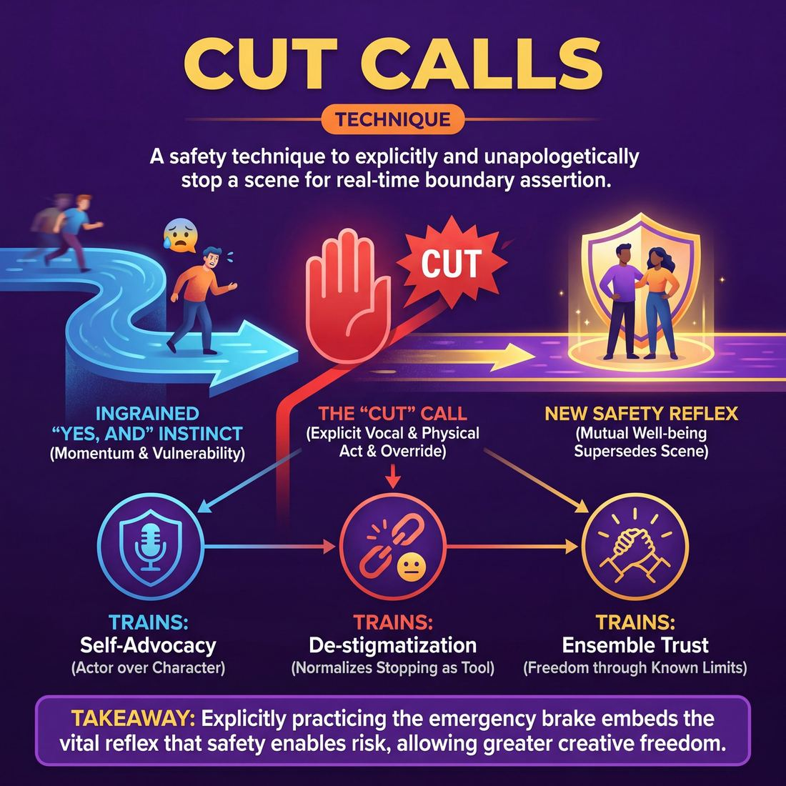

# 🎯 Cut calls

> *A drillable muscle that trains **Boundary Navigation**.*

{ .infographic }

## 🎯 The essence

The **Cut call** is a foundational safety technique where improvisers practice explicitly and unapologetically stopping a scene by saying the word "Cut." It isolates and trains a single, vital muscle: the ability to assert a personal boundary in real-time. By repeatedly practicing the physical and vocal act of halting the action, players override the deeply ingrained improvisational instinct to "Yes, And" everything. It embeds a crucial reflex: mutual safety and the well-being of the partner always supersede the demands of the scene.

## 🎓 What it trains

At its core, this technique isolates and strengthens **Boundary Navigation**—the ability to establish, communicate, and respect personal limits while performing. 

Improvisers are trained relentlessly to say **"Yes, And."** We are taught to accept offers, commit to the reality of the scene, and support our partners. But this foundational rule creates a vulnerability: what happens when an offer crosses a line? Whether it is a sudden physical escalation (like being unexpectedly picked up), an intensely triggering emotional topic, or simply a comedic premise that makes a player deeply uncomfortable, the improviser's instinct is often to freeze or reluctantly go along with it to avoid "ruining" the scene. 

Cut calls exist to solve this exact problem. They provide a pre-agreed, unambiguous emergency brake. 

By practicing this mechanic, improvisers train several vital muscles simultaneously:

*   **Self-advocacy:** Learning to prioritize the *actor's* well-being over the *character's* narrative.
*   **De-stigmatization:** Normalizing the act of stopping a scene so that it feels like a standard, professional tool rather than a dramatic failure or a personal attack.
*   **Ensemble trust:** Proving to your scene partners that you will explicitly tell them if they go too far, which paradoxically allows them to play with much greater freedom.

!!! abstract "The Deeper Principle: Safety enables risk"
    You cannot play at the top of your intelligence if part of your brain is secretly scanning the environment for danger. Cut calls build a container of mutual safety. When an ensemble knows exactly where the boundaries are and trusts that anyone can enforce them, the cognitive load of anxiety vanishes.

In the maturity progression of an improviser, learning to use a Cut call marks the critical transition from a Novice—who knows safety matters but freezes under the pressure of the lights—to an Advanced Beginner who can actively deploy boundaries in real-time. Ultimately, this explicit practice paves the way for higher-level mastery, where improvisers learn to sense each other's comfort levels and adjust fluidly before a Cut is ever needed.

## 💡 Why it works

Improvisers are heavily conditioned by the instinct to maintain forward momentum and never block an offer. While this is the engine of scene creation, it becomes a trap when an improviser feels physically or emotionally unsafe. Drilling Cut calls works by deliberately hacking this deep-seated conditioning. 

Here is the engine under the hood:

* **Overriding the momentum reflex:** In a live scene, the pressure to "keep the scene alive" is immense. By isolating the act of stopping into a repeatable drill, improvisers build a competing muscle memory. They learn that halting momentum is an available, valid, and celebrated choice.
* **Desensitizing the "emergency" response:** In untrained ensembles, stopping a scene mid-flow feels like a crisis or a punishment. Drilling Cut calls strips the action of its emotional baggage. It normalizes the word "Cut" (or a designated physical gesture) as a neutral, mechanical tool rather than a dramatic red alert.
* **Lowering the threshold for action:** When you have never practiced asserting a boundary on stage, the friction to do so in real-time is incredibly high. An improviser might rationalize the discomfort ("it's not *that* bad") or wait for a coach to step in. Practicing the physical and vocal act lowers the activation energy required to use it when it actually matters.

!!! note "The Power of Somatic Familiarity"
    You cannot think your way into setting a boundary under pressure; your body has to know what it feels like to stand your ground, raise your voice, and stop the train. This technique exploits somatic familiarity—training the physical body to act before the anxious mind can talk it out of it.

## 🧩 The setup

Before diving into the exercise, the facilitator must establish a low-stakes environment where stopping a scene feels just as celebrated as starting one. Because improvisers are heavily conditioned to agree, practicing Cut calls requires explicit permission to break that conditioning.

Here is what you need to arrange before play begins:

*   **Players & Arrangement:** Pairs. For the first time running this, have all pairs work simultaneously, scattered around the room. This lowers the performance pressure and allows players to practice the mechanic without an audience. Once comfortable, transition to one pair at a time center stage.
*   **Space & Materials:** An open room. No specific materials are required, though having a few chairs available allows for seated scenes if players prefer.
*   **Time:** 10–15 minutes total. Allocate 2–3 minutes per round, ensuring both partners get the opportunity to initiate a Cut.
*   **Roles:** 
    *   **Scene Partners:** Two improvisers tasked with initiating a standard scene while actively looking for an opportunity to use the mechanic.
    *   **Facilitator:** Roams the room to ensure the Cut is being respected instantly, without negotiation or apology.
*   **Prerequisites:** Players should already be capable of basic two-person scene work. Crucially, this exercise must be preceded by a foundational conversation about **boundaries**—defining what physical, emotional, and content limits are, and establishing that safety always supersedes the scene.

!!! quote "How to introduce it"
    "In improv, we spend a lot of time learning how to say 'yes.' But a 'yes' is only meaningful if we know we have the power to say 'no.' Today, we are going to practice using our brakes. 
    
    You are going to start a normal two-person scene. At some point, I want one of you to say the word 'Cut' and make a 'T' with your hands. For this drill, you don't need a *real* boundary violation to do this. You can call 'Cut' because your partner stepped a little too close, because they endowed you with a name you don't like, or simply because you want to practice getting the word out of your mouth. 
    
    When you hear 'Cut,' the scene is over. Instantly. Drop your characters, step back, and take a breath. There are no apologies, no explanations, and no questions asked. We are just building the muscle memory of stopping, so that if we ever *need* to use it, the reflex is already there."

!!! tip "On stage"
    If your group is highly experienced but new to explicit safety tools, they may feel awkward interrupting a "good" scene. Remind them that this is a **technical drill**, not a performance. The goal is the *interruption*, not the narrative.

## ⚙️ The mechanics

The core objective of this technique is to decouple the word "Cut" from feelings of failure or guilt. By turning boundary-setting into a deliberate, repeatable drill, improvisers build the muscle memory to stop a scene *before* they are in distress, and to receive that boundary without taking it personally. 

The exercise isolates a specific **vector of escalation**—a single behavior that one partner will slowly intensify until the other partner stops them.

### The Core Loop
Two improvisers begin a scene. **Player A** (The Escalator) is tasked with gradually turning up the dial on a specific, agreed-upon behavior. **Player B** (The Boundary Setter) is tasked with monitoring their internal comfort level and explicitly stopping the action the moment they feel their boundary approaching.

### The Flow of Play

1. **Agree on the vector:** Before the scene begins, the players agree on exactly what Player A will escalate. For beginners, physical proximity is the clearest vector. Other vectors include volume, emotional intensity (e.g., anger, sadness), or thematic content (e.g., morbid humor, romantic advances).
2. **Initiate the scene:** The players get a suggestion and begin a standard, grounded two-person scene. 
3. **Gradual escalation:** As the scene progresses, Player A slowly and deliberately increases the intensity of the chosen vector. If the vector is physical proximity, Player A takes a half-step closer every few lines. 
4. **The Call:** Player B monitors their internal state. The moment they feel the *slightest* edge of discomfort—or simply decide they do not want the behavior to progress further—they break character, look at their partner, and say **"Cut"** in a clear, neutral voice.
5. **Immediate cessation:** The instant Player B says "Cut," Player A stops the behavior entirely. They drop character, step back to a neutral physical distance, and make eye contact.
6. **The Reset:** Both players take a breath. Without needing to discuss, apologize, or justify the boundary, they either restart a brand new scene or resume the current scene from a safe, de-escalated baseline.

!!! tip "On stage: Breaking the reality"
    The word "Cut" must be spoken **out of character**. If Player B says it in their character's voice, Player A might mistake it for a scene offer (e.g., *Character A: "I'm coming in for a hug!" Character B: "Cut it out!" Character A: "Never!"*). Drop your character's posture, use your normal speaking voice, and make direct eye contact.

### Rules & Constraints

To ensure the drill remains safe and effective, both players must adhere to strict constraints:

| Rule | Who it applies to | Why it matters |
|---|---|---|
| **Gradual, not sudden** | The Escalator | You cannot jump from a 2 to a 10. If you suddenly scream or lunge, you bypass the partner's ability to set an early boundary. Escalate by 10% increments. |
| **Absolute compliance** | The Escalator | "Cut" means an immediate, frozen stop. No finishing your sentence, no "just one more step," and no arguing. |
| **Zero apologies** | Both Players | The Boundary Setter must not say "I'm sorry, but Cut." The Escalator must not say "Oh my god, I'm so sorry I made you uncomfortable." Apologies introduce guilt. The boundary is a gift; simply accept it. |
| **Call it early** | The Boundary Setter | Do not wait until your boundary is actually violated. The goal is to train your early warning system. Call "Cut" when you are at a 4 out of 10 on the discomfort scale, not a 9. |

!!! example "In a scene"
    **Vector:** Physical proximity.
    
    **Player A:** *(Standing six feet away)* "I think we should paint the kitchen yellow."  
    **Player B:** "Yellow? It'll look like a giant lemon."  
    **Player A:** *(Takes a step closer)* "Exactly. Bright. Cheerful."  
    **Player B:** "I prefer slate grey."  
    **Player A:** *(Takes another step closer, now three feet away)* "Grey is for prisons, David."  
    **Player B:** *(Drops character posture, neutral voice)* "Cut."  
    **Player A:** *(Immediately stops, steps back to six feet, drops character)* "Got it."  
    *(Both players take a breath, and either start a new scene or resume the kitchen argument from six feet away).*

## 🎬 Sample round

Here is how a Cut call functions in real time during a scene, moving from escalation to boundary assertion, and finally to a safe reset.

!!! example "Sample round: The Interrogation"
    **Context:** Maya and Leo are playing a high-stakes detective scene. The emotional intensity is ramping up, and the physical distance between them is closing.

    **Leo (Detective):** "You're going to tell me where the money is, even if I have to shake it out of you." *(Leo steps aggressively into Maya's personal space, raising his voice and reaching for her shoulders.)*  
    > **[The Trigger]** The scene enters potentially uncomfortable physical territory. The boundary between character aggression and player safety begins to blur.

    **Maya (Suspect):** *(Feeling genuine discomfort with the physical proximity)* "Cut."  
    > **[The Call]** Maya uses the clear, agreed-upon word. She does not apologize, justify, or try to mask the call as a character choice. 

    **Leo:** *(Instantly dropping his character's aggressive posture, lowering his hands, and stepping back)* "Got it."  
    > **[The Immediate Yield]** Leo stops the action the millisecond the word is spoken. He drops the scene's reality to prioritize his partner's safety, without showing frustration or asking why.

    **Coach:** "Great cut, Maya. Thank you for taking care of yourself. Leo, excellent immediate drop. Let's rewind ten seconds. Leo, try escalating the tension through your intellect rather than physical space. Action."  
    > **[The Reset]** The coach normalizes the boundary, praises both players for using the tool correctly, and provides a clear, safe pivot to resume play.

## 🎚️ Variations & progressions

The progression of Cut calls moves from building the raw muscle memory of stopping a scene to seamlessly integrating boundary navigation into live performance. As improvisers mature, the goal shifts from simply surviving a boundary crossing to proactively managing mutual safety.

Here is how to ramp the difficulty and nuance of the drill, aligned with the improviser's maturity:

*   **The Mundane Cut (Novice to Advanced Beginner)**
    *   *The focus:* Destigmatizing the word "Cut" and removing the ego from being stopped.
    *   *How it works:* Players are instructed to call "Cut" on completely harmless, everyday offers. (e.g., Player A: "I brought you a coffee." Player B: "Cut!"). The scene ends immediately. 
    *   *Why it helps:* Early-stage improvisers often freeze under pressure. Practicing the physical act of yelling "Cut" on a mundane offer builds the muscle memory required to use it when a real boundary is threatened. It also trains the partner to drop their idea instantly, without asking "Why?"

*   **Cut & Rewind (Competent)**
    *   *The focus:* Resuming play smoothly after a boundary is set.
    *   *How it works:* When a player calls "Cut," the scene stops. The players take a breath, rewind the scene by two or three lines, and the player who made the boundary-crossing offer makes a completely different, safer choice. 
    *   *Why it helps:* It teaches improvisers that a boundary is not a scene-killer. It builds resilience, proving that the ensemble can course-correct and keep the show alive.

!!! example "In a scene: Cut & Rewind"
    **Player A:** "I'm so mad at you, I'm going to punch this wall!" *(Raises fist)*  
    **Player B:** "Cut. I'm not comfortable with physical aggression right now."  
    **Player A:** "Got it. Rewinding." *(Drops hands, takes a breath)* "I'm so mad at you, I'm going to write a very stern letter to the HOA!"  
    **Player B:** "You wouldn't dare!"

*   **The Proactive "Pause" (Competent to Proficient)**
    *   *The focus:* Checking in *before* a line is crossed.
    *   *How it works:* Instead of a hard stop, a player calls "Pause" to briefly step out of character and check on their partner's comfort level. (e.g., "Pause. I'm about to escalate this argument into yelling, are you good with that?"). The partner answers honestly, and they say "Unpause" to resume.
    *   *Why it helps:* This bridges the gap to higher-level play, where improvisers begin to sense comfort levels and adjust proactively. It replaces assumptions with explicit consent.

*   **In-Character Boundaries (Proficient to Master)**
    *   *The focus:* Setting and respecting limits without breaking the reality of the scene.
    *   *How it works:* Players practice setting boundaries using their character's voice and physicality. (e.g., "I really don't want to talk about the basement. Let's just stay in the kitchen.") 
    *   *Why it helps:* The partner must treat this as a potential real-life boundary and pivot immediately. This trains the ability to read micro-expressions and subtext, allowing the ensemble to navigate safety so fluidly that the audience never realizes a boundary was approached.

!!! tip "On stage: The Golden Rule of the Cut"
    No matter which variation you are playing, the partner's job remains identical: **Accept the cut instantly, graciously, and without interrogation.** If you have to ask "Wait, what did I do wrong?" you are making the boundary about your own ego, rather than your partner's safety. Save the analysis for the debrief.

## 🧑‍🏫 Coaching notes

The tone you set as a coach determines whether this technique feels like a punitive emergency brake or a standard, empowering tool. Your primary job is to normalize the action, remove the awkwardness, and keep the room feeling light and supportive.

!!! tip "Coaching: Celebrate the Cut"
    The single most important cue you can give is immediate positive reinforcement. The moment a player stops the action, say: **"Great cut. Thank you."** 
    
    This instantly removes the stigma that calling "Cut" means someone failed or ruined the scene. It frames the boundary call exactly as it should be: a successful, professional use of an actor's tool.

### What to call out in the moment
Use these side-coaching cues to guide players while they are actively drilling the technique:

* **"Play the scene, not the drill."** Remind players to actually invest in the base reality. If they are just waiting nervously to yell "Cut," the exercise loses its value.
* **"Loud and clear."** If a player mumbles or whispers the call, gently prompt them to use their full voice. The whole room should hear it.
* **"Drop the characters."** Ensure that the moment the call happens, both players physically and vocally return to being themselves, not their scene personas.
* **"No apologies needed."** Stop the inevitable "I'm sorry!" loop. Remind the partner that finding the boundary was the exact goal of the exercise. 

### What 'good' looks and sounds like
When players are successfully building their Boundary Navigation muscle, you will observe specific, repeatable behaviors:

* **Vocal clarity:** The word "Cut" is spoken with the improviser's real voice, projecting clearly over the scene work, free of character affectation.
* **Immediate physical reset:** Both players instantly drop their character posture, release any physical contact, step back into a neutral stance, and make supportive eye contact.
* **Zero justification:** The person calling "Cut" does not feel compelled to explain *why* they called it in the moment, and their partner does not ask. The boundary is simply accepted as fact.
* **Seamless resumption:** After a brief check-in or reset, the players step back into the work without lingering tension or hesitation.

## 🧭 Debrief & reflection

The debrief for Cut calls is less about the narrative of the scenes and entirely about the physical and emotional experience of using the tool. Because improvisers are heavily conditioned to agree and build, actively stopping a scene can feel unnatural, guilty, or confrontational. The reflection period must normalize this discomfort and reframe the Cut as an act of care.

Use these questions to guide the discussion after the round:

**For the player who called "Cut":**
* **What did it feel like in your body right before you called it?** (This helps players identify their own internal, physical boundary signals before they get overwhelmed).
* **Did you hesitate?** If so, what was the internal monologue that almost stopped you from speaking up?
* **How did it feel once the word was out?** (Often, players report an immediate sense of relief).

**For the partner receiving the "Cut":**
* **What was your immediate internal reaction?** (It is vital to address the common fear of "doing something wrong" versus the relief of having clear communication).
* **How easy was it to drop your character and step back into yourself?** 

**For the observing ensemble:**
* **What did you notice about the energy in the room?** 
* **How quickly did the pair recover and reset?**

!!! tip "Facilitation tip"
    Keep the focus strictly on the **mechanic of the call**, not the content of the trigger. Do not litigate *why* the player felt uncomfortable or whether the scene "deserved" to be stopped. The goal is to validate the use of the tool, not to put the caller's boundaries on trial.

**What a good debrief surfaces:**
A successful reflection will reveal that calling "Cut" is a mechanical muscle that requires deliberate reps. Novice players will often admit they felt a spike of anxiety or worried about "ruining" the scene. As the discussion unfolds, the group should arrive at a crucial shared realization: when the ensemble trusts that boundaries will be actively navigated and respected, the fear of accidentally crossing a line dissipates. This shared understanding is what transforms a group of individuals acting together into a truly shared mind.

## ⚠️ Common pitfalls

!!! warning "Watch out: The Polite Delay"
    The single biggest trap is waiting too long. Novices often feel a boundary being approached but hesitate to call "Cut" because they fear breaking the flow or offending their partner. By the time they finally speak up, the boundary has already been severely crossed, and the emotional toll is much higher. 
    **The fix:** Drill calling "Cut" early and often on *minor* or even manufactured infractions during practice. Normalize the interruption so it loses its social stigma.

When introducing Cut calls to a group, watch for these common ways the technique breaks down under pressure or cognitive load:

*   **Partner Deafness (The Stage 1 Trap):** At the Novice stage, improvisers are often so burdened by the cognitive load of planning their next line that they literally do not hear their partner say "Cut," or they register it too late and keep talking. 
    *   *The fix:* Train the physical response. When "Cut" is called, the entire room must immediately drop character, step back, and raise their hands or look at the floor. Make the cessation of play a full-body reflex.
*   **The Directorial "Cut":** Players sometimes confuse a safety boundary with a narrative preference. They might call "Cut" because they don't like where the plot is going, or because they feel the scene is failing. 
    *   *The fix:* Clearly separate scene-editing tools (like sweeps or tap-outs) from safety tools. Remind the room: "Cut is for the actor's safety, not the character's success."
*   **The Urge to Justify:** After calling "Cut," a player might immediately launch into a defensive explanation of *why* they stopped the scene, feeling they need to prove their boundary is valid.
    *   *The fix:* Enforce a "no questions asked, no explanations owed" rule. The player who called cut simply states what they need to adjust (e.g., "Let's step back from the physical intimacy"), and the scene resets. 

!!! tip "On stage"
    If you are the partner who just got "Cut," your only job is to say "Thank you." Do not apologize profusely, do not ask what you did wrong in the moment, and do not freeze up. A simple "Thank you" validates their boundary and keeps the container safe.

## 🌟 What mastery looks like

When this technique is executed at the highest level, a Cut call ceases to feel like an emergency brake and instead looks like a seamless, professional piece of stagecraft. Mastery is observable not by the *absence* of boundary navigation, but by the complete lack of friction when a boundary is asserted. 

In a master-level execution of this drill, you will observe three distinct behaviors:

*   **The Unapologetic Call:** The improviser calling "Cut" does so with a clear, projected, and entirely neutral voice. There is no wincing, no shrinking physicality, and absolutely no apologizing. They do not justify the call; they simply make it.
*   **Instant, Grateful Compliance:** The partner (and the rest of the ensemble) drops character the millisecond the word is spoken. Their physical posture shifts immediately to neutral. Often, the partner will offer a simple, sincere "Thank you," acknowledging the gift of being kept safely within bounds. There is zero defensiveness, questioning, or visible disappointment.
*   **The Seamless Reset:** The scene dissolves without lingering awkwardness. The players do not dissect *why* the cut was called unless explicitly asked to in a debrief. They simply clear the space or take a new suggestion, maintaining the momentum and energy of the rehearsal or show.

!!! example "In a scene"
    **Player A:** *(Steps forward aggressively, raising a hand)* "I told you never to come back here!"  
    **Player B:** *(Feeling their physical boundary is about to be crossed)* "Cut."  
    **Player A:** *(Instantly dropping their raised hand and softening their face)* "Thank you. Reset?"  
    **Player B:** "Reset. Let's start from the doorway."  
    *(They immediately resume play with adjusted spacing. Total time elapsed: 4 seconds.)*

Ultimately, mastery of this technique perfectly reflects the highest stage of Boundary Navigation. By treating the Cut as a routine, highly respected tool rather than a failure of the scene, master improvisers **model safety so fully the ensemble trusts total risk-taking**. 

## 🔗 Why it matters

The ability to call "Cut" is the foundational muscle of Boundary Navigation. In theory, every improviser knows they are allowed to stop a scene if they feel unsafe. In practice, the pressure of an audience, the momentum of the narrative, and the desire to be a "good partner" often override that knowledge. By drilling Cut calls as a discrete technique, we move safety from a conceptual agreement to an embodied reflex. It ensures that when a Novice is under pressure, they don't freeze and endure discomfort; instead, they have the trained muscle memory to halt the action.

This technique directly serves the ultimate goal of **The Partner** domain: achieving a "shared mind" within a container of mutual safety. You cannot share a mind with a partner if part of your cognitive load is secretly managing anxiety about where the scene is going physically or emotionally. 

!!! abstract "The sports car principle"
    Why do high-performance sports cars have such massive, expensive brakes? It isn't so they can drive slowly. It's so the driver feels safe pushing the car to its absolute limits, knowing they can stop on a dime. In improv, robust boundary navigation is your braking system. 

Zooming out to the wider craft, normalizing the Cut call transforms the culture of an ensemble. It shifts the burden of safety from the director or coach to the players themselves. When an ensemble reaches the Master level of boundary navigation, they model safety so completely that the entire group trusts total risk-taking. 

Paradoxically, practicing how to stop a scene is exactly what gives improvisers the freedom to play bolder, darker, more physical, and more emotionally vulnerable scenes. They know they can explore the absolute edges of their comfort zones because the floor and ceiling of the scene are clearly defined and protected. They know the net is there, because they know exactly how to deploy it.

## 📚 References & Further Reading

### Foundational sources
*   **Tonia Sina, *Intimate Encounters: Stage Intimacy and Sensuality* (2006)** — The pioneering academic thesis that laid the groundwork for intimacy direction, formalizing the need for explicit consent and boundary-setting in live performance. Her work established that safety must always supersede the "show must go on" mentality, a core tenet of the Cut call. 
*   **Mick Napier, *Improvise: Scene from the Inside Out* (2004)** — While not explicitly about the modern "Cut" call, Napier's book is the foundational text for breaking the dogmatic, self-sacrificing obedience to "Yes, And." It empowers the individual improviser to prioritize their own choices and comfort, hacking the deep-seated conditioning that the Cut call drill aims to override. 

### Practitioner guides & manuals
*   **Chelsea Pace, *Staging Sex: Best Practices, Tools, and Techniques for Theatrical Intimacy* (2020)** — A definitive manual that provides practical tools for boundary establishment and de-loading processes. It provides the vocabulary for actors to advocate for their physical and emotional well-being over the narrative, directly applicable to the philosophy behind improv safety tools. [Routledge](https://www.routledge.com/Staging-Sex-Best-Practices-Tools-and-Techniques-for-Theatrical-Intimacy/Pace/p/book/9780367421422)
*   **The "Ouch/Oops" Framework *(unverified single origin, Community Standard)*** — Widely adapted from diversity, equity, and inclusion (DEI) facilitation, the "Ouch/Oops" verbal mechanic is a verifiable standard in modern improv theater handbooks for addressing microaggressions and boundary crosses in real-time. While the Cut call acts as an emergency brake, "Ouch/Oops" serves as a speed bump, and both are essential tools in an improviser's boundary navigation toolkit.

### Lineage & teachers
*   **Jessica Steinrock & Intimacy Directors and Coordinators (IDC)** — Steinrock, CEO of IDC, specifically focuses on bridging intimacy direction with the unique spontaneous demands of improv comedy, leading consent workshops for improv troupes globally. Her work explicitly addresses the vulnerability created by the "Yes, And" rule and provides frameworks for stopping scenes when lines are crossed. [IDC Professionals](https://www.idcprofessionals.com/)
*   **Theatrical Intimacy Education (TIE)** — Founded by Chelsea Pace and Laura Rikard, this organization developed the "Five Best Practices" (including boundary establishment and consent-based practices) that many modern improv theaters adapt for unscripted work. Their focus on de-stigmatizing boundary enforcement aligns perfectly with the goals of the Cut call drill. [Theatrical Intimacy Education](https://www.theatricalintimacyed.com/)
*   **The Nordic LARP (Live Action Role-Playing) Tradition** — The broader LARP community is the verifiable origin of explicit safety mechanics like "Cut," "Brake," and "Lookdown," which improv theaters have increasingly adopted. Because LARP lacks an audience or a director to stop the action, players had to develop peer-to-peer emergency brakes, directly inspiring the improv Cut call. [Nordic LARP Wiki](https://nordiclarp.org/wiki/Safety_mechanics)

### Research & theory
*   **Jessica Steinrock, *Choreographing an Illusion: Intimacy Direction and the Power of Consent* (2020)** — Steinrock's doctoral research at the University of Illinois at Urbana-Champaign focuses on the power dynamics of "Yes, And" and the implementation of intimacy direction and consent mechanics in the Chicago improv scene. It provides academic backing for why improvisers freeze under pressure and why explicit safety tools are necessary to lower the threshold for action. 

### Talks, videos & courses
*   **Intimacy Directors and Coordinators (IDC) - Consent in Improv Comedy** — Verifiable workshops and training modules specifically designed to teach improvisers how to navigate the unknown without feeling unsafe, including the use of explicit boundaries and "Cut" mechanics. These courses normalize the act of stopping a scene so that it feels like a standard, professional tool. [IDC Training](https://www.idcprofessionals.com/training)
*   **Theatrical Intimacy Education (TIE) Workshops** — Verifiable online and in-person courses covering boundary establishment and de-loaded processes for performers. They teach the somatic familiarity required to assert a boundary in real-time. [TIE Workshops](https://www.theatricalintimacyed.com/workshops)

### Communities & adjacent reading
*   **Lizzie Stark, *Leaving Mundania: Inside the Transformative World of Live Action Role-Playing Games* (2012)** — Provides adjacent reading on how the LARP community developed robust, explicit safety mechanics (like "Cut" and "Brake") to protect players during highly immersive, unscripted scenes. It illustrates how safety enables risk, allowing ensembles to play with much greater freedom when boundaries are clear. 
*   **Hoopla Impro (UK)** — A verifiable example of a modern improv community that explicitly codifies safety tools, physical boundaries, and the right to stop a scene into their public student handbooks. Their guidelines explicitly state that the safety and well-being of the students are more important than the temporary existence of an improv scene. [Hoopla Impro Safety Guidelines](https://www.hooplaimpro.com/safety-in-improv)

## 💬 Quotes & Anecdotes

!!! quote "— Deshawn Mason, *iO Chicago instructor*"
    "No is helpful. No is freedom. No is trust. I need to trust when or if I cross a boundary, you will tell me."

!!! quote "— Stephen Davidson, *Impromiscuous* (2020)"
    "There's a difference between a safe space and a held space... We cannot and should not make ourselves completely safe. What we can do is make each other feel safe enough to take risks, to be vulnerable, to allow ourselves to be held."

!!! quote "— Hoopla Impro Safety Guidelines"
    "The safety and support of our students is more important than the temporary existence of an impro scene."

!!! quote "— Lizzie Stark, *Leaving Mundania* (2014)"
    "Essentially, just as consent should be freely given, there should be a mechanism for people to freely withdraw it if necessary."

### Where it comes from
The formalization of the "Cut" call (sometimes referred to as a "Hold," "Button," or "Tap Out") in improv is a relatively modern development, gaining widespread adoption in the late 2010s. Historically, improv training relied so heavily on the "Yes, And" philosophy that it sometimes inadvertently pressured performers to accept uncomfortable or unsafe situations. 

The explicit "Cut" mechanic was heavily influenced by two adjacent communities. First, **LARP (Live Action Role Playing)**, which pioneered "Cut" and "Brake" calls in the early 2000s to manage intense, unscripted physical and emotional roleplay. Second, the rise of **Intimacy Coordination** in traditional theatre and film. As these safety practices merged into the improv world, major theaters and schools began codifying the right to stop a scene—teaching it as a foundational, mechanical skill rather than a dramatic last resort.

### A telling example
*Illustrative Scenario: The Neutral Boundary*

Two improvisers, Mark and Sarah, are in a scene playing rival chefs. Mark, leaning into the physical comedy of the moment, suddenly grabs Sarah by the waist to playfully spin her around. Sarah has a lingering shoulder injury. 

In an untrained ensemble, Sarah might freeze, awkwardly try to wriggle away while staying in character, or endure the spin and risk injury to avoid "ruining" the scene. 

Because this ensemble has drilled Cut calls, Sarah simply makes a "T" with her hands and says, "Cut." 

The scene stops instantly. Mark drops his hands. There is no apology, no guilt, and no negotiation. The facilitator says, "Great cut. Let's reset from the moment before the grab." Mark initiates a different offer—slamming a frying pan on the counter instead—and the scene continues with full energy. The "Cut" didn't kill the scene; it saved the improviser, allowing the comedy to proceed safely.

## 🧭 Explore the framework

- ⬆️ **Skill it trains:** [Boundary Navigation](02_S6__boundary-navigation.md)
- 🎭 **Domain:** [The Partner](02_D__the-partner.md)
- 🔁 **Sibling techniques:** [Check-ins](02_S6_T1__check-ins.md), [Negotiating physical contact](02_S6_T3__negotiating-physical-contact.md)
