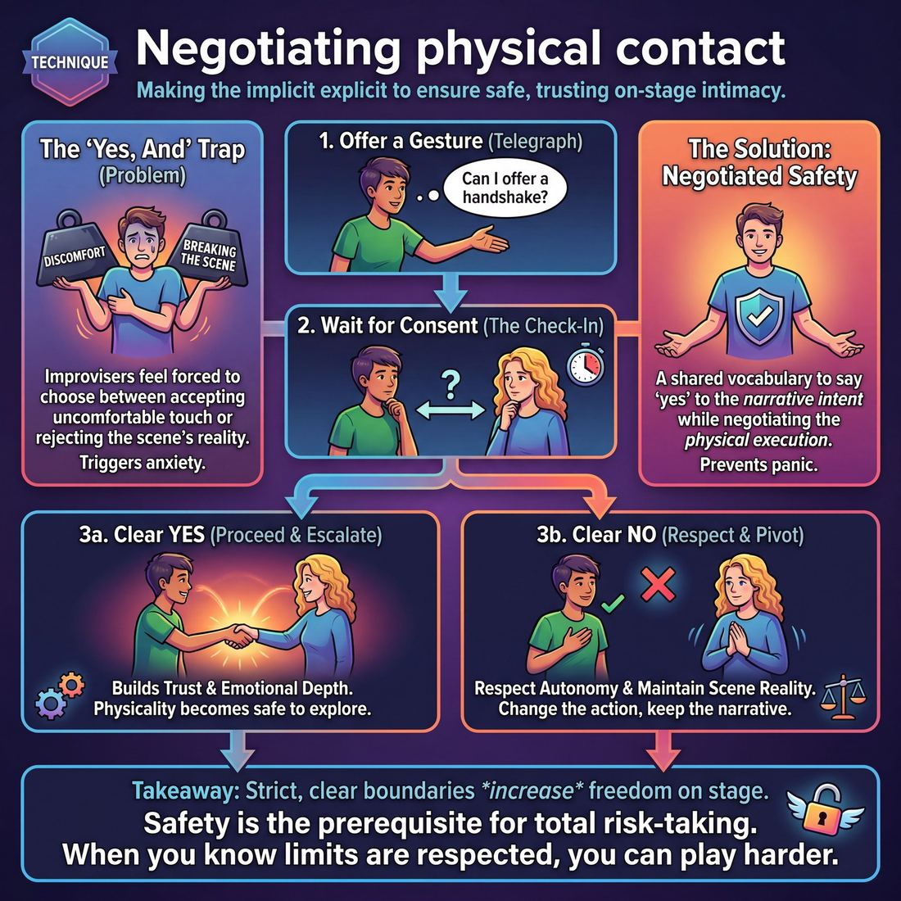

# 🎯 Negotiating physical contact

> *A drillable muscle that trains **Boundary Navigation**.*

{ .infographic }

## 🎯 The essence

**Negotiating physical contact** is a targeted technique where improvisers explicitly ask for, grant, or deny permission for physical touch in real time. It isolates the single, critical action of establishing consent—requiring players to offer a physical gesture (such as a hug, a stage-combat grab, or holding hands) and wait for a clear, observable "yes" or "no" before proceeding. By making the implicit explicit, this exercise trains the muscle of **Boundary Navigation**, ensuring that players can safely escalate physical intimacy or intensity on stage while maintaining absolute trust and respect for their partner's limits.

## 🎓 What it trains

This technique builds the specific muscle of checking in with a partner—both non-verbally and verbally—before and during physical escalation, ensuring both players remain comfortable and autonomous.

**The problem it solves**  
Improv culture is built on the foundational rule of "Yes, And"—accepting and building upon your partner's offers. However, when an offer involves physical touch (a sudden hug, a stage slap, a romantic embrace, or a lift), this rule can create a dangerous trap. Improvisers often feel forced to choose between accepting an uncomfortable physical interaction or rejecting the reality of the scene. 

Negotiating physical contact solves this dilemma. It gives players a shared, observable vocabulary to say "yes" to the *narrative intent* of a move while actively negotiating its *physical execution*. It prevents the panic that pulls an improviser out of the scene and into their own head.

!!! abstract "The Paradox of Safety and Risk"
    It seems counterintuitive, but establishing strict, clear boundaries actually *increases* freedom on stage. When improvisers know their physical limits will be respected, they stop bracing for impact. This container of mutual safety is the prerequisite for total risk-taking.

**Connecting to the deeper principle**  
This technique lives within the domain of **The Partner**, where the ultimate goal is moving from merely "acting with someone" to achieving a "shared mind." You cannot share a mind with a partner who is physically guarded, anxious, or feeling trapped. 

By drilling the negotiation of touch, improvisers actively advance their boundary navigation skills across three stages of development:
*   **Novices** know safety matters in theory, but often forget to check in when the pressure of a live scene spikes.
*   **Competent** players learn to read and respect limits actively while improvising, using eye contact, micro-pauses, and physical cues to ask for consent.
*   **Masters** model this safety so completely—sensing comfort levels and adjusting without ever breaking the scene's reality—that the entire ensemble trusts them implicitly. 

Ultimately, this technique trains improvisers to treat their partner's physical autonomy as the single most important offer on stage.

## 💡 Why it works

Negotiating physical contact works by replacing assumption with active consent, fundamentally altering the psychological environment on stage. The engine under the hood is the systematic removal of ambient anxiety. 

When improvisers share a stage, there is often an unspoken, low-level tension regarding physical boundaries. If a player initiates sudden, unnegotiated touch, the receiver’s brain instinctively triggers a subtle threat response. They stop improvising the scene and start managing their personal safety. Negotiating touch bypasses this defense mechanism entirely by exploiting three key group dynamics:

*   **Bypassing the threat response:** By telegraphing a physical move (like opening your arms for a hug) and waiting for a response, you keep your partner's brain in a state of play rather than a state of defense. 
*   **Building trust through micro-agreements:** Every negotiated touch is a **micro-offer**. When you extend a hand and wait for your partner to take it, you are proving in real-time that you prioritize their autonomy over your own idea for the scene. This accelerates mutual trust faster than any dialogue can.
*   **Unlocking emotional depth:** Physical touch is a high-stakes, highly effective tool for grounding a scene. By making the *initiation* of touch safe and consensual, players can access profound emotional resonance—like comforting a grieving character or portraying a romantic embrace—without the underlying human anxiety of *"Is my partner okay with this?"*

!!! note "Relaxing the nervous system"
    When improvisers know they will not be grabbed, lifted, or touched unexpectedly, their nervous systems relax. This physical relaxation frees up cognitive load, allowing for more spontaneous, uninhibited character work. You can play much harder when you know exactly where the edges are.

## 🧩 The setup

To practice this technique safely and seamlessly, facilitators should isolate the mechanic in a controlled, low-stakes environment before expecting players to use it in open scenes. 

Here is how to set up the room for a dedicated boundary-navigation drill:

*   **👥 Players:** Pairs. It is highly recommended to have everyone work simultaneously (a "simultaneous wash") rather than performing one pair at a time. This removes performance pressure and allows players to focus entirely on the physical negotiation.
*   **📐 Space & Materials:** A fully cleared room. No chairs, blocks, or props. Pairs must be spread out enough that they will not accidentally bump into neighboring groups during physical movement.
*   **⏱️ Time:** 1–2 minutes per round. Total exercise time: 10–15 minutes, allowing for multiple partner rotations and role swaps.
*   **🎭 Roles:** 
    *   **The Initiator (Player A):** The player who drives the scene toward a moment of physical contact (e.g., going in for a hug, reaching to adjust a collar, offering a handshake).
    *   **The Receiver (Player B):** The player who reads the initiation and makes a clear choice to accept, modify, or decline the contact in character.
*   **🛑 Prerequisites:** The ensemble must already have a baseline of trust and be fluent in the classroom's explicit safety tools (such as saying "Cut," "Hold," or "Button" to stop a scene). This technique trains *in-scene* boundary navigation, which relies on the safety net of those out-of-scene emergency brakes.

!!! tip "Facilitator Script: How to introduce it"
    "Improv is a highly physical medium, but it must always be a consensual one. Today, we are going to practice the micro-moments of asking for and granting permission to touch, without ever dropping character or stopping the scene. We are isolating the *negotiation*. 
    
    In your pairs, Player A will initiate a short scene that naturally leads to physical contact—maybe you're long-lost friends going for a hug, or a tailor adjusting a hem. But before you make contact, you must offer a physical or verbal 'tell'—eye contact, a slowed-down reach, or an open posture—that gives Player B the space to accept, alter, or reject the touch. 
    
    Player B, your job is to respond honestly. You can step into the hug, offer a handshake instead, or step back entirely. We are practicing the crucial pause between the *idea* of touching and the *action* of touching."

!!! warning "Watch out for 'The Ambush' during setup"
    Ensure players understand that the goal of the drill is **telegraphing, not surprising**. If an initiator moves so fast that the receiver has no time to react, the negotiation has failed. Emphasize moving at a speed that allows the partner to process the offer.

## ⚙️ The mechanics

!!! abstract "Core Objective"
    To build the muscle of **telegraphing** physical intent, explicitly asking for consent, and seamlessly integrating the partner's genuine response—whether a yes, a no, or a modification—into the reality of the scene without dropping the emotional stakes.

The mechanics of this technique are best isolated through a structured drill often called **Telegraph, Ask, Respond, Integrate**. In this drill, improvisers practice pausing the fiction of the scene for a fraction of a second to ensure the reality of the actors is safe.

### The Flow of Play

Players work in pairs. The drill isolates the moment of physical contact, breaking it down into four distinct, observable steps:

1. **The Approach (Telegraphing):** Player A initiates a scene with a clear physical intention (e.g., moving in for a hug, reaching to grab a wrist, leaning in for a kiss). This movement must be telegraphed—done slowly and visibly enough that the partner can read the intent before contact is made.
2. **The Pause & Ask:** Just before making contact, Player A stops their physical forward momentum and explicitly asks for permission. In this drill, the ask should be clear and direct. It can be slightly out-of-character ("Can I grab your shoulders?") or woven into the dialogue ("I want to hold your hand, is that okay?").
3. **The Authentic Response:** Player B checks in with their *actual, personal* comfort in that exact moment—not their character's comfort. They provide a clear, verbal response. 
4. **The Integration:** Player A immediately respects the boundary. They complete the physical action (if granted), adjust it (if modified), or drop it (if denied). Crucially, Player A then uses that response to fuel the next line of the scene, treating the boundary as a gift rather than a roadblock.

### The Three Responses

When Player B is asked for consent, they must practice utilizing all three types of responses during the drill to normalize hearing and saying them:

| Response Type | What it sounds like | How Player A integrates it |
| :--- | :--- | :--- |
| **Grant** | "Yes." | Player A completes the telegraphed action and continues the scene's emotional trajectory. |
| **Deny** | "No." | Player A stops the action entirely. They maintain their character's emotion but redirect the physical energy (e.g., turning a denied hug into an impassioned pacing of the room). |
| **Modify** | "No, but you can hold my hands." | Player A accepts the alternative physical contact and uses it to ground the scene. |

!!! warning "Watch out: Punishing the boundary"
    A critical rule of this technique is that **a "no" to the actor must not be punished by the character**. If Player B denies a hug, Player A must not respond with, "Fine, I guess you hate me!" or "Why are you so cold?" This weaponizes the boundary. Instead, Player A should justify the distance positively or neutrally: "You're right, we need to keep our heads clear right now."

### Rules & Constraints
* **No surprise contact:** All physical touch must be preceded by a telegraph and an ask.
* **The actor supersedes the character:** The response given in Step 3 is always the actor's truth. If the character would say yes but the actor feels no, the answer is *no*.
* **No apologies:** Player B should not apologize for denying or modifying contact. They are simply stating a boundary.

### Ending and Resetting a Round
After the integration (Step 4), the pair plays out the scene for three to four more lines to practice maintaining the scene's momentum post-negotiation. The coach then calls "Scene" or "Reset." The players drop their characters, shake it off, swap roles, and Player B initiates a new physical offer. 

!!! tip "On stage"
    While this drill uses explicit, verbal asks ("Can I hug you?"), mastering this technique allows you to eventually use **implicit asks** on stage. A proficient improviser will telegraph a hug by opening their arms and making eye contact, reading their partner's micro-expressions (a step back, a stiffening posture) as a clear "no," and adjusting their movement before a word is ever spoken.

## 🎬 Sample round

To see how this technique operates in real time, we must look at the dual-awareness of the improviser: playing the character's reality while simultaneously communicating with their partner. 

Here are two variations of the same physical offer—one where consent is granted, and one where a boundary is set and respected.

!!! example "In a scene: Two paths of negotiation"
    **The Setup:** Players Maya and Leo are in a tense scene. Maya is playing a distressed manager; Leo is playing her loyal assistant. 
    
    **Leo:** "We can fix this. I'll call the suppliers."
    *(Leo takes a slow step toward Maya. He raises his hand slightly, palm open, aiming for her shoulder. He makes direct eye contact with Maya the player, not just the character. — **The Telegraph**)*

    ---

    **Path A: The physical offer is accepted**

    **Maya:** *(As the character, she is overwhelmed. As the player, she sees Leo's approach. She gives a subtle, almost imperceptible nod and leaves her posture open. — **The Micro-Consent**)*
    "They won't pick up, Leo. It's too late."

    **Leo:** *(Seeing the physical green light, Leo completes the motion, resting his hand gently on her shoulder. — **The Completion**)*
    "Then I'll drive over there myself."

    **Maya:** *(Maya leans slightly into the touch, accepting the physical offer and heightening the emotional connection. — **The Integration**)*

    ---

    **Path B: The physical offer is redirected**

    **Maya:** *(Maya the player is dealing with a minor shoulder injury and does not want to be touched. She breaks eye contact, steps back, and crosses her arms. — **The Boundary Signal**)*
    "They won't pick up, Leo. It's too late."

    **Leo:** *(Leo reads the physical block. Without dropping character or showing player-level awkwardness, he smoothly converts his reaching hand into a gesture pointing at the phone on her desk. — **The Adjustment**)*
    "Let me try anyway."

    **Maya:** *(Maya picks up the phone, relieved that her boundary was respected without the scene losing its momentum. — **The Integration**)*

!!! note "The invisible safety net"
    Notice how in **Path B**, the audience never knows a boundary was negotiated. They simply see a character who is too stressed to accept comfort, and an assistant who redirects his energy to the problem. The players successfully navigated a physical boundary while entirely serving the scene.

## 🎚️ Variations & progressions

As improvisers move from **Novice** to **Proficient**, the negotiation of physical contact shifts from explicit, out-of-scene pauses to seamless, in-character micro-agreements. Use these progressions to safely build the muscle of Boundary Navigation, ramping up the subtlety as the ensemble's trust deepens.

*   **Level 1: The Explicit Check (Novice to Advanced Beginner)**
    *   *The Focus:* Building the basic habit of asking before touching. Novices often know safety matters but forget to check in under the cognitive load of a scene.
    *   *The Variation:* Run scenes where players must completely break character to ask permission before *any* physical contact. Player A stops, asks "May I grab your wrist?", Player B answers "Yes" or "No," and then they drop back into the scene. It feels intentionally clunky, but it hardwires the pause.

*   **Level 2: The In-Character Ask (Competent)**
    *   *The Focus:* Integrating the check-in without breaking the reality of the scene. Competent players learn to read and respect limits while actively improvising.
    *   *The Variation:* Players must negotiate contact using their character's voice, offering a clear verbal invitation that the partner can accept or reject.
    
    !!! example "In a scene"
        *Instead of:* Suddenly grabbing a partner's shoulders from behind.
        *Try:* "Brother, it's been so long. Bring it in for a hug?" (Holding arms open, waiting for the partner to step in or decline).

*   **Level 3: The Non-Verbal "Hover" (Proficient)**
    *   *The Focus:* Sensing comfort levels and adjusting without breaking the scene's flow.
    *   *The Variation:* Players practice initiating contact slowly, leaving a physical "gap" for the partner to close or reject. If Player A wants to touch Player B's face, Player A raises their hand slowly, stopping a few inches away. Player B must actively lean into the touch to accept it, or turn away to decline it. The initiator *never* closes the final gap.

*   **Level 4: The "Opt-In" Physicality (Mastery)**
    *   *The Focus:* Modeling safety so fully that the ensemble trusts total risk-taking.
    *   *The Variation:* Used for high-intensity moments (fights, lifts, intimacy). The player initiating the action offers their own body as the prop, requiring the partner to do the actual moving.

    !!! tip "On stage"
        If your character is "arresting" someone, don't grab their arms and force them behind their back. Instead, offer your hands out like cuffs and say, "Put your hands in here." The partner retains total autonomy over how aggressively they are "restrained."

!!! warning "Watch out"
    Never rush a group to Level 3 or 4. If you notice players flinching, holding their breath, or looking surprised by physical contact during scenes, immediately regress to Level 1 or 2 drills. Safety must be conscious before it can become instinctive.

## 🧑‍🏫 Coaching notes

!!! tip "Coaching: Telegraph the intent"
    The single most important cue to give from the sidelines is: **"Telegraph, don't surprise."** Remind players that physical contact should never be a jump scare. The initiator must make their physical intention clear through eye contact, body language, or dialogue *before* closing the distance, giving the partner a genuine micro-moment to accept, modify, or decline.

When side-coaching this technique, your goal is to slow down the players' physical impulses just enough to make boundary navigation conscious and observable. Use short, direct prompts to guide them in the moment.

**Effective side-coaching cues:**

*   **"Catch their eye."** Call this out if a player is reaching for a partner who is looking away. Contact must be a mutual agreement, which starts with shared focus.
*   **"Offer the space, don't take it."** Use this when a player is moving too aggressively. Encourage them to extend an open hand or open their arms, letting the partner close the final few inches.
*   **"Use your words."** Prompt players to verbalize the physical offer before making it (e.g., *"Bring it in, man,"* or *"Let me fix your collar"*). This gives the partner a clear, undeniable chance to say yes or no.
*   **"Read the flinch."** If you see a receiver stiffen, step back, or break eye contact, immediately coach the initiator to notice it, stop their approach, and justify the distance in character.
*   **"Celebrate the 'No'."** When a player successfully deflects a touch and the initiator accepts it gracefully, call it out positively. Validating the boundary reinforces psychological safety for the whole room.

**What 'good' looks and sounds like:**

You will know the technique is working when you observe these specific behaviors:

*   **The Micro-Pause:** The initiator naturally pauses just outside the partner's personal bubble, waiting for a non-verbal green light.
*   **Active Acceptance:** The receiver doesn't just tolerate the touch; they actively step into it, mirror the gesture, or relax their posture, signaling a clear, enthusiastic "yes."
*   **The Graceful Pivot:** If the receiver steps back or blocks the contact, the initiator seamlessly incorporates the rejection into the scene (*"You're right, I'm moving too fast"*) without breaking character, dropping the scene's stakes, or making the partner feel guilty.

!!! note "Coaching the receiver"
    Don't just coach the initiator. Remind the receiving players that they have total agency. Side-coach them with: **"You can step back,"** or **"Give them a clear signal."** A strong boundary navigation drill requires the receiver to be honest about their comfort level in real-time.

## 🧭 Debrief & reflection

The debrief for this technique shifts the room’s focus from the physical mechanics of touch to the internal landscape of Boundary Navigation. Because physical contact can trigger genuine vulnerability, the post-round conversation must be a space where players can be entirely honest about their comfort levels without feeling like they are "bad improvisers" for having limits.

Use these questions to guide the ensemble out of the exercise and into reflection:

**For the receiver:**
* *"When you modified or rejected a physical offer, what happened to your internal sense of safety?"*
* *"Did you feel any pressure to just 'go along with it' for the sake of the scene? If so, where did that pressure come from?"*
* *"What did your partner do that made it easy (or difficult) to communicate your boundary?"*

**For the initiator:**
* *"What non-verbal cues were you reading before you initiated contact?"*
* *"When your partner adjusted or declined the touch, how did it feel? How did you use that response to fuel the scene rather than dropping your character?"*

**For the observing ensemble:**
* *"When the boundary was negotiated clearly, what happened to the relationship between the characters?"*

!!! tip "Coach's framing"
    Start the debrief by explicitly separating the *player* from the *character*. Remind the room that a player saying "no" to a touch is a real-world boundary, but the character's reaction to that boundary is where the improv happens. 

**What a good debrief surfaces**  
A successful reflection period normalizes the idea that boundaries are not roadblocks; they are the container that makes play possible. 

Players at the Novice or Advanced Beginner stages will often confess that, in the past, they simply "put up with" unwanted physical contact because the pressure of the scene made them forget they had agency. Surfacing this common fear—the fear of "ruining the scene" by saying no—is a vital breakthrough. 

Ultimately, the debrief should lead the room to a profound realization: when players know their limits will be actively read and respected, the anxiety of the unknown evaporates. They stop bracing for impact and start playing with a truly shared mind.

## ⚠️ Common pitfalls

When the cognitive load of a scene spikes—trying to remember a name, find the game, or land a joke—the improviser's brain instinctively sheds background tasks. For a Novice, boundary navigation is often the first thing to go. They know safety matters in theory, but under the pressure of performance, they forget to check in. 

Here is how that pressure manifests on stage, and how to correct it:

!!! warning "Watch out: The Ambush (Moving faster than consent)"
    **The Trap:** A player gets a sudden, brilliant idea for a dramatic moment and lunges into a hug, a grab, or a dip without offering any physical or visual warning. The partner is startled, their body tenses, and the audience immediately feels the unsafe dynamic.
    **The Fix:** **Telegraph your intent.** Slow down the final six inches of the movement. Offer open arms, extend a hand, or make deliberate eye contact *before* closing the distance. Give your partner the physical time and space to step into the contact or step away.

!!! warning "Watch out: Missing the Micro-Rejection"
    **The Trap:** The initiator offers physical contact, but they are so focused on their own scene agenda ("We are wrestling brothers!") that they miss their partner's subtle "no"—a stiffened posture, a half-step backward, or averted eyes. They push forward anyway, forcing the contact.
    **The Fix:** Treat hesitation as a hard boundary. If your partner doesn't offer a clear, physical "yes" (leaning in, reaching back, softening their stance), immediately pivot. Turn the open arms into a stretch, or drop the hand and deliver a verbal line instead. 

!!! warning "Watch out: The 'Hover-Hand' (Fear-driven half-measures)"
    **The Trap:** Paralyzed by the fear of crossing a boundary, a player tries to split the difference. They mime touching their partner's shoulder while hovering two inches away, or they do awkward, non-committal space-work right inside their partner's personal bubble. It looks creepy and shatters the reality of the scene.
    **The Fix:** Commit to one reality. Either negotiate actual, consensual physical contact, or keep a respectful distance and use strong, grounded object work elsewhere. Don't haunt your partner's personal space.

!!! warning "Watch out: Dropping the Scene to Ask"
    **The Trap:** Believing that consent must sound like a clinical checklist, a player drops their character, breaks the scene's momentum, and whispers, "Is it okay if I hug you right now?"
    **The Fix:** Negotiate *in character*. Use your character's voice, status, and body language to make the offer clear. Say, "Bring it in, you big lug," while opening your arms wide. The *character* makes the offer; the *actor* reads the response.

## 🌟 What mastery looks like

At the highest level of practice, negotiating physical contact ceases to feel like a clinical pause in the action. A master improviser integrates consent so fluidly that the audience rarely notices the negotiation, yet the scene partner feels completely anchored and protected. Because they model safety so fully, the ensemble trusts total risk-taking. 

Here is what mastery of this technique looks like in action:

*   **The "Joyful No":** When a partner declines a physical offer or modifies a boundary, the master improviser does not drop character, apologize profusely, or freeze. They instantly accept the new boundary as a brilliant offer and weave it into the scene's reality.
*   **Continuous, Invisible Polling:** They do not rely solely on verbal check-ins. They read their partner's breath, muscle tension, and micro-expressions, adjusting their physical proximity before the partner ever has to consciously enforce a boundary.
*   **Offering, Not Forcing:** Physical contact is presented as an invitation, never an ambush. The master leaves physical "outs" (e.g., opening their arms for a hug but waiting for the partner to choose to close the distance).
*   **Character-Driven Consent:** They use the negotiation to deepen the relationship. A whispered out-of-character check-in ("Can I grab your lapels?") is done so swiftly and calmly that it doesn't break the audience's suspension of disbelief, or it is baked directly into the dialogue ("I'm going to pick you up now!").

!!! example "In a scene"
    **Player A** and **Player B** are playing estranged siblings in a heated argument. **Player A** wants to escalate the tension by grabbing Player B's shoulders. 
    
    **Player A** (dropping volume slightly to signal a check-in): *"Can I grab your shoulders?"*  
    **Player B** (shaking head slightly): *"No."*  
    **Player A** (instantly channeling that energy into the scene, slamming their hands on the table instead): *"You never let anyone in! You're a fortress!"*  
    
    The boundary was respected, the "no" was treated as a gift, and the emotional stakes of the scene actually *increased*.

!!! abstract "The Ultimate Indicator"
    You know an improviser has mastered this technique when their partners consistently play bolder, more physically expressive characters alongside them. The presence of a master boundary-navigator acts as an invisible safety net, allowing the rest of the cast to fly.

## 🔗 Why it matters

At its core, improv demands profound vulnerability. To achieve the domain goal of a shared mind with your partner, there must be an airtight container of mutual safety. Negotiating physical contact is the most literal, observable way we build that container. It proves to your partner, in real-time, that their autonomy matters more than the scene.

This technique serves as the foundational muscle for the broader skill of Boundary Navigation. While emotional or thematic boundaries can sometimes be subtle or difficult to read, physical boundaries are concrete. By drilling the mechanics of asking, offering, and reading physical cues, improvisers develop a heightened sensitivity to consent. The habit of checking in physically trains the improviser to check in emotionally, ensuring that the ensemble can navigate intense or challenging material without causing harm.

Furthermore, mastering this technique unlocks the full physical potential of the craft. Without a reliable method for negotiating touch, improvisers often retreat into two unhelpful extremes:

*   **The Talking Heads:** Avoiding physical proximity entirely out of fear of crossing an unspoken line, resulting in static, disconnected scenes.
*   **The Reckless Movers:** Forcing physical intimacy, violence, or weight-sharing without consent, risking real physical or psychological injury.

When improvisers know exactly how to negotiate contact, they are free to play highly dynamic, physical, and intimate scenes. They can brawl, embrace, dance, and carry each other, knowing the structural integrity of their partnership will hold. It transforms physical touch from a potential hazard into a powerful, expressive tool for storytelling.

## 📚 References & Further Reading

### Foundational sources
*   **Chelsea Pace, *Staging Sex: Best Practices, Tools, and Techniques for Theatrical Intimacy* (2020)** — The foundational text for Theatrical Intimacy Education (TIE). While written for scripted theater, it establishes the core principles of using desexualized language, establishing physical boundaries, and utilizing consent-based practices. These concepts are the direct ancestors of modern improv safety tools, teaching performers how to separate the narrative intent of a scene from the physical execution of touch. [https://www.theatricalintimacyed.com/](https://www.theatricalintimacyed.com/)
*   **Intimacy Directors and Coordinators (IDC), *The Five C's of Intimacy* (2018)** *(unverified exact year)* — The industry-standard framework (Context, Communication, Consent, Choreography, Closure) for staging physical contact. For improvisers, the "Communication" and "Consent" pillars provide the theoretical backbone for negotiating touch on stage, emphasizing that consent must be active, observable, and continuous rather than assumed. [https://www.idcprofessionals.com/](https://www.idcprofessionals.com/)

### Practitioner guides & manuals
*   **Adam Meggido, *Improv Beyond Rules: A Practical Guide to Narrative Improvisation* (2019)** — Connects the core improv principles of listening and accepting directly to the negotiation of boundaries. Meggido argues that truly accepting an offer means respecting the partner's limits, and that establishing a container of mutual safety is what allows improvisers to commit fully to the reality of the scene without hesitation. [https://www.nickhernbooks.co.uk/improv-beyond-rules](https://www.nickhernbooks.co.uk/improv-beyond-rules)
*   **Stephen Davidson, *Play Like an Ally* (2020)** — A practical guide to inclusive improv that provides actionable exercises for establishing boundaries, checking in with partners, and creating a "held space." Davidson specifically addresses how to navigate physical and emotional safety in real-time, ensuring that the ensemble prioritizes the autonomy of the players over the demands of the improvised narrative. [https://impromiscuous.com/](https://impromiscuous.com/)
*   **Martin Keogh, *101 Ways to Say No to Contact Improvisation: Boundaries and Trust* (2003)** — A classic essay and workshop framework from the Contact Improvisation world. Keogh explores the physical and verbal skills needed to establish boundaries in spontaneous movement, proving the central paradox of boundary navigation: the ability to confidently say "no" is the absolute prerequisite for having the trust and capacity to fully say "yes." [https://martinkeogh.com/](https://martinkeogh.com/)

### Lineage & teachers
*   **Theatrical Intimacy Education (TIE)** — Founded by Chelsea Pace and Laura Rikard, this organization pioneered the "consent-forward" practices now being adapted by improv theaters globally. Their work focuses on de-loading the rehearsal process and removing the ambient anxiety of unnegotiated touch. [https://www.theatricalintimacyed.com/](https://www.theatricalintimacyed.com/)
*   **Contact Improvisation (CI) Community** — The dance lineage originating with Steve Paxton in the 1970s. Because CI relies entirely on spontaneous, weight-bearing physical touch, the community has spent decades developing explicit, real-time boundary navigation and consent guidelines that directly map to theatrical improv. 

### Research & theory
*   **Josh Richardson, *Improvising Consent: Scaffolding Boundaries in Actor Training* (2024)** *(unverified exact title)* — Academic research published in the *Journal of Consent-Based Performance* detailing how teaching explicit negotiation and boundary-setting in improv exercises fundamentally alters the psychological environment. Richardson notes that when students practice asking for consent, it increases their overall awareness of their scene partners and deepens the emotional commitment to the scene work itself. [https://www.theatricalintimacyed.com/journal](https://www.theatricalintimacyed.com/journal)
*   **Kevin Leander et al., *Shared Social Practice and Collaborative Affective Attunement in Improvised Theater* (2023)** *(unverified exact title)* — An ethnographic study of improv ensembles that investigates how players achieve "groupmind." The research touches on the concept of "telegraphing" physical moves and "affective attunement," showing how players subconsciously read body language and boundaries to maintain a state of play rather than a state of defense. [https://www.researchgate.net/](https://www.researchgate.net/)

### Talks, videos & courses
*   **Intimacy for Stage and Screen (ISS) / Theatrical Intimacy Training Workshops** — Organizations and certified intimacy directors (such as Simone Ellul and Lucy Fennell) who run specific workshops adapting intimacy coordination for unscripted improv. These courses (e.g., "Unlocking the Power of No to Say Yes") drill the mechanics of telegraphing intent and gaining enthusiastic consent when the action is entirely spontaneous. [https://www.intimacyforstageandscreen.com/](https://www.intimacyforstageandscreen.com/)

### Communities & adjacent reading
*   **Journal of Consent-Based Performance** — A peer-reviewed journal dedicated to the evolving practices of intimacy direction, consent, and boundary navigation in the performing arts. It frequently features articles on how to apply structured safety protocols to unscripted and devised theater. [https://www.theatricalintimacyed.com/journal](https://www.theatricalintimacyed.com/journal)
*   **A Compendium of Contact Improvisation Jam Guidelines** — A living, global document maintained by the CI community (curated by Benjamin Pierce and others) that offers practical, tested frameworks for negotiating spontaneous physical touch. It serves as a masterclass in how communities can foster healthy engagement and mutual cooperation without stifling artistic freedom. [http://www.myriadicity.net/](http://www.myriadicity.net/)

## 💬 Quotes & Anecdotes

!!! quote "— Mia Schachter, *Intimacy Coordinator & Founder of Consent Wizardry*"
    Together we will build a structure and a shared language so that actors feel safe to play. [...] In my experience, actors don't want to be too much in their heads in these intimate scenes. They appreciate clear boundaries and, because they are trained professionals, they can maintain those boundaries while they try new things.

!!! quote "— Lloydie James Lloyd, *Lower The Tone* (2018)"
    Telegraph Yourself! It's that simple! Broadcast your move to your co-performers. [...] Rather than just reaching out and hugging her unannounced, John can telegraph his move in his dialogue. [...] By telegraphing the move in advance, it gives Mary a chance to process it and decide if she is ok with the hug without breaking character. That way the scene can continue and John knows whether the intimate move is welcome.

!!! quote "— David Raitt, *The Improv Illusionist* (2023)"
    Saying "Yes" to an offer does not mean simply going along with everything your partner wants. [...] Consent beats Yes–And every time. [...] There can be two different types of "Yes"—the character's and the actor's—and they can be different. For example, a character can say "Yes" to a sexual advance even if the actor doesn't consent to touching. Playing that scene takes some creativity and is actually a fun challenge.

!!! quote "— Patti Stiles, *Improvise Freely* (2021)"
    In impro we have no rules, just tools. The only thing closer to a rule is an ethical code: make your partner look good.

### Where it comes from

The concept of explicitly negotiating physical boundaries in improv has evolved significantly over the last decade, heavily influenced by the rise of Intimacy Directors and Coordinators in scripted theatre and film. Pioneers like Chelsea Clarke, Mia Schachter, and organizations like Theatrical Intimacy Education began adapting these consent-based practices for the unscripted stage, teaching improvisers how to establish boundaries without dropping character. 

However, the mechanical root of isolating physical touch as a deliberate choice can be traced back to Viola Spolin's foundational theater games. In her classic game "Contact" (sometimes called "Touch to Talk"), players are only allowed to speak when they make physical contact with one another. This constraint forces improvisers to consciously initiate and receive touch as a distinct, observable action rather than a mindless habit, laying the groundwork for modern boundary navigation.

### A telling example

**The Telegraph and the Turn**  
Imagine a scene where two improvisers are playing long-lost lovers reuniting at a train station. Player A wants to initiate a passionate embrace. Instead of simply grabbing Player B (which might trigger a startle response or cross an unspoken personal boundary), Player A *telegraphs* the move: they throw their arms wide open, take a slow step forward, and say, "I've missed you so much." 

This creates a micro-pause—a window for consent. 

*   If Player B is comfortable with the hug, they step into the embrace. 
*   If Player B is not comfortable with full body contact, they can modify the offer in character: they might catch Player A's outstretched hands, squeeze them tightly, and say, "Look at you, you haven't changed a bit," maintaining the emotional intimacy without the physical embrace. 

Because Player A telegraphed the move, Player B had the space to negotiate the boundary seamlessly. The actors remain safe, and the audience only sees a beautiful, character-driven interaction.

## 🧭 Explore the framework

- ⬆️ **Skill it trains:** [Boundary Navigation](02_S6__boundary-navigation.md)
- 🎭 **Domain:** [The Partner](02_D__the-partner.md)
- 🔁 **Sibling techniques:** [Check-ins](02_S6_T1__check-ins.md), [Cut calls](02_S6_T2__cut-calls.md)
