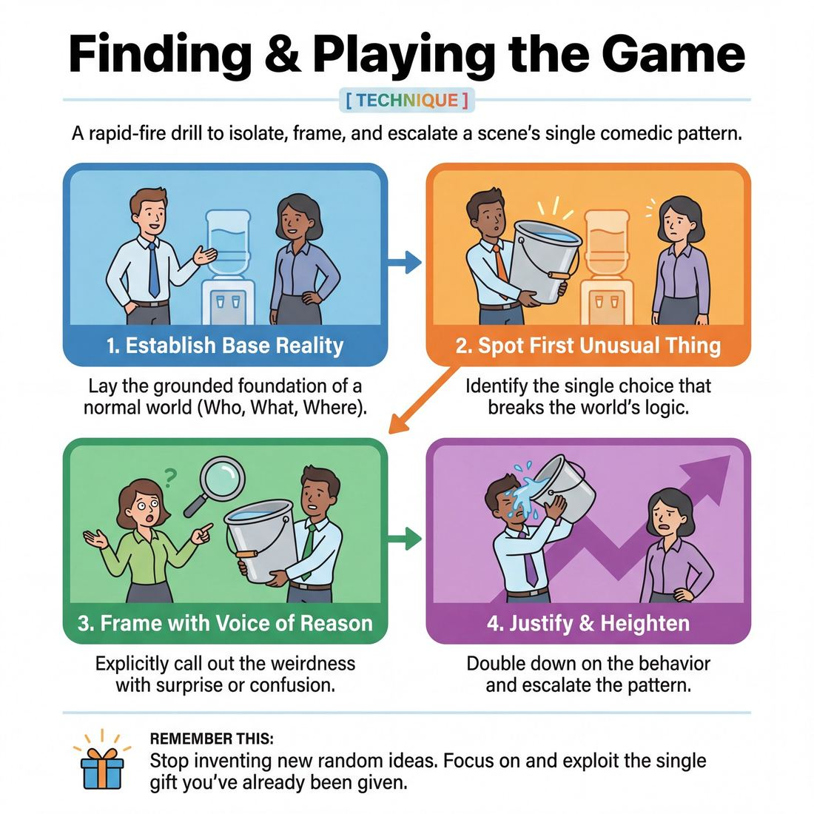

# 🎯 Finding & Playing the Game

> *A drillable muscle that trains **Game Identification**.*

{ .infographic }

## 🎯 The essence

**Finding & Playing the Game** is a stop-and-start scene drill where improvisers establish a grounded reality, isolate the very first unusual behavior that occurs, explicitly name it, and then spend the rest of the scene systematically escalating that single pattern. It trains players to stop inventing random new ideas and instead mine one specific comedic premise to its absolute limit.

## 🎓 What it trains

This exercise builds the muscle of **Game Identification**. It solves the most common problem in comedic improv: the "wandering scene." When improvisers don't know what a scene is about, they panic and invent a barrage of disconnected, wacky ideas. The scene becomes a chaotic mess of "hat on a hat" comedy that exhausts the players and confuses the audience. 

By forcing players to isolate and play *one* pattern, this drill teaches the fundamental principle of the Game engine: **comedy comes from the contrast between a grounded reality and a specific, justified absurdity.** It moves players from a **Stage 1 Novice** (who tries to spot the unusual thing but misses it live) to a **Stage 3 Competent** player (who identifies the game during the scene) and eventually to a **Stage 4 Proficient** player (who frames the game elegantly with the first unusual line).

## 💡 Why it works

This exercise works by artificially lowering the cognitive load of performance. In a normal scene, an improviser is trying to remember who they are, listen to their partner, invent dialogue, and be funny all at once. 

By allowing the coach to literally pause the scene and ask, "What is the game?", the drill removes the pressure to be instantly, continuously funny. It externalizes the internal mental process of pattern recognition. It forces the brain to shift from *generative mode* (what happens next?) to *exploratory mode* (if this specific weird thing is true, what else is true?). Furthermore, it relies on the psychological power of agreement: once both players consciously agree on what the game is, they can collaborate to heighten it rather than fighting for control of the scene's direction.

## 🧩 The setup

To run this effectively, the facilitator must set strict expectations before the first scene begins.

*   **Players / group size:** Pairs on stage. The rest of the group sits in the audience (the backline) as active observers.
*   **Space & materials:** A clear stage area. Two chairs are highly recommended to encourage grounded, physical base realities (e.g., sitting in a car, at a desk, on a couch).
*   **Time:** 3–5 minutes per round. Allocate at least 30–45 minutes for the whole exercise so every player gets multiple reps.
*   **Roles:** 
    *   **The Players:** Two improvisers executing the scene. Usually, one will naturally become the **Absurd Character** (the one doing the weird thing) and the other the **Voice of Reason** (the one reacting to it).
    *   **The Coach:** The facilitator, who holds the power to freeze the scene, interrogate the players, and side-coach the heightening.
    *   **The Observers:** The audience, who are tasked with silently trying to spot the game before the coach stops the scene.
*   **Prerequisites:** Players must understand the concept of **Base Reality** (establishing the Who, What, and Where) and the basic definition of an **Unusual Thing** (a break in the expected pattern of that reality).
*   **How to introduce it:** *"We are going to do two-person scenes. Your only job at the start is to build a boring, grounded reality. The moment one of you does or says something even slightly unusual, I am going to yell 'Freeze!' We will pause, agree on exactly what that unusual thing is, and then you will spend the rest of the scene blowing that one specific thing completely out of proportion. Do not invent anything new; just heighten what we found."*

## ⚙️ The mechanics

This is a highly structured drill. The coach must enforce the steps rigorously to prevent players from slipping back into plot-driven or chaotic habits.

### The core loop
The engine of the game is: **Establish Normalcy → Spot the Break → Frame the Pattern → Heighten the Pattern.**

### The flow of play

1.  **Establishing the Base Reality:** The two players begin the scene. They must establish the Who (their relationship), What (what they are doing), and Where (their location) using grounded dialogue and object work. *They are not trying to be funny.*
2.  **The First Unusual Thing:** Eventually, one player will say or do something that slightly violates the norms of the established reality. It might be a strange opinion, an odd physical action, or an overreaction.
3.  **The Freeze & Interrogation:** The moment the unusual thing happens, the coach yells, "Freeze!" The players stop. The coach asks the players (and sometimes the audience): *"What is the unusual thing?"* 
4.  **Defining the Game:** The players must articulate the *pattern*, not just the literal action. (e.g., Not just "He is eating a stapler," but "He treats office supplies like gourmet food.")
5.  **The Justification:** The coach asks the Absurd Character: *"Why are you doing this?"* The player must provide a **Justification**—a logical, internal philosophy that makes their absurd action make perfect sense to them.
6.  **The Frame:** The coach instructs the Voice of Reason player on how to explicitly call out the behavior when the scene resumes. (e.g., "When I unfreeze you, I want you to say, 'Greg, why are you eating that stapler?'")
7.  **Playing the Game (Heightening):** The coach yells, "Unfreeze!" The players resume. They now play the game using the **"If this is true, what else is true?"** principle. 
    *   The *Absurd Character* applies their weird philosophy to new topics or escalates the intensity of their action.
    *   The *Voice of Reason* reacts realistically, grounding the scene and pushing back, which forces the Absurd Character to justify harder and heighten further.
8.  **The Blow:** The scene reaches a logical peak of absurdity—a moment where the pattern is heightened to its maximum comedic potential.

### The rules & constraints
*   **No "Hat on a Hat":** Once the game is chosen, players cannot introduce a *second* unusual thing. If the game is "Greg eats office supplies," Greg cannot suddenly reveal he is also an alien. 
*   **The Voice of Reason stays sane:** The straight man must not join in the absurdity. They represent the audience's perspective. If both players go crazy, the contrast is lost, and the game dies.

### How a round ends or resets
The coach edits the scene (calls "Scene!" or sweeps the stage) immediately after a strong heightening move or a peak laugh (The Blow). The players step back, and a new pair steps up to start a fresh Base Reality.

!!! example "Sample round"
    **Step 1: Base Reality**
    *(Mark and Sarah are miming holding steering wheels, looking forward.)*
    **Mark:** "Traffic on the 405 is brutal today."
    **Sarah:** "Yeah, we're definitely going to be late for the pitch meeting."
    
    **Step 2: The First Unusual Thing**
    **Mark:** "Well, at least we have time to practice. *[Mimes pulling out a straight razor]* I'm going to get a quick shave in."
    
    **Step 3 & 4: Freeze & Define**
    **Coach:** "Freeze! What is the unusual thing?"
    **Sarah:** "He's shaving with a straight razor while driving on the highway."
    **Coach:** "Exactly. The game is: Mark treats his moving car like a fully equipped barber shop."
    
    **Step 5: Justification**
    **Coach:** "Mark, why are you doing this?"
    **Mark:** "Because I want to look sharp for the meeting, and I trust my knee-steering."
    
    **Step 6 & 7: Frame & Heighten**
    **Coach:** "Unfreeze. Sarah, call it out."
    **Sarah:** "Mark, put the razor away, you're going 70 miles an hour!" *(The Frame)*
    **Mark:** "Relax, Sarah. I've got a steady hand. *[Mimes lathering his face]* Now, hold this hot towel, I need to open my pores before I merge." *(Heightening)*
    **Sarah:** "I'm not holding a hot towel! Watch the road, there's a semi-truck!" *(Voice of Reason pushing back)*
    **Mark:** "I see the truck. *[Mimes grabbing scissors]* Now hold still, I noticed your bangs are getting a little long, I'm going to give you a quick trim while I tailgate this guy." *(Heightening further)*
    
    **Step 8: The Blow**
    **Coach:** "Scene!"

## 🎚️ Variations & progressions

As players move up the maturity rubric, the scaffolding of the drill should be removed.

*   **Progression 1: Coach Names It (Novice).** The coach stops the scene, tells the players what the game is, and tells them exactly how to heighten it. Good for absolute beginners who don't yet know two engines exist.
*   **Progression 2: Players Name It (Adv. Beginner).** The standard mechanics described above. The coach stops the scene, but the players must identify the game and the justification.
*   **Progression 3: In-Scene Framing (Competent).** The coach no longer yells "Freeze." The players must spot the unusual thing live. The Voice of Reason must frame the game *in character* (e.g., "Greg, why are you eating a stapler?"). If they miss it, the coach blows a whistle and makes them rewind three lines.
*   **Variation: Two Peas in a Pod.** Instead of a Voice of Reason and an Absurd Character, both players share the unusual philosophy. (e.g., Both Mark and Sarah think it's perfectly normal to run a barbershop out of a moving car, and they heighten by offering hot shaves to passing motorists). This requires a strong shared agreement on the game.

## 🧑‍🏫 Coaching notes

Your primary job as a coach during this drill is to be a ruthless editor of ideas. You must train players to discard their second, third, and fourth funny ideas in service of the *first* one.

*   **Call out the Base Reality:** If players start being weird on line one, stop them. "You haven't earned the weird yet. Give me three lines of boring, grounded reality first."
*   **Enforce the Justification:** An unusual thing without a justification is just random noise. The comedy comes from the character's absolute belief that what they are doing is normal.
*   **Side-coach the Heightening:** While the scene is running, call out: *"If this is true, what else is true?"* or *"Make it worse!"* or *"Apply that philosophy to a new object!"*

!!! tip "Coaching"
    **Focus on the Philosophy, not the Action.** 
    If a player's unusual thing is "eating a stapler," novices will heighten by eating a hole-punch, then a keyboard. That is linear and gets boring fast. Coach them to heighten the *philosophy*. *Why* are they eating it? If they treat office supplies like fine dining, heighten by having them complain that the paperclips are undercooked, or asking to see the "sommelier of white-out."

## 🧭 Debrief & reflection

After a few rounds, bring the group together and ask:
*   *"In that last scene, did we heighten the first unusual thing, or did we invent a new one?"*
*   *"Voice of Reason players: how did it feel to just react honestly instead of trying to invent jokes?"*
*   *"Did the scene get funnier when the Absurd character justified their actions?"*

A good debrief surfaces the realization that **Game is a relief**. Players realize they don't have to be endlessly creative; they just have to be observant and logical within an illogical premise. It clearly separates the Game engine (exploring a pattern) from the Narrative engine (moving a plot forward).

## ⚠️ Common pitfalls

The cognitive load of improv makes players panic. When they panic, they break the game.

*   **The Novice Trap: "Hat on a Hat."** The player does something weird, gets a small laugh, panics that it won't sustain a whole scene, and immediately does something completely different and weirder. *Fix:* Stop the scene. Ask the audience what the *first* weird thing was. Make the player drop the new invention and go back to the first one.
*   **The Voice of Reason goes crazy.** The straight man feels left out of the comedy, so they invent their own weird thing to get laughs. This destroys the contrast. *Fix:* Remind the straight man that they are the audience's avatar. Their grounded reactions are what make the absurd character funny.

!!! warning "Watch out"
    **Ignoring the Base Reality.** 
    If a scene starts with two people screaming in a spaceship made of cheese, there is no "normal." Without a baseline of normalcy, there can be no "unusual thing," because *everything* is unusual. If players start crazy, stop them immediately. Force them to establish a mundane Who, What, and Where before allowing any comedy.

## 🌟 What mastery looks like

A **Stage 5 Master** executes this drill invisibly. You don't see the gears turning. 

They establish a rich, textured base reality instantly. When the first unusual thing happens, they don't need a coach to freeze the scene; the Voice of Reason frames the game elegantly within the dialogue, often with the very next line. The Absurd character justifies their behavior so genuinely that the audience almost agrees with them. 

The heightening doesn't feel like a list of escalating jokes; it feels like the inevitable, logical conclusion of a flawed philosophy. The master player reads what the scene needs—knowing exactly when to push the pattern further and when to pull back and ground the relationship—architecting a full comedic arc in real time.

## 🔗 Why it matters

Finding & Playing the Game is the foundational muscle for the **Game Engine** of improv. Without this skill, improvisers are doomed to wander through scenes, hoping to stumble into laughs through sheer luck or wacky invention. 

By mastering Game Identification, improvisers learn to architect compelling scenes deliberately. They learn that a single drop of inspiration—a slightly mispronounced word, an odd glance, a strange way of holding a steering wheel—contains enough comedic fuel for an entire scene, provided they have the discipline to frame it, justify it, and heighten it. This technique transforms improv from a frantic scramble for jokes into a joyful, systematic exploration of human absurdity.

## 📚 References & Further Reading

### Foundational sources
*   **Matt Besser, Ian Roberts, and Matt Walsh, *The Upright Citizens Brigade Comedy Improvisation Manual* (2013)** — The definitive, comprehensive textbook on "Game of the Scene." This manual explicitly codified the terminology used in this drill, including "Base Reality," the "First Unusual Thing," the "Voice of Reason," and the heightening mantra "If this is true, what else is true?" It is the primary text for moving players from chaotic invention to structured comedic exploration. — https://ucbcomedy.com/training/
*   **Charna Halpern, Del Close, and Kim "Howard" Johnson, *Truth in Comedy: The Manual of Improvisation* (1994)** — The foundational text on the Harold and Chicago-style long-form improv. It first popularized the core philosophy that comedy comes from pattern recognition, agreement, and the subversion of expectations rather than the invention of standalone jokes. It remains essential reading for understanding the psychological power of agreement in scene work. — https://www.goodreads.com/book/show/100225.Truth_in_Comedy

### Practitioner guides & manuals
*   **Will Hines, *How to Be the Greatest Improviser on Earth* (2016)** — A highly practical guide by a veteran UCB teacher that breaks down the exact mechanics of playing the game. It provides actionable advice on how to heighten a premise, maintain authenticity as the "Voice of Reason," and avoid the panic of inventing new ideas when a scene feels stalled. — https://www.goodreads.com/book/show/31281588-how-to-be-the-greatest-improviser-on-earth
*   **Mick Napier, *Improvise: Scene from the Inside Out* (2004)** — Written by the founder of Chicago's Annoyance Theatre, this book offers a vital counter-perspective to strict improv "rules." While critiquing rigid structures, Napier deeply explores how to find the "context" (or game) of a scene and diagnoses the fearful, analytic headspace that causes improvisers to abandon their base reality in favor of "hat on a hat" absurdity. — https://www.goodreads.com/book/show/34141.Improvise_

### Lineage & teachers
*   **Upright Citizens Brigade (UCB)** — The theater and training center founded in the 1990s by Matt Besser, Amy Poehler, Ian Roberts, and Matt Walsh. UCB took the abstract concepts of Chicago long-form and rigorously codified them into the "Game of the Scene" methodology taught in this drill, making it accessible and teachable to thousands of comedians.
*   **Del Close & iO Theater** — The originator of the Harold and the early concepts of pattern-based long-form improvisation. Close's teachings at the iO Theater in Chicago laid the philosophical groundwork that the UCB founders later refined into their strict "Game" engine.

### Research & theory
*   **Brian Magerko et al., *An Empirical Study of Cognition and Theatrical Improvisation* (2009)** — An academic study exploring the cognitive load of improvisers. It discusses how establishing a shared "referent" (such as a defined Game) significantly eases cognitive load, allowing performers to generate variations and heighten scenes without needing complex, continuous communication. — https://computationalcreativity.net/
*   **Martin Norgaard et al., *Brain connectivity during musical improvisation* (2021)** — Neuroscientific research demonstrating that improvisation reduces activity in the brain's executive control network. This facilitates a "flow" state of pattern recognition, supporting the drill's premise that defining a strict pattern allows the brain to shift from anxious generation to fluid, automatic exploration. — https://www.futurity.org/jazz-musicians-improvisation-brains-2643512/

### Talks, videos & courses
*   **Matt Besser, *Improv4Humans* (Podcast)** — A long-running podcast where UCB co-founder Matt Besser and veteran guests demonstrate the "Game of the Scene" style of long-form improv in a purely audio format. Besser frequently stops scenes to side-coach, breaking down why certain premises work or fail based on their adherence to the game. — https://www.improv4humans.com/
*   **Will Hines, *Improv Nonsense* (Blog/Substack)** — A critically acclaimed, long-running blog detailing the theory, mechanics, and philosophy of UCB-style long-form improv. It includes extensive, highly specific essays on identifying the First Unusual Thing, justifying absurd behavior, and the nuances of playing the Voice of Reason. — https://improvnonsense.substack.com/

### Communities & adjacent reading
*   **Improv Resource Center (IRC)** — A foundational online forum and wiki created by Kevin Mullaney for long-form improvisers. It serves as a historical archive of debates, theories, and documentation regarding techniques like Game, the Harold, and the evolution of UCB and iO methodologies over the past two decades. — https://www.improvresourcecenter.com/

## 💬 Quotes & Anecdotes

!!! quote "— Matt Besser, Ian Roberts, and Matt Walsh, *The Upright Citizens Brigade Comedy Improvisation Manual* (2013)"
    With Yes And, we were agreeing with information presented and adding new information to develop a base reality. Once the unusual thing has been found, we no longer need to develop a base reality; we need to be funny. Repeatedly answering the question "If this unusual thing is true, then what else is true?" creates a comic pattern. Each answer to this question (or similar, related versions of this question) is called a "Game move." A combination of game moves forms a pattern that we call a "Game."

!!! quote "— Will Hines, *How to Be the Greatest Improviser on Earth* (2015)"
    “Game of the scene” is a term coined by the Upright Citizens Brigade, and it means (very roughly) “the funny part.” The funny part starts when we find something that's different from what we expect: “the unusual thing.” There's the real world and how things normally go—that's the scene. And then there's a weird part that is unusual—that's the game.

!!! quote "— Neil Casey, quoted by Will Hines in *How to Be the Greatest Improviser on Earth* (2015)"
    You can take the train to crazytown, but you have to take the local.

!!! quote "— Mick Napier, *Improvise: Scene from the Inside Out* (2004)"
    Every great scene you can think of—improv or written—has a deal: what [it's] about, a game, what [it's] centered in, etc. Often that comes with the converging points of view of each improviser.

### Where it comes from

The concept of "playing a game" in improv has deep roots. Viola Spolin built her foundational improv curriculum around literal "Theater Games," and Del Close and Charna Halpern wrote in *Truth in Comedy* (1994) that finding patterns and connections in a Harold is a game in itself, noting that "Audiences appreciate a sophisticated game-player."

However, the highly analytical, specific terminology of "Game of the Scene"—including "Base Reality," "The Unusual Thing," and the guiding question "If this is true, what else is true?"—was codified by the founders of the Upright Citizens Brigade (Matt Besser, Amy Poehler, Ian Roberts, and Matt Walsh). They developed this vocabulary in the late 1990s in New York to teach improvisers how to reliably generate sketch-comedy premises on the fly, eventually publishing it in their 2013 *Upright Citizens Brigade Comedy Improvisation Manual*.

### A telling example

**Illustrative Scenario: Taking the Local Train to Crazytown**

A common pitfall when learning Game is spotting the unusual thing and immediately jumping to the most extreme, absurd escalation possible—what UCB teacher Neil Casey famously called taking the "express train to crazytown."

*   **The Base Reality:** Two coworkers are eating lunch in the breakroom.
*   **The Unusual Thing:** Coworker A eats their sandwich with a knife and fork.
*   **The Express Train (Too fast):** Coworker B asks why. Coworker A says, "Because I am an alien from the planet Zorblax and human food burns my tentacles!" The scene instantly loses its grounding, and the game dies because there is nowhere left to logically escalate.
*   **The Local Train (Playing the Game):** Coworker B asks why. Coworker A says, "I don't want to get crumbs on my keyboard." Coworker B points out they aren't at their desk. Coworker A then puts on a bib to drink their water, explaining they don't want to risk a spill. The absurdity escalates logically, stop by stop, mining the specific game of "Coworker A is pathologically terrified of making a mess."

## 🧭 Explore the framework

- ⬆️ **Skill it trains:** [Game Identification](03_S1__game-identification.md)
- 🎭 **Domain:** [The Scene](03_D__the-scene.md)
- 🔁 **Sibling techniques:** [If this is true, what else is true?](03_S1_T2__if-this-is-true-what-else-is-true.md)
