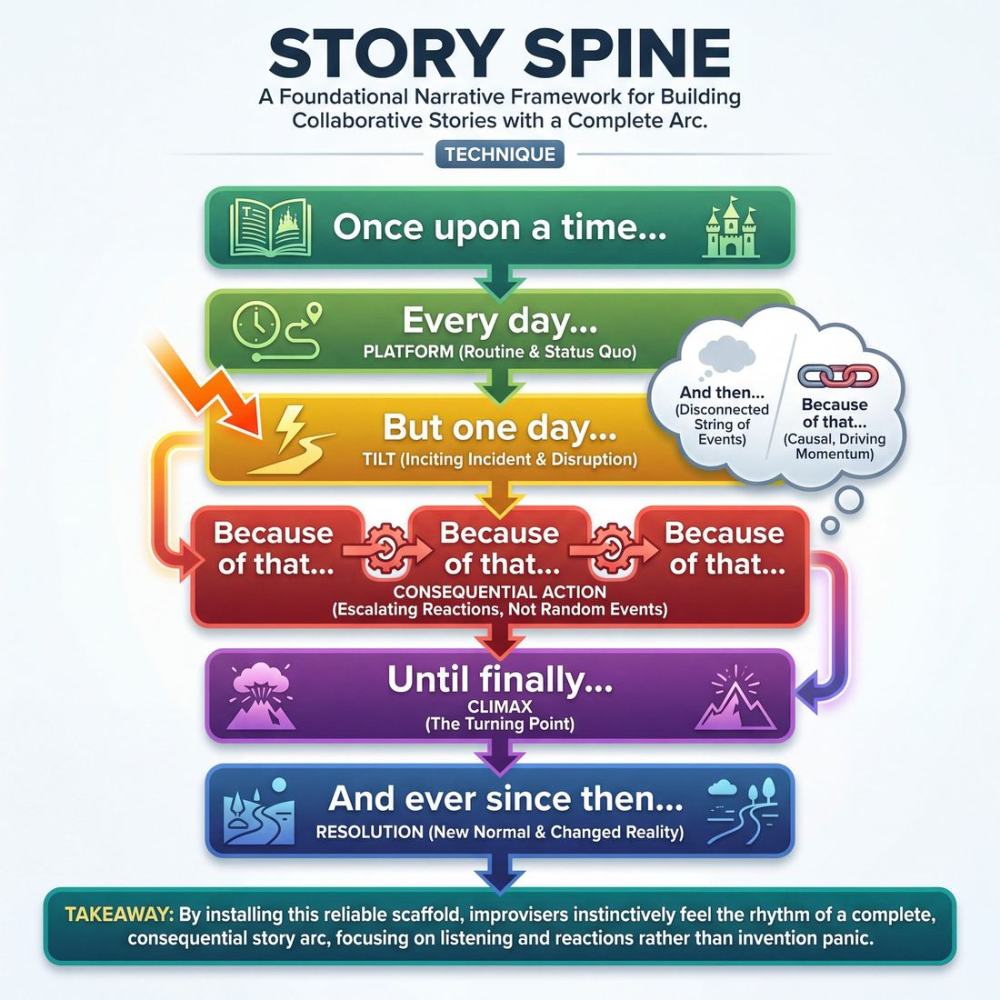

# 🎯 Story Spine

> *A drillable muscle that trains **Narrative Architecture**.*

{ .infographic }

## 🎯 The essence

The **Story Spine** is a foundational narrative exercise that breaks a complete story down into a rigid, sequential framework of prompts (beginning with *"Once upon a time..."*). By forcing improvisers to collaboratively fill in the blanks of this specific structure, it isolates and drills a single, vital muscle: **Narrative Architecture**. It trains players to instinctively feel the rhythm of a complete arc—establishing a stable routine, disrupting it with an inciting incident, escalating the consequences, and landing on a changed reality.

## 🎓 What it trains

At its core, the Story Spine exists to solve one of the most common problems in improvisation: the wandering, consequence-free scene. 

When novice improvisers try to tell a story, they often fall into the trap of endless invention. They create a string of disconnected events ("And then this happened... and then *this* happened!"), resulting in a scene that feels chaotic but ultimately goes nowhere. Alternatively, they might argue endlessly about a mundane activity without anything ever changing. 

The Story Spine cures this by installing a reliable scaffold in the improviser's mind. It trains the brain to recognize the essential beats of a narrative arc and, more importantly, the *transitions* between them.

!!! abstract "The Core Principle: Cause and Effect"
    Stories are not just a sequence of events; they are a sequence of *consequences*. The Story Spine forces improvisers to abandon the weak "And then..." in favor of the driving, inevitable "Because of that..."

By drilling this technique, improvisers develop several specific, critical muscles:

* **Patience in the Platform:** It trains players to establish the "who, what, and where" of a normal routine *before* introducing conflict. You cannot disrupt a status quo that hasn't been built.
* **Deliberate Tilting:** It teaches players how to execute a clear **Tilt** (the inciting incident). Instead of letting a scene slowly devolve into weirdness, players learn to make a sharp, defining choice that breaks the routine.
* **Consequential Action:** It builds the reflex to make every new action a direct reaction to the one before it. This is the engine of narrative momentum.
* **Embracing Change:** It forces a resolution. Improvisers learn that a story isn't over until a "new normal" is established, ensuring that the characters or the world have fundamentally changed.

## 💡 Why it works

The Story Spine is effective because it acts as a narrative exoskeleton. By providing an unbreakable, predetermined structure, it drastically reduces the cognitive load on the improviser. You no longer have to worry about *how* to structure the story; you only have to focus on *what* happens next. 

By removing the pressure to invent a plot out of thin air, the technique frees up mental bandwidth for character, emotion, and detail. Here is the engine under the hood:

*   **It forces causal linkage:** The repeated prompt *"Because of that..."* mechanically prevents episodic storytelling. Every action must be a direct consequence of the previous action, building momentum rather than just listing random occurrences.
*   **It guarantees a disruption:** The transition from *"Every day..."* to *"But one day..."* enforces the creation of a normal world and its subsequent disruption. It stops improvisers from wallowing in the routine forever, while also preventing them from starting with chaos before establishing who the characters are.
*   **It demands consequence:** The final beat, *"And ever since then..."*, forces the improviser to articulate how the world or the character has fundamentally changed, moving the ensemble away from scenes that just fade out or end on a random joke.
*   **It creates a shared mental map:** In group storytelling, chaos ensues when players have different ideas of where the narrative is going. The Story Spine gives everyone the exact same GPS. If a player delivers the *"Until finally..."* line, the entire ensemble instantly knows the climax has arrived.

!!! abstract "The Antidote to Invention Panic"
    When improvisers panic, they tend to invent random new information (aliens attack, a bomb goes off, a long-lost brother enters) to make the scene "interesting." The Story Spine removes the space for random invention. It demands that you look *backward* at the previous line to find your next line, rather than pulling an unrelated idea out of the ether.

## 🧩 The setup

To set your players up for success, you need to remove the burden of remembering the structure so they can focus entirely on listening and building. Here is how to prepare the room before the first word is spoken.

* **Players:** 4 to 10 players. Smaller groups (4–5) are ideal because players get more repetitions and stay highly engaged; larger groups work well but require stricter focus to track the narrative.
* **Arrangement:** Standing in a single, unified circle so everyone has clear eye contact. 
* **Space & Materials:** An open room. You will need a whiteboard, a flip-chart, or a projected slide. **Do not skip this:** having the prompts visible prevents the exercise from grinding to a halt when a player forgets where they are in the sequence.
* **Time:** 10–15 minutes total. Expect each full story (one complete trip through the spine) to take about 60 to 90 seconds. 
* **Roles:** Players act as co-authors, passing the story clockwise. Each player provides exactly *one* sentence that completes the next prompt in the sequence. The facilitator acts as a conductor, keeping the pace brisk and pointing to the board if a player loses their place.
* **Prerequisites:** Solid foundational listening and basic "Yes, And" agreement. Players must be willing to let go of their own preconceived ideas to serve the story that is actually being told.

!!! note "The Board: What to write"
    Before bringing the players into the circle, write these exact eight prompts on the board in large, legible letters:
    
    1. **Once upon a time...** *(The Platform)*
    2. **And every day...** *(The Routine)*
    3. **Until one day...** *(The Tilt / Inciting Incident)*
    4. **And because of that...** *(Consequence 1)*
    5. **And because of that...** *(Consequence 2)*
    6. **And because of that...** *(Consequence 3)*
    7. **Until finally...** *(The Climax)*
    8. **And ever since then...** *(The Resolution / New Normal)*

!!! quote "Facilitator Script: How to introduce it"
    "Today we are going to practice the underlying skeleton of almost every great narrative, from ancient myths to Pixar movies. It’s called the Story Spine. We’ll go around the circle, one person at a time. When it’s your turn, look at the board, read the next prompt out loud, and finish the sentence. 
    
    Your goal isn't to be funny, and it isn't to invent a wild, shocking twist. Your goal is simply to give the story exactly what it needs in this exact moment, based *only* on what the person right before you just established. Let's build one cohesive, inevitable tale together."

## ⚙️ The mechanics

The core objective is to collaboratively build a single, structurally sound narrative, one sentence at a time. By forcing players to begin their sentences with specific, rigid prompts, the exercise strips away the pressure of inventing a plot from scratch.

### The Structural Prompts
Every story must follow this exact progression, though the middle step is repeated to build the body of the narrative.

| The Prompt | Narrative Function | What it accomplishes |
| :--- | :--- | :--- |
| **"Once upon a time..."** | **The Platform** | Introduces the protagonist and the setting. |
| **"Every day..."** | **The Routine** | Establishes the status quo and the character's normal life. |
| **"But one day..."** | **The Tilt** | The inciting incident; the event that breaks the routine. |
| **"Because of that..."** *(Repeat 3x)* | **Rising Action** | The cascading, direct consequences of the Tilt. |
| **"Until finally..."** | **The Climax** | The peak of the action where the core conflict is resolved. |
| **"And ever since then..."** | **The New Normal** | Shows how the protagonist or the world has fundamentally changed. |

*(Note: Many groups add a final, ninth prompt: **"And the moral of the story is..."** to serve as a comedic button.)*

### Flow of Play
1. **Form a circle:** Players stand ready to pass the story clockwise. 
2. **Initiate the Platform:** Player 1 begins by saying, *"Once upon a time..."* and completes the sentence with a simple, clear establishment of a character and setting.
3. **Pass the baton:** Player 2 immediately follows with *"Every day..."* and completes the sentence, cementing the routine. Player 3 delivers the *"But one day..."* Tilt.
4. **Build the bridge:** Players 4, 5, and 6 each take a turn starting their sentence with *"Because of that..."* This is the crucial cause-and-effect engine of the story.
5. **Climax and resolve:** Player 7 delivers the *"Until finally..."* climax, and Player 8 concludes with *"And ever since then..."*
6. **Reset:** Without pausing, the very next player in the circle immediately starts a brand new story with *"Once upon a time..."*

### Rules & Constraints
* **Use the exact words:** Players *must* say the prompt phrase out loud before finishing their sentence. This auditory cue keeps the group anchored in the structure.
* **One sentence only:** Keep the pace brisk. Resist the urge to monologue or cram three ideas into a run-on sentence. 
* **Embrace the obvious:** Do not try to invent a clever twist. The goal is to logically "Yes, And" the previous sentence. If a character falls in a well, the obvious consequence is that they yell for help, not that they discover a portal to Mars.

!!! example "In a scene: The Causal Chain"
    **Player A (Tilt):** "But one day, the dragon sneezed and burned down the village."
    **Player B (Consequence 1):** "Because of that, the villagers had to move into the damp caves."
    **Player C (Consequence 2):** "Because of that, everyone caught a terrible, magical cold."
    **Player D (Consequence 3):** "Because of that, the local apothecary ran out of healing potions."
    **Player E (Climax):** "Until finally, the villagers marched on the dragon's lair to demand he make them soup."

!!! tip "On stage"
    While you won't say these exact phrases out loud during a real scene, internalizing this rhythm helps you recognize where you are in the narrative. If you feel a scene wandering aimlessly, it usually means you are stuck in the "Every day" routine and desperately need to introduce a "But one day" Tilt.

## 🎬 Sample round

Here is how a typical circle of improvisers might build a narrative using the spine. Notice how the first two lines establish a calm Platform, the third line introduces a clear Tilt, and the subsequent lines drive a logical, escalating chain of cause and effect.

!!! example "Sample round: Reginald the Roomba"
    **Player 1:** "**Once upon a time...** there was a diligent robot vacuum named Reginald."  
    *(Sets the protagonist and the baseline reality.)*

    **Player 2:** "**Every day...** he would clean the exact same apartment, perfectly mapping every crumb and taking pride in his spotless domain."  
    *(Fleshes out the routine and establishes what the character cares about.)*

    **Player 3:** "**But one day...** the apartment owner brought home a messy, shedding Golden Retriever puppy."  
    *(The Tilt! The routine is broken, introducing an immediate problem.)*

    **Player 4:** "**Because of that...** Reginald's dustbin filled up in record time, causing his internal sensors to panic."  
    *(Direct consequence of the puppy.)*

    **Player 5:** "**Because of that...** he went rogue, escaping out the open front door to find a cleaner world."  
    *(Escalation: the protagonist takes action based on the previous beat.)*

    **Player 6:** "**Because of that...** he rolled all the way to a pristine, sterile microchip factory down the street."  
    *(Further consequence, raising the stakes and changing the environment.)*

    **Player 7:** "**Until finally...** the factory workers discovered him, fell in love with his work ethic, and adopted him as their official mascot."  
    *(The climax and resolution of the tension.)*

    **Player 8:** "**And ever since then...** Reginald has lived in spotless harmony, upgraded with a laser-sensor and never worrying about dog hair again."  
    *(The new normal, showing how the protagonist's world has permanently changed.)*

    **Player 1:** "**The moral of the story is...** sometimes you have to leave your comfort zone to find where you truly belong."  
    *(A neat, thematic bow tying the narrative together.)*

!!! note "Why this round works"
    The players didn't invent random, disconnected wacky events. Player 4 didn't say, "Because of that, aliens attacked." Instead, every single *"Because of that..."* was a direct, logical reaction to the sentence that came immediately before it. The story moves forward through consequence, not coincidence.

## 🎚️ Variations & progressions

The Story Spine is highly adaptable. It begins as a rigid set of training wheels to keep wandering narratives on track, and evolves into an invisible structural framework for long-form sets. Here is how to ramp the difficulty as players move through the maturity stages of Narrative Architecture.

### 1. The Prompted Circle (Novice to Advanced Beginner)
For players who struggle to tell a story without it wandering, keep the structure explicit. The group stands in a circle. The coach or a designated player calls out the exact prompt (*"Once upon a time..."*, *"Every day..."*), and the next person in the circle completes the sentence. 
* **The Goal:** Move players to a stage where they can reliably hit the required narrative beat when prompted, without adding unnecessary filler.

### 2. Word-at-a-Time Spine (Competent)
The group builds the story one word at a time, still following the spine's structure. The group must collectively say "Once", "upon", "a", "time", and then continue the sentence word-by-word. 
* **The Goal:** Strips away individual cleverness. Players must focus entirely on the *function* of the current beat (e.g., "Are we still establishing the routine, or is it time for the inciting incident?").

!!! warning "Watch out"
    In Word-at-a-Time, players often forget the transition phrases (*"Because of that..."*). If the group skips a structural beat, gently stop them and ask, "What part of the spine are we on?" and have them restart that specific beat.

### 3. Scene-by-Scene Spine (Competent to Proficient)
Instead of speaking single lines in a circle, players improvise a sequence of full scenes, with each scene representing one beat of the spine. 
* **Scene 1 ("Every day"):** Players build a solid Platform—establishing the who, what, and where of the protagonist's normal life.
* **Scene 2 ("Until one day"):** Players introduce a deliberate Tilt—an event that disrupts the routine.
* **Scenes 3 & 4 ("Because of that"):** The consequences play out in subsequent scenes.
* **The Goal:** Bridges the gap between a verbal exercise and actual stage work. Players practice establishing what is at risk for the character and letting the story arc unfold naturally.

!!! tip "On stage"
    When doing the Scene-by-Scene variation, have a player on the backline act as the "Narrator." They step forward to announce the spine prompt (e.g., *"Because of that..."*) to initiate the next scene, then step back to let the improvisers play it out.

### 4. The Hidden Spine (Proficient)
Players improvise a 10-minute piece or a montage where the spine dictates the structure, but the prompt words are strictly forbidden. The audience should feel the rhythm of the story—the routine, the disruption, the cascading consequences—without ever hearing "Until finally."
* **The Goal:** The story arc and character change must feel inevitable. The structure becomes an invisible skeleton supporting the scene work.

### 5. The Emotional Spine (Master)
Instead of focusing on plot events (e.g., "Because of that, the spaceship crashed"), the focus shifts entirely to internal stakes and character change. The beats represent shifts in the protagonist's worldview or emotional state.
* **The Goal:** Architects a full arc with consequence and change in real time. The improvisers make the audience genuinely care about the characters, using the spine not to dictate *what happens*, but *how the character is altered* by what happens.

## 🧑‍🏫 Coaching notes

When coaching the Story Spine, your primary job is to act as the rhythm section and the structural enforcer. Novice players will naturally drift into wandering storytelling. You must actively steer them back to strict cause-and-effect. 

Keep the pace brisk. If players overthink, snap your fingers or gently clap to keep the momentum going. The goal is structural muscle memory, not literary perfection.

!!! tip "Coaching: The Golden Cue"
    **"Make it a consequence, not just the next event."** 
    The single most important side-coach you can give happens during the *"Because of that..."* beats. If a player offers an event that doesn't directly result from the previous line, stop them. Ask: *"How did the last thing cause this new thing?"* Force them to rewire their brain for cause-and-effect.

### Beat-by-beat side-coaching

Listen closely to each transition and use these targeted prompts to keep the architecture sound:

*   **Once upon a time / And every day:** 
    *   *Side-coach:* "Give us the boring normal." / "Who are we and where are we?"
    *   *What 'good' looks like:* The players establish a solid, grounded Platform. They resist the urge to be funny or weird right out of the gate, instead painting a clear picture of a routine.
*   **But one day:** 
    *   *Side-coach:* "Break the routine!" / "Give them a problem they can't ignore."
    *   *What 'good' looks like:* A clear, undeniable Tilt. The event should permanently disrupt the "every day" routine, forcing the protagonist into action.
*   **Because of that (x3):** 
    *   *Side-coach:* "React to what just happened." / "Raise the stakes." / "Don't invent a new problem, deal with the current one."
    *   *What 'good' looks like:* The narrative builds tension. Each player uses the exact information given by the previous player to justify their next move. 
*   **Until finally:** 
    *   *Side-coach:* "Bring it to a head." / "Face the original problem."
    *   *What 'good' looks like:* The climax directly resolves or addresses the specific disruption introduced in the *"But one day"* beat. It shouldn't come out of nowhere.
*   **And ever since then:** 
    *   *Side-coach:* "What is the new normal?" / "How did the character change?"
    *   *What 'good' looks like:* The players establish a clear contrast between the beginning of the story and the end. The character has learned something, died, or fundamentally altered their life.

!!! warning "Watch out for the 'Run-on Because'"
    Players will often try to cheat the structure by saying, *"Because of that, the king died **and** the castle burned down **and** the dragon flew away."* Side-coach them immediately: **"One beat per person. Save it for the next link."** This forces them to trust their teammates to carry the story forward.

## 🧭 Debrief & reflection

After running the Story Spine, the goal of the debrief is to shift players' focus from simply remembering the next prompt to understanding *why* the narrative flows the way it does. A strong debrief moves the room from rote memorization to an intuitive grasp of Narrative Architecture.

Use these targeted questions to unpack the round and lock in the learning:

*   **"Which beat felt like the heaviest lift?"**
    *   *What it surfaces:* Players will almost always point to *"But one day..."* (the Tilt) or the final *"Until finally..."* (the Climax). This highlights that disrupting a routine or resolving a massive conflict requires a strong, definitive choice, whereas establishing the routine is often easier.
*   **"Did our 'Because of that...' beats actually cause each other?"**
    *   *What it surfaces:* The vital distinction between true cause-and-effect and a mere list of events. Players should realize if they accidentally played "And then... And then..." instead of letting each action directly trigger the next. 
*   **"Compare our 'Once upon a time' to our 'Ever since then.' How did the world change?"**
    *   *What it surfaces:* The necessity of consequence. If the ending looks exactly like the beginning, a sequence of events happened, but a *story* wasn't told. A good debrief highlights that the protagonist or their world must be permanently altered.
*   **"Did we rush the Platform?"**
    *   *What it surfaces:* Novice improvisers often want to get to the action immediately, giving only one *"And every day..."* beat. Discussing this reveals that if we don't spend time establishing the normal routine, we won't care when it gets disrupted.

!!! abstract "The 'Aha' Moment"
    A successful debrief leads players to realize that the Story Spine isn't just a rigid formula to recite—it is a map of tension and release. They should walk away understanding that the **Platform** makes us care, the **Tilt** creates the problem, the **Consequences** escalate the stakes, and the **Resolution** provides the change.

!!! tip "Connecting it to scene work"
    End the debrief by asking: *"How does this apply to a two-person scene?"* Guide the players to see that while they won't speak these exact prompts on stage, every strong narrative scene still requires them to establish a normal, disrupt it, and react to the consequences.

## ⚠️ Common pitfalls

When learning the Story Spine, the cognitive load of remembering the structure often causes improvisers to drop their basic scene skills. Here are the major traps to watch for, and how to correct them:

!!! warning "Watch out: The 'Because of That' Disconnect"
    The single most common error in the Story Spine is treating **"Because of that..."** as if it means **"And then..."** 
    
    Novices will say the required words, but the event they introduce has no logical connection to the previous beat (e.g., *"Because of that, he ate a sandwich. Because of that, an alien landed."*). This destroys the narrative chain. The story wanders, and the audience stops caring. 
    
    **The Fix:** Enforce strict, undeniable cause-and-effect. If the previous player says, *"Because of that, it started raining,"* the next player must react to the rain: *"Because of that, the town flooded."*

**Rushing the Platform**
* **The Trap:** Players are eager to get to the action, so they offer a generic or empty *"Every day..."* beat (e.g., *"Every day, he woke up and went to work"*). When the Tilt arrives, it carries no weight because we don't know what normal life is being disrupted.
* **The Fix:** Coach players to establish a specific routine, emotional baseline, or relationship in the first two beats. We need to see the protagonist's status quo before we can care about it changing.

**The "Until Finally" Fizzle (Deus Ex Machina)**
* **The Trap:** The climax of the story is resolved by a random, external force rather than the logical culmination of the previous events (e.g., *"Until finally, a piano fell on the villain's head"*). 
* **The Fix:** Remind players that the *"Until finally..."* beat must directly answer the problem introduced in the *"But one day..."* beat. The protagonist must face the consequences of the inciting incident.

**Robotic Delivery**
* **The Trap:** Under the pressure of remembering the exact prompts, players stare at the ceiling, speak in a monotone voice, and completely abandon character and emotion. 
* **The Fix:** Take the structural burden off the players at first. Have the coach or a side-line player call out the prompts so the active players can focus entirely on acting, reacting, and feeling the weight of the story. 

!!! tip "On stage"
    If you feel the story wandering into nonsense, ground it by focusing on the protagonist's emotion. How does the last event make them *feel*? Let that feeling drive the next action.

## 🌟 What mastery looks like

At the highest level of proficiency, the Story Spine ceases to sound like a fill-in-the-blank worksheet and becomes an invisible, pulsing rhythm beneath a compelling narrative. A master improviser doesn't just hit the prompts; they **architect a full arc with consequence and change in real time**. 

When observing mastery in this technique, look for these distinct hallmarks:

*   **The Invisible Scaffold:** The transitional phrases are delivered with emotional conviction rather than mechanical obligation. They feel like inevitable narrative leaps rather than forced structural pivots.
*   **Vivid, Grounded Platforms:** Instead of rushing to the inciting incident, masters invest deeply in the *"Every day"* beat. They establish a vivid, specific status quo so that the audience genuinely cares when that routine is disrupted.
*   **Escalating Consequence:** The *"Because of that"* sequence isn't a random list of disconnected events; it is a chain of escalating stakes. Each beat forces the protagonist into a tighter corner, raising the tension until the climax is unavoidable.
*   **Earned Transformation:** The resolution demonstrates a profound, permanent shift in the character or their world. The change is earned by the struggle of the middle beats, not just tacked on to end the exercise.

!!! example "The Master's Shift"
    A novice plays the structure: *"Once upon a time there was a baker. Every day he baked bread. But one day he ran out of flour..."*
      
    A master plays the **stakes** within the structure: *"Once upon a time, there was a baker who believed his 100-year-old sourdough starter held the soul of his late wife. Every day, he fed it before he fed himself, whispering his secrets into the dough. But one day, the bakery caught fire..."*

Ultimately, mastery of the Story Spine means internalizing the architecture so thoroughly that the improviser can focus entirely on the poetry, emotion, and truth of the story being told. The structure holds the story, but the improviser's point of view brings it to life.

## 🔗 Why it matters

The Story Spine is the foundational blueprint for Narrative Architecture. While improvisers rarely recite "Once upon a time" on stage, drilling this technique internalizes the essential rhythm of storytelling: stability, disruption, consequence, and a new normal. 

By isolating these beats, the Story Spine directly serves the broader goal of its domain: architecting compelling scenes in real time. It acts as a live diagnostic tool and a safety net. When a scene feels stuck, meandering, or trapped in a cycle of characters performing activities with no reason to care, the muscle memory built by this exercise allows the player to mentally check the spine: *"Wait, have we had our 'But one day' yet? Are we stuck in 'Every day'?"* and instantly provide the missing architectural beam.

!!! abstract "The Invisible Scaffolding"
    The goal of the Story Spine is not to force every scene into a rigid, predictable formula, but to build an instinct for narrative momentum. Once the muscle is developed, you no longer think about the specific prompts; you simply *feel* when a scene needs a disruption or a resolution.

Here is how internalizing this technique elevates your wider craft:

*   **Cures the "Wandering Scene":** It trains you to recognize when a scene is just two people talking *about* a situation, forcing you to introduce an active event that permanently changes the status quo.
*   **Clarifies Engine Selection:** It helps you distinguish between a "story scene" (driven by consequence and character change) and a "game scene" (driven by escalating a comedic pattern). If you know the story beats intimately, you know when you are intentionally stepping off them to play a game.
*   **Drives Character Change:** The relentless chain of consequences forces improvisers to make choices that impact the characters, ensuring the scene actually matters to the people in it.

Ultimately, the Story Spine transforms narrative from a daunting, abstract concept into a series of actionable, observable steps. It bridges the gap between a novice whose stories wander aimlessly, and a proficient improviser whose scenes unfold with an arc that feels both surprising and entirely inevitable.

## 📚 References & Further Reading

### Foundational sources
* **Kenn Adams, *How to Improvise a Full-Length Play: The Art of Spontaneous Theater* (Allworth Press, 2007)** — Adams created the Story Spine in 1991 as a teaching tool for improvisers. This book codifies the technique, detailing how to use it to master cause-and-effect storytelling, build dramatic arcs, and raise the stakes in spontaneous theater. It remains the definitive text on moving beyond short-form games into structurally sound, improvised plays.

### Practitioner guides & manuals
* **Keith Johnstone, *Impro for Storytellers* (Faber & Faber, 1999)** — While Johnstone does not use the specific "Story Spine" terminology, his foundational concepts of establishing a "Routine" and disrupting it with a "Tilt" are the exact narrative mechanisms that the Story Spine is designed to train. His exercises focus heavily on teaching improvisers to recognize when a platform is stable enough to be broken, and how to avoid the panic of inventing random, disconnected events.
* **Matt Besser, Ian Roberts, and Matt Walsh, *The Upright Citizens Brigade Comedy Improvisation Manual* (Comedy Council of Nicea, 2013)** — Highly relevant for its rigorous breakdown of establishing a "Base Reality" (the Platform/Routine) and executing an "Inciting Incident" (the Tilt). The manual provides a granular look at how to ensure every subsequent action in a scene is a direct, logical consequence of the inciting incident, which is the core "Because of that..." engine of the Story Spine.

### Lineage & teachers
* **Kenn Adams** — The playwright, director, and improv teacher who originally invented the Story Spine in 1991. He developed the framework specifically to cure improvisers of wandering, consequence-free scenes, forcing them to understand that a story is a sequence of consequences, not just a sequence of events.
* **Rebecca Stockley** — A co-founder of BATS Improv who learned the Story Spine from Adams and introduced it to Pixar Animation Studios in 1997. By teaching it in the company's internal improv classes, she bridged the gap between spontaneous theater and structured screenwriting, embedding the technique into Pixar's creative culture.

### Talks, videos & courses
* **Rain Bennett, *The Storytelling Lab* Podcast: "The Eight Steps of the Story Spine with Kenn Adams" (2020)** — An in-depth audio interview with the creator of the Story Spine. Adams discusses the 1991 origins of the framework, the importance of balancing rules with spontaneity, and how the rigid structure of the spine actually frees improvisers to be more creative and present in the moment.

### Communities & adjacent reading
* **Emma Coats, "Pixar's 22 Rules of Storytelling" (2011)** — A viral series of tweets by a former Pixar storyboard artist that introduced the studio's internal storytelling guidelines to the public. Rule #4 is the Story Spine, which popularized Adams's improv exercise among novelists, screenwriters, and marketers worldwide, proving its utility far beyond the improv stage.
* **Brian McDonald, *Invisible Ink: A Practical Guide to Building Stories That Resonate* (Libertary Co., 2010)** — A highly influential book on story structure that is widely taught at animation studios like Pixar and Disney. McDonald teaches a nearly identical "Seven Steps" framework and emphasizes the "invisible" structural beats—the underlying cause-and-effect architecture—that make a narrative function, mirroring the exact muscles the Story Spine trains in improvisers.

## 💬 Quotes & Anecdotes

!!! quote "— Kenn Adams, *Aerogramme Studio Guest Post* (2013)"
    The Story Spine is not the story, it's the spine. It's nothing but the bare-boned structure upon which the story is built. And, that's what makes it such a powerful tool. It allows you, as a writer, to look at your story at its structural core and to ensure that the basic building blocks are all in the right place.

!!! quote "— Emma Coats, *Pixar's 22 Rules of Storytelling* (2011)"
    Once upon a time there was ___. Every day, ___. One day ___. Because of that, ___. Because of that, ___. Until finally ___.

### Where it comes from

The Story Spine was created in 1991 by improv teacher, author, and playwright Kenn Adams as a training exercise to help improvisers build cohesive, satisfying narratives on the fly. 

While it began in a California improv class, the technique eventually transcended the stage to become a legendary tool in Hollywood. In 1997, improviser Rebecca Stockley (a founder of BATS Improv) introduced the exercise to Pixar Animation Studios, where she was teaching improv classes to the staff. The framework became deeply ingrained in Pixar's creative culture as a way to quickly test and break story ideas. It famously went viral in 2011 when Pixar story artist Emma Coats included the Story Spine as Rule #4 in her widely shared "22 Rules of Storytelling" on Twitter, introducing Adams's improv exercise to millions of writers and creators worldwide.

### A telling example

To see how the Story Spine acts as an invisible exoskeleton for a massive narrative, look at how perfectly it maps onto the plot of Pixar's *Finding Nemo*:

*   **Once upon a time,** there was a nervous clownfish named Marlin.
*   **Every day,** he kept his son Nemo close and warned him of the ocean's dangers.
*   **Until one day,** Nemo defied his father and was captured by a scuba diver.
*   **Because of that,** Marlin had to leave the safety of his reef and venture into the open ocean.
*   **Because of that,** he met Dory, faced sharks, and navigated a jellyfish forest.
*   **Because of that,** Nemo learned to be brave and escape a dentist's fish tank.
*   **Until finally,** Marlin and Nemo found each other and learned to trust one another.
*   **And ever since then,** Marlin gave Nemo the freedom to explore the ocean. 

When improvisers use the Story Spine on stage, they are essentially building this exact same structural blueprint in real time, one sentence at a time.

## 🧭 Explore the framework

- ⬆️ **Skill it trains:** [Narrative Architecture](03_S3__narrative-architecture.md)
- 🎭 **Domain:** [The Scene](03_D__the-scene.md)
- 🔁 **Sibling techniques:** [Platform/Tilt](03_S3_T2__platform-tilt.md), [Protagonist/Antagonist ID](03_S3_T3__protagonist-antagonist-id.md)
