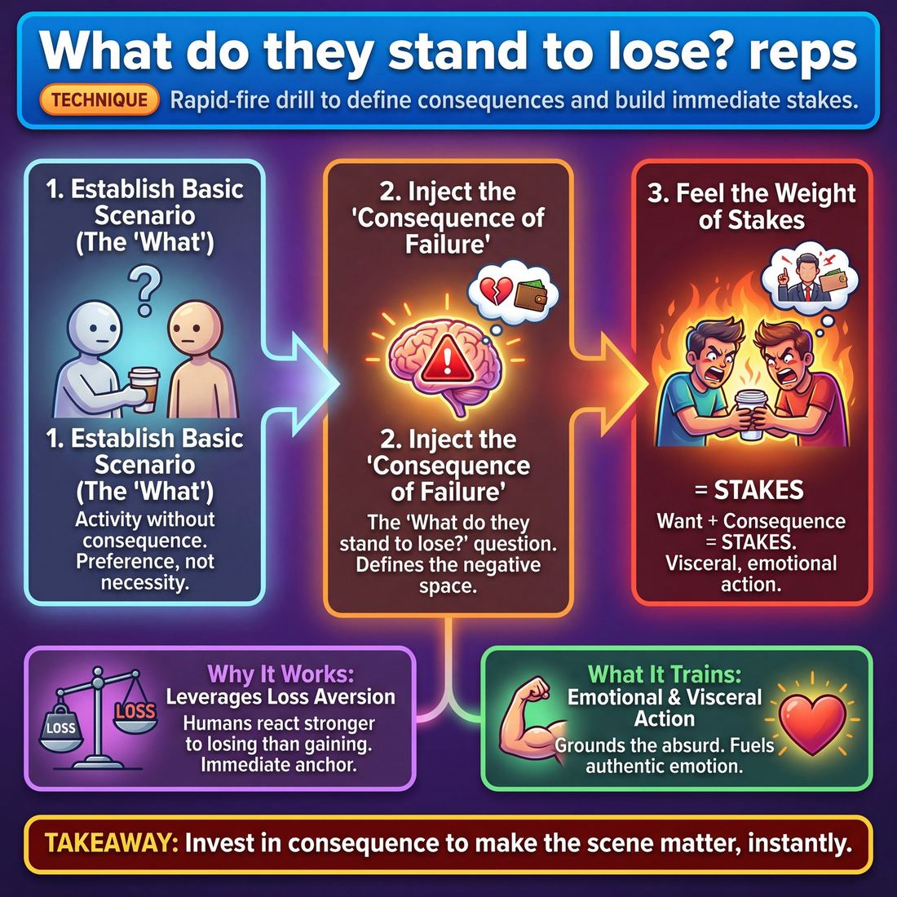

# 🎯 What do they stand to lose? reps

> *A drillable muscle that trains **Stakes / The 'Want'**.*

{ .infographic }

## 🎯 The essence

**What do they stand to lose? reps** is a rapid-fire, out-of-scene drill designed to build the muscle of instantly identifying **stakes**. Rather than letting characters float through casual activities with no real consequences, this exercise forces players to look at a basic scenario and immediately articulate exactly what is at risk for the person in it. It trains the single, vital habit of anchoring a scene in a meaningful **Want** by defining the emotional, social, or physical cost of failure—ensuring that both the improvisers and the audience actually care about what happens next.

!!! abstract "The Core Focus"
    This drill isolates one specific action: looking at a neutral character or situation and instantly injecting a compelling reason why *this moment matters* to them.

## 🎓 What it trains

This exercise isolates and strengthens the muscle of **Stakes / The "Want"**. It exists to solve one of the most common problems in early-to-intermediate improv: scenes that are full of activity and dialogue, but entirely devoid of consequence. 

When novice improvisers take the stage, they often play activities with no underlying reason to care (Stage 1 of the maturity progression). They might argue passionately about who gets the last donut, but the scene feels hollow because it is just a donut. The audience subconsciously asks, *"So what?"* 

This drill forces improvisers to answer that question. It trains the brain to automatically attach a meaningful consequence to a character's objective, moving them to a place where they can deliberately establish what is at risk (Stage 3).

Specifically, this technique builds three critical sub-skills:

*   **Transforming preferences into necessities:** A character *wanting* something is not enough to drive a compelling scene; a want without a consequence is merely a preference. This drill trains you to instantly identify the negative space—what happens if the character *fails*.
*   **Grounding the absurd:** In improv, the "thing" at risk doesn't have to be objectively important (like defusing a bomb), but it must be subjectively vital to the character. This muscle helps you justify why a grown man is terrified of losing a staring contest with a pigeon.
*   **Fueling authentic emotion:** When an improviser knows exactly what their character stands to lose, they no longer have to fake their emotional reactions. The stakes do the heavy lifting, making the character's desperation, joy, or anger feel inevitable rather than forced.

!!! abstract "Key idea: The Stakes Equation"
    **Stakes = The Want + The Consequence of Failure.** 
    If a character wants a promotion, that is a goal. If they want a promotion *because if they don't get it, their father will finally write them out of the will*, those are stakes. The "What do they stand to lose?" muscle ensures you never play the first half of the equation without the second.

Ultimately, this technique bridges the gap between doing things on stage and *caring* about things on stage. It trains improvisers to stop inventing plot and start investing in consequence.

## 💡 Why it works

This technique leverages a fundamental psychological principle: **loss aversion**. Human beings are wired to react much more strongly to the threat of losing something they already have than to the prospect of gaining something new. In improvisation, this translates directly to stage energy and emotional depth. 

When improvisers are told to "find the want," they often project into the future, inventing complex plots or politely negotiating for abstract goals. The scene becomes intellectual and talky. By shifting the question to "What do they stand to lose?", the technique forces an immediate, visceral anchor in the present moment. It demands a tangible consequence.

!!! abstract "Wanting vs. Losing"
    *   **The Want:** "I want to buy this used car." *(Intellectual, future-focused, easily stalled by a simple "no" from the scene partner.)*
    *   **The Loss:** "If I don't buy this used car today, I can't drive to my daughter's recital and I lose her respect forever." *(Emotional, present-focused, creates immediate, playable desperation.)*

Furthermore, this mechanism acts as a natural constraint on invention. Instead of frantically searching the stage for *more* ideas to build a story, the improviser is forced to look inward at the character's existing reality. It deepens the stakes rather than widening the plot.

Finally, it instantly clarifies the relationship dynamic for the scene partner. Once a character's potential loss is established, the partner's role snaps into focus: they are either the obstacle threatening that loss, or the ally who can prevent it. This removes the cognitive load of figuring out "who we are to each other" and replaces it with immediate, polarized action.

## 🧩 The setup

*   **Players & Arrangement:** Pairs, spread out across the room so everyone can work simultaneously. 
*   **Space & Materials:** An open room. No chairs or props are needed.
*   **Time:** 10–15 minutes total. Each individual rep is a micro-scene lasting no more than 30–45 seconds.
*   **Roles:**
    *   **Player A (The Initiator):** Starts with a physical activity and a single line of dialogue establishing a basic scenario (the "What").
    *   **Player B (The Stakes-Setter):** Responds with a line that explicitly names what Player A (or both of them) stands to lose if this situation goes poorly. 
    *   *Both players:* Play one or two more lines to feel the weight of the stakes, then immediately drop the scene and start a new rep.
*   **Prerequisites:** Players should be comfortable establishing a basic **Platform** (Who, What, Where). If they are still struggling to invent a base reality, they will get bogged down before they can apply the stakes.

!!! tip "Managing the room"
    Because this is a high-volume rep exercise, the room will get loud. Use a clear physical signal (like clapping twice or raising a hand) to pause the room if you need to give a global note, rather than trying to shout over the pairs.

!!! quote "How to introduce it"
    "We often start scenes with a lot of busy activity, but no reason for the audience to care. Today, we're isolating the muscle of creating immediate stakes. 
    
    Player A, you're going to initiate a scene with a simple activity and a line of dialogue. Player B, your only job in your first line is to establish exactly *what Player A stands to lose* right now. Give them a consequence. Play three or four lines total so you can feel the weight of that consequence, then immediately cut it and start a new rep. 
    
    We want volume here. Don't worry about being clever or funny—just give your partner something to lose."

## ⚙️ The mechanics

The core objective of this drill is to build the mental muscle that instantly connects a character’s desire to a meaningful consequence. By forcing improvisers to explicitly name the negative outcome of failure, scenes move from abstract activities to visceral, character-driven risks.

Here is the standard flow of play for a rapid-fire repetition line drill:

1. **The Initiation (The Want):** Players form two lines facing each other (Line A and Line B). The first player in Line A steps forward and delivers a single line of dialogue establishing a character and a strong, immediate desire. 
2. **The Diagnosis (The Stakes):** The first player in Line B steps forward and explicitly states what Player A's character stands to lose. They must use a strict, diagnostic formula to articulate the consequence.
3. **The Internalization (The Reaction):** Player A absorbs this consequence and delivers one final line of dialogue, emotionally reacting to the weight of that potential loss. They do not argue; they let the stakes land.
4. **The Reset:** Both players step to the back of the opposite lines. The next pair immediately steps up to keep the pace brisk.

!!! tip "The Diagnostic Formula"
    Player B should not try to act in the scene. They are acting as an omniscient narrator or coach, using this exact phrasing:  
    *"If you don't get [the want], you stand to lose [the specific consequence]."*  
    Using the strict formula prevents waffling and forces the brain to wire the direct connection between action and consequence.

### Rules & Constraints

To get the most out of these reps, enforce the following boundaries:

* **Ban physical death:** Unless you are playing a specific genre (like an action movie), ban "you will die" as a consequence. Force players to find the **emotional, social, or psychological death**—loss of status, a cherished relationship, pride, or a lifelong dream.
* **Ban generic financial ruin:** "You will get fired" or "You will be broke" are often lazy defaults. Push for specificity: *"You will have to move back into your childhood bedroom and ask your dad for an allowance."*
* **Accept the gift:** Player A must treat Player B's diagnosis as absolute truth. The goal of the final line is to show the audience that the character *feels* the heat of the stakes, not to deflect them.

!!! warning "Watch out for 'The Void'"
    A common mistake is naming a consequence that simply returns the character to the status quo (e.g., "If you don't get this date, you'll just be single"). **Stakes require a net loss.** The consequence must leave the character worse off than when the scene began.

## 🎬 Sample round

!!! example "Sample round: The 'Loss' Injection"
    In this standard rapid-fire format, the coach provides a neutral or low-stakes initiation. The player steps in, accepts the reality, and delivers a single response that locks in their **Want** and explicitly states the **Loss** (the stakes).

    **Rep 1: The Workplace**
    
    * **Coach:** "Here are the quarterly reports you asked for."
    * **Player A:** "Thanks. If I don't find a math error in these pages by 5:00 PM, they're going to promote Jenkins instead of me."
    * *Mechanics check:* Player A takes a mundane office initiation and instantly creates a **Want** (find an error) driven by a clear **Loss** (losing the promotion to a rival). The scene now has a motor.

    **Rep 2: The Domestic**
    
    * **Coach:** "I finished painting the fence."
    * **Player B:** "It looks great. But if the Homeowners Association sees we used 'Eggshell' instead of 'Navajo White,' they'll fine us and we won't be able to afford Tommy's braces."
    * *Mechanics check:* Player B escalates a simple chore. The **Want** is to appease the HOA; the **Loss** is deeply personal and emotional (Tommy's braces). This demonstrates a **Stage 3 (Competent)** move by establishing exactly what is at risk for the character.

    **Rep 3: The Absurd**
    
    * **Coach:** "The time machine is fueled up."
    * **Player C:** "Perfect. If we don't get back to 1994 and stop my teenage self from getting that perm, I'll never have the confidence to meet my husband."
    * *Mechanics check:* Even in a sci-fi premise, the stakes are grounded in human emotion. The **Want** is to change the past; the **Loss** is a lifetime of loneliness. This touches on **Stage 5 (Master)** ability: making the audience genuinely care about an absurd situation because the consequence is so deeply felt.

    **Rep 4: The Pivot (Correcting a weak rep)**
    
    * **Coach:** "Your coffee is ready."
    * **Player D:** "Thanks, I really want to drink this because I am thirsty."
    * **Coach:** "Freeze. That's a want, but there's no loss. What happens if you *don't* drink it?"
    * **Player D:** "If I don't drink this, I'll fall asleep during the deposition and my client will go to jail."
    * *Mechanics check:* The coach catches a **Stage 1 (Novice)** response (hollow action) and forces the player to articulate the consequence, instantly giving the scene a spine.

## 🎚️ Variations & progressions

To build the muscle of establishing stakes, this drill can be scaled from blunt, explicit statements to nuanced, behavioral choices. Match the variation to your players' current maturity stage to ensure they are challenged but not overwhelmed.

**1. The Explicit Confession (Novices & Advanced Beginners)**
Players at the earliest stages often play activities with no reason to care. In this foundational variant, players must start the scene by explicitly stating their "Want" and their potential loss in their very first line. 
*   **The tweak:** Force the syntax. "I need [X], because if I don't get it, I will lose [Y]." 
*   **Why it works:** It removes the pressure of being subtle and forces the improviser to immediately put skin in the game.

**2. The Freeze-Frame Interrogation (Competent)**
For players who can establish a platform but forget to add risk, run the drill as a standard scene. The coach holds a "pause" button. 
*   **The tweak:** Whenever the scene plateaus into casual conversation, the coach calls "Freeze!" and asks one player, *"What do you stand to lose right now?"* The player answers out loud, the coach calls "Unfreeze," and the player must let that newly stated fear drive their next action.
*   **Why it works:** It bridges the gap between knowing what stakes are and actually injecting them into a live scene deliberately.

    !!! example "In a scene"
        **Player A:** "I think we should paint the kitchen blue."
        **Player B:** "Blue is fine. Or yellow."
        **Coach:** "Freeze! Player B, what do you stand to lose?"
        **Player B:** "If we don't pick a color today, my mother-in-law will say I'm indecisive and take over the renovation."
        **Coach:** "Unfreeze!"
        **Player B:** *(Grabbing A's shoulders)* "We are painting it blue, we are buying the paint right now, and we are throwing away the receipts so no one can stop us!"

**3. Show, Don't Tell (Proficient)**
At this stage, stakes should be *felt, not stated*. The audience should understand the risk without the character ever delivering a monologue about it.
*   **The tweak:** Players are given a secret prompt of what they stand to lose before the scene begins. They are forbidden from naming the loss or the object of desire out loud. Instead, they must use physical urgency, tone of voice, and frantic pacing to communicate the weight of the loss.
*   **Why it works:** It trains the improviser to let the stakes fuel the scene's emotional reality rather than just its dialogue.

**4. The Mundane Object (Master)**
Master improvisers can make the audience genuinely care about absurd people and ridiculous situations. This variation tests that limit.
*   **The tweak:** The coach assigns an incredibly trivial object (a half-eaten sandwich, a single paperclip, a slightly damp towel). The player must endow this object with life-or-death stakes. What do they stand to lose if this paperclip goes missing? Everything.
*   **Why it works:** It proves that stakes are not about the *objective* value of an item, but the *subjective* emotional weight the character attaches to it. 

!!! tip "On stage"
    When progressing through these variations, remind players that "losing" doesn't always mean death or bankruptcy. Often, the most compelling things to lose are intangible: status, a secret, a friend's respect, or a comfortable illusion.

## 🧑‍🏫 Coaching notes

!!! tip "Coaching: Push for the Consequence"
    The single most important cue in this drill is: **"What happens if you don't get it?"** 
    
    A desire ("I want that promotion") is just a statement of preference. A true stake requires a consequence ("If I don't get that promotion, I can't pay for my dog's surgery"). Coach the *loss*, not just the *want*.

When running these reps, your goal is to move players from Stage 2 of the maturity progression (stating a want because they were reminded to) to Stage 3 and 4 (establishing real risk that fuels the scene). You must actively intervene when players offer superficial or purely logistical stakes.

### Live Side-Coaching Cues

Use short, punchy directives while the players are in the middle of the rep to help them sharpen the stakes:

*   **"Make it personal."** If a player says, "I'll lose my job," push them further: *"How does losing your job affect the person standing in front of you?"*
*   **"Lower the scale, raise the emotional cost."** If players jump to absurd extremes ("The world will explode!"), bring them back to human reality: *"Make the loss smaller but hurt more. Who will be disappointed in you?"*
*   **"Where do you feel that?"** If the stakes are highly intellectual or spoken in a deadpan voice, prompt them to physicalize the anxiety of the potential loss.
*   **"Name the alternative."** If they are struggling to articulate the loss, ask: *"If you walk out that door right now, what is waiting for you?"*

### What 'Good' Looks and Sounds Like

You will know the drill is working when you observe these specific shifts in the room:

| Observable Shift | What it looks/sounds like |
| :--- | :--- |
| **Vocal Grounding** | The pitch of the player's voice drops, the pace slows, or a sudden, genuine urgency appears. The dialogue stops sounding like casual, witty banter. |
| **Physical Stillness** | The improviser stops wandering the stage or doing mindless, repetitive object work. They plant their feet and make direct, sustained eye contact with their partner. |
| **Partner Gravity** | The scene partner's demeanor instantly changes. They can no longer brush off the interaction with a joke, because the weight of the stated consequence demands a grounded response. |

!!! warning "Watch out for 'Soap Opera' Stakes"
    When pushed to find a loss, improvisers often panic and default to death, divorce, or bankruptcy. Remind them that to a teenager, losing phone privileges before the big dance feels just as devastating as a CEO losing their company. Coach for *emotional* magnitude, not just *circumstantial* magnitude.

## 🧭 Debrief & reflection

After running these reps, the goal is to move the concept of "stakes" from an intellectual idea to a visceral, bodily feeling. The debrief should focus heavily on the *contrast* between the scene before the stakes were introduced and the scene immediately after.

Use these questions to guide the conversation and lock in the learning:

*   **"How did your internal monologue change once you knew what was at risk?"**
    *   *What it surfaces:* Players often realize they stopped "writing" the scene in their heads. They stopped planning their next joke or plot point because their focus narrowed entirely onto their partner and the immediate threat. 
*   **"Did your physical behavior, posture, or voice shift?"**
    *   *What it surfaces:* A recognition that stakes naturally ground the body. Players will note that their nervous fidgeting disappeared, their eye contact locked in, and their vocal tone dropped into a more authentic, resonant register.
*   **"For the audience: At what exact moment did you start caring about these characters?"**
    *   *What it surfaces:* The realization that the audience's investment is directly tied to the characters' investment. We don't care about two people arguing over a broken toaster until we realize the toaster is the only thing keeping their failing diner open.
*   **"Was it easier or harder to react to your partner once the stakes were established?"**
    *   *What it surfaces:* High stakes make reactions automatic. Players discover that they no longer have to invent a clever response; they simply have to defend their position, protect their vulnerability, or fight for what they stand to lose.

!!! abstract "The Core Realization"
    The ultimate lightbulb moment in this debrief is when players realize that **stakes do the heavy lifting for you**. When a character has something meaningful to lose, the improviser no longer has to work hard to be interesting, funny, or dramatic—they just have to care.

## ⚠️ Common pitfalls

When improvisers first drill this technique, the cognitive load of simultaneously acting, listening, and analyzing the scene for stakes often causes them to stumble into a few predictable traps. 

!!! warning "Watch out: Inventing external plot instead of emotional stakes"
    **The Trap:** When asked "What do you stand to lose?", novices panic and invent action-movie stakes. They suddenly introduce a ticking bomb, a million-dollar bet, or a literal gun. They confuse *danger* with *stakes*.
    
    **The Fix:** Redirect their focus from the plot to the relationship. Ask, "What do they stand to lose *in the eyes of their scene partner*?" Losing respect, dignity, a friendship, or a sense of belonging is always more compelling—and easier to play—than a sudden physical threat.

!!! warning "Watch out: The disconnected declaration"
    **The Trap:** A player successfully identifies the risk and states it out loud ("I stand to lose my job if this presentation fails"), but their body language, tone, and energy remain completely relaxed. They are solving an intellectual puzzle, not playing a character. This keeps them stuck at Stage 2 of the maturity progression (stating the "Want" when reminded).
    
    **The Fix:** Coach the physical reaction. Once they name the stakes, pause the rep and ask, "Show me how your body feels knowing that is at risk." Force them to breathe, tense up, or physically lean in before resuming the scene. The stakes must be *felt*, not just filed away.

!!! warning "Watch out: Vague or low-cost stakes"
    **The Trap:** To protect themselves from vulnerability, players will choose stakes that don't actually matter. They will say, "I stand to lose a few minutes of my time," or "I stand to lose this minor argument." 
    
    **The Fix:** Demand hyper-specificity tied to the character's identity. If the character is a meticulous chef, they don't just lose an argument; they stand to lose their *culinary reputation*. Escalate the personal cost until the improviser genuinely cares about the outcome.

!!! warning "Watch out: Paralysis by analysis"
    **The Trap:** Players stop listening to their partner because they are desperately scanning the scene trying to "invent" a profound loss. The scene's organic momentum grinds to a halt under the cognitive load.
    
    **The Fix:** Remind them that the stakes are usually already hiding in the **Platform** (the who, what, and where). They rarely need to invent a new element; they simply need to decide to care deeply about the reality that has already been established.

## 🌟 What mastery looks like

When an improviser has truly mastered **What do they stand to lose? reps**, the exercise stops looking like a cerebral drill and transforms into a masterclass in instant, visceral acting. The player no longer has to pause and calculate what their character cares about; the stakes instantly flood their body and drive their behavior.

Here is what you will observe when a player is operating at the highest level of this technique:

*   **Stakes are felt, not stated:** A master never says, "I am afraid of losing my job." Instead, their voice tightens, they frantically organize their desk, and they laugh a little too hard at their boss's terrible joke. The loss is entirely embodied.
*   **Grounded absurdity:** A master makes the audience genuinely care about ridiculous situations. If the drill dictates they stand to lose something utterly trivial—like their status as the neighborhood's fastest power-walker—they will defend it with the grounded, life-or-death desperation of a Shakespearean tragedy. 
*   **Tactical hyper-focus:** Once the potential loss is identified, the improviser's meandering stops. Every subsequent line of dialogue, physical movement, and reaction becomes a deliberate **tactic** to protect the thing at risk. 
*   **Micro-reactions to the partner:** The master listens differently. Because they know exactly what they are protecting, even an innocent line from their scene partner will trigger a massive, defensive reaction if it threatens their "Want."

!!! example "In a scene: The difference in execution"
    **The assigned loss:** *You stand to lose your spot in the cheese-tasting line.*
    
    *   **Competent execution:** "Hey, don't cut in front of me! I've been waiting for this Gouda for twenty minutes and I'm not giving up my spot." *(The stakes are established and clear, but stated directly).*
    *   **Master execution:** *(The player widens their stance, elbows flared, eyes darting nervously at the people around them. They speak in a low, intense whisper to their partner.)* "If you need to use the restroom, you go. But I am planting my feet. I have dreamt of the aged cheddar since Tuesday, and that man in the windbreaker is looking at me like I'm weak." *(The stakes are felt, absurd, and driving immediate physical tactics).*

!!! abstract "The ultimate goal"
    Mastery of this drill means the improviser eventually outgrows the need for the prompt. The muscle memory of "finding the loss" becomes so ingrained that they automatically endow every character with something precious to protect the moment they step on stage, fueling the scene invisibly.

## 🔗 Why it matters

Improv scenes often suffer from "floating head syndrome"—two characters talking cleverly about a situation without actually being affected by it. Drilling "What do they stand to lose?" cures this by forcing players to define the **Stakes**. 

When an improviser knows exactly what their character risks losing—pride, a relationship, a promotion, or just their spot in line—they stop inventing random plot twists and start reacting authentically. This muscle directly feeds the parent skill of **The 'Want'**. A character's desire only matters if failing to achieve it carries a tangible consequence.

!!! abstract "The engine of empathy"
    Audiences do not care about *what* happens; they care about *how what happens affects the characters*. Identifying the potential loss shifts the improviser's focus from playing a plot to playing a person.

In the broader domain of **The Scene**, this technique is the secret to audience investment, serving both primary improv engines:

* **In Narrative scenes:** Consequence is the fuel of story. If a character has nothing to lose, there is no tension, no climax, and no meaningful change. The threat of loss makes the eventual triumph or tragedy matter.
* **In Game scenes:** Comedic stakes heighten the absurdity. When a character treats a trivial loss (e.g., dropping a scoop of ice cream, losing a neighborhood trivia night) with life-or-death gravity, the game explodes with playable energy.

Ultimately, this drill bridges the gap between novice and master. It trains improvisers to abandon artificial, external threats and instead locate the internal, emotional risks that make the audience genuinely care about absurd people.

## 📚 References & Further Reading

### Foundational sources
*   **Mick Napier, *Improvise: Scene from the Inside Out* (2004)** — Napier’s seminal book is essential reading for improvisers who get stuck in their heads trying to invent the "perfect" plot. He dismantles the paralyzing, traditional "rules" of improv (which often lead to polite, consequence-free scenes) and replaces them with a mandate to make strong, immediate choices. Napier argues that fear is the primary cause of bad scenes, and that actively raising the stakes and committing to a "want" is the most effective way to bypass that fear. For this specific drill, Napier's philosophy reinforces why establishing a consequence immediately forces the improviser to stop inventing and start playing the reality of the moment.
*   **Matt Besser, Ian Roberts, and Matt Walsh, *The Upright Citizens Brigade Comedy Improvisation Manual* (2013)** — The definitive guide to establishing a "Base Reality." The UCB approach emphasizes that before you can play the absurdity of a scene (the Game), you must ground the characters in a believable reality where their relationships and the stakes actually matter. This manual provides the structural framework for why a character's "want" must be justified; if a character stands to lose something absurd, the improviser must play the emotional reality of that loss as if it were entirely normal and vital.

### Practitioner guides & manuals
*   **Will Hines, *How to Be the Greatest Improviser on Earth* (2016)** — Hines explicitly addresses what he calls the "Toronto problem"—scenes that feature too much polite agreement and not enough direction, conflict, or consequence. He provides practical, intermediate-level advice on how to ground scenes in genuine emotional stakes, ensuring that characters actually care about the outcomes of their activities. His teachings align perfectly with the goal of this drill: moving improvisers away from casual, low-stakes chatter and toward immediate, character-driven necessity.

### Lineage & teachers
*   **Constantin Stanislavski, *An Actor Prepares* (1936)** — The bedrock of modern Western acting theory. Stanislavski introduced the concepts of the "Objective" (what the character wants in the scene) and the "Super-Objective" (what they want in life). While improv is unscripted, the necessity of having an objective remains identical. The "What do they stand to lose?" drill is essentially a rapid-fire method for forcing improvisers to establish a Stanislavskian objective and immediately pair it with the stakes of failure.
*   **Uta Hagen, *Respect for Acting* (1973)** — A classic, foundational acting text that codifies the importance of the character's objective. Hagen's famous "Nine Questions" demand that an actor know exactly what they want, what is in their way, and what they will do to get it. This text bridges the gap between traditional theater and improv, reinforcing that authentic emotional truth on stage does not come from pretending to feel an emotion, but from fighting desperately for something vital that is at risk of being lost.

### Research & theory
*   **Daniel Kahneman and Amos Tversky, "Prospect Theory: An Analysis of Decision under Risk", *Econometrica* (1979)** — The foundational behavioral economics and psychology paper that introduced the concept of "loss aversion." Kahneman and Tversky demonstrated through rigorous study that human beings are psychologically wired to weigh the threat of losing something they already have far more heavily than the prospect of gaining something new of equal value. This is the exact psychological engine that makes this improv drill work: framing a scene around a potential loss triggers a more visceral, immediate, and authentic emotional reaction from the performer than framing it around a potential gain.

### Communities & adjacent reading
*   **Declan Donnellan, *The Actor and the Target* (2002)** — Donnellan explores how an actor must focus outward on a specific "target" rather than getting trapped in internal anxiety or self-consciousness. He emphasizes that for a scene to be compelling, the target must be active and there must always be something meaningful at stake. His philosophy supports the mechanics of this drill by showing how giving an improviser a tangible consequence to worry about externally frees them from the internal cognitive load of trying to "be funny" or invent a storyline.

## 💬 Quotes & Anecdotes

!!! quote "— Michael Shurtleff, *Audition* (1978)"
    Make the stakes in each scene as high as you can.

!!! quote "— Mick Napier, *Improvise: Scene from the Inside Out* (2004)"
    If the improvisers launch these scenes with high-stakes initiations, all the better.

!!! quote "— Michael Shurtleff, *Audition* (1978)"
    Knowing what's at stake leads to discoveries.

!!! quote "— Michael Shurtleff, *Audition* (1978)"
    If there is no conflict, then why don't you run? What is keeping you engaged in the scene?

### Where it comes from

The concept of "Stakes" and asking "What do they stand to lose?" is a direct inheritance from traditional acting theory, most notably codified by casting director **Michael Shurtleff** in his highly influential 1978 book, *Audition*. Shurtleff outlined "12 Guideposts" for actors, which were quickly adopted by the improv community as foundational tools for scene work. 

His eighth guidepost, *Importance*, dictates that actors must raise the stakes because a scene is "not everyday life, but a day of crisis." His second guidepost, *Conflict*, demands actors ask what they are fighting for, noting that without a compelling reason to stay in the room, a character would simply leave. Improv pioneers like Mick Napier and the founders of the Upright Citizens Brigade later adapted these theatrical principles to unscripted comedy, using stakes to prevent scenes from devolving into casual, low-energy chatter and forcing improvisers to care about the present moment.

### A telling example

**Illustrative Scenario: The "So What?" Shift**

To see how this drill transforms a scene, look at what happens when a basic initiation is met with a consequence rather than just casual agreement.

*Without the drill (Low Stakes):*
**Player A:** "I really want to buy this vintage leather jacket."
**Player B:** "It's fifty bucks. Try it on."
*(The scene is fine, but it is just a casual transaction. If Player A doesn't buy the jacket, nothing happens. The audience subconsciously asks, "So what?")*

*With the drill (High Stakes / The Loss):*
**Player A:** "I really want to buy this vintage leather jacket."
**Player B:** "If you don't buy it and wear it to the reunion tonight, your ex-wife is going to think you're still the same boring accountant she left five years ago."
*(Suddenly, the jacket is no longer just a piece of clothing. It is a symbol of Player A's pride and emotional survival. The scene is instantly charged with desperation, and the audience is invested in whether or not the transaction succeeds.)*

## 🧭 Explore the framework

- ⬆️ **Skill it trains:** [Stakes / The 'Want'](03_S4__stakes-the-want.md)
- 🎭 **Domain:** [The Scene](03_D__the-scene.md)
- 🔁 **Sibling techniques:** [Objective-laddering](03_S4_T2__objective-laddering.md)
