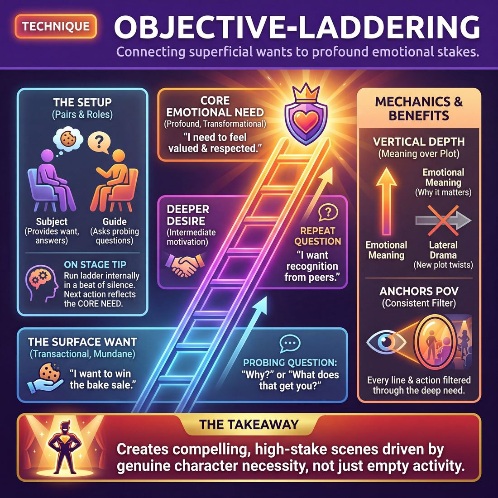

# 🎯 Objective-laddering

> *A drillable muscle that trains **Stakes / The 'Want'**.*

{ .infographic }

## 🎯 The essence

**Objective-laddering** is a rapid-fire exercise where players take a superficial character desire—like wanting to win a local bake sale—and repeatedly ask "Why?" or "What does that get you?" to uncover the deeper emotional need driving it. It isolates and drills a single, vital muscle: the ability to instantly connect mundane activities to profound, playable **stakes** (what is at risk or deeply desired by the character). By forcing improvisers to move past merely playing actions, this technique helps them discover exactly *why* their character cares.

## 🎓 What it trains

Objective-laddering directly targets the skill of establishing **Stakes / The "Want"**. It is the ultimate antidote to the **transactional scene**—the common improviser trap of arguing over a parking space, ordering a coffee, or fixing a tire for five minutes without anyone on stage actually caring about the outcome.

At the Novice stage, improvisers often play activities with no underlying reason to care. As they progress to Advanced Beginners, they might state a want ("I want a refund"), but that want remains shallow and disconnected from their character's heart. If they don't get the refund, nothing of consequence happens. The scene stalls because there is no emotional engine driving the behavior.

This technique builds the muscle of **emotional excavation**. It trains improvisers to instinctively connect a surface-level task to a core human need—such as respect, love, safety, control, or belonging. By practicing the act of "climbing the ladder" from a mundane action to a profound emotional stake, improvisers develop the reflex to establish exactly what is at risk for their character. 

!!! abstract "The Core Shift"
    Objective-laddering trains you to move from **transactional wants** ("I want to buy this sports car") to **transformational wants** ("I want to feel young, powerful, and admired again"). The former creates a negotiation; the latter creates a compelling scene.

The deeper principle at play is that compelling characters are driven by deep, often unspoken desires, even when doing ordinary things. A scene about fixing a broken toaster is boring; a scene about fixing a broken toaster where the character desperately needs it to work *to prove to their spouse they aren't a failure* is captivating. Objective-laddering bridges the gap between the mundane "what" and the vital "why," pushing an improviser toward Competence by ensuring they always know exactly what their character stands to lose.

## 💡 Why it works

Objective-laddering works because it provides a reliable cognitive scaffold for **vertical depth**, bypassing the improviser’s instinct to invent **lateral plot**. 

When improvisers realize a scene lacks energy, or when a coach yells "Raise the stakes!", the common panic-response is to invent external, high-octane drama: a hidden gun, a sudden divorce, or a ticking bomb. This creates a chaotic scene where characters are merely reacting to wild circumstances rather than driving the narrative through their own desires. 

Objective-laddering exploits a simple, repetitive internal question—*“If I get that, what does it give me?”*—to force the improviser's focus inward instead of outward. 

!!! abstract "Vertical vs. Lateral Stakes"
    *   **Lateral expansion (Plot):** "I want a promotion" ➡️ "I want a promotion and I'm going to steal the boss's car to get it!" *(Adds new, unrelated elements; emotionally hollow).*
    *   **Vertical expansion (Meaning):** "I want a promotion" ➡️ "I want the corner office" ➡️ "I want my peers to respect me" ➡️ "I want to know my life has value." *(Deepens the existing element; emotionally rich).*

Here is the engine under the hood:

*   **It bridges the mundane and the universal:** Audiences rarely care about a surface-level activity (e.g., fixing a toaster, buying a bus ticket). They *do* care deeply about universal human needs (safety, belonging, respect, love). Laddering mechanically connects the trivial activity to a profound human condition.
*   **It removes the pressure to be clever:** Because the technique relies on answering a logical sequence of "whys," the improviser doesn't have to invent a brilliant narrative twist. They only have to answer the next immediate emotional question.
*   **It anchors the character's point of view:** Once an improviser ladders down to a core need (e.g., "I need to feel in control"), every subsequent line of dialogue or physical action is filtered through that specific emotional lens. It makes the character instantly consistent and compelling.

!!! tip "On stage"
    You rarely speak the entire ladder out loud. The cognitive trick is running the ladder in your head during a beat of silence, then letting your next line of dialogue reflect the *bottom* of the ladder (the core need), rather than the top (the surface activity).

## 🧩 The setup

Here is everything you need to arrange before running this exercise. Because Objective-laddering is a highly focused, conversational drill, the physical setup should minimize distractions and maximize eye contact.

*   **Players & Arrangement:** Divide the room into pairs. Have them sit in chairs facing each other, close enough to maintain unbroken eye contact and speak at a conversational volume. 
*   **Space & Materials:** A standard rehearsal room. Two chairs per pair. No other materials are required.
*   **Time:** 10–15 minutes total. Allocate about 2 to 3 minutes per round, ensuring both players in the pair get a chance to play both roles.
*   **Roles:** 
    *   **The Subject:** The player who provides the initial, mundane "want" and answers the probing questions, allowing their character's emotional stakes to deepen.
    *   **The Guide:** The player who actively listens and repeatedly asks variations of "Why?" or "What does that get you?" to drive the Subject up the ladder of stakes.
*   **Prerequisites:** Players should be at least at the **Advanced Beginner** stage of *Stakes / The "Want"*, meaning they understand the basic concept of a character having a goal or activity, even if they currently struggle to make the audience care about it.

!!! quote "How to introduce it (Facilitator Script)"
    "In improv, we often start scenes with mundane activities or simple goals—like making a sandwich, fixing a tire, or buying a bus ticket. There is nothing wrong with these goals, but on their own, they don't give us much to care about. 
    
    Today, we are going to practice **Objective-laddering**. We are going to take those boring, everyday wants and dig until we hit emotional bedrock. In your pairs, one of you will state a simple, physical want. The other will be the Guide, gently but relentlessly asking, 'What does that get you?' or 'Why is that important?' 
    
    Your goal as the Subject is to answer honestly, letting each answer reveal a slightly deeper, more personal layer of your character, until a simple sandwich becomes a matter of emotional survival. Let's sit down, lock eyes, and find out why these little things matter so much."

!!! tip "On stage"
    While this drill is done seated to isolate the verbal and emotional muscles, remind players that the ultimate goal is to internalize this process. Eventually, they will do this laddering *internally* and instantaneously while walking on stage.

## ⚙️ The mechanics

The core loop of **Objective-laddering** isolates the muscle of justification. It forces players to take a static, mundane goal and systematically attach escalating emotional weight to it. By keeping the physical objective exactly the same while raising the internal stakes, improvisers learn how to make the audience care deeply about simple actions.

### The Ladder of Stakes
Before running the drill, players must understand the "rungs" they will be climbing. Every objective can be justified at four distinct levels of intensity:

| Rung | Level of Stake | The Focus | Example (Objective: Finding a lost watch) |
| :--- | :--- | :--- | :--- |
| **1** | **Practical** | The physical task itself. | "I need to find my watch so I know what time it is." |
| **2** | **Relational** | How the task affects social standing or another person. | "I need to find my watch so my boss doesn't yell at me for being late again." |
| **3** | **Emotional** | How the task affects the character's self-worth, pride, or deep fears. | "I need to find my watch because it was my grandfather's, and losing it means I'm irresponsible." |
| **4** | **Existential** | Core identity, survival, or fundamental worldview. | "If I can't even keep track of this watch, how can I possibly be trusted to raise a child?" |

### Flow of Play
This technique is best run as a structured two-person scene. The roles are the **Protagonist** (who wants the object) and the **Obstacle** (who gently gets in the way).

1. **The Mundane Anchor:** The Protagonist initiates the scene engaged in a simple, physical task (e.g., sweeping the floor, looking for a pen, making a sandwich). They state their Level 1 (Practical) want.
2. **The Gentle Obstacle:** The Obstacle enters and provides a **soft block**—a minor distraction, a delay, or a simple question ("Why are you doing that right now? Can you help me instead?"). They do *not* introduce high stakes; their job is simply to impede the Protagonist.
3. **The First Step Up:** The Protagonist insists on completing their task, but must now justify it by stepping up to Level 2 (Relational). They explain why the task matters to someone else.
4. **The Persistent Obstacle:** The Obstacle continues to gently impede, dismiss, or misunderstand the importance of the task, forcing the Protagonist to fight harder for it.
5. **The Emotional Core:** The Protagonist elevates to Level 3 (Emotional), revealing a vulnerable, personal reason why this specific task must be completed *right now*. 
6. **The Existential Peak:** Pushed one final time by the Obstacle, the Protagonist hits Level 4. The mundane task is now a matter of identity or spiritual survival. 

!!! tip "On stage: Keep the object mundane"
    The magic of this technique relies on the physical reality remaining completely ordinary. A broom must remain just a broom; it cannot suddenly become a bomb-defusing device. The stakes must come entirely from the *character's internal relationship* to the broom, not from inventing external action-movie circumstances.

### Rules & Constraints
* **Climb, don't leap:** Jumping straight from "I'm sweeping" to "If I don't sweep, my life has no meaning" feels absurd and unearned. Players must hit the relational and emotional rungs first to ground the scene.
* **Play the feeling, not just the words:** As the stakes rise, the Protagonist's physical urgency, vocal tone, and emotional intensity must escalate to match the new justification. 
* **The Obstacle must remain low-status/low-stakes:** If the Obstacle matches the Protagonist's intensity (e.g., "Stop sweeping or I'll kill you!"), the exercise breaks. The Obstacle must remain casually dismissive or mildly needy to force the Protagonist to generate the stakes themselves.

### Ending and Resetting
A round concludes when the Protagonist reaches the existential rung and plays out that high-stakes emotion for a few lines, culminating in a natural peak (either they achieve the mundane task with tears in their eyes, or they tragically fail). 

To reset, clear the stage, swap roles, and have the new Protagonist initiate with a completely different, unrelated mundane task.

## 🎬 Sample round

!!! example "Sample round: The Breakroom Donut"
    In this exercise, two players begin a scene with a simple, surface-level desire. At the coach’s prompt, they must "ladder up" their objective—moving from a physical want, to a relational want, and finally to a deep, existential need. 

    **The Setup:** Sam and Alex are coworkers in the office breakroom. There is one donut left in the box.

    **Step 1: The Surface Want (Physical/Activity)**
    > **Sam:** "I'm taking this last glazed donut. I skipped breakfast."
    > **Alex:** "Actually, I was about to throw that out. It's stale and I'm trying to wipe down the counter."
    
    *Annotation:* Both players have established clear, but low-stakes, surface objectives. Sam wants food; Alex wants a clean workspace. If the scene stays here, it will likely devolve into a petty, circular argument about pastry freshness.

    **Step 2: Laddering Up (The Relational Want)**
    > **Coach:** *"Ladder up. Make it about each other."*
    > **Sam:** "I've been here since 6 AM covering your accounts, Alex. I *earned* this donut."
    > **Alex:** "And I've been covering for your sloppy paperwork all week! Let me have one clean surface in this office so I can actually think."
    
    *Annotation:* The players elevate the stakes. The objective shifts from the physical objects (the donut and the sponge) to their relationship. Sam now wants **respect and acknowledgment**; Alex wants **boundaries and competence**. 

    **Step 3: Laddering to the Existential (The Core Need)**
    > **Coach:** *"Ladder up again. What is the ultimate, emotional stake?"*
    > **Sam:** *(Voice cracking slightly)* "If I don't get to eat this donut, it means I really am completely invisible to everyone in this company."
    > **Alex:** *(Dropping the sponge)* "If I can't control this one square foot of formica, my entire life is officially spiraling into chaos."
    
    *Annotation:* The stakes are now deeply felt and highly playable. The donut is no longer just a donut—it is a symbol of Sam's self-worth. The clean counter is a symbol of Alex's sanity. By laddering the objective, the players have transformed a mundane breakroom negotiation into a compelling scene about two desperate people.

## 🎚️ Variations & progressions

Objective-laddering is a highly adaptable drill. As players mature in their grasp of **Stakes / The "Want"**, the technique shifts from explicitly stating surface desires to letting deep, unspoken needs fuel the scene. 

Here is how to ramp the difficulty to match the room's experience level.

### 1. The "Why" Interrogation (Novice to Advanced Beginner)
For players who tend to play mundane activities with no reason to care (Stage 1), the coach acts as an active interrogator. 
*   **The Mechanic:** Two players begin a scene based on a simple activity (e.g., washing a car). The coach freezes the scene and asks one player, *"Why do you want to wash this car?"* The player answers (e.g., *"To impress my neighbor"*). The coach says, *"Play that."* A minute later, the coach freezes it again: *"Why do you want to impress your neighbor?"* 
*   **The Goal:** This forces Advanced Beginners to state a "Want" when reminded (Stage 2), physically feeling the difference between playing an action and playing a motivation.

### 2. The Secret Ladder (Competent)
Once players can articulate their wants, the training wheels come off. The objective must move into the **subtext**—the underlying meaning behind the words.
*   **The Mechanic:** Players are given a mundane surface want (e.g., "I want to borrow a pen"). Before stepping on stage, they internally ladder that want up three levels to a high-stakes emotional need (e.g., "I want to borrow a pen" ➡️ "I want to write down this phone number" ➡️ "I want to prove I am ready for love"). 
*   **The Goal:** They must play the scene pursuing that massive emotional want *without ever saying it aloud*. This pushes players into Stage 3, where they establish what is at risk for the character through behavior and tone, rather than exposition.

!!! tip "On stage: Let the ladder build tension"
    Don't jump straight from "I want a pen" to weeping about loneliness in line two. The power of the Secret Ladder is in the *disproportionate intensity* you bring to the mundane task. Let the audience slowly realize that the pen is a matter of life and death.

### 3. Opposing Escalations (Proficient)
This variation introduces friction by pitting two escalating ladders against each other.
*   **The Mechanic:** Both players enter with distinct, unrelated wants. The coach calls out *"Ladder up!"* every 30 to 60 seconds. On that cue, *both* players must instantly raise the emotional stakes of their own objective, making it more vital to their character's identity.
*   **The Goal:** This trains Stage 4 proficiency. The stakes are felt, not stated, and they actively fuel the scene. Because both players are escalating simultaneously, a natural, inevitable collision occurs, driving the narrative arc forward.

### 4. The "Want vs. Need" Pivot (Master)
At the highest level, objective-laddering is used to find the breaking point where a character's rigid "Want" shatters to reveal a vulnerable "Need."

| Ladder Stage | What the character projects | Maturity Stage |
| :--- | :--- | :--- |
| **Surface Want** | "I want to win this argument about the dishes." | Stage 2: States a want. |
| **Emotional Want** | "I want you to admit I contribute to this house." | Stage 3: Establishes what's at risk. |
| **The Deep Need** | "I need to know you won't leave me." | Stage 5: Makes the audience genuinely care. |

*   **The Mechanic:** The player ladders up their objective until the stakes become so impossibly high that the character can no longer sustain the facade. They must drop their aggressive pursuit of the "Want" and confess the underlying "Need." 
*   **The Goal:** This is the hallmark of Stage 5 mastery. The improviser makes the audience genuinely care about an absurd or stubborn person by exposing the raw, universal humanity at the very top of the ladder.

## 🧑‍🏫 Coaching notes

As a coach, your primary job during Objective-laddering is to prevent players from settling for transactional or logistical wants. You are actively pushing them down the ladder—moving them from the head (logic and plot) to the heart (emotion and relationship). 

!!! tip "Coaching: The 'So What?' Prompt"
    The single most important side-coaching cue you can give is: **"If you don't get this, what do you lose?"** 
    
    This forces the improviser to instantly attach a consequence to their objective. It transforms a casual preference into a vital, felt stake.

### High-Impact Side-Coaching
Don't wait for the scene to end to fix a shallow objective. Step in while the scene is running with short, punchy directives:

* **To push past the superficial:** *"Go deeper. Why does that matter?"* or *"Drop the object, keep the need."*
* **To connect the want to the partner:** *"Make it about the person in front of you,"* or *"How are they the only one who can give this to you?"*
* **To create urgency:** *"Why today?"* or *"What happens if you walk out that door without it?"*
* **To ground the emotion:** *"Stop negotiating and tell them how you feel."*

### What 'Good' Looks and Sounds Like
You will know the technique is working when you observe distinct, physical shifts in the players. You are watching for the moment the stakes become **felt, not stated**.

* **Physicality anchors:** Fidgeting, pacing, and "object work for the sake of object work" will naturally fall away. Players will often plant their feet, square their shoulders, and hold sustained eye contact.
* **Vocal tone drops:** As the emotional weight of the objective increases, players' voices typically lower in pitch, slow down, and lose the frantic, jokey cadence of a novice scene.
* **Dialogue shifts from 'It' to 'You':** The language moves from discussing external things (*"I need the car keys"*) to relational dynamics (*"I need you to trust me to drive"*). 

!!! warning "Watch out for 'Soap Opera' acting"
    When pushed to raise the stakes, improvisers will sometimes substitute genuine emotional investment with melodramatic yelling or fake crying. If you see this, side-coach: **"Play it smaller. Let it hurt."** True stakes require vulnerability, not volume.

## 🧭 Debrief & reflection

The goal of the debrief is to help players recognize the visceral difference between a superficial desire and a deeply felt emotional need. By unpacking the exercise, improvisers learn to identify exactly when a scene transitions from a mere activity to a compelling interaction with real stakes.

Use these questions to guide the post-round discussion:

*   **"At what point did the objective shift from a physical task to an emotional need?"**
    *   *Listen for:* Players identifying the exact rung on the ladder where "I want to fix this toaster" became "I want to prove I am still useful." This highlights the bridge between playing activities and establishing what is at risk.
*   **"How did your body, voice, or posture change as the 'Want' escalated?"**
    *   *Listen for:* Awareness of physical shifts. Players should notice that as the stakes get higher, they often become more grounded, make stronger eye contact, or drop their vocal register. High stakes do not automatically mean yelling; they mean *caring*.
*   **"Which level of the ladder felt the most playable for a full scene?"**
    *   *Listen for:* The realization that the absolute top of the ladder (e.g., "I want to be a god") is often too abstract, while the bottom ("I want a pencil") is too trivial. The sweet spot for scene work usually lies in the middle-upper rungs—deeply personal, yet grounded in the immediate relationship.
*   **"How did your partner’s escalating want affect your own?"**
    *   *Listen for:* Recognition that stakes are contagious. When one player reveals a vulnerable, core need, it naturally pulls the other player out of their head and forces a more authentic, high-stakes reaction.

!!! abstract "The 'Aha' Moment"
    A successful debrief surfaces a crucial realization: **every surface want is just a vehicle for a core need.** Players should walk away understanding that they don't need to invent life-or-death scenarios (like defusing a bomb) to have high stakes. They simply need to care deeply about the mundane things right in front of them.

!!! tip "On stage"
    Remind players that in a real show, they won't explicitly state every rung of the ladder out loud. The drill builds the **muscle memory** of escalating stakes internally, so that eventually, the stakes fuel the scene without needing to be announced.

## ⚠️ Common pitfalls

!!! warning "Watch out: The 'Therapy Couch' Trap"
    The most common headline mistake in Objective-laddering is abandoning the base reality to talk exclusively about feelings. When cognitive load gets too high, improvisers often drop the immediate, physical scene (e.g., fixing a tire) to stare at each other and explicitly discuss their deep psychological needs. The scene turns into a therapy session. 
    
    **The Fix:** The deeper the emotional want, the harder you must focus on the immediate physical task. If your deep objective is "to prove I am self-sufficient," you don't say that out loud—you just refuse to let your partner hand you the lug wrench.

When learning to connect immediate actions to deeper stakes, players often stumble into a few predictable traps. Here is how they break down and how to correct them:

**1. Dropping the Immediate Object**
*   **The Trap:** Once a player discovers their high-level objective (e.g., "I want to be respected"), they stop caring about the low-level objective (e.g., "I want the last slice of pizza"). They let the pizza go because "respect is more important."
*   **The Fix:** The high-level objective must *supercharge* the low-level objective, not replace it. You must fight for that pizza *because* getting it is the only way to prove you are respected in this house. 

**2. The Disconnected Leap**
*   **The Trap:** The jump from the immediate want to the deeper want lacks emotional logic. A player might think, "I want to buy this toaster... and my deep want is to find true love!" without bridging the gap. It feels like a random non-sequitur rather than a ladder.
*   **The Fix:** Force the player to articulate the "because" or the "so that." (*"I want this specific four-slot toaster so that I can make breakfast for a large family, because I am terrified of dying alone."*)

**3. Broadcasting (Telling instead of Showing)**
*   **The Trap:** In the **Advanced Beginner** stage, players often state their "Want" explicitly when reminded. Under the pressure of the exercise, they might literally say, "I am washing these dishes because I crave order in a chaotic universe." It sounds like an actor doing an exercise, not a human being.
*   **The Fix:** Shift the focus toward behavior. As players move toward **Proficient**, stakes should be *felt, not stated*. Coach the player to internalize the top of the ladder, but only speak from the bottom of the ladder. 

!!! example "In a scene: Fixing the Broadcast"
    **Broken (Broadcasting):** "Give me the keys! I need to drive because I need to feel in control of our marriage!"
    
    **Fixed (Felt Stakes):** "Give me the keys. I'm driving. You picked the restaurant, you picked the movie, you picked the house we live in. I am driving the car."

## 🌟 What mastery looks like

When an improviser masters **Objective-laddering**, the exercise ceases to look like a cognitive drill and becomes a seamless emotional metamorphosis. The master improviser doesn't just *state* the escalating wants; they let each new rung of the ladder physically and emotionally alter them in real time. 

Here is what mastery of this technique looks like in practice:

*   **Stakes are felt, not stated:** The improviser doesn't just say, "I want respect." Their posture straightens, their voice drops, and their eye contact sharpens. The escalating stakes fuel the character's behavior rather than just serving as dialogue.
*   **Seamless leaps:** The transition from a mundane, tactical objective ("I want to fix this toaster") to a profound, existential one ("I want to bring warmth back into this house") feels entirely justified and inevitable, never jarring or forced.
*   **Grounding the absurd:** A master can take a completely ridiculous surface want—like wanting to steal a penguin from the zoo—and ladder it to a universal human need (the desperate desire to care for something innocent). They make the audience genuinely care about absurd people.
*   **Bidirectional fluidity:** They can effortlessly **ladder up** (moving from a specific action to an existential need) and **ladder down** (translating a massive, abstract need into a hyper-specific, immediate physical action).

!!! example "In a scene: The Master's Ladder"
    *Adv. Beginner:* "I want this parking spot. Actually, I want to win. I want to feel powerful because my life is out of control." *(Stated, cognitive, rushed).*
    
    *Master:* "I need this parking spot." *(Grips the steering wheel, voice tightening).* "I just need one thing to go right today." *(Tears welling up, looking at the passenger).* "I need to know I haven't completely failed this family." *(Felt, physicalized, escalating stakes).*

!!! abstract "The Ultimate Goal"
    Mastery of this drill means the improviser no longer needs to consciously climb the ladder step-by-step on stage. They instinctively anchor every trivial action to a deep, beating heart, ensuring that no matter how silly the scene's premise gets, the underlying stakes remain incredibly real.

## 🔗 Why it matters

As we've seen, Objective-laddering is the ultimate antidote to the **transactional scene**—those dreaded improvisational dead-ends where characters spend five minutes politely negotiating the price of a coffee or arguing over whose turn it is to take out the trash. 

By training the muscle to continuously ask *why* a character wants something, this technique directly builds the skill of **Stakes / The "Want"**. It forces improvisers to abandon Stage 1 habits (playing activities with no reason to care) and pushes them toward Stage 4, where stakes naturally fuel the scene's momentum. 

In the broader domain of **The Scene**, a compelling architecture requires a motor. Objective-laddering provides that motor by serving both primary engines of improv:

*   **Fueling the Narrative Engine:** A deep, existential want creates a natural trajectory. If a character's surface want (buying a watch) is laddered up to a deep need (wanting to freeze time before their child leaves for college), the scene instantly gains a narrative arc. Every action they take is now a step toward or away from that emotional goal, making character change feel inevitable.
*   **Grounding the Game Engine:** A deep want justifies absurd behavior. If a character is obsessively organizing pencils by length (the unusual thing), the comedic game is infinitely more sustainable if their underlying want is "to prevent the chaos of the universe from swallowing me whole." The higher the emotional stakes, the harder the audience will laugh at the absurdity of the character's methods.

!!! abstract "The universal bridge"
    The audience might not relate to a character who wants to build a working spaceship out of cheddar cheese, but they *do* relate to a character who desperately wants to prove their doubting father wrong. Objective-laddering connects bizarre, improvised premises to universal human empathy.

Ultimately, this technique teaches improvisers that the object of a scene is rarely the *actual* object. By mastering the climb from a trivial desire to a core human need, you learn to make the audience genuinely care about absurd people—the hallmark of masterful scene work.

## 📚 References & Further Reading

### Foundational sources
*   **Constantin Stanislavski, *An Actor Prepares* (1936)** — The undisputed origin of the "Super-Objective" and "Units and Objectives." Stanislavski provides the theatrical foundation for laddering, teaching that every minor, mundane action a character takes (a unit) must be inextricably linked to their profound, overarching life goal (the super-objective). This is the original framework for moving from a transactional task to a transformational need.
*   **Michael Shurtleff, *Audition* (1978)** — Introduces the vital acting guidepost "What are you fighting for?". Shurtleff explicitly warns against passive, negative, or transactional goals (e.g., "I want to leave the room" or "I want to buy a coffee"). Instead, he forces performers to excavate the active, high-stakes emotional need driving the behavior, ensuring the actor is always fighting for a deeply held dream or survival instinct.

### Practitioner guides & manuals
*   **Mick Napier, *Improvise: Scene from the Inside Out* (2004)** — A seminal text that dismantles the panic of inventing lateral plot. Napier emphasizes the necessity of making bold, internal emotional choices and "taking care of yourself first." By anchoring a character in a strong emotional state or physical want from the very first second, the improviser ensures the scene is driven by internal stakes rather than chaotic, external circumstances.
*   **Matt Besser, Ian Roberts, and Matt Walsh, *The Upright Citizens Brigade Comedy Improvisation Manual* (2013)** — While famous for its focus on "Game," this manual rigorously details the mechanics of "justification." The UCB approach to asking "Why is this character doing this?" and "If this is true, what else is true?" serves as the exact cognitive engine for objective-laddering, forcing players to build a logical, emotional base reality beneath absurd or mundane actions.
*   **Will Hines, *How to Be the Greatest Improviser on Earth* (2016)** — Hines focuses heavily on the necessity of being present and caring about the scene's emotions. He directly addresses the "transactional scene" trap, urging improvisers to find the "love" or the core human reason a character cares about the situation. His work is a masterclass in grounding absurdity in genuine, recognizable human stakes.

### Lineage & teachers
*   **Viola Spolin, *Improvisation for the Theater* (1963)** — The foundational text of American improv. While Spolin's exercises (theater games) focus heavily on physical activity and maintaining a "Point of Concentration," they are designed to bypass the intellect and force players to ground their actions in genuine, focused reality. Her work trains the exact muscle needed to perform a mundane task (like fixing a toaster) with absolute, compelling commitment.
*   **Patti Stiles, *Improvise Freely* (2021)** — A master teacher in the Keith Johnstone lineage who pushes back against rigid, rule-based improv. Stiles emphasizes emotional connection, vulnerability, and finding the stakes within the relationship dynamic. Her approach to scene work perfectly complements laddering by reminding improvisers that the deepest stakes usually involve how the characters feel about each other, not the object they are arguing over.

### Research & theory
*   **George A. Kelly, *The Psychology of Personal Constructs* (1955)** — The foundational psychological theory positing that human beings organize their values and understanding of the world hierarchically. Kelly's work explains *why* laddering works on an audience: we naturally categorize peripheral, mundane behaviors as subordinate to our core, superordinate identity constructs (like safety, love, and belonging).
*   **D. Bannister and J.M.M. Mair, *The Evaluation of Personal Constructs* (1968)** — The clinical psychology text that formally published the "laddering technique" (originally developed by Dennis Hinkle in his 1965 dissertation). In psychology, laddering is a structured interviewing process that repeatedly asks "Why is that important to you?" to move a subject from superficial preferences to their ultimate core values—the exact real-world equivalent of this improv exercise.
*   **Taiichi Ohno, *Toyota Production System: Beyond Large-Scale Production* (1988)** — Details the "Five Whys" root-cause analysis technique originally developed by Sakichi Toyoda in the 1930s. Used globally in business and manufacturing, the Five Whys is the mechanical twin of objective-laddering: it forces the user to strip away superficial symptoms by asking "Why?" five times until they uncover the systemic, foundational core of a problem.

### Communities & adjacent reading
*   **Declan Donnellan, *The Actor and the Target* (2001)** — Explores how an actor's energy must be directed outward at a specific "target" (what they want). Donnellan provides a modern, highly practical perspective on stakes and objectives, specifically addressing how actors freeze up when they focus on their own anxiety rather than what their character desperately needs to achieve in the space.
*   **Uta Hagen, *Respect for Acting* (1973)** — Her rigorous breakdown of "Objectives" (what I want) and "Obstacles" (what is in my way) directly parallels the improv concept of the "Want." Hagen demands that performers know exactly what they stand to lose in every moment on stage, providing a masterclass in emotional excavation and avoiding empty, performative actions.

## 💬 Quotes & Anecdotes

!!! quote "— Michael Shurtleff, *Audition* (1978)"
    An actor must make his needs (goals, wants, objectives) so strong that he is willing to interfere with the other actor in order to get what he needs.

!!! quote "— Uta Hagen, *Respect for Acting* (1973)"
    What do I want? (Character, main and immediate objectives) What's in my way? What do I do to get what I want?

!!! quote "— Mick Napier, *Improvise: Scene from the Inside Out* (2004)"
    Declare what you honestly want and live that vision fearlessly.

!!! quote "— Will Hines, *Improv Nonsense* (2014)"
    If you're in a transaction scene then decide that you know the clerk and you care deeply about what you're buying.

### Where it comes from
The concept of "laddering" or the "5 Whys" originated in manufacturing and design thinking as a root-cause analysis tool (asking "why" repeatedly to drill down to a core issue). In the theatrical world, the pursuit of the "want" traces back to Konstantin Stanislavski’s "Super-Objective." This was later codified by legendary acting teachers like Uta Hagen (who famously drilled the question *"What do I want?"*) and Michael Shurtleff (who sharpened it to *"What are you fighting for?"*). 

In modern improv, teachers adapted these acting fundamentals to solve the rampant problem of "transactional scenes" (e.g., arguing with a barista or a mechanic). By borrowing the "laddering" framework, improvisers are taught to rapidly drill down from a superficial objective to a Stanislavskian core need in real time, ensuring the scene is driven by emotion rather than plot.

### A telling example
**An illustrative scenario: The Broken Toaster**

To see objective-laddering in action, consider a classic novice trap: a scene where a customer is trying to return a broken toaster without a receipt. 

*   **Without laddering (Lateral/Transactional):** The customer argues about store policy. The clerk calls the manager. The manager says no. The customer threatens to call the Better Business Bureau. Five minutes pass, and the scene is entirely about retail bureaucracy. 
*   **With laddering (Vertical/Transformational):** The improviser playing the customer internally ladders their objective before speaking. 
    *   *Want:* I want to return this toaster.
    *   *Why?* I need a working one today.
    *   *Why?* I am making breakfast for my mother-in-law.
    *   *Why does that matter?* She thinks I am a failure who can't provide for her child.
    *   *Core Need:* I need to prove my worth and defend my marriage.

When the improviser speaks from the *bottom* of that ladder, the scene transforms. The clerk saying, "I can't accept this without a receipt," is no longer a minor inconvenience—it is a devastating blow to the customer's dignity. The customer might burst into tears, or leap over the counter, pleading, "You don't understand, if I don't have perfectly browned sourdough by 8:00 AM, she's going to convince him to leave me!" The toaster is forgotten; the scene is now about human desperation.

## 🧭 Explore the framework

- ⬆️ **Skill it trains:** [Stakes / The 'Want'](03_S4__stakes-the-want.md)
- 🎭 **Domain:** [The Scene](03_D__the-scene.md)
- 🔁 **Sibling techniques:** [What do they stand to lose? reps](03_S4_T1__what-do-they-stand-to-lose-reps.md)
