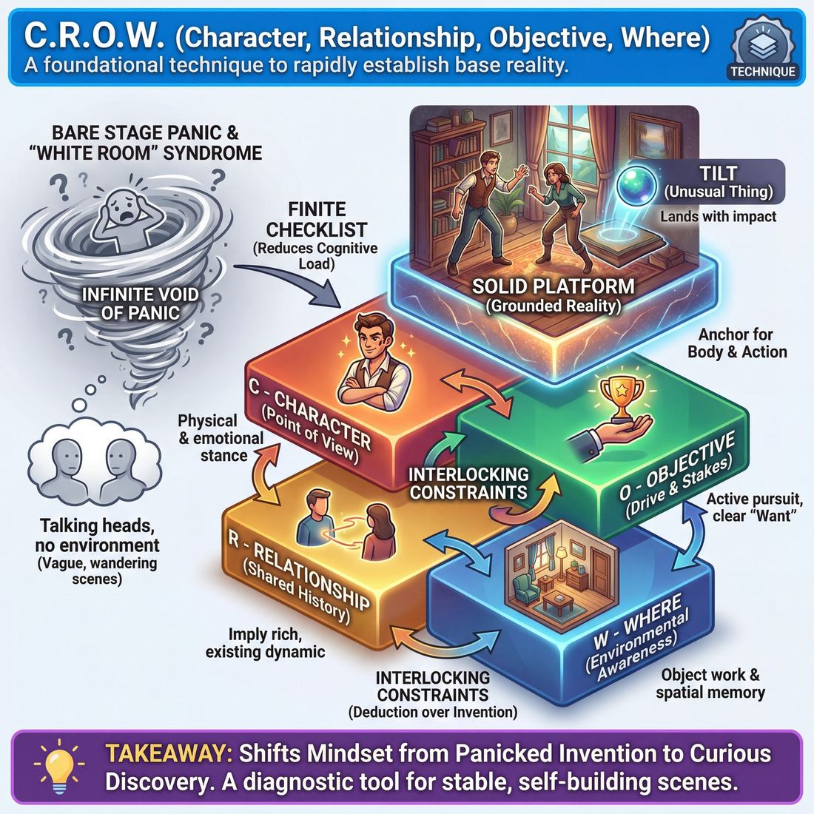

# 🎯 C.R.O.W. (Character, Relationship, Objective, Where)

> *A drillable muscle that trains **World-Building**.*

{ .infographic }

## 🎯 The essence

**C.R.O.W.**—an acronym for **C**haracter, **R**elationship, **O**bjective, and **W**here—is a foundational scene-starting technique that forces improvisers to rapidly establish the base reality of their world. As an exercise, it strips away the pressure to be funny or clever, requiring players to focus entirely on answering these four fundamental questions within the first few lines of dialogue. It trains the single, vital habit of **building a solid platform**: grounding the *who*, *what*, and *where* so completely that the scene has a sturdy, undeniable foundation to stand on before any conflict, game, or "unusual thing" is ever introduced.

## 🎓 What it trains

At its core, C.R.O.W. trains the vital skill of **World-Building**. It is the antidote to the improviser’s most common early panic: stepping onto a bare stage, feeling the heat of the lights, and having absolutely no idea what to do or who to be. 

By providing a reliable mental checklist, this technique builds the muscle of establishing a solid, undeniable reality before trying to be funny or dramatic. It solves the problem of vague, wandering scenes by forcing players to make concrete choices early.

!!! warning "The 'White Room' Syndrome"
    Without a grounding framework, improvisers often default to "talking heads in a white room"—two actors standing center stage, hands in their pockets, arguing about something happening off-stage or in the vague future. C.R.O.W. forces players to paint the walls, furnish the room, and give the people inside it a reason to exist.

Specifically, drilling C.R.O.W. isolates and strengthens four distinct improvisational muscles:

*   **Point of View (Character):** It trains players to adopt a specific physical and emotional stance immediately, rather than playing a slightly panicked version of themselves.
*   **Shared History (Relationship):** It breaks the habit of playing strangers meeting for the first time (which forces heavy exposition) and trains players to imply a rich, existing dynamic.
*   **Drive and Stakes (Objective):** Novice improvisers often perform activities with no reason to care. Training the "Objective" muscle ensures characters have a clear "Want," moving the scene from a static situation into an active pursuit.
*   **Environmental Awareness (Where):** It trains the physical muscle of object work and spatial memory, turning an empty stage into a tactile playground that informs the scene.

!!! abstract "The Deeper Principle: Platform Before Tilt"
    In narrative architecture, you cannot disrupt a normal day until you have established what a normal day looks like. C.R.O.W. trains players to build a sturdy **Platform** (the who, what, and where of the status quo) so that when the **Tilt** (the unusual thing or inciting incident) arrives, it has real impact. You are training the discipline of patience—laying the foundation before building the house.

## 💡 Why it works

Stepping onto a bare stage with no script triggers a natural panic response in the brain: *What are we doing?* C.R.O.W. works by **reducing cognitive load**, replacing that infinite, paralyzing void with a finite, actionable checklist. 

By breaking the overwhelming task of "invent a universe" into four distinct buckets, it exploits several key cognitive and group dynamics:

*   **Scaffolding the Platform:** Before a scene can have a comedic game or a compelling narrative arc, it needs a grounded reality. C.R.O.W. forces improvisers to build this foundation first, short-circuiting the common novice mistake of rushing into conflict before the audience knows who is fighting or why they should care.
*   **Interlocking Constraints:** The four elements of C.R.O.W. are not isolated; they form a self-feeding ecosystem. Human creativity thrives on constraints. When you lock in one or two elements, the brain naturally fills in the rest through deduction rather than raw invention. 
*   **Anchoring the Body:** By explicitly demanding a *Where* and an *Objective*, C.R.O.W. cures the dreaded "talking heads" syndrome. It forces players to interact with their environment and pursue tangible goals, grounding the scene in physical action.

!!! example "In a scene: The Domino Effect"
    You don't need to invent all four elements at once. If your partner establishes the **Where** (a cramped trench) and the **Relationship** (a seasoned sergeant and a terrified rookie), the rest is practically handed to you. 
    
    You no longer have to "invent" a **Character** or an **Objective** out of thin air—you simply deduce them. You adopt the posture of a weary veteran (Character) and decide you want to keep this kid quiet so you aren't discovered (Objective). The scene builds itself.

Ultimately, C.R.O.W. shifts the improviser's mindset from *panicked invention* to *curious discovery*. It provides a diagnostic tool: if a scene feels untethered, boring, or confusing, the players can mentally scan the acronym, identify which element is missing, and instantly inject it to stabilize the world.

## 🧩 The setup

To drill **C.R.O.W.** effectively, you need to strip away the pressure to be funny or to invent a complex plot. The goal of this setup is to isolate the foundational who, what, and where of the scene so players can practice establishing it quickly and clearly.

*   **Players:** Pairs (2 players per scene). The rest of the group sits as an active audience, tasked with identifying the four elements as they appear.
*   **Space & Materials:** An open stage or playing area. Have two chairs available, as sitting immediately grounds the physical space and encourages players to focus on the **Where** and the **Relationship**. No physical props; rely entirely on mime and object work.
*   **Time:** 1 to 2 minutes per scene. Allocate 15 to 20 minutes total so every player gets at least one repetition. 
*   **Roles:** 
    *   **The Players:** Step into the scene and focus exclusively on establishing the four elements. 
    *   **The Facilitator:** Acts as a side-coach and timekeeper. The facilitator tracks the elements mentally (or on a whiteboard) and calls "Scene!" the moment all four are clearly established.
    *   **The Audience:** Watches actively. After the scene, they will be asked to name the specific C, R, O, and W they observed.
*   **Prerequisites:** Basic agreement ("Yes, And") and foundational object work (space work), as the physical environment is crucial for establishing the *Where*.

!!! tip "On stage: The 'Blank Slate' start"
    Have players start in a neutral, resting position rather than rushing into frantic action. Encourage them to take one deep breath, make eye contact, and initiate with a physical action (object work) before speaking their first line.

!!! quote "How to introduce it"
    "Today we are going to build the foundation of a scene, and *only* the foundation. We aren't looking for a joke, a conflict, or a grand story arc. Two of you will step up, and your only goal is to clearly establish four things: **C**haracter, **R**elationship, **O**bjective, and **W**here. 
    
    You have about sixty seconds. Don't rush, but don't be vague. Show us who you are, how you know each other, what you want right now, and where you are standing. The moment the audience and I clearly understand all four elements, I will call 'Scene' and we will rotate. Build the platform; don't worry about the house."

## ⚙️ The mechanics

The core objective of the C.R.O.W. technique is to collaboratively build the **base reality** of a scene as efficiently as possible. When practiced as a drill, the goal is to establish all four elements within the first three to four lines of dialogue, ensuring both the players and the audience know exactly who, what, and where they are before the scene moves forward.

### The Core Loop

When running C.R.O.W. as a rapid-fire scene-start drill, follow this precise sequence:

1. **The Initiation (Line 1):** Player A steps out with a physical action, an emotion, and a line of dialogue. This opening move should establish at least one or two elements (typically **Where** via object work, and **Character** via posture/tone).
2. **The Response (Line 2):** Player B accepts the initiation and immediately provides missing information. If Player A established the location and their own character, Player B might define the **Relationship** and introduce an **Objective**.
3. **The Completion (Lines 3–4):** Both players use their next lines to lock in any remaining elements. By the end of the fourth line, the entire acronym must be active and observable.
4. **The Check (Freeze & Reset):** The coach calls "Freeze!" The players (or the observing improvisers) must explicitly name the C, R, O, and W. If an element is missing or vague, the players identify it, and a new pair steps up to try again.

### The Four Elements in Action

To execute the technique, players must translate abstract concepts into observable behaviors. 

| Element | What it means | How to establish it mechanically |
| :--- | :--- | :--- |
| **Character** | Who you are (point of view, status, archetype). | Alter your voice, adopt a specific posture, or express a strong, unprompted emotion. |
| **Relationship** | How you know each other *and* how you feel about each other. | Use a title/name ("Mom," "Captain"), adjust physical proximity, or use a tone of voice that implies history. |
| **Objective** | What you want right now (the **Stakes**). | State a desire, physically reach for something, or try to change the other person's behavior. |
| **Where** | The physical environment. | Perform specific **object work** (miming props), interact with the architecture of the room, or reference the surroundings. |

!!! example "In a scene: A 3-line C.R.O.W."
    **Player A:** *(Pantomiming aggressively scrubbing a dish, sighing heavily)* "If I have to scrape one more piece of dried egg off a plate, I'm going to scream."
    *(Establishes **Where**: A kitchen/dish pit. Establishes **Character**: Frustrated, overworked.)*
    
    **Player B:** *(Leaning casually against the 'counter', picking their teeth)* "Relax, little brother. The breakfast rush is over. Just cover my shift for ten minutes so I can call Sarah."
    *(Establishes **Relationship**: Siblings/coworkers. Establishes **Objective**: Wants to shirk work to make a phone call.)*
    
    **Player A:** "No way. You're helping me finish these, or I'm telling the manager you're slacking again."
    *(Locks in Player A's **Objective**: Wants fairness/help. The C.R.O.W. is now complete.)*

### Rules & Constraints

To keep the drill rigorous and build the right muscles, enforce these constraints during practice:

* **Share the load:** One player should never monologue to hit all four letters. It is a collaborative build. If your partner gives you two elements, it is your job to provide the other two.
* **Show, don't tell:** Avoid "playwriting" the elements. Instead of saying, "Here we are in the kitchen," mime chopping an onion. Instead of saying, "I am your angry boss," cross your arms and demand a report.
* **No questions:** Questions force your partner to invent the C.R.O.W. for you. Make declarative statements and strong physical choices. 

!!! tip "On stage"
    You don't need to establish the elements in the exact order of C-R-O-W. Let the initiation dictate what comes first. If someone initiates with a strong **Where** (miming steering a ship), let that inspire the **Relationship** (Captain and First Mate) and the **Objective** (surviving a storm).

## 🎬 Sample round

!!! example "Sample round: The Fitting"
    Notice how quickly all four elements can be layered into the first two lines of a scene without heavy-handed exposition.

    **Player A:** *(Mimes pulling a tape measure tight around B's waist, clicking tongue)* "Suck it in, Mr. Higgins. If you slouch at the altar, the Duchess will think she's marrying a croissant."
    
    **Player B:** *(Straightens up stiffly, tugging at his collar)* "I'm trying, Arthur. But this velvet is so heavy, and honestly, I'm terrified of her mother."

    **The C.R.O.W. Breakdown:**

    *   **Character:** 
        *   *Player A:* Fussy, exacting, and slightly condescending (shown via the physical mime, the tongue-click, and the "croissant" insult).
        *   *Player B:* Nervous, insecure, and physically uncomfortable (shown via the stiff posture and admitting fear).
    *   **Relationship:** Tailor and high-society client. There is a clear status dynamic, but enough history that Player B uses a first name ("Arthur") while Player A maintains a formal, judgmental distance ("Mr. Higgins").
    *   **Objective:** 
        *   *Player A's Want:* To execute a flawless garment and force Higgins into proper posture.
        *   *Player B's Want:* To survive the fitting and get emotional reassurance about the wedding.
    *   **Where:** A high-end tailor's shop (painted instantly by the tape measure, the heavy velvet, and the context of a fitting).
    
    **The Result:** In under fifteen seconds, the players have built a sturdy platform. We know who they are, where they are, how they feel about each other, and what is at stake (the impending high-society wedding). The scene is now ready to move forward.

## 🎚️ Variations & progressions

Because C.R.O.W. is a composite technique made of four distinct elements, it is highly modular. You can isolate individual letters to reduce cognitive load for beginners, or compress the timeline to challenge veterans. 

Here is how to ramp the difficulty of C.R.O.W. as players move through the maturity stages.

### 1. The C.R.O.W. Hat (Novice)
When players are just starting out, they often play activities with no reason to care, or freeze under the pressure of inventing a whole world at once. 
*   **The tweak:** Remove the burden of invention. Prepare four hats (or bowls), one for each letter. Players draw a Character (e.g., "Grumpy old man"), a Relationship ("Former high school sweethearts"), an Objective ("To get an apology"), and a Where ("A crowded bus"). 
*   **The focus:** Executing the elements rather than inventing them. 

!!! tip "On stage"
    If four elements are still too much to juggle, drop the "O" temporarily. Have Novices focus purely on **C.R.W.** (Who are we, how do we know each other, and where are we?). The Objective can be layered in once they are comfortable existing in a shared space.

### 2. Three-Line C.R.O.W. (Advanced Beginner)
Advanced Beginners can usually hit narrative beats when prompted, but left to their own devices, their scenes may wander. This variation forces efficiency.
*   **The tweak:** The improvisers have exactly three lines of dialogue total (Player A, Player B, Player A) to establish all four elements of C.R.O.W. 
*   **The focus:** Eradicating vague openings. It forces players to make strong, specific choices immediately.

!!! example "In a scene"
    **Player A:** "Pass the scalpel, Doctor; this heart isn't going to transplant itself." *(Where: Operating room. Character: Surgeon. Objective: Do the surgery.)*
    **Player B:** "I'm trying, Dad, but my hands won't stop shaking!" *(Relationship: Father/Child. Character: Nervous resident.)*
    **Player A:** "Breathe, son—you need to prove to the board you belong here." *(Objective refined: Pass the evaluation.)*

### 3. Silent C.R.O.W. (Competent)
Competent players know how to build a platform deliberately, but they often rely too heavily on dialogue to do it. 
*   **The tweak:** The scene begins with 30 to 60 seconds of complete silence. Players must establish Character (through posture and pace), Relationship (through proximity and eye contact), and Where (through **object work**—miming the use of physical items) before a single word is spoken. 
*   **The focus:** Grounding the scene in physical reality. By the time the first line is spoken, the Objective usually emerges naturally from the physical environment they've built.

### 4. The Secret "O" (Proficient to Master)
Proficient players understand that stakes should be felt, not stated. This variation trains players to pursue an objective through subtext rather than exposition.
*   **The tweak:** The coach gives the players a shared Character, Relationship, and Where. However, each player is secretly handed a conflicting Objective on a slip of paper (e.g., Player A: *Get them to lend you money*; Player B: *Convince them to move away with you*). 
*   **The focus:** Fueling the scene's narrative architecture through behavior. Players must pursue their "Want" without ever explicitly stating it aloud. 

!!! abstract "Key idea: Engine Selection"
    As players reach the Master stage, C.R.O.W. stops being a checklist and becomes a diagnostic tool. A Master improviser will establish C.R.O.W. invisibly, then read the room: *Did our Objective just create a fun, repeatable pattern?* (Game Engine). *Or did it create a deep emotional stake that needs resolving?* (Narrative Engine). They use C.R.O.W. to build the car, then decide which engine to turn on.

## 🧑‍🏫 Coaching notes

When coaching **C.R.O.W.**, your primary job is to act as the players' external awareness. Novice improvisers often get tunnel vision, locking onto one element (usually Character or an activity) while completely forgetting the others (usually Where and Relationship). Your side-coaching should pull them out of their heads and ground them in the reality of the scene.

!!! tip "Coaching"
    **The single most important cue: "Name the missing letter."** 
    Don't let scenes drift in a white void. If two players are arguing but have no established dynamic, call out: *"Relationship! Who are you to each other?"* If they are talking heads, call out: *"Where! Touch an object."* Prompt them to fill the specific void immediately.

### Diagnostic Side-Coaching
Watch the scene unfold and use sharp, actionable directives to supply whatever the players are neglecting. 

| If you see... | The missing element | Effective Side-Coach |
|---|---|---|
| **"Talking heads" floating in space** | **W**here | *"Interact with your environment."*   *"Show me the room."* |
| **Polite "Stranger Syndrome"** | **R**elationship | *"Give yourselves a history."*   *"How do you feel about them?"* |
| **Aimless chatting or generic bickering** | **O**bjective | *"What do you want right now?"*   *"Make it matter to you."* |
| **Players just playing themselves** | **C**haracter | *"Change your posture."*   *"Give me a strong point of view."* |

### What "Good" Looks and Sounds Like
A successful C.R.O.W. drill does not sound like a checklist. You are listening for **implication over exposition**. Players should not announce their C.R.O.W. facts; they should let the facts bleed into their actions and dialogue. 

!!! example "In a scene"
    **Telling (Weak C.R.O.W.):** "Hello, my wife. We are in the bedroom. I want you to help me pack for our vacation." *(The player is just reciting the acronym.)*
    
    **Showing (Strong C.R.O.W.):** "Toss me that sunscreen, honey. If we don't get these suitcases zipped in five minutes, we're going to miss the flight to Maui." *(Character: stressed traveler; Relationship: spouses; Objective: pack quickly; Where: bedroom/packing).*

### Coaching the Progression
As players move from Novice to Competent, shift your coaching from *establishing* the facts to *caring* about them. Once they can successfully define the **O**bjective, push them on the stakes: *"Why do you need this right now?"* or *"What happens if you don't get it?"* This bridges the gap between simply playing an activity and actually driving a scene with purpose.

## 🧭 Debrief & reflection

After running a C.R.O.W. drill, the debrief shifts the focus from *did we check the boxes?* to *how did the scene feel once the boxes were checked?* The goal is to help improvisers internalize these four pillars so they become an instinct rather than a mental chore.

Use these questions to guide the reflection:

*   **The Audit:** "If you were in the audience, could you confidently name the Character, Relationship, Objective, and Where for that scene?"
*   **The Missing Link:** "Which of the four elements took the longest to establish, or felt the weakest?"
*   **Show vs. Tell:** "Did we *say* we were in a dentist's office, or did we *adjust the overhead light* and ask about flossing?"
*   **The Catalyst:** "At what exact moment did the scene stop feeling like hard work and start playing itself?"

A strong debrief usually surfaces a few common "aha" moments. Players will often realize that the **Objective** (the "Want") is the most frequently forgotten element, leading to polite but aimless scenes. They will also discover that **Relationship** is about the emotional dynamic, status, and history between the characters, not just a sterile label like "coworkers" or "siblings." 

!!! note "The 'Stuck Scene' Diagnostic"
    When players complain that a scene felt like wading through mud, use C.R.O.W. as a diagnostic tool. Ask the backline: *"What was missing?"* Nine times out of ten, the debrief will reveal that the scene lacked a clear **Where** (leaving the actors floating in a void) or a driving **Objective** (leaving them with nothing to do). 

By consistently reflecting on these four elements, players learn to self-diagnose their work in real time, recognizing exactly what a scene needs to get off the ground before the momentum stalls.

## ⚠️ Common pitfalls

!!! warning "Watch out: The Exposition Dump"
    When players first learn C.R.O.W., the cognitive load of tracking four distinct elements often leads to panic. The result is the **Exposition Dump**: cramming all four letters into the first two lines of dialogue. 
    
    > *“Hello, my brother [Relationship]. I am a grumpy old man [Character] and we are here in the bakery [Where] because I want to buy a pie [Objective].”*
    
    **The Fix:** Trust that you have the whole scene to reveal these elements. You do not need to check all four boxes in the first ten seconds. Start with one strong, physical choice—like an action that implies the *Where*, or an emotion that implies the *Relationship*—and let the rest emerge naturally through discovery.

Beyond the exposition dump, the pressure to build a complete world in real time often pushes improvisers into a few predictable traps. Here is how they break down and how to fix them:

*   **The Missing "O" (Aimless Chitchat)**
    *   **The Trap:** Players successfully establish who and where they are, but forget to give themselves an **Objective**. The scene becomes two people pleasantly describing their environment or talking about the weather, with no stakes or forward momentum. 
    *   **The Fix:** Give yourself a micro-want immediately. It doesn't have to be a grand narrative quest; it can be as simple as "I want to get this stain out of the carpet" or "I want my coworker to admit I was right." A want creates immediate action.
*   **The Holographic "Where" (Talking Heads)**
    *   **The Trap:** The location is stated verbally ("Sure is hot in this desert"), but the players never interact with it physically. The environment remains a flat backdrop rather than a lived-in space.
    *   **The Fix:** Anchor the *Where* in your body. Use **object work**. If you are in a kitchen, chop an invisible onion. If you are in a desert, wipe the sweat from your brow and squint against the sun. Let the environment affect your physical behavior.
*   **Generic Relationships**
    *   **The Trap:** Settling for a sterile, factual relationship like "we are coworkers" or "we are roommates," which provides no emotional fuel for the scene.
    *   **The Fix:** Define *how* you feel about the other person, not just your legal or professional tie. "Jealous rivals" gives you infinitely more to play with than just "coworkers." 

!!! tip "On stage: The 'One-at-a-Time' Fix"
    If you feel overwhelmed mid-scene, stop trying to juggle all four elements. Pick the *one* element that feels weakest right now and feed it. If you know who you are but don't know where you are, reach out and touch an imaginary object. The object will tell you where you are.

## 🌟 What mastery looks like

At the highest level of play, C.R.O.W. ceases to be a mental checklist and becomes an invisible, integrated reflex. The master improviser doesn't spend the first minute "setting up" the scene; they simply step into a fully realized world, allowing the audience to immediately orient themselves and invest in the moment.

When observing a master execute this technique, you will see:

*   **Simultaneous establishment:** Instead of layering Character, Relationship, Objective, and Where sequentially, a master implies three or four elements in a single line of dialogue or a specific physical action. 
*   **Behavior over exposition:** The **Where** is defined by how they interact with the space (miming the weight of a rusted lever), not by naming the location. The **Character** is defined by posture, rhythm, and point of view, rather than a stated profession.
*   **Relational Objectives:** The **Objective** (the "Want") transcends mere physical tasks. It is deeply tied to the **Relationship**, establishing immediate, felt stakes that make the audience genuinely care about the characters—even if those characters are entirely absurd.
*   **Invisible architecture:** Because the base reality is established so solidly and efficiently, the improviser can seamlessly read what the scene needs. They can architect a full narrative arc or find and play a comedic game without the mechanics of world-building ever showing their seams.

!!! example "In a scene: The Masterful Opening"
    **The Novice approach (Sequential & Stated):** 
    *(Standing still)* "Hello, my son. I am glad we are in the garage. I want to fix this car."
    
    **The Master approach (Integrated & Shown):** 
    *(Wiping imaginary grease onto a rag, avoiding eye contact, speaking with a tight jaw)* "Hold the flashlight steady, kid. If we don't get this alternator in before your mother gets home, we're both dead."
    
    **Why it works:** In one line and one physical action, we have the **Where** (a garage/driveway, established by the grease and alternator), the **Character** (a stressed, mechanically-inclined parent), the **Relationship** (parent/child, currently tense), and the **Objective** (fix the car to avoid the mother's wrath). The stakes are felt immediately, and the scene is ready to take off.

Ultimately, mastery of C.R.O.W. looks like profound economy. By doing the heavy lifting of world-building in the first few seconds, the master buys themselves the freedom to spend the rest of the scene playing, reacting, and discovering.

## 🔗 Why it matters

C.R.O.W. is the foundational blueprint for **World-Building**. When improvisers step onto a bare stage, they are faced with infinite possibilities—a freedom that is often paralyzing. By systematically defining **Character**, **Relationship**, **Objective**, and **Where**, improvisers narrow infinity down to a specific, lived-in reality. 

In the domain of **The Scene**, your goal is to architect compelling moments in real time. C.R.O.W. provides the essential raw materials to build the scene's **Platform**—the stable base of who, what, and where. As a competent improviser learns, you must build a Platform before you can deliberately Tilt it. You cannot disrupt a routine that hasn't been established, and an unusual behavior (the spark of a Game) only stands out if the "usual" world has been clearly defined. 

Beyond just starting a scene, this technique connects to the wider craft by serving as the ultimate diagnostic tool and safety net. 

!!! abstract "The Improviser's Safety Net"
    When you feel lost mid-scene, the amateur instinct is to invent a wild plot twist, introduce a new character, or start an argument. The professional instinct is to return to C.R.O.W. Ask yourself: *Where are we right now? What does my character want? How do I feel about my partner?* Deepening the existing reality is always more effective than bolting on a new one.

Ultimately, drilling C.R.O.W. cures the most common improv ailments: scenes floating in a void and actors exchanging witty dialogue without physical context. It shifts improvisers away from trying to "write" a clever script, forcing them instead to inhabit a three-dimensional space. When the *Where* is vivid, the *Relationship* is felt, the *Characters* have distinct points of view, and the *Objectives* provide stakes, the scene practically drives itself.

## 📚 References & Further Reading

### Foundational sources
* **Viola Spolin, *Improvisation for the Theater* (Northwestern University Press, 1963)** — Widely considered the bible of American improvisation, this text introduced the foundational "Who, What, Where" framework. Spolin's exercises were designed to get actors out of their heads and into the physical space, proving that establishing a concrete environment and relationship is the necessary precursor to any unscripted scene.
* **Keith Johnstone, *Impro: Improvisation and the Theatre* (Theatre Arts Books, 1979)** — Johnstone introduces the vital concept of the "Platform"—the stable, mundane reality of a scene's who, what, and where. He argues that improvisers must patiently build a sturdy, recognizable platform before introducing a "Tilt" (the unusual thing or conflict), which perfectly mirrors the philosophy behind the C.R.O.W. technique.

### Practitioner guides & manuals
* **Matt Besser, Ian Roberts, and Matt Walsh, *The Upright Citizens Brigade Comedy Improvisation Manual* (Comedy Council of Nicea LLC, 2013)** — This manual extensively details the mechanics of establishing the "Base Reality" at the top of a scene. While UCB uses different terminology, their insistence on grounding the who, what, and where before playing the "game of the scene" is the direct practical application of C.R.O.W. in modern long-form comedy.
* **Mick Napier, *Improvise: Scene from the Inside Out* (Heinemann Drama, 2004)** — Napier explores the absolute necessity of establishing the "who, what, where" early in a scene to avoid the dreaded "white room" syndrome. Crucially, he also offers practical advice on how to discover these elements organically through strong initial physical and emotional choices, rather than treating them as a robotic, expositional checklist.

### Lineage & teachers
* **Konstantin Stanislavski, *An Actor Prepares* (Theatre Arts Books, 1936)** — The theatrical root of C.R.O.W. lies in Stanislavski’s concept of "Given Circumstances." Long before improv was a distinct comedic art form, Stanislavski trained actors that they could not exist truthfully on stage without a deep, specific understanding of their character's environment, relationships, and immediate objectives.
* **Short-Form and Educational Improv Traditions** — C.R.O.W. (sometimes taught as C.O.R.E.: Character, Objective, Relationship, Environment) is a staple mnemonic in high school drama pedagogy, ComedySportz training, and early Second City curriculums. It was developed as a rapid-fire diagnostic tool to quickly orient novice performers and cure the panic of stepping onto a blank stage.

### Research & theory
* **Brian Magerko et al., "An Empirical Study of Cognition and Theatrical Improvisation" (Proceedings of the 7th ACM Conference on Creativity and Cognition, 2009)** — A cognitive science study demonstrating how improvisers use shared "referents" (like a firmly established base reality) to significantly ease cognitive load. The research shows that locking in basic facts early frees up working memory, facilitating real-time collaborative problem-solving.
* **Keith Sawyer, *Group Genius: The Creative Power of Collaboration* (Basic Books, 2007)** — Sawyer, a psychologist and creativity researcher, explores how interlocking constraints actually fuel invention. His research explains why the infinite possibilities of a blank stage cause "paralysis of choice," and how applying the strict constraints of C.R.O.W. provides the necessary scaffolding for group flow and spontaneous creativity.

### Communities & adjacent reading
* **Patricia Ryan Madson, *Improv Wisdom: Don't Prepare, Just Show Up* (Bell Tower, 2005)** — Madson, a Stanford University drama professor, applies foundational improv rules to daily life. She illustrates how paying attention to the "Where" and grounding oneself in the reality of the present moment reduces the panic of the unknown, echoing the psychological benefits of the C.R.O.W. exercise.
* **Kelly Leonard and Tom Yorton, *Yes, And: How Improvisation Reverses "No, But" Thinking and Improves Creativity and Collaboration* (HarperBusiness, 2015)** — Written by executives from The Second City, this book discusses how establishing a shared reality and utilizing constraints helps corporate and creative teams co-create effectively. It highlights how the discipline of building a platform translates into better listening and leadership off-stage.

## 💬 Quotes & Anecdotes

!!! quote "— Matt Besser, Ian Roberts, and Matt Walsh, *The Upright Citizens Brigade Comedy Improvisation Manual* (2013)"
    What is funny is the Game, a pattern that is played within the context of that Who, What and Where.

!!! quote "— Paul Rogan, *Impro Theatre Musings* (2020)"
    It actually used to be called CROW, the W standing for Where, but when I arrived at Impro I was totally confused and thought that when people were talking about CROWing, they were boasting. So it got changed to CORE.

### Where it comes from
The exact origin of the acronym C.R.O.W. is difficult to pin down to a single author, as it evolved organically within the improv community as a teaching shorthand. It is a direct descendant of Viola Spolin’s foundational "Who, What, and Where" exercises from the 1950s, which were later codified by Del Close and Charna Halpern as establishing the "base reality" of a scene. Over time, improv instructors expanded "Who" into "Character" and "Relationship," and "What" into "Objective," creating the easily memorable C.R.O.W. checklist to help beginners ground their scenes. 

Some schools have since adapted the acronym further. At Los Angeles's narrative-focused Impro Theatre, for example, the term was shifted to C.O.R.E. (Character, Objective, Relationship, Environment) to avoid confusion.

### A telling example

**The Danger of "Inventing" over "Discovering"**
While C.R.O.W. is an essential training tool, instructors often warn that treating it as a rigid, verbal checklist can lead to clunky, unnatural exposition. When improvisers try to force all four elements into the first line of dialogue rather than establishing them through physical action and context, the result is often comedic for the wrong reasons. 

Writing for the *Improvmantra* blog in 2012, an improv instructor provided this classic illustrative scenario of C.R.O.W. gone wrong (often called "shoehorning"):

!!! quote "— *Improvmantra* (2012)"
    Drilling CROW often leads to scenes that begin like this: 
    Improviser A: Bob, brother of mine, here we are at Wal-Mart. God I wish I could pick up that hot sales girl! 
    Improviser B: Well George, I have always wanted to teach you those skills since we were in 'Nam together.

In this example, the players have technically established Character, Relationship, Objective, and Where—but they have done so by speaking like robots. The anecdote serves as a common teaching moment: C.R.O.W. elements should be *shown* and *discovered* organically, not just announced to the audience. A better approach would be Player A miming pushing a squeaky shopping cart (Where/Character) and nervously glancing off-stage (Objective), while Player B gives him a reassuring, brotherly pat on the back (Relationship).

## 🧭 Explore the framework

- ⬆️ **Skill it trains:** [World-Building](03_S5__world-building.md)
- 🎭 **Domain:** [The Scene](03_D__the-scene.md)
- 🔁 **Sibling techniques:** [Endowment chains](03_S5_T2__endowment-chains.md)
