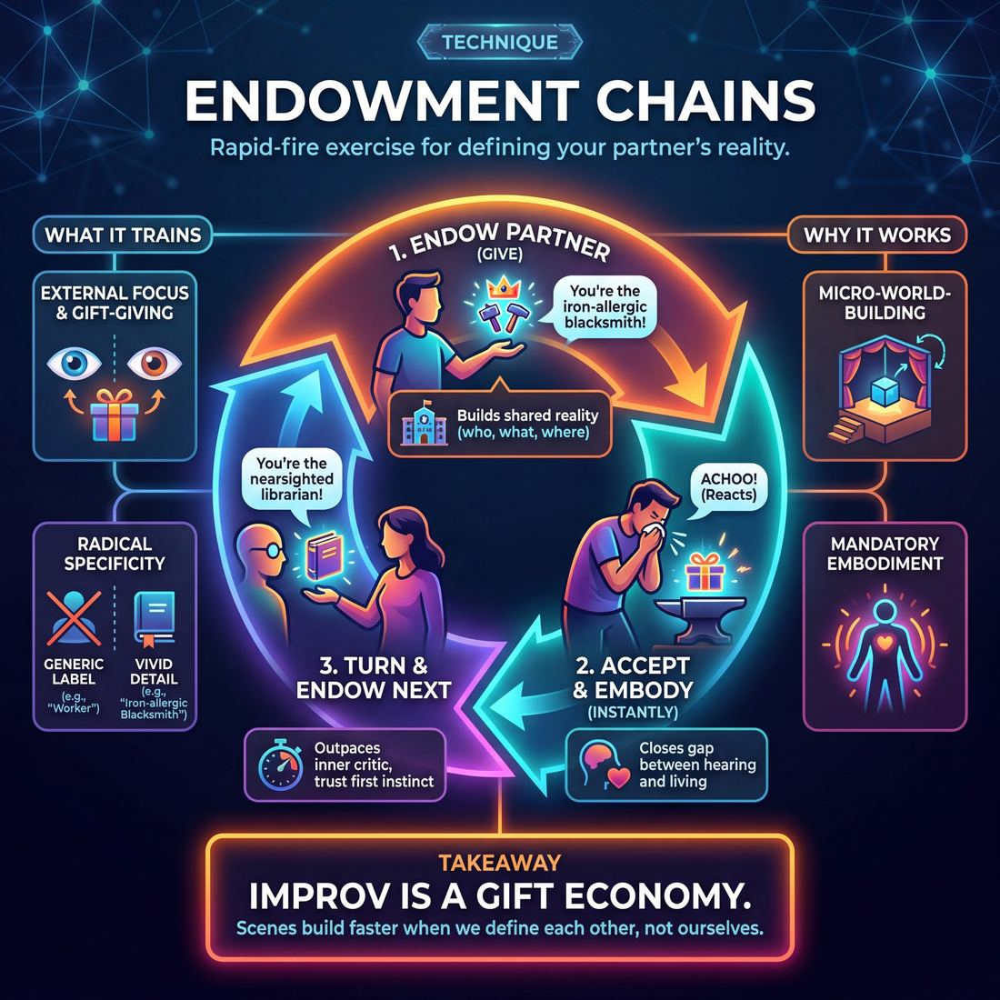

# 🎯 Endowment chains

> *A drillable muscle that trains **World-Building**.*

{ .infographic }

## 🎯 The essence

An **endowment chain** is a rapid-fire circle exercise where players sequentially assign—or "endow"—a specific trait, emotion, physical object, or relationship to the person next to them. The receiving player must instantly accept this new reality, embody it for a brief moment, and then turn to endow the next person in the chain. 

!!! abstract "The Core Muscle"
    This technique isolates and drills a single, vital action: the frictionless acceptance of an external definition (a "gift" about who you are or what you are doing), followed immediately by the generation of a new, specific gift for your partner.

## 🎓 What it trains

At its core, endowment chains isolate and drill the skill of **World-Building**. The exercise forces players to construct a shared reality not by talking about themselves, but by defining the people, objects, and history immediately surrounding them. 

This technique exists to cure two of the most common ailments in early improvisation: the "White Room" (playing in a featureless void) and the "Interrogation" (asking questions instead of establishing facts). Novice improvisers often step on stage and default to asking, *"What are you doing?"* or *"Who are you?"* This stalls the scene's momentum and dumps the entire burden of creation onto their partner. Endowment chains rewire the improviser's brain to make declarative, specific statements that give their partner an immediate, playable identity.

!!! abstract "The Deeper Principle: Make Your Partner Look Good"
    Improv is a team sport of mutual gift-giving. When you endow your partner with a clear trait, emotion, or status, you are handing them a character on a silver platter. You relieve them of the pressure to invent themselves, allowing them to simply react.

By practicing this technique, improvisers develop several distinct muscles:

*   **External focus:** Shifting attention away from the internal panic of *"What am I going to do?"* to the generous mindset of *"What can I give my partner?"*
*   **Radical specificity:** Training the brain to bypass generic labels in favor of vivid details. It bridges the gap between a weak endowment (*"You're a worker"*) and a highly playable one (*"You're the only blacksmith in town who is allergic to iron"*).
*   **Simultaneous acceptance and initiation:** The "chain" aspect of the exercise requires a player to instantly accept the reality they were just handed, wear it confidently, and simultaneously generate a new gift for the next person in line. 

!!! note "Building the Platform"
    In the context of **Narrative Architecture**, endowments are the fastest way to build a solid **Platform** (the foundational *who, what, and where*). As improvisers move toward Stage 3 (Competent), they learn that a strong, specific endowment doesn't just name a character—it often establishes what is at risk for them, or provides the first unusual detail needed to frame the **Game** of the scene.

## 💡 Why it works

Endowment chains function as a high-efficiency training tool because they isolate the act of defining reality while removing the pressure of full scene-building. The exercise exploits several cognitive and group dynamics to build the world-building muscle:

* **Outpacing the Inner Critic:** The rapid, sequential rhythm of a chain leaves no time for second-guessing or hedging. Players must react with their first instinct, training the brain to trust immediate associations rather than freezing up while searching for the "perfect" or "funniest" idea.
* **Mandatory Embodiment:** To keep the chain moving, a player cannot just politely agree with what was said; they must instantly accept and physically or vocally *embody* the trait, object, or status they were just given. It closes the cognitive gap between hearing an idea and living it.
* **Micro-World-Building:** It breaks the overwhelming task of "architecting a scene" into a single, manageable cognitive step: making one concrete choice. 

!!! abstract "Key idea: The Gift Economy"
    In an endowment chain, you are entirely relieved of the burden of inventing your own identity. It proves to the improviser's brain that scenes are built faster—and with far less friction—when we define each other, rather than struggling to define ourselves.

By stripping away narrative, stakes, and game, the chain format acts as a centrifuge. It separates the pure act of *giving and receiving information* from the rest of the improv toolkit, allowing players to drill that specific cognitive loop until it becomes muscle memory.

## 🧩 The setup

Here is everything you need to arrange before running this exercise. Keep the physical setup simple so the cognitive focus remains entirely on the act of giving and receiving.

*   **Players & Group Size:** 6 to 12 players is ideal. Too few, and the chain ends before a rhythm is established; too many, and players spend too long waiting for their turn.
*   **Arrangement:** A single circle, standing shoulder-to-shoulder, with enough room for players to comfortably turn and face their immediate neighbors. (Alternatively, a straight line across the stage, passing the endowment from stage right to stage left).
*   **Space & Materials:** An open room or stage. No chairs, props, or set pieces are required.
*   **Time:** 5 to 10 minutes total. A single chain around a circle of ten takes about two minutes.
*   **Prerequisites:** Players should understand the basic definition of an endowment (assigning a physical trait, object, relationship, or emotional state to a scene partner without them asking for it) and the fundamental rule of "Yes, And."
*   **Roles:** 
    *   **The Endower:** Turns to the next person and delivers a single line of dialogue that clearly establishes a new truth about them.
    *   **The Receiver:** Accepts the endowment, physically or emotionally reacts to it, and then immediately drops it to become the *Endower* for the next person in the chain.

!!! note "Defining the boundaries"
    Before starting, it is helpful to specify what *type* of endowment the chain will focus on. You might restrict the first round to **physical objects** (*"Here is your coffee"*), the second to **relationships** (*"Happy anniversary, darling"*), and the third to **status or emotions** (*"Why are you so terrified of that toaster?"*). 

!!! quote "How to introduce it"
    "Let's form a circle. We are going to practice giving each other gifts—specifically, endowments. An endowment is when you give your scene partner a characteristic, an object, a relationship, or an emotion through your dialogue alone. 
    
    Player A will turn to Player B and endow them with something. Player B, you will accept that endowment, react to it for just a moment to prove you've received it, and then turn to Player C and endow *them* with something completely new. We will pass this chain all the way around the circle. Don't plan your endowment until you have finished receiving yours. Make your gifts clear, specific, and undeniable."

## ⚙️ The mechanics

!!! abstract "The Core Loop"
    **Endow** ➔ **Accept & Embody** ➔ **Endow the Next Player**
    
    The objective is to practice giving clear, actionable gifts and instantly accepting and embodying the gifts you receive.

### The Flow of Play

The exercise is typically run in a straight line or a circle. Here is the step-by-step progression of a single chain:

1. **The First Link (Endow):** Player A turns to Player B and delivers a single line of dialogue. This line must endow Player B with a specific attribute, circumstance, or object. 
2. **The Reception (Accept & Embody):** Player B instantly accepts the endowment. They do not merely agree verbally; they must physically and emotionally take on the trait or react to the given circumstance in real time.
3. **The Next Link (Pass it on):** Without dropping the reality they just accepted, Player B turns to Player C. Player B now delivers a *new* line of dialogue, endowing Player C with a completely different attribute. 
4. **The Chain Continues:** Player C accepts, embodies, and turns to Player D. This continues until the end of the line or until the circle is complete.

### Rules & Constraints

To keep the exercise sharp and the muscle isolated, enforce these strict boundaries:

* **Statements over questions:** Endowments should be declarative. Avoid asking questions (e.g., *"Why are you crying?"*), which forces the receiver to invent the reason. Instead, make a statement (*"You are crying because you dropped your ice cream."*).
* **No denying:** The receiver must accept the endowment immediately, no matter how absurd or contradictory it feels.
* **Physicalize instantly:** The acceptance must be visible. If endowed with a heavy box, the player's posture must immediately reflect the weight before they even speak.
* **Keep it moving:** Do not pause to think of the "perfect" endowment. The speed of the chain forces players out of their heads and into their instincts.

!!! tip "On stage: The 'You' Focus"
    A strong endowment almost always focuses on the *other* person. Start your sentences with "You" or address the person directly by a title or name. *"You are covered in mud"* is infinitely more playable for your partner than *"I am looking at mud."*

### Types of Endowments

To prevent the chain from getting stuck in a rut, players should practice varying the *types* of endowments they give. 

| Endowment Type | What it gives the player | Example |
| :--- | :--- | :--- |
| **Physical / Object** | A tangible item, physical state, or bodily condition. | *"Careful, your hands are covered in wet paint."* |
| **Emotional** | A specific feeling or reaction to the current environment. | *"You are absolutely terrified of that toaster."* |
| **Relational** | A defined history or dynamic between the two characters. | *"You've been my bitter rival since kindergarten."* |
| **Status** | A clear position of power (high or low) relative to others. | *"Your Majesty, please do not scrub the floors."* |

### Ending and Resetting

A round ends when the endowment reaches the last person in the line, or when the circle completes one full revolution. 

To reset, the instructor or coach will typically clear the stage's reality ("Shake it out") and dictate a new constraint for the next round. For example, if the first round was entirely physical endowments, the reset round might be restricted exclusively to relational endowments, forcing players to flex a different creative muscle.

## 🎬 Sample round

!!! example "Sample round: The Kitchen Disaster"
    *In this variation, players stand in a circle and build a single, cohesive environment. Each player must receive an endowment, react to it, and then turn to the next player to add a new link to the chain.*

    **Player A (turning to Player B):** "Chef, the soufflé just collapsed!"
    
    > **The Mechanics in action:** Player A initiates the chain. They establish the environment (a kitchen) and **endow** Player B with a specific role (Chef) and an immediate problem.

    **Player B (reacting, then turning to Player C):** *(Gasps, clutching their chest)* "My masterpiece! Ruined! *(Pivots to C)* You! Dishwasher! Stop scrubbing and get me six more eggs!"
    
    > **The Mechanics in action:** Player B **receives** the endowment with a strong emotional and physical reaction (devastation). They accept the reality, then **pivot** to Player C, endowing them with a new role (Dishwasher) and an action. The world just got bigger.

    **Player C (reacting, then turning to Player D):** *(Wiping hands frantically on invisible apron)* "I don't know where the eggs are, Chef, I just started today! *(Pivots to D)* Health Inspector, please don't write this down!"
    
    > **The Mechanics in action:** Player C **accepts** the low-status role and justifies why they can't help. They then **pivot** to Player D, adding a massive new layer of stakes to the world by endowing them as the Health Inspector. 

    **Player D (reacting, then turning to Player E):** *(Clicking a pen ominously)* "Oh, I'm writing it all down. And your shoes aren't non-slip. *(Pivots to E)* Mayor, I'm shutting your brother's restaurant down."
    
    > **The Mechanics in action:** Player D **receives** the high-status endowment, cementing the reality of the scene. They then **pivot** to Player E, expanding the world beyond the kitchen walls by introducing local politics and a family relationship.

    *The chain continues around the circle, with each link adding a new character, object, or relationship to the rapidly expanding world.*

## 🎚️ Variations & progressions

The beauty of Endowment Chains lies in their scalability. By restricting *what* kind of information players are allowed to pass to one another, you can isolate specific muscles—moving from basic scene-painting to complex narrative architecture and game framing.

Here is how to ramp the difficulty of the drill, aligned with a player's maturity progression:

### 1. The Physical & Identity Chain (Novice)
For players who struggle with scenes that wander or lack a clear "who" and "where," restrict the chain to **tangible objects** and **occupational roles**. This forces the Novice to make concrete choices rather than talking in abstract circles.
*   **The Prompt:** Endow the next person with a specific physical item or a clear job title.
*   **Example:** *"Here is your freshly sharpened cleaver, Chef."*

### 2. The Stakes & Emotion Chain (Advanced Beginner to Competent)
Once players can establish a basic platform, they must learn to establish *why the scene matters*. In this variation, players endow the receiver with a specific emotional state or a deep-seated **"Want"** (a desire or goal).
*   **The Prompt:** Endow the next person with a strong emotion or a specific desire they are trying to achieve.
*   **Example:** *"I know you're terrified of losing this spelling bee, Arthur."*

!!! tip "On stage: Building the Platform"
    At the **Competent** stage, players should use endowments to deliberately build the platform and establish what is at risk. Instead of just saying *"You are sad,"* a Competent player endows the *reason* for the sadness: *"You've been weeping ever since the mayor banned skateboarding."*

### 3. The History & Relationship Chain (Competent to Proficient)
To train narrative architecture, force players to endow **shared history**. This requires the receiver to instantly accept a complex past and let it inform their current behavior, making the story arc feel inevitable.
*   **The Prompt:** Endow the next person with a specific past action or a long-standing relationship dynamic.
*   **Example:** *"You've always taken the credit for my science projects, Sarah, but not today."*

### 4. The "Game" Endowment (Proficient)
At the Proficient stage, players frame the comedic game with their first unusual line. This variation asks players to endow their partner with a specific, repeatable **comedic filter** or unusual behavior.
*   **The Prompt:** Endow the next person with a bizarre habit, a strange point of view, or a highly specific flaw.
*   **Example:** *"Why do you always whisper when you're about to lie to me?"*

!!! example "In a scene: The Game Endowment"
    **Player A:** "You always whisper when you're about to lie to me." *(Endows the game)*  
    **Player B:** *(Leans in, drops voice to a harsh whisper)* "I have absolutely no idea what happened to your prize-winning petunias." *(Accepts and plays the game)*  
    **Player B (turning to Player C):** "And you... you always start sweating when you hear a whisper." *(Endows the next game)*

### 5. The Silent / Physical Chain (Master)
For highly advanced players, remove words entirely. Players must endow status, relationships, and stakes purely through physical proximity, eye contact, posture, and reaction. 
*   **The Prompt:** Walk up to the next person and endow them with high or low status, or a specific relationship, using only your body language. The receiver must physically react to confirm the endowment before turning to the next person.
*   **Why it works:** It trains the Master-level skill of making stakes *felt, not stated*. It forces players to read what the scene needs invisibly, without relying on clever dialogue.

## 🧑‍🏫 Coaching notes

!!! tip "Coaching: The Golden Cue"
    **"Take the hit before you pass the ball."**  
    This is the single most important cue you can give during this exercise. Players often get so focused on thinking up their *own* endowment for the next person that they ignore the one just handed to them. Force them to let the incoming endowment land, show a visible emotional reaction, and *then* use that new reality to fuel their next move.

When coaching Endowment chains, your primary goal is to keep the players out of their heads and rooted in specific, emotional world-building. You are listening for the difference between a sterile exchange of facts and a dynamic web of relationships.

Here is what to watch for and exactly what to call out from the sidelines:

### Active Side-Coaching Cues

*   **"Make it specific!"** 
    *Use when:* Endowments are generic (e.g., *"You are a doctor"*). 
    *Push them toward:* *"You are the doctor who fainted during my appendectomy."*
*   **"Endow an attitude, not just a job."** 
    *Use when:* The chain turns into a boring roll-call of occupations. Force them to endow emotional states or behavioral quirks.
*   **"What are the stakes?"** 
    *Use when:* The endowments are clever but meaningless. Remind them to establish *why* this detail matters to the characters right now.
*   **"Use the environment."** 
    *Use when:* Players are only endowing each other's identities. Prompt them to endow the space, the objects they are holding, or the weather outside.

### What 'Good' Looks and Sounds Like

As a coach, you will know the exercise is working when you observe the following shifts in the room:

| Observable Behavior | Why it Matters |
| :--- | :--- |
| **Physical transformation** | Players instantly alter their posture, voice, or facial expression the moment they receive an endowment, rather than just nodding and talking. |
| **Additive logic** | Instead of random, disconnected facts, each link in the chain builds on the last, creating a cohesive Narrative Architecture. |
| **Emotional weight** | The endowments create immediate **Stakes**. The players aren't just naming things; they are giving each other reasons to care. |
| **Pacing breathes** | The rapid-fire panic of a novice slows down. Proficient players take a beat to process the new information before speaking. |

!!! warning "Watch the tone"
    Be careful that the chain doesn't devolve into "pimping" (forcing a player into an uncomfortable or impossible situation just for a laugh). If you hear endowments designed to trap rather than inspire, step in immediately: *"Give them a gift, not a chore."*

## 🧭 Debrief & reflection

A strong debrief for Endowment Chains shifts the players' focus from the pressure of inventing ideas to the mechanics of giving and receiving them. The goal is to help improvisers recognize how specific, actionable information accelerates World-Building and grounds the scene.

Use these questions to guide the post-round conversation:

**For the Receivers:**
*   **"Did the endowment feel like a gift or a burden?"** This helps players articulate the difference between a playable endowment (e.g., *"You're always polishing those glasses"*) and a dead-end trap (e.g., *"You're unconscious"*).
*   **"Did you feel any internal resistance?"** Often, players subconsciously want to play a specific character. Being endowed forces them to drop their preconceived idea and accept the reality given to them. 
*   **"How did you justify the endowment?"** Explore how players took an external label and found the internal *why* behind it.

**For the Givers:**
*   **"Were you building on the existing world, or inventing something random?"** A good chain weaves together; a poor chain feels like a disjointed list of random facts. 
*   **"Was your endowment specific?"** Contrast vague labels (*"You're a nerd"*) with concrete behaviors or objects (*"You brought your protractor to the party"*).

**For the Group:**
*   **"At what point did the environment or the relationship feel real to you?"** Pinpoint the exact moment the platform solidified.

!!! note "The 'Aha!' Moment"
    A successful debrief usually surfaces a counterintuitive realization: **being told who you are is actually a relief.** Novices (Stage 1) often fear being endowed because it feels like losing control. By the end of this exercise, players should realize that a strong endowment removes the pressure of invention, allowing them to simply react and play.

!!! tip "Coach's Ear"
    Listen for players who describe feeling "trapped" by an endowment. This usually indicates one of two things: either the giver offered a *problem* instead of a *trait* (forcing the receiver to explain themselves rather than play), or the receiver is still struggling to let go of their own unstated ideas. Use this to pivot into a discussion on radical acceptance.

## ⚠️ Common pitfalls

When the cognitive load of building a scene in real time spikes, players often default to protective habits. In an endowment chain, this panic manifests in how gifts are clumsily given or defensively received. 

Here are the most common traps that break the chain, and how to fix them:

!!! warning "Watch out: Labeling instead of treating"
    Novices often explicitly state the endowment rather than treating their partner as if the endowment is already true. This forces the scene into the "telling" rather than "showing" mode.
    
    * **The Symptom:** *"You are a grumpy chef."* or *"You have a broken leg."*
    * **The Fix:** Shift from adjectives to actions and relationships. Treat them like the thing. *"The soup is burning, Chef, why are you just glaring at it?"* or *"Lean on my shoulder, I'll keep the weight off that cast."*

!!! warning "Watch out: The Overstuffed Endowment"
    In a rush to build the world, a player might throw three different realities at their partner in a single line. This causes immediate cognitive overload, and the receiver usually freezes or drops two of the three gifts.
    
    * **The Symptom:** *"Take this heavy radioactive box, your leg is broken, and you're furious at me!"*
    * **The Fix:** One specific gift at a time. Give a single, clear endowment, let your partner react and internalize it, and then build the next link in the chain.

!!! warning "Watch out: Dropping the Gift"
    The receiver verbally accepts the endowment (*"Yes, I am a cowboy"*), but their body language, voice, and subsequent choices remain completely unchanged. They are clinging to whatever pre-planned idea they had before the scene started.
    
    * **The Symptom:** A player is endowed as being freezing cold, but they continue to stand with relaxed, open posture while casually chatting.
    * **The Fix:** **Physicalize first.** Train players to let the endowment hit their body before it hits their mouth. If endowed as freezing, shiver and cross your arms before you say a single word.

!!! warning "Watch out: Pimping your partner"
    **Pimping** is the improv jargon for forcing your partner into a difficult, embarrassing, or impossible situation for a cheap laugh, rather than giving them a genuine gift. It breaks trust and stalls the world-building engine.
    
    * **The Symptom:** *"Oh, you're the world's foremost expert on 14th-century Russian poetry? Recite some for us right now!"*
    * **The Fix:** Endow to build the world, not to test the player. Give gifts that are fun and easy to play. If you do endow an expertise, immediately provide the context that makes it easy: *"Professor, this 14th-century Russian poem just looks like a grocery list to me—what does it mean?"*

## 🌟 What mastery looks like

When advanced improvisers perform Endowment Chains, the mechanics of the exercise completely disappear. It no longer looks like a drill of passing traits back and forth; it looks like a masterclass in instant, high-stakes World-Building. The players are no longer just inventing facts—they are weaving a living, breathing ecosystem where every detail matters.

Here is what you will observe when this technique is executed at the highest level:

*   **Relational, loaded endowments:** Masters move past physical traits (*"You have a limp"*) or occupations (*"You are a cop"*). They endow emotional history, behavioral tics, and relational dynamics. They give gifts that demand an emotional reaction (*"You always clean frantically when you're lying to me"*).
*   **Cellular acceptance:** The moment an endowment is spoken, the receiving player’s posture, rhythm, and point of view instantly shift. They don't just verbally agree to the gift; they let it alter their physical and emotional reality on the spot.
*   **Architecting the unseen:** The chain extends beyond the players on stage. Master improvisers seamlessly endow the environment, the weather, and off-stage characters, creating a three-dimensional world that feels lived-in and inevitable.
*   **Pacing and silence:** Novices rush to pass the next endowment. Masters allow a heavy, brilliant endowment to breathe. They use silence to let the audience and their scene partner feel the weight of the new reality before adding to it.

!!! example "In a scene: Novice vs. Master"
    **Novice (Transactional & Plot-heavy):** 
    *Player A:* "Here is your sword, Sir Knight." 
    *Player B:* "Thank you, I will use it to fight the dragon, who is your brother."
    
    **Master (Relational & Stakes-driven):** 
    *Player A:* "You've polished that same spot on the counter for ten minutes, Sarah." 
    *Player B:* *(Stops, grips the rag tightly)* "It's the only thing I can control since the bank called, David."

!!! abstract "The Master's Mindset"
    At the highest level of the maturity progression, a master **reads what the scene needs and serves it invisibly**. In an Endowment Chain, this means they aren't just throwing out clever ideas to see what sticks. They are actively listening to the emerging narrative architecture, identifying the stakes, and using their endowments to either solidify the platform or deliberately tilt the scene into new, compelling territory. They make the audience genuinely care about the world being built.

## 🔗 Why it matters

Endowment chains are the connective tissue of collaborative reality. While it is easy to invent a character or an environment in isolation, improvisation demands that we build these elements *together*, in real time. This technique isolates the exact muscle required to do that seamlessly.

**How it serves the craft:**

*   **Fuels World-Building (The Skill):** World-building often stalls when improvisers wait for someone else to define the reality, or when they steamroll their partners with pre-planned ideas. Endowment chains train the middle path: offering a specific, undeniable detail and immediately accepting the details given to you. It turns world-building from a solo drafting process into a rapid, shared discovery.
*   **Architects The Scene (The Domain):** To build a compelling scene, you need a solid Platform. Endowment chains generate this platform efficiently. By layering specific traits, relationships, and environmental details, improvisers create a rich, textured reality. This provides the necessary fuel for both engines of improv: it grounds the world so a narrative arc has actual stakes, and it scatters specific, unusual details that can be isolated and heightened into a comedic Game.
*   **Kills the Ego:** At its deepest level, this technique reinforces the ultimate improv surrender: *you are who your partner says you are*. It trains improvisers to let go of their own preconceived ideas and allow themselves to be shaped entirely by external offers. 

!!! abstract "The ultimate shortcut"
    An endowment chain is the fastest way to bypass the awkward "getting to know you" phase of a scene. When you are rapidly endowed with a history, a quirk, and a physical weight by your scene partners, you don't have to invent a character from scratch—you just have to react as the fully-formed person you have just been gifted.

## 📚 References & Further Reading

### Foundational sources
*   **Keith Johnstone, *Impro: Improvisation and the Theatre* (1979)** — Introduces the foundational concept of "endowing" (particularly through status endowments) and emphasizes the necessity of being obvious rather than clever to build a shared reality with a scene partner.
*   **Viola Spolin, *Improvisation for the Theater* (1963)** — The originator of the "Who Game" and "What Game," which serve as the historical precursors to modern endowment exercises by training players to assign traits and relationships without asking questions.
*   **Keith Johnstone, *Impro for Storytellers* (1999)** — Expands heavily on "endowment" as a specific improv vocabulary term, explicitly contrasting the generous, collaborative act of endowing with the negative practice of "pimping" (forcing a partner to do the work).

### Practitioner guides & manuals
*   **Matt Besser, Ian Roberts, and Matt Walsh, *The Upright Citizens Brigade Comedy Improvisation Manual* (2013)** — Details how endowing is the primary, most efficient tool for establishing the "base reality" (the Who, What, and Where) of a scene, curing the "White Room" syndrome.
*   **Mick Napier, *Improvise: Scene from the Inside Out* (2004)** — Emphasizes the importance of making strong initial choices and endowing your partner immediately to bypass the hesitation of early scenes and avoid the trap of interrogating your partner.
*   **Will Hines, *How to Be the Greatest Improviser on Earth* (2016)** — Discusses the mechanics of "gift giving" in modern long-form improv, explaining how endowing your partner relieves them of the pressure to invent their own identity from scratch.

### Lineage & teachers
*   **Theatresports (Keith Johnstone lineage)** — The competitive improv format developed in the late 1970s that codified "Endowment Games" (where players must guess the traits, locations, or crimes they have been endowed with by their partners), turning the act of endowing into a theatrical engine.
*   **The Spolin Players** — A lineage of teachers (such as Gary Schwartz) who teach "Endowment" as a direct evolution of Spolin's "Art Gallery" and "Who Game," focusing on the physical embodiment and non-verbal assignment of traits.
*   **Dr. David Charles, *ImprovDr Curriculum* (2021)** — Codifies the "Endowment Circle" exercise as a specific pedagogical tool for rapid character generation, practicing the frictionless acceptance of gifts, and avoiding factual contradictions in scene work.

### Research & theory
*   **Tufts University, *Cognitive Studies on Theatrical Improvisation* (2012)** *(unverified)* — Academic research exploring how the act of giving and receiving gifts (endowments) alters the improviser's focus, shifting it from internal anxiety to external collaboration and altering brain states.
*   **Performance Psychology & Cognitive Load Theory** *(unverified)* — Theoretical frameworks applied to improv suggesting that endowing a partner lightens the "cognitive load" of scene-building by narrowing the infinite possibilities of a blank stage into a specific, playable pattern.

### Communities & adjacent reading
*   **Applied Improvisation Network (AIN)** — A global community that uses improv techniques like "gift giving" and endowing in corporate, educational, and psychological settings to teach active listening and reduce the friction of difficult conversations.
*   **Deepak Chopra, *The Seven Spiritual Laws of Success* (1994)** — Frequently cited in applied improv psychology (such as by *Psychology Today*) for the "Law of Giving and Receiving," which perfectly mirrors the improv concept that giving a gift (an endowment) to a partner ultimately benefits the giver and the scene.

## 💬 Quotes & Anecdotes

!!! quote "— Barbara Scott, *quoted in Salon* (2003)"
    Endow your partner and your setting with physical attributes. Don't try to be funny or clever.

!!! quote "— Keith Johnstone, *Impro for Storytellers* (1999)"
    Your work is good if your partner enjoyed working with you!

### Where it comes from

The concept of "endowment" has dual roots in the foundational texts of improvisational theatre, though its meaning has evolved over the decades. 

In her seminal 1963 book *Improvisation for the Theater*, Viola Spolin frequently used the concept of endowment in relation to physical space and objects. She designed "object exercises" where actors were tasked with endowing a mimed item with specific, playable realities—such as endowing an empty cup with the physical reality of containing boiling water, or endowing a room with a specific atmosphere. 

However, the modern interpersonal usage—endowing a *scene partner* with a character trait, status, or history—was heavily popularized by Keith Johnstone in his teachings and his books *Impro* (1979) and *Impro for Storytellers* (1999). Johnstone formalized the vocabulary of "offers" and "endowments" as gifts given between players to build a shared reality. He also drew a sharp, famous distinction between a helpful endowment and a detrimental practice he called "pimping." As Johnstone defined it in *Impro for Storytellers*, pimping is when "you force someone else to do the work" (for example, commanding a scene partner, "Sing us a song!"). A true endowment, by contrast, gives the partner a trait or emotional state they can easily embody without being forced to invent the content themselves.

The "Endowment Chain" (also known in various training centers as an "Endowment Circle" or "Pass the Endowment") emerged as a standard short-form drill to isolate and practice this specific Johnstone-style offer.

### A telling example

Because endowment chains are a rapid-fire classroom drill rather than a stage performance, they are best understood through an illustrative scenario that highlights the "Endow ➔ Accept & Embody ➔ Endow" loop:

**Player A** turns to Player B and delivers a clear, specific endowment: *"I didn't know you were terrified of spiders."*

**Player B** instantly accepts this reality. They do not just say "Yes, I am"; they physically cower, brushing imaginary webs off their arms. Without dropping that fearful physicality, Player B turns to Player C and delivers a completely new endowment: *"Congratulations on winning the lottery!"*

**Player C** immediately bursts into tears of joy, drops to their knees in disbelief, and then turns to Player D to initiate the next link: *"Why are you wearing a spacesuit to a funeral?"*

The chain continues around the circle. The exercise succeeds because the cognitive load is perfectly distributed: no player ever has to invent their own character. They only have to react honestly to the gift they were just handed, and then generously serve a new gift to the person beside them.

## 🧭 Explore the framework

- ⬆️ **Skill it trains:** [World-Building](03_S5__world-building.md)
- 🎭 **Domain:** [The Scene](03_D__the-scene.md)
- 🔁 **Sibling techniques:** [C.R.O.W. (Character, Relationship, Objective, Where)](03_S5_T1__c-r-o-w-character-relationship-objective-where.md)
