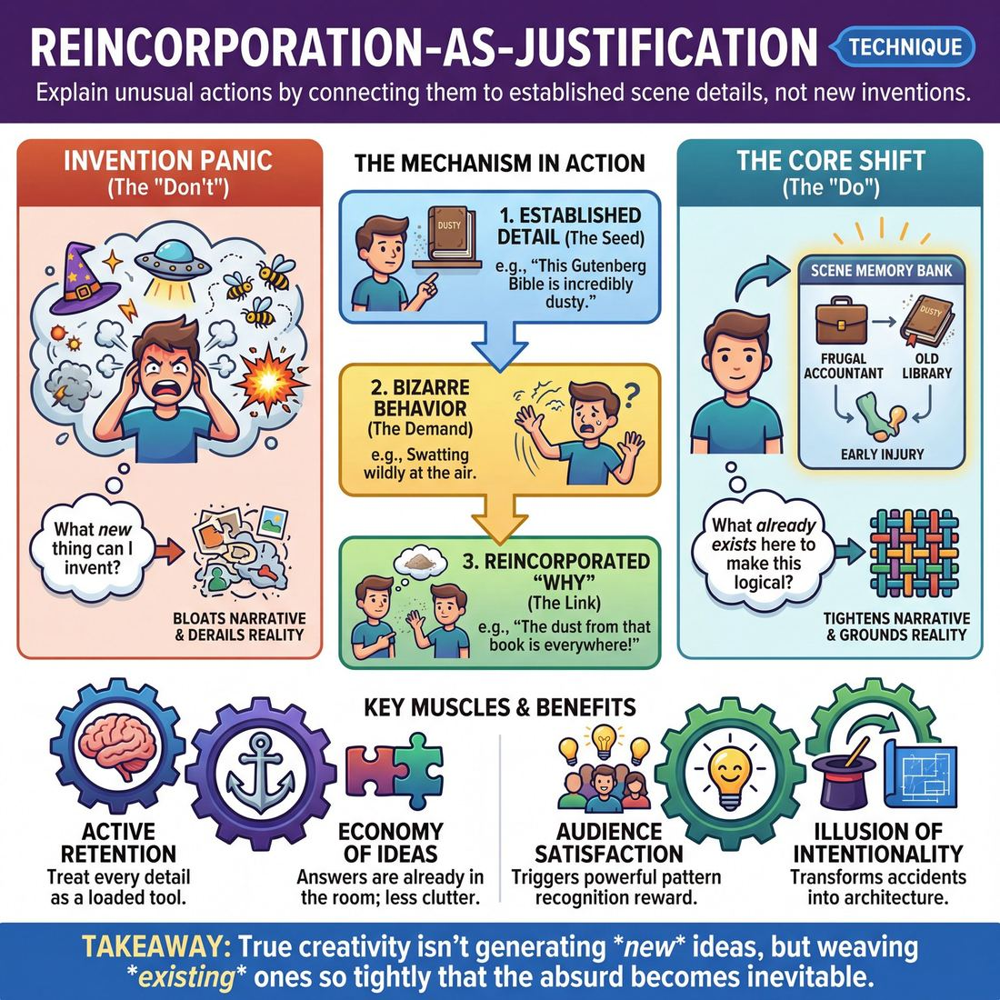

# 🎯 Reincorporation-as-justification

> *A drillable muscle that trains **Justification**.*

{ .infographic }

## 🎯 The essence

**Reincorporation-as-justification** is a targeted drill where players explain an unusual behavior, emotional reaction, or bizarre statement by bringing back a detail that was established earlier in the scene. Instead of inventing new, disconnected information to explain *why* a character is doing something strange, this technique forces the improviser to practice a single, vital muscle: looking backward into the scene's existing reality to find their answers.

## 🎓 What it trains

At its core, this technique isolates and drills the skill of **Justification**—the act of providing a grounded, logical reason for a character's unusual behavior. But more specifically, it trains improvisers to justify *economically*.

When a player does something bizarre or unexpected on stage, the scene immediately demands an explanation. The most common novice instinct is to panic and invent entirely new, disconnected lore. For example, if a character is suddenly eating out of a trash can, a panicked improviser might say, *"I'm doing this because a wizard cursed me!"* This bloats the narrative, derails the current reality, and forces the scene partners to juggle too many disparate ideas. 

Reincorporation-as-justification solves this "invention panic." It demands that the answer to "Why are you doing this?" must be found in a detail that has already been established in the scene or the show. 

!!! abstract "The Core Shift: Invention vs. Reincorporation"
    Instead of asking, *"What new thing can I invent to explain this?"* the improviser learns to ask, *"What already exists in this world that makes my behavior perfectly logical?"* If it was established in scene one that the character is a frugal accountant, eating from the trash is suddenly justified by their extreme penny-pinching.

By practicing this technique, improvisers build several vital muscles:

* **Active Retention:** You cannot reincorporate what you do not remember. This drill forces improvisers to treat every early, seemingly throwaway detail (a mentioned occupation, a passing complaint, a physical limp) as a loaded tool waiting to be used.
* **Economy of Ideas:** It ingrains the deeper principle that "the answers are already in the room." A scene built on three deeply connected ideas is always stronger and more satisfying than a scene cluttered with ten disconnected ones.
* **Tightening the Game:** In game-driven scenes, using existing details to explain unusual behavior keeps the focus squarely on the comedic premise, preventing the scene from wandering into unnecessary backstory.

Ultimately, this technique bridges the gap between memory and logic. It teaches the improviser that true creativity isn't about constantly generating new ideas, but about weaving existing ones together so tightly that the absurd becomes inevitable.

## 💡 Why it works

This technique exploits the human brain’s deep love for pattern recognition while drastically reducing the improviser’s cognitive load. By using an existing detail to explain a new behavior, you engage three powerful mechanisms:

*   **The Illusion of Intentionality:** When a seemingly random mistake or bizarre choice is justified by a detail established three minutes ago, the audience assumes you planned it all along. It transforms accidents into architecture.
*   **Conservation of Detail:** Improv scenes often collapse under the weight of "idea bloat"—too many disconnected facts, characters, and locations. This technique recycles existing information, keeping the scene's reality tight, focused, and manageable. 
*   **Audience Dopamine:** Audiences are naturally wired to solve puzzles. When a past detail clicks into place to solve a present mystery, it triggers a highly satisfying psychological reward.

!!! abstract "The Cognitive Engine"
    Improvisation is an act of managing limited working memory. Every time you invent a *new* fact to justify an action, you add to the mental juggling act. By reincorporating an *old* fact, you actually remove a ball from the air. You are proving the adage: **the answers are already on stage.**

This technique also profoundly impacts group dynamics. It is the ultimate act of active listening and validation. When you use your scene partner’s throwaway line from the first beat to justify your own bizarre emotional reaction in the second, you signal to them that everything they do matters. 

!!! example "In a scene: Invention vs. Reincorporation"
    **The Setup:** Player A and B establish they are working in a quiet, high-end library. Suddenly, Player A starts aggressively swatting at the air.
    
    *   **Invented Justification:** "Sorry, a swarm of bees just flew in the window!" *(Adds a completely new, chaotic element that derails the library premise).*
    *   **Reincorporated Justification:** "I know you said the new Gutenberg Bible was dusty, but this is ridiculous." *(Uses the already-established library setting and a previously mentioned prop to explain the swatting).* 

By tethering the "why" to the "what already happened," the scene stops expanding outward into chaos and starts folding inward into a cohesive, satisfying narrative.

## 🧩 The setup

To run this technique effectively, you need to separate the act of *creating* details from the act of *using* them. This setup establishes a "bank" of information first, so players can focus entirely on the muscle of connecting a new, bizarre choice to an old, established fact.

*   **Players & Arrangement:** 6–12 players. Begin in a single large circle for the rapid-fire drill, then transition into pairs for scene work.
*   **Space & Materials:** An open room. A whiteboard or large easel pad is highly recommended to visually track the "seed facts" during the initial learning phase.
*   **Time:** 15–20 minutes total. Allocate 5 minutes to generate facts and run the circle drill, and 10–15 minutes for applied two-person scenes.
*   **Roles:** 
    *   **The Architect (Whole Group):** Generates 3 to 5 random, unrelated facts about a fictional shared context (e.g., "Things we know about our boss, Brenda" or "Facts about this apartment building").
    *   **The Wildcard (Player A):** Makes a bold, unusual, or completely out-of-context statement or physical action.
    *   **The Justifier (Player B):** Immediately explains *why* Player A did that, strictly by reincorporating one of the facts the Architects established on the board.
*   **Prerequisites:** Players should already understand basic Justification and be comfortable making bold, unhesitating choices without pre-planning. 

!!! tip "Set the board first"
    Before starting the drill, ask the group for 4 random, specific facts about a fictional shared environment (e.g., a summer camp). Write them where everyone can see them: *1. The lake is full of leeches. 2. Counselor Dave drives a yellow Corvette. 3. We only eat canned peaches. 4. The rival camp is run by a cult.* This is your "fact bank."

!!! quote "How to introduce it"
    "In improv, when something weird happens on stage, we often panic and try to invent a brand new, highly complex reason to explain it. But the most satisfying answers to the audience are usually already in the room. We are going to practice using old information to explain new behavior. 
    
    Look at our four facts on the board. We're going to go around the circle. Person A is going to do or say something completely bizarre and disconnected—like barking at the ceiling or pretending their shoes are on fire. Person B, your job is to justify that weird behavior by connecting it directly back to one of our four facts. Don't invent a new reason; use what we already have to make the weirdness make perfect sense."

## ⚙️ The mechanics

!!! abstract "The Core Objective"
    To train the brain to look *backward* for answers instead of inventing *forward*. When faced with an absurd, accidental, or disconnected move, players must make it make perfect sense by linking it to a pre-existing element in the scene.

The most effective way to isolate and drill this muscle is through a structured exercise often called **Detail-Drop-Justify** (or the "Three-Line Tie-Back"). This drill forces players to build a reality, introduce chaos, and then stitch the chaos back into the reality using only the materials they already have.

### The Flow of Play

The drill is run in pairs, with a coach or side-coach managing the timing. 

1. **The Platform (Establishing Details):** Two players begin a grounded, mundane scene. Their only goal in the first 30 seconds is to establish a clear **Platform** (the who, what, and where) and drop at least two specific, unrelated details into the dialogue or object work (e.g., *"The radiator is broken,"* and *"I'm nervous about my driving test"*).
2. **The Anomaly (The Weird Move):** The coach calls out *"Anomaly!"* (or claps their hands). Upon hearing this, the player currently speaking must immediately do or say something completely bizarre, physically absurd, or entirely out of context (e.g., *Player A suddenly drops to the floor and rolls under the table*).
3. **The Justification (The Reincorporation):** The players must immediately justify the anomaly. The catch: **they must explain the weird behavior using *only* the details established in Step 1.** 
4. **The Reset:** As soon as the justification is spoken, makes logical sense, and is accepted by both players, the coach calls *"Scene!"* The round ends, and a new pair steps up.

!!! example "In a scene"
    **Step 1 (Platform):** 
    *Player A:* "I can't believe they charge five dollars for a single organic peach."
    *Player B:* "Well, we need it for the cobbler. My grandmother is arriving in ten minutes."
    
    **Step 2 (Anomaly):** 
    *(Coach claps)*
    *Player A suddenly throws the peach across the room, smashing it against the wall.*
    
    **Step 3 (Justification):**
    *Player B:* "Good call. If it's bruised, Grandma will know we didn't grow it ourselves. We'll tell her the dog ate it."

### Rules & Constraints

To build this specific muscle, players must adhere strictly to the following constraints during the drill:

* **The "No New Inventions" Rule:** This is the golden rule of the exercise. When the anomaly happens, players are forbidden from inventing a *new* reason to explain it. (e.g., If a player ducks under a table, you cannot say, *"Watch out for that sniper!"* unless a sniper was already established). You must mine the existing history of the scene.
* **Treat the absurd as deliberate:** The anomaly must be treated as a necessary, logical action, not a mistake or a sign of madness. Do not ask, *"Why did you do that?"* Instead, state *why* they did it.
* **Stretch the logic, but make the connection:** The justification doesn't have to be perfect real-world logic, but the *improv logic* must be airtight. The audience must clearly see how Detail A connects to Anomaly B.

### Inventing vs. Reincorporating

Understanding the difference between a standard justification and a *reincorporated* justification is crucial.

| The Anomaly | Standard Justification (Inventing Forward) | Reincorporation (Looking Backward) |
| :--- | :--- | :--- |
| Player starts violently scratching their arms. | "Oh no, you fell in poison ivy!" *(New information)* | "I told you not to wear the wool sweater we bought at the thrift store." *(Uses established detail)* |
| Player stares blankly at the wall. | "Are you possessed by a ghost?" *(New information)* | "You're still trying to do the math on that mortgage rate, aren't you?" *(Uses established detail)* |

!!! tip "On stage"
    If you are the player who initiated the anomaly, don't wait for your partner to save you. You can justify your own weird move! If you drop to the floor, you can immediately say, *"I'm sorry, I just remembered how much you hate it when I block the television."*

## 🎬 Sample round

!!! example "Sample round: The Method Viewer"
    **Context:** The players are running a drill where one player initiates with a specific detail, the second player initiates a bizarre physical action, and then must justify that action using the first detail.

    * **Player A:** "I can't believe we finally got VIP tickets to the *Cats* movie premiere tonight." 
    *(Step 1: Establishes a specific, seemingly throwaway detail).*

    * **Player B:** "I know, it's a dream come true." *(Drops to their hands and knees, pours an imaginary carton of milk into a bowl on the floor, and begins lapping it up).* 
    *(Step 2: Introduces an unusual, unexplained behavior).*

    * **Player A:** "David... why are you drinking 2% milk out of a dog bowl on the floor?" 
    *(Step 3: Frames the unusual behavior and demands a justification).*

    * **Player B:** "I have to get into the right headspace for the *Cats* premiere, Brenda. It's called method viewing." 
    *(Step 4: The Technique. Reincorporates the premiere to perfectly justify the bizarre milk-drinking).*

Notice how Player B didn't invent a *new* reason for their strange behavior (like "I was raised by wolves" or "I have a severe calcium deficiency"). By reaching backward and grabbing the *Cats* premiere, the scene suddenly feels tightly woven and deliberate. The bizarre action is no longer random; it is a logical, character-driven response to the established reality, instantly rewarding the audience's attention.

## 🎚️ Variations & progressions

To build this muscle effectively, you must gradually expand the "search radius" an improviser uses to find their justifications. Start with immediate, spoon-fed details, and scale up to pulling threads from across an entire show. 

Here is how to ramp the difficulty, mapped to the improviser's maturity journey:

**1. The "Given Word" Drill (Novice to Advanced Beginner)**
At this stage, players often struggle to spot the unusual thing live, let alone remember past details to justify it. Remove the burden of memory. 
*   **The setup:** Player A begins a bizarre physical activity. The coach hands Player A a random object or word (e.g., "a stapler" or "Tuesday"). Player B enters and asks, "What are you doing?" Player A must justify their bizarre action using *only* the coach's prompt. 
*   **The goal:** Train the brain to connect two entirely unrelated concepts, proving that *any* detail can serve as a justification if delivered with conviction.

**2. The Three-Line Closed Loop (Competent)**
Competent players are learning to build a Platform and then **Tilt** it (introduce the unusual thing). This variation isolates that exact architecture.
*   **The setup:** 
    *   *Line 1 (Platform):* Player A establishes a mundane detail.
    *   *Line 2 (Tilt):* Player B does or says something highly unusual.
    *   *Line 3 (Justification):* Player B justifies their own unusual behavior by reincorporating Player A's mundane detail.

!!! example "In a scene"
    **Player A:** "The forecast says it's going to rain all week." *(Platform)*  
    **Player B:** *(Starts furiously wrapping their shoes in tin foil)* *(Tilt)*  
    **Player B:** "Well, you know aluminum is the only thing that keeps the damp out of my arches." *(Reincorporation-as-justification)*

**3. The Cross-Scene Callback (Proficient)**
Proficient players frame games early and understand how scenes connect. Here, expand the search radius to the entire show.
*   **The setup:** Run a series of unrelated two-person scenes. In Scene 4, a player must make a bizarre choice and justify it using a seemingly throwaway detail established in Scene 1 or 2. 
*   **The goal:** Train players to treat the entire show as a **Closed Universe**. They stop inventing new lore and start treating their castmates' previous ideas as a shared toolbox.

!!! tip "On stage"
    If Scene 1 established that the Mayor hates pigeons, and in Scene 4 you are inexplicably buying a dozen falcons, your justification is already written: *"I'm going to make the Mayor very happy."*

**4. Emotional Reincorporation (Master)**
Master improvisers architect full arcs where stakes are felt, not just stated. They move beyond reincorporating *objects* or *facts*, and begin reincorporating *emotional vulnerabilities*.
*   **The setup:** Instead of justifying a weird action with a physical detail, the player justifies a massive overreaction using a previously established emotional wound or character flaw. If a character explodes in anger over a spilled glass of water, they don't justify it by saying "water ruins this wood." They justify it by reincorporating the stakes: *"Because I can't control anything else in my life right now!"*

## 🧑‍🏫 Coaching notes

The primary job of the coach in this exercise is to short-circuit the improviser’s invention reflex. When faced with an unusual or absurd move that needs explaining, a player's panic response is usually to invent a brand-new, equally absurd reason. Your side-coaching must redirect their attention backward, forcing them to mine the existing scene for answers.

!!! tip "Coaching: The answer is already on stage"
    When a player freezes or begins to invent a convoluted excuse, step in immediately. Side-coach: *"Stop. Look at what you already have. What do we already know to be true?"* Force them to use an existing object, character trait, or previous line of dialogue to explain the current weirdness.

### High-leverage side-coaching cues

Use these short, punchy directives while the scene is in motion to guide players toward reincorporation:

*   **"Don't invent, discover."** Use this when a player starts layering in new, unrelated lore (e.g., *"I'm crying because my secret twin brother just died!"*). 
*   **"Look at your hands."** Use this when a player is stuck. Often, the physical object they established in the first ten seconds (e.g., chopping onions, holding a wrench) is the perfect justification for their current emotional state or action.
*   **"Tie it to [Specific Element]."** If a player is completely blanking, give them the puzzle piece. *"Tie your anger back to the toaster."* This removes the pressure of memory and lets them practice the pure muscle of connecting A to B.
*   **"Justify that."** A simple, neutral prompt the moment an unjustified, unusual thing happens, reminding them that the clock is ticking to ground the move.

### What 'good' looks and sounds like

When players are successfully executing reincorporation-as-justification, you will observe:

*   **Economy of detail:** The scene feels tight and contained. Instead of expanding outward into a chaotic universe of random facts, the scene folds inward, becoming richer and more grounded.
*   **The audible "click":** You will often hear a literal reaction from the audience (or the rest of the class)—a laugh of recognition or an "ahhh" of satisfaction—when two seemingly unrelated elements snap together logically.
*   **Confident pauses:** A competent player will take a visible beat of silence after an unusual move. You will see them mentally scan the scene's history, find the puzzle piece, and then deliver the justification with absolute confidence.

!!! warning "Watch out for 'shoehorning'"
    Be vigilant for players who reincorporate an element just to check the box, even if it makes zero logical or emotional sense. If a player says, *"I am robbing this bank because earlier you mentioned you like pancakes,"* stop the scene. The reincorporation must actually *justify* the behavior, providing a plausible (if heightened) reason for the action.

## 🧭 Debrief & reflection

A strong debrief for this technique shifts the players’ mindset away from the pressure of invention and toward the relief of observation. The goal is to help improvisers realize that the answers to a scene's most baffling moments are usually already sitting on stage.

Gather the players and use these questions to unpack the experience:

*   **"When you were put on the spot to justify an action, did your brain immediately try to invent something brand new, or did it scan the past?"** 
    *This highlights the default improviser panic response: making up new information rather than trusting what has already been established.*
*   **"Which justifications felt the most satisfying to watch: the highly creative new ideas, or the simple callbacks to earlier details?"** 
    *This trains players to recognize that audiences (and scene partners) inherently prefer the "click" of a puzzle piece fitting together over a random new idea.*
*   **"What early details did you completely forget about until your partner brought them back?"** 
    *This exposes gaps in active listening and encourages players to treat every early line or object as a potential future tool.*
*   **"Did the scene feel like it was moving forward, or just explaining itself?"** 
    *This checks if the justification fueled the **Narrative Architecture** or stalled it.*

### What a good debrief surfaces

When players reflect honestly on this drill, a few key realizations should emerge:

1.  **The myth of originality:** Players often confess that trying to be "clever" or "funny" on the spot is exhausting. Reincorporation proves that simply being observant is far more effective—and usually gets a bigger laugh.
2.  **The value of the Platform:** Improvisers realize that the mundane details established in the first thirty seconds of a scene are not just throat-clearing; they are a loaded arsenal waiting to be used.
3.  **Economy of action:** The group will notice that scenes feel tighter, smarter, and more cohesive when elements serve double duty. 

!!! tip "Coach's ear"
    Listen for players expressing relief. A successful debrief often features a player saying, *"I didn't know what to say, so I just mentioned the toaster from scene one, and it worked perfectly."* Celebrate that moment. That is the exact transition from a panicked novice to a competent improviser who trusts the scene's existing architecture.

## ⚠️ Common pitfalls

!!! warning "Watch out: The Invention Trap"
    The single most common mistake in this technique is **inventing new information** instead of using what is already there. When pressed to justify an unusual behavior, a panicked improviser’s instinct is to create a brand-new, bizarre backstory out of thin air. 
    
    *The fix:* Train the brain to look *backward* before looking *forward*. If you are acting strangely, the reason why should almost always be found in the established **Base Reality** or the first three lines of the scene.

When cognitive load gets high—balancing the current action, listening to your partner, and scanning your memory—improvisers tend to fall into a few predictable traps. Here is how to spot and correct them:

* **The Shoehorn (Forced Connection)**
    * *The trap:* The improviser remembers they are supposed to reincorporate, so they grab a past detail that makes absolutely no logical or emotional sense for the current action. 
    * *The fix:* The justification must actually *justify*. If the connection is too weak, take a breath and pick a different detail. It is better to take a three-second pause to find a satisfying, clicking connection than to blurt out a non-sequitur.

* **The Over-Explanation (The Monologue)**
    * *The trap:* The improviser finds a great past detail, but takes three paragraphs of dialogue to explain exactly how it connects to their current weird behavior. The scene's momentum grinds to a halt.
    * *The fix:* Keep it to one sentence. Trust the audience to connect the dots. 

!!! example "In a scene: Fixing the Over-Explanation"
    **Context:** Player A established earlier that they are terrified of germs. Player B is now inexplicably wrapping themselves in cling film.
    
    **The Trap:** "I am wrapping myself in cling film because earlier you said you were afraid of germs, and I realized that if I am covered in plastic, your germs can't get to me, and also my germs can't get to you..."
    
    **The Fix:** "You said you hated germs. Consider me sealed."

* **Dropping the Action (The Freeze)**
    * *The trap:* The cognitive load of scanning memory for a past detail causes the improviser to stop doing the unusual physical action. They freeze, drop their object work, and stand in a neutral pose while they think.
    * *The fix:* Anchor in the physical action. Keep doing the unusual thing (e.g., aggressively sweeping the floor, wrapping the cling film) *while* you scan your memory. The physical momentum often shakes the memory loose, and it keeps the scene visually alive while your brain catches up.

## 🌟 What mastery looks like

At the highest level of execution, reincorporation-as-justification ceases to look like a clever improv trick and instead feels like inevitable, brilliant playwriting. The master improviser does not appear to be searching for an answer; they look as though they knew the reason for their bizarre behavior all along. 

When this technique is mastered, you will observe the following behaviors on stage:

*   **Radical economy:** Master improvisers stop inventing new backstory to explain weird behavior. When faced with an absurd action that needs grounding, they mentally scan the existing Platform and pull a thread that was dropped in the first thirty seconds. They trust that everything they need is already on stage.
*   **Emotional grounding:** The reincorporated element isn't just a callback for a cheap laugh; it becomes the emotional engine of the scene. It elevates the moment from a silly **Game** to a scenario with real **Stakes**, making the audience genuinely care about absurd people.
*   **Invisible seams:** The justification is delivered as a deeply held, character-driven truth, rather than a knowing wink to the audience. The improviser plays the reality of the connection, not the cleverness of the callback.
*   **Patience and timing:** A master will let an unusual behavior breathe and escalate just long enough to build tension, deploying the reincorporated justification at the exact moment the scene threatens to spin out into pure nonsense.

!!! example "In a scene: The Masterful Pivot"
    **The Setup:** In the first minute, Character A casually mentions they are tired of Character B always correcting their pronunciation. By minute three, Character A is inexplicably and aggressively eating a raw onion like an apple. 
    
    *   **Novice Justification (Inventing):** "I have a rare disease where I need onion juice!" *(Adds new, unearned information; breaks reality).*
    *   **Competent Justification (Internal logic):** "I just really love onions, okay?" *(Defends the action, but doesn't deepen the scene).*
    *   **Master Justification (Reincorporation):** "It's an *o-nee-yon*, David. I'm eating an *o-nee-yon*. Correct me. I dare you." *(Ties the absurd action directly back to the early relationship dynamic, instantly raising the stakes and fueling the Game).*

!!! abstract "The Ultimate Goal"
    Mastery of this technique bridges the gap between the two engines of improv. It takes a Game (the unusual thing) and uses Narrative Architecture (past details) to give it a "Want." The result is a scene where the absurdity feels completely, undeniably human.

## 🔗 Why it matters

Justification is often misunderstood as the pressure to invent a clever, logical excuse for bizarre behavior. This technique flips that script. By forcing players to look backward rather than forward for their "why," reincorporation-as-justification trains the muscle of *retention* over *invention*. It proves to the improviser that the best, most satisfying answers are already on stage.

In the broader domain of scene work, this technique is the ultimate tool for the economy of ideas. When improvisers constantly invent new details to justify unusual actions, the scene balloons outward, becoming chaotic, disconnected, and difficult to follow. When they reincorporate instead, the scene folds inward. It becomes dense, cohesive, and structurally sound. 

This inward folding is what allows improvisers to progress from merely surviving a scene to actively architecting it. As players move into proficiency and mastery, they stop treating scenes as a series of random, disconnected events. They realize that a truly masterful scene doesn't need a hundred good ideas—it only needs three or four, woven together brilliantly. 

Furthermore, this muscle seamlessly serves both engines of improv:
*   **In a Game scene:** It grounds heightened, absurd behavior in established reality, keeping the comedic pattern focused rather than letting it spiral into crazy-town.
*   **In a Narrative scene:** It creates the feeling of inevitability. When a character's current choice is driven by a previously established detail, the story arc feels deliberate and earned.

!!! abstract "The illusion of genius"
    Audiences enjoy a standard callback, but they *revere* reincorporation-as-justification. A callback is just a repeated joke; reincorporation-as-justification takes a seemingly random, chaotic move and makes it look like a deliberate, brilliant choice you had planned from the very beginning. It is the closest thing improv has to a magic trick.

## 📚 References & Further Reading

### Foundational sources
- **Keith Johnstone, *Impro: Improvisation and the Theatre* (1979)** — Johnstone introduces the foundational concept of "reincorporation," famously describing the improviser as a person walking backward. He explains that by looking at what has already been shelved and bringing it back into the scene, the improviser gives the story shape. Crucially, he notes that audiences love reincorporation because it creates the illusion of intentionality—they assume the improviser planned the bizarre connection all along.

### Practitioner guides & manuals
- **Matt Besser, Ian Roberts, Matt Walsh, *The Upright Citizens Brigade Comedy Improvisation Manual* (2013)** — The definitive modern text on the "Game of the Scene," which heavily emphasizes the concept of "justification." The manual details how to ground unusual or absurd behavior in a relatable reality rather than inventing chaotic, disconnected lore. It trains the improviser to ask, "If this unusual thing is true, what else is true?" to build a cohesive, economical comedic reality.
- **Mick Napier, *Improvise: Scene from the Inside Out* (2004)** — Napier discusses the mechanics of justification and warns against the pitfalls of "too much explanation." His philosophy of doing less, trusting the choices already made, and avoiding overwrought backstories aligns perfectly with the economy of ideas required for reincorporation-as-justification.
- **Will Hines, *How to Be the Greatest Improviser on Earth* (2016)** — Features a dedicated section on "Justifying / Saying Why." Hines advocates for keeping justifications simple and internal. He argues that grounding unusual behavior in relatable human emotions or philosophies (e.g., pride, insecurity) is infinitely more useful and reusable than inventing complex external plot points (e.g., a wizard's curse) to explain bizarre actions.

### Lineage & teachers
- **The Loose Moose Theatre Company** — Founded by Keith Johnstone in Calgary, this theater is the birthplace of many narrative and reincorporation-heavy formats. Their training lineage treats early scene details as vital building blocks rather than throwaway lines, directly training the active retention required for this technique.
- **Upright Citizens Brigade (UCB)** — The primary modern lineage for the rigorous study of "Justification." UCB's curriculum is built around the idea that a scene should fold inward on its existing details rather than expanding outward into chaotic invention, making them the modern champions of economical justification.

### Research & theory
- **Charles Limb & Allen Braun, *Neural Substrates of Spontaneous Musical Performance: An fMRI Study of Jazz Improvisation* (2008)** — A landmark neuroscientific study showing that during improvisation, the brain's dorsolateral prefrontal cortex (the inner critic) deactivates while the medial prefrontal cortex (associated with self-expression) activates. This supports the idea that relying on existing patterns (like reincorporation) helps bypass the brain's self-monitoring bottleneck and induces a flow state.
- **Carsten K. W. De Dreu et al., *Working Memory Benefits Creative Insight, Musical Improvisation, and Original Ideation Through Maintained Task-Focused Attention* (2012)** — Published in the *Personality and Social Psychology Bulletin*, this study demonstrates that working memory capacity is crucial for improvisation. It reinforces the cognitive theory behind this technique: "invention panic" overloads working memory, whereas reincorporating existing details manages cognitive load effectively, allowing the improviser to maintain task-focused attention.

### Talks, videos & courses
- **Charles Limb, *Your Brain on Improv* (TED Talk, 2010)** — An accessible, fascinating presentation of Limb's fMRI research on improvising musicians and rappers. Limb explores how the brain manages the immense cognitive load of spontaneous creation, providing a scientific backing for why techniques that reduce "idea bloat" are so vital for performers.
- **Will Hines, *Improv Nonsense* (Blog/Substack)** — Hines's long-running blog frequently dissects the mechanics of justification. He often references the "hand thing" metaphor (the thumb is the unusual behavior, the palm is the grounded justification) to explain how to tether weirdness to a solid foundation, and frequently writes about the difference between a helpful "why" and a scene-derailing "why."

## 💬 Quotes & Anecdotes

!!! quote "— Keith Johnstone, *Impro: Improvisation and the Theatre* (1979)"
    The improviser has to be like a man walking backwards. He sees where he has been, but he pays no attention to the future. His story can take him anywhere, but he must still 'balance' it, and give it shape, by remembering incidents that have been shelved and reincorporating them. Very often an audience will applaud when earlier material is brought back into the story. They couldn't tell you why they applaud, but the reincorporation does give them pleasure.

!!! quote "— Charna Halpern, Del Close, and Kim 'Howard' Johnson, *Truth in Comedy* (1994)"
    Remember, if everyone justifies everyone else's actions, there are no mistakes.

!!! quote "— Dave Pasquesi, *Interview with Pam Victor* (2012)"
    Rather than fabrication. Discovery of what is already there, not what I can make it into.

!!! quote "— Tom Salinsky and Deborah Frances-White, *The Improv Handbook* (2008)"
    If the guest beats the snake to death with the heavy doorstop established earlier, the audience will love it. "Oh, so that was the point of the doorstop," they think. The truth is more subtle. Fill the environment with arbitrary things at the beginning of the scene and at the end of the scene, they magically turn into good ideas, and all you have to do is remember them.

### Where it comes from

The term "reincorporation" was coined by Keith Johnstone in his seminal 1979 book *Impro*. He observed that audiences derive immense, almost subconscious pleasure when an improviser brings back an earlier, seemingly discarded element to solve a current narrative problem. 

Meanwhile, the concept of "justification" as a core duty of the improviser traces back to the earliest days of the Compass Players in the 1950s. According to Del Close, he, Elaine May, and Mike Nichols established three basic principles of improvisation during their time performing in St. Louis, the third of which was simply: "The actor's business is to justify." 

Combining the two—using reincorporation *to* justify—became a hallmark of modern long-form improv, championed by teachers who urge students to "find the answers in the room" rather than inventing new lore.

### A telling example

In *The Improv Handbook*, Tom Salinsky and Deborah Frances-White illustrate how reincorporation creates the illusion of brilliant planning. They describe an illustrative scenario where improvisers establish a random object early on—like a heavy doorstop. Later in the scene, a completely unexpected problem arises, such as a dangerous snake appearing. 

If the improviser panics and invents a new solution out of thin air ("I'll use my laser vision!"), the scene derails and the reality is broken. But if the improviser grabs the previously established doorstop to beat the snake, the audience is thrilled. As the authors note, the audience assumes, "Oh, so *that* was the point of the doorstop." The improviser didn't plan for the snake, but by looking backward to justify their defense, they made an improvised accident look like a masterfully written script.

## 🧭 Explore the framework

- ⬆️ **Skill it trains:** [Justification](03_S6__justification.md)
- 🎭 **Domain:** [The Scene](03_D__the-scene.md)
- 🔁 **Sibling techniques:** [Justify the absurd](03_S6_T1__justify-the-absurd.md)
