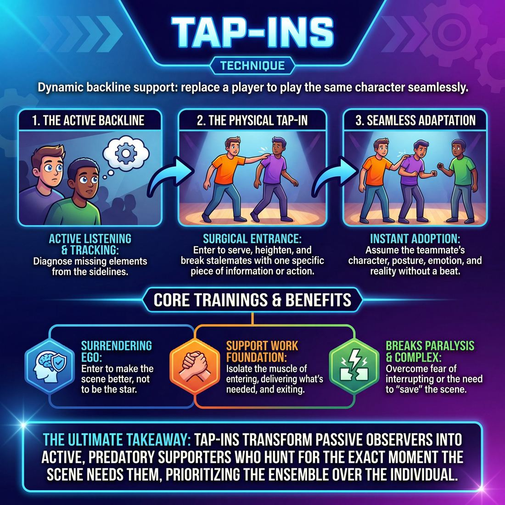

# 🎯 Tap-ins

> *A drillable muscle that trains **Support Work**.*

{ .infographic }

## 🎯 The essence

A **Tap-in** (sometimes called a *Tag-out* or *Sub-in*) is a dynamic support technique where a player from the backline physically taps an active performer on the shoulder, seamlessly taking their place to play the *exact same character* in the ongoing scene. It is a focused drill for active listening and ego-free support. By forcing improvisers to instantly adopt their teammate's physical posture, emotional state, and point of view without missing a beat, the exercise trains the ensemble to track scenes deeply from the sidelines. Players learn to step in only to heighten what has already been built, rather than inventing something entirely new.

## 🎓 What it trains

Tap-ins are the foundational drill for **Support Work**. They isolate the specific, repeatable muscle of leaving the **backline** (the off-stage area where improvisers wait), entering an active scene to provide exactly what it needs, and immediately leaving. 

This technique exists to solve two opposing problems that plague developing ensembles:

1. **The Paralysis of Politeness:** Improvisers who stay glued to the backline because they are afraid of interrupting or "ruining" a scene.
2. **The Savior Complex:** Improvisers who enter a scene to "save" it by grabbing focus, pitching a joke, or hijacking the narrative.

By drilling Tap-ins, improvisers learn to view a scene from the outside, diagnose its missing elements, and deliver them surgically. It breaks the habit of entering to be the star, training the player to enter as a servant to the scene. Beyond basic support, this technique actively develops several critical micro-skills:

* **Peripheral Awareness:** Tracking the reality of the stage—who is who, where objects are, and what the emotional tone is—while not actively in the scene.
* **Timing and Pacing:** Developing an instinct for *when* an entrance will heighten the moment versus when it will distract or deflate the energy.
* **Surgical Precision:** Delivering one specific piece of information, a physical object, or an environmental detail, and then getting out of the way before overstaying your welcome.

!!! abstract "The Deeper Principle: Surrendering Ego"
    At its core, this technique trains the ultimate goal of ensemble play: surrendering your ego to the piece. A successful tap-in requires you to accept that the scene belongs to the primary players. You are not entering to be remembered or to get a laugh; you are entering to make the existing scene better, and then vanishing.

## 💡 Why it works

Tap-ins function as a pressure-release valve for the ensemble, distributing the cognitive load of a scene across the entire team rather than leaving it squarely on the shoulders of the players center stage. The engine under the hood relies on three core dynamics:

* **Exploiting objective perspective:** Players in the middle of a scene often develop tunnel vision, focusing entirely on their immediate responses and internal panic. The backline has the advantage of an objective, audience-like view. Tap-ins leverage this by allowing off-stage players to inject exactly what they see is missing—a heightening move, a time dash, or a missing piece of context—without the on-stage players having to invent it themselves.
* **Lowering the barrier to entry via micro-commitments:** Entering a scene can feel daunting if an improviser believes they must carry it for the next three minutes. Because a tap-in can be fleeting, a player only needs a single line, a quick escalation, or a brief shift in perspective. This removes the pressure to invent a grand narrative and encourages rapid, fearless support.
* **Breaking physical stalemates:** A scene that is verbally stuck is almost always physically stuck. The literal, physical action of walking on stage and making contact acts as a hard reset. It breaks the visual monotony, forces a shift in the stage picture, and instantly injects kinetic energy into a stagnant moment.

!!! note "The Mechanical Enforcement of Trust"
    By formalizing the act of interruption into a supportive tool, tap-ins rewire the group dynamic. The player being tapped must instantly yield their spot without resistance, trusting their teammate completely. Conversely, the player tapping in must enter to serve the existing reality. It transforms the backline from passive observers into active, predatory supporters hunting for the exact moment the scene needs them.

## 🧩 The setup

Here is everything you need to arrange before running a Tap-in drill. 

* **Players & Group Size:** Ideal for a standard team or class of 6 to 12 players. 
* **Arrangement:** Two players begin center stage. The rest of the ensemble stands on the wings or the backline (the upstage edge of the performance area), actively watching and ready to move.
* **Space & Materials:** A completely clear stage. No chairs or props are needed; an empty space encourages players to rely on their bodies and object work, making the physical replacement of a tap-in much clearer.
* **Time:** 
    * *Total duration:* 10–15 minutes.
    * *Per scene:* Very fast. Scenes should last anywhere from 15 to 45 seconds. The goal is rapid-fire repetition, not narrative resolution.
* **Roles:**
    * **Active Players:** The two improvisers currently engaged in the scene.
    * **The Tapper:** An improviser from the backline who enters to physically tap an active player on the shoulder, replacing them.
    * **The Retained Player:** The improviser who remains on stage, adapting instantly to the new character or reality introduced by the Tapper.
* **Prerequisites:** Players should have a basic grasp of two-person scene work and understand the concept of an **edit** (a move that ends a scene). They should also be comfortable with basic object work and holding a physical posture.

!!! tip "How to introduce it"
    **Use this script to brief your players:**
    
    "We are going to run a rapid-fire Tap-in montage. Two players will step out and start a scene. If you are on the backline, your job is to watch like a hawk. When you see an opportunity to heighten the game, explore a new tangent, or just shake things up, walk confidently center stage and physically tap one of the players on the shoulder. 
    
    The person who gets tapped immediately drops their character and leaves the stage. The person tapping in takes their *exact physical position* and initiates the next line of dialogue. The player who stayed behind must instantly justify the new reality. Do not wait for the perfect idea—if the scene has gone on for thirty seconds, someone needs to tap in. Let's go."

!!! warning "Watch out: Positioning the Backline"
    Ensure the backline is standing close enough to the action. If players are leaning against the back wall of a deep theater, the physical distance will create a lag that kills the pacing. Ask them to step up to the edge of the light.

## ⚙️ The mechanics

!!! abstract "The Core Loop"
    A Tap-in is a surgical, mid-scene edit. The objective is to pause the current reality, swap out one player, and instantly launch a new **beat** (a new moment or scene) that heightens the existing comedic game or explores a new facet of the remaining character's life. 

The mechanics of a Tap-in rely on decisive physical action and immediate surrender. Here is the exact flow of play:

1. **The Read:** A player on the backline (Player C) observes the active scene between Player A and Player B. Player C identifies an opportunity: a pattern to heighten, a past event mentioned that needs to be seen, or a new environment to place Player B into.
2. **The Approach:** Player C steps off the backline and walks downstage with absolute, unhesitating purpose. 
3. **The Physical Tap:** Player C physically taps Player A on the shoulder. (In some variations, Player C may also call "Freeze!", but the physical tap is the definitive signal).
4. **The Yield:** Player A immediately drops their character's posture, stops speaking, and clears the stage. There is no negotiation, no final joke, and no lingering. 
5. **The Initiation:** Player C takes Player A's physical space and delivers the first line. This initiation must instantly establish the new context (e.g., a time jump, a new location, or a new character interacting with Player B).
6. **The Reaction:** Player B remains on stage, keeping their original character's point of view, voice, and "deal," and reacts to Player C's new initiation.

!!! tip "On stage: The physical tap"
    Make the tap deliberate but gentle. A firm tap on the shoulder or upper arm communicates confidence. A hovering, hesitant hand creates confusion, leaving the active players wondering if they should stop or keep going.

### Rules & Constraints

To keep the technique sharp and prevent stage chaos, enforce these strict boundaries during practice:

* **The entering player must speak first.** Because Player C interrupted the scene, the burden of establishing the new reality is entirely on them. Player B should not have to guess where they are now.
* **The tapped player vanishes.** Player A must surrender the stage instantly. The tap is not a critique of their performance, but a structural move to advance the piece.
* **Preserve the remaining character.** Unless the specific exercise dictates otherwise, Player B does not change characters. They are the anchor. If they were a neurotic baker in the first beat, they are still a neurotic baker in the new beat—just five years earlier, or at the DMV.

!!! warning "Watch out: The 'Drive-by' Tap"
    A common novice mistake is tapping a player out, delivering a single punchline, and then having nowhere else to go. A Tap-in initiates a *new scene*, even if it is a short one. Enter with a premise that can sustain at least a few lines of dialogue, not just a hit-and-run joke.

### How a round ends or resets
A Tap-in run usually cascades. Once Player C taps in, Player D might tap Player B to explore another angle, creating a rapid-fire sequence of scenes (a **Tag Run**). The round naturally concludes when the comedic game has been pushed to its absolute peak, at which point a player from the backline performs a **Sweep Edit** (running across the front of the stage) to wipe the stage clean and start an entirely new scene.

## 🎬 Sample round

!!! example "In a scene: Heightening the Game"
    **The Base Scene:**  
    **Mark:** "Sarah, it's 3 AM. You don't need to alphabetize the cumin and the coriander right now."  
    **Sarah:** "If I don't do it now, the whole system collapses, Mark. The savory spices will mingle with the sweets!"  

    *(The game is established: Sarah treats minor organizational tasks as high-stakes, catastrophic emergencies.)*

    **The Tap-in:**  
    **David** *(watching from the backline)* recognizes the pattern. He walks decisively downstage and taps **Mark** on the shoulder.   
    
    **Mark** immediately drops his posture, turns, and clears the stage without looking back or trying to finish his thought.

    **The New Scene:**  
    **David** *(stepping exactly into Mark's physical footprint, adopting a serious, urgent tone)*: "Agent Sarah, the President needs you. The Dewey Decimal System at the Library of Congress has been compromised."  
    **Sarah** *(instantly accepting the new reality while keeping her core character's point of view)*: "My God... the fiction is mixing with the non-fiction. Get my tactical label maker."

**Breaking down the mechanics in action:**

* **Decisive entry:** David didn't hover or tiptoe. He saw the game and moved with physical purpose, signaling clearly to the audience and his teammates that an edit was happening.
* **Clean exit:** Mark yielded instantly. He didn't try to get the last word or linger to see what David was going to do. 
* **Immediate initiation:** David didn't wait for Sarah to speak or figure out who he was. He delivered a strong, context-setting line the exact moment the tap occurred.
* **Serving the pattern:** The tap-in wasn't a random interruption. It took Sarah's established behavior and placed it in a heightened, cinematic environment, giving her a massive gift to play with.

## 🎚️ Variations & progressions

The basic tap-in is a mechanical skill that evolves into a powerful storytelling tool. As improvisers move from learning the physical motion to mastering ensemble support, the focus shifts from *how* to tap in, to *why* and *when*. 

Here is how to scale the difficulty of the technique, moving from basic mechanics to advanced narrative support.

### 1. Physical Freeze Tag (Stage 2: Advanced Beginner)
The most common introductory drill. The focus is entirely on executing a clean physical replacement without pre-planning.
* **The Mechanic:** Two players are in a scene. A third player calls "Freeze!", taps one player on the shoulder, assumes their *exact* physical posture, and initiates a completely new, unrelated scene based solely on that body position.
* **The Goal:** Trains the physical muscle of the tap-in and forces players to drop their verbal ideas in favor of physical inspiration. 

### 2. The Time/Space Tag-Out (Stage 3: Competent)
Instead of starting a new scene, the tap-in is used to explore an existing character in a different context. The improviser tracks the active threads and chooses to enter only when the narrative needs expansion.
* **The Mechanic:** Player C taps out Player A. Player B remains the *exact same character*, but Player C initiates a scene that shifts the timeline (past/future) or the location.
* **The Goal:** Moves the technique from a random reset to a deliberate narrative tool.

!!! example "In a scene"
    Player A (a demanding boss) is berating Player B (a timid employee). 
    *Player C taps out Player A.* 
    Player C (playing B's spouse): "Honey, you're home late again. Did Mr. Henderson yell at you?" 
    We now see the timid employee in a new environment, deepening their character.

### 3. The Escalation Replacement (Stage 4: Proficient)
This variation requires high ensemble trust. A player taps in to replace a character, stepping into the *exact same role* to heighten the dynamic or provide exactly what the scene is missing.
* **The Mechanic:** If a character is playing a specific game (e.g., a passive-aggressive waiter) but the scene's energy is plateauing, a player taps them out, becomes that *same* waiter, and instantly dials the passive-aggression up to an absurd level.
* **The Goal:** Invisible, off-focus support. The entering player isn't trying to steal the scene; they are acting as a stunt double to inject necessary energy, often tapping back out once the peak is reached.

### 4. Rapid-Fire / The Revolving Door (Pacing Drill)
A high-pressure drill designed to break hesitation and train players to edit and enter at the right moment.
* **The Mechanic:** The coach sets a metronome or claps at a steady, rapid interval (e.g., every 10 to 15 seconds). On every clap, a tap-in *must* occur. 
* **The Goal:** Cures the habit of tunnel-visioning. Players must stand on the wings with high peripheral awareness, ready to fire immediately. It teaches that a strong, decisive tap-in is always better than a hesitant, "perfect" one.

!!! tip "On stage: The Tap-and-Run"
    If you tap a player out to deliver a single, devastating punchline or a quick visual gag, don't linger. Deliver the heightening move, then immediately tap the original player back in. This preserves the original duo's ownership of the scene while giving them a massive energy boost.

## 🧑‍🏫 Coaching notes

When coaching tap-ins, your primary goal is to build a team's muscle memory for seamless, high-momentum transitions. Early on, players will hesitate, tap too softly, or enter without a clear idea. Your side-coaching should focus on physical clarity, speed, and immediate initiation.

!!! tip "Coaching: The Golden Rule of Tap-ins"
    **"Have your first line ready before your hand leaves their shoulder."**
    A tap-in should inject energy, not pause the scene. The new player must initiate immediately to maintain the scene's momentum. If a player taps in and *then* pauses to think of what to say, the scene's tension evaporates. 

Here are the most effective live side-coaching cues to use while the exercise is in motion:

* **"Match the footprint!"** Remind the entering player to step exactly into the physical space—and often the physical posture—of the person they are replacing. This grounds the new scene instantly.
* **"Make the tap obvious!"** Novices often give a hesitant, ghostly graze. Coach them to make a firm, clear physical connection on the shoulder so both the departing player and the audience know exactly what is happening.
* **"Leave cleanly!"** This is for the player being tapped out. The moment they feel the hand, they must drop their character and exit the stage immediately. Coach against the urge to linger, look back, or try to squeeze in one final joke. 
* **"Anchor, react!"** This is for the remaining player (the one who wasn't tapped). They must instantly accept the new reality, pivot their attention to the new player, and react to the new initiation without missing a beat.
* **"Bring a gift, don't just bring yourself."** Remind players of the core Support Work progression. A novice enters just to get stage time; a proficient player enters because they have a specific piece of information, a new character, or a time-jump that the scene desperately needs.

**What 'Good' Looks Like:** You will know the technique is clicking when the transitions feel like sharp cinematic cuts. The stage picture changes instantly, there is zero dead air between the tap and the first spoken word, and the departing player surrenders the stage with zero ego. The rhythm of the piece will begin to breathe naturally, with players recognizing exactly when a scene has peaked and needs a swift edit.

## 🧭 Debrief & reflection

After a round of tap-ins, the focus of the room needs to shift from the physical speed of the exercise to the underlying Support Work. A strong debrief moves players away from judging whether their tap-in was "funny," and toward analyzing whether it was *useful*.

Use these questions to guide the discussion, targeting the different perspectives in the room:

**For the entering player (The Tapper):**
* *"What was your specific goal when you tapped in?"* 
* *"Were you heightening the existing pattern, or introducing a brand new idea?"*
* *"Did you enter because the scene needed something, or because you thought of a good joke?"*

**For the exiting player (The Tapped):**
* *"When you were tapped out, did you feel supported, rescued, or interrupted?"*
* *"Did the next beat feel like a continuation of your work, or a hijacking of it?"*

**For the backline (The Ensemble):**
* *"As a group, were we heightening one core idea, or starting over every time?"*
* *"Did we let the moments breathe, or were we tapping in too frantically?"*

!!! note "Coach's ear: What to listen for"
    Pay close attention to how players describe their motivation for entering. You are listening for the transition from a **Novice (Stage 1)** mindset—where a player enters simply to grab focus or deliver a pre-planned punchline—to a **Competent (Stage 3)** mindset, where they articulate that they chose to enter *only* because the scene needed a specific escalation or shift in energy.

### What a good debrief surfaces

A successful reflection period will naturally expose the invisible mechanics of ensemble support. Players should walk away realizing:

* **Patience over panic:** Just because you *can* tap in doesn't mean you *should*. The backline learns to tolerate silence and let the current players explore before rushing to "save" them.
* **Heightening vs. Hijacking:** Players recognize the difference between a tap-in that honors the base reality (giving exactly what is missing) and one that bulldozes the scene to serve the entering player's ego.
* **The emotional reality of the edit:** Being tapped out can feel jarring to a newer improviser. Discussing it openly normalizes the tap-in as an act of love and collaboration, rather than a rejection of the current player's choices. 

!!! abstract "The ultimate realization"
    The debrief should lead the ensemble to a shared epiphany: a tap-in is not a solo act. It is a baton pass. The best tap-ins make the *previous* player's idea look brilliant.

## ⚠️ Common pitfalls

Tap-ins require a delicate balance of physical decisiveness and deep listening. When a player's cognitive load spikes—usually because they are anxious to contribute or struggling to track the scene's premise—this technique quickly degrades from Support Work into scene sabotage. 

Here is how the technique breaks down under pressure, and how to course-correct:

!!! warning "Watch out: The Scene Hijack"
    **The Trap:** A novice player gets a "funny idea" on the backline, rushes out, taps a player, and delivers a non-sequitur joke that shatters the established reality. They are entering to grab focus or steal the scene, rather than to serve the piece.  
    **The Fix:** Remind players that a tap-in is an act of service, not a solo sketch. Before moving, the improviser must ask themselves: *"Does this heighten the existing game, or am I just trying to be funny?"* If the idea doesn't serve the current premise, they must kill their darling and stay on the backline.

!!! warning "Watch out: The Phantom Tap"
    **The Trap:** The entering player is physically hesitant. They offer a light brush on the arm, tap from the front, or just hover near the active players without making clear contact. The original player doesn't realize they've been edited, resulting in a muddy, confusing three-person scene where no one knows who belongs.  
    **The Fix:** Commit to the physical mechanics. Walk purposefully, deliver a firm (but safe) tap directly on the shoulder, and step exactly into the departing player's physical footprint. 

!!! warning "Watch out: Tapping the Wrong Player"
    **The Trap:** A scene features a bizarre, alien-obsessed dentist and a terrified, normal patient. A backline player taps out the *dentist*. The scene instantly dies because the engine of the game (the unusual behavior) was just removed, leaving the "straight man" with nothing to react to.  
    **The Fix:** Track the **unusual thing**. As a rule of thumb, keep the unusual character on stage and tap out the voice of reason. Transport the unusual character into a new time, space, or relationship to see how their specific behavior manifests elsewhere.

!!! warning "Watch out: The Runaway Train"
    **The Trap:** Once one tap-in happens, the backline gets excited and unleashes a rapid-fire barrage of tap-ins. No single reality is given time to breathe, and the scene devolves into a chaotic, frantic highlight reel that exhausts the audience.  
    **The Fix:** Enforce a "three-line rule" during practice. After a tap-in, the new pairing must exchange at least three lines of dialogue to establish the new context and heighten the premise before anyone else is allowed to tap in. Let the new reality settle before editing it again.

## 🌟 What mastery looks like

At the highest level of execution, a tap-in ceases to look like an interruption and instead feels like a magic trick. The audience barely registers the physical transition before the scene is already accelerating in a new, exciting direction. Mastery here is defined by **egoless precision**—the incoming player provides exactly what the scene needs, and the departing player surrenders the stage without a fraction of a second's hesitation.

When observing a master-level execution of this technique, you will see:

* **The Seamless Yield:** The tapped player does not finish their sentence, look back, or linger to justify their exit. The physical tap acts as an immediate off-switch. They vanish to the backline.
* **Physical and Emotional Continuity:** The incoming player doesn't just bring a new voice; they step directly into the physical footprint and emotional wake of the departing player. They might adopt the exact posture to maintain the visual picture, or deliberately contrast it to instantly establish a new status dynamic.
* **Surgical Timing:** Master improvisers do not tap in simply because they thought of a clever line. They tap in at the exact moment the scene's energy peaks, dips, or requires a new perspective to heighten the established game. 
* **Total Ego Surrender:** The tap-in is used strictly to elevate the *other* player on stage or to serve the overarching piece, never to steal focus, grab a cheap laugh, or forcefully "save" a scene.

!!! example "In a scene"
    Player A and Player B are playing two astronauts arguing over who gets the last oxygen tank. The tension is high, but the argument is beginning to circle. 
    
    Player C recognizes the plateau. They step in, cleanly tap Player A on the shoulder, and take their exact physical position (hands gripping the imaginary console). 
    
    **Player C (as Mission Control):** "We can hear everything you're saying, and frankly, we're embarrassed for both of you." 
    
    Player A has already vanished. The scene instantly shifts from a private argument to a public humiliation, heightening the stakes without breaking the reality.

!!! abstract "The Stage 5 Benchmark"
    In the maturity progression of Support Work, a master improviser views the entire show as one organism. Their off-focus support elevates others. A master tap-in is never about the person entering; it is entirely about what the entrance *does* for the scene.

## 🔗 Why it matters

Tap-ins are the physical embodiment of Support Work. While it is easy to talk abstractly about "having your partner's back," a tap-in forces an improviser to translate that intention into a concrete, observable action. It trains the eye to look for exactly what a scene is missing—a physical object, a silent bodyguard, a passing waiter—and trains the body to provide it without hesitation.

Crucially, this technique serves the ultimate goal of the ensemble. By mastering the tap-in, improvisers connect to the wider craft in three vital ways:

* **Redefining the backline:** The backline ceases to be a waiting room where players stand passively until their "turn." Instead, it becomes an active bullpen. Every improviser is playing every scene, constantly scanning for opportunities to elevate the work of their teammates.
* **Building profound trust:** When primary players know their teammates will seamlessly step in to play a barking dog, a ringing phone, or a disapproving boss, they feel safe to make bolder, more expansive choices. They know they will never be left stranded in a complex environment.
* **Teaching economy of motion:** A masterful tap-in requires entering, delivering exactly what is needed, and immediately exiting. It strips away the urge to linger or steal focus, teaching improvisers that a five-second contribution can be the most valuable move in a ten-minute scene.

!!! abstract "The ultimate lesson: Giving vs. Taking"
    In early development, improvisers often enter scenes to *take*—to grab a laugh, deliver a punchline, or "save" a scene they judge as failing. Tap-ins rewire this instinct. They teach the ensemble to enter only to *give*, proving that the most powerful players on stage are often the ones who make everyone else look brilliant.

## 📚 References & Further Reading

### Foundational sources
* **Matt Besser, Ian Roberts, and Matt Walsh, *The Upright Citizens Brigade Comedy Improvisation Manual*, Comedy Council of Nicea (2013)** — The definitive text on the UCB style, which explicitly codifies the "Tag-out" (their term for the tap-in) as a primary support technique. The manual details how to use this move surgically to heighten the comedic "game" of a scene by substituting a character to explore a new time, place, or facet of the remaining character's life.
* **Charna Halpern, Del Close, and Kim "Howard" Johnson, *Truth in Comedy: The Manual of Improvisation*, Meriwether Publishing (1994)** — The foundational text on long-form improv and the Harold structure. It details how offstage players must remain actively engaged, using edits, walk-ons, and tag-outs to support the ensemble, distribute the cognitive load, and weave disparate scenes together without ego.
* **Viola Spolin, *Improvisation for the Theater*, Northwestern University Press (1963)** — While predating the modern long-form "tag-out," Spolin's theater games—specifically "Freeze" and "Space Jumps"—established the foundational mechanics of physically interrupting a scene to instantly adopt a teammate's exact posture and initiate a new reality.

### Practitioner guides & manuals
* **Will Hines, *How to Be the Greatest Improviser on Earth*, Pretty Great Publishing (2016)** — Offers highly practical advice on backline behavior, being present, and making ego-less support moves. Hines specifically addresses the "paralysis of politeness" and the "savior complex," teaching improvisers how to enter a scene to serve what has already been established rather than hijacking the narrative.
* **Mick Napier, *Improvise: Scene from the Inside Out*, Heinemann Drama (2004)** — Provides counter-intuitive but highly effective strategies for entering scenes and executing edits. Napier emphasizes the importance of decisive physical commitment when stepping off the backline, ensuring that support moves inject energy rather than deflating the stage picture.

### Lineage & teachers
* **Upright Citizens Brigade (UCB)** — The theater and training center that popularized and formalized the tag-out as a surgical tool for "heightening the game." UCB's curriculum heavily drills rapid-fire tap-ins to train improvisers to recognize patterns and explore a character's comedic behavior across different contexts.
* **iO Theater (formerly ImprovOlympic)** — The Chicago birthplace of the Harold, where the concept of the backline as an active, supportive ensemble (rather than a passive waiting area) was developed under Del Close and Charna Halpern. iO's style relies heavily on the trust and immediate surrender required during a tap-in.

### Research & theory
* **D. Fuller and B. Magerko, *Shared Mental Models in Improvisational Performance*, Proceedings of the Intelligent Narrative Technologies III Workshop (2010)** — Explores how improvisers achieve "cognitive convergence" without explicit communication. This research demonstrates how techniques like tap-ins rely on and build shared mental models, allowing the ensemble to reduce cognitive load by distributing scene-tracking across the backline.
* **Lior Noy, Erez Dekel, and Uri Alon, *The Mirror Game as a Paradigm for Studying the Dynamics of Two-Person Improvisation*, Proceedings of the National Academy of Sciences (2011)** — A psychological study of joint action that demonstrates how "co-confident motion" and spontaneous coordination emerge in joint improvisation without a designated leader. The findings mirror the seamless physical yield and mutual trust required when one improviser taps another out of an active scene.

### Talks, videos & courses
* **Will Hines, *Improv Nonsense* (2009–Present)** — Hines's extensive blog frequently breaks down the mechanics of second beats, tag-outs, and backline support. His essays offer granular, actionable advice on diagnosing what a scene needs from the outside and knowing exactly when to step off the backline.
* **UCB Comedy Originals / Harold Night Performances (Various)** — Watching recorded or live Harold performances from UCB (many of which are archived by the theater) provides the clearest visual examples of rapid-fire tag-outs and backline support in action, demonstrating the pacing and physical decisiveness required.

### Communities & adjacent reading
* **Keith Johnstone, *Impro: Improvisation and the Theatre*, Faber and Faber (1979)** — While Johnstone's lineage uses different terminology and focuses more on narrative than the UCB/iO "game," his writings on status, yielding, and overcoming the fear of being unoriginal provide essential psychological context for the ego-less surrender required when being tapped out of a scene.

## 💬 Quotes & Anecdotes

!!! quote "— Matt Besser, Ian Roberts, and Matt Walsh, *The Upright Citizens Brigade Comedy Improvisation Manual* (2013)"
    A tag-out is a support technique whereby an improviser from the back-line takes the game of the scene to a new time (and sometimes a new place) by substituting him or herself for one or more of the characters already in the scene. A tag-out is communicated through a tap on the shoulder or a wave of the hand.

!!! quote "— Mick Napier, *Improvise: Scene from the Inside Out* (2004)"
    Tag out. You get an idea and decide you want to tag out a player and take his place with another character. The player not tagged out usually maintains her character from the previous scene.

!!! quote "— Will Hines, *How to Be the Greatest Improviser on Earth* (2016)"
    Backline support should always start gingerly. Don't get in there until the principals (the people who started the scene) have made some decisions. Don't 'fix' or steer from the back line; that's called being an 'oppressive' back line, which is bad.

!!! quote "— Charna Halpern, *Art by Committee: A Guide to Advanced Improvisation* (2006)"
    In this piece, a story is created entirely by tag outs. A tag out is the only way to enter the piece. Usually, each actor will only play one character throughout the piece. The actors need to stay on their toes and be ready to return often at any time.

### Where it comes from
The "tag-out" (or tap-in) as a formal editing and support tool is a hallmark of Chicago long-form improvisation, specifically originating at the iO Theater (formerly ImprovOlympic) in the early 1990s. While short-form games like "Freeze Tag" had long used physical tapping to swap players, it was iO house teams—most notably "The Family," which featured future UCB founders Matt Besser and Ian Roberts alongside Adam McKay and Miles Stroth—who began using the mechanic as a surgical tool within the Harold. By tapping a player out, they could instantly transport the remaining character to a new time or place to heighten their comedic pattern, cementing the tag-out as a foundational technique of the UCB and iO styles.

### A telling example
**Illustrative Scenario: The Tag-Out Run**
A tap-in is most powerful when used in a "run"—a rapid succession of tag-outs that heighten a single character's unusual behavior across different contexts. 

*   **The Base Scene:** Player A and Player B are on a first date. Player A refuses to eat their salad, claiming, "Vegetables are plotting against us."
*   **Tag-Out 1:** Player C from the backline taps Player B on the shoulder. Player B leaves. Player C steps into Player B's exact physical footprint and becomes Player A's roommate: "Hey man, why is the refrigerator padlocked and covered in warning tape?" Player A defends their fear of the produce drawer.
*   **Tag-Out 2:** Player D taps Player C on the shoulder, becoming Player A's boss: "Johnson, I'm firing you. You brought a weedwhacker to the board meeting."

By using tap-ins, the ensemble doesn't need to invent a new premise; they simply provide new environments to watch Player A's established paranoia escalate.

## 🧭 Explore the framework

- ⬆️ **Skill it trains:** [Support Work](04_S2__support-work.md)
- 🎭 **Domain:** [The Ensemble](04_D__the-ensemble.md)
- 🔁 **Sibling techniques:** [Walk-ons](04_S2_T1__walk-ons.md), [Playing architecture/objects](04_S2_T3__playing-architecture-objects.md)
