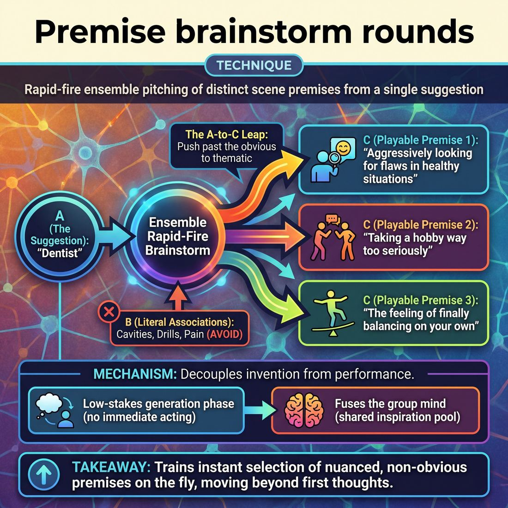

# 🎯 Premise brainstorm rounds

> *A drillable muscle that trains **Suggestion Deconstruction (A-to-C)**.*

{ .infographic }

## 🎯 The essence

!!! abstract "In a nutshell"
    **Premise brainstorm rounds** are a rapid-fire group exercise where an ensemble takes a single audience suggestion and verbally pitches multiple distinct, playable scene premises before any acting begins. By isolating the generation phase of a scene, this drill forces players to practice one specific mental muscle: bypassing the first, most obvious literal associations to mine a word for rich, non-obvious, and highly playable thematic angles.

## 🎓 What it trains

This technique isolates and drills **Suggestion Deconstruction**—specifically the cognitive leap known as **A-to-C thinking**. 

When an improviser hears a suggestion, the brain's natural reflex is to grab the most literal, immediate association. If the audience yells "Pineapple," the novice instinct is to start a scene in a grocery store or a fruit salad factory. Premise brainstorm rounds exist to break this reflex. They train the ensemble to push past the obvious and mine a single word for its richest, most playable angles.

!!! abstract "A-to-C Thinking Defined"
    - **A (The Suggestion):** The literal word given by the audience (e.g., "Bicycle").
    - **B (The Lateral Step):** The immediate, obvious associations (e.g., "Pedals," "Tour de France," "Childhood").
    - **C (The Premise):** The thematic, emotional, or conceptual leap derived from the 'B' step (e.g., "The feeling of finally balancing on your own," "Adults taking a hobby way too seriously," "The mechanics of moving forward").

By separating the brainstorming process from the pressure of actually *starting* a scene, this exercise solves "blank slate panic." It builds the cognitive muscle required to rapidly generate multiple premises, allowing the improviser to move from playing the first obvious association to confidently selecting a nuanced "C" premise on the fly.

Furthermore, because this is done as a rapid-fire group exercise, it roots the improviser deeply in the domain of **The Ensemble**. It trains players to surrender their ego to the piece. Instead of one person hoarding a "clever" idea, the team generates a massive pool of inspiration together, weaving individual associations into a shared group mind without the burden of pre-planning.

## 💡 Why it works

In a live show, the pressure to instantly generate a brilliant idea *and* step forward to initiate a scene often causes the brain to freeze. This technique works by **decoupling invention from performance**. By isolating the generation phase, the cognitive load drops, allowing the ensemble's creativity to flow without the immediate threat of having to act it out.

The engine under the hood relies on three mechanisms:

*   **Short-circuiting the obvious:** A rapid-fire brainstorm exhausts immediate, literal ideas quickly. Once the obvious is out of the way, the brain is forced to make lateral leaps to arrive at non-obvious, highly playable premises.
*   **Bypassing the inner critic:** Because ideas are generated in a rapid, low-stakes volley, players do not have time to judge their own thoughts. The sheer speed of the round outpaces the brain's natural filter.
*   **Fusing the group mind:** Brainstorming aloud creates a shared, invisible pool of inspiration. One player's throwaway association becomes the exact stepping stone another player needs to find a brilliant premise, proving in real-time that the collective brain is vastly more capable than any single individual.

!!! abstract "The Cognitive Shift: From Literal to Thematic"
    Brainstorm rounds train the brain to make the A-to-C leap automatically, shifting a player from basic associations to rich scene dynamics. 
    
    *   **A (The Suggestion):** *Dentist*
    *   **B (The Obvious Association):** *Cavities, drills, pain.* (Playing this results in a literal, predictable scene about a dentist).
    *   **C (The Premise):** *Someone who aggressively looks for flaws in otherwise healthy situations.* (A thematic, highly playable dynamic).

!!! note "The Power of the Pivot"
    This exercise exploits the psychological relief of shared responsibility. When a player realizes they don't have to carry the burden of the suggestion alone, their ego relaxes. They stop trying to be "clever" in isolation and start genuinely listening to the web of associations their teammates are weaving.

## 🧩 The setup

To get the most out of a round, the physical setup and framing must encourage rapid, unfiltered generation. 

*   **Players & Arrangement:** Works best with the full ensemble (6–12 players). Arrange the group in a tight semi-circle facing the facilitator. Everyone must be able to see the board and hear each other easily.
*   **Space & Materials:** Any standard rehearsal space. A **whiteboard and markers** are highly recommended to visually map the web of ideas. The facilitator should bring a prepared list of 5–10 random, disconnected suggestion words.
*   **Time:** 10–15 minutes total. Allocate roughly 2–3 minutes to completely exhaust a single suggestion before wiping the board and starting fresh.
*   **Roles:** 
    *   *The Facilitator:* Acts as the prompt-giver, scribe, and instigator. They write down pitches and actively push the group past the obvious (e.g., "Okay, we have three ideas about *eating* the apple; what does the apple *represent*?").
    *   *The Players:* Act as the generators. They rapid-fire pitch associations, themes, and specific scene setups, listening closely to avoid repeating what has already been said.
*   **Prerequisites:** Players should have a conceptual understanding of Suggestion Deconstruction and the A-to-C framework.

!!! tip "The Whiteboard Advantage"
    Writing the ideas down isn't just for record-keeping; it prevents the group from circling back to the same three concepts. When players can physically see that the "literal" interpretations of a word are already taken, they are forced to stretch their brains into more abstract, relational, or thematic territory.

!!! quote "How to introduce it"
    "We are going to practice exploding a single suggestion into a dozen different scenes. I’ll give you a word, and I want you to pitch a specific, playable premise based on it. Don't just give me a word association—give me a scene setup. If the word is 'Bicycle,' don't just say 'riding a bike.' Pitch 'a father who refuses to let go of the seat,' or 'a Tour de France rider who forgot how to pedal.' Shout them out as they come to you, and I’ll map them on the board. Let's see how far from the original word we can get while still keeping its DNA."

## ⚙️ The mechanics

The objective is to focus entirely on the mental muscle of deconstruction. Before opening their mouths, players must mentally navigate the leap from suggestion to premise.

!!! abstract "The Internal Framework"
    During the drill, the A-to-C process is split between silent thought and spoken pitch:
    
    *   **A (The Suggestion):** Heard by the room (e.g., "Ocean").
    *   **B (The Bridge):** The player's internal, *unspoken* association (e.g., "Salt," "Sharks," "Vastness").
    *   **C (The Premise):** The *spoken* scene dynamic built from the bridge (e.g., "A couple arguing because one of them over-seasoned the soup," or "Two mobsters terrified of dropping a body into a surprisingly shallow puddle").

### The Flow of Play

A standard round moves at a brisk, unrelenting pace:

1. **The Prompt:** The facilitator provides a single, neutral suggestion to the ensemble.
2. **The Internal Leap:** Players take a brief, silent moment (no more than two seconds) to process the word, find their unspoken "B" association, and construct a "C" premise.
3. **The Pitch:** A player speaks up and delivers their premise. This should be a concise, one-to-two sentence description of a scene dynamic, or a strong opening line of dialogue that clearly implies the relationship and game.
4. **The Rapid Succession:** As soon as the first pitch is finished, another player immediately pitches a *completely different* premise inspired by the same original suggestion. 
5. **The Reset:** The cycle continues until the ensemble has generated 5 to 8 distinct premises. The coach then calls "Next word," provides a new suggestion, and the loop begins again.

### Rules & Constraints

To keep the exercise focused strictly on the *muscle* of generation, enforce these boundaries:

*   **No scenes:** Do not step out and start acting. Deliver the pitch directly to the room, then step back.
*   **No discussion:** There is no time to laugh, critique, or say "Oh, that's a good one." The moment a pitch ends, the next one must begin.
*   **Ban the "A" word:** Players may not use the original suggestion in their pitch. If the word is "Bicycle," no one is allowed to mention pedals, handlebars, or riding a bike. 
*   **Pitch the dynamic, not just a character:** "A crazy pirate" is a character. "A pirate captain who gets seasick in the bathtub" is a playable premise.

!!! tip "On stage"
    When pitching, use confident, declarative language. Train your brain to frame the idea clearly. Start sentences with "We see..." or "It's a scene about..." or simply deliver the exact first line of dialogue you would use to initiate the scene.

## 🎬 Sample round

Here is how a rapid-fire premise brainstorm looks and sounds in practice. Notice how the players actively avoid repeating the same angle, pushing each other further from the literal suggestion into richer territory.

!!! example "Sample round: The suggestion is 'Lighthouse'"
    **Coach:** "The suggestion is *Lighthouse*. Let's hear four distinct premises. Go."

    **Player 1:** "Two lighthouse keepers are trapped in a storm, but they are giving each other the silent treatment over a stolen sandwich."
     *(The Literal "A")* — Takes the suggestion directly but immediately adds a playable relationship dynamic (the silent treatment) rather than just talking about the weather.

    **Player 2:** "A moth who has fallen in love with a lighthouse, trying to convince their skeptical moth best friend that 'this one is different.'"
     *(The Perspective Shift "B")* — Uses the core function of a lighthouse (a giant light) and applies it to a non-human, absurd point of view.

    **Player 3:** "A helicopter parent trying to guide their 30-year-old son through a basic grocery store trip via a hidden earpiece."
     *(The Metaphorical "C")* — Extracts the *theme* of a lighthouse (guiding someone away from danger) and applies it to a completely different, highly relatable human situation. The word "lighthouse" will never be spoken in this scene.

    **Player 4:** "A real estate agent trying to sell an active lighthouse to a couple who specifically asked for a 'cozy, single-story ranch.'"
     *(The Juxtaposition)* — Takes the physical reality of the suggestion (tall, isolated, loud, maritime) and forces it into a mundane, mismatched context (house hunting).

    **Coach:** "Great. Notice how Player 3 completely left the ocean behind, and Player 4 used the physical traits against a normal situation. That is excellent A-to-C deconstruction. Let's do another. Suggestion: *Toothbrush*."

## 🎚️ Variations & progressions

As an ensemble matures, you can scale the difficulty of this technique by shifting the focus from sheer volume to the *quality and playability* of the ideas.

**1. The A-to-B Primer (Novice)**  
*Goal:* Break the habit of tunnel-visioning on the literal suggestion.  
Before pitching full scenes, pass the suggestion around the circle as a pure word-association game. If the word is "Bicycle," the team rapidly fires off associations: "Chain," "Childhood," "Scraped knee," "Tour de France." This loosens the mental gears and proves that the first obvious association is never the only option.

**2. The "Half-Idea" Hand-off (Advanced Beginner)**  
*Goal:* Generate associations collaboratively without the pressure of pitching a perfect scene alone.  
Split the work. Player A offers an associative leap (e.g., "Bicycle makes me think of *training wheels*"). Player B immediately pitches a scene based on that leap (e.g., "A mob boss who still needs his mom to hold his hand during shakedowns"). 

**3. The "Playable Angle" Filter (Competent to Proficient)**  
*Goal:* Select the non-obvious premise and mine it for its most playable angle.  
Run a standard brainstorm round, but add a strict pause after every five pitches. The coach asks the ensemble: *Which of those five was the most playable?* The team must identify the premise with the clearest relationship, highest stakes, or most obvious game. This trains the ensemble to recognize *why* a premise works, rather than just celebrating a clever but unplayable idea.

!!! tip "On stage: The 'First Line' Variant"
    To force concrete, actionable premises, require players to pitch their idea **only** as the first spoken line of the scene. Instead of explaining, "A scene about a guy who loves his bike too much," the player steps forward and says, *"Brenda, if you make me choose between you and the Schwinn, you know you're gonna lose."*

**4. The Organic Opening Simulation (Master)**  
*Goal:* Turn any word into a premise the whole team can run, seamlessly blending the brainstorm into performance.  
Remove the circle. The team stands in a loose clump, simulating a real show's opening (like a Pattern Game or a Documentary opening). Players organically step forward to pitch premises, but now, if a pitch is hot, another player can immediately step out and initiate the scene. The brainstorm becomes the show.

### Progression Summary

| Variant | Maturity Stage | Primary Focus | Core Mechanic |
|---|---|---|---|
| **A-to-B Primer** | **Novice** | Breaking literal thinking | Rapid-fire word association only; no scenes yet. |
| **Half-Idea Hand-off** | **Adv. Beginner** | Collaborative generation | Player 1 gives the associative leap; Player 2 pitches the scene. |
| **Playable Angle Filter** | **Competent / Proficient** | Selecting the best "C" premise | Pitching, followed by a team vote on which idea is most playable. |
| **Organic Opening** | **Master** | Seamless generation to action | Pitching organically; the team can instantly initiate the scene. |

## 🧑‍🏫 Coaching notes

The coach’s primary job during a premise brainstorm is to act as a metronome and a cheerleader. You are managing the energy of the room, ensuring the ensemble prioritizes momentum over perfection, and gently steering them from simple word association toward playable, opinionated premises.

!!! tip "Coaching: 'Keep the air full'"
    The single most important cue is to maintain momentum. If the room goes quiet, call out: **"Keep the air full. Say the obvious thing if you have to, just keep talking."** Silence breeds hesitation, and hesitation breeds self-judgment. The goal is a continuous, overlapping flow of ideas.

### Active Side-Coaching Cues

Use short, punchy directives while the brainstorm is actively happening. Do not stop the exercise to give notes unless the group is completely derailed.

*   **"Make it a statement."** 
    *   *Why:* Novices will default to single-word associations (e.g., Suggestion: *Dog*. Response: *Cat*). Push them to form a premise—an idea with an opinion, relationship, or dynamic (e.g., *Cats think they are better than us*).
*   **"Take a step away."** 
    *   *Why:* If the group is stuck listing literal examples of the suggestion, this cue pushes them toward thematic leaps. 
*   **"Build on that last one."** 
    *   *Why:* Encourages the ensemble to listen to each other rather than just staring at the floor waiting for their own turn to speak. It turns a solo brainstorming exercise into a group mind.
*   **"Don't filter, just say it."** 
    *   *Why:* You will see players open their mouths, second-guess themselves, and close them. Call it out immediately to break the habit of self-editing.

### What "Good" Sounds Like

You can gauge the maturity of the ensemble's deconstruction skills by simply listening to the rhythm and content of the room.

| Indicator | 🚩 A Struggling Room | 🌟 A Thriving Room |
| :--- | :--- | :--- |
| **Pacing** | Polite turn-taking; long, agonizing pauses between ideas. | Rapid-fire, overlapping voices; players excitedly cutting each other off. |
| **Content** | Literal definitions, puns, or single nouns directly tied to the suggestion. | Full sentences, strong opinions, and specific behavioral observations. |
| **Trajectory** | The ideas keep circling back to the original suggestion (stuck on "A"). | The ideas organically drift into entirely new, unexpected territory (finding the "C"). |
| **Physicality** | Arms crossed, staring at the floor or ceiling, looking stressed. | Eye contact, nodding, laughing at each other's ideas, leaning in. |

!!! warning "Watch out: The 'Funny' Trap"
    If players are trying too hard to pitch "jokes" rather than premises, the brainstorm will slow down as they try to craft punchlines. Remind them: **"We aren't writing jokes. We are finding situations."** A good premise is a springboard for a scene, not a closed loop.

## 🧭 Debrief & reflection

After the rapid-fire energy of a brainstorm round, the debrief slows the room down. The goal here is not to judge or rank the ideas, but to analyze *how* the ensemble's collective brain moved from the initial suggestion to the final premises. 

By reflecting on the generated list, players learn to distinguish between a fleeting joke and a robust, playable scene initiation. Use these questions to guide the post-round discussion:

*   **"What were the 'A' ideas we had to get out of our system?"** 
    Identify the first, most obvious associations that everyone in the room thought of. Acknowledging these helps players realize that the obvious choices must be purged to make room for deeper deconstructions.
*   **"Which premise made you immediately want to step on stage?"** 
    This targets *playability*. Ask the players to identify which ideas instantly gave them a physical action, a character posture, or a strong emotional standpoint. 
*   **"Which premise felt the furthest away, but still logically connected?"** 
    This highlights the successful thematic leap. It trains the ensemble to recognize premises rooted in the suggestion's philosophy rather than its literal definition.
*   **"Did anyone piggyback off a teammate's idea to find their own?"** 
    Reinforce that suggestion deconstruction is an ensemble sport. Highlighting moments where Player 2 took Player 1's half-formed thought and spun it into gold proves that ego must be surrendered to the group mind.

!!! abstract "The Core Insight: Clever vs. Playable"
    A successful debrief should surface a vital distinction for improvisers: the difference between a *clever* premise and a *playable* premise. 
    
    A clever premise is often a witty observation or a pun; it usually leads to two improvisers standing center stage, talking about the joke. A playable premise contains an active dynamic, an emotional point of view, or a clear relationship. The debrief trains the ensemble to mine the suggestion for the richest, most actionable angle, rather than settling for the smartest-sounding one.

## ⚠️ Common pitfalls

When learning to deconstruct suggestions, the brain is juggling multiple tasks: holding the suggestion, finding an association, formatting it into a playable idea, and speaking it to the group. Under this cognitive load, improvisers frequently fall into a few predictable traps.

!!! warning "Watch out: The Internal Editor"
    The single fastest way to kill a brainstorm round is evaluating ideas before saying them out loud. When improvisers try to filter their thoughts for "good," "funny," or "clever" premises, the pace grinds to a halt. The goal of a brainstorm is volume and variety, not immediate perfection. If the room goes quiet, the internal editor has taken over.

**Writing the script, not the premise**
*   **The Trap:** Instead of pitching a clean, simple dynamic (e.g., "A dentist who is terrified of teeth"), the improviser pitches a full narrative ("Okay, so you're a dentist, and I come in, and you're scared of my teeth, so you try to run away, but the receptionist stops you...").
*   **The Break:** The brain panics about whether the idea is "enough," so it tries to plot the entire scene to prove the idea works.
*   **The Fix:** Enforce strict, short sentence structures. Coach them to provide only the *who*, the *where*, and the *unusual thing*. 

**Getting trapped in the literal (A-to-B)**
*   **The Trap:** The suggestion is "Pineapple," and every premise pitched is about eating fruit, tropical vacations, or pizza toppings. The group fails to reach the non-obvious, thematic leap (e.g., "Someone with a prickly exterior but a sweet interior").
*   **The Break:** Abstracting a concept takes an extra cognitive step. Under pressure, the brain clings to the immediate, literal definition.
*   **The Fix:** Flush the obvious. Have the group do a rapid-fire, one-word association round *before* the premise round to get the literal ideas out of their systems.

**Pitching a punchline, not a platform**
*   **The Trap:** Pitching a joke rather than a playable scene. For example, "A pineapple that goes to college and gets a degree in being delicious." It gets a laugh in the circle, but gives the actors nothing to actually *do* on stage.
*   **The Break:** The improviser feels the pressure to perform for their peers rather than generate a structural tool for the ensemble.
*   **The Fix:** Ask the pitcher, "How would you play that?" If the behavioral dynamic isn't immediately clear, help them pivot the joke into a grounded relationship.

!!! tip "On stage: Breaking the Echo Chamber"
    If one person pitches a premise about a bad boss, the next three premises will often be about bad bosses in slightly different settings. The brain latches onto the previous speaker's pattern because it's easier than returning to the original suggestion. To fix this, coach the team to mentally "reset" to the base suggestion after every single pitch, rather than reacting to the pitch that just happened.

## 🌟 What mastery looks like

At the highest level of practice, a premise brainstorm round stops sounding like a word-association game and starts sounding like a pitch meeting for a brilliant sketch show. The master improviser doesn't just find a clever connection to the suggestion; they instantly generate a **playable springboard** that the entire ensemble can run with. 

When observing a master-level ensemble execute this technique, several distinct behaviors emerge:

*   **Immediate playability:** Master improvisers do not offer static concepts or dead-end jokes. Every premise they pitch contains the seeds of a scene—usually implying a specific relationship, a strong emotion, or a clear comedic game. 
*   **Effortless A-to-C thinking:** They completely bypass the literal definition of the word and the most obvious associations. They leap directly to the thematic, emotional, or philosophical core of the suggestion.
*   **Ensemble weaving:** A master listens to the brainstorm itself. If the last three premises were heavy and emotional, they might pitch something highly physical or absurd to balance the team's palette. They will also seamlessly "Yes, And" a teammate's premise, pitching a variation that heightens the original idea.
*   **Egoless generation:** They pitch ideas to feed the group, not to claim the best idea for themselves. They are entirely unattached to whether their specific premise gets pulled into a scene.

!!! example "In a circle: The evolution of a premise"
    **Suggestion:** "Umbrella"
    
    *   **Novice (A-to-B):** "Rain." "Mary Poppins." "Getting wet." *(These are just related nouns and facts.)*
    *   **Competent (A-to-C):** "Protection." "Bad luck indoors." "Being unprepared." *(These are good themes, but still abstract.)*
    *   **Master (Playable Premise):** "Two people pretending they aren't miserable on a ruined camping trip." "A superstitious person trying to navigate a modern office." "Someone aggressively over-preparing for a minor inconvenience." *(These are ready to be staged immediately.)*

!!! abstract "The Master's Benchmark"
    According to the maturity progression, true mastery in Suggestion Deconstruction means the improviser **turns any word into a premise the whole team can run**. The observable result is a brainstorm round that crackles with energy, where the ensemble is visibly inspired, nodding, and eager to step off the backline because the ideas being generated are simply too good to leave unplayed.

## 🔗 Why it matters

**Premise brainstorm rounds** are the literal reps in the gym for Suggestion Deconstruction. By forcing improvisers to rapidly generate multiple angles on a single word, this technique breaks the novice habit of clinging to the first, most obvious association. It trains the brain to reliably execute the leap to the non-obvious, highly playable thematic premise that gives a scene legs.

At the domain level, this exercise is a foundational tool for building **The Ensemble**. When a team brainstorms together, they are actively practicing ego surrender. You aren't fighting for *your* brilliant idea; you are throwing raw ingredients into a shared pot. 

!!! abstract "The Ensemble Mind"
    Rapid-fire group generation creates a shared vocabulary. By listening to how your teammates deconstruct a word, you learn the unique pathways of their minds. This makes it infinitely easier to perceive, support, and weave their ideas during a live show without ever needing to pre-plan.

Zooming out to the wider craft, this muscle transforms how an improviser views a suggestion entirely. A suggestion ceases to be a literal mandate and becomes a thematic springboard. This shift elevates every aspect of a performance:

*   **Richer Openings:** Instead of standing in a circle stating facts about the suggestion, the ensemble generates strong, distinct philosophies and character games.
*   **Grounded Scene Work:** Scenes start with a clear behavioral premise rather than a flimsy situational gimmick. 
*   **Cohesive Shows:** When the whole team is trained to mine a single suggestion for its deepest thematic angles, the resulting scenes naturally weave together, making the entire piece feel like a single, unified organism. 

Ultimately, this technique teaches improvisers that inspiration is never scarce. When you know how to crack open a single word to reveal a dozen playable premises, you step onto the stage with absolute confidence, ready to build something out of nothing.

## 📚 References & Further Reading

### Foundational sources
*   **Matt Besser, Ian Roberts, and Matt Walsh, *The Upright Citizens Brigade Comedy Improvisation Manual* (2013)** — The definitive text on "A-to-C" thinking. This manual formalized the terminology of pulling a premise from a suggestion. It dedicates significant space to the mechanics of moving past literal interpretations (the "A" and "B" steps) to find the thematic, playable game of a scene (the "C" step), effectively decoupling the invention of an idea from the pressure of performing it.
*   **Charna Halpern, Del Close, and Kim "Howard" Johnson, *Truth in Comedy: The Manual of Improvisation* (1994)** — The foundational text on the "Pattern Game," a rapid-fire word association exercise used to generate themes, relationships, and ideas from a single suggestion. The book explains how this group mind exercise allows an ensemble to find "order out of chaos," proving that a collective web of associations is vastly richer than what any single improviser could invent alone.

### Practitioner guides & manuals
*   **Will Hines, *How to Be the Greatest Improviser on Earth* (2016)** — A practical guide by a veteran UCB teacher that expands on premise generation. Hines specifically details how to use A-to-C approaches to handle tricky or mundane suggestions, how to commit fully to the reality of a premise once it is pitched, and how to bypass the inner critic to get out of your head during the generation phase.
*   **Mick Napier, *Improvise: Scene from the Inside Out* (2004)** — While Napier's philosophy often challenges rigid structural rules, his book is essential reading for overcoming "blank slate panic." He explicitly addresses the fear of invention and the pressure of the first line, advocating for improvisers to bypass their inner filter and "do something, anything" to kickstart the creative process. His insights into the psychology of the improviser perfectly articulate why decoupling invention from performance is so necessary for newer players.

### Lineage & teachers
*   **Upright Citizens Brigade (UCB)** — The theater and training center that codified the "A-to-C" framework. Their curriculum is built around the concept of "Game," which requires improvisers to avoid literal, plot-heavy interpretations of a suggestion in favor of identifying a specific, unusual, and highly playable comedic premise before the scene goes too far. Premise brainstorm rounds are a direct descendant of this pedagogical approach.
*   **iO Theater (formerly ImprovOlympic)** — The Chicago institution where Del Close and Charna Halpern developed the Harold. The opening of the Harold (often a Pattern Game or an invocation) relies heavily on group mind and rapid-fire association to explode a single word into a massive pool of inspiration that feeds the rest of the show. The practice of decoupling the generation of ideas from the execution of scenes was pioneered on their stages.

### Research & theory
*   **Keith Sawyer, *Group Genius: The Creative Power of Collaboration* (2007)** — Written by a creativity researcher and jazz pianist who studied Chicago improv groups, this book explains the concept of "group flow." Sawyer demonstrates how unstructured, collaborative brainstorming—where participants actively listen and build on each other's throwaway thoughts—leads to collective creativity that consistently outpaces individual invention.
*   **Alex F. Osborn, *Applied Imagination* (1953)** — The foundational text that introduced the concept of "brainstorming" to the world. Osborn's core rules for group ideation—defer judgment, go for quantity, encourage wild ideas, and build on the ideas of others—are the exact psychological mechanisms that make rapid-fire premise rounds work by short-circuiting the brain's natural filter.

### Talks, videos & courses
*   **Charles Limb, *Your Brain on Improv* (TED Talk, 2010)** — A fascinating presentation by a neuroscientist and musician who put jazz musicians and freestyle rappers into fMRI machines to study the neurological basis of spontaneous creation. He demonstrates that during improvisation, the brain's inner critic (the dorsolateral prefrontal cortex) actively deactivates, while the medial prefrontal cortex (associated with self-expression) lights up—providing a biological explanation for why rapid, unfiltered generation exercises help improvisers overcome the fear of invention.

## 💬 Quotes & Anecdotes

!!! quote "— Matt Besser, Ian Roberts, and Matt Walsh, *The Upright Citizens Brigade Comedy Improvisation Manual* (2013)"
    If [a suggestion] is the A, the improviser went right to their B, or first thought. When you go from A to B, you often end up just listing synonyms for the suggestion or a subset of elements that belong in the category represented by the suggestion…. Making these A to B moves is natural. The way you can learn to make less obvious moves is to manually go through the process of 'going A to C.'

!!! quote "— Matt Besser, Ian Roberts, and Matt Walsh, *The Upright Citizens Brigade Comedy Improvisation Manual* (2013)"
    Hearing 'sand' might first make you think of 'rock.' … Forcing yourself to go from A to C means not saying 'rock,' but instead going to your next thought. … So, 'sand' was A, 'rock' was B, and 'Rolling Stones' was C.

!!! quote "— Matt Besser, Ian Roberts, and Matt Walsh, *The Upright Citizens Brigade Comedy Improvisation Manual* (2013)"
    Advice for initiating with premise: Start the moment right after the funny thing has happened. Begin the scene with, 'Attention, students. Today for dissection class, I have replaced all of the frogs with kittens.' This puts us in the middle of the action. Avoid 'pitch' scenes where someone is proposing action for the future.

### Where it comes from
The specific terminology of "A-to-C thinking" and "premise pulling" was heavily codified by the founders of the Upright Citizens Brigade (Matt Besser, Ian Roberts, Matt Walsh, and Amy Poehler) after they relocated from Chicago to New York in 1996. While their mentor, Del Close, taught them the foundations of long-form improv and finding the "game" of a scene, UCB developed the "A-to-C" vocabulary specifically to train improvisers to rapidly generate thematic, playable premises from a single audience suggestion, actively discouraging literal or "A-to-B" interpretations.

### A telling example
In *The Upright Citizens Brigade Comedy Improvisation Manual*, the authors share a perfect real-world example of an improviser successfully making an A-to-C leap to generate a strong premise:

> "I saw a scene where the suggestion was 'vegetarian.' To start, Chris Gethard stepped off the back line and mimed heaving a bucket of paint on someone, while saying, 'Fur is murder!' That right there is pretty funny. It's surprising in a satisfying way. Instead of an obvious start off of vegetarian, like just sitting down to dinner, he made the A-to-C leap to make a scene about someone protesting for animal rights."

**Illustrative Scenario: The "Dentist" Leap**
If an ensemble is running a premise brainstorm round and receives the suggestion "Dentist":
*   **A (The Suggestion):** Dentist
*   **B (The Obvious):** Cavities, drills, sitting in a chair, Novocaine. (Playing this results in a literal, predictable scene about a dentist).
*   **C (The Premise):** A scene about a person who aggressively looks for flaws in otherwise healthy situations. (A thematic, highly playable dynamic—for example, a building inspector who insists a perfectly fine house needs to be torn down, or a partner who constantly probes for problems in a happy relationship).

## 🧭 Explore the framework

- ⬆️ **Skill it trains:** [Suggestion Deconstruction (A-to-C)](04_S3__suggestion-deconstruction-a-to-c.md)
- 🎭 **Domain:** [The Ensemble](04_D__the-ensemble.md)
- 🔁 **Sibling techniques:** [A-to-C drills](04_S3_T1__a-to-c-drills.md), [What's interesting about this? mining](04_S3_T3__what-s-interesting-about-this-mining.md)
