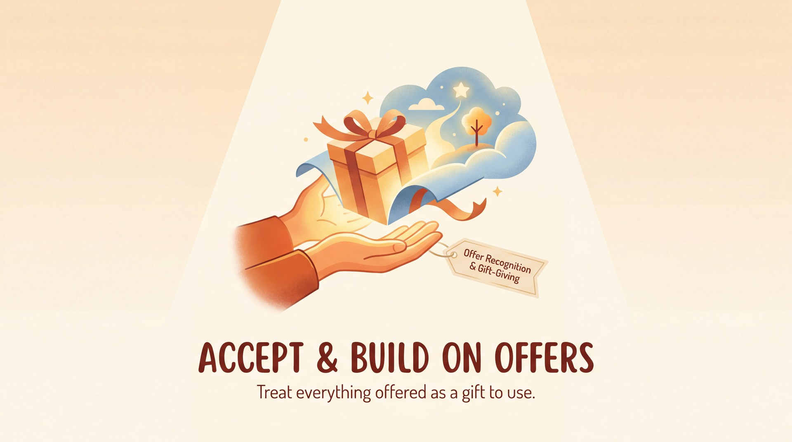

# Accept & Build on Offers

> *Treat everything offered as a gift to use.*

## What it means

An offer is anything put into a scene—a line of dialogue, a sigh, a physical gesture, or an emotion. Accepting means you treat that offer as true and real, rather than ignoring or rejecting it. Building means you add your own new detail to the reality your partner just created. 

## The mechanics

*   **Everything is useful:** There are no mistakes, only raw materials. Even a stumble, a cough, or a silence is an offer you can use.
*   **Agreement creates reality:** When you accept an offer ("Yes, it *is* freezing on this mountain"), the audience and players instantly believe the world.
*   **Stacking, not replacing:** You don't drop your partner's idea to push your own. You take their brick and place yours directly on top of it.

## The skill it builds — Offer Recognition & Gift-Giving

This principle is trained through **Offer Recognition & Gift-Giving**—the active practice of spotting what your partner is giving you and handing something back. When you practice this skill, you train your brain to stop planning ahead and start hunting for clues in the present moment. You practice moves like:

*   **Endowing:** Giving your partner a specific, playable detail ("You're clearly the boss here, sir").
*   **Reincorporating:** Spotting a small offer from earlier in the scene and bringing it back, which makes the story feel cohesive and rewards the audience.
*   **Physical mirroring:** Recognizing a partner's physical offer (like a slouch or a twitch) and adopting it to build a shared reality.

## See it in play

A: "Officer, I swear I didn't take the diamonds." 
B: "Then explain the diamond sticking out of your shoe, sir." 
A: "That's just a very sparkly pebble I found on the beach!" 

## Try this (2 minutes)

**The Present Game.** Mime handing your partner a wrapped box. They open it and tell *you* what it is ("A live octopus—thank you!"). They have accepted your physical offer and built on it with a verbal one. Now, they mime handing you a box. Receive every gift with delight, name it, and pass one back. It trains the accept-then-build reflex.

## Watch out for

*   **Blocking or Denying:** Shutting down an offer ("There's no monster, you're imagining it"). 
    *   *The quick fix:* Say "yes" to their reality first, then steer from the inside ("Yes, the monster is huge, but I think it just wants a hug!").
*   **Steamrolling:** Adding so much of your own invention that you ignore what your partner just gave you. 
    *   *The quick fix:* Receive before you give. Take a breath, acknowledge their offer, and *then* add yours.

---

**The skill this trains:** Offer Recognition & Gift-Giving — spotting offers (words, moves, emotions) and answering them.

*Principle text drafted with Gemini 3.1 Pro; infographic generated with Gemini 3 Pro Image (Vertex AI). Part of the [Improv Principles](index.md) domain.*
