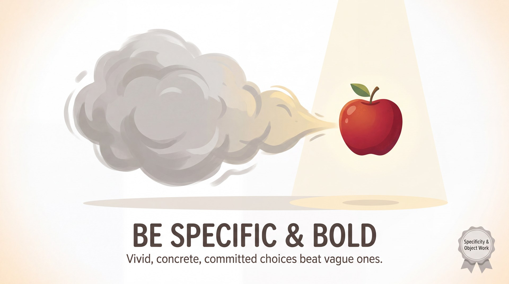

# Be Specific & Bold

> *Vivid, concrete, committed choices beat vague ones.*

## What it means

Being specific means choosing real, textured details instead of fuzzy placeholders. Being bold means committing to those choices fully, without hedging or watering them down. Together, they turn wishy-washy, forgettable scenes into vivid worlds that give your partner something solid to grab onto.

## The mechanics

*   **Name the details:** Swap "an animal" for "a three-legged greyhound named Kevin." Swap "somewhere nice" for "the back row of a midnight bus to Glasgow."
*   **Drop the qualifiers:** Erase words like "maybe," "sort of," or "I guess" from your vocabulary. State your reality as a fact.
*   **Engage the senses:** Decide what the environment smells, sounds, or feels like to ground the scene.
*   **Commit physically:** Match your voice, posture, and actions to your choice so the audience knows you mean it.

## The skill it builds — Specificity & Object Work

You train the mindset of boldness through the physical practice of **Specificity & Object Work**. When you mime holding a coffee cup, you don't just hold a vague cylinder—you decide if it's a fragile porcelain teacup or a heavy, scalding-hot travel mug. By making the imaginary world physical, you force yourself to make bold choices. 

You practise this through:
*   **Weight and Temperature:** Picking up imaginary objects and instantly deciding exactly how heavy and hot or cold they are, letting that change your posture.
*   **The "Brand Name" Move:** Whenever you introduce an object or place, giving it a hyper-specific name (e.g., "Pass me the Heinz ketchup," not "Pass the sauce").
*   **Environment Painting:** Spending the first ten seconds of a scene silently interacting with three distinct imaginary objects before speaking, establishing a concrete world.

## See it in play

A: "Careful, this 1982 vintage Merlot stains instantly." *(Mimes holding a delicate, wide-brimmed glass by the stem)*
B: "Good thing I wore my cheap neon-green poncho, then." *(Mimes zipping up a stiff plastic jacket)*
A: "You always know how to ruin a romantic anniversary at the Olive Garden."

## Try this (2 minutes)

**Replace the Vague Word.** Have a normal conversation with your partner. Every time either of you uses a vague word ("thing," "stuff," "somewhere," "nice"), you must immediately stop and replace it with a hyper-specific detail. It rewires your brain to reach for the exact noun automatically.

## Watch out for

*   **Waiting for the "perfect" idea:** Beginners often stay vague because they are searching for a clever choice. *The fix:* The first specific detail that pops into your head is always better than a delayed, perfect one. Just say it.
*   **Bulldozing:** Being bold doesn't mean ignoring your partner. *The fix:* Stay fiercely committed to your specific choices, but immediately accept and incorporate the specific details your partner adds. Boldness and generosity go hand in hand.

---

**The skill this trains:** Specificity & Object Work — naming details and making the imaginary world physical.

*Principle text drafted with Gemini 3.1 Pro; infographic generated with Gemini 3 Pro Image (Vertex AI). Part of the [Improv Principles](index.md) domain.*
