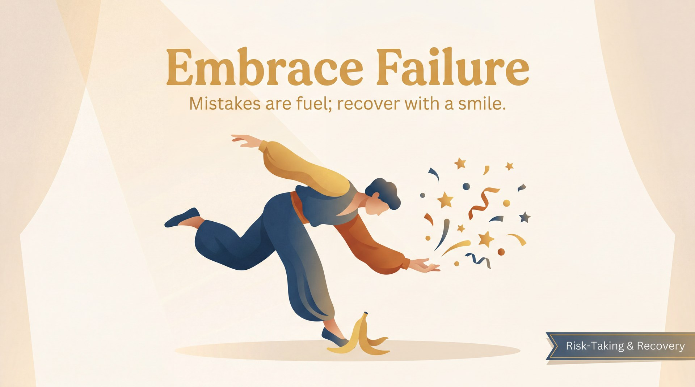

# Embrace Failure

> *Mistakes are fuel; recover with a smile.*

## What it means

In improv, there is no script to mess up, which means a "mistake" is really just an unexpected offer. Embracing failure means you stop fearing the wrong move and start failing joyfully. When you let go of the pressure to be perfect, you become free to make bold, surprising choices. 

## The mechanics

*   **Accept the accident:** If you trip, stutter, or call your partner the wrong name, treat it as a deliberate character trait or plot twist.
*   **Smile through the slip:** A genuine grin signals to your partner and the audience that you are safe, unbothered, and having fun.
*   **Drop the apology:** Wincing or breaking character to say "sorry" stops the scene's momentum. Using the mistake propels it forward.

## The skill it builds — Risk-Taking & Recovery

You can't just *tell* yourself not to fear failure; you have to train your nervous system to survive it. We build this mindset through the concrete skill of **Risk-Taking & Recovery**. By deliberately making bold choices and practising how to pivot when they flop, you learn that a joyful recovery is often far more entertaining than a flawless scene.

You train this muscle through specific moves:
*   **The Failure Bow:** When you blank or mess up in a workshop, you throw your hands up, take a theatrical bow, and let the group cheer. It rewires your brain to associate flops with applause.
*   **New Choice:** A drill where a teacher rings a bell, forcing you to instantly drop your current line or action and invent a completely new one. It trains you to pivot without panicking and proves that you always have another idea in the tank.

## See it in play

A: "Happy anniversary, Susan!"
B: "My name is Brenda. Who is Susan?!"
A: *(Smiling, embracing the slip)* "She's the woman I bought this ring for, but you're the one I want to give it to."

## Try this (2 minutes)

**The Word-at-a-Time Story.** Tell a story with a partner by alternating one word at a time. Go as fast as you can. When one of you inevitably stumbles, says something nonsensical, or blanks completely, throw your hands in the air, yell "Ta-da!", take a bow together, and immediately start a new story. 

## Watch out for

*   **Freezing in the headlights:** When you make a mistake, your instinct might be to stop and panic. **The fix:** Take a breath, smile, and immediately justify the mistake as a deliberate choice your *character* just made.
*   **Apologising mid-scene:** Saying "sorry" pulls everyone out of the reality of the scene. **The fix:** Never apologise for the *actor's* mistake. If you must, make the *character* apologise for their weird behaviour, keeping the scene alive.

---

**The skill this trains:** Risk-Taking & Recovery — committing to bold choices and using 'New Choice' to pivot.

*Principle text drafted with Gemini 3.1 Pro; infographic generated with Gemini 3 Pro Image (Vertex AI). Part of the [Improv Principles](index.md) domain.*
