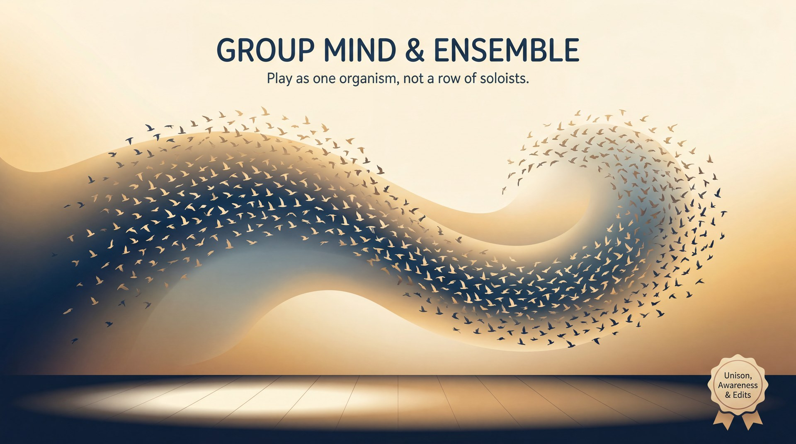

# Group Mind & Ensemble

> *Play as one organism, not a row of soloists.*

## What it means

Group mind is what happens when a team of improvisers becomes so tuned in to each other that they start to move, choose, and react as if sharing one brain. Instead of fighting for the spotlight, everyone serves the scene together. You don't achieve this by being psychic, but by listening fiercely and caring more about the whole show than your own individual moments. 

## The mechanics

- **Share the focus:** If two ideas happen at once, one player immediately drops theirs to back the other. 
- **Give and take:** You step back when your teammates are shining, and step up when the scene needs a burst of energy.
- **Support from the edges:** Players not in the scene stay engaged, ready to provide sound effects, play a walk-on character, or edit the scene.
- **Follow the follower:** Leading often means noticing where the group is already going and enthusiastically going there too.

## The skill it builds — Unison, Awareness & Edits

You can't force group mind, but you can train the physical habits that invite it. By practising **Unison, Awareness & Edits**, you learn to sense the ensemble without looking and make decisive choices that serve the show. 

- **Group Breathing & Unison:** Moving or speaking at the exact same time as your team (like in a "Mind Meld" word game or building a group machine). It forces you to stop leading and start sensing.
- **Shared Focus:** Deliberately turning your physical attention to whoever is speaking, which silently directs the audience's eyes to the focal point.
- **Clean Edits:** Watching a scene from the sidelines and sweeping across the stage to end it the moment it peaks, saving your teammates from dragging it out.

## See it in play

A: "Look out, the volcano is—"  
B: "The volcano is erupting! Grab the parachute!"  
A: "I've got it! Strapping it on now!" *(A instantly drops their original thought to back B's idea).*  

## Try this (2 minutes)

**Group Count.** Stand in a circle (or look at your gallery view on a video call) and count to twenty out loud as a team. The rules: only one person speaks at a time, there is no set turn order, and if two people speak at once, you must start over at one. It forces you to sense the group's rhythm and breathe together.

## Watch out for

- **Everyone leading at once:** If everyone tries to drive the scene, you get chaos. *The fix:* Practise yielding. Let your partner's idea win, and throw all your energy behind it.
- **Checking out on the sidelines:** Disconnecting when you aren't the main focus kills the group energy. *The fix:* Stay present. Watch the scene like an audience member so you're ready to jump in or edit exactly when the show needs it.

---

**The skill this trains:** Unison, Awareness & Edits — group breathing, shared focus, and clean scene edits.

*Principle text drafted with Gemini 3.1 Pro; infographic generated with Gemini 3 Pro Image (Vertex AI). Part of the [Improv Principles](index.md) domain.*
