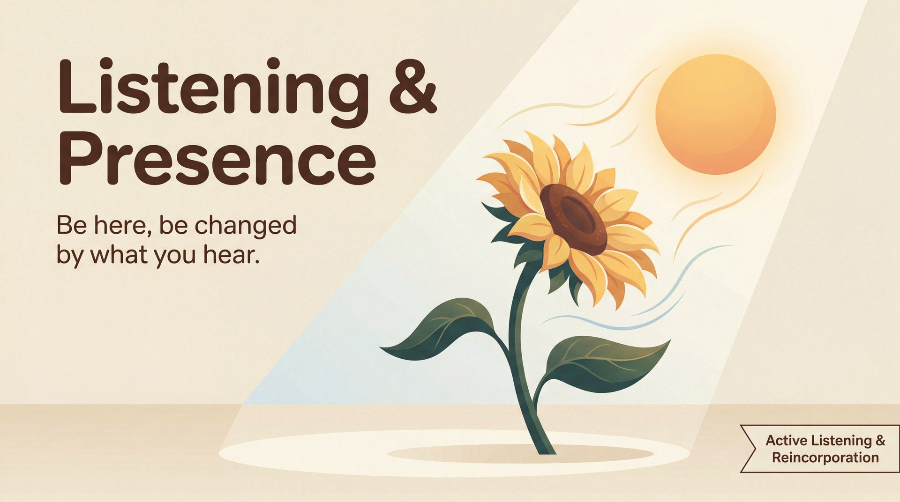

# Listening & Presence

> *Be here, be changed by what you hear.*

## What it means

When you are new to improv, your brain is usually busy panicking about what to say next. Listening and presence mean putting that noise aside to tune completely into your partner. Instead of inventing a clever response, you simply pay attention to the moment and let your next line write itself.

## The mechanics

*   **Drop the script:** You stop pre-planning your next line while your partner is still talking. 
*   **Read the whole person:** You watch their eyes, posture, and energy, treating their physical emotion as vital information.
*   **Take a beat:** You allow a tiny, one-second pause to let their offer actually land and affect you before you speak.

## The skill it builds — Active Listening & Reincorporation

You train the mindset of presence through the concrete skills of **Active Listening and Reincorporation**. By forcing yourself to track specific details your partner gives you, you anchor your brain in the present moment. Later, you bring those details back (reincorporation) to prove you were listening and to weave the scene together. 

You practise this through specific moves:
*   **Repeating the last word:** Starting your sentence with the exact last word your partner said to ensure you listened to the very end.
*   **Naming the physical:** Saying exactly what you see ("You're clenching your jaw") to ground the scene in immediate reality.
*   **Calling back a detail:** Mentioning a specific name, object, or emotion your partner established earlier in the scene to build a shared world.

## See it in play

A: *(Pacing nervously)* I can't believe I lost the blue envelope.
B: You're pacing a hole in the rug. Take a breath, we will find the blue envelope.
A: I'm pacing because my passport is in there!

## Try this (2 minutes)

**Last Word Response.** Have a normal conversation with a partner about your weekend. The only rule: the first word of your reply must be the exact *last* word your partner just said. It forces you to stop planning your reply and listen all the way to the end of their sentence.

## Watch out for

*   **Rehearsing your next line:** You stop listening because you're terrified of going blank. *The fix:* Trust the silence. Take a breath, look at your partner, and respond honestly to whatever they just did.
*   **Steamrolling:** Ignoring your partner's emotional offer to push your own pre-planned idea. *The fix:* Acknowledge what they gave you first ("You look worried") before adding your own information.

---

**The skill this trains:** Active Listening & Reincorporation — tracking details and bringing them back later as callbacks.

*Principle text drafted with Gemini 3.1 Pro; infographic generated with Gemini 3 Pro Image (Vertex AI). Part of the [Improv Principles](index.md) domain.*
