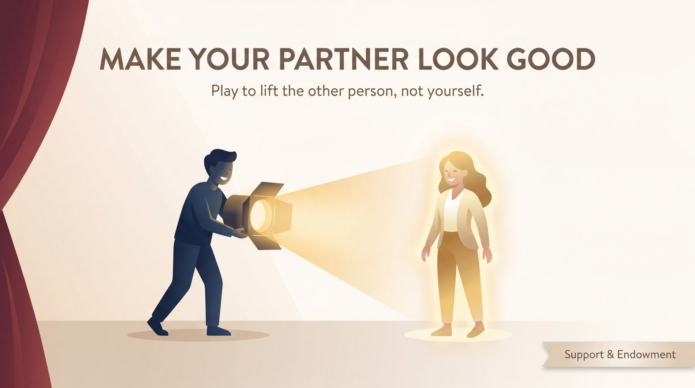

# Make Your Partner Look Good

> *Play to lift the other person, not yourself.*

## What it means

In improv, you are never trying to win or steal the spotlight. Instead, your quiet goal is to make your scene partner look like an absolute genius. When you focus entirely on making them shine, your own pressure to be brilliant vanishes, and everybody looks good.

## The mechanics

*   **Catch their stumbles:** If your partner forgets a name or fumbles a word, seamlessly weave it into the reality of the scene rather than pointing out the mistake.
*   **Justify their choices:** If they make an odd move, treat it as entirely normal and figure out *why* it makes perfect sense in your shared world.
*   **Share the focus:** Actively set your partner up for the punchline or the heroic moment instead of grabbing it for yourself.

## The skill it builds — Support & Endowment

You train this generous mindset through the active skills of **Support and Endowment**. Support means stepping in to reinforce your partner's reality; endowment means giving them specific, interesting traits so they don't have to invent them from scratch. 

You practise this on stage by:
*   **Giving gifts:** Handing your partner a clear identity, emotion, or object ("You're trembling! Here, take this blanket").
*   **Assigning high status:** Endowing them with authority or expertise ("Doctor, we need your brilliant mind on this case").
*   **Teeing up easy wins:** Asking questions that give them a clear runway to succeed, rather than backing them into a corner.

## See it in play

A: "I brought the... uh... the thing you asked for." *(A fumbles)*  
B: "The invisibility cloak! You're the best spy in the agency, Jenkins." *(B catches the fumble, endows A with high status and a clear gift)*  
A: "Well, I couldn't let my favourite boss down." *(A accepts the gift and supports B)*  

## Try this (2 minutes)

**The Expert Interview.** One player is the world's leading expert on a mundane topic (like shoelaces or toast). The other player is a talk-show host interviewing them. The host's only job is to make the expert sound fascinating, asking questions that tee up brilliant, easy answers. Swap roles after one minute. Notice how good it feels to be set up to win.

## Watch out for

*   **"Saving" the scene:** When a scene feels wobbly, beginners often try to take over and drive the plot themselves. *The fix:* Lean into what your partner already started. Support their idea instead of replacing it.
*   **Playing small:** Thinking that "support" means staying quiet in the background. *The fix:* Real support is active. Match your partner's energy and jump in beside them.

---

**The skill this trains:** Support & Endowment — giving your partner status, gifts, and easy wins.

*Principle text drafted with Gemini 3.1 Pro; infographic generated with Gemini 3 Pro Image (Vertex AI). Part of the [Improv Principles](index.md) domain.*
