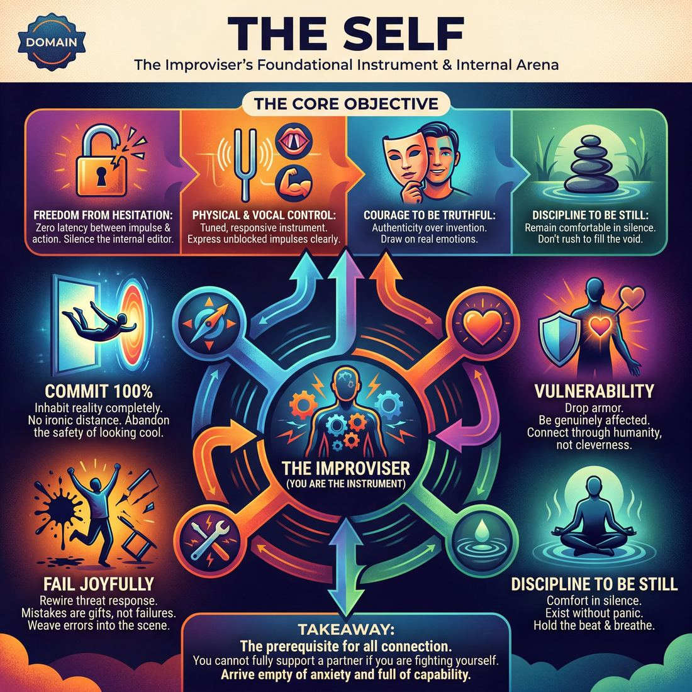

# 🎭 The Self

> *Freedom from hesitation; complete physical/vocal control; the courage to be truthful and the discipline to be still.*

{ .infographic }

## 🎭 The arena

In the architecture of improvisation, the most fundamental relationship you must navigate is the one you have with yourself. This is the **intrapersonal** arena. Before a scene partner speaks, before a narrative emerges, and before the audience reacts, there is only the improviser standing on a bare stage. This domain governs your internal landscape: the dialogue between your conscious mind and your subconscious impulses, the physical readiness of your body, and the emotional reservoir you draw from. It is the private crucible where raw inspiration is either embraced or censored.

Unlike a musician who picks up a violin or a painter who buys a canvas, the improviser *is* the instrument. Mastering this arena means tuning that instrument to be highly responsive and completely unblocked. It is about dismantling the **internal editor**—that quiet, anxious voice that hesitates, judges, or tries to invent something "clever"—so that your first, most authentic thoughts can flow freely into physical and vocal expression. When you operate successfully in this domain, the friction between having an impulse and acting upon it drops to zero.

!!! abstract "The foundational relationship"
    You cannot fully support a partner if you are secretly fighting yourself. The Self is the prerequisite domain for all other improv work; it is the solid ground upon which every subsequent connection is built.

## 🧭 The goal

At its core, the goal of **The Self** is to turn the improviser into a clear, unblocked conduit. Before you can connect with a partner, build a scene, or captivate an audience, your own instrument—your mind, body, and voice—must be tuned, responsive, and free of fear. 

!!! abstract "The Core Objective"
    To achieve **freedom from hesitation**, complete **physical and vocal control**, the courage to be **truthful**, and the discipline to be **still**.

Unpacking this goal reveals four distinct pillars of intrapersonal mastery:

*   **Freedom from hesitation:** This requires silencing the internal editor before it can judge an idea as "not funny enough" or "too weird." The goal is to achieve zero latency between an impulse arriving and an offer being made.
*   **Physical and vocal control:** An unblocked impulse is useless if your body and voice cannot express it clearly. The goal is to develop a responsive physical and vocal instrument that can instantly adopt a new posture, project across a crowded theater, or drop into a specific emotional register without conscious strain.
*   **The courage to be truthful:** Improv thrives on authenticity, not just rapid-fire invention. The goal is to allow yourself to be genuinely affected on stage. It means drawing on real emotions and standing in front of an audience without the protective armor of irony, detachment, or forced jokes.
*   **The discipline to be still:** Novices often equate improvisation with constant talking and frantic movement. A vital intrapersonal goal is becoming entirely comfortable in silence. It is the ability to hold a beat, breathe, and simply *exist* on stage without panicking to fill the void.

### Why this matters

The Self is the foundational domain because every subsequent layer of improvisation relies upon it. If you are hesitating, you are starving your partner of offers. If you are physically tense, the audience will subconsciously feel your anxiety. If you cannot tolerate silence, you will trample over the most poignant, grounded moments of a scene. 

Mastering The Self ensures that when you finally step out to meet your partner, you arrive empty of anxiety and full of capability.

!!! warning "Watch out: The 'Cleverness' Trap"
    A common mistake is assuming the goal of The Self is to become faster, funnier, or more clever. Cleverness is often just the ego trying to protect itself from failure. The actual goal of this domain is *readiness* and *vulnerability*.

## 💎 Its principles — the Why

Before you can connect with a partner or build a scene, you must first get out of your own way. The intrapersonal domain is governed by four core principles—mindsets designed to dismantle the ego, quiet the inner critic, and give you permission to play. 

These principles are the philosophical "Why" behind every move you make on stage.

### Commit 100%
Improvisation requires absolute belief in the fragile, invisible reality you are creating. To commit fully means abandoning the safety of looking "cool" or detached. If you are playing a heartbroken accountant, a feral goblin, or a sentient toaster, you must inhabit that reality with your entire body, voice, and spirit. Half-measures kill the audience's belief in the scene.

!!! warning "Watch out: Ironic Distance"
    A common trap for newer improvisers is **ironic distance**—winking at the audience to show that *you* know the scene is silly, even if your character doesn't. This protects the performer's ego but destroys the reality of the scene. True commitment means taking the fiction seriously.

### Fail Joyfully
In a completely unscripted art form, mistakes are not just possible; they are inevitable. This principle asks you to completely rewire your brain's natural threat response to failure. When you stumble over a word, call your partner by the wrong name, or walk through a mimed table, you do not apologize, freeze, or panic. You celebrate the error as a sudden, unexpected gift and weave it into the fabric of the scene.

!!! tip "On stage"
    If you accidentally call your scene partner "Mom" instead of "Mary," don't correct yourself. Lean in. You have just discovered a fascinating, weird new dynamic about your relationship. The "mistake" is now the scene.

### Vulnerability
Audiences do not connect with cleverness; they connect with humanity. Vulnerability is the courage to drop your armor, allow yourself to be genuinely affected by what is happening, and react with emotional truth. It asks the performer to stop hiding behind jokes, sarcasm, or rapid-fire talking, and instead allow the audience to see them feel something real.

!!! example "In a scene"
    **Partner:** "I'm leaving you, and I'm taking the dog."
    *Deflection (Armored):* "Fine, he had terrible breath anyway, and so do you!" (Gets a quick laugh, but kills the emotional stakes).
    *Vulnerability (Open):* (Takes a long, silent breath, looking down). "I don't know how to sleep in this house without him." (Draws the audience in and grounds the scene).

### The First Thought Is a Gift
Your subconscious is vastly faster and more creative than your conscious, calculating mind. This principle demands that you trust your instincts and bypass the internal editor entirely. 

!!! abstract "Key idea: The First vs. The Best"
    Improvisers often freeze because they are searching for the *best* idea. But the stage does not need the best idea; it needs an idea *right now*. Your first thought, no matter how mundane or bizarre, is the exact right material to build the next moment. Trust it, say it, and let the scene evolve.

## 🧠 Its skills & techniques — the What & How

Mastering **The Self** means tuning your own instrument before you ever play a duet. In improvisation, you are simultaneously the composer, the conductor, and the instrument itself. The skills in this domain focus entirely on your internal mechanics and your physical output, ensuring that when inspiration strikes, you have the capacity to execute it. 

We can group the craft of this domain into three distinct areas: the mind, the heart, and the physical instrument.

### The Mind & Impulse

Before you can connect with a partner, you must be able to trust your own brain. These skills focus on removing the friction between having an idea and expressing it.

*   **Unfiltered Spontaneity:** The ability to let an idea out into the world before it can be judged. True spontaneity is closing the gap between impulse and action until they happen simultaneously.
*   **Self-Recovery:** The mental resilience to bounce back instantly when you stumble, freeze, or make a "mistake." It is the active practice of short-circuiting a spiral of self-judgment and returning your focus to the present moment.

!!! tip "On stage"
    If you catch yourself hesitating because you are searching for the "right" or "clever" thing to say, immediately say the most obvious, mundane truth about your physical environment. *“This steering wheel is freezing.”* It forces you out of your head and back into your body.

### The Heart & Feeling

Improv without emotion is just rapid-fire playwriting. This domain requires you to access genuine feeling on demand.

*   **Emotional Fluidity:** The capacity to experience, express, and transition between emotions truthfully. This means allowing an emotion to physically affect your breathing and posture, rather than just intellectually deciding your character is angry.

!!! example "In a scene"
    **Indicating (Novice):** Crossing your arms, furrowing your brow, and yelling, "I am so mad at you right now!" 
    **Experiencing (Proficient):** Your breathing shallows, your jaw tightens, and you quietly, intensely say, "Put the keys on the table." The emotion is felt, not just signaled.

### The Instrument (Body & Voice)

Your body and voice are the only tools you have to paint the invisible world of the scene. If they are undisciplined, the illusion shatters.

*   **Physicality & Space Work:** The control of your body in space. This includes **mime** (manipulating invisible objects with consistent weight, texture, and dimension) and **character physicality** (altering your center of gravity, gait, or posture to embody someone else). 
*   **Vocal Craft:** Treating your voice as a fully controlled tool. This encompasses projection (being heard without straining), articulation, pacing, and the ability to alter pitch and resonance to create distinct character voices.
*   **Silence & Stillness:** The profound discipline to do absolutely nothing. It is the physical control to stop fidgeting, shifting your weight, or rushing to fill a quiet moment with chatter. 

!!! abstract "Key idea"
    **Stillness is an action, not an absence.** A novice freezes because they don't know what to do; a master chooses stillness to draw the audience's eye, hold tension, and let a moment breathe.

## 🪧 Engines, distinctions & scoping

The domain of **The Self** is strictly bounded by your own skin. It is concerned entirely with the preparation, maintenance, and operation of your own instrument. Before you can connect with a partner or build a scene, you must have a vessel capable of generating raw material and transmitting it clearly.

To master this domain, improvisers must navigate several critical distinctions and understand the internal engines that drive solo performance.

### The Engine: The Impulse-Action Loop
The primary engine of The Self is the **Impulse-Action Loop**. An impulse is a sudden, pre-logical urge—a physical twitch, an emotional spike, or a random word that pops into your head. 

In daily life, the internal editor intercepts these impulses, filtering them for social acceptability, logic, and safety. On stage, the engine of The Self relies on bypassing this editor entirely. The goal is to close the gap between impulse and action until they are simultaneous. When the engine is running smoothly, you act *before* you have time to judge the action.

!!! abstract "Key idea: The Instrument vs. The Music"
    Think of The Self as the physical instrument (a guitar) and the Scene as the music being played. You cannot play a beautiful duet if your guitar is out of tune, missing strings, or if you are constantly looking at your fingers. Mastering The Self means tuning your physical, vocal, and emotional instrument so completely that you can forget about it when it’s time to play.

### Critical Distinctions

**Self-Awareness vs. Self-Consciousness**  
These two states sound similar but are diametrically opposed on stage. 
*   **Self-consciousness** is fear-based. It is the internal editor asking, *"Do I look stupid? Is this funny? Am I doing this right?"* It pulls you out of the moment and freezes your instrument.
*   **Self-awareness** is craft-based. It is the neutral, observational knowledge of your physical and vocal footprint. It is knowing, *"I am currently whispering; my shoulders are hunched; I am standing downstage right."* 

| Feature | Self-Consciousness | Self-Awareness |
| :--- | :--- | :--- |
| **Focus** | Internal judgment | External reality & physical state |
| **Result** | Hesitation, physical tension | Deliberate choices, physical control |
| **Voice** | "They aren't laughing at me." | "I need to project so the back row hears me." |

**Truth vs. Cleverness**  
The Self is often tempted to invent clever ideas to prove its worth. However, the most powerful fuel for this domain is vulnerability—the willingness to be truthfully affected. Cleverness operates from the neck up; truth operates in the body and the breath. An improviser operating purely from cleverness will eventually run out of ideas, while an improviser operating from emotional truth has an infinite well of reactions.

### Scoping: Where The Self Ends
The boundary of this domain is absolute: **you only control your side of the equation.** 

You have total jurisdiction over your breath, your volume, your posture, your emotional availability, and your willingness to step into the unknown. You have *zero* jurisdiction over how your partner reacts, whether the audience laughs, or where the narrative goes. 

!!! warning "Watch out: The Solipsism Trap"
    Because The Self requires intense internal focus to master, improvisers can sometimes get trapped here, becoming "solipsistic" (acting as if only their own mind exists). This manifests as steamrolling, ignoring offers, or doing a one-person show while a partner stands awkwardly nearby. Remember: you master The Self *so that* you can be fully present for The Partner.

## 📈 The journey across this domain

Growth in the intrapersonal domain is a journey from self-censorship to radical self-trust. It is the process of replacing the anxious, judging voice in your head with a responsive, expressive physical and vocal instrument. 

As an improviser matures in this domain, they move from fighting their own instincts to effortlessly riding them. The struggle to "think of something good" dissolves into the physical reality of simply *reacting*.

| Stage | **Spontaneity** | **Emotional Fluidity** | **Silence & Stillness** | **Vocal Craft** |
|---|---|---|---|---|
| **1 Novice** | Tries the first thought but the editor wins under pressure | Consciously names an emotion instead of feeling it | Tries to hold a beat but rushes to fill silence | Remembers to project, then drops volume on uncertainty |
| **2 Adv. Beginner** | Offers first thought reliably in drills | Switches emotion on an external cue | Holds a beat on instruction | Projects on command; one distinct character voice |
| **3 Competent** | Chooses to bypass the editor under mild scene pressure | Transitions emotion when scene logic calls for it | Decides when a moment needs silence | Matches vocal energy to emotional content |
| **4 Proficient** | Impulse and action are simultaneous without thought | Layered, genuine emotion arrives unbidden | Lets moments breathe automatically | Voice instantly conveys age/status/state |
| **5 Master** | No measurable latency between impulse and offer | Feels real emotion *and* modulates it to serve the scene | Weaponizes silence — holds the room with stillness, audible collective focus | Uses the voice as a fully controlled instrument serving the piece |

### The Arc of Growth

**The Novice (Fighting the Editor)**  
At the beginning, the improviser is trapped in their own head. They know what they *should* do, but panic or judgment gets in the way. When faced with silence, they panic and rush to fill it with words. When required to feel, they intellectualize it—saying "I am so angry!" rather than allowing their body to experience anger. Their physical and vocal presence fluctuates based on their confidence in the moment.

**The Competent Improviser (Conscious Choice)**  
Through repetition and drill, the improviser develops a toolkit. They are now in the realm of conscious competence. They can *choose* to bypass the editor, *choose* to hold a beat of silence, and *choose* to match their vocal energy to the scene. It still requires mental bandwidth to execute these skills, but the improviser is no longer a victim of their own hesitation. 

!!! abstract "The Paradox of Mastery"
    To gain total control over your physical and vocal instrument, you must completely surrender control over your impulses. The master improviser is highly disciplined in *how* they express themselves (volume, stillness, clarity), but entirely undisciplined in *what* they express (allowing the raw first thought to flow without judgment).

**The Master (Unconscious Flow & Modulation)**  
At the highest level of intrapersonal mastery, the instrument plays itself. There is zero measurable latency between having an impulse and acting upon it. Silence is no longer something to be merely tolerated; it is **weaponized**—used deliberately to pull the audience to the edge of their seats. Emotion is deeply, genuinely felt, yet perfectly modulated to serve the theatrical needs of the scene. The self is no longer an obstacle; it is a fully tuned conduit for the work.

## 🧩 How it connects to the other domains

The Self is the bedrock of the improviser’s concentric circles of focus. It is the innermost ring of the framework: **Self → Partner → Scene → Ensemble → Audience**. 

You cannot give what you do not have. If your own instrument is tense, guarded, or trapped in hesitation, every subsequent layer of the performance will suffer. Conversely, a grounded, spontaneous Self acts as a powerful engine that drives the rest of the work.

Here is how mastery of the Self feeds outward into the other domains:

*   **To the Partner (Domain 2):** A hesitant improviser makes their partner work twice as hard. When you conquer your own inner critic, your attention can finally turn 100% outward. Because you trust your own spontaneous reactions, you no longer need to plan ahead, allowing you to truly listen and become a reliable, reactive anchor for your scene partner.
*   **To the Scene (Domain 3):** The Scene requires raw materials to build its reality—a distinct point of view, genuine emotional reactions, and physical object work. These all originate within the Self. If you are physically stiff or emotionally guarded, the scene starves for lack of input. 
*   **To the Ensemble (Domain 4):** A healthy group mind requires individual confidence. An improviser who has mastered the Self does not need to ego-drive or dominate the stage to feel valuable, nor do they shrink to the back wall out of fear. They offer their piece of the puzzle cleanly and step back with equal grace.
*   **To the Audience (Domain 5):** The audience is highly empathetic; they feel what the performer feels. If you are terrified, they are tense. If you are joyful, vulnerable, and comfortable in your own skin, the audience relaxes, drops their own defenses, and trusts the ride.

!!! abstract "The Paradox of the Self"
    The ultimate goal of training the Self is to **forget it entirely**. You spend years drilling spontaneity, emotional fluidity, and vocal craft so that when you step on stage, you never have to think about them. You build the vessel so you don't have to think about the vessel while sailing.

!!! warning "Watch out: Leaking into other domains"
    When an improviser has not addressed their own intrapersonal blocks, that anxiety inevitably "leaks" outward. A performer terrified of silence (a Self issue) will bulldoze their Partner. A performer desperate for validation (a Self issue) will break the reality of the Scene to pander to the Audience for a cheap laugh. Fixing the outer domains almost always requires returning to the inner one.

## 🎓 How to train this domain

Training the intrapersonal domain is fundamentally an act of **subtraction**. You are not adding new personality traits; you are stripping away the social conditioning, the internal editor, and the physical tension that prevent your natural, spontaneous impulses from surfacing. 

Because this domain focuses entirely on your own instrument—your mind, body, and voice—it is the one area of improv you can meaningfully practice alone, though it is most rigorously tested in front of others.

To develop mastery over The Self, focus your training on four distinct tracks:

**1. Overloading the Internal Editor**  
To train unfiltered spontaneity, you must practice moving faster than your brain can judge. Use high-speed, low-stakes drills (like rapid-fire word association or continuous physical morphing) where hesitation is immediately obvious. The goal is to experience the physical sensation of an impulse bypassing the conscious mind and going straight to the mouth or body. 

!!! warning "Watch out: Speed vs. Panic"
    When training spontaneity, push for *speed of impulse*, not *speed of panic*. Panic looks like frantic pacing, nervous laughter, and babbling. True spontaneity is simply zero latency between thought and action—it can be delivered from a place of complete physical stillness.

**2. Isolating the Instrument**  
Your body and voice are your only props, costumes, and sets. They require dedicated, mechanical practice outside the cognitive load of scene work.
*   **Vocal training:** Practice projecting from the diaphragm, articulating clearly, and exploring the extremes of your pitch and resonance. 
*   **Physical training:** Drill space work (mime) to build muscle memory for weight, texture, and dimension. Practice physical isolations (moving just the hips, just the shoulders) to unlock new character postures.

**3. Enduring the Void (Silence & Stillness)**  
For a beginner, silence feels like dying on stage. You must actively train your tolerance for it. Practice scenes where dialogue is restricted to three words per line, or where actors must hold a full three-second beat of sustained eye contact before responding. This teaches the nervous system that silence is not a failure to invent, but a space to feel.

!!! tip "On stage: The 'Breathe and Blink' Drill"
    If you feel the urge to rush in and fill a quiet moment out of anxiety, force yourself to take one deep, audible breath and blink slowly before you speak. This micro-pause resets your nervous system and grounds you back in your body.

**4. Decoupling Emotion from Intellect**  
Novices *think* about emotions; masters *feel* them. To train emotional fluidity, remove the burden of words. Use gibberish exercises or pure sound-and-movement drills to express rage, joy, or sorrow. By removing the need to invent clever dialogue, you allow the body to fully experience the physiological reality of the emotion, teaching you how to summon it on demand.

## 📚 References & Further Reading

### Foundational sources
*   **Keith Johnstone, *Impro: Improvisation and the Theatre* (1979)** — The definitive text on spontaneity, the fear of being judged, and how the adult mind learns to censor its most authentic impulses. Johnstone's chapters on "Spontaneity" and "Narrative" are essential reading for dismantling the internal editor and trusting that your first, most obvious thought is a gift.
*   **Viola Spolin, *Improvisation for the Theater* (1963)** — The foundational manual on getting out of the intellect, trusting physical intuition, and bypassing the "approval/disapproval syndrome." Spolin's theater games are entirely designed to distract the conscious mind so the subconscious can play freely.

### Practitioner guides & manuals
*   **Mick Napier, *Improvise: Scene from the Inside Out* (2004)** — A vital guide to intrapersonal self-reliance. Napier challenges the passive interpretation of "Yes, And," emphasizing the need to take care of yourself, make a strong physical or vocal choice immediately, and do something rather than waiting for your partner to save you.
*   **Patricia Ryan Madson, *Improv Wisdom: Don't Prepare, Just Show Up* (2005)** — Translates improv principles into personal mindsets, focusing heavily on the courage to fail joyfully, trust your first thoughts, and show up without the armor of preparation.
*   **David Razowsky, *A Subversive's Guide to Improvisation: Moving Beyond "Yes, And"* (2023)** — Focuses on present awareness, mindfulness, and dropping the ego. Razowsky teaches improvisers how to find comfort in stillness and abandon the need to be "clever" in favor of emotional truth.
*   **Charna Halpern, Del Close, and Kim "Howard" Johnson, *Truth in Comedy: The Manual of Improvisation* (1994)** — The core text arguing that vulnerability and truthfulness are inherently more compelling (and funnier) than forced jokes. It is the foundational argument against the "cleverness trap."

### Lineage & teachers
*   **The Annoyance Theatre** — Founded by Mick Napier in Chicago, this theater's training center is renowned for its philosophy of individual power, self-reliance, and taking care of your own instrument first before worrying about the ensemble or the scene.
*   **Loose Moose Theatre Company** — Founded by Keith Johnstone in Calgary, this theater is the birthplace of his theories on spontaneity, status, and the practice of failing happily in front of an audience without breaking character or apologizing.

### Research & theory
*   **Charles J. Limb and Allen R. Braun, "Neural Substrates of Spontaneous Musical Performance: An fMRI Study of Jazz Improvisation" (2008)** — A landmark neuroscientific study (later expanded by Limb to include comedic improvisers and freestyle rappers) demonstrating that improvisation deactivates the dorsolateral prefrontal cortex—the brain's literal "internal editor" and self-monitoring center.
*   **W. Timothy Gallwey, *The Inner Game of Tennis* (1974)** — A foundational text on performance psychology that distinguishes between "Self 1" (the anxious, judging critic) and "Self 2" (the intuitive, physical doer). Though written for sports, it is widely used by improv teachers to explain how to silence hesitation and achieve physical control.
*   **Mihaly Csikszentmihalyi, *Flow: The Psychology of Optimal Experience* (1990)** — The seminal psychological research on the state of "flow," where the friction between impulse and action drops to zero, self-consciousness disappears, and the performer becomes fully immersed in the present moment.

### Talks, videos & courses
*   **Charles Limb, *Your Brain on Improv* (TED Talk, 2010)** — A highly accessible, verifiable lecture breaking down his fMRI research on how the brain shuts off its self-censoring mechanisms to achieve spontaneous, unblocked flow.

### Communities & adjacent reading
*   **Anne Bogart and Tina Landau, *The Viewpoints Book: A Practical Guide to Viewpoints and Composition* (2005)** — Essential reading for developing physical and vocal control, spatial awareness, and the discipline of stillness on stage. It provides a vocabulary for the physical instrument of the improviser.
*   **Sanford Meisner and Dennis Longwell, *Sanford Meisner on Acting* (1987)** — The definitive text on "living truthfully under imaginary circumstances." Meisner's repetition exercises are designed specifically to eliminate hesitation and force the actor to react from pure instinct rather than intellectual calculation.
*   **Brené Brown, *Daring Greatly* (2012)** — While not an improv book, this is the definitive research on vulnerability, dropping protective armor, and the courage to be seen. It directly applies to the intrapersonal arena of the stage, where improvisers must learn to be genuinely affected rather than ironically detached.

## 💬 Quotes & Anecdotes

!!! quote "— Del Close"
    "Fall, and then figure out what to do on the way down."

!!! quote "— Keith Johnstone, *TEDxYYC* (2016)"
    "You learn, at school, to tense up—'I'll do better, give me another chance!' You fill yourself with tension, and that causes fear. In my opinion, doing your best is the same as stage fright. My recommendation is to be average because then there's no stress."

!!! quote "— Mick Napier, *Improvise: Scene from the Inside Out* (2004)"
    "At the top of an improv scene, in the very beginning, take care of yourself first. That's right, be very selfish at the top of your scene. Do something, anything for yourself first. You'll have plenty of time to 'support your partner' later."

!!! quote "— TJ Jagodowski, *Improvisation at the Speed of Life* (2015)"
    "That's one of my favorite things about improvisation: All it wants is you. It says you've done all the homework needed to be good at it. You stayed alive 'til now. And along the way, you've felt and learned... Your highest aspiration and basest impulse have their arena. Improvisation wants all of you."

### Where it comes from

The intrapersonal philosophy of modern improv—specifically the need to dismantle the internal editor—traces its roots heavily to **Viola Spolin**. In her foundational work, she identified what she called the **"Approval/Disapproval Syndrome."** Spolin observed that from an early age, humans are conditioned to seek the approval of authority figures, which causes performers to internally audit their instincts as "good" or "bad." She argued that this syndrome is the primary obstacle to true spontaneity, as the improviser blocks their own natural creativity in a desperate effort to please the audience, the director, or their peers.

**Keith Johnstone** expanded on this by actively waging war against the intellect and the desire to be "clever." He famously instructed his students to "pursue the obvious" and "be average," noting that the pressure to invent something highly original is exactly what causes the mind to freeze and the physical body to tense up.

### A telling example

**The 14-Second Silence**  
When the legendary improv duo TJ Jagodowski and David Pasquesi (known as TJ & Dave) begin their fully improvised shows, they do not rush to establish a premise. As captured in the documentary *Trust Us, This Is All Made Up* (2009), the lights come up and the two men often stand on stage in complete silence for up to 14 seconds. 

For a novice improviser, 14 seconds of silence in front of a paying audience feels like an eternity of terrifying failure. But TJ and Dave use this time to simply breathe, exist in the space, and read each other's physical energy. They do not panic to fill the void with a frantic action or a forced joke. This masterclass in intrapersonal control demonstrates the discipline to be still, proving that if you are comfortable in your own skin, you already have everything you need before a single word is spoken.

## 🧭 Explore the framework

- 💎 **Principles (the Why):** [Commit 100%](01_P1__commit-100.md), [Fail Joyfully](01_P2__fail-joyfully.md), [Vulnerability](01_P3__vulnerability.md), [The First Thought Is a Gift](01_P4__the-first-thought-is-a-gift.md)
- 🧠 **Skills (the What & How):** [Unfiltered Spontaneity](01_S1__unfiltered-spontaneity.md), [Emotional Fluidity](01_S2__emotional-fluidity.md), [Physicality & Space Work](01_S3__physicality-and-space-work.md), [Vocal Craft](01_S4__vocal-craft.md), [Silence & Stillness](01_S5__silence-and-stillness.md), [Self-Recovery](01_S6__self-recovery.md)
