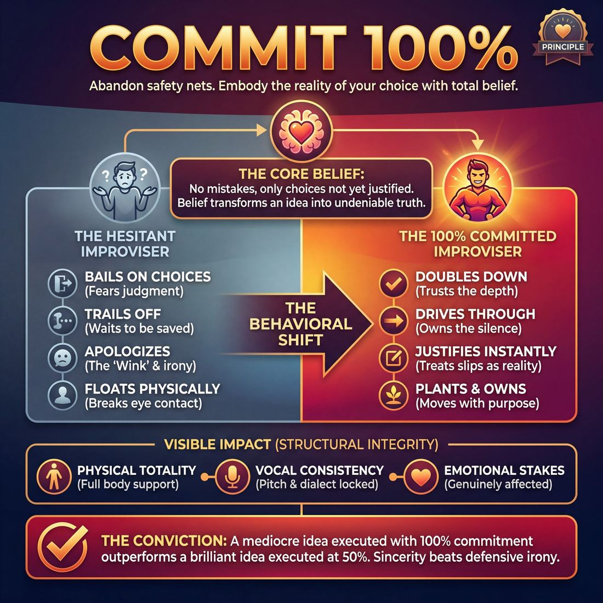

# 💎 Commit 100%

> *There are no mistakes, only choices not yet justified.*

{ .infographic }

## 💎 The core belief

At the heart of **Commit 100%** is a radical, liberating conviction: *there are no mistakes, only choices not yet justified*. To commit fully means to step onto the stage and completely abandon the safety nets of irony, hesitation, and half-measures. It is the absolute belief that whatever action you take, word you speak, or emotion you portray is the undeniable reality of the scene in that exact moment. You are not tentatively testing an idea to see if your scene partner or the audience likes it; you are executing a choice so completely that it becomes the undeniable truth of the world. 

Unpacking this belief reveals a fundamental truth of performance: an audience rarely judges the objective brilliance of an idea, but they always feel the confidence with which it is delivered. When you commit 100%, you eliminate the friction between thought and action. A stumbled word is no longer an error to apologize for; it is instantly **justified** (given a valid, in-world reason to exist) as a character's genuine anxiety. A bizarre physical impulse is not a weird fluke; it is the foundation of a new reality. This principle demands that you trust yourself completely, knowing that the power of a scene lies not in making the "right" choice, but in making your choice right through sheer force of belief.

!!! abstract "The Conviction"
    A mediocre idea executed with 100% commitment will always outperform a brilliant idea executed with 50% commitment. The magic of improvisation lies in the totality of the choice, not the choice itself.

## 🌱 Why it governs everything

When an improviser truly internalizes the necessity of 100% commitment, a profound behavioral shift occurs: they stop *trying* to do improv and start *embodying* a reality. The stage ceases to be a place of vulnerable exposure and becomes a space of absolute conviction. 

This principle governs everything else in the craft because **commitment is the structural integrity of a scene**. You can master flawless narrative structure, razor-sharp wit, and meticulous **object work** (the pantomiming of imaginary props), but if you execute those skills with hesitation, the scene will feel hollow. Improv is inherently fragile—we are building a world out of thin air. If the architect doesn't believe in the building, the audience will refuse to step inside.

Once a performer adopts this value, their entire approach to the work transforms. The most noticeable casualty of this shift is the "wink."

!!! abstract "The Death of the 'Wink'"
    Before holding this value, improvisers often "wink" at the audience—a subtle, self-conscious smirk, a break in character, or a hesitant tone that signals, *"I know this is silly, please don't judge me."* Once an improviser commits 100%, the wink vanishes. They protect the reality of the scene fiercely, trusting that sincerity is far more compelling than defensive irony.

This internal shift triggers an immediate, observable transformation in how a performer navigates the unknown:

| The Hesitant Improviser | The 100% Committed Improviser |
| :--- | :--- |
| **Bails on choices** when they don't get an immediate laugh. | **Doubles down** on choices, trusting that depth brings the reward. |
| **Trails off** at the end of sentences, waiting to be saved. | **Drives through** to the period, owning the silence that follows. |
| **Apologizes** (verbally or physically) for a slip of the tongue. | **Justifies** the slip instantly, treating it as a deliberate character trait. |
| **Floats** physically, shifting weight and breaking eye contact. | **Plants** themselves, moving with purpose and holding their ground. |

!!! example "In a scene"
    You step out to initiate a scene as a pirate, but you feel foolish. You give a half-hearted *"Arrr,"* let your posture slump, and look at your scene partner for validation. The audience sees an actor failing to be a pirate. 
    
    Conversely, if you step out, plant your feet, squint against an imaginary gale, and roar your line with absolute sincerity—even if your accent is terrible—the audience sees a pirate. The commitment *becomes* the reality.

Ultimately, this principle governs the work because it is the engine of believability. An absurd premise played at 10% is a joke that fails; an absurd premise played at 100% is a captivating world.

## 👀 How it shows up

While "Commit 100%" is an internal conviction, it is arguably the most visible element of an improviser’s performance. To the audience, this principle broadcasts as **presence**, **certainty**, and **danger**. When an improviser fully commits, the audience relaxes, trusting that the performer is entirely in control of the ride—even if they have no idea where the car is going.

You can observe this conviction through four distinct behavioral markers:

*   **Physical totality:** The improviser’s entire body supports their choice. If they are playing an elderly character, their knees shake, their spine curves, and their breathing changes. Their object work has real weight, texture, and consequence. 
*   **Vocal consistency:** Pitch, tempo, and dialect remain locked in. A committed improviser does not drop their French accent or their high-pitched goblin voice just because they are trying to think of their next line.
*   **Emotional stakes:** The performer allows themselves to be genuinely affected by the imaginary circumstances. If a scene partner says, "I'm leaving you," a committed improviser doesn't brush it off with a quick joke; they allow the devastation to hit them.
*   **Zero "winking":** The improviser never breaks the fourth wall to apologize. They do not roll their eyes at a weird suggestion or laugh at their own jokes (**breaking**).

!!! example "In a scene: Handling a 'Mistake'"
    Imagine an improviser accidentally calls their scene partner "Mom" instead of "Mary."
    
    *   **Uncommitted (Bailing out):** The improviser grimaces, breaks eye contact, and stammers, *"I mean, Mary! Sorry, Mary."* The reality of the scene shatters.
    *   **Committed 100% (Justifying):** The improviser leans in, locks eyes, and says, *"I called you Mom because you are micromanaging my life exactly like she did, Mary."* The mistake becomes a brilliant, character-defining choice.

### The Evolution of Commitment

Because commitment requires overriding our natural human instinct to protect our ego, it takes time to develop. Here is how this principle typically manifests as an improviser gains experience:

| Stage | Observable Behaviors on Stage |
| :--- | :--- |
| **Novice** | Makes a bold physical or vocal choice, but drops it the moment they have to think about the plot. Frequently laughs at their own jokes or looks to the audience for approval. Hesitates before stepping on stage. |
| **Intermediate** | Holds character voices and postures consistently throughout the scene. Treats imaginary objects with respect. When they make a mistake (like tripping over a chair), they incorporate it into the scene rather than ignoring it. |
| **Advanced** | Displays total emotional vulnerability; they are willing to look foolish, ugly, or heartbroken. They commit to **stillness** and silence, trusting that they don't need to frantically talk to be interesting. |
| **Master** | Radiates absolute certainty. They can take the most absurd, nonsensical offer from a scene partner and treat it with life-or-death sincerity. They turn massive stage errors into the defining, brilliant moments of the show. |

!!! tip "On stage: The 'Doorway' Test"
    A simple way to measure your physical commitment is the Doorway Test. Whatever character, emotion, or physical state you have chosen, it must be fully active *before* you cross the threshold from the wings onto the stage. Don't walk to center stage as yourself and then "put on" the character. Arrive already transformed.

## 🧪 Living it in practice

Internalising the principle of 100% commitment means training your brain to bypass the "is this a good idea?" filter and jump straight to "how do I make this idea real?" Commitment is not an innate personality trait; it is a muscle built through deliberate habits, specific drills, and a shift in mindset.

### Mindsets to Adopt

To live this principle, improvisers must cultivate specific mental habits before they ever step into a scene:

*   **Burn the ships:** Once you make a choice—whether it is an accent, a limp, or an emotional reaction—abandon any desire to retreat. There is no backup plan. You must sail the ship you are on.
*   **Play the reality, not the joke:** If you are playing a dog who can talk, do not wink at the audience about how silly it is. Worry about your dog-mortgage and your dog-wife. Total sincerity makes the absurd hilarious.
*   **Treat the invisible as sacred:** If you establish that a mimed table is in the center of the stage, you must never walk through it. Respecting your own established reality proves to the audience that they should respect it, too.

### Drills for the Rehearsal Room

You can actively train your capacity for total commitment using targeted exercises that remove your safety nets.

| Drill | How it works | What it trains |
| :--- | :--- | :--- |
| **Gibberish Scenes** | Players perform a scene using entirely made-up, nonsense sounds instead of a shared language. | Removes the crutch of clever dialogue. Forces 100% reliance on physical and emotional commitment to convey meaning. |
| **The 1-to-10 Scale** | Players begin a scene with a mild emotion (a "2"). The coach calls out numbers, forcing the players to instantly scale the emotion up to a "10". | Teaches the body and voice what maximum, uninhibited output actually feels like, breaking through polite restraint. |
| **Blind Posture Justification** | Player A molds Player B into a bizarre, uncomfortable physical shape. Player B must instantly initiate a scene that perfectly justifies why they are standing that way. | Eliminates hesitation. Forces the improviser to fully own a physical choice they did not even make. |

### The Skills & Techniques it Animates

Because **Commit 100%** is a foundational principle, it acts as the power source for dozens of specific, observable techniques:

*   **Object Work:** A mimed coffee cup only exists if your hand grips it with actual tension and your wrist reacts to its weight. Commitment turns empty air into heavy porcelain.
*   **Character Voice:** A half-hearted accent is a parody; a fully committed accent, played with absolute sincerity, becomes a living, breathing character.
*   **Silence:** Holding a pause on stage is terrifying. Committing 100% means standing in that silence, holding eye contact, and trusting the moment without fidgeting or rushing to fill the void with chatter.

!!! tip "On stage: The 'Double Down' Rule"
    If you realize mid-scene that you have made a "weird" or illogical choice, your instinct will be to backpedal or apologize in-character. **Do the opposite: double down.** If you accidentally call your fierce rival "honey" when they were established as your enemy, commit to it. You now have a deeply complicated, perhaps romantic, history. The audience will follow you anywhere if you lead with conviction.

!!! example "In a scene: Bailing vs. Committing"
    **Bailing (Low Commitment):** 
    *Player A enters holding their stomach.* "Oh man, I think I ate some bad sushi." 
    *Player B (unsure how to react, drops the reality):* "Yeah, well, we're just standing on a stage anyway."
    
    **Committing 100%:**
    *Player A enters holding their stomach.* "Oh man, I think I ate some bad sushi."
    *Player B (instantly drops to the floor, grabbing a mimed bucket):* "I told you not to eat the gas station tuna! Breathe, Captain, breathe! I'll get the defibrillator!"

## ⚖️ Tensions & nuance

Committing 100% is a foundational principle, but it exists in a delicate ecosystem. If applied without awareness, "commitment" can easily curdle into stubbornness, isolation, or recklessness. Navigating this principle requires balancing it against the other demands of the craft.

Here is where the principle of total commitment rubs up against other core improv values:

**Commitment vs. Collaboration (The Paradox of the Pivot)**
The greatest tension in improv is the need to hold your choices fiercely, yet drop them instantly. You must commit 100% to your current reality, but the moment your partner introduces new information that alters that reality, you must pivot and commit 100% to the *new* truth. 

!!! example "In a scene"
    You step out as a grizzled, hard-boiled detective, fully committed to a gravelly voice and a cynical scowl. Your partner enters and says, "Timmy, if you don't take off your father's trench coat and eat your peas, no dessert." 
    
    If you cling to the detective persona and ignore her, you are being rigid, not committed. True improv commitment means instantly dropping the actual detective and committing 100% to being a six-year-old *pretending* to be a detective who is now furious about the peas.

**Commitment vs. Listening**
There is a fine line between committing to your character’s point of view and **bulldozing** (forcing your own ideas onto the scene while ignoring your partner's offers). You must commit to your *reactions*, not to a predetermined script in your head. If your commitment makes you deaf to your partner, it has become a liability.

**Intensity vs. Volume**
A common trap is equating 100% commitment with being loud, fast, or manic. Nuance dictates that you can—and often should—commit 100% to stillness, silence, or profound subtlety. 

| The Nuance | True Commitment | False Commitment (Rigidity) |
| :--- | :--- | :--- |
| **Focus** | Playing the reality of the current moment. | Forcing a predetermined outcome. |
| **Partnership** | Reacting fully and emotionally to your partner. | Ignoring your partner to protect your own idea. |
| **Energy** | Matching the exact energy the scene requires (even silence). | Defaulting to high volume or wacky physicality. |

!!! warning "Watch out: The Boundary Override"
    The principle of 100% commitment is **always overridden by physical and emotional safety**. You never commit to a physical action that could injure someone, damage the theater, or violate a fellow player's boundaries. If a scene crosses a line of consent or safety, the correct choice is to break the reality, drop the commitment, and protect the human being on stage.

## 🚫 Common misunderstandings

Because "Commit 100%" sounds like a battle cry, it is frequently misinterpreted as a directive to be bigger, louder, or more aggressive. But commitment is a measure of *belief*, not a measure of intensity. 

When improvisers misunderstand this principle, they often replace genuine conviction with artificial force. Here is how this principle is most commonly misread, and how to correct it:

| The Misunderstanding | The Correction |
| :--- | :--- |
| 📢 **Commitment equals volume and speed.** Newer improvisers often think committing means yelling, running around, or being "wacky." | 🤫 **You can commit 100% to a whisper.** True commitment is about absolute belief in your choice. You can commit entirely to stillness, silence, or a subtle emotional shift. |
| 🧱 **Commitment means never changing your mind.** If I commit to being angry, I must stay angry forever, regardless of what my partner does. | 🌊 **Commit to the *reality*, not just your initial choice.** If your partner does something that would naturally calm your character down, allowing yourself to be changed *is* committing to the truth of the scene. |
| 💡 **You need a great idea to commit to.** Waiting on the sidelines until you have a bulletproof premise before stepping out. | 🛠️ **The commitment *makes* the idea great.** Remember the core belief: *there are no mistakes, only choices not yet justified.* A fully committed "bad" idea is infinitely better than a half-hearted "brilliant" one. |

!!! warning "Watch out: The Bulldozer"
    The most dangerous misreading of this principle is becoming a **Bulldozer**. As mentioned earlier, this happens when an improviser confuses commitment with stubbornness. They hold onto their initiation so tightly that they ignore their partner's offers, talk over them, or force the scene down a predetermined path. 
    
    Commitment is about fully inhabiting your side of the reality, but it must coexist with deep listening. You are committing to the *scene*, not just your own script.

!!! example "In a scene: Wacky vs. Committed"
    **The Wacky Misunderstanding:** A player steps out, flails their arms, uses a cartoonish voice, and yells, "I am the King of the Moon!" but keeps looking at the audience to see if they are laughing. They are high-energy, but uncommitted.
    
    **The True Commitment:** A player steps out, carefully mimes adjusting a heavy, invisible crown, looks their partner dead in the eye with quiet, terrifying authority, and whispers, "The crater is mine." They are low-energy, but 100% committed.

## 🔗 Why it matters

When an improviser holds the principle of absolute commitment deeply, the effect radiates outward, fundamentally altering the chemistry of the room. It is the invisible force that transforms a group of adults making things up on a bare stage into a compelling **theatrical reality**. 

Here is how a culture of 100% commitment changes the entire ecosystem of a performance:

* **It grants the audience permission to relax.** Audiences are highly empathetic; if they sense a performer is embarrassed, hesitant, or judging their own work, the audience feels that discomfort. When you commit entirely—even to a bizarre premise or a flawed character—the audience exhales. They trust that you are in control of the ride, allowing them to stop worrying about you failing and start enjoying the story.
* **It breeds fearless scene partners.** If your ensemble knows you will treat their initiations with absolute, unironic dedication, they will stop playing it safe. Commitment is contagious. It creates a psychological safety net where improvisers feel brave enough to make wild, vulnerable, or highly specific choices, knowing they won't be left hanging.
* **It creates the illusion of a script.** The magic trick of improvisation is making the spontaneous feel inevitable. A half-hearted choice looks like a mistake; a fully committed choice looks like a deliberate, rehearsed plot point. Commitment provides the gravity that holds the fictional world together.

!!! abstract "The Alchemy of Buy-In"
    Improv relies entirely on the audience's **suspension of disbelief**. Because we rarely have sets, costumes, or props, the *only* material we have to build our world is our conviction. If you do not believe in the reality you are creating, the audience has no reason to believe in it either. Commitment is the raw fuel of that belief.

Ultimately, committing 100% matters because it is the ultimate act of respect. It respects the audience's time, it respects your scene partner's offers, and it respects the art form itself by treating the ephemeral as something worthy of total, unapologetic dedication.

## 📚 References & Further Reading

### Foundational sources
*   **Keith Johnstone, *Impro: Improvisation and the Theatre* (Faber and Faber, 1979)** — The seminal text on overcoming the fear of failure, avoiding the "inner critic," and committing to the obvious choice rather than the "clever" one. Johnstone's work is foundational to the idea that hesitation destroys the reality of the stage.
*   **Viola Spolin, *Improvisation for the Theater* (Northwestern University Press, 1963)** — The foundational manual of American improv. Spolin's theater games are designed to bypass the intellect and force physical totality, getting the actor out of their head to achieve full presence and commitment to the immediate environment.
*   **Charna Halpern, Del Close, Kim "Howard" Johnson, *Truth in Comedy: The Manual of Improvisation* (Meriwether Publishing, 1994)** — The core text of long-form improv, which popularized the idea that there are no mistakes, only choices that need to be justified. It cemented the philosophy that sincerity and absolute belief in the scene are far funnier than defensive joking.

### Practitioner guides & manuals
*   **Mick Napier, *Improvise: Scene from the Inside Out* (Heinemann, 2004)** — A direct challenge to hesitant, rule-bound improv. Napier focuses heavily on the necessity of committing 100% to an initial choice, taking care of yourself first, and eliminating the "wink" to the audience to build a stronger scene.
*   **Matt Besser, Ian Roberts, Matt Walsh, *The Upright Citizens Brigade Comedy Improvisation Manual* (Comedy Council of Nicea, 2013)** — Provides a highly structured approach to "justification," detailing exactly how to take a mistake, a slip of the tongue, or a bizarre physical choice and treat it as the undeniable, logical reality of the scene.
*   **T.J. Jagodowski, David Pasquesi, Pam Victor, *Improvisation at the Speed of Life: The TJ and Dave Book* (Solo Roma, Inc., 2015)** — A masterclass in approaching scenes with total sincerity, emotional stakes, and the absolute belief that the imaginary world is real. It is a definitive guide to playing without irony or safety nets.

### Lineage & teachers
*   **The Annoyance Theatre (Chicago)** — Founded by Mick Napier, this theater and training center is famous for its unapologetic, highly committed style of play. The Annoyance philosophy prioritizes bold, individual choices and total physical commitment over polite, tentative rule-following.
*   **iO Theater (Chicago)** — The birthplace of the Harold and the "Truth in Comedy" philosophy, where Del Close and Charna Halpern taught generations of improvisers to play to the top of their intelligence, treat absurd premises with life-or-death stakes, and never wink at the audience.

### Research & theory
*   **Charles J. Limb & Allen R. Braun, "Neural Substrates of Spontaneous Musical Performance: An fMRI Study of Jazz Improvisation" (*PLOS ONE*, 2008)** — A landmark neuroimaging study showing that during improvisation, the brain's dorsolateral prefrontal cortex (the "inner critic" responsible for self-monitoring) deactivates, while the medial prefrontal cortex (associated with self-expression) activates. This provides a biological basis for the concept of "eliminating the friction between thought and action."
*   **Mihaly Csikszentmihalyi, *Flow: The Psychology of Optimal Experience* (Harper & Row, 1990)** — The foundational psychological text on "flow states," explaining the mechanics of total immersion and the loss of self-consciousness that occurs when a performer commits fully to the present moment and trusts their impulses.

### Talks, videos & courses
*   **Charles Limb, "Your Brain on Improv" (TED Talk, 2010)** — A highly accessible video presentation of Limb's fMRI research on jazz musicians and freestyle rappers, visually demonstrating what happens in the brain when a performer successfully shuts down their inner critic and commits entirely to spontaneous creation.

### Communities & adjacent reading
*   **Stephen Nachmanovitch, *Free Play: Improvisation in Life and Art* (Jeremy P. Tarcher / Penguin, 1990)** — A philosophical exploration of spontaneous creation, emphasizing that mistakes are merely opportunities and that true play requires total, unhesitating commitment to the present moment.
*   **Kenny Werner, *Effortless Mastery: Liberating the Master Musician Within* (Jamey Aebersold Jazz, 1996)** — A jazz pianist's guide to overcoming fear and performance anxiety. Werner focuses on the psychological shift required to play a "wrong" note with 100% conviction, perfectly mirroring the improv concept of justifying mistakes through sheer belief.
*   **Sanford Meisner & Dennis Longwell, *Sanford Meisner on Acting* (Vintage Books, 1987)** — The classic acting text that defines acting as "living truthfully under imaginary circumstances." Meisner's insistence on genuine emotional stakes and reacting truthfully to a partner is a perfect parallel to the improv principle of total emotional and physical commitment.

## 💬 Quotes & Anecdotes

!!! quote "— Tina Fey, *Bossypants* (2011)"
    In improv there are no mistakes, only beautiful happy accidents. And many of the world's greatest discoveries have been by accident.

!!! quote "— Charna Halpern, Del Close, and Kim 'Howard' Johnson, *Truth in Comedy* (1994)"
    There are no mistakes. Everything is justified.

!!! quote "— Charna Halpern, Del Close, and Kim 'Howard' Johnson, *Truth in Comedy* (1994)"
    The only way to do a comedy scene is to play it completely straight. The more ridiculous the situation, the more seriously it must be played; the actors must be totally committed to their characters and play them with complete integrity to achieve maximum laughs.

!!! quote "— Mick Napier, *Improvise: Scene from the Inside Out* (2004)"
    Improvisation is the art of being completely O.K. with not knowing what the f— you're doing.

!!! quote "— Mick Napier, *Improvise: Scene from the Inside Out* (2004)"
    No, the most supportive thing you can do is get over your pasty self and selfishly make a strong choice in the scene.

### Where it comes from

The philosophy that "there are no mistakes" and the demand for 100% commitment are foundational to modern long-form improvisation, codified in Chicago during the late 20th century. In their 1994 manual *Truth in Comedy*, Charna Halpern and Del Close explicitly outlined the rule: "There are no mistakes. Everything is justified." They argued fiercely against "winking" at the audience or trying to be deliberately funny, insisting that performers must play absurd situations with absolute, straight-faced integrity. 

A decade later, director Mick Napier expanded on this in his 2004 book *Improvise: Scene from the Inside Out*. Napier observed that improvisers often ruined scenes by hesitating out of a fear of doing the "wrong" thing or breaking a "rule." He championed the idea that making a bold, unapologetic choice—and committing to it entirely—is the structural integrity that makes a scene work, overriding any technical missteps.

### A telling example

*Illustrative Scenario: The "Wrong" Name*

Imagine two improvisers step on stage. Player A initiates by saying, "Happy anniversary, honey." Player B responds, "I love you, Susan."

Player A freezes. In the previous scene, it was clearly established that Player A's name was *Karen*. Player B has made a factual mistake.

**The 10% Commitment (The Wink):** Player A breaks character, smirks at the audience, and says, "Uh, my name is Karen. Did you forget your own wife's name?" The audience laughs at the actor's mistake, but the reality of the scene is shattered. The performers have signaled that they are just actors playing a game, and the stakes vanish.

**The 100% Commitment (The Justification):** Player A doesn't flinch. They let a look of cold devastation wash over their face, step back, and say, "Who the hell is Susan?" Suddenly, the "mistake" is no longer an error—it is the dramatic inciting incident of the scene. By committing 100% to the reality of the moment, the actor instantly justifies the slip of the tongue, transforming a stage error into a brilliant, high-stakes narrative choice.

## 🧭 Explore the framework

- 🎭 **Domain:** [The Self](01_D__the-self.md)
- 🔁 **Other principles here:** [Fail Joyfully](01_P2__fail-joyfully.md), [Vulnerability](01_P3__vulnerability.md), [The First Thought Is a Gift](01_P4__the-first-thought-is-a-gift.md)
- 🧠 **Skills of this domain:** [Unfiltered Spontaneity](01_S1__unfiltered-spontaneity.md), [Emotional Fluidity](01_S2__emotional-fluidity.md), [Physicality & Space Work](01_S3__physicality-and-space-work.md), [Vocal Craft](01_S4__vocal-craft.md), [Silence & Stillness](01_S5__silence-and-stillness.md), [Self-Recovery](01_S6__self-recovery.md)
