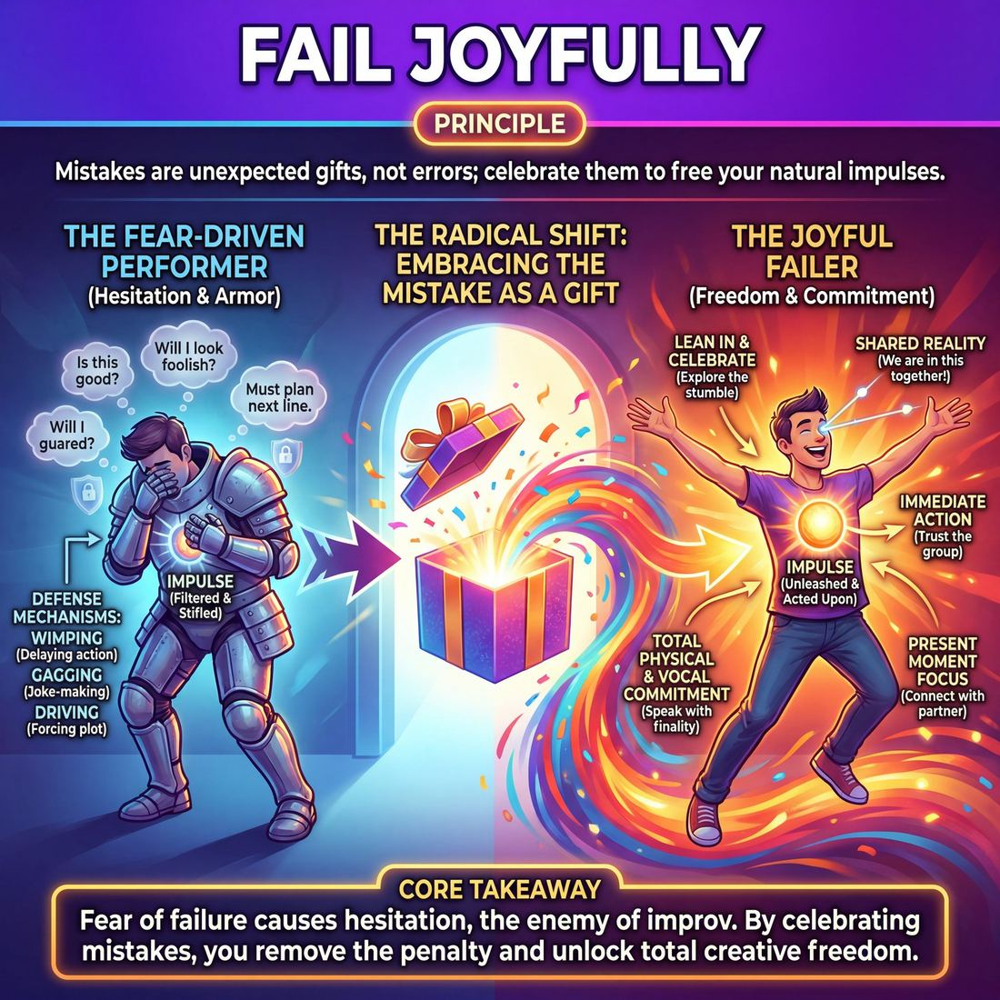

# 💎 Fail Joyfully

> *Relationship to risk — fear of failure is the only real block.*

{ .infographic }

## 💎 The core belief

To **fail joyfully** is to hold the deep-seated conviction that mistakes are not errors to be avoided, but unexpected gifts to be celebrated. In the unscripted world, perfection is an illusion and the pursuit of it is a trap. This principle demands a radical shift in how a performer relates to risk: recognizing that the *fear* of failure—not the failure itself—is the only true obstacle to brilliant improvisation. When you strip away the dread of looking foolish, you eliminate the hesitation that stifles your natural impulses, freeing yourself to act with total physical and vocal commitment.

At its heart, this belief redefines what "right" even means on stage. A "wrong" choice made with absolute joy and confidence instantly becomes the new reality of the scene, while a "safe" choice made with timid hesitation dies on arrival. Failing joyfully means trusting that your brain and your scene partners are perfectly equipped to justify any misstep, dropped line, or physical stumble. It is the internal permission slip to be messy, rooted in the understanding that the audience does not want to see you be perfect. They want to see you be brave, vulnerable, and delightfully human when things inevitably go off the rails.

!!! abstract "The Core Takeaway"
    Fear of failure causes hesitation, and hesitation is the enemy of improv. By choosing to celebrate mistakes, you remove the penalty for getting it "wrong" and unlock total creative freedom.

## 🌱 Why it governs everything

When an improviser truly internalizes the belief that failure is a cause for celebration rather than shame, their entire operating system changes. It is the master key to mastering **The Self**. Until this principle is embraced, every technique, skill, and rule in improv is filtered through a restrictive lens of self-preservation. 

This principle governs everything because the fear of getting it "wrong" is the invisible root cause of almost every bad habit on stage. **Wimping** (delaying action or refusing to make choices), **gagging** (making a joke at the expense of the scene's reality), and **driving** (forcing a predetermined plot) are rarely signs of a bad improviser—they are defense mechanisms. They are armor worn by a performer terrified of stepping into the unknown and looking foolish. 

Once a performer drops that armor and holds "Fail Joyfully" as a core conviction, a radical behavioral shift occurs:

| The Fear-Driven Performer | The Joyful Failer |
| :--- | :--- |
| **Filters impulses** to evaluate if an idea is "good" or "funny" before speaking. | **Moves immediately** on the first impulse, trusting that the group will make it work. |
| **Freezes or apologizes** (internally or externally) when they stumble over a word or miss a cue. | **Leans in** to the stumble, treating the mistake as a sudden, unexpected gift to be explored. |
| **Stays in their head**, desperately planning their next line to ensure they sound smart. | **Stays in the moment**, placing all their attention on their partner and the current reality. |
| **Physicality is tight**, small, and guarded, reflecting internal tension. | **Physicality is loose**, expansive, and relaxed, demonstrating complete physical and vocal control. |

When the penalty for missing is removed, the performer experiences a profound release. The inner critic is silenced. They stop trying to be clever and start allowing themselves to be obvious, truthful, and vulnerable. They take massive, courageous swings because they know that even if they fall flat, the fall itself will be a joyous part of the process.

!!! abstract "The Prerequisite for Presence"
    You cannot fully listen, agree, or commit to a shared reality if a percentage of your brain is busy calculating how to stay safe. Failing joyfully is not just a nice attitude to have; it is the absolute prerequisite for true, unhesitating presence on stage.

## 👀 How it shows up

Because "Fail Joyfully" is an internal conviction, you cannot see the belief itself—but you can absolutely see its exhaust. It fundamentally alters a performer’s physical presence, their vocal delivery, and their real-time reaction to chaos. 

When an improviser truly believes that fear of failure is the only real block, their body and choices broadcast that freedom to the audience.

### The Physical Tells
You can spot an improviser who has embraced this principle before they even speak a word. The observable markers include:

*   **The Eyes:** When a scene goes completely off the rails, fearful improvisers get the "deer in headlights" look, staring blankly or looking at the floor. Improvisers who fail joyfully maintain warm, connected eye contact with their scene partner, silently communicating, *"We are in this mess together, and it's great."*
*   **The Voice:** Fearful players trail off at the ends of their sentences, hoping their partner will interrupt and save them. Joyful failers speak with volume and finality. They put a period at the end of their sentence, even if the sentence makes absolutely no logical sense.
*   **The Body:** Tension is the physical manifestation of fear. A performer who is unafraid of looking foolish has relaxed shoulders, breathes deeply, and moves with a loose, ready agility.

### The Evolution of the Behavior
As an improviser matures, their ability to manifest this joy in the face of failure evolves from simple survival to high-level artistry.

*   **The Novice (The Cheerful Bail):** When a beginner makes a mistake—like tripping over a chair or completely forgetting the scene's premise—they don't freeze or punish themselves. They might break character slightly to laugh at the flub, acknowledging the reality of the mistake with a smile. The audience immediately forgives them because the performer is clearly having fun.
*   **The Experienced Player (The Seamless Justification):** The improviser no longer breaks character. When a mistake happens, they instantly weave it into the reality of the scene. A stutter becomes a character's defining nervous tick; a mispronounced word becomes a newly invented alien language; a dropped prop becomes a deliberate act of aggression toward their scene partner.
*   **The Master (The Deliberate Leap):** Master improvisers don't just handle mistakes well; they actively court danger. They walk on stage with zero idea, make a bizarre physical choice, and trust they will figure it out. When a scene inevitably hits a wall or logic collapses, they don't panic—they celebrate the collision. They will often highlight the mistake, repeating it and heightening it until the "failure" becomes the most brilliant game of the entire show.

!!! example "In a scene: The Flubbed Word"
    **The setup:** Two wizards are trying to escape a dungeon.
    
    **The mistake:** Player A means to say, "I brought the magical *port* key," but accidentally says, "I brought the magical *pork* key."
    
    **The fearful reaction:** Player A freezes, breaks eye contact, and stammers, "I mean, port key! Sorry, port key." The reality of the scene is punctured, and the audience feels the performer's embarrassment.
    
    **The joyful failure:** Player A's eyes light up. They hold up an invisible object with immense reverence. "Behold, the magical Pork Key! It will unlock any door in this dungeon, but our hands will smell like bacon for a fortnight." Player B gasps, "Not the bacon curse!" The mistake is now the best gift the scene could have received.

!!! abstract "The Audience Mirror"
    Audiences possess a highly tuned empathy reflex. If you make a mistake and tense up, the audience tenses up with you—they feel your embarrassment and the room grows cold. If you make a mistake and your eyes light up with joy, the audience relaxes and laughs. **They will only ever feel as safe as you look.**

## 🧪 Living it in practice

Internalising the ability to fail joyfully requires actively rewiring your brain’s natural threat response. You cannot simply decide to stop fearing failure; you must train your nervous system to associate mistakes with discovery, play, and support. 

This principle is cultivated through deliberate rehearsal habits, specific mindset shifts, and a willingness to look foolish on purpose.

!!! tip "In rehearsal: The Circus Bow"
    The fastest way to break the panic response is a drill often called the **Circus Bow** (or the "Ta-Da!"). During any fast-paced warm-up game, when you inevitably stumble, drop the pattern, or blank on a word, you must immediately step forward, throw your hands in the air, take a deep theatrical bow, and yell, "Ta-da!" The rest of the ensemble must erupt in wild, genuine applause. It physically forces your body to replace the instinct to shrink with the action of celebrating.

### Rewiring your habits
Living this principle means replacing defensive, fear-based behaviors with open, joyful ones. 

| Fear-Based Habit | Joyful Habit | The Result |
| :--- | :--- | :--- |
| **Hiding the mistake** | **Highlighting the mistake** | The "error" becomes the most interesting part of the scene. |
| **Apologising** (breaking character) | **Justifying** (staying in character) | The scene's reality expands to accommodate the accident. |
| **Hesitating** to find the "right" idea | **Pouncing** on the first available idea | The scene moves with energy, momentum, and confidence. |
| **Judging** your scene partner's weird move | **Yes-Anding** with enthusiasm | The ensemble builds deep trust and psychological safety. |

### The skills this principle animates
When you truly embrace failing joyfully, it acts as the fuel for several core improvisational techniques:

*   **Justification:** This is the skill of making logical sense of an accidental or bizarre offer. You cannot justify a slip of the tongue if you are busy regretting it. Failing joyfully allows you to instantly accept the mistake as a canonical fact of the scene.
*   **Physical Commitment:** Improvisers who fear failure stay in their heads and keep their bodies neutral. Joyful failers throw themselves into bold physicality, strange voices, and high-energy object work because they are no longer protecting their ego.
*   **Active Listening:** When you stop worrying about planning the "perfect" next line (a defense mechanism against failing), your brain is finally quiet enough to actually listen to your scene partner.

!!! example "In a scene: The Physical Commitment"
    Player A means to say, "Pass me the hammer," but accidentally stumbles and says, "Pass me the hamster." 
    
    A fear-based improviser will blush, break character, and say, "Oops, I meant hammer." The scene deflates. 
    
    An improviser living the principle of joyful failure will let their eyes light up, accept the new reality, and watch as Player B carefully hands them a tiny, squirming imaginary rodent to drive a nail into the wall. The mistake just gave them a brilliant, highly physical scene.

## ⚖️ Tensions & nuance

"Fail Joyfully" is a shield for the improviser's ego, not a wrecking ball for the scene. Because it is such a liberating principle, it must be carefully balanced against the discipline of the craft and your responsibilities to your ensemble. 

Here is where the principle rubs up against other core improv values:

**Tension: Joyful Failure vs. Sincere Effort**  
You must still try to do excellent work. The principle is not "fail on purpose" or "stop caring about the outcome." It is entirely about your *reaction* when a sincere, committed attempt falls short. If you stop trying to build a cohesive narrative or support your partner because "mistakes are just gifts anyway," you are no longer improvising—you are just goofing off. The joy of the failure is earned by the courage of the attempt.

**Tension: The Actor's Ego vs. The Scene's Reality**  
There is a fine line between failing joyfully and becoming flippant. When you make a mistake, the defense mechanism is often to break character, laugh, and signal to the audience, "Look, I messed up!" But true joyful failure serves the scene, not the actor's vanity. You accept the mistake with a smile *internally*, but you justify it *externally* while maintaining the reality of the characters.

!!! example "In a scene: The Continuity Error"
    **The mistake:** You confidently call your scene partner "Mom," forgetting that two scenes ago, it was established you are coworkers. 
    
    **Flippant failure:** You break character, slap your forehead, and say to the audience, "Wait, you're my boss, not my mom, I'm an idiot!" 
    
    **Joyful failure:** You stay in character, lean in, and say, "I call you Mom because you're the only one in this office who actually takes care of me." You have joyfully accepted the error and woven it into the truth of the scene.

**Tension: Narrative Mistakes vs. Ensemble Trust**  
Not all failures are created equal. We celebrate narrative and performance failures: forgetting a name, tripping over a prop, or accidentally contradicting a plot point. We do *not* celebrate failures of safety, boundaries, or respect. 

!!! warning "Watch out: The limits of failure"
    "Fail Joyfully" applies to the *art*, not the *ethics* of the stage. Steamrolling a quieter scene partner, making a culturally insensitive joke, or ignoring a physical boundary is not a "happy accident" to be celebrated. Those are breaches of ensemble trust that require genuine accountability, not a joyful shrug.

### Balancing the Scales

| When you lean too far into... | The result is... | The healthy balance |
| :--- | :--- | :--- |
| **Perfectionism** | Hesitation, fear, and sterile scenes where players only make "safe" choices. | **Fail Joyfully:** Take massive risks, knowing you will survive the fall. |
| **Joyful Failure** | Sloppy play, broken realities, and a lack of stakes or narrative momentum. | **Sincere Commitment:** Play as hard as you can to make the scene work, and *only* deploy joyful failure when you stumble. |

## 🚫 Common misunderstandings

Because "Fail Joyfully" sounds like a paradox, it is frequently misinterpreted by beginners as a license for chaos or an excuse for sloppy scenework. Embracing failure does not mean abandoning effort; it means changing your relationship to the outcome. 

Here is how this principle is most commonly misread, and how to correct it:

| ❌ The Misunderstanding | ✅ The Correction |
| :--- | :--- |
| **"I should try to mess up."** | You still play at the top of your intelligence and strive to do good work. The joy comes from how you *handle* the inevitable stumble, not from manufacturing one. Sabotage is not joyful failure. |
| **"It means breaking character and laughing."** | Joyful failure is an internal mindset for the *actor*. Outwardly, your *character* accepts the mistake as a real, serious part of their world. You don't need to giggle and point at your own error to prove you are okay with it. |
| **"Technique doesn't matter."** | Technique and form are still your goals. Failing joyfully is the psychological safety net that keeps you moving forward when your technique inevitably slips. It is not an excuse to ignore your scene partner or abandon stagecraft. |
| **"I never need to evaluate my work."** | You can—and should—review your scenes to grow as a performer. Failing joyfully simply removes the **shame** and self-flagellation from that review process. You can note a mistake objectively without letting it ruin your night. |

!!! warning "Watch out: The 'Wacky' Saboteur"
    Sometimes, improvisers who are deeply afraid of genuine failure will intentionally derail a scene with bizarre, nonsensical choices, claiming they are just "failing joyfully" or "being playful." This is a defense mechanism. If you blow up the scene on purpose, you never have to risk trying to build something real and having it fall flat. True joyful failure requires the courage to try earnestly first.

!!! example "In a scene: Handling a flubbed line"
    Imagine you are playing a tense doctor and you accidentally stumble over your words: *"Nurse, hand me the... the... the blork."*
    
    *   **The Misunderstanding (Breaking):** You drop your posture, laugh nervously, look at the audience, and say, *"I don't even know what a blork is, I meant scalpel!"* You have rejected the failure and broken the reality to save your ego.
    *   **The Correction (Joyful Failure):** You feel the internal spike of panic, smile inwardly, and commit harder. You look the nurse dead in the eye and say, *"The blork, Nurse. It's experimental, it's dangerous, and it's the only thing that will save this man's life."* You have joyfully accepted the mistake and made it the best part of the scene.

## 🔗 Why it matters

Failing joyfully is not a consolation prize for bad improv; it is the engine of fearless performance. When this principle is held deeply, it transforms the stage from a testing ground into a playground. It matters because the fear of failure is the single greatest bottleneck to creativity—and once that bottleneck is removed, the entire ecosystem of the show changes.

The ripple effects of this belief fundamentally alter three key relationships during a performance:

*   **The relationship with the audience:** Because audiences mirror the emotional state of the performers, your reaction to a mistake dictates their experience. If you own a slip and joyfully weave it into the scene, the audience relaxes. They realize they are in the hands of confident performers who cannot be broken, transforming potential awkwardness into shared delight.
*   **The relationship with the ensemble:** Safe improv is often boring improv. When a team knows that a dropped premise, a forgotten name, or a bizarre physical choice will be met with delight rather than judgment, they stop playing defensively. Psychological safety breeds artistic risk. The ensemble begins to take bigger swings, knowing the net will always appear.
*   **The relationship with the art form:** Scripted theater works tirelessly to hide its seams; improvisation is designed to expose them. Joyful failure is the ultimate proof to the audience that what they are watching is happening right now, for the first and only time. 

!!! abstract "The Audience's Secret Desire"
    Audiences do not buy tickets to an improv show to see a flawless, seamless play—they can go to traditional theater for that. They come to watch you walk the tightrope without a net. When you slip, they don’t want to see you panic; they want to see how you joyfully catch yourself and turn the wobble into a dance. 

Ultimately, holding this value deeply means you are no longer fighting the chaotic nature of improvisation. Instead of trying to control the uncontrollable, you surrender to it. The result is a performance that feels electric, dangerous, and completely alive.

## 📚 References & Further Reading

### Foundational sources
- **Keith Johnstone, *Impro: Improvisation and the Theatre* (1979)** — A seminal text exploring how traditional education trains us to fear being "wrong," and how removing the penalty for failure is the only way to cure hesitation and unlock spontaneous action.
- **Viola Spolin, *Improvisation for the Theater* (1963)** — Spolin rejects the "success/failure" paradigm entirely, designing foundational theater games to bypass the "Approval/Disapproval Syndrome" and shift the performer's focus away from the fear of judgment.
- **Patricia Ryan Madson, *Improv Wisdom: Don't Prepare, Just Show Up* (2005)** — Features the core maxim "Make Mistakes, Please," explicitly advocating for the practice of saying "Ta-dah!" and taking a bow when you screw up to physically and mentally embrace failure.

### Practitioner guides & manuals
- **Charna Halpern, Del Close, and Kim "Howard" Johnson, *Truth in Comedy: The Manual for Improvisation* (1994)** — Introduces the foundational Chicago-style improv concept that "there are no mistakes, only opportunities," demanding that the ensemble justify any error to seamlessly weave it into the scene's reality.
- **Stephen Nachmanovitch, *Free Play: Improvisation in Life and Art* (1990)** — A philosophical deep dive into spontaneous creation, exploring how the fear of failure creates physical and mental tension that inhibits creativity, and arguing that mistakes are inevitable creations themselves.

### Lineage & teachers
- **Keith Johnstone / Loose Moose Theatre Company, *Theatresports* (1977)** — The living laboratory in Calgary where Johnstone codified the concept of "daring to fail" and celebrating the average into competitive performance games.
- **Del Close & Charna Halpern / iO Theater, *Long-Form Improv / The Harold* (1981)** — The Chicago institution that baked the concept of "there are no mistakes, only opportunities" into the DNA of modern long-form improvisation, requiring ensembles to justify every misstep.

### Research & theory
- **Charles Limb and Allen Braun, *Neural Substrates of Spontaneous Musical Performance: An fMRI Study of Jazz Improvisation* (2008)** — Groundbreaking neuroscientific research showing the biological reality of failing joyfully: during improvisation, the brain's dorsolateral prefrontal cortex (the inner critic/self-censor) physically deactivates.
- **Amy Edmondson, *The Fearless Organization: Creating Psychological Safety in the Workplace for Learning, Innovation, and Growth* (2018)** — A vital academic look at the group dynamics of failure, exploring how fear causes silence and defense mechanisms in teams, and how "psychological safety" unlocks high-level collaboration.
- **Carol Dweck, *Mindset: The New Psychology of Success* (2006)** — The foundational psychological text on the "growth mindset," providing the framework for why failing joyfully works by framing failure as a necessary mechanism for learning rather than a reflection of self-worth.

### Talks, videos & courses
- **Charles Limb, *Your Brain on Improv* (2010)** — A highly accessible TED Talk breaking down his fMRI research on jazz musicians and freestyle rappers, demonstrating how improvisers must literally shut down the fear centers of their brain to achieve a state of flow.
- **Dave Morris, *The Way of Improvisation* (2011)** — A popular TEDx lecture that breaks down the core tenets of improv for a general audience, specifically highlighting the necessity of allowing and celebrating failure as an unavoidable part of the creative process.

### Communities & adjacent reading
- **Jacques Lecoq, *The Moving Body (Le Corps Poétique)* (1997)** — Lecoq's foundational text on physical theater and clowning, exploring how the clown exposes the ridiculous side of human behavior and how the "flop" (the moment of failure) is the clown's greatest gift to the audience.
- **Philippe Gaulier, *The Tormentor* (2007)** — Written by a master clown teacher who famously describes clowning as "the art of the flop," this book centers on the performer taking pleasure in their own vulnerability and failure—a direct parallel to the improv concept of failing joyfully.

## 💬 Quotes & Anecdotes

!!! quote "— Del Close"
    Fall, then figure out what to do on the way down.

!!! quote "— Tina Fey, *Bossypants* (2011)"
    There are no mistakes, only opportunities.

!!! quote "— Keith Johnstone, *Improv Workshops*"
    We made a mistake. That's good. We just learned something.

!!! quote "— Patricia Ryan Madson, *Improv Wisdom* (2005)"
    If you are not making mistakes, you are not improvising.

!!! quote "— Keith Johnstone, *Impro: Improvisation and the Theatre* (1979)"
    There are people who prefer to say 'Yes', and there are people who prefer to say 'No'. Those who say 'Yes' are rewarded by the adventures they have. Those who say 'No' are rewarded by the safety they attain.

!!! quote "— Patricia Ryan Madson, *Improv Wisdom* (2005)"
    Instead a mistake should wake us up. Become more alert, more alive. Ta-dah! New territory. Now, what can I make of this? What comes next?

### Where it comes from
The concept of celebrating failure is foundational to modern improv, largely championed by Keith Johnstone during his work at the Royal Court Theatre and the Loose Moose Theatre. Johnstone observed that students consistently froze when trying to be original or perfect, paralyzed by the fear of looking foolish. To counter this, he actively encouraged them to "be average" and "dare to fail," realizing that removing the penalty for failure was the only way to unlock genuine spontaneity. This philosophy was later codified by teachers like Patricia Ryan Madson, who made "Make mistakes, please" one of the core maxims in her 2005 book *Improv Wisdom*.

### A telling example
In *Improv Wisdom*, Patricia Ryan Madson shares an exercise created by Seattle improv teacher Matt Smith called "The Circus Bow," which perfectly encapsulates the physical embodiment of failing joyfully. 

When a circus clown makes a mistake—dropping a juggling pin or tripping over their own feet—they do not shrink inward, apologize, or berate themselves. Instead, they turn to the audience, throw their arms high in the air, and take a magnificent, triumphant bow while proclaiming, "Ta-dah!" as if they had just pulled off a deliberate master stunt. 

In improv classes, students are taught to use the Circus Bow whenever they mess up a game, forget a rule, or stumble over their words. By forcing the body into an expansive, celebratory posture, the performer short-circuits their brain's natural shame response. The mistake is instantly reframed from a failure to be hidden into a gift to be shared, keeping the performer's attention outward, their body relaxed, and their mind ready for whatever comes next.

## 🧭 Explore the framework

- 🎭 **Domain:** [The Self](01_D__the-self.md)
- 🔁 **Other principles here:** [Commit 100%](01_P1__commit-100.md), [Vulnerability](01_P3__vulnerability.md), [The First Thought Is a Gift](01_P4__the-first-thought-is-a-gift.md)
- 🧠 **Skills of this domain:** [Unfiltered Spontaneity](01_S1__unfiltered-spontaneity.md), [Emotional Fluidity](01_S2__emotional-fluidity.md), [Physicality & Space Work](01_S3__physicality-and-space-work.md), [Vocal Craft](01_S4__vocal-craft.md), [Silence & Stillness](01_S5__silence-and-stillness.md), [Self-Recovery](01_S6__self-recovery.md)
