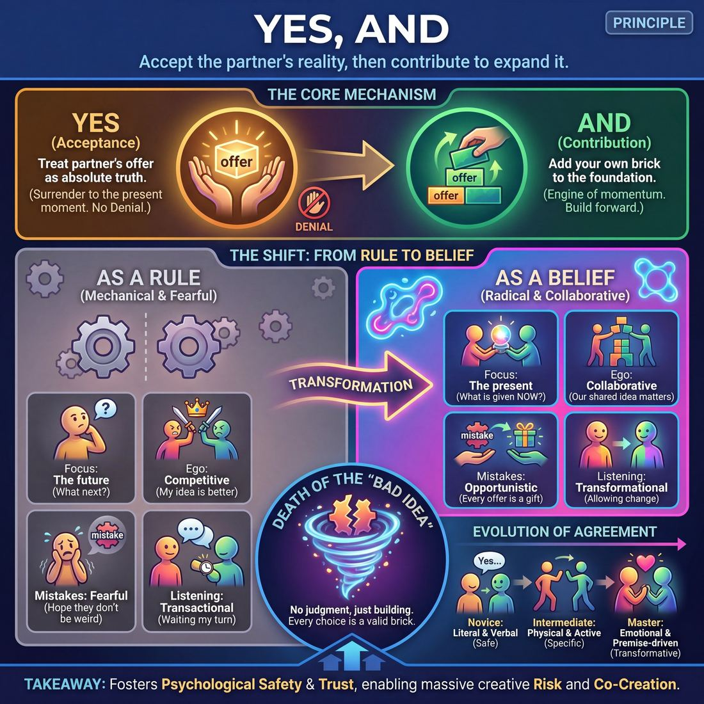

# 💎 Yes, And

> *Accept the offered reality, then add to it.*

{ .infographic }

## 💎 The core belief

At its absolute core, **"Yes, And"** is the foundational axiom of improvisation: the unwavering commitment to accept the reality your partner has established, and then contribute new information to expand it. 

The "Yes" is an act of total surrender to the present moment—agreeing to the facts, emotions, and world-building your partner has just placed on the stage, without negotiation or **denial** (rejecting, ignoring, or rewriting an established truth). The "And" is the engine of momentum. It is the active responsibility to build upon that accepted reality, adding your own specific details, choices, or emotional reactions so the scene moves forward.

More than a mere conversational rule, "Yes, And" is a profound philosophical conviction about collaboration. It demands that improvisers abandon the safety of their pre-planned ideas and instead treat every **offer**—any line of dialogue, physical gesture, or emotional tone—as a perfect gift. By holding this belief, performers shift from a mindset of competition ("my idea is better") to one of co-creation ("our shared reality is paramount"). It is the belief that the most brilliant scenes are not written by a single genius, but are discovered in the space between two people who refuse to drop each other's ideas.

!!! abstract "The Two Halves of the Equation"
    * **Yes (Acceptance):** "I hear what you have created, and I treat it as absolute truth."
    * **And (Contribution):** "I will now add my own brick to the foundation you just laid."

## 🌱 Why it governs everything

When "Yes, And" transitions from a beginner’s rule to a deeply held conviction, a profound behavioral shift occurs on stage. It ceases to be a mechanical obligation—a mere verbal trick to keep a scene moving—and becomes a comprehensive worldview. 

Once a performer truly internalizes this principle, they stop fighting for control of the narrative. The anxiety of needing to be funny, clever, or original evaporates, replaced by a radical receptivity to whatever is happening right now. This shift transforms how an improviser operates across every dimension of a scene:

| Dimension | When it's just a rule... | When it's a core belief... |
| :--- | :--- | :--- |
| **Focus** | The future: *What am I going to say next?* | The present: *What is my partner giving me right now?* |
| **Ego** | Competitive: *My idea is better, how do I steer us there?* | Collaborative: *Our shared idea is the only one that matters.* |
| **Mistakes** | Fearful: *I hope they don't say something weird.* | Opportunistic: *Every unexpected offer is a gift to be justified.* |
| **Listening** | Transactional: *Waiting for a turn to speak.* | Transformational: *Allowing the partner's words to change them.* |

Because this principle demands that you treat your partner's offer as an undeniable reality, it forces the ego to step aside. If you walk on stage planning to play a grumpy pirate, but your partner immediately greets you as a nervous dental hygienist, holding this value means you drop the pirate instantly, without resentment. You accept the dental clinic as the absolute truth.

!!! abstract "The Death of the 'Bad Idea'"
    When you truly hold this value, the concept of a "bad idea" vanishes. You no longer judge your partner's choices as good or bad, logical or absurd. Every offer simply becomes a brick; your only job is to pick it up, accept its shape, and figure out how to lay the next brick on top of it.

This shared belief is the ultimate engine for psychological safety. When both performers know, without a doubt, that their partner will catch their ideas and treat them as valid, the fear of failure disappears. This mutual trust allows improvisers to take massive creative risks, knowing they are operating within a container where denial is off the table. 

!!! example "In a scene"
    **The Rule-Follower:** Hears *"Look at this giant spaceship!"* and thinks, *Okay, I have to agree.* They reply: *"Yes, it is a spaceship, and I am an alien."* (Mechanical, additive, but emotionally disconnected).
    
    **The Principle-Holder:** Hears the same line, registers their partner's wide-eyed awe, completely abandons their own plan to play a baker, and responds: *"Yes, and the tractor beam is already pulling us up. Hold my hand!"* (Total acceptance of the reality and the emotion, instantly building the stakes).

## 👀 How it shows up

Because a principle is an internal conviction, you cannot see it directly. Instead, you observe its behavioral exhaust. When an improviser truly believes that their partner’s reality is the *only* reality, their physical, verbal, and emotional reactions change entirely. 

The way this conviction manifests evolves significantly as an improviser gains experience, moving from clunky, literal agreement to seamless, invisible collaboration.

### The Evolution of Agreement

| Stage | The "Yes" (Acceptance) | The "And" (Contribution) | Observable Behavior |
| :--- | :--- | :--- | :--- |
| **Novice** | **Literal & Verbal** | **Additive & Safe** | Often literally saying the words "Yes, and..." Agreeing to the facts of the scene but keeping emotions neutral. (*"Yes, we are on a boat, and here is a fishing rod."*) |
| **Intermediate** | **Physical & Active** | **Complicating & Specific** | The "Yes" moves into the body. Pantomiming the environment immediately. Adding details that push the scene forward. (*Starts rowing vigorously.* *"The storm is getting worse, Captain!"*) |
| **Master** | **Emotional & Premise-driven** | **Heightening & Transformative** | Accepting the *subtext* and emotional weight of the offer. The "And" raises the stakes or clarifies the game. (*Adopts a seasick, terrified posture.* *"I told you we shouldn't have stolen Poseidon's trident!"*) |

### Key Behavioral Markers

Regardless of experience level, an improviser operating under the conviction of "Yes, And" will consistently display specific, observable habits on stage:

*   **Zero-hesitation responses:** The improviser does not pause to evaluate, judge, or rewrite the offer. They treat whatever was just said or done as an undeniable, unchangeable fact.
*   **Physical commitment:** The "Yes" often happens before the mouth opens. If a partner establishes that the room is freezing, the improviser shivers. If a partner hands them a heavy box, their arms sag under the weight.
*   **Retention of details:** An improviser living this principle remembers and reincorporates their partner's earlier offers. If a partner named a dog "Barnaby" in minute one, the improviser uses that name in minute ten, proving the reality was fully accepted.
*   **Emotional matching (or complementing):** They accept the *feeling* behind the words. If a partner enters with high-status anger, the improviser responds with either matching intensity or complementary low-status fear. 

!!! example "In a scene: The Invisible 'Yes, And'"
    The most masterful applications of this principle rarely use the actual words "yes" or "and." 
    
    **Player A:** *(Tapping their watch, scowling)* "You're late again, Jenkins. My patience is wearing thin."
    
    **Player B:** *(Drops to their knees, weeping)* "It was the goblins, sir! They changed the bus schedule!"
    
    **The breakdown:** Player B's "Yes" is entirely behavioral—they accept the lower-status role (Jenkins), the reality of being late, and the boss's anger by dropping to their knees. Their "And" is the absurd justification (goblins), which instantly heightens the reality of the scene without ever breaking the flow of dialogue.

!!! tip "On stage"
    If you want to check if you are truly "Yes, Anding" your partner, look at your physical spacing and eye contact. Improvisers who are fully accepting their partner's reality tend to physically turn toward them, maintain eye contact, and step into the shared space, rather than retreating to the back wall to think.

## 🧪 Living it in practice

Because "Yes, And" is an unobservable principle, it cannot simply be understood intellectually; it must be trained into the body as a reflex. Living it in practice means deliberately overriding our natural human instincts to negotiate, correct, or control the narrative. 

To internalize this principle, improvisers rely on specific mindsets, targeted drills, and the foundational skills that bring the belief to life.

### Mindsets to Cultivate
Before you step on stage, adopting the right mental posture makes agreement effortless rather than forced:

*   **Dropping your brick:** This classic improv idiom means letting go of the brilliant idea you planned backstage the moment your partner initiates something different. You cannot "Yes" their reality if you are still holding onto your own.
*   **Assuming genius:** Treat every offer—even a stumble, a mispronunciation, or a bizarre choice—as an intentional, brilliant gift. If your partner calls you "Mom" when you thought you were playing a cop, assuming genius means you are now a cop who brought their child to work.

!!! tip "On stage: Buy yourself time"
    Agreement doesn't have to start with words. Physical agreement is a life raft. If you are struggling to find your verbal "And," let your body say "Yes" first. Adopting your partner's posture or interacting with the environment they just built buys your brain crucial seconds to formulate a response.

### Drills to Build the Muscle
Improv classes use repetitive exercises to burn this principle into muscle memory:

*   **The Planning Party:** Players sit in a circle and plan an event (e.g., a disastrous wedding). Every sentence must begin with the literal words, *"Yes, and..."* This forces players to accept the previous addition entirely before adding their own detail.
*   **The "Yes, But" Contrast:** Players plan an event, but must start every sentence with *"Yes, but..."* (e.g., "Yes, but we don't have any money"). Experiencing the immediate friction and deflation of "Yes, But" highlights exactly why "Yes, And" is the necessary alternative.
*   **Word-at-a-Time Story:** Two or more players tell a story by contributing only one word at a time. This strips away all control, forcing players to radically accept the grammatical and narrative reality handed to them in the micro-second before they speak.

### The Skills It Animates
As a high-level principle, "Yes, And" acts as the operating system for several observable, lower-level skills:

| Skill / Technique | How "Yes, And" drives it |
| :--- | :--- |
| **Active Listening** | You cannot accept an offer you didn't hear. "Yes, And" demands listening to understand, rather than listening to reply. |
| **Mirroring** | Adopting your partner's physical posture or emotional tone is a profound, non-verbal "Yes" to their emotional reality. |
| **Heightening** | Taking an established pattern and making it bigger or more important is the ultimate expression of the "And." |

!!! example "In a scene: The principle in action"
    **Player A:** *(Mimes holding a steering wheel, looking panicked)* "The brakes are completely gone!"
    
    **Player B:** *(Does not say "No they aren't," does not say "We aren't in a car.")* 
    *(The Yes)* "I know!" *(The And)* "That's why I told you to aim for the marshmallow factory!"

## ⚖️ Tensions & nuance

While "Yes, And" is the bedrock of improvisation, it is not a suicide pact. Treating it as an absolute, literal mandate in every conceivable situation can lead to flat scenes, steamrolled boundaries, and narrative chaos. 

To master this principle, improvisers must navigate several inherent tensions.

### Actor Agreement vs. Character Agreement
The most crucial nuance of "Yes, And" is understanding *who* is doing the agreeing. The **actor** must always accept the base reality being offered, but the **character** is entirely free to disagree, argue, or refuse within that reality. Conflict is a vital part of storytelling; "Yes, And" does not mean every scene must be a polite, frictionless utopia.

!!! example "In a scene: Actor vs. Character"
    **The Offer:** "Take this sword, we must slay the dragon!"
    
    *   **Actor Denial (Breaking the rule):** "This is a baguette, and we are in a bakery." (Destroys the reality).
    *   **Literal Agreement (Boring):** "Yes, I will take the sword, and I will stab the dragon." (Moves the plot, but lacks character perspective).
    *   **Actor Agreement + Character Disagreement (Nuanced):** "I am a pacifist monk! Put that away before you hurt someone!" (Accepts the sword and the dragon, but adds a rich, conflicting character perspective).

### The Boundary of Safety
"Yes, And" governs the imaginary world, but it is immediately overridden by the physical and emotional safety of the real world. You are never obligated to accept an offer that crosses your personal boundaries, makes you genuinely uncomfortable, or puts you in physical danger. 

!!! warning "Watch out: The Weaponized 'Yes, And'"
    A toxic partner might try to use the rule of agreement to force you into uncomfortable situations (e.g., "You have to kiss me, it's *Yes, And*!"). This is an abuse of the principle. **Mutual safety always supersedes agreement.** You can always drop character, step off stage, or edit a scene that violates your boundaries.

### Expansion vs. Focus
There is a natural tension between "Yes, And" (which expands the world by adding new information) and the need to focus on a specific comedic premise or emotional core. 

| The Tension | How it manifests | The Resolution |
| :--- | :--- | :--- |
| **The Urge to Expand** | Constantly adding brand new elements ("Yes, and here comes a bear! Yes, and now we're in space!"). | **Anchor in the present.** Once the base reality is established, shift your "And" from inventing *new* things to deepening the *current* things. |
| **The Need to Focus** | Trying to play a specific game or pattern, but the partner keeps changing the subject with new "Ands." | **"If This, Then What."** Treat "Yes, And" not as a license to change the topic, but as a commitment to heighten the specific dynamic you've already agreed upon. |

Ultimately, "Yes, And" is a tool for building a shared foundation. Once that foundation is sturdy, the way you "And" must evolve from broad world-building into focused, deliberate choices that serve the scene you are actually in.

## 🚫 Common misunderstandings

Because "Yes, And" is the most famous phrase in improvisation—having escaped the theater to infiltrate corporate boardrooms and pop culture—it is also the most frequently distorted. When improvisers struggle with this principle, it is rarely because they are actively trying to ruin a scene; it is usually because they have internalized a flawed version of the rule.

Here are the most common traps and how to correct them:

| The Misunderstanding | The Correction |
| :--- | :--- |
| **Characters must always agree** | Characters can fight, disagree, and despise each other. "Yes, And" means the **actors** agree on the *base reality* of the scene, not that the characters share the same opinions. |
| **You must say the word "Yes"** | Agreement is a behavior, not a vocabulary word. Starting every line with "Yes, and..." quickly sounds robotic. True agreement is often silent, physical, or implied by your character's reaction. |
| **The "And" must be a new invention** | Adding to the scene doesn't mean inventing a wild new plot twist or introducing a new object. The most powerful "And" is often just an honest, heightened emotional reaction to what was just said. |
| **You must accept boundary violations** | "Yes, And" applies strictly to the *fictional reality*. It never requires you to accept physical danger, harassment, or a violation of your personal boundaries as a performer. You always have the right to protect yourself. |

!!! example "In a scene: Character Disagreement vs. Actor Denial"
    **Player A:** "You burned the Thanksgiving turkey again, Harold!"
    
    **Player B (Actor Denial):** "What turkey? We're eating ham." 
    *(Fails the principle. The actor is rejecting the reality Player A built).*
    
    **Player B (Character Disagreement):** "Well, maybe if you didn't distract me by complaining about your mother, I would have watched the oven!" 
    *(Succeeds. The actor "Yes, Ands" the reality of the burnt turkey, while the character fights back).*

!!! warning "Watch out: The 'Yes, But' Trap"
    The most insidious enemy of "Yes, And" is **"Yes, But."** This happens when a player technically acknowledges the reality, but immediately deflates it, pivots away, or removes the stakes. 
    
    * **Offer:** "Look at this giant diamond I stole!"
    * **Yes, But:** "Yes, but it's obviously fake. Anyway, let's go get lunch."
    
    The player accepted that the diamond existed, but destroyed its value and changed the subject. True agreement requires treating the partner's offer as important and letting it affect you.

## 🔗 Why it matters

When "Yes, And" transitions from a beginner’s rule to a deeply held ensemble conviction, the entire nature of the performance shifts. It ceases to be a group of individuals trying to write a play in real-time, and becomes a single organism discovering a world together. 

Holding this principle deeply changes the performance in three profound ways:

* **Radical psychological safety:** When every improviser on stage trusts that their partners will accept their reality, the fear of failure evaporates. Performers take bolder physical and emotional risks because they know the ensemble will catch them and justify their choices. The stage transforms from a proving ground into a playground.
* **Exponential momentum:** In traditional theater, conflict often drives the scene. In improv, *agreement* drives the scene. When no energy is wasted on denial, blocking, or negotiating reality, the scene moves forward with effortless speed. Every line compounds the reality, turning a blank stage into a rich, lived-in universe in seconds.
* **Audience relaxation:** Audiences are highly empathetic; they feel the tension of the performers. When they sense actors fighting for control or rejecting each other's ideas, they tense up. When they witness absolute, joyful agreement, they relax. They stop worrying about the performers and start enjoying the magic of the unfolding story.

!!! abstract "The Shared Mind"
    The ultimate destination of "Yes, And" is the **shared mind**. This is the pinnacle of ensemble work: a state where the group operates with such deep mutual trust and seamless agreement that it feels as though one brain is moving the scene forward. You are no longer "acting with someone"—you are breathing together.

Ultimately, "Yes, And" is what makes improvisation feel like magic rather than a stressful high-wire act. It is the invisible architecture that allows a group of people to step onto a bare stage, surrender their individual egos, and build a masterpiece out of thin air.

## 📚 References & Further Reading

### Foundational sources
*   **Charna Halpern, Del Close, and Kim "Howard" Johnson, *Truth in Comedy: The Manual of Improvisation* (1994)** — Codified "Yes, And" (often framed here as "Accept and build") as the absolute foundation of Chicago-style long-form improv. The authors emphasize that agreement is the only way to construct a shared reality, famously noting that answering "No" erases a building block, while "Yes, but" stops its growth.
*   **Keith Johnstone, *Impro: Improvisation and the Theatre* (1979)** — While Johnstone uses the terms "Accepting" and "Blocking" rather than "Yes, And," this book provides the definitive psychological breakdown of the concept. He explains why humans naturally deny ideas (to maintain status and safety) and how yielding to a partner's offers makes improvisers appear almost telepathic.
*   **Viola Spolin, *Improvisation for the Theater* (1963)** — The root text of modern improv training. Spolin's theater games are built on the concepts of "agreement" and "yielding" to avoid denial. Her exercises laid the groundwork for the collaborative acceptance that would eventually be branded as "Yes, And."

### Practitioner guides & manuals
*   **Patricia Ryan Madson, *Improv Wisdom: Don't Prepare, Just Show Up* (2005)** — The first maxim of this book is "Say Yes." Madson brilliantly translates the stage rule into a life philosophy, exploring how substituting "Yes, but" with "Yes, and" prevents us from trying to control the future and cures us of the daily habit of blocking others.
*   **Mick Napier, *Improvise: Scene from the Inside Out* (2004)** — Offers a vital, critical nuance to the principle. Napier warns against the mechanical, fearful application of "Yes, And" (where improvisers wait passively for their partner to do the work so they can agree to it) and advocates for taking strong personal action *while* accepting the shared reality.
*   **Kelly Leonard and Tom Yorton, *Yes, And: How Improvisation Reverses "No, But" Thinking and Improves Creativity and Collaboration* (2015)** — Written by executives from The Second City, this book explores how the principle transitions from a comedy tool to a framework for corporate innovation, communication, and ensemble building.

### Lineage & teachers
*   **The Second City** — The legendary Chicago theater and training center that popularized "Yes, And" not just as a scenic rule, but as a comprehensive philosophy for co-creation, eventually exporting it to the business world.
*   **iO (formerly ImprovOlympic)** — The theater founded by Charna Halpern and Del Close, where the principle of radical agreement was pushed to its limits to develop the "group mind" necessary for the Harold and other complex long-form structures.

### Research & theory
*   **Keith Sawyer, *Group Genius: The Creative Power of Collaboration* (2007)** — Sawyer, a creativity researcher and jazz pianist, explicitly identifies the improvisational rule of "Yes, And" as the primary mechanism for achieving "group flow." He argues that peak creative performance emerges between minds through relentless acceptance, rather than within a single isolated genius.
*   **Amy Edmondson, *The Fearless Organization: Creating Psychological Safety in the Workplace for Learning, Innovation, and Growth* (2018)** — While not an improv book, Edmondson's foundational research on psychological safety perfectly explains *why* "Yes, And" works: by removing the fear of interpersonal rejection, denial, or punishment, teams are freed to take massive creative risks.

### Talks, videos & courses
*   **Tina Fey, *Bossypants* (2011)** — Features a widely cited chapter on the "Rules of Improv." Fey breaks down Rule 1 ("Agree") and Rule 2 ("Yes, And"), eloquently explaining how the "And" is an active responsibility to contribute to the shared reality. She uses the classic example of a scene partner pointing a finger like a gun—denying it halts the scene, but accepting it as a "Christmas gun" builds a world.

### Communities & adjacent reading
*   **Carol S. Dweck, *Mindset: The New Psychology of Success* (2006)** — Dweck's concept of the "growth mindset" deeply parallels the "Yes, And" philosophy. Both require abandoning the ego's need to be "right" or "perfect" in favor of radical receptivity to the present moment and treating unexpected offers (or mistakes) as opportunities for development.

## 💬 Quotes & Anecdotes

!!! quote "— Tina Fey, *Bossypants* (2011)"
    The second rule of improvisation is not only to say yes, but YES, AND. You are supposed to agree and then add something of your own.

!!! quote "— Stephen Colbert, *Knox College Commencement Address* (2006)"
    To 'yes-and.' I yes-and, you yes-and, he, she or it yes-ands. And yes-anding means that when you go onstage to improvise a scene with no script, you have no idea what's going to happen, maybe with someone you've never met before. To build a scene, you have to accept. To build anything onstage, you have to accept what the other improviser initiates on stage.

!!! quote "— Del Close & Charna Halpern, *Truth in Comedy* (1994)"
    The 'Yes, & ...' rule simply means that whenever two actors are on stage, they agree with each other to the Nth degree. If one asks the other a question, the other must respond positively, and then provide additional information, no matter how small... Answering 'Yes, but... ' stops any continued growth, while a flat 'No' erases the block that has just been established.

!!! quote "— Keith Johnstone, *Impro: Improvisation and the Theatre* (1979)"
    There are people who prefer to say 'Yes', and there are people who prefer to say 'No'. Those who say 'Yes' are rewarded by the adventures they have, and those who say 'No' are rewarded by the safety they attain. There are far more 'No' sayers around than 'Yes' sayers, but you can train one type to behave like the other.

### Where it comes from
The underlying concept of agreement was championed by early improv pioneers like Viola Spolin (who emphasized listening and accepting reality in her foundational theatre games) and Keith Johnstone (who wrote extensively on the creative rewards of saying "yes" versus "no"). However, the exact phrase "Yes, And" was codified and popularized in Chicago's improv scene, most notably by Del Close and Charna Halpern. They named their production company "Yes And Productions" in the 1980s and formally laid out the "'Yes, &...' rule" in their 1994 manual *Truth in Comedy*.

### A telling example

**The Christmas Gun**
In *Bossypants* (2011), Tina Fey illustrates the difference between denial and "Yes, And" with a simple scenario: "If we're improvising and I say, 'Freeze, I have a gun,' and you say, 'That's not a gun. It's your finger. You're pointing your finger at me,' our improvised scene has ground to a halt. But if I say, 'Freeze, I have a gun!' and you say, 'The gun I gave you for Christmas! You bastard!' then we have started a scene because we have AGREED that my finger is in fact a Christmas gun."

**The Missing Children**
In *Truth in Comedy* (1994), Del Close and Charna Halpern share a famous example of denial from the early days of The Second City. During an improvised scene, Joan Rivers told Del Close that she wanted a divorce. Close, playing the emotionally distraught husband, pleaded, "But honey, what about the children?" Rivers replied, "We don't have any children!" While the line got a huge laugh from the audience, it completely destroyed the reality Close had just offered, leaving him stranded and grinding the scene's collaborative momentum to a halt.

## 🧭 Explore the framework

- 🎭 **Domain:** [The Partner](02_D__the-partner.md)
- 🔁 **Other principles here:** [Consent & Boundaries](02_P1__consent-and-boundaries.md), [Make Your Partner a Genius](02_P3__make-your-partner-a-genius.md), [Assume Competence](02_P4__assume-competence.md)
- 🧠 **Skills of this domain:** [Active Listening](02_S1__active-listening.md), [Status Modulation](02_S2__status-modulation.md), [Single-Partner Empathy & Mirroring](02_S3__single-partner-empathy-and-mirroring.md), [Offer Reception](02_S4__offer-reception.md), [Active Gifting](02_S5__active-gifting.md), [Boundary Navigation](02_S6__boundary-navigation.md)
