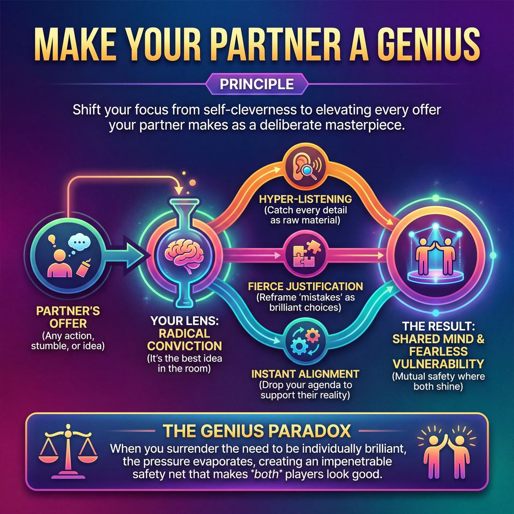

# 💎 Make Your Partner a Genius

> *Treat every offer as the best idea in the room.*

{ .infographic }

## 💎 The core belief

At its heart, **Make Your Partner a Genius** is the radical conviction that whatever your scene partner just said, did, or accidentally stumbled into is the absolute best idea in the room. It is a deliberate shift in focus away from your own cleverness and onto the elevation of their choices. Instead of evaluating an offer to see if it fits your preconceived notion of the scene, you treat their contribution as a flawless, intentional masterpiece that you are lucky to build upon. This principle demands that you view your partner through a lens of absolute reverence, trusting that their instincts are exactly what the moment requires.

When you hold this belief, the pressure to be individually brilliant evaporates. The improviser's job is no longer to invent the perfect joke or drive the narrative forward single-handedly; rather, it is to justify, support, and amplify the reality their partner is creating. If they stumble over a word, it isn't a mistake—it is a deliberate character trait. If they initiate a bizarre premise, it isn't a derailment—it is a profound gift. By committing entirely to making your partner look like a comedic and dramatic mastermind, you forge a **shared mind**, creating a container of mutual safety where both players can operate with fearless vulnerability.

!!! abstract "The Ego Shift"
    Improv is not a competition for the spotlight. When both players are entirely focused on making the *other* person look brilliant, both inevitably shine. You surrender the need to be the genius, and instead become the genius-maker.

## 🌱 Why it governs everything

When a performer truly internalizes the belief that their primary job is to make their partner look brilliant, the entire geometry of improvisation changes. It shifts the performer’s internal spotlight outward, fundamentally altering how they process information on stage. 

Before adopting this principle, an improviser’s mental bandwidth is often consumed by self-preservation: *What should I say next? Is my character funny? Am I doing this right?* Once this value takes root, that anxious internal monologue goes quiet. The burden of invention is lifted, replaced by a singular, outward-facing mission: *What does my partner need right now, and how can I frame their last choice as a masterpiece?*

!!! abstract "The Genius Paradox"
    The great irony of this principle is that by completely abandoning the desire to look like a genius yourself, you become infinitely more relaxed, present, and capable. When two players simultaneously dedicate themselves to making the *other* look good, both are supported by an impenetrable safety net. 

This shift in conviction governs everything else a performer does, triggering several distinct cognitive changes:

*   **Hyper-listening:** You no longer listen just to wait for your turn to speak. You listen like a detective, catching every detail—a slight hesitation, a mispronounced word, a physical twitch—because these are the raw materials you will use to elevate your partner.
*   **Cognitive reframing:** You stop seeing "mistakes." **Justification** is the act of making sense of an offer. When you view your partner as a genius, a contradictory or bizarre statement is assumed to be a deliberate, brilliant choice, and your brain immediately searches for the context that makes it true.
*   **Instant alignment:** You stop fighting for your own preconceived ideas. If your partner initiates a scene about a pirate ship, you immediately drop your idea about a coffee shop and become the best first mate they could ask for.

!!! example "In a scene: The verbal stumble"
    Player A stumbles over their words: "I brought the... the... the *blam-blanket* for the picnic."
    
    An improviser playing defense might ignore the stumble or, worse, make a joke at Player A's expense ("Learn to speak, idiot"). 
    
    An improviser governed by the "Genius" principle sees a gift. Player B leans in: "Oh thank god. The blam-blanket. The only fabric known to repel the radioactive ants of Sector 4. You always think of everything, honey." Player A's stumble is instantly transformed into a brilliant, world-building choice.

Ultimately, this principle governs the craft because it is the antidote to fear. It transforms the stage from a place where you might fail into a place where you are constantly being saved.

## 👀 How it shows up

Because a principle is an internal conviction, you cannot see it directly. But you can absolutely see its exhaust. When an improviser truly believes their partner is a genius, their on-stage behavior shifts entirely from self-preservation to partner-elevation. 

You can spot this conviction in action through several distinct, observable behaviors:

*   **Instant agenda-dropping:** The moment a partner initiates, the improviser visibly abandons whatever clever idea they had waiting in the wings. There is no hesitation or fighting for control.
*   **Fierce justification:** When a partner misspeaks, stumbles, or makes a seemingly contradictory move, the improviser doesn't wince, ignore it, or correct them. They immediately build a reality where that "mistake" makes perfect sense.
*   **Generous framing:** They react to their partner's offers by granting them high status or emotional weight. If a partner mimes a vague, tiny object, they treat it like a ticking time bomb or a priceless diamond. 
*   **Physical focus:** Their body language is open and directed at their partner. They physically yield the stage, stepping back to give their partner the literal spotlight when they are on a roll.

!!! example "In a scene: The physical mismatch"
    **Partner A:** *(Stumbling over their words)* "Here is the... the dog you ordered, sir." *(Mimes handing over a tiny, flat box)*.
    
    **Without the principle:** "That's a hamster, you idiot. And it's flat." *(Gets a cheap laugh, but leaves Partner A looking foolish and defensive).*
    
    **With the principle:** "A purebred teacup poodle! And you've already trained it to hold its breath in this airtight jewelry box? You are the greatest pet smuggler in Prague." *(Takes the physical inconsistency and the verbal stumble, and weaves them into a brilliant character trait).*

While the underlying belief remains the same, the way it manifests on stage evolves as an improviser gains experience and lets go of their own ego.

| Stage | Observable Behavior | The On-Stage Effect |
| :--- | :--- | :--- |
| **Novice** | **Enthusiastic agreement.** They smile, make eye contact, and loudly say "Yes!" to whatever is proposed. They stop blocking. | The partner feels safe and supported, though the scene may still lack direction. |
| **Intermediate** | **Setting up spikes.** They recognize what their partner is good at (or what character they are playing) and deliberately feed them premises that allow them to shine. | The partner looks incredibly funny or clever, often receiving the biggest laughs of the night. |
| **Master** | **Seamless mind-meld.** They anticipate their partner's physical movements, finish their sentences, and elevate mundane, accidental offers into profound thematic games. | The audience assumes the scene was scripted. The boundary between the two performers dissolves into a shared mind. |

!!! tip "On stage: The 'Yes, and...' test"
    If you want to check if you are truly treating your partner like a genius, look at your "And." Are you adding information that makes *your* character look smart, or are you adding information that makes *their* initial offer look like the most important thing in the world?

## 🧪 Living it in practice

A principle remains invisible until it is translated into action. To truly make your partner a genius, you must build reflexes that prioritize their success over your own cleverness. This requires shifting your internal monologue and practicing specific, actionable skills until they become muscle memory.

### The Mindset Shift

Internalising this principle starts with changing the questions you ask yourself on stage. 

| Default Mindset | "Genius" Mindset |
| :--- | :--- |
| "How can I make this scene funny?" | "How can I make my partner's last choice matter?" |
| "I hope they understand my idea." | "I will fully commit to their idea." |
| "They messed up the reality." | "They just gave us a brilliant new game." |
| "What should I say next?" | "What do they need from me right now?" |

### The Skills It Animates

When you hold this principle as your core belief, it naturally powers several foundational improv techniques:

*   **Active Justification:** When a partner contradicts a previously established fact, you do not ignore it, and you *never* correct them. You actively justify it—providing a logical, character-driven reason why their continuity error makes perfect sense in this world. 
*   **Amplification:** If your partner makes a subtle choice—a slight limp, a specific vocal cadence, a fleeting facial expression—you treat it as the most important detail in the scene. You draw attention to it, validate it, and build upon it.
*   **Matching Commitment:** If they initiate with high emotional stakes, you do not leave them hanging by playing the cool, detached observer. You meet their intensity or react in a way that proves their emotional choice was entirely warranted.

!!! example "In a scene: The continuity error"
    **Partner:** "Hand me the wrench, Susan." *(Note: Your character's name was firmly established as Dave two minutes ago).*
    
    **You:** "I told you, Dad, when I'm working under the hood, I go by my mother's name to honor her memory. Now take the wrench."
    
    *The result:* You didn't wince, and you didn't correct them. By justifying the wrong name, you turned their slip-up into a brilliant, deeply specific character detail.

### Drills to Build the Muscle

To move this from a nice idea to an automatic reflex, improvisers use targeted exercises:

1.  **"Yes, Exactly!"** 
    In this two-person scene drill, every response must begin with the phrase, *"Yes, exactly, and..."* This forces you to treat whatever your partner just said as precisely the thing you were hoping they would say, eliminating any urge to pivot or reject their premise.
2.  **Blind Endowments**
    Player A enters the stage performing a repetitive, ambiguous physical action (e.g., waving their arms). Player B must immediately enter and **endow** Player A (give them specific attributes or context) that makes the action look like a stroke of genius. *"Thank god you're here, Maestro, the orchestra was about to mutiny!"*
3.  **The Spotlight Check**
    A side-coaching drill where the director periodically yells "Freeze!" and asks the players: *"Who is the spotlight on right now?"* It trains improvisers to constantly look for opportunities to tilt the focus, status, and glory back onto their partner.

!!! tip "On stage"
    **Look at their eyes, not the future.** The easiest way to stop making your partner a genius is to get trapped in your own head planning your next line. If you are actively studying your partner's face, posture, and tone, you will always have exactly what you need to elevate them.

## ⚖️ Tensions & nuance

While "Make Your Partner a Genius" is a foundational principle, applying it as an absolute law can create friction with other core tenets of improvisation. True mastery lies in knowing how to balance this belief against the other realities of the stage.

Here is where the principle requires a delicate touch:

**1. Justifying vs. Bulldozing**
There is a fine line between framing your partner's offer brilliantly and taking over the scene. If you over-explain their vague offer in an attempt to make it "genius," you might accidentally strip them of their agency. 
* **The tension:** You want to give their idea weight, but you must leave them room to play.
* **The balance:** Frame their offer as important, but let *them* reveal the details. If they hand you an invisible object and say, "I brought the thing," don't bulldoze by saying, "Ah, the quantum destabilizer!" Instead, elevate it by treating it with reverence: "I can't believe you actually found it. Plug it in."

**2. Elevating Them vs. Erasing Yourself**
Making your partner look good does not mean you become a passive, fawning bystander. If you drop your own character's perspective just to accommodate theirs, the scene loses its dynamic engine. 
* **The tension:** Supporting their reality versus holding onto your own deal.
* **The balance:** You make them a genius by how your *specific* character reacts to them. A grumpy boss makes a chaotic employee look like a comedic genius by being deeply, authentically affected by them—not by suddenly agreeing that chaos is good.

!!! example "In a scene: Holding your own deal"
    **Partner:** "I've decided to replace all the office chairs with exercise balls."  
    **Erasing yourself:** "Wow, that's incredibly innovative! You're a visionary." *(Passive and flat).*  
    **Making them a genius (while holding your deal):** "Susan, I am trying to fire you, and you are making it impossible because I am bouncing too high to reach the termination forms." *(You keep your grumpy status, but frame their absurd offer as a powerful, scene-altering move).*

!!! warning "The ultimate override: Player Safety"
    This principle applies strictly to the *creative* reality of the scene, never to the physical or emotional safety of the players. If a scene partner makes an offer that crosses a personal boundary, is physically unsafe, or relies on harmful, bigoted tropes, **you are under no obligation to justify it**. The safety of the human being always overrides the brilliance of the scene. Protect the player first.

## 🚫 Common misunderstandings

Because this principle sounds so inherently altruistic, improvisers often misinterpret it as a directive to be passive, overly accommodating, or aggressively "helpful" in all the wrong ways. 

Here is how the desire to support your partner can accidentally go off the rails, and how to course-correct:

| The Misunderstanding | The Correction |
| :--- | :--- |
| **"I need to step back so they can shine."** | Passive agreement leaves your partner stranded on an island. You make them a genius by giving them strong, specific reactions and rich offers to play with. Being a quiet cheerleader is not support; it is a burden. |
| **"I shouldn't make bold choices, so I don't overshadow them."** | Diminishing yourself does not elevate your partner. Bring your own heat so they have a fire to stand next to. Two geniuses are always better than one. |
| **"I have to pretend to love an idea, even if it makes no sense."** | You do not need fake enthusiasm. You need to **ground** their choice in the reality of the scene. If they do something bizarre, reacting truthfully *in character* (even with fear, awe, or confusion) validates their move far better than a plastic smile. |
| **"I need to 'save' them when they make a mistake."** | "Saving" implies they did something wrong and you are the hero fixing it. **Justifying** proves they did exactly the right thing all along. |

!!! warning "Watch out: The 'Fixer' Complex"
    When a partner misspeaks, contradicts a previous fact, or makes a confusing physical choice, the instinct is often to point it out for a quick laugh. Calling out a mistake—"Why are you holding that steering wheel upside down?"—gets a chuckle from the audience, but it comes at your partner's expense. It signals to the room: *I am smart, and my partner is confused.* That is the exact opposite of making them a genius.

!!! example "In a scene: The logical error (Fixing vs. Justifying)"
    **The Offer:** Your partner points to the family dog and accidentally says, "Look, Grandpa is chewing on a bone."
    
    **Fixing it (Diminishing):** "That's not Grandpa, that's Buster! You forgot your glasses again." *(You get a laugh, but your partner looks foolish.)*
    
    **Justifying it (Genius):** "I know we promised Grandpa we'd reincarnate him, but seeing him fetch that tennis ball is still deeply jarring." *(You took their mistake and turned it into the brilliant, bizarre premise of the entire scene.)*

Ultimately, making your partner a genius is an active, muscular pursuit. It requires you to be fully engaged, highly attentive, and ready to treat every stumble as a deliberate step in a beautiful dance.

## 🔗 Why it matters

When an entire cast deeply holds the conviction to make each other look like geniuses, the fundamental physics of the stage change. The performance shifts from a collection of individuals trying to survive a scene to a true shared mind operating with absolute trust. 

This principle is the bedrock of theatrical improvisation because it fundamentally alters the experience for both the players and the audience.

* **It eradicates the fear of failure:** Stage fright in improv usually stems from the pressure to be inventive alone. When your primary job is no longer to invent the perfect idea, but simply to celebrate and elevate your partner's idea, the pressure vanishes. The stage becomes a container of mutual safety.
* **It unlocks radical boldness:** If you know that any move you make—no matter how clumsy or strange—will be treated by your partner as a deliberate masterpiece, you stop second-guessing. Players take bigger, weirder, and more committed risks because they know there is a net waiting to catch them.
* **It creates infectious joy:** Audiences do not just watch the plot of a scene; they watch the meta-dynamic of the performers. They can instantly sense when players are competing for the spotlight, and they can feel when players are genuinely delighted by each other's brains. Watching human beings support one another unconditionally is inherently captivating and joyful.

!!! abstract "The ultimate paradox"
    Making your partner a genius changes the math of performance from addition to multiplication. You are no longer just adding your good ideas to their good ideas; you are compounding them. When you justify a partner's bizarre choice, the audience doesn't see one genius and one helper—they see a genius scene, played by a genius ensemble.

It is the single fastest way to elevate a group of amateur improvisers into a cohesive, fearless, and professional-feeling ensemble.

## 📚 References & Further Reading

### Foundational sources
*   **Del Close, Charna Halpern, and Kim "Howard" Johnson, *Truth in Comedy: The Manual of Improvisation* (1994)** — The foundational text of long-form improv that codified this exact philosophy. It is the origin of the famous Del Close quote: "If we treat each other as if we are geniuses, poets, and artists, we have a better chance of becoming that on stage." The book explains how dropping the ego and focusing entirely on the ensemble elevates the work of everyone involved.
*   **Patricia Ryan Madson, *Improv Wisdom: Don't Prepare, Just Show Up* (2005)** — Her twelfth maxim, "Take Care of Each Other," explicitly outlines the rule to "Make your partner look good." Madson translates this stage rule into a life philosophy, focusing on sharing control, rescuing struggling partners, and playing with radical kindness.

### Practitioner guides & manuals
*   **Matt Besser, Ian Roberts, and Matt Walsh, *The Upright Citizens Brigade Comedy Improvisation Manual* (2013)** — Focuses heavily on the mechanics of justification. The manual teaches improvisers how to treat a partner's unusual, contradictory, or accidental choices not as mistakes to be corrected, but as brilliant, intentional gifts that must be framed and elevated.
*   **Tina Fey, *Bossypants* (2011)** — In her famous chapter on the "Rules of Improv," Fey explicitly lists "Make your partner look good" as a core tenet. She explains how this principle forces you to stop worrying about your own performance and instead focus on setting up your collaborators for success, applying the stage philosophy directly to leadership and workplace dynamics.
*   **Mick Napier, *Improvise: Scene from the Inside Out* (2004)** — Offers a valuable, advanced counterweight to this principle. Napier argues that while supporting your partner is vital, improvisers often use "making their partner look good" as an excuse to be passive. He advocates that you must also make strong individual choices so you don't become a blank slate your partner has to drag along.

### Lineage & teachers
*   **iO Theater (formerly ImprovOlympic)** — Founded in Chicago by Del Close and Charna Halpern, this theater and training center is the primary lineage for the "treat your partner like a genius" philosophy. Their training explicitly shifts performers away from short-form joke-telling and toward deep, ensemble-supported long-form play where the group mind is paramount.
*   **Stanford Improvisors (SImps)** — Founded by Patricia Ryan Madson in 1991, this collegiate group and its associated curriculum became famous for prioritizing the ethos of making the partner look good. They are often cited as a prime example of how a culture of radical support creates fearless performers.

### Research & theory
*   **R. Keith Sawyer, *Group Genius: The Creative Power of Collaboration* (2007)** — A cognitive psychologist and jazz pianist, Sawyer studies improv ensembles to show how "group flow" and a "shared mind" emerge. His research demonstrates that peak group creativity only happens when players listen deeply and build on each other's ideas rather than planning their own individual contributions.
*   **Amy Edmondson, *The Fearless Organization: Creating Psychological Safety in the Workplace for Learning, Innovation, and Growth* (2018)** — While not strictly about improv, Edmondson's foundational research on psychological safety perfectly explains the "container of mutual safety" required for improvisers. She details how removing the fear of looking foolish or being punished for mistakes is the exact mechanism that allows for high-level interpersonal risk-taking.

### Talks, videos & courses
*   **Amy Edmondson, "Building a psychologically safe workplace" (TEDx Talk, 2014)** — A highly accessible entry point into the concept of psychological safety. Edmondson explores the exact dynamic of interpersonal risk-taking and removing the fear of failure, which is the underlying psychological engine behind making your partner a genius.
*   **Paul Vaillancourt, "What does it mean to make your partner look good?" (Improv Tips Video Series, 2019)** — A practical, nuts-and-bolts breakdown by a veteran improv teacher on what this ubiquitous phrase actually means in practice, focusing on hyper-listening and spinning gold out of whatever your partner says.

## 💬 Quotes & Anecdotes

!!! quote "— Del Close, *Truth in Comedy* (1994)"
    If we treat each other as if we are geniuses, poets and artists, we have a better chance of becoming that on stage.

!!! quote "— Tina Fey, *Bossypants* (2011)"
    Make your partner look good.

!!! quote "— Susan Messing"
    If you're in your head then you're not here with me.

### Where it comes from
The concept of making your partner look good is foundational to modern improvisation, heavily championed by Del Close during his time at iO (ImprovOlympic) in Chicago. Close believed that fear and ego resulted in predictable, inauthentic scenes. By shifting the performer's focus entirely onto elevating their scene partner—treating them as a "genius, poet, and artist"—the pressure of individual invention is removed. Tina Fey later popularized the concept for a mainstream audience in her memoir *Bossypants*, listing "Make your partner look good" as her third rule of improvisation.

### A telling example
**The Ad Team Exercise**
A common illustrative exercise used to train this specific reflex is "Ad Team" (or "The Pitch"). A group of improvisers acts as an advertising agency brainstorming a new product. One person pitches a random, nonsensical feature—for example, "What if the new smartphone is made entirely of cheese?" 

Instead of evaluating the idea, the rest of the team must immediately react as if it is the greatest idea they have ever heard. They cheer, physically celebrate, and instantly build on it: "Yes! And we can sell it in the deli aisle!" "Yes! The tagline is 'A Gouda Connection!'" By forcing the performers to treat every offer as a stroke of genius, the exercise physically trains the "Ego Shift," proving that enthusiastic justification makes any idea work.

**In a scene: Justifying the "Mistake"**
To see this in a generic illustrative scenario, imagine Player A walks on stage and says, "Here are the quarterly reports, Mom," when previous context clearly established they are talking to their corporate boss. 

Player B has a choice. They can block the mistake ("I'm your boss, not your mother, you idiot"), which gets a cheap laugh but leaves Player A looking foolish and defensive. Or, they can treat Player A like a genius who made a deliberate character choice: "I know I'm the CEO, Johnson, but since your actual mother passed, I've been happy to step into the role. Now, eat your vegetables before the board meeting." The "mistake" instantly becomes a brilliant, bizarre relationship dynamic, and both players look like masterminds.

## 🧭 Explore the framework

- 🎭 **Domain:** [The Partner](02_D__the-partner.md)
- 🔁 **Other principles here:** [Consent & Boundaries](02_P1__consent-and-boundaries.md), [Yes, And](02_P2__yes-and.md), [Assume Competence](02_P4__assume-competence.md)
- 🧠 **Skills of this domain:** [Active Listening](02_S1__active-listening.md), [Status Modulation](02_S2__status-modulation.md), [Single-Partner Empathy & Mirroring](02_S3__single-partner-empathy-and-mirroring.md), [Offer Reception](02_S4__offer-reception.md), [Active Gifting](02_S5__active-gifting.md), [Boundary Navigation](02_S6__boundary-navigation.md)
