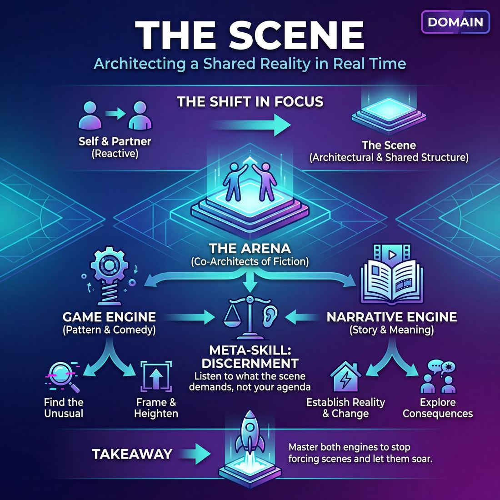

# 🎭 The Scene

> *Architect compelling scenes in real time — using both engines of improv and knowing which one the scene wants.*

{ .infographic }

## 🎭 The arena

In the first two domains of improvisation, your focus is foundational: managing your own instrument (**Self**) and actively listening and reacting to the person in front of you (**Partner**). In the third domain, the lens widens to encompass the construct you are building together: **The Scene**. This arena governs the relationship between the improvisers and the emerging fiction. You are no longer just two people talking in a void; you are co-architects of a shared reality. The scene itself becomes a third entity on stage, possessing its own rules, momentum, and demands.

Operating in this arena requires a vital dual awareness. You must play your character with absolute, grounded commitment while simultaneously hovering above the action with the mind of a writer or director. You are learning to read the matrix of the scene while you are inside it—recognizing the patterns forming, the world being built, and the trajectory of the characters. Here, the improviser's job shifts from simply surviving the moment to intentionally crafting a compelling, cohesive piece of theater in real time.

!!! abstract "The Shift in Focus"
    *   **Domains 1 & 2 (Self & Partner):** "How am I reacting to you?"
    *   **Domain 3 (The Scene):** "What are we building together, and what does it need next?"

## 🧭 The goal

!!! abstract "The Core Objective"
    To **architect compelling scenes in real time** by mastering the two fundamental engines of improv—and developing the wisdom to know which one the scene demands.

In the previous domain, your focus was entirely on connection and truthful reaction. But a great scene is more than just two people having a polite, connected conversation. It requires a container, a trajectory, and a reason for the audience to care. 

In **The Scene** domain, your awareness expands from *who* you are playing with to *what* you are building. You step into the role of an architect, shaping the raw material of your interactions into a recognizable structure. To achieve this, an improviser must learn to drive the scene using two distinct engines:

*   **The Game Engine:** Driving the scene through pattern and comedy. You find the unusual thing, frame it, and heighten it. 
*   **The Narrative Engine:** Driving the scene through story and meaning. You establish a reality, introduce a change, and explore the consequences on the characters.

### Why this goal matters

Many improvisers plateau because they only ever learn to drive one vehicle. If you only know Game, your scenes may be hilarious but lack emotional resonance; your characters become disposable joke-delivery systems. If you only know Narrative, your scenes may be grounded and theatrical, but can easily become slow, heavy, or devoid of comedic momentum.

The ultimate goal of this domain is not just to learn both engines, but to develop the **meta-skill of discernment**. 

!!! tip "Listen to the scene, not your agenda"
    A master improviser doesn't walk on stage deciding, *"I'm going to play a Game scene now."* Instead, they initiate, react, and then ask: *"What is this scene asking to be?"* If a partner initiates with a bizarre, repetitive tick, the scene wants Game. If a partner initiates with a grounded, vulnerable confession, the scene wants Narrative. 

Mastering this goal means you stop forcing scenes into pre-planned boxes. Instead, you recognize the spark in the moment, select the right engine, and build a structure that allows that specific scene to soar.

## 💎 Its principles — the Why

The principles of **The Scene** act as the laws of physics for the universe you are building on stage. They are the foundational agreements that allow two improvisers to step into the void and instantly construct a shared reality that an audience can believe in. 

### Base Reality First
Before you can break reality, you must build it. The **Base Reality** (often called the *Platform*) is the foundational context of the scene: the *Who*, *What*, and *Where*. 

Whether you are playing a pattern-based Game or a character-driven Narrative, the audience needs a grounded baseline. If everything is crazy immediately, nothing is funny or meaningful because there is no contrast. This principle asks the performer to be patient, to establish a recognizable human dynamic, and to lay the bricks of the world before trying to blow it up.

!!! tip "On stage"
    Anchor your Base Reality in a physical activity (object work) or a clear emotional dynamic right out of the gate. If you are folding laundry while talking to your spouse, you have already answered the *What* and the *Who* without needing a line of exposition.

### Start in the Middle
Also known by its literary term, ***In media res***, this principle dictates that scenes should begin at the point of action or consequence, not at the very beginning of an interaction. 

In real life, conversations often start with pleasantries. On stage, pleasantries are a stalling tactic. Starting in the middle asks you to assume a pre-existing relationship and a history with your partner. You are not meeting for the first time; you are in the middle of a lifelong dynamic.

!!! warning "Watch out"
    Avoid the "transactional opening" (e.g., "Hello sir, welcome to my shop, how can I help you?"). It forces the scene to start from zero. Instead, start with the transaction already gone wrong: "I told you, I don't care if you have a receipt, this toaster is full of ham."

### Show, Don't Tell
Improv is a theatrical medium, not a radio broadcast. This principle demands that you embody the reality of the scene rather than narrating it to your partner (and, by extension, the audience). 

If you are angry, don't say "I am so angry right now." Slam a door, lower your voice to a dangerous whisper, or aggressively chop imaginary vegetables. If it is raining, don't say "Wow, look at that rain." Huddle under your coat and wipe water from your eyes. 

!!! example "In a scene"
    **Telling:** "I am terrified of this haunted house we are walking through."  
    **Showing:** Clinging to your partner's sleeve, jumping at a sudden noise, and refusing to step into the center of the stage.

### Serve the Story
Ultimately, the scene is the boss. This principle requires ego death. It asks you to put the needs of the emerging construct above your desire to be funny, clever, or in control. 

Serving the story means recognizing what the scene is asking for and feeding that engine. If you think of a brilliant, hilarious one-liner, but it contradicts the Base Reality or undermines your partner's emotional stakes, you must let it go. 

!!! abstract "Key idea: The Third Entity"
    Think of the scene as a third entity on stage with you and your partner. Your job is not to win the scene, but to listen to what that third entity wants to become, and give it the fuel it needs to get there.

## 🧠 Its skills & techniques — the What & How

Mastering **The Scene** requires a toolkit that moves beyond simply reacting. It demands architectural awareness—the ability to step back while inside the scene and ask, *"What are we building?"* 

The skills in this domain fall into three distinct toolbelts: laying the foundation, driving the comedic pattern, and building the theatrical story.

### 🧱 Foundational Scene-Building
Before a scene can be funny or meaningful, it must be real. These skills establish the reality that the rest of the scene will stand on.

*   **World-Building:** The rapid, collaborative construction of the Base Reality. This is the skill of making the invisible stage concrete through object work, specific references, and established relationships.
*   **Justification:** The structural glue of improvisation. When something unusual or contradictory happens, justification is the skill of answering *why* it makes perfect sense to the characters. It turns mistakes into gifts and absurdity into grounded reality.

!!! tip "On stage"
    **Justify the behavior, not just the fact.** If your partner enters wearing a scuba suit to a funeral, don't just say, "Ah, you came straight from the beach." Justify *why* they felt it was appropriate: "You always promised Dad you'd scatter his ashes at the reef, even if it meant dripping on the mahogany."

### ⚙️ The Game Engine (Comedy from Pattern)
When a scene leans into the Game engine, the goal is to find a comedic pattern and blow it up. 

*   **Game Identification:** The ability to spot the **first unusual thing** in a scene, recognize it as the central joke, and frame it so your partner and the audience know exactly what the game is.
*   **Heightening & Exploration:** Once the game is found, this is the skill of making the pattern more extreme (**Heightening**) or applying the same comedic logic to new contexts (**Exploration**). 

!!! example "In a scene"
    If the game is "a boss who gives aggressively backhanded compliments," **Heightening** is making the compliments more devastating and the delivery more cheerful. **Exploration** is seeing how that same boss speaks to their spouse on the phone, or how they deliver a eulogy.

### 📖 The Narrative Engine (Meaning from Story)
When a scene leans into the Narrative engine, the goal is to create a compelling arc where characters are changed by the events that unfold.

*   **Narrative Architecture:** The structural pacing of a story. This involves building a stable Platform (the normal world), introducing a **Tilt** (the event that disrupts normal life), and navigating the consequences to reach a new normal.
*   **Stakes / The "Want":** The emotional fuel of the scene. This skill involves clearly establishing what a character desires and why today, of all days, it matters that they get it. 
*   **Raising the Stakes:** Making the consequences of failure more dire. If the character doesn't get what they want, what do they lose? 

!!! abstract "Heightening vs. Raising the Stakes"
    These two skills are frequently confused, but they belong to different toolbelts. 
    **Heightening the Game** means the *pattern gets more extreme* (the boss's insults get weirder and more specific). 
    **Raising the Stakes** means the *consequences get more dire* (if the employee doesn't get this promotion, they lose their house). 

### 🧠 The Meta-Skill: Engine Selection
The capstone skill of this domain is real-time awareness. A master improviser listens to the first few lines and decides: *Does this scene want to be a hilarious, escalating pattern, or does it want to be a grounded story about two people changing?* They then seamlessly deploy the right toolbelt for the job.

## 🪧 Engines, distinctions & scoping

At the heart of this domain lies a fundamental choice about what drives the action forward. Modern improvisation recognizes two distinct "engines" that power a scene. While they can occasionally overlap, they operate on entirely different mechanics, philosophies, and historical lineages.

**1. The Game Engine (Comedy from Pattern)**
*   **Lineage:** Del Close, iO, Upright Citizens Brigade (UCB).
*   **The Focus:** Finding the "first unusual thing," framing it, and playing a recognizable pattern.
*   **The Mechanic:** You don't necessarily need a traditional plot; you need a comedic premise. The scene progresses by exploring and heightening the pattern until it reaches its logical, absurd extreme. Characters in a Game scene often lack self-awareness about their unusual behavior.

**2. The Narrative Engine (Meaning from Story)**
*   **Lineage:** Keith Johnstone, Loose Moose Theatre.
*   **The Focus:** Character change, emotional truth, and cause-and-effect.
*   **The Mechanic:** The scene progresses through a story arc. Events have real consequences, characters have clear "wants," and the world—or the relationship—is fundamentally altered by the end of the scene. 

!!! tip "The Meta-Skill: Engine Selection"
    Mastering the Scene domain isn't just about learning how to run both engines—it's about **knowing which engine the scene is asking for**. If a scene starts with a grounded, vulnerable confession, forcing a goofy "Game" onto it will shatter the reality. Conversely, if a scene opens with a bizarre, highly specific comedic premise, trying to force a traditional hero's journey will drag it down. Listen to the first few offers; the scene will tell you what it wants to be.

### The Critical Distinction: Heightening vs. Raising Stakes

A common trap for improvisers is confusing the escalation of a Game with the escalation of a Story. This framework deliberately separates these two concepts, assigning each to its respective engine. 

| Concept | Belongs To | What It Means | Example |
| :--- | :--- | :--- | :--- |
| **Heightening the Game** | The Game Engine | The **pattern** gets more extreme, specific, or absurd. | A character who is slightly frugal starts by reusing a tea bag, then washes paper plates, and finally tries to pay for a car with pocket lint. |
| **Raising the Stakes** | The Narrative Engine | The **consequences** get more dire, personal, or costly. | A character trying to win a local footrace learns that if they lose, their family's farm will be foreclosed upon. |

!!! warning "Watch out: Blurring the lines"
    If you try to "raise the stakes" in a pure Game scene, you often ground the comedy too heavily, making the audience worry for the characters rather than laugh at their absurdity. If you try to "heighten the pattern" in a pure Narrative scene, the characters stop feeling like real people and start feeling like cartoon sketches. Know which engine you are running, and escalate accordingly.

## 📈 The journey across this domain

Growth in **The Scene** domain is the shift from being a participant in a random series of events to becoming a real-time architect. It is the journey of learning to see the structural matrix of the scene while you are still acting inside it. 

Early on, improvisers are just trying to survive the moment. By the end of this journey, they are seamlessly weaving together pattern-based comedy and consequence-driven storytelling, knowing exactly which engine the scene is asking for.

| Stage | **Game Identification** | **Narrative Architecture** | **Stakes / The "Want"** | **Engine Selection** *(meta)* |
|---|---|---|---|---|
| **1 Novice** | Tries to spot the unusual thing but misses it live | Tries to tell a story but it wanders / no change | Plays activities with no reason to care | Doesn't yet know two engines exist |
| **2 Adv. Beginner** | Names the game *after* the scene | Hits Story-Spine beats when prompted | States a "Want" when reminded | Recognizes "this is a game scene" vs. "story scene" in review |
| **3 Competent** | Identifies the game during the scene | Builds Platform then Tilts deliberately | Establishes what's at risk for the character | Chooses an engine consciously at scene start |
| **4 Proficient** | Frames the game with the first unusual line | Story arc and character change feel inevitable | Stakes are felt, not stated; they fuel the scene | Switches engines mid-scene as the scene demands |
| **5 Master** | Finds, plays, *and intentionally breaks* the game | Architects a full arc with consequence and change in real time | Makes the audience genuinely care about absurd people | Reads what the scene needs and serves it invisibly — game *or* story, never forced |

### The Arc of Growth

**1. Surviving the Chaos (Novice & Advanced Beginner)**  
In the beginning, the cognitive load of simply being on stage is overwhelming. A Novice might engage in an activity—like folding laundry—but have no emotional reason to care about it, resulting in a wandering, consequence-free interaction. By the Advanced Beginner stage, hindsight kicks in. The improviser can step off stage and realize, "Ah, the game was my passive-aggressive folding!" or "We forgot to establish what my character actually wanted." They can see the structure, but only in the rearview mirror.

**2. Conscious Architecture (Competent)**  
This is the major turning point. The improviser's awareness catches up to real time. They can spot the unusual thing *while* they are in the scene and begin to heighten it. If they are playing a narrative scene, they deliberately build a solid Platform before introducing a Tilt. 

!!! abstract "The Meta-Skill: Engine Selection"
    At the Competent stage, players realize that **Game** and **Narrative** are distinct tools. They begin to consciously choose their engine: *Are we playing a pattern-based comedy scene right now, or a story-driven scene with real consequences?* They stop trying to force a wacky game into a grounded emotional scene, and vice versa.

**3. Fluid Mastery (Proficient & Master)**  
In the advanced stages, mechanics dissolve into intuition. A Proficient player doesn't just find the game; they frame it clearly with the very first unusual line. They no longer awkwardly state their stakes ("I really need this promotion!"); instead, the stakes are deeply felt in their body language and reactions. 

The Master improviser achieves invisible architecture. They understand the critical distinction between making a pattern more extreme and making consequences more dire, applying the right tool at the right time. They can make an audience genuinely care about utterly absurd characters, serving whatever the scene demands with effortless grace.

!!! tip "On stage: Moving from Competent to Proficient"
    If you find yourself stuck at the Competent stage—identifying the game but feeling your scenes get mechanical—stop thinking about the *rules* and start focusing on the *relationship*. Let the stakes fuel the scene. The audience forgives a messy structure if they believe the characters truly care about each other.

## 🧩 How it connects to the other domains

The Scene sits dead center in the five-domain framework: **Self → Partner → Scene → Ensemble → Audience**. It is the great synthesizer. If the first two domains are about *how to behave* on stage, this domain is about *what you are building*. 

Here is how the Scene acts as the crucial pivot point between the improviser and the room:

*   **⬅️ From the Self (Domain 1):** The Scene demands your point of view and emotional baseline. Without a grounded Self, a scene becomes a hollow structural exercise—a math problem rather than a human interaction. The Self provides the raw material.
*   **⬅️ From the Partner (Domain 2):** The Scene relies entirely on your two-person dynamic. The active listening, agreement, and shared reality forged in the Partner domain act as the mortar for the Scene's architecture. You cannot build a Game or a Narrative if you are not first deeply connected to the person standing across from you.
*   **➡️ To the Ensemble (Domain 4):** The Scene is the fundamental unit of the larger show. The Ensemble watches the Scene from the wings to know how to support it (via walk-ons, tag-outs, or scene painting) and when to edit it. A clearly architected scene gives the Ensemble the thematic and comedic fuel they need to build a cohesive piece.
*   **➡️ To the Audience (Domain 5):** The Scene is your primary interface with the crowd. The Audience doesn't just watch two people talk; they track a story's consequences or a game's escalation. When you master the Scene domain, you give the Audience the gift of clarity—they know exactly what they are watching and why they should care.

!!! abstract "The Pivot Point"
    The Scene is where raw improvisation becomes recognizable theater or comedy. It is the exact moment where "just playing" transforms into "making a thing." 
    
    Because it sits in the middle, it is also your diagnostic tool. If a scene's structure is failing, the fix is almost always found by looking *backward* to the inner domains: stop worrying about the plot, drop your agenda, and just look your partner in the eye.

## 🎓 How to train this domain

Training the Scene domain is like learning to drive a manual transmission. First, you must understand how the individual gears work (the engines of **Game** and **Narrative**), and then you must master the clutch (the meta-skill of knowing when to shift between them). 

Because these two engines require entirely different mindsets, the most effective way to train this domain is to isolate them before combining them.

### 1. Isolate the Engines
Novice improvisers often build "Frankenstein scenes"—mashing up a wacky, absurd pattern with a deeply emotional, grounded character arc, resulting in a scene that achieves neither. To prevent this, train the engines separately.

*   **To train Game (Comedy from Pattern):** Focus relentlessly on pattern recognition. Run scenes where the director yells "Stop!" the moment the **First Unusual Thing** occurs. Have the players explicitly name the game, then resume the scene with the sole goal of heightening that specific pattern. Ban all plot development; if the scene moves forward in time or introduces a new problem, stop and reset.
*   **To train Narrative (Meaning from Story):** Focus on consequence and change. Strip away the pressure to be funny. Practice building a solid Platform (the who, what, and where) and then introducing a deliberate Tilt (the inciting incident). Run exercises where players must state their character's "Want" out loud, ensuring that every subsequent action is driven by that desire.

!!! warning "Watch out: The Frankenstein Scene"
    A common trap for Advanced Beginners is recognizing a scene has a Game, but then trying to resolve it with a Narrative ending (e.g., the absurdly cheap restaurant owner suddenly learns a heartfelt lesson about generosity). Train yourself to let Game scenes end on a heightened comedic peak, and Narrative scenes end on a meaningful resolution.

### 2. Decouple "Weirder" from "Worse"
A critical threshold in this domain is separating the act of heightening a pattern from the act of raising the stakes. 

!!! example "In a scene: Worse vs. Weirder"
    **The Setup:** Two astronauts are repairing a satellite. One drops the wrench.
    
    *   **Raising the Stakes (Narrative):** The wrench floats away, and it was the only tool that could stop the oxygen leak. If they don't fix it in two minutes, they die. *(The situation got worse).*
    *   **Heightening the Game (Game):** The astronaut drops the wrench, then drops the spare wrench, then accidentally tosses the control panel into space. The pattern is "butterfingers in zero gravity." *(The behavior got weirder).*

To train this, run a scene up to a conflict, pause, and ask the players to play out the next minute twice: first by making it *weirder*, then by resetting and making it *worse*.

### 3. Master the "Clutch" (Engine Selection)
Once players are Competent in both engines, they must train the meta-skill of reading the scene's demands in real time. 

*   **The "Call It" Drill:** Two players begin a scene. At the 30-second mark, the coach pauses the action and asks the backline: *"Is this a Game scene or a Narrative scene?"* The backline must vote. Whichever engine wins, the players must instantly adopt that mindset and steer the rest of the scene using *only* the tools of that engine.
*   **Post-Scene Autopsy:** After every practice scene, ask the players: *"What did this scene want to be?"* Moving from Advanced Beginner to Proficient requires moving this realization from *after* the scene to the *middle* of the scene, and eventually to the very first lines.

!!! tip "On stage"
    If you feel lost in the middle of a scene, ask yourself: *"Am I trying to find the joke, or am I trying to find the meaning?"* Pick one, commit to it, and trust your partner to follow your lead.

## 📚 References & Further Reading

### Foundational sources
*   **Matt Besser, Ian Roberts, Matt Walsh, *The Upright Citizens Brigade Comedy Improvisation Manual*, Comedy Council of Nicea (2013)** — The definitive textbook on the "Game Engine." It rigorously defines how to establish a Base Reality (the *Who, What, Where*), identify the "unusual thing," and systematically heighten the comedic pattern without breaking the grounded reality of the scene.
*   **Keith Johnstone, *Impro for Storytellers*, Faber & Faber (1999)** — The essential text for the "Narrative Engine." Johnstone outlines how to build a "Platform" (his term for Base Reality) and how to introduce a "Tilt" that changes the characters' reality, driving the scene through narrative consequences and shifting status rather than comedic games.
*   **Charna Halpern, Del Close, Kim "Howard" Johnson, *Truth in Comedy: The Manual of Improvisation*, Meriwether Publishing (1994)** — The foundational text of the iO (ImprovOlympic) lineage. It emphasizes that the relationship between the characters is the most important part of the scene, and introduces the concept of justification—making the absurd truthful to serve the emerging construct.

### Practitioner guides & manuals
*   **T.J. Jagodowski, David Pasquesi, Pam Victor, *Improvisation at the Speed of Life: The TJ and Dave Book*, Solo Roma (2015)** — A masterclass in treating the scene as a "Third Entity." Jagodowski and Pasquesi advocate for stepping on stage with no preconceived ideas, starting *in media res* (in the middle of a lifelong dynamic), and listening to what the scene wants to be rather than forcing an agenda.
*   **Mick Napier, *Improvise: Scene from the Inside Out*, Heinemann Drama (2004)** — Napier challenges rigid improv rules, focusing instead on how to initiate powerfully. His approach is vital for the "Start in the Middle" principle, teaching improvisers to establish a strong physical and emotional baseline immediately so the scene has immediate momentum.
*   **Will Hines, *How to Be the Greatest Improviser on Earth*, Improv Nonsense Books (2016)** — A highly practical modern guide that bridges the gap between grounded acting and comedic game. Hines provides excellent frameworks for justification, playing the voice of reason, and developing the meta-skill of knowing when a scene needs more reality versus when it needs more absurdity.

### Lineage & teachers
*   **The Upright Citizens Brigade (UCB)** — The primary architects of the Game-driven scene. Their lineage codified the mechanics of pattern recognition, heightening, and the strict adherence to a grounded Base Reality to contrast comedic absurdity.
*   **Loose Moose Theatre Company** — Founded by Keith Johnstone in Calgary, this theater is the birthplace of modern narrative improv. Their tradition focuses on storytelling, theatricality, stagecraft, and the emotional consequences of the scene over quick jokes.
*   **iO Theater (formerly ImprovOlympic)** — Developed by Del Close and Charna Halpern, this lineage bridged the gap between theatrical truth and comedic structure, pioneering the idea that the scene's power comes from the emotional reality of the characters' relationship.

### Research & theory
*   **Clay Drinko, *Theatrical Improvisation, Consciousness, and Cognition*, Palgrave Macmillan (2013)** — A cognitive science perspective on improvisation. Drinko explores the "dual awareness" required in Domain 3: how the improviser's brain simultaneously embodies a character in the moment while utilizing executive function to architect the scene from the outside.
*   **R. Keith Sawyer, *Improvised Dialogues: Emergence and Creativity in Conversation*, Greenwood Publishing (2003)** — An academic analysis of how improvisers co-construct reality. Sawyer uses linguistic and psychological frameworks to explain how a shared reality (the Base Reality) emerges collaboratively, proving that the scene is a distinct, co-authored construct.

### Talks, videos & courses
*   **Alex Karpovsky (Director), *Trust Us, This Is All Made Up* (2009)** — A documentary capturing a live performance by T.J. Jagodowski and David Pasquesi. It is the ultimate visual reference for starting *in media res*, showing rather than telling, and patiently discovering the narrative engine of a scene without rushing to the comedy.
*   **Upright Citizens Brigade, *ASSSSCAT!* (2005)** — The televised/DVD recording of UCB's flagship show. It serves as a masterclass in the Game engine, demonstrating how improvisers establish a Base Reality, find the unusual thing, and relentlessly heighten the pattern.

### Communities & adjacent reading
*   **Robert McKee, *Story: Substance, Structure, Style and the Principles of Screenwriting*, HarperCollins (1997)** — While written for screenwriters, this is an invaluable resource for the Narrative Engine. McKee’s concepts of inciting incidents, progressive complications, and raising the stakes provide improvisers with the architectural tools needed to build scenes that have genuine meaning and trajectory.
*   **Viola Spolin, *Improvisation for the Theater*, Northwestern University Press (1963)** — The mother of modern improv. Her exercises (Theater Games) are the foundation of the "Show, Don't Tell" principle, particularly her rigorous focus on object work, physicalizing the environment, and using space to define the reality of the scene.

## 💬 Quotes & Anecdotes

!!! quote "— Matt Besser, Ian Roberts, and Matt Walsh, *The Upright Citizens Brigade Comedy Improvisation Manual* (2013)"
    The first unusual thing should always stand out in contrast to the base reality. Once the unusual thing is discovered, the improvisers will shift from 'Yes, and' to asking the question 'If this unusual thing is true, then what else is true?'

!!! quote "— Mick Napier, *Improvise: Scene from the Inside Out* (2004)"
    At the top of an improv scene, in the first crucial moments, it is far more important that you do something than what it is you actually do.

!!! quote "— Keith Johnstone, *Impro: Improvisation and the Theatre* (1979)"
    The improviser has to realise that the more obvious he is, the more original he appears.

!!! quote "— Craig Cackowski, *Interview with Pam Victor* (2013)"
    In life, we change our behavior constantly to fit the circumstances we're in. In comedy, a character rigidly sticks to the same behavior despite the circumstances. That's his or her game.

!!! quote "— Dave Pasquesi, *Interview with Pam Victor* (2012)"
    [My goal is] discovery of what is already there, not what I can make it into.

### Where it comes from
The concept of the "Game of the Scene" was heavily popularized by Del Close and Charna Halpern in Chicago (codified in their 1994 book *Truth in Comedy*), but it was the founders of the Upright Citizens Brigade (Matt Besser, Amy Poehler, Ian Roberts, and Matt Walsh) who rigorously structured it. They introduced the specific terminology of establishing a "Base Reality" first, identifying the "First Unusual Thing," and then heightening that pattern. Conversely, the "Narrative" engine's focus on grounded storytelling, status, and obviousness traces its lineage back to Keith Johnstone's work at the Royal Court Theatre and the Loose Moose Theatre in the 1970s.

### A telling example
**Starting in the middle (*In media res*)**  
In *The Upright Citizens Brigade Comedy Improvisation Manual*, the authors illustrate the difference between starting at the beginning of an interaction versus starting in the middle of a dynamic. 

If you want to establish a scene with a balloon, a weak initiation starts with a transaction from zero (e.g., walking up to a balloon vendor and asking to buy one). A strong initiation skips the transaction entirely and starts in the middle of a pre-existing relationship:  

*Player 1: "I'm going to tie the balloon around your wrist so you don't lose it, honey."* 

By skipping the pleasantries and the setup, the improviser instantly establishes the *Who* (parent/child) and the *What* (managing a balloon), leaving the duo immediately free to discover the scene's unusual game or emotional narrative.

## 🧭 Explore the framework

- 💎 **Principles (the Why):** [Show, Don't Tell](03_P1__show-don-t-tell.md), [Base Reality First](03_P2__base-reality-first.md), [Start in the Middle](03_P3__start-in-the-middle.md), [Serve the Story](03_P4__serve-the-story.md)
- 🧠 **Skills (the What & How):** [Game Identification](03_S1__game-identification.md), [Heightening & Exploration](03_S2__heightening-and-exploration.md), [Narrative Architecture](03_S3__narrative-architecture.md), [Stakes / The 'Want'](03_S4__stakes-the-want.md), [World-Building](03_S5__world-building.md), [Justification](03_S6__justification.md), [Raising the Stakes](03_S7__raising-the-stakes.md)
