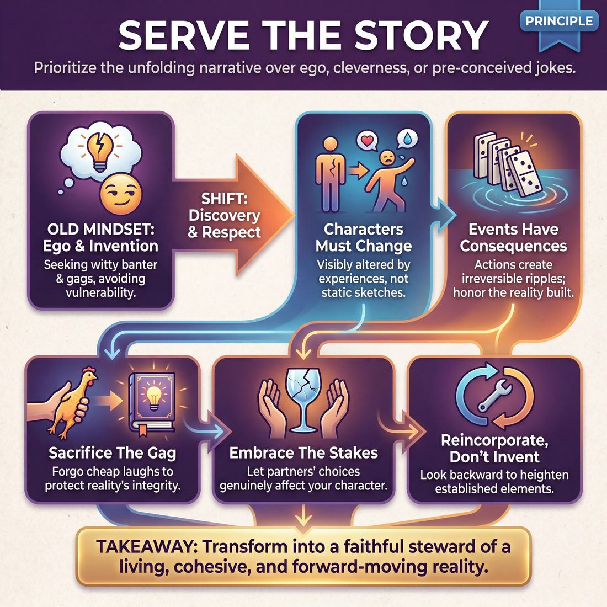

# 💎 Serve the Story

> *Characters must change; events must have consequences.*

{ .infographic }

## 💎 The core belief

At its heart, the principle of **Serving the Story** demands that an improviser’s ultimate loyalty belongs to the unfolding narrative, rather than to their own ego, a clever joke, or a preconceived idea. It is the deep-seated conviction that an improvised scene is not merely a static sketch or a platform for witty banter, but a living, breathing chain of events. When you serve the story, you treat the reality you and your scene partner are building with profound respect. You stop asking, "What would be funny right now?" and instead ask, "What does this reality require next?"

This conviction rests on two non-negotiable pillars: **characters must change**, and **events must have consequences**. If a character experiences a profound loss, a sudden windfall, or a startling revelation, they cannot remain the exact same person they were at the top of the scene—they must be visibly altered by the experience. Similarly, actions cannot happen in a vacuum. If a glass is shattered, there is glass on the floor; if a secret is confessed, the relationship is forever shifted. Serving the story means honoring these ripples, ensuring that every choice builds upon the last to create a cohesive, forward-moving narrative arc.

!!! abstract "The Narrative Mindset"
    Serving the story requires shifting your internal compass from *invention* to *discovery*. You are no longer a writer trying to force a clever plot; you are a human being experiencing the inevitable consequences of the reality you just built.

## 🌱 Why it governs everything

When an improviser truly internalizes this principle, their fundamental orientation on stage shifts from *ego* to *service*. This is a profound behavioral adjustment that requires a kind of performer ego-death. You must be willing to play the grounded, unremarkable straight-man so your partner's eccentric character has a reality to bounce off of. You must be willing to let your high-status, arrogant character be utterly humiliated if that is the natural consequence of their hubris. 

Once this value takes root, your moment-to-moment choices transform entirely:

| The Situation | Before (Ego or Gag-Driven) | After (Serving the Story) |
| :--- | :--- | :--- |
| **A cheap joke presents itself** | Takes the joke, even if it breaks the established reality or undermines the stakes. | Sacrifices the laugh to maintain the integrity and emotional truth of the scene. |
| **A partner makes an accusation** | Defends, deflects, or argues to avoid looking foolish or "losing" the interaction. | Lets the character be affected, hurt, or fundamentally changed by the accusation. |
| **The scene feels stalled** | Panics and invents a random, chaotic twist (e.g., "Look out, a bear!"). | Looks backward at what has already been established and heightens the logical consequences. |
| **An accident happens** | Ignores the mistake or makes a meta-joke about the improviser's error. | Justifies the mistake as a deliberate, consequential action within the narrative. |

!!! example "In a scene"
    Imagine two astronauts are fixing a satellite. One improviser mimes fumbling and accidentally drops the wrench into deep space.
    
    * **Not serving the story:** The partner pulls out a second, identical wrench from their pocket and says, "Good thing I brought a spare!" (This gets a quick chuckle, but kills the tension and protects the characters from consequence).
    * **Serving the story:** The partner watches the wrench float away, turns slowly, and says, "That was our only wrench. We are going to die out here." (This embraces the consequence, raises the stakes, and forces the characters to change).

Ultimately, this principle governs everything because it transforms you into a faithful steward of the reality you and your partner have already built. You let the natural consequences of your actions drive the scene forward, laying the groundwork for a much more sustainable way to improvise.

## 👀 How it shows up

Because a principle is an internal conviction, you can only spot it through the choices an improviser makes under pressure. When a player truly believes in serving the story, their primary filter on stage shifts to finding the truest thing that must happen next.

This conviction manifests in several highly observable behaviors:

*   **Visualizing the impact:** When something happens, it leaves a visible mark. If a character loses their job, they don't brush it off with a witty one-liner; the improviser physically shows the devastation, the relief, or the panic. 
*   **Sacrificing the gag:** The improviser will actively pass up an easy, crowd-pleasing joke if making it would break the reality of the scene or undermine the stakes they have built.
*   **Reincorporation over invention:** Instead of introducing a brand-new element to solve a problem or add energy, the improviser looks backward. They reuse an object, a phrase, or a relationship established in the first minute to resolve the third minute.
*   **Patience with the base reality:** They do not rush to the conflict. They spend time establishing the *who, what, and where* so that when the routine is finally broken, the disruption actually matters to the characters.

!!! example "In a scene"
    **The Setup:** A mechanic tells a customer that their car's engine is completely destroyed and will cost $5,000 to replace.
    
    **Serving the Joke:** The customer says, "Great, I'll just pay you in Monopoly money!" and pulls out colorful paper. The audience laughs, but the reality is broken. The scene resets to zero.
    
    **Serving the Story:** The customer stares at the floor, grips the counter, and says, "I... I sleep in that car. Where do I go tonight?" The audience leans in. The stakes are cemented, and the story propels forward.

As an improviser matures, their method of serving the story evolves from forcing external events to allowing internal change:

| Stage | Observable Behavior | The Improviser's Focus |
| :--- | :--- | :--- |
| **Novice** | **Plot-driving.** They invent dramatic, often random external events to keep things moving. ("Suddenly, a bear attacks!") | *Action.* Trying to figure out what the characters should **do** next. |
| **Intermediate** | **Dot-connecting.** They focus heavily on logical consistency, making sure plot holes are filled and earlier details are brought back. | *Structure.* Trying to make the narrative make **sense**. |
| **Master** | **Emotional tracking.** They do very little. They allow their character to be deeply affected by whatever was just said, letting the plot emerge naturally from the characters' changing relationship. | *Transformation.* Allowing the character to be **changed** by the events. |

You know an improviser is serving the story when you stop watching them as an actor making clever choices, and start watching them as a character living through a consequential moment.

## 🧪 Living it in practice

Internalising this principle requires viewing your role on stage as a real-time writer and director. Living it means actively subordinating your personal impulses to the needs of the emerging fiction.

!!! tip "The Guiding Question"
    To live this principle, replace the question *"What is the funniest or cleverest thing I can do right now?"* with *"What does this story need right now?"* 

### Habits of the Narrative Mindset

Improvisers who serve the story develop specific, actionable habits that keep the narrative engine running smoothly:

*   **Tracking the protagonist:** They quickly identify whose journey the scene is following. If it is not their character, they immediately adopt a supporting function—becoming an ally, an obstacle, or even a piece of the environment.
*   **Treating offers as irreversible:** They treat every offer as an event that *must* affect the world. If a secret is revealed, a heart is broken, or a window is smashed, they do not let the scene reset to neutral. 
*   **Casting for the narrative:** They are entirely willing to play a silent bodyguard, a brief walk-on, or a deeply unlikable villain because they recognize that is exactly what the narrative requires to move forward.

!!! example "In a scene: Casting for the Narrative"
    Player A is delivering a grounded, emotional monologue about their failing family farm. Player B suddenly has a brilliant, hilarious idea for a wacky alien invasion. 
    
    * **Ignoring the story:** Player B enters as a zany alien, shattering the established reality and forcing Player A to abandon their emotional stakes for a cheap laugh.
    * **Serving the story:** Player B shelves the alien idea and enters as the ruthless bank manager holding the mortgage, providing the exact antagonist Player A needs to heighten their existing struggle.

### Skills & Techniques Animated by the Principle

When "Serve the Story" is your core value, your technical toolkit is deployed differently:

*   **Editing:** You **edit** (end a scene) because a narrative beat has been fulfilled or a consequence has landed, not simply because the scene hit a loud punchline or started to feel difficult.
*   **Support Moves:** **Walk-ons** and **cut-aways** are used surgically to provide missing information, raise the stakes, or accelerate time, rather than to rescue a quiet scene with unnecessary chaos.
*   **Raising the Stakes:** You actively look for ways to make the current situation matter *more* to the characters, rather than inventing new, unrelated problems.

### Drills to Build the Muscle

To train your brain to prioritize narrative over novelty, incorporate these exercises into your practice:

| Drill | How it works | What it trains |
| :--- | :--- | :--- |
| **The Story Spine** | Players build a story one line at a time using Kenn Adams' classic prompts (*Once upon a time... Every day... Until one day... Because of that...*). | Internalising the rhythm of narrative structure and the necessity of consequence. |
| **Conducted Story** | A "director" points to a line of players, switching between them mid-sentence. Players must seamlessly continue the exact story the previous player was telling. | Letting go of personal ownership of ideas; listening deeply to maintain continuity. |
| **The Protagonist's Shadow** | Two players do a scene. A third player is instructed to only enter if they can provide exactly what the protagonist needs to face their fear. | Identifying the core narrative drive and providing targeted, ego-less support. |

## ⚖️ Tensions & nuance

"Serve the Story" is a guiding light, but it does not operate in a vacuum. On stage, this principle frequently rubs up against other core improv values. Navigating these competing priorities is what separates competent improvisers from masterful ones. 

Here are the primary tensions you will encounter:

**1. The Narrative Engine vs. The Game Engine**  
Improv relies on two primary engines to drive a scene. The **Narrative** engine asks, *"What happens next and how does it change us?"* The **Game** engine (the comedic pattern or central joke of a scene) asks, *"What is the funny behavior here, and how can we heighten it?"* 

These two engines often compete for the steering wheel. 

| When to lean into Story | When to lean into Game |
| :--- | :--- |
| The scene is grounded, emotional, and the audience is invested in the characters' well-being. | The scene is absurd, fast-paced, and built around a highly specific, unusual behavior. |
| The characters have reached a breaking point and need a resolution or consequence. | The comedic pattern has not yet been fully explored or pushed to its logical extreme. |
| The scene feels stuck in a repetitive loop that is no longer generating laughs. | The audience is roaring at the pattern, and introducing a plot twist would distract them. |

!!! tip "On stage"
    You don't have to choose just one engine forever, but you usually have to choose one *in the moment*. If you are heightening a comedic Game, pause the plot. If you need to advance the Story, let the Game rest for a beat while the characters process what just happened.

**2. The Arc vs. The Immediate Laugh**  
The audience's laughter is intoxicating. When a scene gets quiet, it is incredibly tempting to throw in a cheap joke, break character, or make a meta-commentary to get a quick spike of energy. Serving the story requires the discipline to endure that tension and protect the integrity of the scene's reality. 

!!! example "In a scene"
    Returning to our astronauts, imagine they are now saying a tearful goodbye before a one-way mission. The tension is thick and beautiful.  
    *The Gag:* One astronaut suddenly does a goofy moonwalk to break the tension and get a quick laugh. The reality shatters.  
    *Serving the Story:* The astronaut holds the silence, looks at their partner, and simply says, "Take care of my dog." The audience leans in further.

**3. Action vs. Relationship**  
Improvisers often feel a tension between making things happen (action) and exploring how the characters feel about each other (relationship). When improvisers panic about "serving the story," they tend to invent wild twists, introduce new characters, or force sudden action. But story is not just a sequence of events; it is the emotional journey of the characters. Often, the most profound way to serve the story is to stop adding plot, sit in the relationship, and let the emotional stakes rise naturally.

## 🚫 Common misunderstandings

Because "story" is a loaded word, improvisers often bring their baggage from movies, television, and novels onto the stage. When we misinterpret what a story actually requires in an improvised context, we end up forcing the action rather than serving it. 

Here are the most common ways this principle is misread, and how to correct them:

| The Misunderstanding | The Correction |
| :--- | :--- |
| **"Story means complex plot."**  Players think they need to invent elaborate twists, villains, and external action (the "movie plot" trap). | **Story means character change and consequences.**  You don't need a bank heist or a murder mystery. You just need two people whose relationship shifts because one of them bought the wrong brand of coffee. |
| **"I need to invent the next beat."**  Players feel the pressure to inject new, wild information to keep the narrative moving forward. | **You need to *discover* the next beat.**  Serve the story by looking at what has *already* been established and asking, "If this is true, what naturally happens next?" The answers are in the past, not the future. |
| **"Conflict must happen immediately."**  Players skip the **platform** (the baseline reality of who, what, and where) and jump straight into high-stakes drama or arguing. | **Conflict requires a baseline to disrupt.**  Without a normal routine, a disruption means nothing. Serve the story by being patient enough to establish the peace before you break it. |
| **"Serving the story means driving it."**  A player bulldozes their partner, rejecting offers to force the scene toward an ending they have pre-planned. | **Serving the story often means following.**  Sometimes the story needs you to let go of your brilliant idea, play a silent butler, or simply react emotionally to make your partner's move matter. |

!!! warning "Watch out: The Playwright Trap"
    The most dangerous misunderstanding of "Serve the Story" is believing it is your job to write the script in your head. When you plan three steps ahead, you stop listening to your partner in the present moment. You stop being an improviser and become a playwright. The story must be served *collaboratively*, one discovered moment at a time.

!!! example "In a scene: Gagging vs. Heightening"
    Our astronauts are now having a tense, emotional conversation about running out of oxygen. 
    
    * **Misunderstanding it:** A player enters as a dancing alien to get a huge laugh. This is a **gag**—it shatters the reality, sacrifices the narrative tension for a cheap chuckle, and abandons the story.
    * **Serving it:** A player enters as the ship's AI, calmly and cheerfully announcing that the life support systems will fail in exactly three minutes. This might still get a laugh, but it *heightens* the existing reality and forces the characters to face the consequences of their situation.

## 🔗 Why it matters

When an improviser truly internalizes the mandate to serve the story, the entire nature of their performance shifts. It elevates the art form from a competitive display of quick wits into a collaborative act of creation. Ultimately, this principle is the improviser’s greatest antidote to ego. 

Holding this value deeply creates three profound shifts in the room:

*   **It removes the burden of invention.** You no longer have to stand on stage desperately trying to think of the funniest, cleverest, or most original thing to say. The pressure to be a genius vanishes, replaced by the much easier job of being a faithful servant to the narrative. The answer to "What does this story need?" is often simple, grounded, and obvious. 
*   **It unifies the ensemble.** When a team shares the story as their North Star, scenes stop feeling like a tug-of-war for control. Players happily step into minor, unglamorous roles—a silent bodyguard, a passing waiter, a brief voice on the phone—because they recognize that these small offers are load-bearing pillars for the larger narrative. The ensemble becomes a single organism building one house, rather than a group of architects fighting over the blueprint.
*   **It transforms the audience's experience.** An audience will gladly laugh at a string of clever jokes, but they will *lean in* for a story. When they see that events have real consequences and that characters are genuinely changed by what happens, they stop watching a theatrical magic trick and start investing in the reality of the scene. 

!!! abstract "The ultimate shift"
    Serving the story changes your internal monologue. It replaces the anxious *"How can I save this scene?"* and the ego-driven *"How can I get a laugh here?"* with the grounded, curious *"What is happening, and how can I honor it?"*

Improv that ignores the story in favor of the joke is often forgotten the moment the audience leaves the theater. But when a cast commits to the narrative—allowing their characters to be vulnerable, to be altered, and to face the consequences of their actions—they create the kind of resonant, satisfying theater that audiences remember for years.

## 📚 References & Further Reading

### Foundational sources
*   **Keith Johnstone, *Impro for Storytellers* (1999)** — The definitive text on narrative improvisation. Johnstone focuses heavily on the mechanics of reincorporation, the danger of the "gag" destroying reality, and how to build stories through logical cause and effect rather than chaotic invention.
*   **Viola Spolin, *Improvisation for the Theater* (1963)** — While often associated with short-form games, Spolin's foundational manual is entirely about shifting the actor's focus away from the ego and toward the "point of concentration"—laying the behavioral groundwork for serving the collective story over individual cleverness.

### Practitioner guides & manuals
*   **T.J. Jagodowski, David Pasquesi, and Pam Victor, *Improvisation at the Speed of Life: The TJ and Dave Book* (2015)** — A masterclass in the "discovery over invention" mindset. The authors detail how to treat an improvised scene as a living, breathing reality where characters are deeply and permanently affected by every event.
*   **Kenn Adams, *How to Improvise a Full-Length Play: The Art of Spontaneous Theater* (2007)** — A step-by-step guide to long-form narrative improv. Adams breaks down the mechanics of cause-and-effect storytelling, tracking the protagonist, and ensuring that events have lasting consequences to build a cohesive dramatic arc.
*   **Patti Stiles, *Improvise Freely* (2021)** — A modern re-examination of improv rules by a Johnstone protégé. Stiles focuses on authentic storytelling, strong narrative skill, and supportive collaboration, challenging improvisers to serve the story rather than blindly following rigid, formulaic rules.
*   **Rob Norman, *Improvising Now: A Practical Guide to Modern Improv* (2014)** — Offers practical tools for navigating scene work, emphasizing how to heighten ideas and let the narrative emerge naturally. Norman provides actionable advice on avoiding the mental blocks that lead to forced, unnatural plot twists.

### Lineage & teachers
*   **Keith Johnstone & The Loose Moose Theatre Company** — The Calgary-based birthplace of narrative-focused improv formats. Their philosophy centers on storytelling, status, and making your partner look good, actively discouraging improvisers from breaking the reality for a cheap laugh.
*   **TJ & Dave (T.J. Jagodowski and David Pasquesi)** — The legendary Chicago duo whose patient, character-driven approach proves that a compelling story emerges entirely from the emotional truth of a relationship. They embody the "master" stage of emotional tracking.
*   **BATS Improv** — *(unverified)* A San Francisco-based theater and school heavily influenced by Johnstone's teachings, widely regarded as a major hub for narrative and genre-based long-form improvisation.

### Research & theory
*   **Rafael Pérez y Pérez et al., *MEXICA-impro: A Computer Model of Narrative Improvisation* (2007)** — An AI and cognitive science paper demonstrating that successful collaborative storytelling requires agents to establish a "common ground" and rely on shared mental models to logically advance a plot, mirroring the human narrative mindset.
*   **R. Keith Sawyer, *Collaborative Emergence in Children's Play and Improvisational Theater* (1997)** — *(unverified)* Psychological research demonstrating how well-formed narratives emerge not from a single author's preconceived plan, but from the moment-to-moment acceptance of shared scripts and the logical progression of consequences.
*   **Cognitive Psychology of Narrative Improvisation** — Academic studies into autobiographical and musical improvisation (e.g., the Narrative Improvisation Method) showing that creating narratives is a highly cognitive process of meaning-making, where the performer must connect emotional memory to present action.

### Talks, videos & courses
*   **Alex Karpovsky (Director) / TJ & Dave, *Trust Us, This Is All Made Up* (2009)** — A documentary following TJ Jagodowski and David Pasquesi that perfectly captures the "serving the story" mindset. It shows how two masters build a cohesive, consequential narrative by simply reacting truthfully to each other without planning.
*   **Keith Johnstone Masterclasses** — Various recorded workshops where Johnstone famously coaches students to "be more boring." By removing the pressure to be funny or clever, he forces improvisers to abandon ego-driven gags in favor of obvious, logical narrative consequences.

### Communities & adjacent reading
*   **Sanford Meisner, *Sanford Meisner on Acting* (1987)** — The foundational text on the Meisner Technique, which is based on "living truthfully under imaginary circumstances." This is the exact acting mechanism required to let a story unfold naturally, ensuring characters are genuinely changed by events.
*   **Applied Improvisation Network (AIN)** — A global community that takes the principles of serving the story, active listening, and collaborative emergence off the stage, applying them to organizational leadership, therapy, and education.

## 💬 Quotes & Anecdotes

!!! quote "— Keith Johnstone, *Impro: Improvisation and the Theatre* (1979)"
    The improviser has to be like a man walking backwards. He sees where he has been, but he pays no attention to the future. His story can take him anywhere, but he must still 'balance' it, and give it shape, by remembering incidents that have been shelved and reincorporating them.

!!! quote "— Keith Johnstone, *Impro for Storytellers* (1999)"
    If you think of an idea that seems clever, say or do something else.

!!! quote "— Charna Halpern, Del Close, and Kim 'Howard' Johnson, *Truth in Comedy* (1994)"
    Honest discovery, observation, and reaction is better than contrived invention.

!!! quote "— TJ Jagodowski, *Trust Us, This Is All Made Up* (2009)"
    There is nothing worked out about it beforehand. We don't know anything, until we look at each other [on stage], and then we start to know everything.

### Where it comes from

The ethos of "serving the story" (or "serving the scene") represents a historical shift from the punchline-driven sketch comedy of the mid-20th century to the grounded, theatrical long-form improv of today. Keith Johnstone formalized the mechanics of spontaneous narrative in *Impro* (1979), coining the term "reincorporation" to explain how improvisers create satisfying stories by looking backward at what has already been established rather than constantly inventing new, random ideas. Concurrently in Chicago, Del Close and Charna Halpern championed the idea that "truth is funny," demanding that improvisers abandon their egos, drop the jokes, and let the humor emerge naturally from the grounded consequences of the characters' realities. 

### A telling example

**The "Bore the Audience" Exercise (A Documented Teaching Story)**  
In his workshops, Keith Johnstone would frequently use a simple exercise to prove that an improviser's desire to be "clever" actually damages the scene. He would ask an actor to perform a short scene, and then pull them aside to give a secret piece of direction for the second take: *"Do everything you did the first time. Don't change anything... But bore the audience a little. Don't put them to sleep — bore them just a little bit."* 

Freed from the ego-driven pressure to entertain, the actor would stop forcing jokes, stop rushing the plot, and simply exist in the reality of the scene. When Johnstone would subsequently ask the audience if the actor had been instructed to be *more* interesting or *less* interesting, the audience would almost unanimously guess "more interesting." By actively trying not to be clever, the improviser became a grounded human being, allowing the audience to invest in the story.

**Illustrative Scenario: The Broken Vase**  
* **Ego-Driven:** Player A drops a mimed vase. Player B immediately quips, "Good thing I bought the unbreakable plastic model!" The audience chuckles at the quick wit, but the reality is erased. Nothing has changed, and the improvisers must invent a brand new premise to keep the scene going.
* **Serving the Story:** Player A drops a mimed vase. Player B gasps, falls to their knees, and begins carefully sweeping up the invisible shards, whispering, "That contained my grandmother's ashes." The joke is sacrificed, but a profound consequence is established. The characters are forever changed, and the narrative engine is instantly ignited.

## 🧭 Explore the framework

- 🎭 **Domain:** [The Scene](03_D__the-scene.md)
- 🔁 **Other principles here:** [Show, Don't Tell](03_P1__show-don-t-tell.md), [Base Reality First](03_P2__base-reality-first.md), [Start in the Middle](03_P3__start-in-the-middle.md)
- 🧠 **Skills of this domain:** [Game Identification](03_S1__game-identification.md), [Heightening & Exploration](03_S2__heightening-and-exploration.md), [Narrative Architecture](03_S3__narrative-architecture.md), [Stakes / The 'Want'](03_S4__stakes-the-want.md), [World-Building](03_S5__world-building.md), [Justification](03_S6__justification.md), [Raising the Stakes](03_S7__raising-the-stakes.md)
