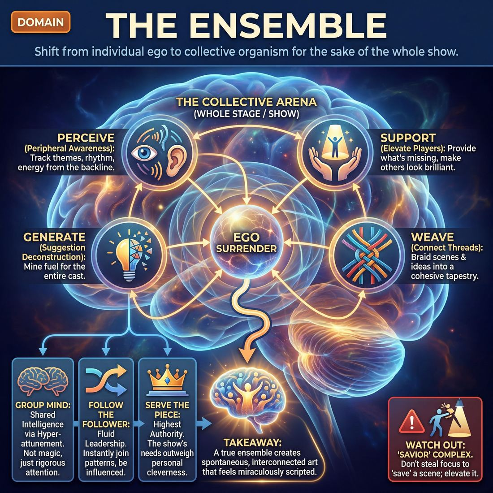

# 🎭 The Ensemble

> *Surrender ego to the piece; perceive, support, generate, and weave — without pre-planning.*

{ .infographic }

## 🎭 The arena

In the first three domains (Self, Partner, Scene), an improviser’s attention is highly localized—focused on their own internal reactions, the person standing right in front of them, and the immediate reality they are building together. The **Ensemble** domain radically expands this aperture. Here, the arena is the entire stage, the collective cast of performers, and the overarching piece you are creating together. 

This domain governs the relationship between the individual ego and the collective organism of the team. You are no longer just a character in an isolated scene; you are simultaneously a co-author, a stagehand, an editor, and a supporting player.

!!! abstract "The Core Shift"
    Moving into the Ensemble domain means shifting your primary allegiance from "my performance" or "our scene" to **"the show."** 

The relationship at the heart of the Ensemble is one of profound service and surrender. It asks the improviser to let go of personal ownership—the desire to be the star, to "save" a floundering scene, or to force a clever pre-planned idea—and instead ask, *"What does the piece need right now?"* Whether that means stepping forward to initiate a bold group game, providing silent physical support from the backline, or simply staying out of the way, the Ensemble arena is where individual threads are woven into a cohesive tapestry. It is the space where a group of individuals transforms into a single, breathing entity capable of generating complex, interconnected art without a script.

## 🧭 The goal

!!! abstract "The Core Objective"
    To **surrender ego to the piece**; to perceive, support, generate, and weave — without pre-planning.

The ultimate goal here is to shift your internal monologue from *"What funny thing can I do next?"* to *"What does this show need right now?"* To achieve this, an improviser must master four simultaneous modes of operation:

*   **Perceive:** You must watch the show as intently as the audience does. By activating your **Peripheral Awareness**, you track recurring themes, returning characters, and the overall rhythm and energy of the room from the backline.
*   **Support:** You execute **Support Work** to make others look brilliant. You enter a scene to provide exactly what it lacks—a physical object, a framing device, a crowd reaction—and then you exit. 
*   **Generate:** You learn to mine a single audience suggestion for its richest, most playable angles (**Suggestion Deconstruction**), providing the raw fuel for the entire cast to use.
*   **Weave:** You braid disparate scenes, characters, and ideas together as the show progresses, creating a cohesive piece of theater. 

Crucially, all of this must happen **without pre-planning**. A true ensemble discovers the pattern of the show in real-time, together. They do not dictate where the piece is going; they follow where it is naturally leading them.

Why does this matter? Because a stage full of brilliant, individual improvisers fighting for the spotlight will usually produce a chaotic, exhausting show. But a true ensemble—operating with a shared mind and a surrendered ego—can create a spontaneous piece of theater that feels miraculously scripted. 

!!! warning "Watch out: The 'Savior' Complex"
    A common trap in this domain is confusing *support* with *saving*. Entering a quiet or struggling scene just to drop a loud, funny one-liner and grab a laugh serves your ego, not the piece. True ensemble support elevates the players already on stage; it doesn't steal their focus.

## 💎 Its principles — the Why

The principles of the Ensemble domain demand a radical shift in perspective. To succeed here, the improviser must dismantle their individual ego and adopt a collective mindset. The following three principles form the philosophical bedrock of ensemble play.

### Group Mind
Often spoken of in mystical terms, **Group Mind** is not telepathy; it is the highly practical result of hyper-attunement, shared vocabulary, and absolute trust. It occurs when a team stops operating as a collection of individuals and begins reacting as a single, unified intelligence. 

* **What it asks of you:** Stop trying to invent the "best" or "funniest" idea on your own. You must trust that the collective output of the ensemble will always be richer and more surprising than anything you could pre-plan in your head. It requires you to stay entirely present, tracking every offer made on stage, even when you are standing on the back wall.

!!! note "Not magic, just attention"
    When an entire team steps forward at the exact same millisecond to edit a scene, the audience gasps because it looks like magic. In reality, it is the result of rigorous, unbroken attention. Everyone was breathing the same rhythm and watching the same focal point.

### Follow the Follower
In most areas of life, leadership is binary: someone leads, and others follow. In improvisation, leadership is entirely fluid. **Follow the Follower** means that the moment a player makes a move, the rest of the ensemble immediately treats that move as the master plan—until someone else makes a move, at which point *they* are followed. 

* **What it asks of you:** Relinquish the wheel. When a pattern emerges, your job is to join it instantly, without hesitation, critique, or a desire to steer it back to your own idea. You must be willing to be influenced and altered by your teammates in real-time.

!!! example "In a scene"
    Player A steps forward and begins rhythmically chopping invisible wood. Player B steps up and begins chopping in the exact same rhythm. Player C steps up, but accidentally chops on the *off-beat*. Instead of correcting Player C, Players A and B immediately adjust their rhythm to match C's syncopation. C followed A, and then A followed C. The pattern evolves seamlessly.

### Serve the Piece
This is the ultimate directive of the ensemble. The show itself—the format, the theme, the overarching narrative—is the highest authority in the room. **Serve the Piece** means prioritizing the health and needs of the whole over the desires of any single performer. 

* **What it asks of you:** You must constantly ask yourself, *"What does this show need right now?"* rather than *"What do I want to do?"* If the show has been chaotic and loud, serving the piece might mean initiating a quiet, grounded scene. If a scene is already perfect, serving the piece means staying offstage and letting it breathe. 

!!! tip "On stage"
    Serving the piece often requires the ultimate surrender of ego: doing absolutely nothing. Sometimes, the most powerful contribution you can make to a brilliant scene is to stand perfectly still in the shadows and simply bear witness to your teammates' great work.

## 🧠 Its skills & techniques — the What & How

To master the Ensemble domain, an improviser must expand their focus from the micro (the immediate scene) to the macro (the entire show). The craft at this layer shifts away from individual character work and toward collective architecture. It can be grouped into four distinct areas:

### 📡 1. Sensing the Whole (Input)
Before you can support a show, you must be able to see it. 
* **Peripheral Awareness:** This is the foundational skill of the ensemble. It is the ability to track the entire stage—who is where, what narrative threads are active, and the overarching energy of the room—while simultaneously playing your own part. It is the team's collective radar. 

### 🏗️ 2. Elevating the Scene (Output)
If Peripheral Awareness is the input, **Support Work** is the output. This is the skill of contributing to a scene when you are not the primary focus, surrendering your ego to give the piece exactly what it needs. The techniques used to execute this skill include:
* **Walk-ons:** Entering a scene briefly to provide a missing element—a waiter dropping off a check, a dog barking at a window, a passing comment—and immediately exiting.
* **Tap-ins (or Tag-outs):** Physically tapping a player on the shoulder to replace them. This freezes the scene and pivots the remaining character into a new time, place, or perspective, often to heighten a specific comedic pattern.
* **Environmental Support:** Becoming the physical world (a door, a ticking clock, a tree in the wind) to ground the primary players and paint the stage picture.

!!! tip "On stage: The Ninja Rule"
    Good support work is invisible. Enter with purpose, deliver the exact gift the scene requires, and exit before the audience registers you as a main character. Never enter from the backline just because you want a turn to speak.

### ⏱️ 3. Managing the Flow (Structure)
A great ensemble breathes together. **Pacing & Rhythm** is the skill of managing the show's musicality—knowing when to accelerate, when to sit in silence, and when a scene has reached its natural conclusion.
* **The Edit:** The technique of decisively ending a scene. The most common method is the **Sweep**, where a backline player runs across the downstage area, acting as a cinematic wipe to signal a hard cut to a new scene.
* **Transitions:** Using split-stages, cross-fades, or physical movement to move fluidly between worlds without dropping the show's momentum.

!!! warning "Watch out: The 'Polite' Edit"
    Novices often let scenes run long because they don't want to interrupt their teammates. Proficient ensembles edit *aggressively* at the peak of a scene's energy. An edit is an act of love, saving a scene from slowly deflating.

### 🕸️ 4. Generating and Weaving (The Macro)
The final tier of ensemble craft involves turning raw, disparate scenes into a cohesive piece of theater.
* **Suggestion Deconstruction (A-to-C):** The skill of mining an audience suggestion. Instead of playing the literal suggestion ("A"), the ensemble brainstorms an association ("B") to arrive at a rich, non-obvious, and highly playable premise ("C"). 
* **Thematic Synthesis:** The ability to recognize the underlying themes, philosophies, or emotional arguments emerging across different scenes, and deliberately weaving them together as the show progresses.
* **Format Literacy:** Understanding the specific structural rules of the piece you are performing (e.g., a Harold, an Armando, a Slacker). A master ensemble uses the format as a scaffold to support their play, rather than a cage that restricts it.

!!! example "In a scene: A-to-C Thinking"
    If the audience suggestion is **"Pineapple" (A)**, a novice team might immediately start a scene in a grocery store. A proficient ensemble will deconstruct it: Pineapple makes them think of **"Spiky on the outside, sweet on the inside" (B)**. This leads to a scene about **a tough, leather-clad biker gang tenderly nursing a stray kitten back to health (C)**.

## 🪧 Engines, distinctions & scoping

The Ensemble domain encompasses the **backline** (the players waiting off-focus), the overarching themes, and the structural container of the format itself. To navigate this ecosystem effectively, the framework draws several critical distinctions.

!!! abstract "The Input / Output / Execution Distinction"
    A common trap for improvisers is treating "support" as a single, muddy concept. The framework explicitly separates how an ensemble functions into three distinct layers:
    
    *   **Input (Perception):** *Peripheral Awareness* is the skill of taking information in. It is the ability to track active threads, notice when the stage is crowded, and sense the rhythm of the show while remaining on the backline.
    *   **Output (Contribution):** *Support Work* is the skill of deciding *what* to give back. It is the strategic choice to provide exactly what is missing—a sound effect, a physical object, or a contrasting energy—without stealing focus.
    *   **Execution (Mechanics):** *Walk-ons*, *Tap-ins*, and *Sweeps* are the specific techniques used to physically execute that support work. 

### The Scene vs. The Piece
In the Scene domain, success is defined by a compelling, truthful reality between partners. In the Ensemble domain, success is defined by how that scene serves the larger organism. 

A brilliant, hilarious ten-minute scene that completely drains the show's momentum is a Scene-level success but an Ensemble-level failure. The Ensemble domain requires scoping your awareness to the pacing and rhythm of the whole piece. You are no longer just playing a character; you are playing the format.

### The Engine: Ego Surrender
The primary engine driving the Ensemble domain is the shift from individual invention to collective synthesis. In earlier domains, the engine is often driven by the question, *"What can I do to make this good?"* In the Ensemble domain, the engine is driven by the question, *"What does the piece need right now?"* 

!!! tip "On stage: Be the missing puzzle piece"
    If the show has been entirely fast, loud, and chaotic, the ensemble doesn't need another loud character. The piece needs silence, slowness, and grounded reality. The strongest ensemble players are those who identify the missing frequency and provide it, even if it means playing a silent tree in the background.

### Scoping the "Group Mind"
While Group Mind is a core philosophical principle, it is also scoped in this framework as a highly practical, observable phenomenon. It is the direct result of a cast applying Peripheral Awareness simultaneously. When every player is tracking the same themes, callbacks, and rhythms, the ensemble begins to move as a single organism, capable of deconstructing a suggestion and weaving a cohesive show without a single moment of pre-planning.

## 📈 The journey across this domain

Mastering the Ensemble domain is the ultimate exercise in ego death. It is the transition from asking, "What am I doing?" to asking, "What does the piece need?" 

Early in an improviser's journey, the sheer cognitive load of surviving a scene leaves little bandwidth to pay attention to the rest of the team. As fundamental skills become second nature, awareness expands outward. The improviser learns to track the whole stage, then the whole show, and finally, the collective mind of the group.

| Stage | **Peripheral Awareness** | **Support Work** | **Suggestion Deconstruction** | **Pacing & Rhythm** |
|---|---|---|---|---|
| **1 Novice** | Tries to track the stage but tunnel-visions on own scene | Wants to help but enters to grab focus / steal | Plays the first, most obvious association | Tries to edit but lets scenes run long, misses the exit |
| **2 Adv. Beginner** | Notices when the stage is crowded | Executes a clean walk-on/tap-in on instruction | Generates several associations in a brainstorm | Performs a Sweep/Tag-Out on cue |
| **3 Competent** | Tracks all active threads | Chooses to enter only when a scene needs something | Selects the non-obvious ("C") premise | Edits *at the right moment* |
| **4 Proficient** | Anticipates where teammates will go | Supports invisibly; gives exactly what's missing then exits | Mines a suggestion for its richest, most playable angle | Pacing breathes — energy, silence, ending |
| **5 Master** | Sees the entire show as one organism | Off-focus support elevates others; ego fully surrendered | Turns any word into a premise the whole team can run | Edits the audience never consciously notices — arrives on the exact peak |

### The Arc of Growth

**1. The Overwhelmed Individual (Novice)**  
At the beginning, the ensemble is just a collection of individuals waiting for their turn. A novice tunnel-visions on their own scene because tracking anything else is too overwhelming. When they do attempt Support Work, it is often clumsy or self-serving—entering a scene to deliver a funny line rather than to elevate the existing dynamic. They play the most obvious, literal interpretation of a suggestion and frequently miss the natural ending of a scene, letting it drag on.

!!! warning "The 'Helpful' Hijacker"
    Novices often confuse support with saving. They see a scene struggling and enter with a loud, wacky character to "fix" it. This isn't support; it's a hijacking. True support is about giving the scene what it lacks, not taking it over.

**2. The Mechanical Teammate (Advanced Beginner to Competent)**  
As awareness widens, the improviser begins to notice the stage picture. They realize when a scene is too crowded or when a teammate has been left hanging. They learn the mechanics of support—how to execute a clean Walk-on or Sweep edit—but initially do so mechanically or on cue. 

By the *Competent* stage, a crucial shift occurs: **restraint**. The improviser tracks all active threads and realizes that *not* entering is often the best choice. They enter only when a scene specifically needs something (a prop, a straight man, a piece of information). Their edits become sharp, and they learn to pull non-obvious, highly playable premises from a single suggestion.

**3. The Single Organism (Proficient to Master)**  
At the highest levels, the ensemble achieves true Group Mind. The improviser's Peripheral Awareness is so tuned that they anticipate their teammates' moves before they happen. 

Support becomes entirely invisible. A master improviser will step on stage to be a coat rack, provide a sound effect, or deliver a single line of exposition, and then vanish without pulling focus. The pacing of the show begins to breathe naturally, balancing high energy with profound silence. Edits arrive on the exact emotional or comedic peak, feeling so inevitable that the audience never consciously notices the transition. The ego is fully surrendered to the piece.

!!! abstract "The Core Shift: Ego to Organism"
    The journey through this domain is marked by a decreasing reliance on the self. You stop trying to be the star of the scene and start trying to be the perfect, frictionless puzzle piece for the show.

## 🧩 How it connects to the other domains

The Ensemble is the fourth concentric circle of the improviser’s awareness. If the **Scene** is the room you are currently playing in, the **Ensemble** is the architecture of the entire house. It sits at the critical pivot point between the improvisers on stage and the people watching them in the dark.

Here is how the Ensemble domain interacts with the rest of the framework:

*   **Rests on the Self:** To serve the group, the individual must be grounded. You cannot execute invisible support work or surrender your ego to the piece if your **Self** is anxious, defensive, or desperate for the spotlight. 
*   **Scales the Partner:** The mystical idea of "group mind" is simply **Partner** skills—listening, yielding, and eye contact—multiplied. The ensemble demands that you treat the entire cast, and the format itself, as your scene partner.
*   **Protects the Scene:** The ensemble exists to elevate the **Scene**. Through skills like Peripheral Awareness and Support Work, the group provides the exact walk-on, soundscape, or edit a scene needs to thrive. Without strong individual scenes, the ensemble has nothing to weave together; without the ensemble, great scenes die on the vine from lack of editing or support.
*   **Feeds the Audience:** A unified ensemble is the greatest gift you can give an **Audience**. When a crowd senses that a team has each other’s backs—that edits are sharp, support is selfless, and the pacing breathes—they unconsciously relax. They stop worrying about the performers and start enjoying the theater.

!!! abstract "The Bridge to the Crowd"
    While the first three domains (Self, Partner, Scene) are largely about *creation*, the Ensemble domain is about *composition*. It is the layer where a collection of random scenes is woven into a unified show, preparing the work to be handed over to the final domain: the Audience.

## 🎓 How to train this domain

Training the ensemble is fundamentally different from training individual skills. You are no longer coaching individual actors; you are calibrating a single organism. The goal is to build trust so absolute that Group Mind becomes a reliable baseline rather than a happy accident. 

To develop this domain, rehearsals must shift focus away from "who has the best ideas" and toward "how well do we serve the piece."

### 1. Expanding Peripheral Awareness
Before an ensemble can support a scene, they must be able to see it. Training Peripheral Awareness means breaking the habit of tunnel vision.
*   **Play "Give and Take":** Have five players on stage. Only one person is allowed to move or speak at a time. If a second person moves, the first must instantly freeze. This forces the ensemble to expand their visual and auditory tracking to the entire group, rather than just the person directly in front of them.
*   **Track the threads:** Run long-form sets where the only note is to track callbacks. Challenge the backline to remember character names, specific objects, and off-hand philosophies introduced in the first ten minutes, and weave them into the second half.

### 2. Drilling Ego-less Support
Support Work is the output of peripheral awareness. It requires players to contribute off-focus without stealing the spotlight. 

!!! example "In rehearsal: The 'One Thing' Walk-on"
    Run two-person scenes where backline players are required to execute a **Walk-on** (entering a scene temporarily) to provide exactly *one* missing element—a prop, a piece of information, or a physical environment—and then immediately leave. 
    *   *The scene:* Two astronauts are arguing about the navigation system.
    *   *The support:* A player walks on, beeps twice like a failing computer terminal, and exits. They gave the scene a ticking clock without pulling focus from the argument.

### 3. Synchronizing the Brain (Suggestion Deconstruction)
To build a cohesive show, the ensemble must learn to process a single suggestion through a shared lens. This is trained through Suggestion Deconstruction, specifically moving from "A-to-C" (taking the literal suggestion "A", finding an association "B", and playing the thematic leap "C").
*   **The Pattern Game:** Stand in a circle. One person says a word. The next person says an associated word. Once a theme emerges, players start speaking in full sentences or monologues that heighten that theme. This trains the group to abandon their individual, pre-planned ideas and surrender to the pattern the *group* is building.

### 4. Mastering Pacing & Rhythm
An ensemble lives and dies by its edits. Pacing & Rhythm dictate the breath of the show. If the backline is disengaged, scenes drag; if they are anxious, scenes are cut before they peak.

!!! warning "Watch out: The 'Polite' Backline"
    Novice ensembles often suffer from the "polite backline"—players who wait for a scene to naturally resolve before initiating a **Sweep edit** (running across the stage to end the scene). Improv scenes rarely resolve themselves. Train the backline to edit on the *first* major laugh or the *first* clear statement of the game.

*   **Run the Gauntlet:** Have two players start a scene. The backline is instructed to edit the scene the absolute second they understand the premise. This forces aggressive, decisive editing and teaches the ensemble what a "peak" actually feels like. 

!!! abstract "Key idea: The Coach's Role"
    When directing an ensemble, praise the *assist* more than the *goal*. Celebrate the player who provided the perfect sound effect from the wings just as loudly as the player who delivered the punchline center stage. What you reward in rehearsal is what will flourish in the show.

## 📚 References & Further Reading

### Foundational sources
*   **Charna Halpern, Del Close, and Kim "Howard" Johnson, *Truth in Comedy: The Manual of Improvisation* (1994)** — The definitive text on "Group Mind" and the Harold, establishing the core philosophy that the ensemble's collective intelligence is vastly superior to the individual ego.
*   **Viola Spolin, *Improvisation for the Theater* (1963)** — Introduces the concept of "Follow the Follower" through foundational theater games designed to dissolve individual self-consciousness into a unified group focus.

### Practitioner guides & manuals
*   **Matt Besser, Ian Roberts, and Matt Walsh, *The Upright Citizens Brigade Comedy Improvisation Manual* (2013)** — Provides rigorous, mechanical breakdowns of support work, including precise instructions on how and when to execute walk-ons, tag-outs, and scene painting to serve the overarching piece.
*   **Will Hines, *How to Be the Greatest Improviser on Earth* (2016)** — Features highly practical chapters on surrendering the need to "save" struggling scenes, trusting your teammates, and letting go of the ego-driven desire to be the funniest person on stage.
*   **TJ Jagodowski and David Pasquesi (with Pam Victor), *Improvisation at the Speed of Life: The TJ & Dave Book* (2015)** — Explores the deep listening and peripheral awareness required to let the show dictate its own direction, emphasizing discovery over pre-planning.
*   **Jimmy Carrane and Liz Allen, *Improvising Better: A Guide for the Working Improviser* (2006)** — Focuses heavily on the interpersonal dynamics of an ensemble, building off-stage trust, and checking your ego at the door to better serve the group.

### Lineage & teachers
*   **iO Theater (Chicago)** — The birthplace of long-form ensemble improvisation, where Del Close and Charna Halpern codified the Harold format and popularized the mystical-yet-practical concept of Group Mind.
*   **Upright Citizens Brigade (UCB)** — Institutionalized the mechanics of support work, teaching improvisers how to execute precise, selfless moves from the backline to elevate the central "game" of the piece.
*   **The Annoyance Theatre (Chicago)** — Founded by Mick Napier, this school provides a vital counter-balance to strict ensemble rules, teaching how to maintain strong, confident individual choices while still ultimately serving the overall show.

### Research & theory
*   **R. Keith Sawyer, *Group Genius: The Creative Power of Collaboration* (2007)** — A cognitive psychologist's deep dive into "group flow," using improv theater as the primary model for how ensembles generate spontaneous, unscripted brilliance.
*   **R. Keith Sawyer, *Improvised Dialogues: Emergence and Creativity in Conversation* (2003)** — An academic analysis of how improv ensembles co-create narratives, proving that the collective output of a scene cannot be reduced to its individual contributions.
*   **Dusya Vera and Mary Crossan, *Theatrical Improvisation: Lessons for Organizations* (Organization Science, 2004)** — A peer-reviewed study examining how improv ensemble principles—specifically yielding, support, and collective agreement—foster innovative teamwork in non-theatrical settings.

### Talks, videos & courses
*   **Alex Karpovsky (Director), *Trust Us, This Is All Made Up* (2009)** — A documentary following TJ & Dave, offering a masterclass in how two performers act as an entire ensemble, serving the piece with zero pre-planning and absolute mutual trust.
*   **Todd Bieber (Director), *Thank You, Del: The Story of the Del Close Marathon* (2015)** — A documentary that captures the sprawling, chaotic, yet deeply interconnected nature of ensemble improv communities and the enduring legacy of Group Mind.

### Communities & adjacent reading
*   **Anne Bogart and Tina Landau, *The Viewpoints Book: A Practical Guide to Viewpoints and Composition* (2005)** — A foundational theater text on spatial awareness, kinesthetic response, and peripheral attention, crucial for improvisers looking to improve their physical ensemble work and backline support.
*   **Stephen Nachmanovitch, *Free Play: Improvisation in Life and Art* (1990)** — Explores the spiritual and psychological aspects of surrendering the ego to the spontaneous creative process, aligning perfectly with the goal of serving the piece.
*   **Ed Catmull, *Creativity, Inc.: Overcoming the Unseen Forces That Stand in the Way of True Inspiration* (2014)** — While focused on Pixar Animation, its chapters on the "Braintrust" perfectly mirror the improv ensemble's goal of removing ego and personal ownership to serve the overarching story.

## 💬 Quotes & Anecdotes

!!! quote "— Charna Halpern, Del Close, and Kim "Howard" Johnson, *Truth in Comedy* (1994)"
    The only star in improv is the ensemble itself; if everyone is doing his job well, then no one should stand out. The best way for an improviser to look good is by making his fellow players look good.

!!! quote "— Charna Halpern, Del Close, and Kim "Howard" Johnson, *Truth in Comedy* (1994)"
    When a team of improvisers pays close attention to each other, hearing and remembering everything, and respecting all that they hear, a group mind forms.

!!! quote "— Viola Spolin, *Improvisation for the Theater* (1963)"
    Don't initiate! Follow the initiator! Follow the follower.

!!! quote "— Mick Napier, *Improvise: Scene from the Inside Out* (2004)"
    If you want to support your partner in an improv scene, give them the gift of your choice.

!!! quote "— Tina Fey, *Bossypants* (2011)"
    To me YES, AND means don't be afraid to contribute. It's your responsibility to contribute. Always make sure you're adding something to the discussion.

### Where it comes from
The concept of the ensemble acting as a single organism is deeply rooted in the origins of modern improvisation. Viola Spolin, often called the "mother of improv," developed her theater games in the 1930s and 40s specifically to build community and social cohesion among immigrant children in Chicago. Her exercises were designed to dismantle the individual ego in favor of collective play, teaching players to follow the group's momentum rather than forcing their own ideas. 

Decades later, director Del Close and Charna Halpern popularized the almost mystical concept of "Group Mind" at Chicago's iO Theater. By developing "The Harold"—a 30-minute long-form structure that weaves disparate scenes and characters together—Close shifted the goal of improv away from short, competitive joke-telling and toward the creation of a unified, organic piece of theater where the ensemble is the only star.

### A telling example
**The Mirror Exercise**
The most famous physical manifestation of ensemble surrender is Viola Spolin’s "Mirror Exercise." Two players face each other and begin to move, with one leading and the other reflecting their movements exactly. The instruction is to gradually speed up the transfer of leadership until the roles of "leader" and "follower" dissolve entirely. When done correctly, the players enter a state of flow where a movement happens without either person consciously deciding to initiate it. They are no longer two individuals; they are a single moving entity.

**The Hit-and-Run Waiter**
A classic example of "Support Work" in action is the brief walk-on. Imagine two improvisers are struggling through a scene set in a restaurant; they are talking in circles and the energy is dying. A third improviser, watching from the backline, steps forward, mimes dropping a piece of paper on their table, says, "Your card was declined," and immediately walks off stage. The third improviser didn't try to insert themselves into the scene or become the star. They simply diagnosed what the piece needed (a new piece of information to raise the stakes), delivered it, and got out of the way.

## 🧭 Explore the framework

- 💎 **Principles (the Why):** [Group Mind](04_P1__group-mind.md), [Follow the Follower](04_P2__follow-the-follower.md), [Serve the Piece](04_P3__serve-the-piece.md)
- 🧠 **Skills (the What & How):** [Peripheral Awareness](04_S1__peripheral-awareness.md), [Support Work](04_S2__support-work.md), [Suggestion Deconstruction (A-to-C)](04_S3__suggestion-deconstruction-a-to-c.md), [Pacing & Rhythm](04_S4__pacing-and-rhythm.md), [Thematic Synthesis](04_S5__thematic-synthesis.md), [Format Literacy](04_S6__format-literacy.md)
