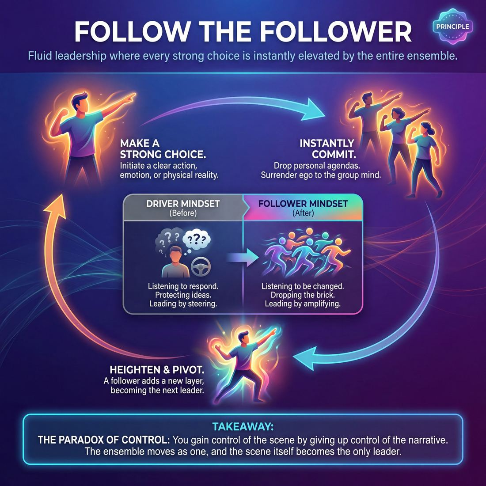

# 💎 Follow the Follower

> *When someone makes a strong choice, the whole team commits.*

{ .infographic }

## 💎 The core belief

!!! abstract "The Conviction"
    When someone makes a strong choice, the whole team commits. Leadership is fluid; the moment an idea is introduced, everyone drops their own agenda to elevate it.

At its heart, **Follow the Follower** is the conviction that leadership on an improv stage is entirely fluid, shifting from moment to moment based on who makes a strong choice. When one improviser steps forward with a clear initiation, emotion, or physical move, the rest of the ensemble instantly commits to supporting it. In that split second, the initiator becomes the leader, and everyone else willingly surrenders their own plans to become dedicated followers. It is the profound belief that a single, unified choice—even a simple or absurd one—is infinitely more powerful than a stage full of competing, brilliant ideas.

This principle demands a radical surrender of ego. To truly follow the follower, you must trust that the **group mind**—the collective intelligence of the ensemble—is smarter than any individual agenda. It means recognizing that the person you are following right now will, in the very next beat, turn around and follow *you* when you add the next piece of the puzzle. There is no permanent protagonist and no designated director; instead, the ensemble operates like a flock of birds, turning in unison the moment any single bird changes direction. By treating every strong choice as the *only* choice, the ensemble weaves a cohesive piece without a shred of pre-planning.

## 🌱 Why it governs everything

When an improviser truly internalizes this principle, their entire approach to the stage transforms. The fundamental question they ask themselves shifts from *"What should I do next?"* to *"What are we already doing?"*

This value governs everything because it completely removes the burden of solo invention. You no longer have to be the smartest, fastest, or most original person in the room; you only have to be the most observant. By trusting that the scene is already providing the answers, the performer stops trying to write the script and starts discovering it. 

This internalization triggers a profound behavioral shift across every aspect of performance:

| The "Driver" Mindset (Before) | The "Follower" Mindset (After) |
| :--- | :--- |
| **Listening to respond:** Waiting for a gap in dialogue to insert a pre-planned joke or idea. | **Listening to be changed:** Absorbing the emotional weight and physical reality of what was just offered. |
| **Protecting ideas:** Clinging to a character or premise even when the scene has clearly moved on. | **Dropping the brick:** Instantly discarding personal ideas the moment a partner makes a strong, divergent choice. |
| **Fear of silence:** Panicking when no one is speaking, rushing to fill the void with words. | **Trusting the space:** Allowing physical action, eye contact, and shared environment to dictate the next move. |
| **Leading by steering:** Trying to force the scene toward a specific, logical conclusion. | **Leading by amplifying:** Taking whatever the partner just did and doing it harder, bigger, or with more commitment. |

!!! abstract "The Paradox of Control"
    In improvisation, you gain control of the scene by giving up control of the narrative. When every player is fiercely dedicated to following the last move made, the ensemble moves as a single, highly responsive organism. There is no tug-of-war for dominance, only a slipstream of shared momentum.

Because this principle demands the complete surrender of ego to the piece, it acts as the operating system for the entire ensemble. It dictates how players enter a scene, how they support from the wings, and how they edit. When everyone is a follower, the scene itself becomes the only leader.

## 👀 How it shows up

When an ensemble truly holds this conviction, the stage stops looking like a collection of individuals and starts moving like a single entity. The primary observable trait is the **velocity of agreement**—not just verbally saying "yes," but physically, emotionally, and instantly aligning with whoever currently holds the focus. 

This manifests in highly specific, observable actions on stage:

*   **The "Drop":** You will physically see improvisers abandon their posture, intended entrance, or clever premise the millisecond a scene partner establishes a different reality. There is no lingering attachment to what *almost* happened.
*   **Physical Amplification:** If one player makes a bold, unusual choice—like adopting a bizarre physical limp or a hyper-specific emotional state—the rest of the ensemble adopts or complements it, validating the choice through sheer numbers.
*   **Silence as Support:** Following doesn't always mean swarming the center of the stage. Often, it looks like players holding absolute, focused stillness on the wings to frame the active players, silently agreeing that *this* is what the piece is about right now.

As improvisers internalize this principle, their behavior evolves from hesitant cooperation to seamless group mind:

| Stage | Observable Behavior |
| :--- | :--- |
| **Novice** | **Polite yielding:** Players wait their turn. They agree to a choice but hesitate to join in fully, or they awkwardly try to merge their own pre-planned idea with the new one. |
| **Intermediate** | **Rapid swarming:** The team quickly identifies the strongest choice and rallies behind it. If someone initiates a pirate ship, everyone immediately becomes the crew. |
| **Master** | **Flocking:** Leadership passes invisibly. The group pivots as one. The moment a "follower" makes a strong heightening move, the original leader instantly follows *them*. |

!!! example "In a scene: The fluid pivot"
    **Player A** steps out as a strict, booming drill sergeant. **Player B** steps out as a terrified recruit, but accidentally sneezes in a high-pitched, cartoonish way. 
    
    Instead of ignoring the sneeze or punishing it as a drill sergeant, **Player A** instantly drops the booming voice and adopts the same high-pitched tone: *"Oh my goodness, bless you, private!"* 
    
    **Players C and D** immediately rush the stage, also speaking in high-pitched cartoon voices to offer tissues. 
    
    *The breakdown:* The team followed Player A, who followed Player B's accidental offer. The follower became the leader, and the ensemble committed instantly without a committee meeting.

!!! tip "On stage"
    If you feel yourself thinking, *"But my idea was better,"* or *"I'll just wait until they finish so I can do my thing,"* you are no longer following the follower. Step out, mirror the physical posture of the person speaking, and let their reality overwrite yours.

## 🧪 Living it in practice

Internalizing the belief that the group’s choice supersedes your own requires active rewiring. Because human beings naturally want to control outcomes, "Follow the Follower" is not just a nice sentiment—it is a physical and mental reflex that must be trained until it becomes second nature. 

To live this principle in practice, improvisers cultivate specific mindsets and drill them until the ego gets out of the way.

### The Mindsets
Living this principle requires adopting two internal mantras before you even step on stage:
*   **Drop your brick:** You might walk on stage with a brilliant idea for a scene (your "brick"). The moment your partner speaks or moves, you must instantly drop your brick and help them build with theirs. 
*   **Assume genius:** Treat the move just made by your partner as the exact right move, even if it feels accidental, weird, or contradictory to what you expected. 

!!! tip "On stage"
    **Physical agreement first.** When a scene starts, physically match your partner's posture, rhythm, or energy level before you even speak. If they come out frantic, be frantic. If they are moving with heavy, slow steps, match their gravity. Physical agreement is the fastest way to short-circuit your brain's desire to plan and forces you into a follower's mindset.

### Drills that train the muscle
We train this principle through exercises that force us to surrender control and share leadership fluidly.

| Drill | How it works | What it trains |
| :--- | :--- | :--- |
| **Flocking (The Swarm)** | A group moves silently around the space in a diamond formation. Whoever is at the front is the leader. When they turn, a new person is at the front and instantly becomes the leader. | Seamless transitions of power. You learn to lead confidently when it's your turn, and surrender instantly when the formation shifts. |
| **Colombian Hypnosis** | One partner holds their palm inches from the other's face; the follower must keep their face perfectly aligned with the palm as it moves through space. | Hyper-fixation on a partner's micro-movements and the total surrender of physical control. |
| **Word-at-a-Time Story** | A group builds a story by contributing exactly one word at a time in a circle. | Verbal surrender. You cannot plan your word; you must follow the grammatical and narrative trajectory set by the person immediately before you. |

### The skills it animates
When an ensemble truly lives this principle, it acts as the invisible engine behind several core improv techniques:

*   **Group Games:** Finding the "game" of a scene requires everyone to notice what the loudest or most repeated pattern is, and collectively agree to heighten it, rather than introducing competing ideas.
*   **Organic Edits:** Swiping, running across the stage, or transforming the stage picture only works if the rest of the ensemble instantly recognizes the edit, drops their current reality, and follows the new stage picture.
*   **Support Moves:** A walk-on or a tag-out is an act of following the follower—you are serving the reality they just established, rather than inventing a new one.

!!! example "In a scene"
    Player A steps out intending to start a scene about a tense bomb defusal, holding their hands out delicately, sweating. Player B steps out, sees the hands, and says, "I love when we bake pies together, Grandma." 
    
    **Following the follower:** Player A instantly drops the bomb defusal idea, smiles warmly, and says, "The secret is in the lattice crust, dear." Player A has followed Player B's initiation, making the scene instantly cohesive.

## ⚖️ Tensions & nuance

At first glance, a principle built entirely on "following" seems to invite a paradox: if everyone is following, who is leading? The reality is that **Follow the Follower** is not a state of passive waiting; it is a highly active, continuous loop of shifting focus and shared control. 

Here is how this principle navigates its inherent tensions and interacts with the rest of the improv ecosystem:

**The Initiation Paradox**
For someone to be followed, someone must first initiate. The tension resolves in the immediate aftermath of that first move. The moment Player A initiates, Player B follows by reacting. But crucially, Player A must instantly drop their original plan and *follow Player B's reaction*. 

!!! abstract "The Leadership Loop"
    In a healthy ensemble, leadership is a hot potato. You hold it just long enough to make a strong choice, then immediately toss it to your partner by treating their reaction as the new, most important thing in the scene.

**Following vs. Bringing a Brick**
There is a natural tension between surrendering to the group mind and the need to contribute your own ideas (often called **Bring a Brick**—the expectation that every player adds to the scene). Following the follower does not mean you show up empty-handed. It means the "brick" you bring must be used to build the house the ensemble is currently constructing, rather than starting your own separate shed in the backyard. You maintain your unique comedic voice, but you apply it entirely in service of the established reality.

**Active Support vs. Passive Agreement**
To navigate these tensions successfully, improvisers must balance the act of surrendering their ego with the necessity of driving the scene forward. 

| The Approach | What it looks like | The Result |
| :--- | :--- | :--- |
| **Passive Agreement** | Nodding, saying "yes," and waiting for the other person to invent the next step. | The scene stalls; the initiator is left stranded on stage doing all the heavy lifting. |
| **Active Following** | Heightening the choice, mirroring the physical energy, or justifying *why* the move makes sense. | The scene accelerates; the ensemble shares the weight of creation. |

**When to Stop Following (The Safety Override)**
Principles of craft are always subordinate to principles of human safety. **Follow the Follower** assumes a foundation of mutual trust, respect, and theatrical play. 

!!! warning "The Boundary Caveat"
    You are never obligated to follow a scene partner into physical danger, genuine emotional distress, or a violation of your personal boundaries. If a choice makes you feel unsafe, the principle of following is immediately overridden by your right to protect yourself, drop character, or stop the scene.

## 🚫 Common misunderstandings

Because the phrase contains the word *follow*, it is frequently misinterpreted by newer improvisers as a mandate to surrender their own agency, go limp, or simply wait for instructions. In reality, true following is a highly active, dynamic state. 

Here are the most common ways this principle is misread, and how to correct them:

| The Misunderstanding | The Reality |
| :--- | :--- |
| **It means being passive.** ("I'll just wait to see what my partner does.") | **Following is an active pursuit.** You must aggressively support, **heighten** (make more important), and justify the choice being made. You are an engine, not a passenger. |
| **Roles are static.** ("You initiated, so you are the leader and I am the follower.") | **Roles are fluid.** The moment a follower adds a new detail or reaction, they become the leader, and the original leader must now follow *them*. |
| **It means mimicking.** ("If they are angry, I must be angry.") | **You follow the *premise*, not necessarily the *behavior*.** You can fully support a scene partner's choice while maintaining your character's contrasting point of view. |
| **It overrides personal boundaries.** ("I have to go along with anything they initiate.") | **Ensemble trust requires safety.** Following applies to the creative game, not to physical safety or crossing personal boundaries. |

!!! warning "Watch out: The 'Sheep' Trap"
    The most pervasive mistake is confusing "following" with "agreeing without contributing." If your partner initiates, *"We need to dig this trench faster,"* simply saying, *"Yes, we do,"* is passive agreement. You are making them do all the work. 
    
    To truly *follow the follower*, you must actively invest in their reality: grab an imaginary shovel, wipe the sweat from your brow, and say, *"If we don't hit the water main by noon, the boss is gonna fire us both."* You have followed their initiation by adding stakes and physical action.

!!! abstract "Key idea: The Infinite Loop"
    The term "Follow the Follower" is deliberately paradoxical. If Player A makes a move, Player B follows it. But the moment Player B reacts, Player B has just made a *new* move. Now, Player A must drop their original agenda and follow Player B's reaction. 
    
    There is no designated leader. The "leader" is simply whoever just spoke or moved, and the "follower" is whoever is reacting. The baton passes back and forth every few seconds.

!!! example "In a scene: Following without mimicking"
    **Player A** storms on stage, furious: *"I cannot believe they canceled the spelling bee!"*
    
    **Player B** does *not* need to also become furious to follow the follower. Player B can follow the premise by playing a contrasting, hyper-calm foil: *"Breathe, Susan. The dictionary is still safe at home. No one can take the words from your mind."* 
    
    Player B has completely followed Player A's reality (the spelling bee is canceled, Susan is devastated) without abandoning their own distinct character choice.

## 🔗 Why it matters

When an ensemble truly internalizes **Follow the Follower**, the nature of the performance fundamentally shifts. It stops being a competition of individual wits and transforms into an act of collective discovery. This deeply held belief is the secret ingredient that elevates a group of funny people into a unified, breathing organism.

Here is how this principle changes the entire ecosystem of a show:

*   **It creates the illusion of telepathy:** For the audience, there is nothing more thrilling than watching a group of people instantly align without speaking. When a single, seemingly minor choice—a strange walk, a repeated phrase, a sudden drop in status—is immediately adopted and heightened by the entire team, it looks like magic. The audience feels they are witnessing a miracle of spontaneous choreography.
*   **It provides profound relief:** For the individual improviser, this principle removes the anxiety of creation. You no longer need to steer the ship, invent the perfect plot twist, or save a dying scene. Your only job is to observe what is already happening and get behind it. It replaces the pressure to invent with the joy of amplification.
*   **It eliminates stage negotiations:** When everyone is committed to following, scenes stop being arguments about whose reality is "right." The first strong choice wins, not because it is the best idea, but because the ensemble's immediate, unquestioning support *makes* it the best idea.

To see the macro-level impact of this value, look at how it changes the baseline reality of a performance:

| The Performance | Without "Follow the Follower" | With "Follow the Follower" |
| :--- | :--- | :--- |
| **The Energy** | Fractured. Players are pulling in different directions, trying to assert their own premises. | Focused. The entire ensemble's energy acts like a magnifying glass on a single focal point. |
| **The Pacing** | Stalling. Scenes feel like negotiations or waiting games as players figure out who is in charge. | Inevitable. The show moves with momentum because every choice is immediately acted upon. |
| **The Audience** | Appreciates individual cleverness or specific jokes, but feels the friction on stage. | Experiences awe. They stop looking at individual actors and start watching the "piece" as a whole. |

!!! abstract "The Ultimate Payoff: Group Mind"
    In improv, we often talk about **group mind**—that elusive state where the ensemble seems to share a single consciousness. Group mind is not a mystical accident; it is the direct, inevitable result of a team rigorously applying the principle of Follow the Follower. When everyone surrenders their ego to the piece and commits to the current choice, the ensemble becomes infinitely smarter, faster, and more capable than any single performer could ever be.

## 📚 References & Further Reading

### Foundational sources
*   **Viola Spolin, *Improvisation for the Theater* (1963)** — Spolin literally coined the "Follow the Follower" exercise (often executed as a rapid-switching mirror game). Her goal was to short-circuit the intellect and eliminate the concept of a designated "leader." By forcing actors to switch between leading and following so quickly that the distinction disappears, the exercise trains the exact state of pure, intuitive physical agreement required for group mind.
*   **Charna Halpern, Del Close, and Kim "Howard" Johnson, *Truth in Comedy: The Manual of Improvisation* (1994)** — The definitive text on the concept of "Group Mind." Close and Halpern argue that the ensemble is always smarter than the individual, and that true improvisation requires a radical surrender of ego. This book is foundational for understanding why a team must commit instantly to a single choice rather than fighting for their own brilliant ideas.

### Practitioner guides & manuals
*   **T.J. Jagodowski, David Pasquesi, and Pam Victor, *Improvisation at the Speed of Life: The TJ and Dave Book* (2015)** — A masterclass in discovering a scene rather than inventing it. The authors emphasize being entirely of service to your partner, paying hyper-focused attention to physical and emotional shifts, and letting the scene itself dictate the next move. It perfectly captures the mindset of "listening to be changed" rather than listening to respond.
*   **Matt Besser, Ian Roberts, and Matt Walsh, *The Upright Citizens Brigade Comedy Improvisation Manual* (2013)** — While famous for its focus on the "Game of the Scene," this manual rigorously drills the discipline of absolute agreement. It is a primary source for the modern mandate to "drop your idea"—instructing improvisers to instantly abandon their planned premise the millisecond a scene partner speaks first or establishes a different reality.
*   **Mick Napier, *Improvise: Scene from the Inside Out* (2004)** — While Napier famously advocates for making strong individual choices to initiate a scene, he is equally adamant about the necessity of dropping your preconceived notions (your "brick") the moment the scene's reality shifts. His work highlights the balance between initiating boldly and following instantly.
*   **Patricia Ryan Madson, *Improv Wisdom: Don't Prepare, Just Show Up* (2005)** — Translates the improv principle of yielding control into a broader behavioral philosophy. Madson emphasizes that giving up the need to steer the narrative, and instead trusting the space and the people in it, is the key to genuine responsiveness and fluid leadership.

### Lineage & teachers
*   **Viola Spolin & The Theater Games Lineage** — Spolin's work is the bedrock of this specific principle. Her games were designed specifically to bypass the ego and the "playwright" mind, forcing players to rely on kinesthetic, physical connection rather than verbal planning. The concept of "velocity of agreement" begins with her mirror exercises.
*   **Del Close & iO (ImprovOlympic)** — Close championed the idea that an ensemble should operate as a single, highly responsive organism. The Harold, the signature long-form structure he developed, relies entirely on players' ability to instantly support, heighten, and follow the strongest choice on stage without hesitation or pre-planning.

### Research & theory
*   **R. Keith Sawyer, *Group Genius: The Creative Power of Collaboration* (2007)** — Sawyer, a psychologist and former improv pianist, studies the phenomenon of "group flow." He demonstrates scientifically that peak collective creativity happens when participants abandon individual planning in favor of deep listening and immediate, unstructured responsiveness. His research validates the idea that a group acting without a designated leader can generate more complex, innovative work than a group following a single director.
*   **Anne Bogart and Tina Landau, *The Viewpoints Book: A Practical Guide to Viewpoints and Composition* (2004)** — Details the movement concept of "Flocking" (taught under the Viewpoint of Kinesthetic Response). In flocking exercises, an ensemble learns to move as a single entity, passing leadership invisibly based on who is at the front of the group's spatial orientation. It is the exact physical training for the "flocking" behavior described in advanced improv ensembles.

### Communities & adjacent reading
*   **Contact Improvisation (Dance)** — A postmodern dance form originated by Steve Paxton in the 1970s that relies entirely on physical weight-sharing, momentum, and following the follower. It is the literal, physical embodiment of fluid leadership; dancers must surrender their individual agenda to a shared center of gravity, moving as one organism without a predetermined leader.

## 💬 Quotes & Anecdotes

!!! quote "— Viola Spolin, *Improvisation for the Theater* (1963)"
    Don't initiate! Follow the initiator! Follow the follower.

!!! quote "— Stephen Colbert, *Knox College Commencement Address* (2006)"
    I'm proud of my ability to understand what somebody else is trying to do and help them achieve it, because part of the aesthetic of improvisation is service. You never say no. Serve the servant, follow the follower. And that's very valuable in your life, as well as very valuable in your actor's work. I'm damn proud of my ability to help other people achieve their ideas.

!!! quote "— Bob Kulhan (quoting Martin de Maat), *Getting to "Yes And"* (2017)"
    Onstage, we all follow each other as a way to facilitate organic discovery in the group. We focus so intently on the other individuals in the group that no one can become the leader; we work in service to that which is bigger than any individual: the team, the process, the show.

!!! quote "— Gary Schwartz, *The Trouble With "Yes, And..."* (2012)"
    Follow the follower happens when neither player leads or initiates. Each player remains intent on staying with what the other is doing to such a degree flow and unison occurs.

!!! quote "— Del Close, quoted in *Truth in Comedy* (1994)"
    If we treat each other as if we are geniuses, poets and artists, we have a better chance of becoming that on stage.

### Where it comes from

"Follow the Follower" originated as a direct extension of Viola Spolin's classic "Mirror" exercise. In the basic Mirror game, one person leads a physical movement and the other follows. Spolin then introduced the variation "Follow the Follower," where the designated leader is removed, and both players are instructed to simply reflect each other. The goal was to short-circuit the intellect and force players into a state of pure, intuitive connection where "no one initiates and all reflect." Over time, this physical exercise evolved into a foundational philosophy for ensemble scene work: the idea that a scene thrives when everyone surrenders the need to drive the narrative.

### A telling example

The power of following the follower is most visible when an improviser completely abandons their own premise to support a partner's accidental choice. 

Imagine an improviser stepping onto the stage with a clear, pre-planned idea: they are going to play a tough, grizzled detective interrogating a suspect. They stride to the center of the stage, slam their hands on a mimed table, and open their mouth to bark a line. 

But in that exact fraction of a second, their scene partner trips over their own shoelaces, lets out a high-pitched yelp, and falls to the floor. 

An improviser who is *driving* will ignore the trip, wait for the partner to stand up, and proceed with the detective scene. But an improviser who is *following the follower* instantly drops the detective premise. They see the trip as the strongest choice in the room. They might immediately drop to the floor themselves, yelping in the exact same pitch, establishing that they are both clumsy toddlers learning to walk. Or they might gasp and say, "Your majesty, the royal gravity is acting up again!" 

By treating the accident as an offer and following it with absolute commitment, the ensemble discovers a scene far more spontaneous and joyful than the pre-planned detective interrogation ever could have been.

## 🧭 Explore the framework

- 🎭 **Domain:** [The Ensemble](04_D__the-ensemble.md)
- 🔁 **Other principles here:** [Group Mind](04_P1__group-mind.md), [Serve the Piece](04_P3__serve-the-piece.md)
- 🧠 **Skills of this domain:** [Peripheral Awareness](04_S1__peripheral-awareness.md), [Support Work](04_S2__support-work.md), [Suggestion Deconstruction (A-to-C)](04_S3__suggestion-deconstruction-a-to-c.md), [Pacing & Rhythm](04_S4__pacing-and-rhythm.md), [Thematic Synthesis](04_S5__thematic-synthesis.md), [Format Literacy](04_S6__format-literacy.md)
