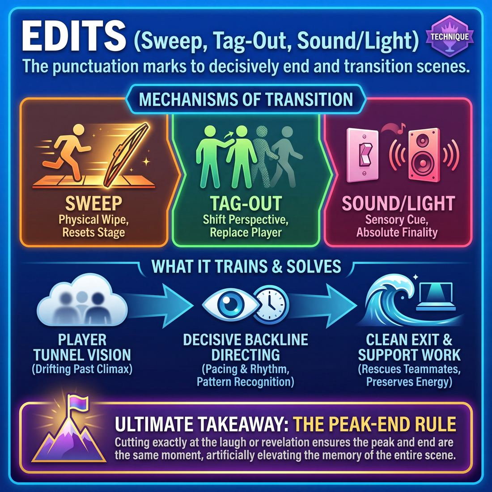

# 🎯 Edits (Sweep, Tag-Out, Sound/Light)

> *A drillable muscle that trains **Pacing & Rhythm**.*

{ .infographic }

## 🎯 The essence

**Edits** are the physical and technical mechanisms improvisers use to decisively end one scene and transition to the next. Whether executing a **Sweep** (a player running across the downstage line to wipe the stage clean), a **Tag-Out** (tapping a player on the shoulder to replace them and shift the scene's perspective), or utilizing a **Sound/Light** cue (a blackout or musical swell), an edit serves as the punctuation mark of a performance. 

Practicing these maneuvers isolates and drills one critical muscle: decisive timing. It trains the ensemble on the backline to recognize the natural peak of a scene and execute a clean, unambiguous transition before the energy deflates, rescuing their teammates from lingering on stage.

!!! abstract "The Core Rep"
    Watching a scene from the outside, identifying its climax or comedic peak, and physically committing to ending it without hesitation.

## 🎓 What it trains

At its core, practicing edits builds the muscle of **Pacing & Rhythm**. It teaches an improviser how to feel the heartbeat of a show, recognize when a scene has hit its natural peak, and decisively transition to the next moment. 

!!! abstract "The Problem it Solves"
    Improvisers inside a scene often suffer from tunnel vision. They are so focused on their partner and their immediate reactions that they cannot see the overall shape of the scene. Without strong edits from the outside, scenes inevitably drift past their climax into "improv purgatory"—where the energy deflates, the joke is beaten to death, and the actors are left awkwardly searching for an exit. Edits solve this by placing the responsibility of pacing entirely on the ensemble.

Mastering the physical and technical actions of editing trains several vital sub-skills:

* **Decisiveness:** A hesitant edit is worse than no edit. Drilling these techniques forces players to commit fully to their physical choices. You cannot half-sweep a stage; you must run with conviction.
* **Directing from the Backline:** It shifts the improviser's mindset from "waiting for my turn" to actively directing the show. The players on the sides (or in the booth) learn to watch with **Peripheral Awareness**, anticipating when a scene needs a button, a shift in perspective, or a total reset.
* **Pattern Recognition:** To edit well, you must recognize the comedic game or the emotional arc of the scene. You learn to spot the laugh line, the dramatic resolution, or the exact moment a premise has been fully explored.

Ultimately, editing is a profound exercise in **The Ensemble**. It demands that you surrender your ego to the piece. You are not stepping forward to steal focus; you are executing an act of **Support Work**. You edit to protect your teammates, preserve the energy of the show, and weave individual scenes into a cohesive, breathing rhythm.

## 💡 Why it works

Edits work because they fundamentally separate the act of *playing* a scene from the act of *pacing* a scene. 

When improvisers are deep in a scene, their cognitive load is maxed out. They are actively listening, reacting emotionally, remembering details, and building a shared reality. Asking them to simultaneously maintain an objective, directorial view of the scene’s overall rhythm is nearly impossible. The edit solves this by shifting the responsibility of pacing to the **backline** (the players waiting on the sides or back of the stage) or the technical improviser in the booth. 

This separation of duties creates a powerful group dynamic. The players on stage can fully surrender to the moment, knowing they have a safety net. Meanwhile, the backline is forced to stay hyper-engaged, actively hunting for the scene's climax rather than passively watching. 

Under the hood, edits exploit several psychological and theatrical mechanisms:

* **Cognitive Relief:** By removing the pressure to invent a "perfect ending," players stop forcing unnatural conclusions or talking in circles. They can simply exist in the scene until the cut arrives.
* **The Cinematic Cut:** Audiences are conditioned by film and television to understand sudden transitions. A sharp Sweep acts as a visual wipe, instantly resetting the audience's mental canvas. 
* **Juxtaposition:** A Tag-Out exploits the brain's love for contrast. It preserves one established element while instantly changing the context (time, space, or scene partner), generating immediate comedic or dramatic friction.
* **Sensory Authority:** Sound and Light edits bypass physical movement entirely. A sudden blackout or a swelling music cue triggers an involuntary emotional response in the audience, signaling finality with absolute, undeniable authority.

!!! abstract "The Peak-End Rule"
    Psychology tells us that humans judge an experience largely based on how they felt at its peak and at its end, rather than an average of every moment. Edits weaponize this cognitive bias. By cutting a scene exactly on its biggest laugh or most poignant revelation, the edit ensures the *peak* and the *end* are the exact same moment—artificially elevating the audience's memory of the entire scene.

## 🧩 The setup

To drill the mechanics of editing, you need to create an environment where the backline feels completely empowered to interrupt and transition. Here is how to configure the room before you begin:

* **Players & Group Size:** A full ensemble (6–12 players). 
* **Arrangement:** Two players begin center stage. The remaining players form a tight, attentive backline at the upstage edge, or stand ready in the wings. *Crucially, backline players must be standing, uncrossed, and visibly engaged.*
* **Space & Materials:** An open stage or rehearsal room. If you are specifically drilling Sound/Light edits, you will need access to your theater’s light board and a sound system (even just a phone plugged into a speaker).
* **Time:** 15–20 minutes total. The exercise runs as a continuous montage, with individual scenes lasting anywhere from 10 seconds to 2 minutes.
* **Roles:**
    * **Active Players:** Commit fully to the current scene and yield instantly when an edit occurs.
    * **The Backline:** Actively hunt for the edit point. They are responsible for executing the Sweep or Tag-Out.
    * **Tech (if applicable):** One player or the coach sits at the booth to practice plunging the stage into a blackout or firing a music cue.
    * **Facilitator:** Stands downstage or in the house. Initially, you may call out "Edit!" to force the timing, but you will quickly transition to silence so the ensemble can find their own rhythm.
* **Prerequisites:** Players should be comfortable initiating basic two-person scenes and understand the concept of a "button" (a laugh line, a moment of high tension, or a natural thematic conclusion).

!!! tip "On stage: The 'Ready' Stance"
    Before starting, check the backline's posture. If players are leaning against the wall, sitting on the floor, or crossing their arms, they are signaling to the active players: *I am an audience member, not a teammate.* A good edit requires physical readiness. Require the backline to stand with their weight slightly forward, ready to move.

!!! quote "How to introduce it"
    "Today we are going to practice ending scenes. A great scene is a gift, but a great edit is the wrapping paper that makes it pop. We are going to run a continuous montage. If you are on the backline, your only job is to rescue your teammates. Do not let them flounder, and do not let them talk past the peak of the scene. When you see a laugh, a revelation, or a moment of high tension, I want you to aggressively edit—either by sweeping across the downstage line, or by tagging a player out. Active players: the moment you see an edit, drop your scene instantly and clear the stage. Let's build the muscle of moving on."

## ⚙️ The mechanics

!!! abstract "The Core Objective"
    To cleanly terminate the current reality and instantly establish a blank canvas for the next, without bleeding energy. An edit is a physical or technical punctuation mark—a period at the end of a scene's sentence.

The mechanics of editing rely on a continuous loop of observation, decisive action, and immediate yielding. While the physical execution changes based on the type of edit, the underlying flow of play remains the same.

### The Universal Edit Loop

1. **Observation:** Players on the backline actively watch the scene, listening for a peak in energy, a resolved game, or a natural conclusion.
2. **The Initiation:** An improviser (the **Editor**) decides the scene is over and commits their body to an edit mechanic. 
3. **The Yield:** The players currently in the scene immediately drop their characters. They stop speaking mid-sentence if necessary, and clear the stage.
4. **The Fill:** The stage is now empty. Nature abhors a vacuum; new players must immediately step forward to initiate the next scene.

### The Three Primary Mechanics

Here is exactly how to execute the three most common edits.

#### 1. The Sweep Edit (The Standard)
The Sweep is the most common way to completely wipe the stage clean. 
* **The Action:** The Editor runs in a straight, brisk line directly across the **downstage** (the front of the stage, closest to the audience). 
* **The Visual:** By passing between the audience and the active players, the Editor acts as a human curtain, visually "wiping" the scene away.
* **The Reset:** The active players retreat to the backline. The Editor continues all the way off-stage or to the opposite backline.

!!! tip "On stage"
    **Run with purpose.** A sweep must be fast and definitive. Do not jog backward, do not apologize, and do not look at the players you are editing. Look at the opposite wall and run to it.

#### 2. The Tag-Out (The Pivot)
A Tag-Out ends the current scene but retains one character, instantly transporting them to a new time, location, or conversation.
* **The Action:** The Editor steps forward from the backline and physically taps the shoulder of *one* player in the active scene.
* **The Yield:** The tagged player immediately drops character and returns to the backline.
* **The Retention:** The *untagged* player remains in the exact same physical position, retaining their character. 
* **The Reset:** The Editor steps into the physical space vacated by the tagged player and speaks the first line of the new scene.

!!! example "In a scene"
    **Player A** is playing a teenager begging their mom (**Player B**) for the car keys. 
    **The Editor** steps out and taps **Player B** (the mom) on the shoulder. **Player B** leaves. 
    **The Editor** steps into the mom's spot, looks at **Player A**, and says, *"License and registration, please. Do you know how fast you were going?"* We have instantly time-jumped to the consequence.

#### 3. Sound & Light Edits (The Technical Edit)
Often used to end a long-form piece, close a show, or transition between major acts.
* **The Action:** The improviser or technician in the tech booth cuts the stage lights to black (a **Blackout**) or abruptly fades up transition music.
* **The Yield:** Players on stage freeze for a split second to let the visual land, then safely and quietly clear the stage in the dark.
* **The Reset:** The lights are restored to full to reveal a fresh stage.

### Rules & Constraints

* **The Rule of Yielding:** If you are edited, you are done. You may not finish your sentence, deliver "one last good line," or wave goodbye. The moment the edit begins, your scene is over.
* **No Half-Measures:** If you step off the backline to sweep, you must complete the sweep. If you hesitate and try to retreat, you will confuse the players and the audience. Edit with your chest.
* **Anyone Can Edit:** The Editor does not have to be in the next scene. In fact, a "blind sweep" (sweeping to clear the stage for *other* teammates to enter) is a hallmark of strong ensemble support.

## 🎬 Sample round

!!! example "Sample round: A sequence of edits"
    Here is how a team might use different edits to manage the pacing and rhythm of a show, moving seamlessly from scene to scene.

    **Beat 1: The Sweep Edit**  
    *The context:* Mark and Sarah are playing astronauts arguing over a parking spot on the moon. The scene has found its game and is escalating.
    
    * **Mark:** "I was here first! My blinker has been on since the stratosphere!"
    * **Sarah:** "Well, my rover is a compact, and you're taking up two craters!"
    * **The Edit:** The audience laughs at the absurdity. From the wings, **Player 3** recognizes this as the scene's peak. They sprint directly across the downstage plane, acting as a human curtain (the **Sweep**).
    * **The Result:** Mark and Sarah immediately drop their characters and clear the stage. Player 3 and Player 4 step center to initiate a brand new scene.

    **Beat 2: The Tag-Out**  
    *The context:* Player 3 and 4 are now playing a father and a rebellious teenage son who refuses to eat his vegetables.
    
    * **Player 3 (Dad):** "If you don't eat your broccoli, you'll never grow up to be a giant, terrifying lumberjack like your mother!"
    * **The Edit:** **Sarah** steps out from the backline, walks up to Player 4 (the son), and taps him on the shoulder. Player 4 immediately yields his spot and leaves the stage.
    * **The Result:** Sarah assumes the role of the "terrifying lumberjack mother." She has used a **Tag-Out** to keep the Dad's character on stage while shifting the context to heighten the joke.
    * **Sarah (Mom):** *(Swinging an imaginary axe)* "Who's disrespecting the broccoli in my house?!"

    **Beat 3: The Light/Sound Edit**  
    *The context:* The show is reaching its climax. The entire cast has joined the stage for a chaotic family reunion at the lumberjack camp, tying together threads from earlier scenes.
    
    * **Mark (Grandpa):** "I brought the potato salad, and yes, it has moon-rocks in it!"
    * **All Players:** *(Groan and raise their axes)* "Tradition!!"
    * **The Edit:** The improviser in the tech booth (or the stage manager) recognizes the massive spike in energy and the thematic tie-back. They immediately cut the stage lights to black and trigger the outro music.
    * **The Result:** A **Light/Sound Edit** provides a definitive, satisfying conclusion to the piece, saving the players from having to awkwardly sweep their own finale.

## 🎚️ Variations & progressions

To build the muscle of editing, you must separate the *physical mechanics* of the edit from the *judgment* of when to do it. As an ensemble moves from Novice (missing the exit) to Master (editing on the exact peak), the drills should shift from pure muscle memory to deep rhythmic listening.

Here is how to ramp the difficulty of editing exercises to match your team's maturity.

### 📈 Progression Drills

| Focus | Drill | Maturity Stage | How it works |
| :--- | :--- | :--- | :--- |
| **Mechanics** | **Coach-Called Edits** | **Adv. Beginner** | The coach yells "Sweep!" or "Tag [Name]!" The backline must execute the edit immediately, without hesitation. This removes the pressure of *when* to edit, focusing entirely on a clean, confident physical execution. |
| **Aggression** | **Three-Line Scenes** | **Competent** | Player A speaks, Player B speaks, Player A speaks. The backline must immediately **Sweep**. This breaks the habit of letting scenes run long and proves that a scene can be established and ended in seconds. |
| **Listening** | **Blind Edits** | **Proficient** | The backline stands with their backs to the stage. They must initiate a **Sweep** or **Sound Edit** based *purely* on the audio rhythm of the scene—listening for the peak of a laugh, a pregnant pause, or a drop in energy. |
| **Fluidity** | **The "No-Sweep" Constraint** | **Master** | The traditional Sweep is banned. The ensemble must transition scenes using only **Tag-Outs**, **Organic Morphs** (transforming the physical stage picture), or **Sound/Light** cues. |

### 🔀 Common Edit Variants

Once the standard Sweep and Tag-Out are mastered, introduce these advanced variants to add texture to your transitions:

* **The Split-Screen (Focus Shift):** Instead of ending a scene, a player steps out and initiates a new scene on the other side of the stage. The original players freeze. Focus can now bounce back and forth between the two locations like a cinematic cross-cut.
* **The Revolving Door (Rapid Tags):** A rapid succession of Tag-Outs on the same character. For example, if a character is on a terrible blind date, players rapidly tag out the *date*, showing five different terrible dates in thirty seconds, before sweeping.
* **The Organic Morph:** Instead of a hard cut, the backline enters the scene by mirroring the physical shapes or sounds of the current players, gradually transforming the environment until the original players fade away and a new scene has emerged.

## 🧑‍🏫 Coaching notes

When coaching edits, your primary goal is to eliminate hesitation. Improvisers naturally want to be polite, waiting for the "perfect" moment or the biggest possible laugh. Your job is to train their Pacing & Rhythm muscle so they act on instinct rather than intellect. 

!!! tip "Coaching: The Golden Rule of Edits"
    **"If you think 'someone should edit this,' that someone is you."** 
    Call this out the moment you see players on the back wall leaning forward but failing to move. Teach them that the thought *is* the cue. Never wait for a teammate to do it. If two of you sweep at the exact same time, it looks like brilliant, hive-mind choreography. If nobody sweeps, the scene dies a slow death.

### Essential Side-Coaching Cues
Use these short, punchy directives while scenes are running to build muscle memory and decisiveness:

* **"Save them!"** – Use this when a scene is floundering or has clearly peaked. It reframes the edit from "interrupting" to an act of deep ensemble support.
* **"Run!"** – Yell this to force a Sweep. Novices often stroll across the stage; a sweep must be a decisive, energetic sprint that physically wipes the stage clean.
* **"Tag with your voice!"** – Use this when a Tag-Out is physically timid or silent. The entering player must speak their new initiation the exact millisecond they touch their teammate's shoulder.
* **"Blackout!"** – Call this from the side to train the tech booth (or the players) to recognize the definitive end of a piece. 
* **"Take the first laugh."** – Remind players not to wait for the third or fourth joke. Edit on the first solid button.

### What 'Good' Looks and Sounds Like
You will know the ensemble is moving from Novice to Competent when you observe the following behaviors:

* **Physical Commitment:** The editing player moves with absolute certainty. A sweep cuts a straight, fast line across the downstage area. A tag-out features a firm, undeniable tap on the shoulder.
* **Instant Surrender:** The players being edited do not fight for the last word. The moment a sweep crosses their plane or a tag occurs, they instantly drop their characters and clear the stage. 
* **Energy Transfer:** The edit doesn't just end the previous scene; it acts as a battery jump-start for the next one. The pacing breathes, and the energy in the room spikes rather than deflates.

!!! example "In a scene: Coaching the 'Mercy Edit'"
    Two players have been arguing in a circle for two minutes. The energy is draining. 
    **Coach:** *"Someone save them. Sweep!"* 
    A player on the back wall sprints across the downstage edge. 
    **Coach:** *"Yes! Players on stage, drop it instantly. Next scene, go!"* 
    By forcing the edit, you teach the backline that they are responsible for the pacing of the entire show, not just the scenes they are in.

## 🧭 Debrief & reflection

A strong debrief shifts the ensemble’s focus away from the content of the scenes and directly onto the transitions. The goal is to help players articulate their internal rhythm and recognize the gap between their instincts and their actions.

Use these questions to guide the conversation after a round of focused editing drills:

* **"When did you first think about editing, and when did you actually move?"** 
    This is the most crucial question. It almost always reveals a "ten-second delay" where a player felt the peak of the scene, second-guessed themselves, and waited too long. 
* **"For those in the scene, how did it feel when the edit arrived?"**
    Ask this to dispel the fear of interrupting. Players in the scene will almost universally report feeling relieved, supported, or energized by a decisive edit.
* **"Why did you choose a Tag-Out instead of a Sweep in that moment?"**
    This pushes players to justify their mechanical choices. Did they want to preserve a specific character (Tag-Out), or did the stage need a complete reset and a breath of fresh air (Sweep)?
* **"Did your physical energy match the transition?"**
    Ask the editor to reflect on their body language. A slow, shuffling walk-on drains the room; a crisp, purposeful run across the stage acts as a shot of adrenaline.

### What a good debrief surfaces

When players reflect honestly on their pacing and rhythm, several key "aha" moments should emerge:

| The Realization | What it means for the Ensemble |
| :--- | :--- |
| **Editing is an act of love** | Players realize that editing is not a punishment for a "bad" scene. It is a vital support mechanism that protects the ensemble from burning out on stage. |
| **Instinct over polite hesitation** | The group learns to trust their gut. If one person thinks, *"This scene needs an edit,"* three other people on the backline are likely thinking the exact same thing. The first one to move wins. |
| **Clarity requires commitment** | The ensemble recognizes that a half-hearted Sweep or a quiet Tag-Out leaves the actors stranded in a confusing limbo. The physical action must be undeniable. |

!!! abstract "Key Takeaway: The 'High Note' Principle"
    A successful debrief will help players realize that the best time to edit is **on a laugh or a moment of high emotional resonance**—not when the scene has run out of steam. We edit great scenes at their peak so the audience remembers them fondly, rather than letting them slowly deflate.

## ⚠️ Common pitfalls

!!! warning "Watch out: The Bystander Effect (Waiting for the 'Perfect' Joke)"
    The single most common novice mistake is watching a scene slowly deflate because everyone on the backline is waiting for a massive punchline to edit on. Under cognitive load, players become passive audience members, assuming someone else will make the move. By the time you realize a scene desperately needs an edit, it needed one thirty seconds ago. 
    
    **The Fix:** Edit on the first available high point, or edit simply because the scene has accomplished its goal. A confident edit *creates* an ending; it doesn't have to wait for one.

When improvisers are overwhelmed by tracking the narrative, they lose their peripheral awareness of pacing. This leads to several mechanical breakdowns:

* **The "Drive-By" Sweep:** 
    * *The Trap:* A player decides to sweep but lacks physical commitment. They run across the upstage wall, duck their head, or jog too quickly, leaving the players on stage confused about whether the scene is actually over.
    * *The Fix:* A Sweep is a physical curtain. Run boldly across the downstage line, chest out, making clear eye contact with the players or the audience. If you sweep, own it.
* **The Self-Serving Tag-Out:** 
    * *The Trap:* A backline player thinks of a funny, isolated joke, tags an improviser out, delivers their one-liner, and immediately runs away, leaving the remaining player stranded in a shattered reality. 
    * *The Fix:* A Tag-Out is a commitment to start a *new scene* or a *new beat*, not just a vehicle for a quick joke. You are entering to support the piece, not to steal focus.
* **Editing on the Trough:** 
    * *The Trap:* Waiting until the energy has completely dissipated, the players are confused, or the scene has ground to a halt before calling lights or sweeping. 
    * *The Fix:* Track the rhythm, not just the plot. Edit on the peak—the laugh, the gasp, or the exact moment a character's worldview is perfectly articulated. Always leave the audience wanting slightly more.
* **The Polite Edit:** 
    * *The Trap:* Hovering at the edge of the wings, waiting for the players on stage to finish their sentence or take a breath before initiating the edit.
    * *The Fix:* Cut them off. A strong edit is an intentional interruption. The players on stage will thank you for saving them from rambling.

## 🌟 What mastery looks like

At the highest level of proficiency, an edit ceases to feel like a mechanical stage direction and becomes an invisible, inevitable part of the show's rhythm. The audience never consciously notices the transition because the edit arrives on the exact peak of the scene's energy. 

When a master improviser executes an edit, you will observe several distinct behaviors:

* **Editing on the peak:** They do not wait for a scene's energy to dip or for players to run out of ideas. They cut on the biggest laugh, the most poignant revelation, or the perfect beat of tension. They protect their teammates by ending the scene while it is still winning.
* **Total physical commitment:** A master’s Sweep is a full-body sprint or a highly deliberate walk across the downstage line. A Tag-Out is a decisive, physical tap. There is no "hovering" in the wings, no tentative half-steps, and no apologizing with their body language.
* **Matching the tool to the tone:** They select the exact right edit for the moment. A chaotic, high-energy game gets a fast, aggressive sweep. A slow, emotional two-person scene might get a gentle call for lights or a slow, thematic transition.
* **Ego-less support:** They edit to frame their teammates' brilliant work, not to put themselves in the spotlight. Often, a master will sweep a scene and immediately step back into the wings, clearing the stage for others to initiate.

!!! example "In a scene: The Invisible Edit"
    Two players are locked in a tense, hilarious argument about a stolen stapler. Player A delivers a devastating, perfectly timed punchline. The audience erupts.
    
    * **The Competent Editor** waits to see if Player B has a comeback, realizes they don't, and sweeps three seconds later as the laugh begins to die. 
    * **The Master Editor** anticipates the punchline's impact. They are already in motion as the words leave Player A's mouth, crossing the stage exactly as the laugh peaks, freezing that perfect moment in the audience's mind forever.

## 🔗 Why it matters

Edits are the punctuation marks of an improv show. They are the direct, physical application of Pacing & Rhythm. Without decisive edits, scenes drag past their natural peaks, energy dissipates, and the audience grows restless. By mastering the Sweep, the Tag-Out, and the Sound/Light cue, an improviser gains control over the tempo of the performance, ensuring the show breathes with dynamic contrast—moving swiftly when needed, and lingering when earned.

At the domain level, editing is the ultimate expression of The Ensemble. When you are on the backline, you are not resting; you are actively perceiving and supporting. A timely edit is an act of profound generosity. You are either stepping in to rescue teammates who are trapped in a circling scene, or you are framing their brilliance by cutting on their best joke or most poignant realization. You are serving the whole, rather than inserting yourself for a laugh.

!!! abstract "The Safety Net"
    When a team edits aggressively and well, it builds immense trust. Improvisers can play fearlessly, knowing they don't have to invent a clever way to end their own scene. They can simply live in the moment, trusting the ensemble to catch them and cut the lights when the scene is done.

Zooming out to the wider craft, edits are what transform a collection of isolated scenes into a cohesive, cinematic experience. They allow the ensemble to weave narratives, juxtapose ideas, and build momentum without pre-planning. A masterfully timed edit doesn't just end one reality—it acts as a springboard, propelling the energy of the ensemble directly into the next.

## 📚 References & Further Reading

### Foundational sources
* **Charna Halpern, Del Close, and Kim "Howard" Johnson, *Truth in Comedy: The Manual of Improvisation* (1994)** — Before the development of long-form structures like the Harold, scenes were typically ended by a director calling "scene" or a technician fading the lights. This foundational text outlines how the ensemble must take over the directorial role, birthing the modern "sweep" as a way to transition between beats without breaking the reality of the show.

### Practitioner guides & manuals
* **Matt Besser, Ian Roberts, and Matt Walsh, *The Upright Citizens Brigade Comedy Improvisation Manual* (2013)** — The definitive text on the mechanics of cinematic edits. It heavily codifies the "Sweep" and the "Tag-Out," detailing exactly how the backline must act as the camera and editor of the show to manipulate time, space, and perspective.
* **Will Hines, *How to Be the Greatest Improviser on Earth* (2016)** — Offers highly practical advice on pacing, recognizing the "game" of the scene, and knowing exactly when to edit. Hines specifically addresses how to avoid "improv purgatory" by making decisive, unapologetic moves from the wings.
* **T.J. Jagodowski, David Pasquesi, and Pam Victor, *Improvisation at the Speed of Life: The TJ & Dave Book* (2015)** — Explores an organic, patient approach to scene work that relies heavily on the technical improviser. It highlights the crucial role of the lighting improviser in finding the perfect blackout to punctuate a scene, treating the tech booth as an active ensemble member.
* **Mick Napier, *Improvise: Scene from the Inside Out* (2004)** — Discusses the energy and rhythm of a scene from the performer's perspective. Napier emphasizes the responsibility of the ensemble to take care of each other, which includes the vital backline duty of putting a scene out of its misery when it has peaked, rather than leaving teammates stranded.

### Lineage & teachers
* **iO Theater (formerly ImprovOlympic)** — The Chicago birthplace of modern long-form improvisation, where Del Close and Charna Halpern developed the sweep as a necessary, player-driven tool to navigate the complex structure of the Harold.
* **Upright Citizens Brigade (UCB)** — The theater and training center that most aggressively adapted film and television tropes for the stage, popularizing the "Tag-Out" as a way to create rapid-fire, cinematic juxtaposition and explore comedic premises across different timelines.
* **The Annoyance Theatre** — Founded by Mick Napier, this theater's philosophy heavily emphasizes individual power and decisive action, training improvisers to make strong, unapologetic edits rather than waiting passively on the backline.

### Research & theory
* **Daniel Kahneman, *Thinking, Fast and Slow* (2011)** — Details the "Peak-End Rule," the psychological heuristic explaining why an audience's memory of an experience is dictated almost entirely by its climax and its final moment. This is the exact cognitive bias that makes a well-timed improv edit so effective.
* **Barbara L. Fredrickson and Daniel Kahneman, "When More Pain Is Preferred to Less: Adding a Better End" in *Psychological Science* (1993)** — The foundational academic study on the Peak-End Rule, demonstrating empirically how the ending of an event disproportionately weights our retrospective evaluation of the entire experience.
* **Keith Sawyer, *Group Genius: The Creative Power of Collaboration* (2007)** — Explores the concept of "group flow" in collaborative settings. Sawyer's research on jazz ensembles and improv theater explains how a backline maintains the rhythm and pacing of a performance through peripheral awareness and implicit communication.

### Communities & adjacent reading
* **Walter Murch, *In the Blink of an Eye: A Perspective on Film Editing* (1995)** — The seminal book on film editing. Murch's "Rule of Six" for when to cut—which prioritizes emotion and story over spatial geography—perfectly parallels the improviser's instinct for when to sweep a scene based on its comedic or dramatic peak.
* **Alexander Mackendrick, *On Film-Making: An Introduction to the Craft of the Director* (2004)** — A masterclass in cinematic storytelling. Because modern improvisers use sweeps and tag-outs to mimic the cuts, pans, and close-ups of film, understanding actual film directing helps improvisers make stronger, more visually dynamic edits from the backline.

## 💬 Quotes & Anecdotes

!!! quote "— Charna Halpern, Del Close, and Kim "Howard" Johnson, *Truth in Comedy* (1994)"
    Learning how to edit a scene is easy. Knowing when to cut a scene off requires a little more effort. Players have to respect the length and timing of the individual pieces... If a scene or a game goes on for too long, not only does it detract from that piece, it zaps the energy of the entire performance.

!!! quote "— Matt Besser, Ian Roberts, and Matt Walsh, *The Upright Citizens Brigade Comedy Improvisation Manual* (2013)"
    Sweep edit a scene by stepping out from the back-line and moving across the stage in front of the improvisers performing the scene. This improviser has broken through the reality of the scene, effectively 'sweeping' the stage clean... This is a cue to all improvisers on stage that the scene is over, and that it is time to begin a new scene.

!!! quote "— Matt Besser, Ian Roberts, and Matt Walsh, *The Upright Citizens Brigade Comedy Improvisation Manual* (2013)"
    A tag-out is a support technique whereby an improviser from the back-line takes the game of the scene to a new time (and sometimes a new place) by substituting him or herself for one or more of the characters already in the scene.

!!! quote "— Mick Napier, *Improvise: Scene from the Inside Out* (2004)"
    [An] edit—a way to cut the scene to another or for the darn lights to go out. To make this kind of entrance, pretty much do the opposite of everything I've said before. This scenario does not seek continuum, but closure.

!!! quote "— Will Hines, *Medium* (2021)"
    At some point, someone on the backline decides the scene has reached a good end point. They perform an

## 🧭 Explore the framework

- ⬆️ **Skill it trains:** [Pacing & Rhythm](04_S4__pacing-and-rhythm.md)
- 🎭 **Domain:** [The Ensemble](04_D__the-ensemble.md)
- 🔁 **Sibling techniques:** [Timing exercises](04_S4_T2__timing-exercises.md)
