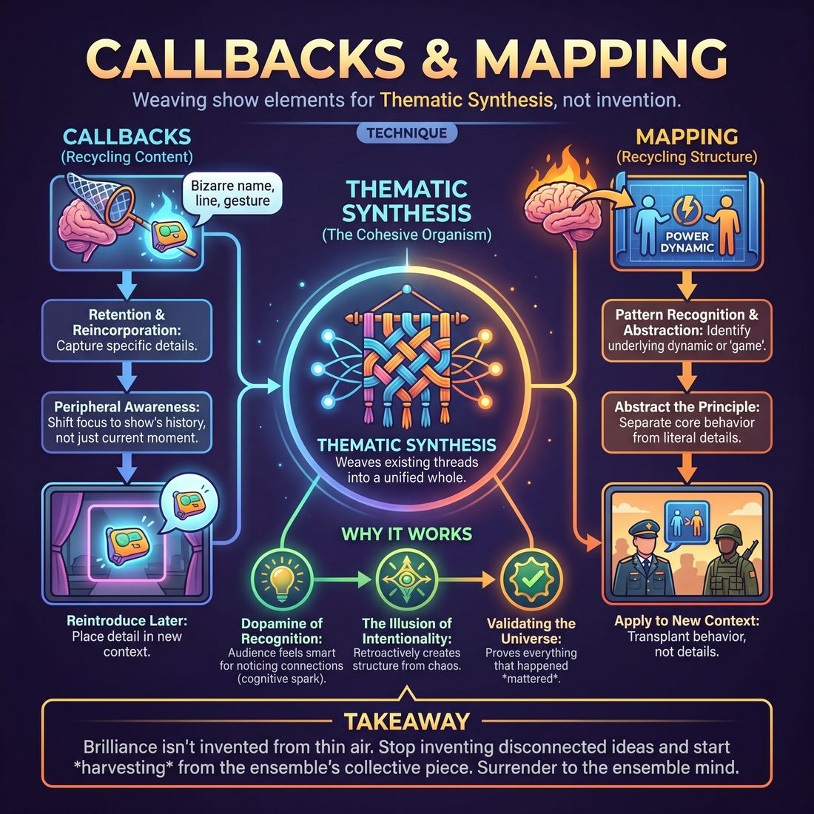

# 🎯 Callbacks & Mapping

> *A drillable muscle that trains **Thematic Synthesis**.*

{ .infographic }

## 🎯 The essence

**Callbacks & Mapping** is a foundational technique where improvisers deliberately reincorporate specific details, lines, or characters from earlier in a show (a **callback**) and transplant the underlying behavioral pattern or dynamic of a scene into a completely new context (**mapping**). At its core, this exercise forces players to stop inventing disconnected ideas and instead practice **Thematic Synthesis**—actively retaining the show's history and weaving existing threads together so the performance feels like a cohesive, intentional organism rather than a random assortment of scenes.

## 🎓 What it trains

At its core, this technique isolates and drills the improviser’s ability to weave disparate, seemingly unrelated elements into a satisfying whole. 

Improvisers, especially in their early development, often suffer from "invention fatigue." They believe that every new scene requires a brand-new premise, new characters, and new energy. This leads to a fragmented show that feels like a random assortment of disconnected sketches, leaving both the performers exhausted and the audience unmoored. Callbacks and mapping exist to solve this exact problem by training the improviser to stop inventing and start *harvesting*. 

By practicing this technique, improvisers build two distinct but related cognitive muscles:

*   **Retention and Reincorporation (Callbacks):** This trains the brain to hold onto specific details—a bizarre character name, a tossed-off line of dialogue, a peculiar physical gesture—and reintroduce them later in a new context. It builds the muscle of **Peripheral Awareness**, shifting the performer's focus from *"What am I doing right now?"* to *"What has happened in the show so far?"*
*   **Pattern Recognition and Abstraction (Mapping):** This trains the brain to identify the underlying *dynamic* or *game* of a scene, completely separate from its literal details. 

!!! example "Abstracting the Dynamic"
    If scene one is about a corporate boss treating an employee like a helpless toddler, mapping trains the improviser to extract that core dynamic (condescending authority vs. infantilized subordinate) and apply it to a completely different environment—like a four-star general briefing a hardened combat soldier.

!!! abstract "The Deeper Principle: The Ensemble Mind"
    This technique forces a shift from the individual ego to the collective piece. You cannot successfully map a dynamic or call back a detail if you are only focused on your own performance. It demands that you surrender to the ensemble, treating the entire show as a single, breathing organism where every offer is a puzzle piece waiting to be connected.

Ultimately, drilling these skills teaches improvisers that the most brilliant, audience-thrilling moments don't come from pulling a genius idea out of thin air. They come from proving to the audience that everything that happened previously *mattered*.

## 💡 Why it works

This technique hacks the human brain’s innate desire for order and pattern recognition. When an audience watches an improvised show, they know it is being made up on the spot. Callbacks and mapping exploit this expectation by suddenly introducing structure, creating the thrilling illusion that the chaos was actually planned all along.

The engine under the hood relies on three distinct psychological and group dynamics:

*   **The Dopamine of Recognition:** The human brain rewards itself for recognizing patterns. When an audience spots a callback or recognizes a mapped dynamic, they experience a cognitive spark. They feel smart for noticing the connection, transforming them from passive observers into active participants in an inside joke.
*   **Radical Reduction of Cognitive Load:** For the improviser, the pressure to constantly invent *new* premises is exhausting. This technique shifts the ensemble's brain from "creation mode" to "recycling mode." By asking, *"What do we already have?"* instead of *"What happens next?"*, performers conserve mental energy. You no longer have to invent a brand-new conflict for the third beat; you simply map the high-status/low-status dynamic from scene one onto a new environment.
*   **Validating the Universe:** Every time an element is brought back, it tells the audience and the ensemble that the world they are building has permanence. It reinforces the ensemble's peripheral awareness, moving them from tunnel-visioning on their own scenes to tracking all active threads across the entire stage. 

!!! abstract "The Illusion of Intentionality"
    Improv is inherently disposable; scenes end and are usually forgotten. When you bring an element back, you defy that disposability. The audience retroactively assumes the first instance was a deliberate setup for the second. You get credit for writing a brilliant script that doesn't actually exist.

!!! note "Content vs. Structure"
    While both trigger the same cognitive reward, they operate on different levels. **Callbacks** recycle *content* (the literal words, objects, or characters). **Mapping** recycles *structure* (the emotional game, the power dynamic, or the thematic argument). Together, they weave isolated scenes into a unified thematic synthesis.

## 🧩 The setup

Here is everything you need to prepare before running a Callbacks & Mapping drill. Because this technique relies heavily on memory and pattern recognition, setting up a focused, distraction-free environment is critical.

*   **Players & Arrangement:** A full ensemble (typically 6 to 10 players). The group should be arranged in a standard performance setup: two or three players center stage, with the rest forming a **backline** (standing at the back or sides of the stage, actively observing).
*   **Space & Materials:** A standard bare stage with two chairs. 
*   **Time:** 
    *   *Per round:* 10–15 minutes (enough time to generate 3–4 base scenes, followed by a wave of callbacks).
    *   *Total time:* 30–45 minutes, allowing for 2–3 full rounds and brief resets in between.
*   **Roles:**
    *   *Active Players:* Perform the scenes, committing fully to the reality without worrying *yet* about how it will connect.
    *   *The Backline:* Actively track and memorize details—names, objects, locations, character philosophies, and physicalities. They are the hunters looking for connection points.
    *   *Facilitator:* Tracks the "data" of the scenes. Early on, the facilitator will actively pause the action to point out missed opportunities or prompt a specific callback.
*   **Prerequisites:** Players must have a solid grasp of basic scene work (listening, agreement, establishing a base reality) and be comfortable with standard edits, particularly the **Sweep** (running across the stage to clear a scene) and the **Tag-Out** (tapping a player on the shoulder to replace them while keeping the other character).

!!! tip "The Facilitator's Whiteboard"
    When first teaching this technique, place a large whiteboard or easel pad just offstage. During the first wave of scenes, physically write down the "data" generated: character names, weird objects, specific phrases, and core relationship dynamics. Having a visual "map" helps the backline realize just how much usable material they already have before they try to invent something new.

!!! quote "How to introduce it"
    "Today, we are going to practice memory and synthesis. We're going to start by doing three completely unconnected scenes. If you are on the backline, your job is not to zone out and wait for your turn—your job is to be a sponge. I want you to mentally collect the names, the weird objects, the locations, and the core philosophies of the characters you see. 
    
    Once those three scenes are done, we are going to do a second wave of scenes. But here is the rule: **you are not allowed to invent anything new.** You can only reuse, combine, and map the elements we've already established. We are going to build a cohesive world using only the puzzle pieces we've already put on the table."

## ⚙️ The mechanics

The core objective of this technique is to train the ensemble to listen to early scenes not just for plot, but for structural dynamics and specific details, and to deliberately reincorporate them later. To isolate and drill this muscle, we run a structured exercise often called **The Source and The Echo**.

Before running the drill, the ensemble must understand the distinction between the two tools being practiced:

| Tool | What it reincorporates | Example from Scene A | Example in Scene B |
| :--- | :--- | :--- | :--- |
| **Callback** | A specific noun, phrase, physical action, or detail. | A character obsessively polishing a **blue stapler**. | A submarine captain looking through a periscope and spotting a **blue stapler** floating by. |
| **Mapping** | The underlying relationship dynamic, status play, or thematic game. | A boss who **overly praises a subordinate for mundane tasks**. | A four-star general who **overly praises a private for tying his boots correctly**. |

### The Flow of Play

The drill is executed in a strict, five-step loop to ensure players are consciously practicing both skills.

**1. Generate the Source (Scene A)**  
Two players step out and perform a grounded, two-minute scene. Their only goal is to establish a clear base reality, a defined relationship, and a recognizable dynamic or "game." 

**2. Isolate the Variables (The Pause)**  
The coach calls "Scene" and pauses the action. The ensemble briefly dissects Scene A out loud, identifying two things:
*   *The Map:* What was the core dynamic? (e.g., *"A parent trying to be 'cool' to their embarrassed teenager."*)
*   *The Callbacks:* What were three highly specific details or lines of dialogue? (e.g., *"The phrase 'That's totally tubular', the physical action of aggressively chewing gum, and the mention of a 1998 Honda Civic."*)

**3. Initiate the Map (Scene B)**  
Two new players step up. They must initiate a scene in a **completely different context** (different location, different characters, different era) but apply the exact same dynamic identified in Step 2. 
*   *Example:* An alien commander trying to use human slang to impress a newly abducted, highly unimpressed human.

**4. Execute the Callback**  
Once the mapped dynamic is firmly established and playing well, the players in Scene B (or a third player executing a walk-on) must organically weave in one of the specific details identified in Step 2. 

!!! example "In a scene"
    **Alien Commander:** "Do not fear the probing device, earthling. It is, as your people say, *totally tubular*." 
    *(The callback lands perfectly inside the new mapped context).*

**5. Edit and Reset**  
As soon as the callback is executed and the audience/ensemble recognizes the synthesis, the coach or a player on the backline performs a clean edit (a sweep or tag-out). The drill resets with two new players generating a fresh Source Scene.

### Rules & Constraints

*   **Change the context completely:** The most common mistake is setting Scene B too close to Scene A (e.g., moving from a high school classroom to the high school cafeteria). Force a massive leap in context—go to space, go to medieval times, go to the microscopic level. The wider the gap in context, the more satisfying the mapping.
*   **Map first, Callback second:** Players must establish the relationship dynamic *before* dropping the callback. If they lead with the callback, it feels like a cheap joke rather than a thematic synthesis.
*   **Don't force the puzzle piece:** If a specific callback doesn't fit the reality of Scene B, players should not break the reality just to say the word. They should rely on the mapped dynamic and wait for a natural opening.

!!! tip "On stage"
    When doing **Support Work** (like a walk-on), you don't need to invent a new character. Entering Scene B as the exact character from Scene A to deliver a callback is a powerful, advanced move that ties the universe together.

## 🎬 Sample round

To see how these two mechanics interact, watch how a team extracts both a map (a relational dynamic) and a callback (a specific detail) from a single source scene.

!!! example "Sample round: The 45-Degree Angle"
    **1. The Source Scene (Establishing the pattern)**  
    *Player A (Manager):* "Brenda, the stapler is parallel to the desk edge. It needs to be at a 45-degree angle. 45 degrees. We are not animals."  
    *Player B (Employee):* "I'm sorry, Mr. Vance. I'll get the protractor."  
    
    * **The Mechanic:** The players establish a clear, recognizable dynamic (absurdly high-stakes micromanagement over a mundane object) and a specific, memorable detail ("45 degrees").

    **2. The Mapping Scene (Applying the dynamic to a new context)**  
    *Player C (Husband):* "Susan, the peanut butter is spread linearly. It needs to be applied in concentric circles. Concentric circles. We are not animals."  
    *Player D (Wife):* "I'm sorry, honey. I'll get the compass."  
    
    * **The Mechanic:** Players C and D have **mapped** the exact rhythm, status dynamic, and catchphrase structure of Scene 1 onto the act of making a sandwich. The specific details changed, but the underlying *game* and behavioral pattern remain identical. The audience recognizes the structural echo immediately.

    **3. The Callback Scene (Reincorporating a specific detail)**  
    *Player E (Astronaut):* "Houston, we've lost the main thruster. We're spinning out of control!"  
    *Player F (Mission Control):* "Try hitting the manual override, but make sure your hand is at a 45-degree angle. 45 degrees."  
    
    * **The Mechanic:** A direct **callback** to the specific, granular detail from Scene 1, placed in a heightened, completely unrelated environment. The audience experiences the joy of thematic synthesis, recognizing the thread weaving the show together.

## 🎚️ Variations & progressions

To build the muscle of thematic synthesis, improvisers must evolve from simply remembering *what* happened to understanding *how* it felt and *why* it mattered. You can ramp the difficulty of Callbacks & Mapping by shifting the focus from literal repetition to structural echoes, aligning with the ensemble's maturity.

Here is how to progress the technique from basic stage-tracking to advanced thematic weaving:

### 1. The Literal Callback (Advanced Beginner)
At this stage, players are learning to break out of their own tunnel vision and track the wider stage. The focus is purely on **reincorporation**—bringing back a specific, tangible element.
*   **The Drill:** Instruct the ensemble to do a run of scenes. In the second half of the run, every scene must feature exactly one physical object, character name, or specific line of dialogue from the first half. 
*   **The Goal:** Train the brain to log details and execute a clean, deliberate re-entry of that information without derailing the current scene.

### 2. The Dynamic Map (Competent)
Once players can track active threads, they must learn to select the non-obvious premise. Instead of bringing back the literal object, they bring back the **behavioral dynamic** or **relationship** and place it in a completely new context.
*   **The Drill:** Play a grounded, two-person scene (e.g., a teenager trying to hide a bad report card from a suspicious parent). Cut the scene. The same two players immediately start a new scene in a wildly different environment (e.g., an astronaut trying to hide a hull breach from Mission Control), playing the exact same emotional dynamic.
*   **The Goal:** Teach players that the "game" of a scene lives in the relationship, not the location. 

!!! example "In a scene: Mapping the dynamic"
    **Scene 1:** A barista treats a customer like a hostile foreign spy just because they asked for oat milk. 
    **The Map (Scene 2):** A kindergarten teacher treats a toddler like a hostile foreign spy because they used the green crayon. The *context* changes, but the *unjustified interrogation* dynamic is mapped perfectly.

### 3. The "A to C" Callback (Proficient)
Proficient players anticipate where their teammates will go and support invisibly. Instead of a direct 1:1 callback (A to A), they bring back the logical conclusion or thematic cousin of the original idea (A to C).
*   **The Drill:** If Scene 1 establishes that a character is terrified of dogs (A), the callback in Scene 3 isn't just bringing a dog back (B). It is showing that same character wearing a suit of armor to visit a petting zoo (C). 
*   **The Goal:** Mine a previous premise for its richest, most playable angle, rewarding the audience's intelligence by making them connect the dots.

### 4. The Structural Echo (Master)
For an ensemble operating as one organism, mapping becomes structural. 
*   **The Drill:** The team maps the *pacing and rhythm* of a previous scene. If the opening scene was a frantic, overlapping argument with three people, a later scene features three different characters in a frantic, overlapping celebration. 
*   **The Goal:** Surrender ego entirely to the piece. The callback is no longer a punchline; it is a musical motif that gives the show a subconscious feeling of unity.

!!! tip "On stage: Let it breathe"
    A common mistake when drilling callbacks is rushing to deploy them in the very next scene. Teach players to let an idea rest. A callback is always more satisfying when the audience has had a moment to forget about it.

## 🧑‍🏫 Coaching notes

As a coach, your primary job during Callbacks & Mapping exercises is to calibrate the ensemble’s subtlety and memory. You are training their peripheral awareness—moving them from tunnel-visioning on their current scene to tracking all active threads across the entire piece. 

Your side-coaching should push players past the first, most obvious associations and encourage them to weave elements together organically.

!!! tip "Coaching: The Golden Cue"
    **"Map the dynamic, not just the noun."**  
    When improvisers first learn this technique, they rely on literal callbacks—bringing back a specific character's catchphrase or a weird prop. Push them to map the *relationship* or *behavior*. If Scene 1 featured a barista treating a customer like a hostile witness, side-coach Scene 2 (two astronauts) with: *"Who is the barista here? Interrogate your co-pilot."*

### The Side-Coaching Menu
Use these specific call-outs while the scene is in motion to guide the ensemble's focus:

*   **To trigger a mapping:** *"Play the exact same game, but change the location."* or *"Who has the high status from the last scene?"*
*   **To refine a clumsy callback:** *"Justify it. Why is that object here right now?"*
*   **To prevent forcing:** *"Play the scene you are in first. Earn the callback."* or *"Breathe. Let the connection find you."*
*   **To encourage thematic synthesis:** *"What is the core philosophy of this show so far? Prove it in this scene."*

### What 'Good' Looks and Sounds Like
When the ensemble is executing this technique well, you will observe specific shifts in their play:

*   **The "Aha!" Ripple:** You will hear a distinct, rolling wave of laughter or a collective gasp from the audience (or the rest of the class). This is the sound of recognition clicking into place just *before* the improviser finishes the line.
*   **Standalone Integrity:** A well-mapped scene stands on its own two feet. If a newcomer walked into the theater during the callback, they would still see a grounded, functional scene, completely unaware they were missing an inside joke.
*   **Invisible Support:** You will see players exhibiting Stage 4 support work. They aren't entering to grab focus or steal the scene with a loud callback; they are supporting invisibly, offering exactly the thematic echo the scene needs, and then stepping back. 

!!! note "Calibrating the Edit"
    Watch their **Pacing & Rhythm**. A brilliant callback often serves as the perfect button to a scene. If a player lands a masterful, unexpected callback that ties two threads together, side-coach the edit immediately: *"Sweep that! That's the peak."* Do not let them talk past the synthesis.

## 🧭 Debrief & reflection

A strong debrief after a Callbacks & Mapping exercise moves players away from trying to be "clever" and toward trusting their peripheral awareness. The goal is to demystify the process—showing that a great callback isn't a magic trick, but the inevitable result of paying deep attention to the ensemble's work.

Use these questions to guide the post-round reflection:

*   **On awareness:** *"What was a tiny, seemingly throwaway detail from the first scene that became the anchor for the callback?"* 
*   **On mapping:** *"When we mapped the first scene onto the second, what was the core dynamic or behavior we preserved? What did we change to make it fit the new context?"*
*   **On effort:** *"Did the second beat feel easier or harder to play than the first? Why?"*
*   **On timing:** *"How did you know it was the right moment to bring that element back? Did it feel forced, or did the scene ask for it?"*

A successful debrief will surface a few key "aha!" moments. First, players will realize that thematic mapping (reusing an emotional pattern, a status dynamic, or a philosophical stance) feels infinitely richer than a literal callback (just repeating a funny catchphrase). 

Second, they will recognize a shift in their own mental effort. Novice improvisers often feel the burden of constantly inventing new ideas. Through reflection, they discover that mapping actually *reduces* the pressure to invent. The show has already provided the raw materials; their only job is to recognize and reuse them.

!!! warning "Watch out for the 'cleverness' trap"
    It is easy for a callbacks debrief to devolve into players congratulating each other on how funny or smart a specific connection was. Gently steer them back to the *mechanics*. Praise the **listening** that allowed the callback to happen, rather than the joke itself. Ask: *"What were you tracking in your head that allowed you to make that connection?"*

Ultimately, the reflection should reinforce the ensemble goal: surrendering the ego to the piece. When players realize that the best material comes from weaving together what their teammates have already built, they stop trying to steal focus and start playing the whole show as a single organism.

## ⚠️ Common pitfalls

!!! warning "Watch out: The 'Shoehorn' Callback"
    The most glaring novice mistake is forcing a callback into a scene where it doesn't belong, simply to prove you remembered it. If a scene is grounded in a tense, emotional breakup, suddenly having a teammate walk in holding the "wacky magic spatula" from Scene 1 destroys the current reality. A callback must serve the scene it enters, not just the ego of the improviser making it.

When improvisers first learn to track the wider show, the cognitive load of remembering past scenes while playing in the present can cause several distinct breakdowns. Watch for these common traps:

*   **The Catchphrase Trap (Superficial Callbacks):** Novices often play the first, most obvious association. They think a callback means simply repeating a funny line, a weird voice, or a specific noun to get a cheap laugh of recognition.
    *   *The Fix:* Callback the **behavior** or the **dynamic**, not just the words. If a character in Scene 1 was hilariously passive-aggressive about doing the dishes, bring back that *exact passive-aggressive energy* in a scene about defusing a bomb. 
*   **The Carbon Copy (Literal Mapping):** When attempting to map a previous scene's game onto a new one, improvisers sometimes fail to change enough variables. The new scene feels like a boring repeat rather than a clever re-contextualization.
    *   *The Fix:* Change the *what* and the *where*, but keep the *how* and the *why*. If the original scene was a boss firing an employee like a bad romantic breakup, map that dynamic to a completely different scale—like a child kicking out an imaginary friend.
*   **The Historian (Cognitive Overload):** An improviser tries to mentally record every single detail of the show, causing them to tunnel-vision. They stop listening to the *current* scene because they are frantically scanning their mental archives for a callback opportunity.
    *   *The Fix:* Relax your grip. You do not need to memorize the show. Trust your peripheral awareness. If you stay deeply present in the current moment, your brain will naturally recognize thematic echoes when they arise organically.
*   **Stepping on the Edit:** Recognizing a callback opportunity and rushing on stage to deliver it right as the scene is naturally concluding, ruining the pacing and missing the exit.
    *   *The Fix:* A callback is a spice, not the main course. If the scene has already peaked, let the edit happen. Save the connection for the next beat.

## 🌟 What mastery looks like

At the highest level of execution, Callbacks & Mapping transcend a simple memory test. A master improviser doesn't just repeat a funny line for a cheap applause break; they use these tools to reveal that the entire show is **one living organism**. 

When this technique is performed brilliantly, the seams of the improvisation disappear. The audience stops seeing individual scenes and starts seeing a cohesive, unified piece of theater.

Here is what mastery of this technique looks like on stage:

*   **Thematic, not just literal:** While a novice calls back a specific prop or catchphrase, a master calls back a *dynamic*, an *emotion*, or a *philosophy*. They map the core engine of a previous scene onto a completely new environment.
*   **Ego fully surrendered:** The callback is never a neon sign flashing, *"Look what I remembered!"* Instead, it is offered as a gift to elevate a teammate's scene. The master provides off-focus support, giving exactly what the moment needs to resonate, and then gets out of the way.
*   **Pacing that breathes:** A master doesn't rush to map a scene immediately. They hold the tension, allowing the show's pacing to breathe, and place the callback at the exact emotional peak of the piece. The arrival feels both surprising and entirely inevitable.
*   **Invisible architecture:** The mapping is so seamless that the audience feels the resonance of the pattern before they consciously recognize it. 

!!! example "In a scene: Literal vs. Masterful Mapping"
    **Scene 1:** A boss is firing an employee over a stolen stapler. The comedic dynamic is that the boss is overly gentle and apologetic, while the employee aggressively demands to be punished and humiliated.
    
    *   **The Novice Callback:** In Scene 3, an improviser randomly walks on holding a stapler and repeats the boss's funny catchphrase. It gets a laugh of recognition, but halts the current scene.
    *   **The Masterful Map:** Scene 3 is a medieval king knighting a squire. The master maps the *dynamic* from Scene 1: the king is overly gentle and apologetic about the heavy armor, while the squire aggressively demands to be sent on a brutal suicide mission. The audience feels the brilliant echo of the earlier scene without a single stapler in sight.

!!! abstract "The Invisible Script"
    When Callbacks & Mapping are mastered, the thematic synthesis is so tightly woven that the audience will frequently approach the cast after the show and ask, *"How much of that was written beforehand?"* The master improviser has successfully turned a series of disconnected suggestions into a singular, resonant premise.

## 🔗 Why it matters

Callbacks and mapping are the physical engines of thematic synthesis. If synthesis is the abstract goal of weaving a show's disparate threads into a cohesive tapestry, callbacks and mapping are the needles doing the actual work. They are the observable, repeatable actions that prove to the audience—and to the cast—that every moment matters and nothing is forgotten.

This technique is a direct manifestation of the **Ensemble** domain's ultimate goal: surrendering ego to the piece. To execute a meaningful callback or successfully map a dynamic, you must elevate a teammate's earlier idea over your own desire to invent something entirely new. It forces you to stop looking at your own scene in isolation and start treating the entire show as a single, living organism—the hallmark of a master-level ensemble player. 

In the wider craft of improvisation, mastering this muscle shifts a performer's mindset from *invention* to *recognition*. Novice improvisers often believe their job is to constantly generate new information, which exhausts the cast and overwhelms the audience. Callbacks and mapping teach a vital lesson in theatrical economy: you already have everything you need. 

By reusing, recontextualizing, and mapping what has already been established, you build a richer, more satisfying world. You stop working so hard to build the house, and start living in it.

## 📚 References & Further Reading

### Foundational sources
*   **Keith Johnstone, *Impro: Improvisation and the Theatre* (1979)** — The "Narrative Skills" chapter is the definitive text on "reincorporation." Johnstone argues that improvisers should act like "a man walking backwards," looking at what has already been established rather than trying to invent the future, which explains why audiences inherently applaud when earlier material is brought back.
*   **Charna Halpern, Del Close, and Kim "Howard" Johnson, *Truth in Comedy: The Manual of Improvisation* (1994)** — The foundational text on the Harold structure. It explains how the "group mind" is achieved not by planning ahead, but by actively listening and weaving disparate scenes together in the third beat to create a unified thematic synthesis.

### Practitioner guides & manuals
*   **Matt Besser, Ian Roberts, and Matt Walsh, *The Upright Citizens Brigade Comedy Improvisation Manual* (2013)** — The definitive guide to "Mapping." It explicitly breaks down how to abstract the "Game of the Scene" (the core comedic dynamic) and map that exact behavioral pattern onto completely new environments, characters, and relationships.
*   **Will Hines, *How to Be the Greatest Improviser on Earth* (2016)** — Offers advanced, practical advice on playing the game and being present. Hines emphasizes trusting the established reality and harvesting existing details rather than suffering from the "invention fatigue" that plagues intermediate players.

### Lineage & teachers
*   **Upright Citizens Brigade (UCB)** — The theater and training center that formalized the concept of "Mapping" as a specific, teachable tool for playing and heightening the comedic game across different beats of a show.
*   **iO Theater (formerly ImprovOlympic)** — The Chicago institution where Del Close and Charna Halpern developed the Harold, making thematic synthesis, callbacks, and the interconnectedness of seemingly random scenes the gold standard of modern long-form improv.
*   **Loose Moose Theatre Company** — Founded by Keith Johnstone in Calgary, this theater pioneered the philosophy that narrative structure is built through reincorporation rather than invention, fundamentally shifting how improvisers view storytelling.

### Research & theory
*   **Carl Marci, MD, *The Neuroscience of Humor and Laughter* (Harvard Medical School research, 2010)** — Explores how the brain's frontal lobe searches for pattern recognition. When an audience recognizes a callback or a mapped dynamic, the resolution of that pattern triggers the nucleus accumbens, releasing a dopamine reward loop—the literal cognitive "spark" of recognition.
*   **Brian Magerko et al., *Cognitive Models of Improvisation* (Georgia Institute of Technology, 2009)** — Academic research on the cognitive science of improvisation. The study demonstrates how improvisers use "referents" (previously established knowledge, characters, or structures) to significantly reduce cognitive load, allowing the brain to process complex, real-time collaborative decisions without becoming overwhelmed.

### Talks, videos & courses
*   **Matt Besser, *Improv4Humans* (Podcast, 2011–Present)** — An ongoing audio masterclass in mapping; Besser and his guests routinely take a single comedic premise and map it across three or four different realities in a single episode, demonstrating the technique in real-time.
*   **Will Hines, *Improv Nonsense* (Blog & Podcast)** — A highly analytical breakdown of UCB-style game play, frequently discussing the mechanics of callbacks, mapping, and how to build a cohesive world without overthinking.

### Communities & adjacent reading
*   **John Vorhaus, *The Comic Toolbox: How to Be Funny Even If You're Not* (1994)** — A foundational comedy writing manual that explores how to identify a "comic premise" and escalate it. Vorhaus's theories on escalating a joke are the scripted equivalent of mapping an improvised dynamic.
*   **Sketch Comedy Writing (General Discipline)** — The structural backbone of sketch comedy relies heavily on mapping. Studying the structure of modern sketch shows (such as *Key & Peele* or *I Think You Should Leave*) provides a perfect blueprint for how to transplant a single comedic game into escalating, increasingly absurd contexts.

## 💬 Quotes & Anecdotes

!!! quote "— Keith Johnstone, *Impro: Improvisation and the Theatre* (1979)"
    The improviser has to be like a man walking backwards. He sees where he has been, but he pays no attention to the future. His story can take him anywhere, but he must still 'balance' it, and give it shape, by remembering incidents that have been shelved and reincorporating them.

!!! quote "— Keith Johnstone, *Impro: Improvisation and the Theatre* (1979)"
    Very often an audience will applaud when earlier material is brought back into the story. They couldn't tell you why they applaud, but the reincorporation does give them pleasure.

!!! quote "— Del Close, *Truth in Comedy* (1994)"
    Where do the really best laughs come from? Terrific connections made intellectually, or terrific revelations made emotionally.

!!! quote "— Charna Halpern, Del Close, and Kim "Howard" Johnson, *Truth in Comedy* (1994)"
    Because the laughs in a Harold come from the connections made in the work, the audience has to see where the information originated. In other words, they are involved with the development of the piece right from the very start.

### Where it comes from

The concept of **Callbacks** (originally termed "Reincorporation") was heavily championed by Keith Johnstone in his 1979 book *Impro*. Johnstone observed that while free association is great for generating raw, spontaneous material, it is the deliberate act of reincorporating earlier elements that actually creates narrative structure and deeply satisfies the audience. 

The practice of **Mapping**—specifically extracting the underlying "game" or dynamic of a scene and transplanting it into a new, analogous environment—was formalized by the Upright Citizens Brigade (Matt Besser, Ian Roberts, and Matt Walsh). In their *Comedy Improvisation Manual* (2013), they codified mapping as a primary tool for "heightening" a scene's premise, allowing performers to escalate a comedic idea without having to invent entirely new premises from scratch.

Meanwhile, the broader philosophy of weaving disparate threads together into a cohesive whole was the driving force behind Del Close and Charna Halpern's development of the Harold in Chicago. They taught that the ensemble's ultimate goal was to build a web of connections, transforming a series of disposable, random scenes into a unified theatrical piece.

### A telling example

**An illustrative scenario of Mapping:**
Imagine a first-beat scene where a teenager is trying to borrow the family car, but their father interrogates them with the intense, table-slamming paranoia of a hardboiled noir detective. The underlying dynamic (the "game") is *treating a mundane domestic request like a gritty murder investigation*. 

Later in the show, the improvisers decide to **map** this dynamic to a completely different context. The lights come up on a kindergarten classroom. A teacher is interrogating a five-year-old about who ate the class guinea pig's food, using the exact same hardboiled, chain-smoking detective persona. The audience erupts in laughter. They aren't laughing because the new scene is inherently hilarious on its own; they are experiencing the dopamine hit of recognizing the transplanted structure from the earlier scene.

**The power of the Callback:**
In *Truth in Comedy*, the authors note that audiences love callbacks because they feel like they are "in on the joke." If a player in an opening monologue casually mentions a bizarre childhood fear of "left-handed dentists," that detail is shelved. Three scenes later, two players are in a dental office. One player picks up a drill with their left hand, and the other player instantly screams and flees the room. The improvisers didn't have to invent a clever punchline; they simply harvested a detail that the audience had already witnessed being created, rewarding them for paying attention.

## 🧭 Explore the framework

- ⬆️ **Skill it trains:** [Thematic Synthesis](04_S5__thematic-synthesis.md)
- 🎭 **Domain:** [The Ensemble](04_D__the-ensemble.md)
- 🔁 **Sibling techniques:** [Weave the threads](04_S5_T2__weave-the-threads.md)
