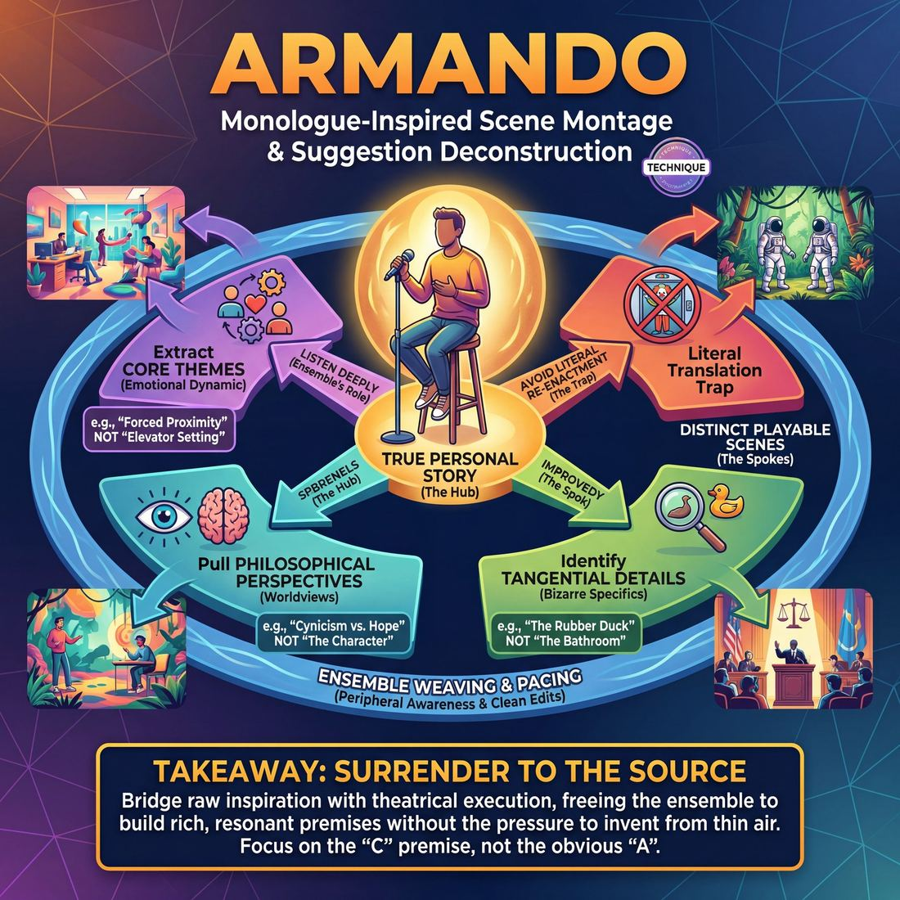

# 🎯 Armando

> *A drillable muscle that trains **Format Literacy**.*

{ .infographic }

## 🎯 The essence

The **Armando** (originally the *Armando Diaz Experience, Theatrical Movement and Hootenanny*) is a foundational long-form structure where a true, personal monologue inspires a montage of improvised scenes. As a training technique, it isolates and drills **suggestion deconstruction** on a grand scale. 

Instead of building a scene from a single audience word, the ensemble must listen deeply to a sprawling, unscripted story. Their job is to extract its core themes, emotional perspectives, or bizarre tangential details, and translate those sparks into distinct, playable scenes—without ever simply re-enacting the storyteller's literal events.

## 🎓 What it trains

The Armando is fundamentally a workout in **Format Literacy** and suggestion deconstruction. It bridges the gap between raw inspiration and theatrical execution, forcing improvisers to process a nuanced piece of source material and multiply it into several playable premises.

For an improviser, the Armando exists to solve the "literal translation" trap. When a monologist tells a story about getting stuck in an elevator with a clown, a novice will immediately initiate a scene set in an elevator with a clown. The Armando breaks this habit. It trains the cast to mine for underlying dynamics rather than simply reenacting the plot. 

By practicing this format, improvisers isolate and drill several critical muscles:

*   **Thematic Listening:** Training the ear to catch the *dynamic* rather than just the *setting*. Instead of playing the elevator, the improviser plays the theme of "forced proximity with an absurd person." This pushes players past the obvious association to find a richer, non-obvious premise.
*   **Ensemble Weaving:** Building **Peripheral Awareness**. If one improviser initiates a scene based on a specific character from the monologue, the next player must recognize that choice and pull a philosophical theme instead. The ensemble learns to track all active threads and use every part of the source material without repeating each other.
*   **Pacing & Rhythm:** The format relies heavily on the ensemble's internal clock. Players must sense when a sequence of scenes has peaked and execute a clean edit to clear the stage and invite the monologist back out. 

!!! abstract "The Deeper Principle: Surrendering to the Source"
    At its core, the Armando serves the domain of **The Ensemble**. It demands that players surrender their pre-planned ideas and personal egos to serve the monologist's truth. The cast must operate as a single organism, refracting one true story into a kaleidoscope of different theatrical realities.

## 💡 Why it works

The engine under the hood of the Armando relies on a powerful psychological and structural mechanism: **cognitive offloading** through shared truth. By separating the generation of source material from the execution of scenes, the format frees the ensemble to play with greater depth, sharper focus, and less panic.

Here is why this dynamic is so effective:

*   **It removes the pressure to invent:** Improvisers often feel a crushing need to generate clever premises out of thin air. The Armando bypasses this entirely. The monologist provides a rich tapestry of raw material—characters, locations, philosophies, and emotions. The ensemble’s only job is to listen, select, and play. 
*   **It anchors the show in reality:** Improv can easily spiral into untethered absurdity. Starting with a genuine, lived experience provides a bedrock of authentic human behavior. Even if the subsequent scenes become heightened or surreal, they remain tethered to the emotional truth of the opening story.
*   **Vulnerability breeds investment:** When a storyteller shares a true, slightly vulnerable personal anecdote, it instantly hooks the audience. It breaks down the barrier between the stage and the house, creating a shared intimacy that elevates the stakes of the scenes that follow.
*   **The "Hub-and-Spoke" cohesion:** Structurally, the monologue acts as a central hub, with the scenes radiating outward like spokes. Because every scene is inspired by the same source, the show naturally develops thematic resonance. The ensemble doesn't have to force connections; the audience's brain automatically does the work of linking the scenes back to the storyteller's core theme.

!!! abstract "The Engine of Deconstruction"
    The Armando is a masterclass in **A-to-C thinking**. While a novice might hear a story about a bad date and immediately initiate a scene about a bad date (the obvious "A" association), the format gives the ensemble time to mine for the richest angle. By listening deeply, improvisers bypass the literal plot and pull a specific emotional dynamic, a bizarre passing detail, or a philosophical worldview (the non-obvious "C" premise) to fuel their scenes.

!!! tip "On stage"
    The format works because it forces the ensemble into a state of active, passive reception. You cannot plan your scene while the monologist is speaking; you must surrender your ego to their story, trusting that the inspiration will be there when the lights shift.

## 🧩 The setup

Here is everything you need to arrange before stepping on stage or starting the clock in a rehearsal. 

*   **Players & Group Size:** 6 to 10 players. This provides enough variety for scenes and group mind without overcrowding the stage or leaving players stranded on the backline.
*   **Arrangement:** One player (the **Monologist**) sits or stands center stage. The rest of the cast (the **Ensemble**) stands in the wings or along the **backline** (the upstage edge of the performance space), angled so they can clearly hear the monologue while remaining visible to the audience.
*   **Space & Materials:** A clear stage. A single stool or chair placed center stage is highly recommended. 
*   **Time:** 20–30 minutes for a full performance piece. In a workshop setting, you might run 10–15 minute "micro-Armandos" to give multiple players the chance to practice the monologist role.
*   **Roles:**
    *   **The Monologist:** Shares true, personal, unscripted stories inspired by an audience suggestion. They speak directly to the audience as themselves, not as a character.
    *   **The Ensemble:** Listens actively to the monologue, extracts themes, details, or premises, and performs a montage of scenes inspired by the story.
    *   **The Host (Optional):** Steps out first to warm up the crowd, get a single word suggestion, and introduce the monologist.
*   **Prerequisites:** Players should be comfortable with basic two-person scene work, **sweep edits** (running across the downstage edge to cleanly end a scene), and basic deconstruction.

!!! tip "The Power of the Stool"
    Using a stool isn't just a stylistic choice; it is a vital piece of stagecraft. When the monologist sits, it physically grounds them and signals to the audience: *“A story is happening, not a scene.”* When the ensemble sweeps the stage, the monologist simply stands and steps back, instantly clearing the space for the improvisers.

!!! quote "How to introduce it"
    "We are going to learn the Armando. We'll get a single word from the audience. Our monologist will step center stage, take that word, and tell a true, personal story from their life. The rest of you will listen from the wings. 
    
    When the story sparks an idea for a scene, someone will sweep the stage, the monologist will step back, and we will play a montage of scenes inspired by the themes, characters, or tiny details of that story. When the scenes naturally wind down, the monologist steps back out to tell another story, and the cycle repeats."

## ⚙️ The mechanics

The Armando operates on a continuous pendulum swing between grounded, truthful storytelling and heightened, theatrical scene work. The core objective is to use a single, authentic monologue as the fuel for a series of interconnected, improvised scenes, creating a thematic collage rather than a linear narrative.

### The Flow of Play

A standard Armando runs for 20 to 30 minutes and follows a distinct, repeating cycle:

1. **The Suggestion:** The host or the designated Monologist (often a guest, sometimes a cast member) asks the audience for a single word or phrase to inspire a true story.
2. **The First Monologue:** The Monologist steps center stage. The ensemble stands on the wings or backline, actively listening. The Monologist tells a true, unfiltered, and entirely improvised personal story inspired by the suggestion. 
3. **The Scene Work (First Beat):** As the monologue naturally concludes (or when an improviser feels a strong spark), an ensemble member initiates a sweep edit or simply steps out to begin a scene. The ensemble performs a run of 3 to 5 scenes inspired by the themes, characters, or details of the monologue.
4. **The Return:** Once the first run of scenes feels complete or energy begins to dip, the Monologist steps back center stage. The ensemble immediately clears. The Monologist tells a *new* true story, this time inspired by something that just happened in the preceding scenes.
5. **The Cycle Continues:** The ensemble performs a second beat of scenes based on the new monologue (and often weaving in characters or themes from the first beat). This loop (Monologue $\rightarrow$ Scenes $\rightarrow$ Monologue $\rightarrow$ Scenes) repeats 2 to 4 times.
6. **The Resolution:** The piece concludes either with a final, culminating scene that ties the thematic threads together, or a brief, poignant final monologue. The lights fade to black.

!!! tip "On stage: The Backline"
    When the Monologist is speaking, the ensemble's job is active, hungry listening. Don't just wait for your turn to speak. Listen for odd details, emotional dynamics, philosophical statements, or throwaway lines. You are mining for premises.

### The Mechanics of Inspiration (A-to-C)

The most critical mechanic of the Armando is how the ensemble translates the monologue into scene work. The rule is **inspiration, not reenactment**. 

If the ensemble simply acts out the story the Monologist just told, they rob the audience of discovery. Instead, improvisers must use A-to-C thinking to find the non-obvious premise.

| The Monologue Detail (A) | Reenactment (Avoid) | The Thematic Premise (C) | Scene Initiation (The Flight) |
| :--- | :--- | :--- | :--- |
| "My dad always packed the station wagon like he was playing Tetris." | Playing a dad yelling at his kids while packing a car. | The obsession with perfect spatial organization in high-stakes situations. | Two surgeons arguing over how to perfectly arrange the organs back inside a patient. |
| "I got caught stealing a $2 lip balm when I was twelve." | Playing a twelve-year-old getting caught by a security guard. | The overwhelming, disproportionate guilt of a minor infraction. | A mob boss confessing to a priest that he accidentally used someone else's Netflix profile. |
| "My grandmother believed ghosts lived in the radiator." | Playing a grandmother talking to a radiator. | Normalizing the supernatural in everyday domestic life. | A couple casually discussing whether to invite the poltergeist to their dinner party. |

!!! abstract "Key idea: The Three Buckets"
    When listening to the monologue, sort your inspiration into three buckets:
    
    1. **The Dynamic:** The relationship or emotional core (e.g., a mentor who gives terrible advice).
    2. **The World:** The specific location or occupation mentioned (e.g., a 1990s Blockbuster Video).
    3. **The Tangent:** A bizarre, throwaway phrase the Monologist used (e.g., "He had the confidence of a wet cat"). 
    
    Pull from any bucket to start a scene.

### Rules & Constraints

* **The Monologue must be true.** The power of the Armando lies in the contrast between the vulnerability of real life and the absurdity of improv. If the Monologist invents a fictional stand-up routine, the scenes lose their anchor.
* **The Monologist is the ultimate editor.** While the ensemble can edit each other's scenes, the Monologist has the power to edit *any* scene simply by stepping center stage. When the Monologist steps out, the stage must instantly clear.
* **Leave the Monologist out of it.** Unless the Monologist is also playing in the scenes (which varies by troupe), the ensemble should not play the Monologist as a character. Protect their vulnerability by exploring their *themes*, not mocking their *life*.

## 🎬 Sample round

!!! example "Sample round: The Armando"
    **The Suggestion:** "Bicycle"

    **The Monologue:**
    The guest monologist steps center stage. *"When I was ten, I got a bright red Schwinn. I thought it made me the coolest kid in the neighborhood, but I didn't know how to use the handbrakes. I ended up flying over the handlebars into Mrs. Gable's prized rose bushes. She didn't yell; she just handed me a band-aid and a pruning shear and told me to get to work."*

    **Scene 1: The Thematic Pull (The illusion of coolness)**
    *The cast steps out to initiate based on the core emotional theme of the story.*
    **Player A:** *(Pops collar, leaning against a wall)* "Yeah, I drink my milk whole. Two percent is for babies."
    **Player B:** "Whoa. You're so mature, Kevin. Do you... do you know how to tie your shoes yet?"
    **Player A:** *(Panicking slightly)* "Velcro is a stylistic choice, okay?!"
    *Annotation:* The players avoid doing a literal scene about a bike crash. Instead, they play the *feeling* of a kid trying to project an unearned coolness, mining the story for a highly playable emotional dynamic.

    **Scene 2: The Detail Pull (The calm reaction to chaos)**
    *A sweep edit clears the stage. Two new players step out, focusing on the specific detail of Mrs. Gable's reaction.*
    **Player C:** *(Miming sipping tea while a siren wails in the background)* "Well, the kitchen is fully engulfed in flames."
    **Player D:** *(Covered in imaginary soot)* "I am so sorry, Brenda. The turkey just exploded."
    **Player C:** "It's quite alright, David. Here is a spatula and a fire extinguisher. Start with the drapes."
    *Annotation:* This scene isolates a specific character archetype from the story—extreme calm and immediate delegation in the face of disaster—and transplants it into a completely new setting.

    **Scene 3: The Abstract Pull (Lack of brakes)**
    *Another edit. The players take the literal idea of "no brakes" and apply it metaphorically.*
    **Player E:** "So, we're buying the company, merging with our rival, and launching a rocket to Mars?"
    **Player F:** "Yes! And I just bought a zoo!"
    **Player E:** "Sir, we need to slow down. We don't have the capital!"
    **Player F:** "I cut the brakes on this corporation years ago, Jenkins! We're flying over the handlebars of industry!"
    *Annotation:* The scene uses the mechanical failure from the monologue as a metaphor for a runaway business deal, demonstrating advanced suggestion deconstruction.

    **The Transition:**
    *A player sweeps the stage, and the monologist steps back out to deliver a second story, inspired either by a new suggestion or by the themes generated in the first run of scenes.*

## 🎚️ Variations & progressions

The Armando is highly modular. By tweaking how the monologue is delivered or how scenes are initiated, you can isolate specific ensemble muscles and scale the difficulty from novice to master.

Here are the most common variations, ordered roughly by the maturity required to execute them well:

**1. The Cast Armando (The ASSSSCAT Model)**
Instead of a single guest monologist, the cast shares the storytelling responsibility. After a run of scenes, any cast member can step forward from the backline to deliver a new true story inspired by the preceding scenes. 
*   **What it trains:** Suggestion deconstruction at a higher level. It forces the entire ensemble to practice pulling non-obvious premises from scenes to generate personal associations, rather than relying on a guest to provide the fuel.

**2. The Character Armando (The Documentary)**
The monologist does not speak as themselves, but adopts a strong persona (e.g., a disgruntled mall Santa, a 19th-century prospector, or an overly intense middle school principal). The cast then performs scenes inspired by this character's bizarre worldview.
*   **What it trains:** Theatricality and active listening. The cast must deconstruct the *perspective* and *themes* of the character, not just the literal events they describe.

!!! example "In a scene"
    If the Character Monologist is a paranoid UFO spotter talking about "the lights over the Arby's," the cast shouldn't just play aliens at Arby's. A master improviser will mine the *richest angle*: a scene about a husband who obsessively finds conspiracies in his wife's mundane grocery list.

**3. The Intercut (or "Living") Armando**
The monologist remains center stage for the entire piece. Instead of waiting for the story to finish, improvisers initiate scenes *around* the monologist, sometimes freezing them mid-sentence with a sweep or a lighting cue, playing the scene, and then sweeping back to unfreeze the storyteller.
*   **What it trains:** Pacing, rhythm, and peripheral awareness. The ensemble must feel when the monologue has hit a perfect launchpad, edit at the exact right moment, and see the entire show as one breathing organism. 

**4. The Sybil (Solo Armando)**
A master-level challenge where a *single improviser* performs the monologue and then plays all the characters in the resulting scenes, sweeping themselves to transition. 
*   **What it trains:** Ultimate ego surrender and tracking. Without a team to rely on, the improviser must flawlessly track all active threads and provide their own off-focus support.

!!! tip "On stage: Ramping difficulty in rehearsal"
    If your team is stuck tunnel-visioning on their own scenes, run a **One-Pull Armando**. The monologist tells a story, and the coach pauses the room. Every single improviser must state out loud the premise they would initiate. This forces the team to move past the first, most obvious association and hunt for the "C" premise.

## 🧑‍🏫 Coaching notes

When coaching the Armando, your primary job is to manage the translation layer between the monologue and the scenes. You are watching how the ensemble listens, how they deconstruct the story, and how they manage the rhythm of the piece. 

!!! tip "Coaching: Play the premise, not the plot"
    The single most important cue in an Armando is to stop players from simply re-enacting the monologue. If the storyteller talks about a disastrous first date at a sushi restaurant, novices will immediately initiate a scene at a sushi restaurant. 
    
    **Call out:** *"Play the dynamic, change the location!"* Force them to extract the *theme* (e.g., trying too hard to impress someone) and apply it to a completely different world (e.g., an astronaut trying to impress an alien, or a knight polishing his armor too aggressively).

### Coaching the Monologist
The storyteller sets the tone for the entire piece. Watch for performers who try to do stand-up comedy or invent fictional bits. 
* **Demand vulnerability:** Remind them that truth is more inspiring than fiction. If they are fishing for jokes, side-coach: *"Just tell us what actually happened."*
* **Encourage details:** Vague stories yield vague scenes. Prompt them to name names, describe smells, and specify locations. Side-coach: *"Paint the picture."*

### Coaching the Ensemble (The Backline)
While the monologue is happening, watch the backline. Are they checked out, or are they **listening like thieves**? 
* **Deconstruction:** Novices will grab the first, most obvious association. Push them toward "C" premises. If the story mentions a red car, the scene shouldn't be about a red car; it should be about the *feeling* of driving fast to escape your hometown.
* **Initiations:** Look for strong, immediate step-outs the moment the monologue ends. Hesitation kills the energy. 

### Essential Side-Coaching Cues
Use these quick, actionable phrases during a rep to steer the ensemble without stopping the flow:

* **"Pull a line!"** — Use this when the ensemble is struggling to initiate. It prompts them to take a literal phrase the monologist said and use it as their opening line.
* **"New world!"** — Yell this if the players initiate a scene in the exact same setting as the monologue. It forces them to abstract the theme.
* **"Support what's there!"** — Use this when a player enters a scene to grab focus or introduce a wild new element, rather than elevating the established game. 
* **"Sweep!"** — The most common pacing issue in an Armando is letting scenes run long. When a scene hits a laugh or a thematic peak, and the backline hesitates, call the edit for them. Over time, they will internalize this rhythm.

!!! warning "Watch out for 'The Lineup'"
    A common trap is for the backline to stand rigidly in a straight line, waiting for their "turn" to initiate. Coach them to relax, share focus, and maintain peripheral awareness. They should be ready to provide off-focus support—like becoming a piece of furniture or providing a sound effect—giving exactly what the scene needs, and then cleanly exiting.

## 🧭 Debrief & reflection

After the final edit of an Armando, the debrief must shift the ensemble’s focus away from "was that funny?" and toward the mechanics of the format. The goal is to evaluate how well the team mined the source material, supported each other, and managed the rhythm of the piece.

Use these targeted questions to guide the reflection:

*   **Mining the Monologue:** "Which scenes felt directly inspired by a specific detail in the monologue, and which felt disconnected?" "Did we play the first, most obvious association, or did we successfully select a non-obvious 'C' premise?"
*   **Ensemble Support:** "When you initiated a walk-on or tag-out, what were you trying to provide?" "Were we supporting invisibly by giving exactly what was missing, or were we entering to grab focus?"
*   **Peripheral Awareness:** "How well did we track all active threads? Did anyone notice a thematic connection between two scenes that we could have heightened?"
*   **Pacing and Edits:** "Who felt a scene go on too long, and what stopped you from editing?" "Did our edits arrive at the right moment, or did we miss the exit?"

!!! tip "For the Coach: Focus on the connective tissue"
    Players will naturally want to talk about the content of their specific scenes. Gently steer them back to the format literacy. Ask them about the transitions, the callbacks, and how the scenes served the monologist's original inspiration. 

**What a good debrief surfaces:**
A productive reflection reveals the gap between individual scene-work and ensemble mind. Players will often realize they were tunnel-visioning on their own ideas rather than tracking the stage. 

Crucially, a strong debrief highlights the difference between *forcing* a connection to the monologue (e.g., playing the exact story the monologist just told) and *deconstructing* it (e.g., taking a tiny emotional detail or a throwaway line and building a new world around it). Over time, these conversations move the team from playing isolated scenes to seeing the entire show as one living organism.

## ⚠️ Common pitfalls

!!! warning "Watch out: The Literal Translation"
    The single most common novice trap in an Armando is playing the *details* of the monologue rather than the *premise*. If the monologist tells a story about dropping their ice cream cone at the zoo, a novice team will immediately initiate a scene set at a zoo with an ice cream cone. This is a dead end. The monologue is a springboard for themes (e.g., sudden disappointment, ruining a perfect day, overreacting to minor tragedies), not a script to reenact. 

When improvisers first learn the Armando, the cognitive load of tracking a true story, extracting a premise, and generating a scene often causes their fundamental skills to break down. Watch for these common traps and how to correct them:

*   **Tuning out the monologist:** Under pressure to generate a brilliant idea, a player will latch onto a word in the first ten seconds of the monologue and stop listening to the rest of the story. They spend the next two minutes in their own head, planning their **initiation**. 
    *   *The Fix:* Practice active, surrendered listening. Keep your eyes on the monologist. Trust that the inspiration will be there when they finish; the richest, most playable angles usually emerge at the end of the story.
*   **The "Traffic Jam" Initiation:** When the monologue ends, the stage is empty. Panicking at the silence, four players rush the center of the stage simultaneously with competing, unrelated ideas. 
    *   *The Fix:* Yield gracefully. If you step out and someone else does too, drop your idea instantly and support theirs. 
*   **Missed Edits and Dragging Scenes:** Because the Armando relies entirely on the ensemble for pacing, novices often let scenes run long, waiting for a perfect punchline that never arrives. The energy of the show drains away.
    *   *The Fix:* Edit on the first high point. A sweep edit should be a reflex. It is always better to cut a scene ten seconds too early than two minutes too late.
*   **Forgetting the Monologist:** The team gets so caught up in a chain of scenes that they forget the format's engine. They do a ten-minute montage and leave the monologist stranded on the backline.
    *   *The Fix:* Track the rhythm of the piece. After two or three scenes exploring the first story, the ensemble must completely clear the stage, creating a vacuum that invites the monologist back out to pull a new thread.

!!! tip "On stage: The 'Half-Step' Rule"
    If you are struggling with the urge to panic-initiate or steal focus, force yourself to take a physical half-step backward when the monologue ends. Let the players who have a burning, clear premise take the stage first, then enter only when their scene actively needs support.

## 🌟 What mastery looks like

When an ensemble reaches mastery in the Armando, the format ceases to feel like a rigid structure of "story, then scenes." Instead, it becomes a single, breathing organism. The ego of the individual player is fully surrendered to the piece, and the transitions between grounded truth and heightened fiction blur seamlessly.

In a master-level performance, you will observe the following behaviors:

*   **Thematic, not literal, deconstruction:** Master improvisers do not simply re-enact the monologist's story. They extract the emotional core, a philosophical tangent, or a minor detail, turning it into a rich premise the whole team can run with. 
*   **Invisible, ego-less support:** Off-focus players provide exactly what the scene needs—a soundscape, a physical object, a perfectly timed walk-on—and then immediately exit. The support elevates the primary players without ever pulling focus.
*   **Seamless editing:** The pacing breathes naturally. Sweeps and tag-outs happen at the exact peak of a scene, so smoothly that the audience never consciously notices the transition. The ensemble anticipates where the scene is going and edits before the energy dips.
*   **The symbiotic feedback loop:** The show operates as one cohesive unit. Just as the monologue inspires the scenes, the scenes inspire the *next* monologue. The monologist pulls themes from the ensemble's play, creating a deeply woven, unified piece rather than a disjointed variety show.

!!! example "The Masterful Pull"
    If the monologist tells a story about getting lost in a grocery store as a child and crying in the cereal aisle:
    
    * **The Novice pull:** A scene about a crying child in a grocery store.
    * **The Master pull:** A scene about two overly-emotional adults having an existential crisis while trying to choose between two identical brands of oatmeal. The *emotion* (overwhelm) and *setting* (the cereal aisle) are deconstructed, but the literal events of the story are left behind.

Ultimately, mastery in the Armando looks like effortless weaving. The audience leaves feeling they have watched a single, profound exploration of a theme, rather than a collection of disconnected comedy sketches.

## 🔗 Why it matters

The Armando is often considered the Rosetta Stone of long-form improvisation. By mastering this technique, improvisers develop profound format literacy, learning the essential rhythm that underpins almost every other structure: drawing inspiration from a source, deconstructing it for premises, and exploring those premises through scenic play. If you can execute a strong Armando, you possess the structural muscles needed to tackle a Harold, a Slacker, or a completely freeform set.

At the level of the ensemble, the Armando is a masterclass in surrendering ego to the piece. The cast must function as a single organism, listening deeply to the monologist—not just for literal characters or locations to mimic, but for themes, emotional truths, and philosophical arguments to explore. You are no longer responsible for inventing ideas out of thin air; your job is to perceive the gifts in the story, support your teammates' interpretations, and weave them into a cohesive show without pre-planning.

!!! abstract "From Invention to Inspiration"
    The Armando fundamentally shifts an improviser's mindset. Instead of standing on the backline thinking, *"What clever thing can I make up?"* the improviser learns to ask, *"What truth did I just hear, and how can I honor it in a scene?"*

Ultimately, this format connects the wider craft of improvisation back to its most vital ingredient: **truth**. By grounding the comedy in real, often vulnerable, personal stories, the Armando ensures that the resulting scenes—no matter how absurd or heightened they become—remain tethered to genuine human experience. It teaches the ensemble that the most resonant comedy doesn't come from trying to be funny, but from exploring the honest realities of life together.

## 📚 References & Further Reading

### Foundational sources
*   **Charna Halpern, Del Close, and Kim "Howard" Johnson, *Truth in Comedy: The Manual of Improvisation* (1994)** — While published a year before the Armando format was officially created, this is the definitive text on the underlying mechanics of long-form improv. It introduces the foundational concepts of thematic listening, group mind, and deconstruction that make the Armando possible, teaching improvisers how to pull non-literal ideas from a source text.
*   **Matt Besser, Ian Roberts, and Matt Walsh, *The Upright Citizens Brigade Comedy Improvisation Manual* (2013)** — Contains a highly detailed, structural breakdown of ASSSSCAT (UCB's wildly successful version of the Armando). The manual offers concrete mechanics for pulling premises from a monologue, executing A-to-C thinking, and explicitly warns against the "literal translation" trap that novice improvisers fall into when adapting stories.

### Practitioner guides & manuals
*   **Mick Napier, *Improvise: Scene from the Inside Out* (2004)** — Though not exclusively about the Armando, Napier’s work is essential for the scene-execution phase of the format. Once the ensemble pulls a premise from the monologue, Napier’s strategies for strong initiations and taking care of yourself in the first three seconds of a scene are critical for making the deconstruction work on stage without pre-planning.

### Lineage & teachers
*   **Armando Diaz** — The namesake and original monologist of *The Armando Diaz Experience, Theatrical Movement and Hootenanny*, which debuted at iO Chicago in 1995. Known for his grounded, patient approach to scene work, he later founded the Magnet Theater in New York, where he continues to teach and direct.
*   **Adam McKay and Dave Koechner** — The improvisers who originally conceived and cast the format at iO Chicago. They designed it as a vehicle to force the ensemble to surrender their egos and serve a single storyteller's truth, originally intending it as a showcase for Diaz.
*   **Del Close** — The legendary improv teacher who directed the original run of the Armando. He integrated the format into his broader mission to elevate long-form improvisation into a theatrical art, using it to drill the ensemble's ability to build a cohesive thematic collage.

### Research & theory
*   **Sam J. Gilbert, *Cognitive Offloading* (Cognitive Research: Principles and Implications, 2016)** — Academic research on how humans use external environments to reduce cognitive demand. In the context of the Armando, the monologist serves as the "external memory field." By offloading the burden of premise generation to the storyteller, the ensemble's cognitive load is reduced, freeing them to focus entirely on active listening, emotional reaction, and theatrical execution.
*   **Michael Yudell & Philly Improv Theater, *Study Hall* (Applied Format Research, 2014–Present)** — An ongoing practical application of the Armando format where university professors deliver academic lectures as the monologues. This project demonstrates the format's unique psychological utility: its ability to deconstruct dense, real-world information and translate it into accessible, emotionally resonant theatrical themes.

### Talks, videos & courses
*   **Magnet Theater Podcast, *Episode 66: Armando Diaz* (2015)** — An in-depth interview with Diaz hosted by Louis Kornfeld. Diaz covers his improv philosophy, the value of communal art, his approach to teaching, and the importance of exploring the unknown rather than relying on pre-planned jokes.
*   **Improv Resource Center Podcast, *Interview with Armando Diaz* (2010)** — Hosted by Kevin Mullaney, this episode features Diaz discussing the mechanics of scene initiations, the vital importance of connecting with scene partners, and the historical evolution of long-form formats in Chicago.
*   **Upright Citizens Brigade, *ASSSSCAT* (Bravo/Comedy Central Specials & Live Shows)** — The most famous ongoing iteration of the Armando format. Watching any recorded ASSSSCAT performance provides a masterclass in how a veteran ensemble listens to a celebrity monologist, extracts specific details or philosophies, and weaves them into heightened, interconnected scenes.

### Communities & adjacent reading
*   **iO Theater (Chicago)** — The birthplace of the Armando format. It was developed here as a natural evolution of the Harold, designed to anchor abstract deconstruction techniques in genuine, lived human experiences.
*   **Magnet Theater (New York)** — Founded by Armando Diaz, this theater remains a primary hub for studying the format. Their curriculum heavily emphasizes the grounded scene work, vulnerability, and emotional truth required to make the Armando succeed.

## 💬 Quotes & Anecdotes

!!! quote "— Armando Diaz, *IRC Podcast Interview* (2006)"
    Adam McKay came up with the idea of 'The Armando Diaz Experience.' The idea being that all the focus would be on me, like everyone would have to serve me was his idea. Because he wanted it to be egoless. It would be a rotating cast and he was worried about people's jealousies, worried about people not taking things seriously. So, he just came up with the crazy idea, just 'ok, we're going to do a show, and everybody's just there to serve Armando's whims and wishes.'

!!! quote "— Tina Fey, quoted in *Improv Nation* (2017)"
    I always thought that was the appeal of it. 'I'm going to have my random friend who is not an improviser just tell about his day.'

!!! quote "— Charna Halpern, *Geeking Out with... Interview* (2013)"
    I can't remember names very well and sometimes I grasp for words. That's why I don't do monologues anymore for Armando. I know what I want to say, but I can't grasp the word. It sucks.

!!! quote "— Brian Stack, *Geeking Out with... Interview* (2013)"
    It's so gratifying that a show we started doing in '95 is still going strong in Chicago, and now here in LA.

### Where it comes from

The format was created in 1995 at ImprovOlympic (iO) in Chicago. Its full original title was *The Armando Diaz Experience, Theatrical Movement and Hootenanny*. The show was conceived by Adam McKay and Dave Koechner, and directed by Del Close. McKay named the show after Armando Diaz, a soft-spoken improviser who served as the show's first monologist. The format was a massive hit and directly inspired the Upright Citizens Brigade's flagship show *ASSSSCAT*, as the founding members of UCB (Matt Besser, Amy Poehler, Ian Roberts, and Matt Walsh) were all early performers in the Armando before moving to New York.

### A telling example

To illustrate the difference between a literal translation and a true Armando deconstruction, imagine an illustrative scenario where the monologist tells a story about getting a flat tire in the pouring rain, and their father refusing to call a tow truck because "we are a family of fixers."

*   **The literal scene (A-to-A):** Two improvisers step out and play a father and child changing a tire in the rain. This is merely re-enacting the plot, which the format is designed to train improvisers *not* to do.
*   **The Armando deconstruction (A-to-C):** An improviser initiates a scene in a hospital operating room where a surgeon refuses to call a specialist because "we are a family of fixers." Another improviser initiates a scene exploring the stubbornness of someone who refuses to ask for directions while navigating a spaceship. The ensemble plays the *dynamic* (stubborn self-reliance) rather than the *setting* (a broken car), successfully refracting the monologist's truth into entirely new theatrical realities.

## 🧭 Explore the framework

- ⬆️ **Skill it trains:** [Format Literacy](04_S6__format-literacy.md)
- 🎭 **Domain:** [The Ensemble](04_D__the-ensemble.md)
- 🔁 **Sibling techniques:** [Harold](04_S6_T1__harold.md), [Montage](04_S6_T3__montage.md), [Longform vs. shortform mechanics](04_S6_T4__longform-vs-shortform-mechanics.md)
