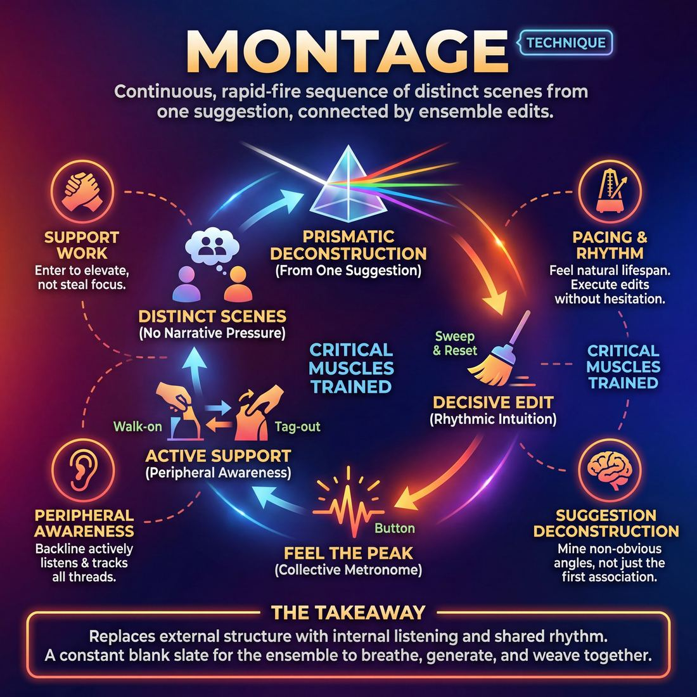

# 🎯 Montage

> *A drillable muscle that trains **Format Literacy**.*

{ .infographic }

## 🎯 The essence

A **Montage** is a continuous, rapid-fire sequence of distinct, self-contained scenes generated from a single suggestion and connected entirely by the ensemble's edits. As a foundational long-form technique, it strips away the pressure of narrative weaving or complex callbacks to isolate one vital muscle: **rhythmic intuition**. By forcing a team to continuously initiate, support, and transition between scenes without a predetermined structure, it makes players practice the art of pacing—feeling the natural peak of a moment and executing the edit without hesitation.

## 🎓 What it trains

Montage is the foundational cardiovascular workout for long-form improvisation. It exists to cure "scene myopia"—the beginner’s tendency to tunnel-vision on their own two-person scene while ignoring the wider context of the show. By stripping away complex narrative rules and focusing purely on a rapid succession of scenes, Montage forces improvisers to treat the *entire performance* as the unit of play. 

At its core, Montage builds **Format Literacy** and serves the domain of **The Ensemble**. It trains improvisers to shift their focus from *"How can I be funny?"* to *"What does this show need right now?"*

Specifically, it isolates and drills four critical muscles:

*   **Pacing & Rhythm (The Edit):** Without a script or a director, improvisers must learn to feel the natural lifespan of a scene. Montage trains players to hunt for the **button** (the peak energetic or comedic moment) and execute a decisive **Sweep Edit** (running across the downstage line to clear the stage) before the energy deflates.
*   **Suggestion Deconstruction:** It forces a team to pull multiple, distinct premises from a single audience suggestion. Instead of everyone playing the first, most obvious association, players learn to brainstorm rapidly and mine the suggestion for its richest, non-obvious angles.
*   **Peripheral Awareness:** Players on the **backline** (the area upstage where improvisers stand when not in a scene) cannot simply zone out. Montage demands active listening and tracking of all active threads, training the brain to notice when the stage is crowded, when a scene is losing steam, or when a pattern is emerging.
*   **Support Work:** It teaches the mechanics of entering a scene to elevate it, rather than to steal focus. Improvisers learn to execute clean **Walk-ons** (entering briefly to add a specific piece of information or environmental detail) and **Tag-outs** (tapping a player's shoulder to replace them and initiate a new scene with the remaining character) exactly when the scene requires it.

!!! abstract "The Deeper Principle: Surrendering the Ego"
    Montage solves the problem of the "ball hog." Because scenes are generated and edited rapidly, no single player can dominate. You are forced to trust that if you edit your teammate's scene, they will eventually edit yours. It builds a collective nervous system where the ensemble breathes, generates, and weaves together without pre-planning.

## 💡 Why it works

The Montage is the combustion engine of long-form improvisation. It works by deliberately stripping away the heavy cognitive load of narrative structure—there is no overarching plot to track, no protagonist to protect, and no mandatory callbacks to engineer. By removing these constraints, it forces the ensemble to rely entirely on fundamental scene work and group mind.

Here is the engine under the hood:

*   **Narrative Liberation (Cognitive):** In a Montage, a scene only needs to be about itself. This cognitive freedom allows players to fully commit to the immediate reality of the moment. If a scene is about two astronauts arguing over a parking ticket, it doesn't need to logically connect to the previous scene about a baker. This isolation breeds fearless, high-commitment choices because the pressure to "make it make sense" is gone.
*   **The Collective Metronome (Group Dynamic):** Because there is no predetermined order of scenes, the form relies entirely on the ensemble's shared sense of pacing. Players must develop an internal clock, feeling the exact moment a scene peaks so they can edit it. It trains the team to breathe together, recognizing when a scene needs to be a slow burn and when it needs to be a rapid-fire blackout.
*   **Ego Surrender (Emotional):** The format works because it forces players to act as the directors, editors, and support staff of the current scene. The emotional relief of not having to be the "star" of every moment allows players to relax into the ensemble.
*   **Prismatic Deconstruction:** It allows a team to take a single audience suggestion and fracture it like light through a prism. The open-ended nature of the Montage encourages players to explore the tangential angles of a word across multiple, distinct realities.

!!! abstract "The Core Engine"
    A Montage works because it replaces *external structure* with *internal listening*. The form doesn't tell you what to do next; the energy of the ensemble does.

!!! note "The Power of the Blank Slate"
    Every time a player sweeps the stage, they are giving the team a profound gift: a completely blank slate. This constant resetting prevents the group from getting bogged down in a single failing premise and keeps the momentum relentlessly moving forward.

## 🧩 The setup

Getting a Montage off the ground requires minimal physical setup but clear logistical boundaries. Because the form relies entirely on the ensemble’s collective rhythm rather than a rigid structure, the physical arrangement and shared expectations must be rock-solid before you begin.

*   **Players:** A full ensemble or class, typically 6 to 10 players. 
*   **Arrangement:** When not actively in a scene, players stand in a neutral, attentive line at the back of the stage (the backline) or in the wings, depending on your theater's physical space. The playing area downstage remains completely clear.
*   **Space & Materials:** An open stage. Two to four armless chairs should be easily accessible from the backline or wings. No other props or set pieces are needed.
*   **Time:** 15 to 25 minutes per round. A standard rehearsal might feature two or three full montages, allowing for a 45-to-60-minute total block with debriefs in between.
*   **Roles:** 
    *   *The Ensemble:* Responsible for everything on stage—initiating scenes, providing support work, and executing edits to transition between scenes.
    *   *The Facilitator/Coach:* Provides the single opening suggestion, tracks the overall time, and calls "lights" or "scene" to end the entire piece.
*   **Prerequisites:** Players must have a working grasp of basic two-person scenes. Crucially, they must already know how to execute fundamental edits—specifically the Sweep Edit and the Tag-Out. 

!!! tip "How to introduce it"
    **Facilitator Script:**  
    "We are going to run a Montage. I will get a single suggestion to inspire the entire piece. From there, you will initiate a series of completely unconnected scenes. 
    
    There is no opening game, no predetermined structure, and no obligation to bring characters back. When a scene has hit its peak or feels like it needs to end, anyone on the backline can edit by sweeping the stage. You can also use tag-outs or walk-ons to support the active scene. 
    
    Your only job is to follow the fun, support each other from the backline, and keep the pacing brisk. I will call 'lights' to end the piece after about 15 minutes. Can I get a non-geographical noun to start?"

## ⚙️ The mechanics

The core objective of a Montage is to sustain a continuous, self-edited flow of scenes inspired by a single suggestion. There is no host to guide the transitions. The ensemble relies entirely on their collective pacing, support work, and editing mechanics to keep the piece alive.

Here is the step-by-step flow of a standard Montage:

1. **The Suggestion & Deconstruction:** The ensemble takes a single suggestion from the audience. Players mentally deconstruct this word, moving past the first, most obvious association (the "A" premise) to find richer, non-obvious angles (the "C" premise). 
2. **The Initiation:** Two or three players step forward from the backline to initiate the first scene. They establish the base reality (who, what, where).
3. **The Scene & Support:** The active players explore the scene. Meanwhile, the backline maintains peripheral awareness, tracking the active threads. If the scene needs a specific element (a waiter, a ringing phone, a boss), a backline player executes a walk-on—entering to provide exactly what is missing, then immediately exiting to surrender focus.
4. **The Edit:** When the scene hits a comedic peak, a moment of high tension, or simply runs out of steam, a player from the backline initiates an edit to end the scene. 
5. **The Next Initiation:** The edit clears the stage. Immediately, new players step out to initiate the next scene, drawing on a different deconstruction of the original suggestion or a thematic echo of the previous scene.
6. **The Blackout:** The cycle of scenes and edits repeats until the predetermined time limit is reached, at which point the lights are pulled (or a coach calls "Scene!") on a final, high-energy peak.

!!! abstract "The Core Editing Mechanics"
    Because a Montage has no host, players must use physical edits to transition between scenes. 
    
    | Edit Type | The Mechanic |
    | :--- | :--- |
    | **Sweep Edit** | A backline player runs horizontally across the downstage area, acting as a human curtain. The active players clear the stage, and a new scene begins. |
    | **Tag-Out** | A backline player enters and taps an active player on the shoulder. The tapped player leaves; the new player assumes their physical position to start a new scene (often in a different time or place) with the remaining character. |
    | **Swing Door** | A player enters and physically rotates or "swipes" the stage picture, replacing one half of the scene while keeping the other intact. |

!!! tip "On stage: The Active Backline"
    Standing on the backline is not a break. A proficient ensemble uses the backline to anticipate where teammates will go. You should be physically energized, watching the scene intently, and ready to step out the millisecond an edit is needed. If you let scenes run long because you missed the exit, the rhythm of the entire Montage drags.

**Rules & Constraints:**
* **No pre-planning:** Players cannot discuss scenes on the backline. All generation must happen in real-time.
* **Edit from the back:** Active players in a scene generally do not edit their own scenes; it is the backline's responsibility to rescue them or punctuate their success.
* **Follow the follower:** If a player initiates a sweep edit but another player initiates a tag-out at the exact same time, the ensemble must instantly choose one to support so the transition remains clean.

## 🎬 Sample round

!!! example "In a scene: The 'Bicycle' Montage"
    Here is how a team might flow through the first few beats of a standard montage, demonstrating premise generation, scene work, and different editing mechanics.

    **The Suggestion:** "Bicycle"

    **Scene 1: The Direct Association (Bicycle $\rightarrow$ Training Wheels)**
    *Player A and Player B step downstage to initiate. Player A mimes holding the back of a seat.*
    **Player A:** "Okay, Timmy. I've got you. Just keep pedaling."
    **Player B:** "Dad, I'm thirty-two. I think I can handle the commute to the accounting firm on my own."
    **Player A:** "The financial district is ruthless, son! What if you hit a pothole? What if a pigeon swoops?"
    *(They play the scene for two minutes, heightening the dad's extreme, suffocating over-protectiveness.)*

    **The Edit: The Sweep**
    *Player C, watching from the backline, recognizes the scene has hit a strong comedic peak. They run briskly across the downstage line, physically wiping the stage clean.* 
    *Player A and B immediately drop their characters and clear the stage without hesitation.*

    **Scene 2: The Tangential Association (Bicycle $\rightarrow$ Tour de France $\rightarrow$ Doping Scandals)**
    *Player C (who just swept) stays on stage to initiate the next beat. Player D joins them. They mime sitting at tiny school desks.*
    **Player C:** *(Twitching slightly, intense)* "I'm ready for the spelling bee. I'm so ready. Give me a word."
    **Player D:** "Dude, your pupils are huge. Did you drink another one of those 'special' juice boxes?"
    **Player C:** "I need the edge, man! The regional spelling bee is cutthroat! I've got synonyms coursing through my veins!"

    **The Edit: The Tag-Out**
    *Player E sees an opportunity to explore the "juice box supplier." They step forward, tap Player D on the shoulder, and take their exact physical position. Player D immediately yields and leaves the stage.*

    **Scene 3: Heightening via Tag-Out**
    **Player E:** *(Playing a shady playground dealer)* "Look, kid. I got the good stuff. 100% pure, unpasteurized apple juice. But it's gonna cost you your lunch money for a week."
    **Player C:** "Just give me the box, Jimmy. I need to spell 'chrysanthemum'."

    **The Edit: The Sweep**
    *Player F sweeps the stage, clearing the spelling bee universe entirely to make room for a brand new initiation drawn from a different angle of the word "Bicycle."*

## 🎚️ Variations & progressions

The Montage is highly elastic. By tweaking the constraints around how scenes are generated, supported, or edited, you can isolate specific ensemble muscles and scale the difficulty from day-one basics to advanced, organic free-play.

Here is how to ramp the difficulty as your ensemble matures.

### 1. Foundational Progressions (Novice to Adv. Beginner)
When players are still tunnel-visioned on their own scenes or struggling to find the exit, use these variations to build basic pacing and clean support work.

*   **The Director’s Cut:** The coach or a designated off-stage player calls all the edits (e.g., shouting "Sweep!" or "Tag!"). This relieves novices of the pressure to find the edit, allowing them to feel what a well-timed transition feels like before they have to execute it themselves.
*   **The "Three-Scene" Limit:** The montage is capped at exactly three scenes, no more. This forces players to focus on establishing strong base realities rather than frantically generating a dozen shallow premises.
*   **Walk-ons Only:** Sweeps and tags are banned. The only way to alter a scene is through a clean walk-on. This trains players to notice when the stage is crowded and practice entering *only* to provide what is missing.

### 2. Intermediate Progressions (Competent)
Once players can track active threads and edit at the right moment, introduce constraints that challenge their suggestion deconstruction and scene variety.

*   **The A-to-C Montage:** Instead of taking a suggestion and playing the most obvious association (the "A" premise), the team must silently or verbally associate to a "C" premise before initiating. 
*   **The Tag-Out Gauntlet:** Sweeps are banned. Every transition must be a tag-out. This forces competent players to relentlessly track active threads, retain character details, and explore different angles of the same timeline.
*   **The Silent Start:** Every scene must begin with 10 seconds of pure, silent physical action before a single word is spoken. This breaks the habit of "talking heads" and forces the ensemble to build pacing that breathes.

!!! example "In a scene: A-to-C Deconstruction"
    **Suggestion:** "Bicycle"
    
    *   **Novice (A):** Two people riding bikes.
    *   **Adv. Beginner (B):** A scene about the Tour de France.
    *   **Competent (C):** "Bicycle" $\rightarrow$ "Training wheels" $\rightarrow$ "Overprotective parenting." The scene is about a mother making her 25-year-old son wear a helmet to do his taxes.

### 3. Advanced Variations (Proficient to Master)
At the highest levels, the goal is to surrender the ego entirely and see the show as one breathing organism.

*   **The Organic (No-Sweep) Montage:** Traditional sweep edits are strictly forbidden. Scenes must transition through morphs, stage pictures, shared dialogue, or one character wandering into a new environment. This forces proficient players to anticipate where teammates will go and provide invisible, off-focus support.
*   **The Armando (Monologue-Driven):** A classic format variant where scenes are interspersed with true, grounded monologues inspired by the suggestion. The ensemble must mine the monologue for its richest, most playable angles rather than just repeating the speaker's story.
*   **The "Follow the Follower" Montage:** There are no initiations. Every new scene must be entirely inspired by a minor, throwaway detail from the previous scene. Master players excel here, turning any stray word into a premise the whole team can run with, creating a montage that feels magically interconnected without any pre-planning.

!!! tip "On stage: Ramping up in rehearsal"
    Don't jump straight to organic edits if your team is still missing basic sweeps. Use a **"Constraint Add-On"** approach: start a 10-minute montage with basic rules. At minute 3, the coach yells "Tags only!" At minute 6, "Silent starts!" This builds cognitive load gradually.

## 🧑‍🏫 Coaching notes

When coaching a Montage, your primary job is to act as the team's external metronome and wide-angle lens until they develop their own peripheral awareness. Because Montage is the foundational structure for long-form improv, you are actively training their muscles for pacing, decisive editing, and selfless support. 

!!! tip "Coaching: The Golden Rule of Editing"
    **"If you're thinking about editing, do it."**
    Novice improvisers wait for the perfect, explosive punchline to end a scene, often letting it drag into awkwardness. Coach them to edit on the *first* solid laugh, or the moment the scene's premise has been clearly stated and heightened once. It is always better to edit a scene thirty seconds too early than ten seconds too late.

### Active Side-Coaching Cues
Don't wait for the scene to end to give notes. Use short, punchy side-coaching from the sidelines to shape the Montage in real-time:

*   **For Pacing & Rhythm:**
    *   *"Sweep!"* — Call this out the millisecond a scene hits its peak if the backline hesitates. Force them to feel what a timely edit feels like.
    *   *"Hold..."* — Use this if players are getting antsy and trying to edit a quiet, grounded scene before it has a chance to breathe.
*   **For Support Work:**
    *   *"What do they need?"* — Prompts the backline to analyze the active scene rather than just waiting for their turn. 
    *   *"In and out."* — A reminder for walk-ons to add a specific piece of information or environmental support, then immediately leave.
*   **For Suggestion Deconstruction:**
    *   *"Give me the 'C' idea."* — Use this when the team is stuck playing the most obvious, literal interpretation of the suggestion. Push them to associate further out.
*   **For Variety:**
    *   *"Change the energy."* — If you've just seen three loud, fast-paced argument scenes in a row, demand a shift in tone, volume, or pacing for the next one.

### What 'Good' Looks and Sounds Like
As the ensemble moves from Novice to Competent, you will observe distinct shifts in their behavior:

*   **The backline is alive:** Players are physically engaged—leaning forward, watching the active scene intently. They are tracking all active threads, not staring at the floor or planning their next move.
*   **Edits are decisive:** When a player decides to edit, they don't shuffle or apologize. A sweep is a confident, full-body run across the downstage line. 
*   **The rhythm breathes:** You hear a dynamic mix of textures. A chaotic, five-person group scene is immediately followed by a slow, intimate two-person scene. 
*   **Support is invisible:** Players enter a scene only when it needs something (a prop, a clarification, a heightening move), deliver exactly what is missing, and exit without trying to steal the focus.

## 🧭 Debrief & reflection

After a Montage, the debrief must shift the ensemble’s focus away from the micro ("Was my scene funny?") to the macro ("How did the whole piece breathe?"). Because a Montage relies entirely on the players to govern its structure, the reflection should center on pacing, support, and group awareness.

Use these questions to guide the discussion and lock in the learning:

*   **On the Edit:** "Did anyone have an impulse to edit a scene, but hesitate? What stopped you?" 
*   **On Rhythm and Variety:** "How would you describe the overall energy curve of that montage? Did we have a mix of tones, or did every scene share the same volume and length?"
*   **On Support Work:** "Who received a walk-on or tag-out that felt like a true gift? What made it helpful rather than distracting?"
*   **On Peripheral Awareness:** "What themes or patterns emerged naturally, even without us planning them?"

!!! note "Coach's Focus"
    Players love to talk about the content of their scenes—the funny characters or the clever jokes. Gently steer them back to the **transitions** and the **mechanics**. The goal of this debrief is to build Format Literacy, which means understanding the *structure* of the performance.

**What a good debrief surfaces:**

A successful reflection will often uncover the "bystander effect" in editing—where everyone assumes someone else will initiate the sweep. Bringing this to light helps players realize that pacing is a shared responsibility. 

It also surfaces the distinction between entering a scene to *help* versus entering to *grab focus*. As players move from Novice to Competent, the debrief will highlight how the best support work often involves giving a scene exactly what it needs (a prop, a quick line, a physical environment) and then immediately exiting. Finally, a strong debrief helps the ensemble recognize that a ten-second, high-energy palate cleanser is just as vital to the Montage as a patient, three-minute relationship scene.

## ⚠️ Common pitfalls

!!! warning "Watch out: Polite Paralysis (The Editing Hesitation)"
    The single most common novice trap in a Montage is letting scenes run long because no one wants to be the "bad guy" who cuts off their teammates. Under the cognitive load of tracking the show, players wait for a definitive, explosive punchline that never comes. 
    
    **The Fix:** Edit on the first laugh, the first clear establishment of the game, or the first sign of a lull. A premature edit injects energy; a late edit drains it. When in doubt, sweep the stage.

When players are first learning to string scenes together without a rigid structure, the sheer freedom can overwhelm their working memory. Here is how the Montage breaks down under cognitive load, and how to fix each trap:

*   **The "Clown Car" Stage (Over-crowding)**
    *   **The Trap:** A two-person scene is suddenly swarmed by three walk-ons, a tag-out, and a background character. The original premise is obliterated.
    *   **The Cause:** Novices want to help, but under pressure, they equate "support" with "entering the scene to grab focus." They act on the impulse to participate rather than observing what the scene actually requires.
    *   **The Fix:** Drill the discipline of the competent improviser: enter *only* when a scene needs something specific, give it, and leave. Practice off-focus support (like providing a soundscape from the wings) to build the muscle of helping without hijacking.

*   **The Literal Loop (A-to-A Deconstruction)**
    *   **The Trap:** If the suggestion is "Bicycle," the first scene is about riding a bike. The second scene is about fixing a bike. The third scene is about stealing a bike. 
    *   **The Cause:** Panic. The brain grabs the first, most obvious association to survive the terrifying blank slate of a new scene. 
    *   **The Fix:** Push for A-to-C thinking. If the literal scene has been done, pivot to the *theme* or *dynamic*. A bicycle requires balance; do a scene about a workaholic trying to balance their life. A bicycle has two wheels working together; do a scene about co-dependent twins. 

*   **The "Island" Effect (Tunnel Vision)**
    *   **The Trap:** The Montage feels like a random assortment of disconnected sketches rather than a cohesive piece. The pacing is flat, and scenes share no thematic DNA.
    *   **The Cause:** Players are so focused on inventing their *own* upcoming scene that they stop listening to the *current* scene. They lose their peripheral awareness.
    *   **The Fix:** Coach players to react to the *energy* of the previous scene. If the last scene was a high-status, loud, chaotic argument, the next scene should deliberately contrast it—perhaps a slow, quiet, intimate whisper between two people. 

!!! tip "On stage: The 'I Got Your Back' Rule"
    If you see a teammate step forward to initiate an edit, but they hesitate and step back, *edit for them immediately*. Reward the impulse to edit, even if it's messy. It builds trust and keeps the rhythm breathing.

## 🌟 What mastery looks like

At the master level, a montage stops feeling like a random assortment of disconnected scenes and transforms into a single, breathing organism. The ensemble operates with a shared hive-mind, where individual egos dissolve into the collective rhythm of the piece. 

When observing a masterful montage, you will see four distinct hallmarks:

*   **The show breathes as one organism:** Master improvisers possess elite peripheral awareness. They don't view the montage as a queue of unrelated turns; they track the macro-pattern of the entire set. If the last two scenes were chaotic and loud, the next scene begins in absolute, grounded silence. They balance the show's energy in real-time.
*   **Invisible, peak-moment editing:** The pacing is flawless. A sweep or tag-out arrives exactly on the button—the laugh, the gasp, or the poignant realization. The edit is executed with such decisive momentum that the audience never consciously notices the mechanics of the transition; they are simply carried effortlessly into the next reality.
*   **Ego-less, off-focus support:** Players on the backline are hyper-present but entirely surrendered to the piece. They provide a perfectly timed sound effect, step in as a silent piece of architecture, or deliver a crucial walk-on line, and then instantly vanish. They give exactly what is missing to elevate the active players without ever pulling focus.
*   **Thematic, whole-team deconstruction:** The opening suggestion isn't just a literal prop used in scene one and forgotten. It becomes a thematic engine. The ensemble turns any word into a rich premise, mining its non-obvious angles to subtly color the entire montage, creating a satisfying, unified feel without relying on forced, literal callbacks.

!!! example "In a scene"
    Two players reach a quiet, heartbreaking realization about their failing marriage. The audience holds its breath. Instead of letting the silence drag into awkwardness, a backline player instantly sweeps the stage with a high-energy, physical initiation—perhaps loudly revving a chainsaw. The edit perfectly honors the dramatic peak of the previous scene while instantly resetting the rhythm for the next.

!!! abstract "The Ultimate Shift"
    Mastery in a montage is the transition from "I am doing a scene" to "We are playing the show." The players trust the format completely, allowing the piece to generate its own momentum.

## 🔗 Why it matters

Montage is the DNA of long-form improvisation. It is often the first format a team learns, yet it remains the purest test of a group’s collective listening, pacing, and trust. 

By stripping away complex structural rules, Montage isolates the core mechanics of scene-to-scene transition, directly building Format Literacy. When a team practices Montage, they are drilling the essential vocabulary of the stage—sweeps, tag-outs, and callbacks. Once these transitions become muscle memory, an improviser can step into any complex format with confidence, because they already know how to edit and pace a show.

More importantly, Montage serves the ultimate goal of The Ensemble: surrendering the ego to the piece. Because there is no predetermined narrative arc or assigned protagonist, the cast must rely entirely on peripheral awareness and active support work. 

*   **It demands backline vigilance:** You are never "off stage." Even when standing on the backline, you must actively watch, asking, *“What does the show need right now? High energy? A quiet two-person scene? A thematic callback?”*
*   **It decentralizes the pressure:** No single player is responsible for the plot. The burden of creation is distributed equally across the ensemble, forcing players to weave disparate threads together without pre-planning.
*   **It teaches rhythm over plot:** Without a story to lean on, improvisers learn to feel the natural breathing of a show—recognizing when a scene has peaked and having the courage to edit it cleanly.

!!! abstract "The foundation of all formats"
    Every advanced long-form structure is essentially a Montage with a specific set of constraints. The **Harold** is a Montage organized into three beats with an opening. The **Armando** is a Montage inspired by true monologues. The **Slacker** is a Montage linked entirely by tag-outs. If your ensemble can perform a fluid, connected, and dynamic Montage, you possess the foundational technique to master any format in the wider craft.

## 📚 References & Further Reading

### Foundational sources
*   **Charna Halpern, Del Close, and Kim "Howard" Johnson, *Truth in Comedy: The Manual of Improvisation* (1994)** — While primarily focused on the Harold, this foundational text details the transition from formless scene work to structured long-form. It is essential reading for understanding the "group mind" and the ego surrender required to make a montage function as a cohesive piece rather than a series of isolated sketches.
*   **Matt Besser, Ian Roberts, and Matt Walsh, *The Upright Citizens Brigade Comedy Improvisation Manual* (2013)** — The definitive guide to the fast-paced, game-driven style of long-form. It features explicit, mechanical instructions on executing the exact tools needed for a montage: sweep edits, tag-outs, walk-ons, and pacing, as well as how to deconstruct a single suggestion into multiple, distinct premises.

### Practitioner guides & manuals
*   **Mick Napier, *Improvise: Scene from the Inside Out* (2004)** — A vital counter-balance to rigid format rules, focusing on individual freedom and strong scene initiation. Napier's philosophy is crucial for montage play, as it teaches improvisers how to rely on internal listening and immediate context rather than waiting for an external narrative structure to save them.
*   **Will Hines, *How to Be the Greatest Improviser on Earth* (2016)** — Offers practical, advanced advice on being present and authentic on stage. Hines breaks down the exact backline behaviors, peripheral awareness, and pacing required to sustain a long-form montage without letting the energy deflate.
*   **Billy Merritt and Will Hines, *Pirate Robot Ninja: An Improv Fable* (2019)** — Explores ensemble dynamics and the different archetypal roles players take in a group. Understanding these dynamics is crucial for balancing backline support, knowing when to step forward to edit, and recognizing what the ensemble needs in the moment.

### Lineage & teachers
*   **iO (ImprovOlympic)** — The Chicago theater founded by Charna Halpern and Del Close, where the montage was utilized as the foundational cardiovascular workout for long-form, eventually serving as the building block for the Harold.
*   **Upright Citizens Brigade (UCB)** — The theater that popularized the rapid-fire, game-focused montage. UCB's curriculum heavily emphasizes the "blank slate" of the sweep edit and trains improvisers to aggressively support scenes from the backline.
*   **The Annoyance Theatre** — Founded by Mick Napier, this theater champions a style of montage that prioritizes fearless, high-commitment individual choices and organic scene transitions, proving that a montage only needs to be about itself to succeed.

### Research & theory
*   **R. Keith Sawyer, *Group Creativity: Music, Theater, Collaboration* (2003)** — A psychological and sociological study of group flow. Sawyer explores how improvisational ensembles submerge the ego to the group mind and collaboratively create in real time, providing the academic framework for the "collective metronome" of a montage.

### Talks, videos & courses
*   **Upright Citizens Brigade, *ASSSSCAT*** — UCB's flagship live show (and its various televised specials and DVD releases) serves as a masterclass in the monologue-driven montage (the Armando). Watching it provides a visual textbook on rapid-fire scenes, decisive sweep edits, and seamless tag-outs.
*   **Matt Besser, *Improv4Humans*** — A long-running improv podcast that functions as a continuous, fast-paced audio montage. It is an excellent resource for studying "suggestion deconstruction," showcasing how top-tier improvisers pull multiple distinct, non-obvious premises from a single conversational thread.

## 💬 Quotes & Anecdotes

!!! quote "— Matt Besser, Ian Roberts, and Matt Walsh, *The Upright Citizens Brigade Comedy Improvisation Manual* (2013)"
    A montage is a group of scenes inspired by each other, but without a specific structure. Sometimes scenes will recur and combine, sometimes each scene will simply be inspired by the one before, making a 'chain'.

!!! quote "— Matt Besser, Ian Roberts, and Matt Walsh, *The Upright Citizens Brigade Comedy Improvisation Manual* (2013)"
    A scene shouldn't be edited on the very first big laugh, but after the improvisers in the scene have been allowed to heighten and explore their Game a few times. If the scene has been consistently getting laughs, and a Game move gets a great reaction from the audience, this is a good time to edit the scene.

!!! quote "— *People and Chairs* (Improv Blog)"
    I've lost count of the shows I've done where we all agreed to do a montage... only to sputter and hesitate after five or six scenes, unsure of what to do next. By using something from the previous scene to start the next one, you'll keep the momentum going. It can be a character, sound, gesture, location, catchphrase, or anything that inspires you.

!!! quote "— *People and Chairs* (Improv Blog)"
    Say what you will, but when shit hits improvised fan, a sweep edit will get you out of the way of flying feces every time. There's really only two things to remember: 1. Stay in front of the players you're sweeping, and 2. Jog, don't walk.

### Where it comes from
While Del Close and Charna Halpern codified the highly structured "Harold" format at iO Chicago in the 1980s, the Montage emerged as the natural, stripped-down alternative. It became the foundational "free-form" long-form structure, allowing improvisers to practice the core mechanics of scene generation and editing without the cognitive load of tracking mandatory beats, group games, or narrative weaving. It was heavily popularized in the late 1990s and 2000s by theaters like the Upright Citizens Brigade (UCB), who used it as the engine for their fast-paced, game-driven style of play.

### A telling example
A classic example of a Montage engine in action is the UCB's flagship show, *ASSSSCAT 3000*. While the show features a guest monologist (making it technically an "Armando" format), the core theatrical engine is a rapid-fire montage. The improvisers (such as founders Amy Poehler, Matt Besser, Ian Roberts, and Matt Walsh) listen to a true story, then immediately launch into a series of fast-paced, unconnected scenes inspired by tangential details from the monologue. 

Because there is no set structure dictating what scene must come next, the ensemble relies entirely on peripheral awareness and the "sweep edit." When a scene hits its comedic peak, a player from the backline sprints across the downstage line, instantly wiping the slate clean for the next scene to begin. This relentless resetting prevents the group from getting bogged down and forces them to continuously generate new premises.

## 🧭 Explore the framework

- ⬆️ **Skill it trains:** [Format Literacy](04_S6__format-literacy.md)
- 🎭 **Domain:** [The Ensemble](04_D__the-ensemble.md)
- 🔁 **Sibling techniques:** [Harold](04_S6_T1__harold.md), [Armando](04_S6_T2__armando.md), [Longform vs. shortform mechanics](04_S6_T4__longform-vs-shortform-mechanics.md)
