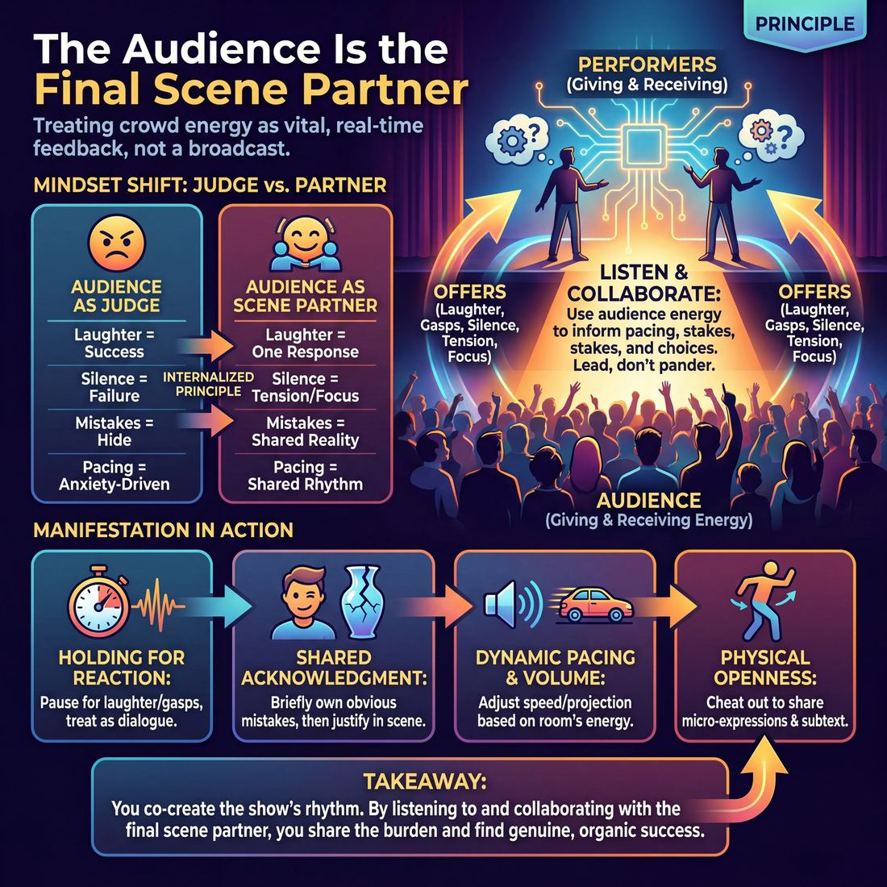

# 💎 The Audience Is the Final Scene Partner

> *Their energy is information — ignore it and the show dies; chase it and you sell out.*

{ .infographic }

## 💎 The core belief

!!! abstract "The Core Conviction"
    The audience's energy is vital information. Ignore it, and the show dies in a vacuum; chase it, and you sell out the scene.

Improv is not a broadcast medium; it is a live, real-time conversation. The conviction that **The Audience Is the Final Scene Partner** means we view the crowd not as passive consumers sitting in the dark, but as an active, breathing participant in the show. Just as you listen to your fellow improvisers' words, tone, and body language, you must listen to the audience's collective energy. Their laughter, sudden gasps, tense silence, and even their restless shifting are all **offers** (any action, expression, or energy that advances a scene). They are the final, unpredictable variable that completes the circuit of every performance.

Treating the audience as a scene partner requires a delicate balance of respect and boundaries. Because their energy is vital information, ignoring it turns the show into a self-indulgent vacuum where scenes die on the vine. Conversely, if you desperately chase their approval—abandoning your grounded reality for a cheap, unearned laugh—you pander, breaking the very reality they came to see. A healthy relationship with this final partner means you collaborate with their energy. You lead them, you listen to them, and you let their reactions inform your pacing and emotional stakes, but you never surrender control of the scene.

## 🌱 Why it governs everything

When an improviser truly internalizes this principle, the fundamental geometry of the performance changes. The **fourth wall**—the imaginary barrier between the stage and the seats—stops being a shield to hide behind and becomes a permeable membrane. You stop performing *at* a dark room and start breathing *with* it.

This principle governs everything because it completely redefines the improviser's relationship with success, failure, and control. Before holding this value, performers often view the audience as a passive receptacle, a harsh judge, or a vending machine where good improv goes in and laughs come out. Once this belief takes root, the audience becomes an active collaborator. 

Here is how your baseline mindset shifts when this principle is adopted:

| The "Audience as Judge" Mindset | The "Audience as Scene Partner" Mindset |
| :--- | :--- |
| **Laughter** is the only metric of success. | **Laughter** is just one of many valid responses (alongside gasps, groans, and pin-drop focus). |
| **Silence** means we are failing; we must talk faster. | **Silence** means they are listening; we can use it to build tension. |
| **Mistakes** are embarrassing errors to be hidden. | **Mistakes** are shared realities in the room to be acknowledged and played with. |
| **Pacing** is dictated by the performers' anxiety. | **Pacing** is a shared rhythm, adjusted based on the room's energy. |

Because a scene partner's job is to give and receive offers, holding this value means treating the audience's energy as a constant stream of input. A restless room isn't a sign to panic; it is an offer to change the stage picture, raise the stakes, or edit the scene. A collective gasp isn't an interruption; it is an offer to pause, hold eye contact with your co-player, and let the emotional weight of a revelation settle.

!!! tip "Reading the room's offers"
    Treat the audience's physical and vocal reactions as unspoken dialogue. If they lean in, drop your volume to draw them closer. If they laugh at a subtle physical choice, you now know they are tracking the details—heighten that choice. You are co-creating the rhythm of the show.

Ultimately, this principle cures the improviser's ego. You no longer have to carry the entire burden of the show's entertainment value on your own shoulders. By treating the audience as a partner, you enter into a genuine dialogue with the people in the seats, trusting that if you listen to them as intently as you listen to your castmates, the show will naturally find its way.

## 👀 How it shows up

While a principle is an internal conviction, it manifests in highly visible, physical ways on stage. You can spot an improviser who believes the audience is in the scene with them through several distinct behaviors:

*   **Holding for the reaction:** They do not bulldoze through laughter, gasps, or applause. When a moment lands, they physically and vocally pause, allowing the audience's reaction to play out—treating that noise as the audience's "line of dialogue"—before speaking again.
*   **The shared acknowledgment:** When a genuine, undeniable mistake happens on stage (a knocked-over chair, a wildly mispronounced name), they do not pretend it didn't occur. They might shoot a brief, knowing glance to the crowd or allow a micro-expression of shared amusement before instantly justifying the mistake within the reality of the scene.
*   **Dynamic pacing and volume:** They adjust their projection and speed based on the room's energetic feedback. If the audience is leaning in and the room is dead silent, they might drop to a tense stage whisper. If the crowd is restless, they drive the pace and raise the stakes.
*   **Physical openness:** They naturally employ **cheating out** (angling their bodies and faces toward the house). Even in intimate, emotionally grounded two-person scenes, they ensure the audience can read their micro-expressions, sharing the emotional subtext.

!!! example "In a scene: The 'Brenda' Slip"
    Two improvisers are deep in a tense, dramatic breakup scene. Player A accidentally calls Player B "Brenda" instead of "Barbara." The audience catches the slip—they gasp and start to giggle.
    
    *   **Ignoring the partner:** Player A plows ahead, pretending they said Barbara. The audience disconnects, feeling like their reality was rejected.
    *   **Embracing the partner:** Player A hears the gasp, pauses to let the audience's reaction peak, locks eyes with Player B, and says, "That's right. I've been seeing Brenda." The audience erupts because their reaction was validated, accepted as an offer, and woven seamlessly into the scene.

### The Progression of Partnership

As an improviser matures, their relationship with the audience evolves from a source of fear to a source of collaboration.

| Stage | Observable Behavior | Relationship to the Audience |
| :--- | :--- | :--- |
| **Novice** | Builds a "fourth wall of iron." Stares exclusively at their scene partner, talks over laughter, and ignores dropped props. Alternatively, breaks character to nervously laugh *at* themselves when the audience laughs. | **The Threat:** The audience is a judge that must be hidden from or appeased. |
| **Intermediate** | Pauses for laughs, but mechanically. Begins to "mug" or pull focus to get a reaction. Adjusts volume, but often plays *to* the audience for approval rather than sharing the scene with them. | **The Customer:** The audience is a consumer that must be entertained and pleased at all costs. |
| **Master** | Breathes with the room. Uses the audience's silence as dramatic tension, their gasps as scene offers, and their laughter as a pacing tool. Acknowledges the room's energy without ever breaking the reality of the scene. | **The Scene Partner:** The audience is a co-creator whose energy dictates the rhythm and reality of the show. |

!!! tip "On stage"
    If you feel a scene dying, stop talking and listen to the room. Are they shifting in their seats? Are they leaning in? Let their physical energy dictate your next move. If they are restless, do something physical; if they are silent, drop your volume and get real.

## 🧪 Living it in practice

To treat the audience as a scene partner, you must actively "listen" to them. Because they rarely speak in words, you must learn to translate their native language: laughter, gasps, shifting in seats, and the profound difference between a bored silence and a captivated one. 

Internalizing this principle transforms abstract stage techniques into acts of communication.

### Habits of the outward-focused improviser

When you truly believe the audience is in the scene with you, your baseline stage habits change:

*   **Ingrained physical openness:** Cheating out becomes second nature. You realize that turning your back on the audience for too long is like turning your back on a scene partner—it cuts them out of the connection.
*   **Pacing the physical room:** You adjust your speed and volume to the architecture of the space. A tight, low-ceilinged basement requires a different conversational rhythm and intimacy than a cavernous 300-seat theater. 
*   **Rewarding memory:** You bring back **callbacks** (referencing an earlier joke or detail) not to show off, but as an inside joke shared with the audience, rewarding them for paying attention.

!!! tip "On stage: Holding for the laugh"
    When the audience laughs, they are taking their turn in the dialogue. If you speak over them, you are interrupting your partner. 
    
    1. **Freeze the dialogue:** Stop speaking the moment the laugh peaks.
    2. **Sustain the physical reality:** Keep doing your object work or hold your emotional expression. Do not drop character or go blank.
    3. **Ride the decay:** Wait for the laugh to begin dying down—the "decay"—before delivering your next line, ensuring they hear every word.

### Drills to build audience awareness

You can train your ensemble to feel the audience's presence through targeted exercises:

| Drill | How it works | What it teaches |
| :--- | :--- | :--- |
| **The Confidant** | Players perform a two-person scene, but deliver all their internal emotional reactions directly to the audience via eye contact or brief **asides** (breaking the fourth wall to speak to the crowd). | Builds the habit of treating the audience as a trusted friend, rather than a wall of strangers. |
| **Blind Scenes** | Two players perform a scene with their eyes closed, relying entirely on tone of voice and the audible reactions of the room. | Heightens auditory sensitivity to the audience's subtle cues—gasps, chuckles, or restless shifting. |
| **The Pin-Drop Pause** | In rehearsal, the coach calls "Pause!" during a moment of high tension. Players must hold the silence for ten full seconds, feeling the energy of the room before continuing. | Teaches players not to panic in silence, and to distinguish between "dead air" and "invested tension." |

!!! example "In a scene"
    Two improvisers are playing a tense breakup scene. The room is dead silent. An improviser who ignores the audience might panic, assume the scene is failing because there are no laughs, and suddenly make a goofy, out-of-character joke to break the tension. 
    
    An improviser who treats the audience as a partner *feels* the weight of the silence, recognizes it as deep investment, and leans into the heartbreak, trusting the audience is right there with them.

## ⚖️ Tensions & nuance

Treating the audience as a partner creates an immediate, high-wire tension: how do you respect their input without letting them hijack the show? A healthy scene partnership is built on mutual respect, not subservience. If you ignore the audience, you are performing in a vacuum; if you desperately chase their approval, you lose your artistic integrity.

Navigating this tension requires understanding the difference between **partnering** (co-creating an experience) and **pandering** (sacrificing the reality of the scene for a cheap reaction).

| Partnering with the Audience | Pandering to the Audience |
| :--- | :--- |
| **Pacing:** Holding for a laugh so they can fully enjoy the moment before you speak. | **Rushing:** Throwing out rapid-fire jokes because you are terrified of a quiet room. |
| **Listening:** Hearing a collective gasp and using it to raise the emotional stakes. | **Bailing:** Breaking character to wink at the crowd when a scene feels difficult. |
| **Elevating:** Taking a crude audience suggestion and playing it with grounded intelligence. | **Gagging:** Dropping the scene's reality to make an unearned pop-culture reference. |

### Leading the Dance
Just as you wouldn't let a fellow improviser steamroll you on stage, you cannot let the audience dictate the entire direction of the piece. You are the expert in the room. Sometimes, partnering means taking their hand and leading them into a quiet, dramatic, or absurd space they didn't expect to go. You must be willing to challenge your partner.

!!! warning "Watch out: The Sugar Rush"
    When an audience is highly reactive, it is tempting to feed them "sugar"—gags, shock humor, or high-energy chaos. While this gets an immediate spike in laughter, it degrades the trust in the partnership. By minute twenty, the audience will be exhausted, and because you haven't built a foundation of truth, they will stop caring about the characters.

### The Tension of Silence
What happens when your "partner" stops talking? Silence is the most misinterpreted signal in improv, often triggering panic in newer performers. But a silent audience is still communicating.

!!! note "Reading the Silence"
    Not all silence is a rejection. You must learn to read the room's frequency:
    
    *   **Dead silence:** The audience is confused or bored. *Action:* Clarify the **base reality** (the who, what, and where) or make a strong emotional choice.
    *   **Rapt silence:** They are deeply invested in the emotional truth of the scene. *Action:* Slow down. Live in the moment. Do not break this beautiful tension with a nervous joke.
    *   **Anticipatory silence:** They know something awkward or terrible is about to happen to the character. *Action:* Lean into the trouble; give them the payoff they are waiting for.

### Overriding Principles
This principle is frequently held in check by the mandate to **Play to the top of your intelligence**. If a rowdy Friday night crowd yells out a stereotypical or offensive suggestion, treating them as a partner does *not* mean blindly acting it out. Instead, you accept the raw energy of the offer but elevate the execution—finding a smart, truthful, or subversive angle that honors the contract of the show without compromising your own comedic voice.

## 🚫 Common misunderstandings

Because elevating the audience to the status of a "partner" is a powerful metaphor, improvisers often take it too literally or use it to justify bad habits. Misreading this principle usually results in either suffocating the audience with neediness or shutting them out entirely.

Here are the most common ways this principle is misunderstood, and how to correct them:

| The Misunderstanding | What It Looks Like | The Correction |
| :--- | :--- | :--- |
| **The Panderer's Trap** | Chasing cheap laughs, leaning on shock humor, or abandoning a grounded scene the moment the audience gets restless. | **Partnership requires boundaries.** A good scene partner doesn't just agree with your worst impulses; they elevate you. You must lead the dance, trusting that the audience wants a good story, not just a quick dopamine hit. |
| **The Literal Translation** | Constantly breaking the fourth wall, winking at the crowd, or dragging people on stage to "include" them. | **The connection is energetic, not literal.** You can play a silent, deeply grounded, dramatic scene and still be in perfect partnership with the room by feeling their tension and pacing your reveals to their breath. |
| **The Hostile Witness** | Viewing the audience as a judge to be impressed, a puzzle to be solved, or an enemy to be conquered. | **They are on your side.** Just like your castmates, the audience bought a ticket hoping you will succeed. Treat their reactions as helpful offers, not verdicts on your talent. |
| **The Purist’s Wall** | The "art for art's sake" excuse: *“We play for ourselves; if the audience doesn't get it, that's their problem.”* | **Ignoring your partner is bad improv.** If you are completely detached from the energetic feedback loop of the room, you aren't doing a show—you are doing a rehearsal in front of witnesses. |

!!! warning "Watch out: The 'Inside Joke' Exclusion"
    Sometimes, a team will play heavily to the three other improvisers sitting in the back row, using hyper-specific references or meta-improv jokes. This treats the *rest* of the audience like a third wheel on a date. If the audience is your final scene partner, you cannot speak a language they haven't been taught. 

!!! tip "On stage: How to check your partnership"
    If you feel the show slipping, ask yourself: *How am I treating the audience right now?* 
    If you are begging them for approval, **slow down and ground yourself**. 
    If you are ignoring them because you're in your head, **make eye contact with your scene partner and project your voice**. Re-engage the room by re-engaging the stage.

## 🔗 Why it matters

Embracing the audience as your final scene partner is the difference between delivering a rehearsed product and creating a live, unrepeatable event. When an improv ensemble deeply holds this value, the psychological state of the performers and the emotional investment of the crowd fundamentally transform. 

Here is how the entire performance ecosystem changes when this value is internalized:

| Without this principle (Performing *for*) | With this principle (Playing *with*) |
| :--- | :--- |
| **Silence is terrifying.** It means the audience is bored or judging you, prompting you to rush to the next joke. | **Silence is information.** It means the audience is leaning in, processing, or feeling tension. You let it breathe. |
| **Mistakes are failures.** A dropped prop or a flubbed name breaks the illusion and must be ignored or paved over. | **Mistakes are shared gifts.** We all saw the prop drop. Acknowledging it aligns your reality with the audience's reality, creating instant joy. |
| **Laughter is a transaction.** You do a move, they pay you in laughs. If they don't laugh, you feel bankrupt. | **Laughter is a conversation.** A laugh is the audience saying, "We recognize that!" You use that data to explore *why* it was true. |
| **The show is a burden.** The cast feels the heavy responsibility of generating 100% of the entertainment from scratch. | **The show is a collaboration.** The cast only needs to provide the spark; the audience's reactions provide the fuel. |

!!! abstract "The Paradigm Shift"
    When you treat the audience as a scene partner, the pressure to be "clever" vanishes. You no longer have to invent comedy in a vacuum. Instead, your job becomes much simpler: pay attention to what is happening on stage, pay attention to how the room feels about it, and react honestly to both.

Ultimately, this principle matters because it is the source of improv's unique magic. A scripted play can survive a disconnected audience by relying on the strength of its text. Improv cannot. The art form relies entirely on the shared, spontaneous discovery of truth. When the audience feels that their presence actually steers the ship—that the show would have been fundamentally different if *they* hadn't been sitting in those specific seats—they transform from passive consumers into fiercely loyal co-creators.

## 📚 References & Further Reading

### Foundational sources
*   **Viola Spolin, *Improvisation for the Theater* (Northwestern University Press, 1963)** — Spolin explicitly frames the audience not as a passive judge, but as a fellow player and evaluator. She details early "Orientation" exercises—such as having half the class stand on stage while the other half watches in silence—designed specifically to break the actor's dependency on the teacher, dissolve the fourth wall, and include the audience's energy as an active part of the "game."
*   **Keith Johnstone, *Impro: Improvisation and the Theatre* (Faber and Faber, 1979)** — Johnstone frequently addresses the improviser's relationship with the audience, arguing that performers must accept the audience's reactions as truth. He warns against trying to be "clever" or "original" (which alienates the crowd) and instead advocates for being obvious. He famously describes a good performance as a feedback loop where the audience becomes like a "great beast rolling over to let you tickle it."

### Practitioner guides & manuals
*   **Mick Napier, *Improvise: Scene from the Inside Out* (Heinemann Drama, 2004)** — Napier emphasizes acknowledging the reality of the room and reacting to the audience while staying firmly within the context of the scene. He argues that ignoring the audience's energy—or pretending a dropped prop or a massive mistake didn't happen—violates the shared reality of the performance and breaks the audience's trust.
*   **Will Hines, *How to Be the Greatest Improviser on Earth* (Pretty Great Publishing, 2016)** — Hines dedicates significant focus to "being present" and managing the audience's perception. He explains how an improviser's authentic, grounded reaction to the room's energy creates charisma and commands attention. He specifically notes that holding for a reaction, or letting silence breathe, is the mark of a confident improviser who treats the audience as an equal partner rather than a threat.
*   **Patti Stiles, *Improvise Freely* (Big Toast Entertainment, 2021)** — Rooted deeply in the Johnstone tradition, Stiles challenges rigid improv "rules" that inadvertently build walls between performers and the house. She advocates for a fluid, shared stage where the audience's gasps, laughs, and silences are treated as direct offers that actively shape the narrative and pacing of the show.

### Lineage & teachers
*   **The Loose Moose Theatre Company (founded by Keith Johnstone & Gerry Bastien, 1977)** — The birthplace of Theatresports and a tradition that explicitly breaks the fourth wall. The Loose Moose style relies on direct audience feedback, cheering, groaning, and voting to drive the energy and direction of the show, structurally enforcing the idea that the audience is the final scene partner.
*   **The Annoyance Theatre (founded by Mick Napier, 1987)** — Known for a style that heavily emphasizes the performer's power to hold the stage, acknowledge the room's reality, and play with the audience's expectations. The Annoyance philosophy teaches improvisers to use the audience's energy without pandering for cheap laughs or dropping the scene's internal truth.

### Research & theory
*   **Uri Hasson, Greg Stephens, and Lauren Silbert, "Speaker-listener neural coupling underlies successful communication" (*Proceedings of the National Academy of Sciences*, 2010)** — Hasson's neuroscience research at Princeton demonstrates "neural coupling," showing that a storyteller and an engaged listener literally synchronize brain activity. The study found that the stronger the audience's comprehension and engagement, the more their brain waves mirrored the speaker's—providing a literal, biological basis for the concept of "reading the room" and establishing a shared reality.
*   **Peter Brook, *The Empty Space* (MacGibbon & Kee, 1968)** — *(unverified)* Foundational theater theory establishing that the only requirement for an act of theater is a person walking across an empty space while someone else is watching. Brook's work highlights the inescapable, active partnership between actor and audience, arguing that the audience's attention fundamentally alters the event occurring on stage.

### Talks, videos & courses
*   **Uri Hasson, *This Is Your Brain on Communication* (TED Talk, 2016)** — A highly accessible, verifiable breakdown of Hasson's neural coupling research. He explains how the brains of speakers and listeners sync up in real-time, proving that communication (and by extension, live performance) is not a broadcast, but a single act performed collaboratively by two brains.

### Communities & adjacent reading
*   **Steve Martin, *Born Standing Up: A Comic's Life* (Scribner, 2007)** — While focused on stand-up comedy rather than scenic improv, Martin's memoir is a masterclass in reading audience energy, manipulating tension, and understanding the crowd as a living, breathing entity. It perfectly illustrates the improv concept of riding the room's energy without surrendering control or pandering to expectations.

## 💬 Quotes & Anecdotes

!!! quote "— Viola Spolin, *Improvisation for the Theater* (1963)"
    The audience is the most revered member of the theater. Without an audience, there is no theater. Everything done is ultimately for the enjoyment of the audience. They are our guests, fellow players, and the last spoke in the wheel which can then begin to roll. They make the performance meaningful.

!!! quote "— Del Close, *iO Theater teachings* (attributed)"
    Treat your audience like poets and geniuses and they'll have the chance to become them.

!!! quote "— Keith Johnstone, *Impro: Improvisation and the Theatre* (1979)"
    Every time you go the way the audience expects, they'll think you're original. People laugh with pleasure at the obvious.

!!! quote "— Keith Johnstone, *Impro for Storytellers* (1999)"
    The audience doesn't like players who seem stressed. They want you to be visibly in control. Theatre is an expression of vitality, but it's also a cave where human beings should feel secure.

!!! quote "— Charna Halpern, *Geeking Out With... Interview* (2013)"
    If you are being jokey, there is no scene... And they get confused because the audience may still be laughing, so they think they are doing great. But they are being misled because they aren't being true to the work.

!!! quote "— TJ Jagodowski, *People & Chairs Interview* (2017)"
    The audience, guaranteed, will never look at your show and say, 'Hmmm. They are doing correct improv.' However, they will see the insecure, overlooked, overbearing, condescending, judgemental players and immediately disconnect from the scene...

### Where it comes from
The concept of the audience as an active participant rather than a passive observer is foundational to modern improv, tracing directly back to Viola Spolin's Theater Games. Spolin explicitly referred to the audience as "fellow players" and the "last spoke in the wheel" that makes the performance roll. Del Close expanded on this by demanding improvisers respect the audience's intelligence, shifting the dynamic from pandering for cheap laughs to co-creating a shared, intelligent reality. Keith Johnstone also focused heavily on the audience's energetic relationship with the performers, noting that the audience's comfort, tension, and expectations dictate the reality of the scene.

### A telling example
**Illustrative Scene: The Dropped Prop**

Two improvisers are in a tense, silent scene playing a high-stakes poker game. Player A goes to slide a stack of imaginary chips across the table, but accidentally knocks over a real chair on the stage with a loud *CLATTER*. 

*   **Ignoring the partner (The Vacuum):** Player A ignores the noise, pretending it didn't happen, and continues their line. The audience, who jumped at the sudden noise, feels a disconnect. The tension is broken, and the reality of the scene is shattered because the performers rejected the shared reality of the room.
*   **Embracing the partner (The Scene Partner):** Player A stops. They look at the fallen chair, look at Player B, and the audience laughs, releasing the tension. Player A says, "I told you, I get jittery when I bluff." The audience erupts. The mistake was treated as an offer, the audience's reaction was given space to breathe, and the energy of the room was woven seamlessly back into the scene.

## 🧭 Explore the framework

- 🎭 **Domain:** [The Audience](05_D__the-audience.md)
- 🔁 **Other principles here:** [Play for the Back Row](05_P2__play-for-the-back-row.md), [Truth Over Pandering](05_P3__truth-over-pandering.md)
- 🧠 **Skills of this domain:** [Room Reading](05_S1__room-reading.md), [Audience-Energy Management](05_S2__audience-energy-management.md), [Stage Presence & Clarity](05_S3__stage-presence-and-clarity.md)
