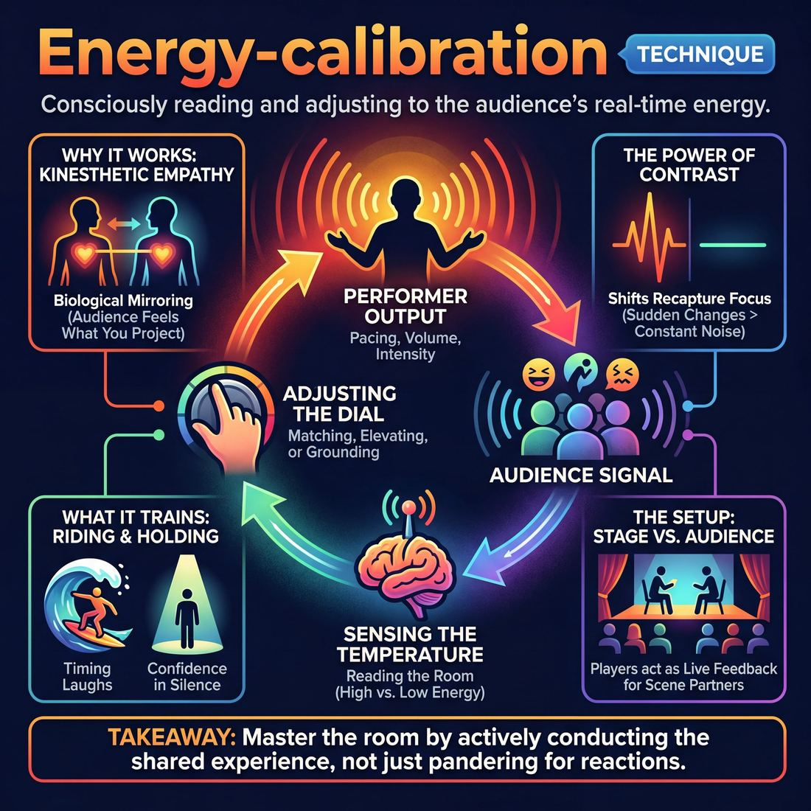

# 🎯 Energy-calibration

> *A drillable muscle that trains **Room Reading**.*

{ .infographic }

## 🎯 The essence

**Energy-calibration** is a targeted exercise where improvisers practice reading the current "temperature" of a room and deliberately adjusting their own performance output to match, elevate, or ground it. Instead of defaulting to a pre-set intensity or playing in a vacuum, performers must treat the audience's collective energy as a tangible scene partner. The single thing this technique trains is the conscious, real-time adjustment of pacing, volume, and emotional intensity—teaching players how to connect with a crowd and steer their momentum without ever resorting to pandering.

## 🎓 What it trains

Energy-calibration is a targeted workout for **Room Reading**—the vital improvisational skill of sensing and responding to the collective temperature of the audience. 

In the early stages of their development, improvisers often treat the audience as a passive wall. They play in a vacuum, which leads to **talking over laughs** (crushing the momentum of a great moment by speaking before the audience has finished reacting) or missing the subtle cues of a crowd leaning in for a quiet, dramatic beat. Conversely, when improvisers *do* notice the audience pulling away, they often panic under pressure and resort to **pandering**—chasing cheap, immediate laughs at the expense of the scene's reality.

This technique exists to solve that disconnect. It trains the improviser to treat the audience as a massive, breathing scene partner. Specifically, practicing energy-calibration builds three distinct muscles:

*   **Sensing the temperature:** Recognizing the difference between a rowdy, high-energy Friday night crowd and a thoughtful, attentive Sunday matinee, and adjusting your baseline performance energy to match or complement it.
*   **Riding the wave:** Moving beyond mechanically pausing for laughs. It teaches the precise timing of letting a laugh crest and speaking just as the energy begins to recede, keeping the momentum alive.
*   **Holding the tension:** Developing the confidence to sit in silence when the room is captivated, rather than rushing to fill the void with unnecessary dialogue out of nervous habit.

!!! abstract "The Deeper Principle"
    Ultimately, energy-calibration honors the performer-audience contract. It acknowledges that a show is a shared, live experience. By training this muscle, an improviser stops merely surviving the crowd's reactions and begins actively conducting them—moving toward the master level of unifying a fragmented room into a single organism that breathes and reacts together.

## 💡 Why it works

Energy-calibration works because it bypasses the audience's intellectual brain—the part tracking plot mechanics and character names—and speaks directly to their nervous system. It treats the room's attention not as a given right, but as a physical substance that must be actively managed.

!!! abstract "Key idea"
    Audiences do not just watch a show; they physically experience it through **kinesthetic empathy**. If performers are rushing, breathless, or projecting nervous energy, the audience feels anxious. If performers are grounded and deliberate, the audience relaxes. Energy-calibration exploits this biological mirroring.

The "engine under the hood" of this technique relies on three core dynamics:

*   **The Performer-Audience Feedback Loop:** Improvisation is a closed-loop system. The audience emits a continuous stream of signals (a collective lean forward, a restless cough, a roar of laughter), and the performer must catch those signals and adjust. By isolating energy as a conscious dial, improvisers stop broadcasting blindly and start *conversing* with the room's temperature.
*   **The Power of Contrast:** Human attention habituates rapidly to a constant stimulus. Ten minutes of high-octane screaming is just as numbing as ten minutes of monotone whispering. Energy-calibration utilizes contrast—a sudden drop to a whisper forces an audience to lean in, while a sudden explosion of movement releases built-up tension. The shift itself is what recaptures focus.
*   **Bypassing the "Invention" Trap:** When a scene feels dead, a novice's instinct is to invent new plot points or try to write better jokes on the fly. This spikes cognitive load and usually leads to panic. Energy-calibration offers a purely physical, non-narrative lever to pull. Changing the volume, pace, or physical intensity of the scene instantly alters the dynamic without requiring a single new idea.

!!! note "The 'Check Engine' Light"
    Think of the audience's energy as a dashboard indicator. When a room goes cold or restless, it is rarely because the *plot* is confusing; it is almost always because the *energy* is either stagnant or mismatched to the moment. Calibrating fixes the transmission, allowing the narrative to drive forward again.

## 🧩 The setup

To effectively drill Energy-calibration, you must create a clear division between the "stage" and the "house." The exercise relies on the off-stage players acting as a live, variable audience for the performers to read and adjust to.

*   **👥 Players & Group Size:** Full workshop group (ideally 8–16 players). 
*   **🎭 Arrangement:** 2 players on stage at a time. The rest of the group sits in the audience. 
*   **🛋️ Space & Materials:** A standard rehearsal room. You must break the traditional "workshop circle" and set up chairs in rows facing a clearly defined stage area to simulate a real theater environment.
*   **⏱️ Time:** 2–3 minutes per round (scene). 15–20 minutes total to ensure everyone gets at least one repetition on stage.
*   **✅ Prerequisites:** Comfort with basic two-person scenes and foundational stagecraft (projection, **cheating out**). Players should be at least at the *Advanced Beginner* stage, where they can maintain a scene while sparing some cognitive load to notice the room.

**The Roles**

*   **The Performers:** Play a standard two-person scene. Their primary technical goal is to actively sense the audience's energy and adjust their pacing, volume, and intensity to match or complement it—without breaking character or pandering.
*   **The Audience:** Acts as a dynamic, shifting variable. Before each scene, the facilitator will secretly instruct the audience to adopt a specific energy state (e.g., leaning in and giggly, low-energy and arms-crossed, or restless).
*   **The Facilitator:** Assigns the audience's energy state, calls the scenes, and side-coaches the performers to adjust their calibration if they are ignoring the room's temperature.

!!! tip "Setting the Space"
    Don't skip arranging the chairs into rows. The physical act of sitting in a "house" changes the off-stage players' posture from *supportive classmates* to *expectant audience members*, providing a much more authentic energy for the performers to read.

!!! quote "How to introduce it"
    "In improv, the audience is your third scene partner. You can't play a high-octane, screaming scene to a sleepy Sunday matinee crowd, and you can't play a whisper-quiet, slow-burn scene to a rowdy midnight college crowd without losing them. Today, we are practicing **Energy-calibration**. 
    
    Two of you will get on stage to do a scene. The rest of us are the audience. Before the scene starts, I will secretly give the audience a 'vibe' to project—maybe we're tired, maybe we're hyper, maybe we're easily distracted. If you are on stage, your job is to play your scene while keeping your sensors open to the room. Feel our energy, and adjust your performance to capture us. Don't pander, don't drop your scene—just calibrate your instrument to the room you're in."

## ⚙️ The mechanics

!!! abstract "The Core Objective"
    To instantly and deliberately adjust the intensity, pacing, volume, and emotional weight of a scene to match an external target—without breaking the reality of the scene. This builds the "muscle" required to surf a live audience's shifting energy.

The most reliable way to train this technique is through the **Energy Dial** (often called "1 to 10"). It isolates a performer's ability to calibrate their output on command, simulating the need to adjust to different crowd temperatures.

### The Flow of Play

1.  **The Baseline Initiation:** Two players take a suggestion and begin a standard scene. They establish their relationship, environment, and activity at a baseline energy level—a natural, conversational **"5"**. 
2.  **The Call:** After 30 to 60 seconds, the Facilitator (acting as the Caller) shouts a number between 1 and 10. 
    *   *1* represents near-stillness, micro-movements, and hushed tones.
    *   *10* represents maximum theatrical projection, explosive physicality, and high stakes.
3.  **The Instant Shift:** On the very next line of dialogue or physical action, the players must snap their performance to the called number. They do not change *what* the scene is about; they change *how* they are playing it.
4.  **The Hold (Simulating the Laugh):** To train audience-energy management, the Caller will occasionally shout **"Hold!"** The players must instantly freeze their dialogue and physical momentum—simulating holding for a massive audience laugh—and sustain that internal energy in silence.
5.  **The Release:** The Caller shouts **"Go!"** The players must resume the scene at the exact energy level they were at before the hold, without dropping the tension or talking over the "tail end" of the simulated laugh.
6.  **The Reset:** The Caller continues to bounce the players between extremes (e.g., "Drop to a 2!" then "Spike to a 9!") for three to four minutes before calling scene.

!!! example "In a scene"
    Two players are playing coworkers organizing a supply closet. 
    
    **At a 4 (Baseline):** They are casually tossing binder clips into a bin, speaking at a normal conversational volume about their weekend.
    
    **The Caller:** "Jump to an 8!"
    
    **At an 8 (Calibrated):** The physical stakes skyrocket. They are now hurling the binder clips into the bin with frantic precision. Their voices project to the back wall, and the conversation about the weekend sounds like a matter of life and death, though the actual words remain the same.

### Rules & Constraints

*   **Maintain the reality:** A "10" does not mean screaming nonsense or abandoning the scene's truth. It means a 10 *for that specific context*. A "10" in a library scene is furious, full-body, high-stakes whispering. 
*   **Full-body calibration:** Energy is not just volume. Players must calibrate their posture, the speed of their object work, their eye contact, and their emotional intensity.
*   **No ramping:** The shift must be instantaneous. If the Caller asks for a 9, the players cannot slowly build from a 5 to a 6 to a 7. The very next syllable spoken must be at a 9.

!!! tip "On stage"
    When holding for a laugh (Step 4), do not go entirely dead. Keep your eyes alive and maintain your physical posture. You are pausing the *progression* of the scene, but you are still actively holding the *energy* of the room. If you drop your character's internal tension during a laugh, you will have to work twice as hard to win the audience back when you speak again.

## 🎬 Sample round

!!! example "Sample round: The Post-Lunch Crowd"
    In this drill, the coach has instructed the "audience" (the rest of the workshop) to simulate a low-energy, slightly sluggish room—the classic "post-lunch dip." Two improvisers, Alex and Sam, step up to initiate a scene. 
    
    Notice how they avoid the common trap of immediately yelling to wake the room up, and instead use Energy-calibration to meet the audience and gently pull them forward.

    **Alex:** *(Walks to center stage, takes a deliberate two-second pause, looking out at the sluggish room.)*  
    **[Assess the Baseline]** Alex reads the low energy. The room is quiet but unengaged.

    **Alex:** *(Sighs heavily, leaning on an imaginary shovel. Speaks with a grounded, weary tone.)* "Dirt's heavy today, boss."  
    **[Match to Connect]** Instead of coming in at a frantic, jarring Level 10, Alex chooses an energy level just *slightly* above the audience's baseline. They validate the room's lethargy through the character's physicality.

    **Sam:** *(Enters with a slightly crisper posture, bumping the energy dial up exactly one notch.)* "It's the humidity, Jenkins. But if we don't find this time capsule, the mayor's gonna have our badges."  
    **[Contrast to Elevate]** Sam accepts the grounded reality but injects a clear, absurd stake. The contrast in Sam’s crispness begins to pull the audience's attention upward.

    **Alex:** *(Senses the audience leaning in. Increases physical pace, digging faster, raising vocal intensity.)* "I didn't go to shovel academy for four years to get busted down to a trowel cop."  
    *(The audience chuckles, the energy in the room visibly lifting.)*  
    **[Observe and Adjust]** Alex feels the room "catch" the premise. They accelerate the pacing to capitalize on that momentum.

    **Sam:** *(Freezes completely, holding a stern expression. Waits for the chuckle to peak and begin to fade, then drops their volume to an intense whisper.)* "Keep digging. I think I hear ticking."  
    **[Ride and Unify]** Sam demonstrates maturity. Instead of talking over the laugh, they hold the space. By dropping to a whisper immediately after a laugh, Sam forces the newly-awakened audience to lean in together, unifying their focus.

## 🎚️ Variations & progressions

To build the muscle of Room Reading and audience-energy management, this technique can be scaled from basic internal control to advanced, real-time audience manipulation. 

Here is how to ramp the difficulty as players move through the maturity stages:

*   **The 1-to-10 Dial (Novice to Advanced Beginner)**
    Instead of relying on the audience, the coach acts as the external gauge. While a scene is happening, the coach calls out numbers from 1 to 10. The players must instantly calibrate their energy output—volume, pacing, emotional intensity, and physical footprint—to match the number. 
    *   *Goal:* Prevents the novice tendency to panic under pressure by proving they have conscious control over their output. It also trains them to project and cheat out even at a "Level 2" energy.
*   **The Surrogate Vibe (Competent)**
    The backline (or the rest of the class) acts as the audience and is secretly assigned a specific, unspoken energy state before the scene begins (e.g., restless, leaning in, tense, or lethargic). The players on stage must read the room's general temperature and calibrate their scene to either match it or deliberately contrast it to pull focus.
    *   *Goal:* Moves players away from mechanical adjustments and forces them to actively read the room without being told what the room is doing.
*   **Surfing the Wave (Proficient)**
    The backline provides deliberate, exaggerated vocal reactions—rolling laughter, sudden gasps, or dead silence. The players must practice the mechanics of holding for the reaction. 
    *   *Goal:* Cures the habit of talking over laughs and killing momentum. Players learn to surf the energy wave, pausing while the laugh crests, and re-engaging the exact moment the energy begins to recede.
*   **The Fragmented Room (Master)**
    The ultimate stress test. The backline acts as a divided, distracted audience—some are whispering, some are looking away, some are mildly amused. The players must use their energy calibration, pacing, and perhaps deliberate direct address to unify the room. 
    *   *Goal:* Converts a fragmented audience into one organism breathing together. The observable win is when the entire backline naturally synchronizes into collective silence or laughter.

!!! tip "On stage: Energy does not equal volume"
    When ramping up to a Level 9 or 10, improvisers often just yell and run around. True high energy can be a whisper delivered with terrifying, laser-focused intensity. Calibrate the *tension* and *presence*, not just the decibels.

!!! warning "Watch out for pandering"
    As players progress to the "Surfing the Wave" variation, they may start chasing the laughs rather than playing the scene. Remind them that adjusting tone to the crowd is a tool for clarity and connection, not an excuse to abandon the reality of the scene for a cheap punchline.

## 🧑‍🏫 Coaching notes

When coaching Energy-calibration, your primary goal is to shift the improviser's awareness outward. They must stop playing exclusively to their scene partner and start playing to the living, breathing organism sitting in the dark. You are training them to treat the audience's energy as a tangible scene partner.

!!! tip "Coaching: The Golden Cue"
    **"Play the room you have, not the room you want."**  
    This is the single most important reminder you can give. Improvisers cannot force a quiet Sunday matinee crowd to react like a rowdy Friday midnight crowd. The technique is about diagnosing the *actual* temperature of the room and calibrating to it, rather than bulldozing through with a pre-planned intensity.

### In-the-Moment Side-Coaching
Use these short, punchy directives while the improvisers are on their feet to help them adjust their dials in real time:

*   **"Hold... hold... now go."** Use this when an improviser tries to speak over a laugh or a gasp. You are training the mechanical muscle of pausing so it eventually becomes an intuitive rhythm.
*   **"Make them lean in."** Call this out when the room is restless, distracted, or chatty. It prompts the improvisers to drop their volume and slow their pace, forcing the audience to quiet down and pay attention.
*   **"Match the spike!"** When the audience gives a sudden burst of energy (a cheer, a loud groan, a massive laugh), the performers should elevate their stakes, volume, or physicality to meet that wave before it dissipates.
*   **"Check the temperature."** A general prompt to get improvisers out of their heads and ask themselves: *Are they with us? Are we losing them?*

### What 'Good' Looks and Sounds Like
You will know the technique is taking root when you observe these specific behaviors on stage:

*   **The Freeze:** Performers hold a physical tableau—without dropping character or breaking tension—while the audience laughs. They resume their dialogue the exact millisecond the laughter crests and begins to fade, never stepping on the reaction.
*   **The Contrast:** You will see deliberate, sharp shifts. If the room is chaotic, the performers might drop to a deadpan whisper. If the room is sleepy, they might shatter the silence with a sudden, justified physical explosion. 
*   **The Acknowledgment:** A subtle, in-character shift in posture or timing that tells the audience, "We heard that reaction, and we are riding it with you," without ever breaking the reality of the scene to pander.

!!! warning "Watch out for 'Energy Panicking'"
    Novice improvisers often confuse a quiet audience with a failing scene. Their instinct is to become louder, faster, and more manic to "wake them up." Side-coach them to do the exact opposite: **"Ground yourself. Slow down. Live in the silence."** True calibration sometimes means meeting a quiet room with intense, grounded focus rather than frantic clowning.

## 🧭 Debrief & reflection

The goal of this debrief is to translate the abstract, often overwhelming feeling of "audience energy" into concrete, observable mechanics. Because energy can feel entirely subjective, the coach must guide players to connect their internal physical sensations with the external reactions of the room.

Use these questions immediately after a round to lock in the learning:

*   **"Where did you feel the audience's attention peak, and what were you doing physically or vocally in that exact moment?"** (Forces players to link audience engagement to a specific, repeatable choice).
*   **"Did you notice a moment where you tried to *force* the energy rather than *ride* it? How did that feel in your body?"** (Helps players identify the physical sensation of pushing or panicking under pressure).
*   **"When the room went quiet, did it feel like a 'dead' quiet or a 'listening' quiet? How did you adjust?"** (Trains the vital distinction between losing the crowd and holding them in suspense).
*   **"When you shifted your pacing or volume, how long did it take for the room to follow you?"** (Builds awareness of the slight delay between a performer's calibration and the audience's response).

### What a good debrief surfaces

A successful reflection moves players away from vague, externalized complaints (e.g., *"The crowd was just low-energy today"*) and toward actionable, internal adjustments (e.g., *"The crowd was quiet, so I slowed my pacing down to draw them in, rather than yelling to wake them up"*). 

You will know the exercise is working when players begin to articulate the difference between pandering and calibrating. Novice players often confuse the two, believing that adjusting to the room means abandoning the scene to beg for a laugh. A strong debrief helps them realize that calibration is simply changing the *delivery system* of the scene so the audience can properly receive it.

!!! tip "Coach's ear"
    Listen for players discovering that "high energy" does not exclusively mean "loud and fast." Celebrate the moment a player realizes that a slow, intense, whispered line can command a room just as powerfully as a shout. This is the breakthrough where they stop fighting the room's current and start surfing it.

## ⚠️ Common pitfalls

!!! warning "Watch out: Pandering is not calibrating"
    The most common novice trap is confusing Energy-calibration with chasing approval. When a room feels cold, the panic response is often to drop the scene's reality, break character, or go for a cheap, loud joke. This is pandering. You are reacting to their silence with desperation, rather than adjusting your energetic output to confidently invite them back in. 

When cognitive load is high—usually because you are struggling to figure out "what the scene is about"—your awareness of the room is the first thing to drop. Here is how energy-calibration typically breaks down under pressure, and how to fix it:

*   **The Runaway Train (Talking over laughs):** 
    *   *The Trap:* A novice gets a great reaction but is so focused on delivering their next idea that they plow right through the audience's laughter, killing the momentum and training the crowd to stay quiet.
    *   *The Fix:* Treat the audience's laughter as a scene partner who is currently speaking. **Ride the wave.** Stay in character, hold your physical intention, and breathe. Do not speak until the laugh begins to crest and roll back down.
*   **The Mirror Trap (Matching dead energy):** 
    *   *The Trap:* If it is a rainy Tuesday and the crowd is lethargic, improvisers often unconsciously absorb and reflect that low energy, resulting in a sluggish, quiet set. 
    *   *The Fix:* Calibration does not always mean *mimicry*; sometimes it means providing the antidote. If the room is heavy, calibrate by bringing crisp, grounded, slightly elevated pacing. If the room is a chaotic, rowdy late-night crowd, calibrate by bringing intense, quiet focus to force them to lean in.
*   **The Physical Retreat (Turtling):** 
    *   *The Trap:* When the room's energy feels intimidating or unresponsive, the body's natural defense mechanism is to close off. The improviser stops cheating out (angling their body so the audience can see their face) and turns fully inward toward their scene partner, mumbling into the upstage wall.
    *   *The Fix:* Use your physical posture as a manual override. When you feel the urge to hide, deliberately plant your downstage foot and open your chest to the house. Projecting your voice and opening your body will often trick your brain into feeling the confidence you need to re-engage the room.

!!! tip "On stage: The 'Check-In' Breath"
    If you feel yourself losing the room, do not speed up. Take a deliberate, in-character breath. Use that one second of silence to actually *look* at your scene partner and *listen* to the ambient sound of the room. That single breath is often enough to reset your internal metronome and recalibrate to the space.

## 🌟 What mastery looks like

At the highest level of practice, Energy-calibration transcends simply matching the volume or speed of a scene partner. A master improviser uses this technique to **unify the room**, converting a fragmented audience of individuals into a single organism that breathes, laughs, and gasps together. 

When observing an improviser who has mastered this technique, you will see several distinct behaviors:

*   **Conducting, not just reacting:** They do not merely absorb the room's energy; they gently take the reins. They treat the audience's energy like an instrument, knowing precisely when to match it to build rapport, and when to contrast it to shift the mood.
*   **Flawless timing:** They ride audience reactions effortlessly. They know exactly when to hold for a laugh, when to speak *through* the tail end of a laugh to build momentum, and when to let a silence stretch to pull the audience to the edge of their seats.
*   **High energy without panic:** When calibrating to a "Level 10" energy, their physical and vocal choices remain precise and deliberate. They project intense vitality without ever bleeding into frantic, uncontrolled flailing.
*   **Low energy without dying:** When calibrating to a "Level 1" energy, they maintain massive internal stakes and stage presence. The volume drops, but their theatrical magnetism actually increases.

!!! example "In a scene"
    A rowdy Saturday night crowd is buzzing with chaotic, unfocused energy. Instead of trying to shout over them—which only trains the audience to be louder—the master improviser steps downstage, drops their volume to a resonant, intense whisper, and slows their movements. The audience instinctively leans in, physically quieting down to catch the dialogue. The improviser has calibrated *against* the room's chaos to capture it, unifying the crowd's focus in seconds.

!!! abstract "The Ultimate Metric: Synchronized Timing"
    You know mastery of energy-calibration has been achieved when you observe **synchronized collective timing**. The audience stops reacting as a scattershot collection of individual chuckles, whispers, and coughs. Instead, they respond as one entity—inhaling sharply at the exact same moment, or erupting into a unified laugh that crests and falls in perfect unison.

## 🔗 Why it matters

If Room Reading is the diagnosis—noticing that a rainy Tuesday night crowd is sluggish and leaning back—then Energy-calibration is the treatment. It is the vital bridge between sensing an audience's state and actively adjusting your performance to meet it. 

This technique directly serves the ultimate goal of **The Audience** domain: honoring the performer–audience contract. An audience needs to trust that the performers are in control of the room. When you calibrate your energy to acknowledge theirs—perhaps starting a scene with quiet, grounded intensity for a sleepy house, rather than blasting them with unearned, manic yelling—you build immediate trust. You prove that you are doing a show *with* them, not just *at* them. 

Crucially, this is how you manage a crowd without pandering. You aren't changing *what* your scene is about to please them; you are adjusting *how* you deliver it so they can properly receive it.

!!! abstract "The Mirror and the Magnet"
    Effective energy-calibration works in two phases. First, you act as a **mirror**, matching the room's baseline energy so they feel safe and understood. Then, you become a **magnet**, slowly pulling their energy toward the level the show requires. You cannot be the magnet until you have successfully been the mirror.

Beyond audience management, mastering this muscle ripples through the wider craft of improvisation:

*   **Expands dynamic range:** It forces improvisers out of their default performance gears. If your default is "loud and fast," calibrating to a quiet room forces you to discover the power of silence and subtlety.
*   **Aligns the ensemble:** When an entire team calibrates to the room simultaneously, the show feels incredibly cohesive. The ensemble breathes as one organism, which makes the audience feel safe enough to breathe with them.
*   **Protects the show's momentum:** By recognizing when the room is overwhelmed and needs a breather, or when they are restless and need a spike in pacing, you prevent the show from flatlining. You learn to surf the waves of the crowd rather than swimming against the current.

## 📚 References & Further Reading

### Foundational sources
*   **Viola Spolin, *Improvisation for the Theater* (Northwestern University Press, 1963)** — The foundational text that first framed the audience not as passive observers, but as active participants and a vital part of the group dynamic. Spolin’s concept of "experiencing" lays the groundwork for understanding how an audience physically shares in the performance.
*   **Keith Johnstone, *Impro for Storytellers* (Faber and Faber, 1999)** — Explores the concept of the audience as a "large, intelligent beast that needs to be tickled." Johnstone explicitly warns improvisers not to be misled by cheap laughter from a vocal minority, but to actively read the room's true, collective energy and adjust accordingly.

### Practitioner guides & manuals
*   **Mick Napier, *Improvise: Scene from the Inside Out* (Heinemann Drama, 2004)** — Focuses heavily on finding the dominant energy of a scene and doing something physical to change the dynamic. Napier argues for projecting power rather than fear, which directly influences the audience's comfort and engagement.
*   **Will Hines, *How to Be the Greatest Improviser on Earth* (Pretty Great Publishing, 2016)** — Breaks down the mechanics of being present and the power of pausing. Hines explains how to become the most riveting person on stage simply by honestly communicating the current moment's energy and allowing the audience space to react.
*   **Matt Besser, Ian Roberts, and Matt Walsh, *The Upright Citizens Brigade Comedy Improvisation Manual* (Comedy Council of Nicea, 2013)** — Details the technical mechanics of holding for laughs, pacing, and using object work to maintain audience attention while the improviser processes the scene's momentum and the crowd's reaction.

### Lineage & teachers
*   **The Annoyance Theatre (Chicago)** — Founded by Mick Napier, this theater's training philosophy heavily emphasizes individual energy, physical commitment, and breaking traditional rules to connect directly with the audience's visceral experience rather than their intellectual understanding.
*   **The Loose Moose Theatre Company (Calgary)** — Founded by Keith Johnstone, this is the birthplace of Theatresports—a format that inherently relies on direct audience feedback, reading the room, and adjusting to the crowd's immediate reactions to avoid losing their attention.

### Research & theory
*   **Dee Reynolds and Matthew Reason, *Kinesthetic Empathy in Creative and Cultural Practices* (Intellect Books, 2012)** — Explores how audiences physically and neurologically mirror the movements and energy of performers, providing the scientific basis for why energy-calibration works and how tension is transferred from stage to house.
*   **Laura Rai, Guido Orgs, et al., *Interpersonal neural synchrony during live dance performance* (2024)** — A neuroscientific study demonstrating that live theatrical events induce spontaneous audience entrainment and physiological synchrony, proving the audience literally acts as a collective, breathing organism.
*   **Wanda Strukus, *Mining the Gap: Physically Integrated Performance and Kinesthetic Empathy* (Journal of Dramatic Theory and Criticism, 2011)** — An academic paper discussing the relationship between audience and performer through the lens of cognitive science, mirror neurons, and the automatic, involuntary kinesthetic responses of the crowd.

### Talks, videos & courses
*   **Jimmy Carrane, *Improv Nerd* (Podcast)** — Features hundreds of live interviews with working improvisers discussing the philosophy of reading the room, connecting with the audience, and managing the realities of live performance energy without pandering.
*   **Keith Johnstone, *Don't Do Your Best* (TEDxYYC, 2016)** — A recorded lecture where Johnstone discusses the importance of being present, not forcing the funny, and interacting truthfully with the audience's actual state rather than a preconceived idea of what they want.

### Communities & adjacent reading
*   **Rob Norman and Adam Cawley, *The Backline Podcast*** — A highly regarded audio resource for advanced improv philosophy, frequently discussing pacing, audience expectations, and how to manage scene dynamics when the room's energy shifts.
*   **Peter Brook, *The Empty Space* (MacGibbon & Kee, 1968)** — A seminal theatre text that strips performance down to its core: a person walking across a stage while someone else watches. It is essential reading for understanding the performer-audience feedback loop and the baseline tension of live performance.
*   **Erving Goffman, *The Presentation of Self in Everyday Life* (Anchor Books, 1959)** — A foundational sociological text (often cited by Johnstone) regarding how audiences impute meaning and how performers manage their front-stage energy, status, and the performer-audience contract.

## 💬 Quotes & Anecdotes

!!! quote "— Del Close, as recalled by Adam McKay"
    Treat the audience like poets and geniuses, and that's what they'll become.

!!! quote "— Keith Johnstone, *Impro for Storytellers* (1999)"
    The audience doesn't like players who seem stressed. They want you to be visibly in control. Theatre is an expression of vitality, but it's also a cave where human beings should feel secure.

!!! quote "— Patricia Ryan Madson, *Improv Wisdom* (2005)"
    Don't confuse this with being a 'yes-man,' implying mindless pandering. Saying yes is an act of courage and optimism; it allows you to share control.

!!! quote "— Tina Fey, *Bossypants* (2011)"
    I was so used to trying to win the audience over or just get permission to be there that a willing audience was an incredible luxury. It was like having a weight lifted off you.

### Where it comes from
The concept of treating the audience as a living, breathing scene partner—and actively managing their energy—has roots in the earliest days of improvisational theater. Viola Spolin emphasized that the audience is an active participant in the "game" of theater, not a passive wall. Later, Keith Johnstone codified the idea that audiences physically mirror the performers' state (kinesthetic empathy), noting that if improvisers are stressed or rushing, the audience feels anxious, but if they are grounded, the audience feels secure. Del Close pushed this further by demanding improvisers never pander for cheap laughs, famously instructing his students to play to the top of their intelligence and treat the audience as "poets and geniuses."

### A telling example
**Riding the wave (The "Laugh Crest" Scenario)**
A classic illustrative scenario of energy-calibration happens when a performer learns to "ride a laugh." Novice improvisers often panic when they get a huge laugh, either freezing awkwardly or immediately talking over the noise, which kills the momentum and frustrates the crowd. In a calibration drill, the performer is coached to hold their physical position and wait for the exact moment the laugh begins to crest and recede. By speaking *just* as the energy drops, they catch the audience's attention again, seamlessly pulling them into the next beat. This physical, non-verbal adjustment proves that the improviser is in control of the room's temperature, rather than being overwhelmed by it.

## 🧭 Explore the framework

- ⬆️ **Skill it trains:** [Room Reading](05_S1__room-reading.md)
- 🎭 **Domain:** [The Audience](05_D__the-audience.md)
- 🔁 **Sibling techniques:** [Reading the suggestion's intent](05_S1_T2__reading-the-suggestion-s-intent.md)
